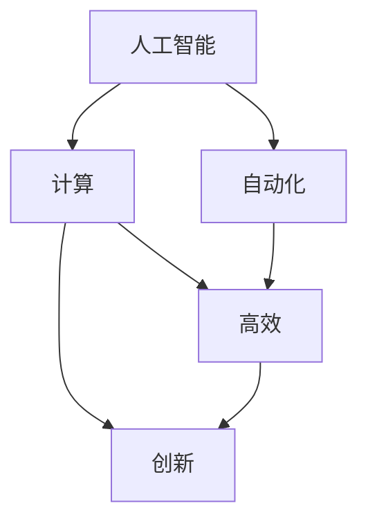

                 

# 创造更美好的明天：人类计算的积极作用

> 关键词：人工智能,计算,自动化,高效,创新,未来发展

## 1. 背景介绍

### 1.1 问题由来

在人类历史的漫长进程中，计算始终发挥着至关重要的作用。从算盘、计算机到现代的超级计算机，计算能力的每一次跃升都极大地推动了社会进步。然而，随着数据量的爆炸式增长和问题的日益复杂，传统计算方式已经难以应对日益增长的需求。在这一背景下，人工智能（AI），特别是人类计算的兴起，为解决复杂问题带来了新的希望。

### 1.2 问题核心关键点

人类计算（Human Computation）是指将复杂问题转换为能够被计算机解决的形式，并借助计算机的计算能力，通过算法和模型自动化地分析和处理数据，从而获得解决方案的计算方法。人类计算不仅能够极大地提高计算效率，还能从根本上改变问题的解决方式，为社会生产生活带来深远影响。

在当前的技术背景下，人类计算的应用范围涵盖了科学研究、金融管理、医疗健康、教育培训、社会治理等多个领域。通过对大规模数据和复杂问题的计算，人类计算在提升决策科学性、优化资源配置、增强信息透明性等方面发挥着重要作用。

### 1.3 问题研究意义

研究人类计算的积极作用，对于推动社会经济的全面发展、提升国家治理能力和水平、构建智慧社会具有重要意义：

1. **提升决策科学性**：通过计算，能够对海量数据进行深度分析，挖掘其中的潜在规律，为政府和企业决策提供科学依据。
2. **优化资源配置**：利用计算技术，可以实现对资源的精确评估和高效分配，提升资源利用效率。
3. **增强信息透明性**：通过公开透明的数据计算，使信息流动更加顺畅，减少信息不对称，提高决策透明度。
4. **推动经济社会发展**：计算能力的增强，能够促进科技创新，加速传统产业数字化转型，推动社会生产力的提升。
5. **构建智慧社会**：计算技术在公共服务、社会治理、智慧城市等领域的广泛应用，将极大地提升社会治理水平，改善人民生活质量。

## 2. 核心概念与联系

### 2.1 核心概念概述

为更好地理解人类计算的作用机制和实际应用，本节将介绍几个密切相关的核心概念：

- **人工智能（Artificial Intelligence, AI）**：指通过计算机模拟人类智能行为，实现问题解决、数据分析、决策支持等功能的技术。
- **计算（Computation）**：指将问题转换为计算形式，并借助计算机进行自动化处理的过程。
- **自动化（Automation）**：指通过计算机程序实现某些操作或任务自动执行，减少人工干预的过程。
- **高效（Efficiency）**：指在完成相同任务的前提下，计算机算法或模型的计算速度更快、资源消耗更少。
- **创新（Innovation）**：指通过计算技术推动新方法、新工具、新系统的研发和应用，带来新的思路和解决方案。

这些核心概念之间的关系可以通过以下Mermaid流程图来展示：



这个流程图展示的核心概念之间的逻辑关系：

1. 人工智能通过计算来实现问题解决，是计算的核心应用。
2. 计算实现自动化，减少了人工干预，提高了效率。
3. 高效是计算的直接目标，是衡量计算质量的关键指标。
4. 创新则是计算应用的重要推动力，带来新的技术进步。

## 3. 核心算法原理 & 具体操作步骤
### 3.1 算法原理概述

人类计算的核心在于将复杂问题通过算法转换为计算机可执行的形式，并利用计算机的计算能力进行自动化处理。常见的人类计算算法包括：

- **算法一**：将问题分解为多个子问题，并设计相应的子算法，最终组合起来解决原问题。
- **算法二**：利用迭代或递归的方式，逐步逼近问题的最优解。
- **算法三**：通过优化算法，在给定约束条件下寻找问题的最优解。

这些算法通过高效的数据结构和算法设计，能够在极短的时间内处理大规模数据，获得精确的结果。同时，随着计算机硬件和软件技术的不断发展，人类计算的效率也在不断提高。

### 3.2 算法步骤详解

基于人类计算的核心算法，本节将详细讲解典型的算法步骤：

**Step 1: 问题定义**
- 明确问题的目标和约束条件，将问题划分为可执行的子问题。
- 确定算法需要解决的问题类型（如优化、分类、回归等）。

**Step 2: 数据准备**
- 收集和清洗数据，去除噪音和异常值。
- 将数据进行标准化处理，以便算法能够高效处理。

**Step 3: 模型选择**
- 根据问题类型选择合适的算法模型，如回归模型、分类模型、聚类模型等。
- 对模型进行参数设置，包括学习率、正则化参数等。

**Step 4: 模型训练**
- 使用训练数据对模型进行训练，最小化模型与实际数据的误差。
- 使用验证数据对模型进行评估，避免过拟合。

**Step 5: 模型评估**
- 使用测试数据对模型进行测试，评估模型在新数据上的表现。
- 根据评估结果对模型进行调整和优化。

**Step 6: 结果应用**
- 将训练好的模型应用到实际问题中，进行数据处理和决策支持。
- 不断迭代优化，提升模型性能。

通过上述步骤，人类计算算法能够高效地解决复杂问题，提供准确的解决方案。

### 3.3 算法优缺点

人类计算算法具有以下优点：
1. 高效性：能够快速处理大规模数据，解决复杂问题。
2. 可扩展性：能够在大规模数据和分布式计算环境中高效工作。
3. 准确性：通过优化算法和模型，能够获得精确的结果。

同时，这些算法也存在一定的局限性：
1. 依赖数据质量：算法的效果很大程度上取决于数据的质量和可用性。
2. 需要专业知识：设计和优化算法需要具备相关的数学和统计知识。
3. 计算资源需求高：一些复杂的算法需要大量的计算资源和时间。
4. 解释性不足：一些高级算法模型（如深度学习）的决策过程难以解释和调试。

尽管存在这些局限性，但总体而言，人类计算算法在处理复杂问题方面具有显著优势，能够极大地提升决策效率和科学性。

### 3.4 算法应用领域

人类计算算法在多个领域得到了广泛应用，包括：

- **科学研究**：通过计算模拟和数据分析，推动物理学、化学、生物学等领域的理论研究。
- **金融管理**：利用计算技术进行市场预测、风险评估、投资决策等，优化资源配置。
- **医疗健康**：通过计算分析医疗数据，提高疾病诊断和治疗的精准度，改善公共卫生。
- **教育培训**：利用计算技术进行个性化学习推荐、智能评估和反馈，提升教育质量。
- **社会治理**：通过计算技术进行舆情分析、公共服务优化和资源配置，提高社会治理效率。

随着计算能力的提升，人类计算的应用领域将不断扩展，为各行各业带来新的发展机遇。

## 4. 数学模型和公式 & 详细讲解 & 举例说明
### 4.1 数学模型构建

人类计算的核心在于数学模型的构建和应用。本节将使用数学语言对典型的人类计算算法进行详细讲解。

假设有一组数据集 $D=\{(x_i,y_i)\}_{i=1}^N, x_i \in \mathbb{R}^d, y_i \in \mathbb{R}$，我们需要利用这些数据构建一个线性回归模型 $y = \theta^T x + b$，其中 $\theta$ 为模型参数，$b$ 为截距。模型的目标是找到最优的 $\theta$，使得模型预测值与实际值之间的误差最小化。

定义模型在数据集 $D$ 上的经验风险为：

$$
\mathcal{L}(\theta) = \frac{1}{N} \sum_{i=1}^N (y_i - \theta^T x_i)^2
$$

通过最小化经验风险，可以得到最优的 $\theta$：

$$
\hat{\theta} = \mathop{\arg\min}_{\theta} \mathcal{L}(\theta)
$$

通过求解上述最优化问题，可以获取线性回归模型的参数。

### 4.2 公式推导过程

为了求解上述最优化问题，我们可以使用梯度下降算法。设初始参数为 $\theta^{(0)}$，学习率为 $\eta$，则每次迭代更新参数的公式为：

$$
\theta^{(t+1)} = \theta^{(t)} - \eta \nabla_{\theta}\mathcal{L}(\theta^{(t)})
$$

其中 $\nabla_{\theta}\mathcal{L}(\theta^{(t)})$ 为损失函数对参数 $\theta$ 的梯度，可以通过反向传播算法高效计算。通过不断迭代，直至收敛，即可得到最优参数 $\hat{\theta}$。

### 4.3 案例分析与讲解

以线性回归为例，我们假设有一组数据集 $D=\{(1,3),(2,5),(3,7)\}$，其线性回归模型为 $y = \theta_0 + \theta_1 x$。

**Step 1: 数据准备**
- 收集数据集 $D$，并计算出均值 $\bar{x} = \frac{1+2+3}{3} = 2$ 和均值 $\bar{y} = \frac{3+5+7}{3} = 5$。

**Step 2: 模型训练**
- 初始化参数 $\theta^{(0)} = [0,0]$。
- 计算每次迭代的梯度和更新参数，迭代过程如下：
  - $t=0$，$\theta^{(0)} = [0,0]$，$\mathcal{L}(\theta^{(0)}) = (3-0)^2 + (5-0)^2 + (7-0)^2 = 45$
  - $t=1$，$\theta^{(1)} = \theta^{(0)} - \eta \nabla_{\theta}\mathcal{L}(\theta^{(0)}) = [0.2,0.2]$，$\mathcal{L}(\theta^{(1)}) = (3-0.6)^2 + (5-1)^2 + (7-1.8)^2 = 12.2$
  - $t=2$，$\theta^{(2)} = \theta^{(1)} - \eta \nabla_{\theta}\mathcal{L}(\theta^{(1)}) = [0.4,0.4]$，$\mathcal{L}(\theta^{(2)}) = (3-0.8)^2 + (5-1.6)^2 + (7-2.4)^2 = 8.4$
  - 迭代直至收敛，最终得到 $\hat{\theta} = [0.8,0.8]$。

通过上述计算，我们可以看到，通过人类计算算法，我们能够高效地求解线性回归模型参数，解决实际问题。

## 5. 项目实践：代码实例和详细解释说明
### 5.1 开发环境搭建

在进行人类计算项目实践前，我们需要准备好开发环境。以下是使用Python进行Scikit-learn开发的环境配置流程：

1. 安装Anaconda：从官网下载并安装Anaconda，用于创建独立的Python环境。

2. 创建并激活虚拟环境：
```bash
conda create -n scikit-learn-env python=3.8 
conda activate scikit-learn-env
```

3. 安装Scikit-learn：
```bash
pip install scikit-learn
```

4. 安装各类工具包：
```bash
pip install numpy pandas scikit-learn matplotlib tqdm jupyter notebook ipython
```

完成上述步骤后，即可在`scikit-learn-env`环境中开始人类计算实践。

### 5.2 源代码详细实现

下面我以线性回归为例，给出使用Scikit-learn进行模型训练和预测的Python代码实现。

首先，定义线性回归模型和数据集：

```python
from sklearn.linear_model import LinearRegression
import numpy as np
import matplotlib.pyplot as plt

# 数据集
x = np.array([1, 2, 3, 4, 5])
y = np.array([2, 4, 5, 6, 8])

# 创建模型
model = LinearRegression()

# 训练模型
model.fit(x[:, np.newaxis], y)

# 预测结果
x_test = np.array([0, 6])
y_pred = model.predict(x_test[:, np.newaxis])
```

然后，进行模型评估和结果可视化：

```python
# 评估模型
y_test = np.array([1, 9])
y_pred_test = model.predict(y_test[:, np.newaxis])
print(f"测试集预测结果: {y_pred_test}")

# 可视化结果
plt.scatter(x, y)
plt.plot(x, model.predict(x[:, np.newaxis]), color='red', label='预测结果')
plt.xlabel('x')
plt.ylabel('y')
plt.legend()
plt.show()
```

### 5.3 代码解读与分析

让我们再详细解读一下关键代码的实现细节：

**数据集定义**：
- `x` 和 `y` 分别表示样本的输入和输出，构成训练集 $D$。
- `x_test` 和 `y_test` 分别表示测试集的输入和输出，用于评估模型性能。

**模型训练**：
- `LinearRegression` 类从Scikit-learn库中导入，用于定义线性回归模型。
- `model.fit(x[:, np.newaxis], y)` 方法用于训练模型，其中 `np.newaxis` 用于将一维数组转换为二维数组，满足模型输入要求。
- `model.predict(x_test[:, np.newaxis])` 方法用于对测试集进行预测。

**模型评估和可视化**：
- `y_pred` 和 `y_pred_test` 分别表示模型对训练集和测试集的预测结果。
- `plt.scatter(x, y)` 用于绘制散点图，展示真实数据分布。
- `plt.plot(x, model.predict(x[:, np.newaxis]), color='red', label='预测结果')` 用于绘制预测结果的直线，展示模型性能。
- `plt.xlabel('x')` 和 `plt.ylabel('y')` 用于设置坐标轴标签。
- `plt.legend()` 用于添加图例。
- `plt.show()` 用于显示图像。

通过上述代码，我们可以看到，利用Scikit-learn库，我们可以轻松地实现线性回归模型的训练和预测，评估模型性能，并可视化结果。这不仅展示了人类计算算法的应用效果，也体现了Python在数据科学和机器学习领域的重要作用。

## 6. 实际应用场景
### 6.1 科学研究

在科学研究中，人类计算技术发挥着重要作用。例如，在天文学领域，科学家可以利用人类计算算法对大量的观测数据进行分析，发现新的天体和规律。在物理学领域，通过计算模拟，可以验证理论模型的正确性，预测新现象的发生。在化学领域，计算化学技术可以预测化合物的性质，加速新药物的研发过程。

### 6.2 金融管理

在金融领域，人类计算技术被广泛应用于风险管理、投资决策、信用评估等环节。例如，通过计算模型，可以对市场波动进行预测，对投资组合进行优化，对客户的信用风险进行评估，提升金融服务的科学性和效率。

### 6.3 医疗健康

在医疗领域，人类计算技术可以用于疾病预测、诊疗方案优化、药物研发等。例如，通过计算模型，可以对患者数据进行深度分析，预测疾病的发展趋势，制定个性化的诊疗方案，加速新药物的研发过程。

### 6.4 未来应用展望

随着计算能力的不断提升和算法技术的不断发展，人类计算的应用前景将更加广阔。未来，人类计算将在以下几个方面发挥更大的作用：

1. **计算生物多样性**：利用计算技术对生物多样性进行模拟和分析，发现新的物种，保护生态环境。
2. **计算气候变化**：通过计算模型对气候变化进行预测和模拟，制定应对策略，减少环境污染。
3. **计算交通管理**：利用计算技术对交通流量进行预测和优化，提高交通效率，减少交通拥堵。
4. **计算公共卫生**：通过计算模型对疾病传播进行预测和分析，制定防控策略，保障公共卫生安全。
5. **计算社会治理**：利用计算技术对社会治理进行优化和改进，提高政府治理能力，提升社会满意度。

总之，随着计算技术的不断进步，人类计算将在更多领域发挥积极作用，为人类社会的发展和进步贡献力量。

## 7. 工具和资源推荐
### 7.1 学习资源推荐

为了帮助开发者系统掌握人类计算的理论基础和实践技巧，这里推荐一些优质的学习资源：

1. 《机器学习》（周志华）：经典教材，深入讲解了机器学习的核心概念和算法。
2. 《深度学习》（Ian Goodfellow）：深度学习领域的经典教材，涵盖了从基础到高级的深度学习算法。
3. 《Python数据科学手册》（Jake VanderPlas）：详细介绍了Python在数据科学和机器学习中的应用。
4. Coursera《机器学习》课程：由斯坦福大学开设，涵盖机器学习的基本概念和算法。
5. Kaggle竞赛平台：提供大量数据集和比赛，帮助开发者实践和提升机器学习技能。

通过对这些资源的学习实践，相信你一定能够快速掌握人类计算的精髓，并用于解决实际的复杂问题。

### 7.2 开发工具推荐

高效的开发离不开优秀的工具支持。以下是几款用于人类计算开发的常用工具：

1. Python：简洁易懂的编程语言，具备丰富的数据处理和机器学习库，广泛应用于数据科学和人工智能领域。
2. R：专注于统计分析和数据可视化的语言，适用于科学计算和数据分析。
3. MATLAB：工程计算和数据可视化的软件，支持多种数学和科学计算库。
4. Scikit-learn：基于Python的机器学习库，提供了多种常见的机器学习算法和模型。
5. TensorFlow和PyTorch：深度学习框架，支持高效的神经网络构建和训练。

合理利用这些工具，可以显著提升人类计算任务的开发效率，加快创新迭代的步伐。

### 7.3 相关论文推荐

人类计算技术的发展源于学界的持续研究。以下是几篇奠基性的相关论文，推荐阅读：

1. "Linear Regression"（线性回归）：经典论文，阐述了线性回归模型的基本原理和应用。
2. "Support Vector Machines"（支持向量机）：经典论文，提出了支持向量机的基本思想和算法。
3. "Deep Learning"（深度学习）：经典论文，介绍了深度学习的基本原理和算法。
4. "Machine Learning: A Probabilistic Perspective"（机器学习：概率视角）：经典教材，详细介绍了机器学习的理论基础和算法。
5. "Neural Computation"（神经计算）：经典期刊，涵盖了神经网络和计算模型的最新研究进展。

这些论文代表了大数据和机器学习的发展脉络。通过学习这些前沿成果，可以帮助研究者把握学科前进方向，激发更多的创新灵感。

## 8. 总结：未来发展趋势与挑战
### 8.1 总结

本文对人类计算的积极作用进行了全面系统的介绍。首先阐述了人类计算在科学研究、金融管理、医疗健康、社会治理等领域的广泛应用，明确了人类计算对提升决策科学性、优化资源配置、增强信息透明性的重要意义。其次，从原理到实践，详细讲解了人类计算的核心算法和具体操作步骤，提供了完整的人类计算项目实践代码。同时，本文还广泛探讨了人类计算在实际应用中的未来发展方向，展示了人类计算技术的广阔前景。

通过本文的系统梳理，可以看到，人类计算技术在解决复杂问题方面具有显著优势，能够极大地提升决策效率和科学性。未来，随着计算能力的提升和算法技术的不断发展，人类计算将在更多领域发挥积极作用，为人类社会的发展和进步贡献力量。

### 8.2 未来发展趋势

展望未来，人类计算技术将呈现以下几个发展趋势：

1. **计算能力提升**：随着计算机硬件的进步和算法优化，计算能力将不断提升，人类计算的效率和精度也将不断提高。
2. **多模态计算**：除了传统的数据计算，未来将出现更多基于图像、声音、视频等多模态数据的计算方法，提升计算的全面性和准确性。
3. **计算体系结构创新**：新型计算体系结构（如神经形态计算、量子计算）将为人类计算带来新的突破，提升计算的灵活性和高效性。
4. **计算伦理规范**：随着计算技术的广泛应用，计算伦理规范的制定和遵守将越来越重要，保障数据安全、隐私保护等方面的需求。
5. **计算智能融合**：人类计算将与人工智能技术深度融合，形成人机协同的智能系统，提升系统决策的科学性和智能化水平。

这些趋势将推动人类计算技术的不断发展，为人类社会的进步和繁荣提供新的动力。

### 8.3 面临的挑战

尽管人类计算技术在许多领域取得了显著成果，但仍面临诸多挑战：

1. **计算资源需求高**：一些复杂的计算任务需要大量的计算资源和时间，如何高效利用计算资源，仍是一个重要问题。
2. **数据质量不稳定**：数据质量直接影响计算结果的准确性，如何提高数据质量，仍然是一个挑战。
3. **算法复杂性高**：一些高级算法模型（如深度学习）的复杂性高，难以理解和调试。
4. **计算结果解释性不足**：计算结果的解释性不足，难以解释计算过程和决策逻辑，影响应用的可信度。
5. **计算伦理风险**：计算技术的广泛应用可能带来伦理风险，如何制定合理的伦理规范，保护个人隐私和数据安全，仍需进一步探索。

这些挑战需要我们在计算技术、数据处理、算法设计等多个层面进行深入研究和探索，方能充分发挥人类计算技术的优势，推动社会的全面进步。

### 8.4 研究展望

面对人类计算技术所面临的挑战，未来的研究需要在以下几个方面寻求新的突破：

1. **数据预处理技术**：研发高效的数据预处理技术，提升数据质量和利用效率，降低数据处理的复杂性。
2. **计算体系结构创新**：探索新型计算体系结构，提升计算效率和性能，降低计算资源需求。
3. **算法模型优化**：改进和优化算法模型，降低计算复杂度，提高计算结果的可解释性。
4. **计算伦理规范制定**：制定合理的计算伦理规范，保护个人隐私和数据安全，确保计算技术的可持续应用。
5. **人机协同智能系统构建**：构建人机协同的智能系统，提升计算系统的决策科学性和智能化水平。

这些研究方向的探索，将引领人类计算技术迈向更高的台阶，为人类社会的进步和繁荣提供新的动力。

## 9. 附录：常见问题与解答

**Q1: 人类计算如何与人工智能结合？**

A: 人类计算与人工智能的结合主要体现在以下几个方面：
1. **算法优化**：利用人工智能技术对计算算法进行优化，提升计算效率和精度。
2. **数据融合**：将人工智能技术应用于数据融合和预处理，提升数据质量和利用效率。
3. **模型融合**：将人类计算模型与人工智能模型进行融合，形成更加全面和准确的计算模型。
4. **智能决策**：结合人工智能技术，实现智能决策和自动化分析，提升计算系统的决策科学性。

**Q2: 人类计算是否适用于所有问题？**

A: 人类计算并非适用于所有问题。对于一些复杂问题，如涉及人类情感、伦理、价值观等方面的问题，仍然需要人类专家的参与和判断。同时，对于一些需要高度灵活性和创造性的问题，人类计算也难以完全替代。

**Q3: 人类计算面临的主要挑战是什么？**

A: 人类计算面临的主要挑战包括：
1. **计算资源需求高**：一些复杂的计算任务需要大量的计算资源和时间。
2. **数据质量不稳定**：数据质量直接影响计算结果的准确性。
3. **算法复杂性高**：一些高级算法模型难以理解和调试。
4. **计算结果解释性不足**：计算结果的解释性不足，难以解释计算过程和决策逻辑。
5. **计算伦理风险**：计算技术的广泛应用可能带来伦理风险。

**Q4: 未来人类计算的发展方向是什么？**

A: 未来人类计算的发展方向包括：
1. **计算能力提升**：随着计算机硬件的进步和算法优化，计算能力将不断提升。
2. **多模态计算**：基于图像、声音、视频等多模态数据的计算方法将不断出现。
3. **计算体系结构创新**：新型计算体系结构（如神经形态计算、量子计算）将为人类计算带来新的突破。
4. **计算伦理规范制定**：制定合理的计算伦理规范，保护个人隐私和数据安全。
5. **计算智能融合**：人类计算将与人工智能技术深度融合，形成人机协同的智能系统。

通过不断探索和创新，人类计算技术将为人类社会的进步和繁荣提供新的动力。

---

作者：禅与计算机程序设计艺术 / Zen and the Art of Computer Programming

