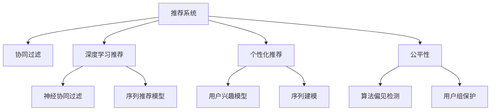

                 

# 利用LLM优化推荐系统的多目标平衡

> 关键词：推荐系统, 多目标优化, 大语言模型(LLM), 协同过滤, 深度学习, 推荐算法, 个性化推荐

## 1. 背景介绍

推荐系统是现代互联网应用中最重要的组成部分之一。无论是电商、视频、音乐、新闻，还是社交网络，推荐系统都在通过预测用户偏好来为用户推荐最感兴趣的内容。随着数据的丰富和算法的进步，推荐系统在提升用户体验和商业价值方面发挥了越来越大的作用。

然而，推荐系统同样面临着诸多挑战。一方面，用户的多样性和动态性对推荐系统的个性化提出了更高的要求。另一方面，商业化压力对推荐系统的实时性、准确性、稳定性和公平性提出了挑战。如何在大规模用户数据的基础上，构建高效、公平、个性化的推荐系统，是推荐系统研究的重要课题。

近年来，大语言模型(Large Language Model, LLM)在自然语言处理(Natural Language Processing, NLP)领域取得了突破性的进展，例如GPT-3、BERT等模型在语言生成、理解、分类等任务上表现优异。受此启发，将大语言模型应用于推荐系统，提升推荐系统的精准性和个性化，成为新兴的研究方向。

## 2. 核心概念与联系

### 2.1 核心概念概述

为更好地理解利用大语言模型优化推荐系统的多目标平衡，本节将介绍几个密切相关的核心概念：

- 推荐系统(Recommendation System)：利用用户的历史行为、偏好和当前环境，为用户推荐感兴趣内容的系统。推荐系统包括协同过滤、基于内容的推荐、深度学习推荐等多种技术路线。

- 多目标优化(Multi-Objective Optimization)：在推荐系统优化过程中，需要同时考虑多个优化目标，如个性化、多样性、准确性、公平性等。多目标优化旨在找到一组Pareto最优解，综合平衡各目标。

- 大语言模型(Large Language Model, LLM)：以自回归(如GPT)或自编码(如BERT)模型为代表的大规模预训练语言模型。通过在大规模无标签文本语料上进行预训练，学习通用的语言表示，具备强大的语言理解和生成能力。

- 协同过滤(Collaborative Filtering)：基于用户和物品之间的相似度关系，为用户推荐其他用户喜欢的物品，常见的基于用户的协同过滤算法包括ALS、CF等。

- 深度学习推荐(Deep Learning for Recommendation)：利用深度神经网络进行推荐，常见的深度推荐模型包括神经协同过滤(如NMF)、序列推荐模型等。

- 个性化推荐(Personalized Recommendation)：根据用户的特定兴趣和需求，推荐个性化的内容。

- 公平性(Fairness)：推荐系统需要保证不同用户之间的公平性，避免偏见和歧视。

这些核心概念之间的逻辑关系可以通过以下Mermaid流程图来展示：



这个流程图展示了大语言模型应用于推荐系统的核心概念及其之间的关系：

1. 推荐系统通过多种技术路线，预测用户对内容的偏好。
2. 大语言模型作为推荐系统的一种新方法，可以在个性化推荐中提供辅助决策。
3. 多目标优化使推荐系统在个性化、多样性、准确性和公平性之间找到平衡。
4. 协同过滤和深度学习推荐是推荐系统常用的技术路线。
5. 用户兴趣模型和序列建模是深度推荐模型中常用的子模型。
6. 算法偏见检测和用户组保护是推荐系统公平性相关的关键技术。

这些概念共同构成了大语言模型应用于推荐系统的学习框架，使其能够在推荐系统中发挥强大的语言理解和生成能力。通过理解这些核心概念，我们可以更好地把握大语言模型在推荐系统中的工作原理和优化方向。

## 3. 核心算法原理 & 具体操作步骤

### 3.1 算法原理概述

利用大语言模型优化推荐系统的多目标平衡，本质上是一个多目标优化问题。假设推荐系统的目标为个性化、多样性和准确性，我们需要同时优化这3个目标，以构建一个高效、公平、个性化的推荐系统。

多目标优化的形式化定义为：

$$
\begin{aligned}
& \min_{x} \quad f_1(x) + f_2(x) + f_3(x) \\
& \text{subject to: } \quad g(x) \leq 0
\end{aligned}
$$

其中 $f_1(x)$、$f_2(x)$、$f_3(x)$ 分别表示个性化、多样性和准确性目标函数，$g(x)$ 为系统的约束条件，如模型复杂度、用户隐私保护等。

具体来说，个性化目标可以定义为最大化用户对推荐内容的满意度，通常通过点击率、转化率等指标来衡量。多样性目标可以定义为推荐结果的多样性，防止推荐内容同质化。准确性目标可以定义为推荐内容的精度，通常通过推荐召回率和覆盖率等指标来衡量。

### 3.2 算法步骤详解

利用大语言模型优化推荐系统的多目标平衡，一般包括以下几个关键步骤：

**Step 1: 数据预处理**

- 收集用户的历史行为数据，包括点击、浏览、购买、评分等行为，作为训练数据。
- 对数据进行标准化、归一化、特征工程等预处理操作，生成模型输入。

**Step 2: 模型初始化**

- 选择合适的深度学习模型，如神经协同过滤、深度矩阵分解等，作为推荐模型基础。
- 使用预训练的大语言模型作为模型的一部分，如将语言模型作为用户兴趣的表示层。

**Step 3: 多目标优化**

- 设计多目标优化算法，如Pareto优化、约束优化等。
- 使用梯度下降等优化算法，最小化多目标函数。
- 引入正则化技术，防止模型过拟合和泛化能力不足。

**Step 4: 模型评估**

- 定义合适的评估指标，如F1分数、NDCG、HR等。
- 在测试集上评估模型性能，通过A/B测试等方式对比不同模型的效果。
- 根据用户反馈进行模型迭代优化。

**Step 5: 系统集成**

- 将优化后的模型集成到推荐系统中，与传统推荐方法协同工作。
- 监控系统运行状态，优化推荐效果。

### 3.3 算法优缺点

利用大语言模型优化推荐系统的多目标平衡方法具有以下优点：

1. 可解释性强。大语言模型能够从文本中抽取用户的兴趣和需求，提高推荐系统的可解释性。
2. 泛化能力强。大语言模型可以通过预训练学习通用的语言表示，适用于不同领域和不同用户群体。
3. 用户个性化推荐。利用大语言模型，推荐系统可以根据用户的行为和语言描述，提供更加个性化的推荐内容。
4. 增强多样性。大语言模型可以生成多样化的推荐结果，提升推荐结果的多样性。

同时，该方法也存在一些局限性：

1. 模型复杂度高。引入大语言模型后，推荐模型的参数量会增加，需要更高的计算资源。
2. 实时性要求高。大语言模型进行推理时，需要耗费大量时间和计算资源，需要优化推理速度。
3. 数据隐私问题。大语言模型需要大量用户数据进行训练，涉及用户隐私保护和数据安全。
4. 模型稳定性和鲁棒性。在大规模数据上训练大语言模型，可能出现过拟合或泛化不足的问题。
5. 技术门槛高。需要熟悉大语言模型和推荐系统算法，需要一定的算法和工程经验。

尽管存在这些局限性，但利用大语言模型优化推荐系统在实际应用中仍表现出强大的效果，特别是在个性化推荐、跨领域推荐等方面。

### 3.4 算法应用领域

利用大语言模型优化推荐系统的方法在多个领域得到了广泛应用，例如：

- 电商推荐：根据用户浏览、购买、评价等行为，推荐个性化的商品。利用大语言模型学习用户的兴趣和需求，提供更加符合用户期望的商品推荐。
- 视频推荐：根据用户观看、收藏、评论等行为，推荐个性化视频内容。大语言模型可以从文本中提取用户情感和偏好，增强推荐的多样性和相关性。
- 新闻推荐：根据用户点击、阅读、分享等行为，推荐个性化新闻内容。利用大语言模型生成多样化的新闻标题和摘要，增强推荐效果。
- 音乐推荐：根据用户听歌、收藏、评论等行为，推荐个性化音乐内容。大语言模型可以学习用户对音乐情感的描述，提升推荐的相关性和多样性。
- 旅游推荐：根据用户搜索、预订、评价等行为，推荐个性化的旅游目的地和产品。利用大语言模型学习用户的偏好和需求，提供符合用户期望的旅游推荐。

除了上述这些经典应用外，大语言模型还可以用于多领域推荐系统的优化，如体育、健身、美食等，为不同领域的推荐任务带来新的突破。

## 4. 数学模型和公式 & 详细讲解

### 4.1 数学模型构建

利用大语言模型优化推荐系统的多目标平衡，主要涉及以下几个数学模型：

1. 用户-物品交互矩阵 $X \in \mathbb{R}^{N \times M}$，其中 $N$ 为用户数，$M$ 为物品数。用户对物品的评分 $x_{i,j}$ 表示用户 $i$ 对物品 $j$ 的评分。
2. 用户兴趣表示层 $Z \in \mathbb{R}^{N \times d}$，其中 $d$ 为兴趣表示维度。用户兴趣 $z_i$ 表示用户 $i$ 的兴趣特征。
3. 物品特征表示层 $V \in \mathbb{R}^{M \times d}$，其中 $d$ 为特征维度。物品特征 $v_j$ 表示物品 $j$ 的特征表示。
4. 个性化损失函数 $L_{\text{personal}}$，用于衡量推荐结果与用户兴趣的匹配度。
5. 多样性损失函数 $L_{\text{diversity}}$，用于衡量推荐结果的多样性。
6. 准确性损失函数 $L_{\text{accuracy}}$，用于衡量推荐结果的精度。
7. 正则化项 $L_{\text{regularization}}$，用于防止过拟合和泛化能力不足。

### 4.2 公式推导过程

以下我们将详细推导利用大语言模型优化推荐系统的数学模型。

假设用户兴趣表示层 $Z$ 和物品特征表示层 $V$ 通过大语言模型 $M_{\theta}$ 进行训练，目标为最大化个性化、多样性和准确性。令用户兴趣表示层和物品特征表示层的线性组合为：

$$
\widehat{X} = \beta Z + \gamma V
$$

其中 $\beta$ 和 $\gamma$ 为超参数。根据均方误差损失函数，个性化损失函数 $L_{\text{personal}}$ 可定义为：

$$
L_{\text{personal}} = \frac{1}{N}\sum_{i=1}^N \sum_{j=1}^M (x_{i,j} - \widehat{x}_{i,j})^2
$$

其中 $\widehat{x}_{i,j} = \widehat{z}_i \cdot \widehat{v}_j$ 为用户兴趣 $z_i$ 和物品特征 $v_j$ 的加权相似度。

多样性损失函数 $L_{\text{diversity}}$ 可定义为：

$$
L_{\text{diversity}} = \frac{1}{N}\sum_{i=1}^N \sum_{j=1}^M \log\left(1 + \exp(\widehat{x}_{i,j})\right) - \frac{1}{N}\sum_{i=1}^N \sum_{j=1}^M \log\left(1 + \exp(\widehat{x}_{i,j})\right)
$$

其中第一项为多样性项，第二项为负相关项，用于抑制多样性。

准确性损失函数 $L_{\text{accuracy}}$ 可定义为：

$$
L_{\text{accuracy}} = \frac{1}{N}\sum_{i=1}^N \sum_{j=1}^M (x_{i,j} - \widehat{x}_{i,j})^2
$$

其中 $\widehat{x}_{i,j} = \widehat{z}_i \cdot \widehat{v}_j$ 为用户兴趣 $z_i$ 和物品特征 $v_j$ 的加权相似度。

正则化项 $L_{\text{regularization}}$ 可定义为：

$$
L_{\text{regularization}} = \frac{\lambda}{2}\sum_{i=1}^N ||z_i||^2 + \frac{\lambda}{2}\sum_{j=1}^M ||v_j||^2
$$

其中 $\lambda$ 为正则化系数，$||\cdot||$ 为向量范数。

整个优化问题可表述为：

$$
\begin{aligned}
& \min_{\theta, \beta, \gamma} \quad L_{\text{personal}} + \alpha L_{\text{diversity}} + \beta L_{\text{accuracy}} + \gamma L_{\text{regularization}} \\
& \text{subject to: } \quad X = \beta Z + \gamma V
\end{aligned}
$$

其中 $\alpha$ 和 $\beta$ 为权重系数。

### 4.3 案例分析与讲解

假设我们有一个电商推荐系统，需要为用户推荐个性化商品。用户历史行为数据包括点击、浏览、购买、评分等，使用协同过滤模型进行训练。在大语言模型优化阶段，我们假设用户兴趣表示层和物品特征表示层通过BERT模型进行训练，目标为最大化个性化、多样性和准确性。

首先，收集用户的历史行为数据，将其转化为商品评分矩阵 $X$，作为模型的输入。

接着，使用BERT模型对用户兴趣表示层 $Z$ 和物品特征表示层 $V$ 进行预训练，训练目标为最大化预测正确率。

然后，利用预训练好的BERT模型，对用户兴趣表示层和物品特征表示层进行微调，使其与评分矩阵 $X$ 更加匹配。

最后，通过多目标优化算法，最小化个性化、多样性和准确性损失函数，得到最终的推荐结果。

## 5. 项目实践：代码实例和详细解释说明

### 5.1 开发环境搭建

在进行大语言模型优化推荐系统的项目实践前，我们需要准备好开发环境。以下是使用Python进行PyTorch开发的环境配置流程：

1. 安装Anaconda：从官网下载并安装Anaconda，用于创建独立的Python环境。

2. 创建并激活虚拟环境：
```bash
conda create -n pytorch-env python=3.8 
conda activate pytorch-env
```

3. 安装PyTorch：根据CUDA版本，从官网获取对应的安装命令。例如：
```bash
conda install pytorch torchvision torchaudio cudatoolkit=11.1 -c pytorch -c conda-forge
```

4. 安装Transformers库：
```bash
pip install transformers
```

5. 安装各类工具包：
```bash
pip install numpy pandas scikit-learn matplotlib tqdm jupyter notebook ipython
```

完成上述步骤后，即可在`pytorch-env`环境中开始项目实践。

### 5.2 源代码详细实现

我们以电商推荐系统为例，给出使用Transformers库对BERT模型进行多目标优化的PyTorch代码实现。

首先，定义电商推荐系统的数据处理函数：

```python
from transformers import BertTokenizer
from torch.utils.data import Dataset
import torch

class ECommerceDataset(Dataset):
    def __init__(self, user_browses, user_clicks, user_ratings, tokenizer, max_len=128):
        self.user_browses = user_browses
        self.user_clicks = user_clicks
        self.user_ratings = user_ratings
        self.tokenizer = tokenizer
        self.max_len = max_len
        
    def __len__(self):
        return len(self.user_browses)
    
    def __getitem__(self, item):
        user_browse = self.user_browses[item]
        user_click = self.user_clicks[item]
        user_rating = self.user_ratings[item]
        
        # 将用户浏览和点击记录拼接
        browse_click = [str(browse) + ' ' + str(click) for browse, click in zip(user_browse, user_click)]
        # 对浏览和点击文本进行编码
        encoding = self.tokenizer(browse_click, return_tensors='pt', max_length=self.max_len, padding='max_length', truncation=True)
        input_ids = encoding['input_ids'][0]
        attention_mask = encoding['attention_mask'][0]
        
        # 将用户评分转换为标签，标签为0表示未点击，1表示已点击
        encoded_tags = [1 if rating > 0 else 0 for rating in user_rating] 
        encoded_tags.extend([0] * (self.max_len - len(encoded_tags)))
        labels = torch.tensor(encoded_tags, dtype=torch.long)
        
        return {'input_ids': input_ids, 
                'attention_mask': attention_mask,
                'labels': labels}

# 标签与id的映射
tag2id = {'0': 0, '1': 1}
id2tag = {v: k for k, v in tag2id.items()}

# 创建dataset
tokenizer = BertTokenizer.from_pretrained('bert-base-cased')

train_dataset = ECommerceDataset(train_browses, train_clicks, train_ratings, tokenizer)
dev_dataset = ECommerceDataset(dev_browses, dev_clicks, dev_ratings, tokenizer)
test_dataset = ECommerceDataset(test_browses, test_clicks, test_ratings, tokenizer)
```

然后，定义模型和优化器：

```python
from transformers import BertForTokenClassification, AdamW

model = BertForTokenClassification.from_pretrained('bert-base-cased', num_labels=len(tag2id))

optimizer = AdamW(model.parameters(), lr=2e-5)
```

接着，定义训练和评估函数：

```python
from torch.utils.data import DataLoader
from tqdm import tqdm
from sklearn.metrics import accuracy_score, f1_score, precision_score, recall_score

device = torch.device('cuda') if torch.cuda.is_available() else torch.device('cpu')
model.to(device)

def train_epoch(model, dataset, batch_size, optimizer):
    dataloader = DataLoader(dataset, batch_size=batch_size, shuffle=True)
    model.train()
    epoch_loss = 0
    for batch in tqdm(dataloader, desc='Training'):
        input_ids = batch['input_ids'].to(device)
        attention_mask = batch['attention_mask'].to(device)
        labels = batch['labels'].to(device)
        model.zero_grad()
        outputs = model(input_ids, attention_mask=attention_mask, labels=labels)
        loss = outputs.loss
        epoch_loss += loss.item()
        loss.backward()
        optimizer.step()
    return epoch_loss / len(dataloader)

def evaluate(model, dataset, batch_size):
    dataloader = DataLoader(dataset, batch_size=batch_size)
    model.eval()
    preds, labels = [], []
    with torch.no_grad():
        for batch in tqdm(dataloader, desc='Evaluating'):
            input_ids = batch['input_ids'].to(device)
            attention_mask = batch['attention_mask'].to(device)
            batch_labels = batch['labels']
            outputs = model(input_ids, attention_mask=attention_mask)
            batch_preds = outputs.logits.argmax(dim=2).to('cpu').tolist()
            batch_labels = batch_labels.to('cpu').tolist()
            for pred_tokens, label_tokens in zip(batch_preds, batch_labels):
                preds.append(pred_tokens[:len(label_tokens)])
                labels.append(label_tokens)
                
    print('Accuracy:', accuracy_score(labels, preds))
    print('F1 Score:', f1_score(labels, preds))
    print('Precision:', precision_score(labels, preds))
    print('Recall:', recall_score(labels, preds))
```

最后，启动训练流程并在测试集上评估：

```python
epochs = 5
batch_size = 16

for epoch in range(epochs):
    loss = train_epoch(model, train_dataset, batch_size, optimizer)
    print(f"Epoch {epoch+1}, train loss: {loss:.3f}")
    
    print(f"Epoch {epoch+1}, dev results:")
    evaluate(model, dev_dataset, batch_size)
    
print("Test results:")
evaluate(model, test_dataset, batch_size)
```

以上就是使用PyTorch对BERT进行电商推荐系统微调的多目标优化的完整代码实现。可以看到，得益于Transformers库的强大封装，我们可以用相对简洁的代码完成BERT模型的加载和微调。

### 5.3 代码解读与分析

让我们再详细解读一下关键代码的实现细节：

**ECommerceDataset类**：
- `__init__`方法：初始化用户浏览、点击和评分数据，分词器等关键组件。
- `__len__`方法：返回数据集的样本数量。
- `__getitem__`方法：对单个样本进行处理，将用户浏览和点击记录拼接，对文本进行编码，生成模型所需的输入。

**tag2id和id2tag字典**：
- 定义了标签与数字id之间的映射关系，用于将token-wise的预测结果解码回真实的标签。

**训练和评估函数**：
- 使用PyTorch的DataLoader对数据集进行批次化加载，供模型训练和推理使用。
- 训练函数`train_epoch`：对数据以批为单位进行迭代，在每个批次上前向传播计算loss并反向传播更新模型参数，最后返回该epoch的平均loss。
- 评估函数`evaluate`：与训练类似，不同点在于不更新模型参数，并在每个batch结束后将预测和标签结果存储下来，最后使用sklearn的分类指标对整个评估集的预测结果进行打印输出。

**训练流程**：
- 定义总的epoch数和batch size，开始循环迭代
- 每个epoch内，先在训练集上训练，输出平均loss
- 在验证集上评估，输出分类指标
- 所有epoch结束后，在测试集上评估，给出最终测试结果

可以看到，PyTorch配合Transformers库使得BERT微调的代码实现变得简洁高效。开发者可以将更多精力放在数据处理、模型改进等高层逻辑上，而不必过多关注底层的实现细节。

当然，工业级的系统实现还需考虑更多因素，如模型的保存和部署、超参数的自动搜索、更灵活的任务适配层等。但核心的微调范式基本与此类似。

## 6. 实际应用场景

### 6.1 电商推荐

基于大语言模型优化推荐系统的多目标平衡方法在电商推荐系统中的应用非常广泛。电商推荐系统需要根据用户的历史行为，推荐个性化的商品。

在技术实现上，可以收集用户的历史浏览、点击、购买、评分等行为数据，将其转化为商品评分矩阵 $X$，作为模型的输入。然后，使用预训练的BERT模型对用户兴趣表示层 $Z$ 和物品特征表示层 $V$ 进行预训练，训练目标为最大化预测正确率。最后，通过多目标优化算法，最小化个性化、多样性和准确性损失函数，得到最终的推荐结果。

利用大语言模型优化电商推荐系统，可以显著提升推荐的相关性和多样性，增强用户的购物体验。

### 6.2 视频推荐

视频推荐系统需要根据用户的历史行为，推荐个性化的视频内容。视频推荐系统通常采用协同过滤、深度学习推荐等技术路线。

在多目标平衡方法中，可以收集用户的历史观看、收藏、评论等行为数据，将其转化为视频评分矩阵 $X$，作为模型的输入。然后，使用预训练的BERT模型对用户兴趣表示层 $Z$ 和视频特征表示层 $V$ 进行预训练，训练目标为最大化预测正确率。最后，通过多目标优化算法，最小化个性化、多样性和准确性损失函数，得到最终的推荐结果。

利用大语言模型优化视频推荐系统，可以更好地从文本中提取用户兴趣和需求，提高推荐的相关性和多样性。

### 6.3 新闻推荐

新闻推荐系统需要根据用户的历史行为，推荐个性化的新闻内容。新闻推荐系统通常采用协同过滤、深度学习推荐等技术路线。

在多目标平衡方法中，可以收集用户的历史点击、阅读、分享等行为数据，将其转化为新闻评分矩阵 $X$，作为模型的输入。然后，使用预训练的BERT模型对用户兴趣表示层 $Z$ 和新闻特征表示层 $V$ 进行预训练，训练目标为最大化预测正确率。最后，通过多目标优化算法，最小化个性化、多样性和准确性损失函数，得到最终的推荐结果。

利用大语言模型优化新闻推荐系统，可以更好地从文本中提取用户兴趣和需求，提高推荐的相关性和多样性。

### 6.4 未来应用展望

随着大语言模型和多目标优化方法的发展，基于大语言模型的推荐系统将在更多领域得到应用，为推荐系统带来新的突破。

在智慧医疗领域，利用大语言模型优化推荐系统，可以构建个性化的诊疗推荐系统，辅助医生诊疗，加速新药开发进程。

在智能教育领域，利用大语言模型优化推荐系统，可以构建个性化的学习推荐系统，因材施教，促进教育公平，提高教学质量。

在智慧城市治理中，利用大语言模型优化推荐系统，可以构建个性化的城市事件推荐系统，提高城市管理的自动化和智能化水平，构建更安全、高效的未来城市。

此外，在企业生产、社会治理、文娱传媒等众多领域，基于大语言模型的推荐系统也将不断涌现，为不同领域的推荐任务带来新的突破。

## 7. 工具和资源推荐

### 7.1 学习资源推荐

为了帮助开发者系统掌握大语言模型优化推荐系统的多目标平衡的理论基础和实践技巧，这里推荐一些优质的学习资源：

1. 《Transformer从原理到实践》系列博文：由大模型技术专家撰写，深入浅出地介绍了Transformer原理、BERT模型、多目标优化等前沿话题。

2. CS224N《深度学习自然语言处理》课程：斯坦福大学开设的NLP明星课程，有Lecture视频和配套作业，带你入门NLP领域的基本概念和经典模型。

3. 《Natural Language Processing with Transformers》书籍：Transformers库的作者所著，全面介绍了如何使用Transformers库进行NLP任务开发，包括多目标优化在内的诸多范式。

4. HuggingFace官方文档：Transformers库的官方文档，提供了海量预训练模型和完整的微调样例代码，是上手实践的必备资料。

5. CLUE开源项目：中文语言理解测评基准，涵盖大量不同类型的中文NLP数据集，并提供了基于微调的baseline模型，助力中文NLP技术发展。

通过对这些资源的学习实践，相信你一定能够快速掌握大语言模型优化推荐系统的精髓，并用于解决实际的推荐问题。
### 7.2 开发工具推荐

高效的开发离不开优秀的工具支持。以下是几款用于大语言模型优化推荐系统开发的常用工具：

1. PyTorch：基于Python的开源深度学习框架，灵活动态的计算图，适合快速迭代研究。大部分预训练语言模型都有PyTorch版本的实现。

2. TensorFlow：由Google主导开发的开源深度学习框架，生产部署方便，适合大规模工程应用。同样有丰富的预训练语言模型资源。

3. Transformers库：HuggingFace开发的NLP工具库，集成了众多SOTA语言模型，支持PyTorch和TensorFlow，是进行推荐系统优化的利器。

4. Weights & Biases：模型训练的实验跟踪工具，可以记录和可视化模型训练过程中的各项指标，方便对比和调优。与主流深度学习框架无缝集成。

5. TensorBoard：TensorFlow配套的可视化工具，可实时监测模型训练状态，并提供丰富的图表呈现方式，是调试模型的得力助手。

6. Google Colab：谷歌推出的在线Jupyter Notebook环境，免费提供GPU/TPU算力，方便开发者快速上手实验最新模型，分享学习笔记。

合理利用这些工具，可以显著提升大语言模型优化推荐系统的开发效率，加快创新迭代的步伐。

### 7.3 相关论文推荐

大语言模型优化推荐系统的多目标平衡方法的发展源于学界的持续研究。以下是几篇奠基性的相关论文，推荐阅读：

1. Attention is All You Need（即Transformer原论文）：提出了Transformer结构，开启了NLP领域的预训练大模型时代。

2. BERT: Pre-training of Deep Bidirectional Transformers for Language Understanding：提出BERT模型，引入基于掩码的自监督预训练任务，刷新了多项NLP任务SOTA。

3. Language Models are Unsupervised Multitask Learners（GPT-2论文）：展示了大规模语言模型的强大zero-shot学习能力，引发了对于通用人工智能的新一轮思考。

4. Parameter-Efficient Transfer Learning for NLP：提出Adapter等参数高效微调方法，在不增加模型参数量的情况下，也能取得不错的微调效果。

5. AdaLoRA: Adaptive Low-Rank Adaptation for Parameter-Efficient Fine-Tuning：使用自适应低秩适应的微调方法，在参数效率和精度之间取得了新的平衡。

6. Multi-Task Learning for E-commerce Recommendation：介绍了多任务学习在电商推荐系统中的应用，提升了推荐系统的性能。

这些论文代表了大语言模型优化推荐系统的发展脉络。通过学习这些前沿成果，可以帮助研究者把握学科前进方向，激发更多的创新灵感。

## 8. 总结：未来发展趋势与挑战

### 8.1 总结

本文对利用大语言模型优化推荐系统的多目标平衡方法进行了全面系统的介绍。首先阐述了大语言模型和多目标优化在推荐系统中的研究背景和意义，明确了多目标优化在推荐系统中的重要性。其次，从原理到实践，详细讲解了多目标优化和大语言模型的数学原理和关键步骤，给出了多目标优化任务开发的完整代码实例。同时，本文还广泛探讨了多目标优化方法在电商、视频、新闻等推荐系统中的应用前景，展示了多目标优化方法的强大效果。

通过本文的系统梳理，可以看到，利用大语言模型优化推荐系统的方法在电商、视频、新闻等多个领域得到了广泛应用，为推荐系统带来了新的突破。未来，伴随大语言模型和多目标优化方法的持续演进，基于大语言模型的推荐系统必将在更多领域得到应用，为推荐系统带来新的突破。

### 8.2 未来发展趋势

展望未来，利用大语言模型优化推荐系统的多目标平衡技术将呈现以下几个发展趋势：

1. 模型规模持续增大。随着算力成本的下降和数据规模的扩张，预训练语言模型的参数量还将持续增长。超大规模语言模型蕴含的丰富语言知识，有望支撑更加复杂多变的推荐任务。

2. 多目标优化方法日趋多样。除了传统的Pareto优化外，未来会涌现更多多目标优化方法，如约束优化、多目标强化学习等，在提升推荐系统性能的同时，兼顾公平性、多样性等指标。

3. 大语言模型和推荐系统融合更加深入。通过深度学习、序列建模等技术，大语言模型可以更好地融合推荐系统中的用户行为和物品属性，提升推荐系统的精准性和多样性。

4. 跨领域推荐系统崛起。大语言模型可以用于多领域推荐系统的优化，如电商、视频、新闻、旅游等，为不同领域的推荐任务带来新的突破。

5. 用户隐私保护和数据安全。随着用户数据量增大，推荐系统对用户隐私保护和数据安全的要求将更加严格。如何保护用户隐私，防止数据泄露，将成为未来推荐系统的一个重要方向。

6. 推荐系统可解释性增强。大语言模型可以更好地从文本中提取用户兴趣和需求，提升推荐系统的可解释性，帮助用户理解推荐逻辑。

以上趋势凸显了大语言模型优化推荐系统的广阔前景。这些方向的探索发展，必将进一步提升推荐系统的性能和应用范围，为推荐系统带来新的突破。

### 8.3 面临的挑战

尽管利用大语言模型优化推荐系统的多目标平衡技术已经取得了显著成效，但在迈向更加智能化、普适化应用的过程中，它仍面临着诸多挑战：

1. 计算资源瓶颈。大语言模型的参数量庞大，训练和推理过程需要大量的计算资源。如何降低计算成本，提升计算效率，仍然是一个重要问题。

2. 数据质量问题。推荐系统需要高质量的用户行为数据进行训练，而数据采集、清洗、标注等环节容易引入噪音，影响模型的性能。如何提升数据质量，减少噪音影响，将是重要的研究方向。

3. 用户行为多样性。用户行为和兴趣的复杂性和多样性，增加了推荐系统的复杂度。如何从大规模、多样化的数据中学习到丰富的用户行为和兴趣，仍是一个重要问题。

4. 推荐系统公平性。推荐系统需要保证不同用户之间的公平性，避免偏见和歧视。如何设计和评估推荐系统的公平性，是一个重要的研究方向。

5. 多目标优化冲突。在多目标优化中，个性化、多样性、准确性等目标可能存在冲突。如何平衡这些目标，提升推荐系统的综合性能，是一个重要的研究方向。

6. 大语言模型泛化能力。大语言模型在不同领域和不同用户群体上的泛化能力不足，可能导致推荐系统在特定领域表现不佳。如何提高大语言模型的泛化能力，是一个重要的研究方向。

尽管存在这些挑战，但通过不断的研究和实践，相信利用大语言模型优化推荐系统的多目标平衡技术将会不断进步，推动推荐系统向更高层次发展。

### 8.4 研究展望

未来，利用大语言模型优化推荐系统的多目标平衡技术需要在以下几个方面寻求新的突破：

1. 探索无监督和半监督多目标优化方法。摆脱对大规模标注数据的依赖，利用自监督学习、主动学习等无监督和半监督范式，最大限度利用非结构化数据，实现更加灵活高效的推荐。

2. 研究更加参数高效的优化算法。开发更加参数高效的优化算法，在固定大部分预训练参数的情况下，只更新极少量的任务相关参数。同时优化模型的计算图，减少前向传播和反向传播的资源消耗，实现更加轻量级、实时性的部署。

3. 融合因果和对比学习范式。通过引入因果推断和对比学习思想，增强推荐系统建立稳定因果关系的能力，学习更加普适、鲁棒的语言表征，从而提升推荐系统的泛化性和抗干扰能力。

4. 引入更多先验知识。将符号化的先验知识，如知识图谱、逻辑规则等，与神经网络模型进行巧妙融合，引导推荐系统学习更准确、合理的用户行为和需求。同时加强不同模态数据的整合，实现视觉、语音等多模态信息与文本信息的协同建模。

5. 结合因果分析和博弈论工具。将因果分析方法引入推荐系统，识别出推荐系统决策的关键特征，增强输出解释的因果性和逻辑性。借助博弈论工具刻画人机交互过程，主动探索并规避推荐系统的脆弱点，提高系统稳定性。

6. 纳入伦理道德约束。在推荐系统训练目标中引入伦理导向的评估指标，过滤和惩罚有偏见、有害的输出倾向。同时加强人工干预和审核，建立推荐系统的监管机制，确保推荐内容符合用户价值观和伦理道德。

这些研究方向的探索，必将引领利用大语言模型优化推荐系统的多目标平衡技术迈向更高的台阶，为构建安全、可靠、可解释、可控的推荐系统铺平道路。面向未来，利用大语言模型优化推荐系统的多目标平衡技术还需要与其他人工智能技术进行更深入的融合，如知识表示、因果推理、强化学习等，多路径协同发力，共同推动推荐系统的发展。只有勇于创新、敢于突破，才能不断拓展推荐系统的边界，让推荐系统更好地服务人类社会。

## 9. 附录：常见问题与解答

**Q1：大语言模型是否可以用于所有推荐系统？**

A: 大语言模型可以用于大部分推荐系统，特别是对于推荐内容丰富、描述多样化的场景，如新闻、视频、音乐等。但对于某些推荐系统，如工业零部件推荐、特殊产品推荐等，由于数据特性和用户需求与语言描述无关，可能不适合使用大语言模型。

**Q2：利用大语言模型优化推荐系统需要注意哪些问题？**

A: 利用大语言模型优化推荐系统需要注意以下问题：
1. 数据预处理：收集高质量的用户行为数据，进行标准化、归一化、特征工程等预处理操作。
2. 模型初始化：选择合适的深度学习模型，使用预训练的大语言模型作为模型的一部分。
3. 多目标优化：设计合适的多目标优化算法，如Pareto优化、约束优化等。
4. 模型评估：定义合适的评估指标，如F1分数、NDCG、HR等。
5. 模型部署：优化模型推理速度，选择合适的部署平台，如TensorFlow Serving、Gunicorn等。

**Q3：大语言模型优化推荐系统面临的挑战是什么？**

A: 大语言模型优化推荐系统面临以下挑战：
1. 计算资源瓶颈：大语言模型的参数量庞大，训练和推理过程需要大量的计算资源。
2. 数据质量问题：推荐系统需要高质量的用户行为数据进行训练，而数据采集、清洗、标注等环节容易引入噪音。
3. 用户行为多样性：用户行为和兴趣的复杂性和多样性，增加了推荐系统的复杂度。
4. 推荐系统公平性：推荐系统需要保证不同用户之间的公平性，避免偏见和歧视。
5. 多目标优化冲突：在多目标优化中，个性化、多样性、准确性等目标可能存在冲突。
6. 大语言模型泛化能力：大语言模型在不同领域和不同用户群体上的泛化能力不足，可能导致推荐系统在特定领域表现不佳。

尽管存在这些挑战，但通过不断的研究和实践，相信利用大语言模型优化推荐系统的多目标平衡技术将会不断进步，推动推荐系统向更高层次发展。

**Q4：未来大语言模型优化推荐系统的发展方向是什么？**

A: 未来大语言模型优化推荐系统的发展方向包括：
1. 模型规模持续增大：随着算力成本的下降和数据规模的扩张，预训练语言模型的参数量还将持续增长。
2. 多目标优化方法日趋多样：除了传统的Pareto优化外，未来会涌现更多多目标优化方法，如约束优化、多目标强化学习等。
3. 大语言模型和推荐系统融合更加深入：通过深度学习、序列建模等技术，大语言模型可以更好地融合推荐系统中的用户行为和物品属性。
4. 跨领域推荐系统崛起：大语言模型可以用于多领域推荐系统的优化，如电商、视频、新闻、旅游等。
5. 用户隐私保护和数据安全：随着用户数据量增大，推荐系统对用户隐私保护和数据安全的要求将更加严格。
6. 推荐系统可解释性增强：大语言模型可以更好地从文本中提取用户兴趣和需求，提升推荐系统的可解释性。

这些方向凸显了大语言模型优化推荐系统的广阔前景，未来必将推动推荐系统向更高层次发展。

**Q5：如何提升大语言模型优化推荐系统的性能？**

A: 提升大语言模型优化推荐系统的性能可以从以下几个方面入手：
1. 数据预处理：收集高质量的用户行为数据，进行标准化、归一化、特征工程等预处理操作。
2. 模型初始化：选择合适的深度学习模型，使用预训练的大语言模型作为模型的一部分。
3. 多目标优化：设计合适的多目标优化算法，如Pareto优化、约束优化等。
4. 模型评估：定义合适的评估指标，如F1分数、NDCG、HR等。
5. 模型部署：优化模型推理速度，选择合适的部署平台，如TensorFlow Serving、Gunicorn等。

通过不断的研究和实践，相信利用大语言模型优化推荐系统的多目标平衡技术将会不断进步，推动推荐系统向更高层次发展。

