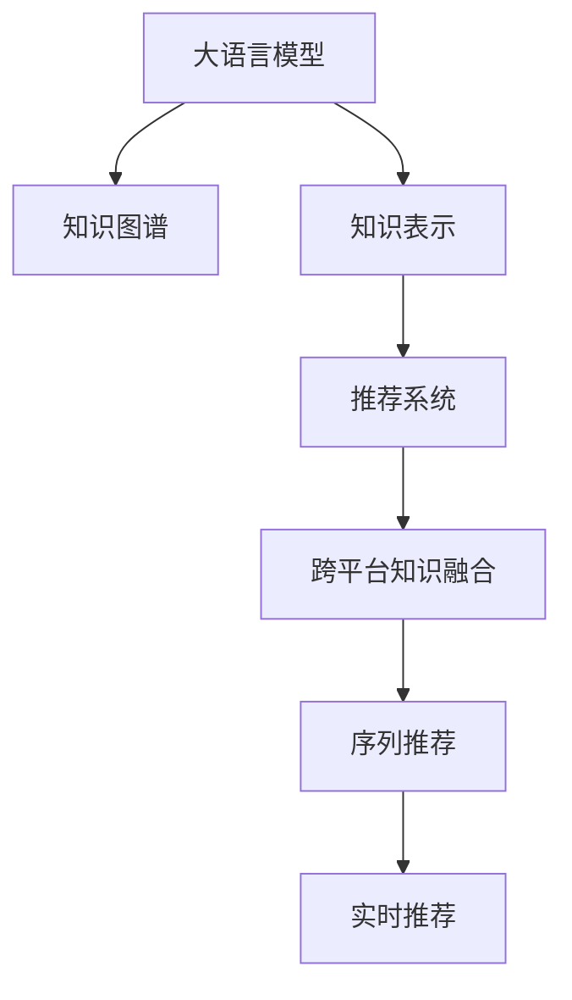

                 

# 利用LLM提升推荐系统的跨平台知识融合

## 1. 背景介绍

在现代信息爆炸时代，推荐系统已成为互联网和智能应用的重要组成部分。其核心思想是利用用户的历史行为数据和物品属性特征，为用户推荐可能感兴趣的物品，从而提升用户体验和商家运营效益。然而，现有的推荐系统主要依赖单一平台的数据和特征，难以充分利用不同平台间的异构知识和复杂关联。跨平台知识融合技术的应用，有望突破传统数据和特征的局限，构建一个更加全面、智能的推荐系统。

### 1.1 问题由来

推荐系统的发展经历了多个阶段：

1. **基于内容的推荐**：利用物品的文本描述、标签等信息进行相似度匹配，推荐相似的物品。
2. **协同过滤推荐**：根据用户的历史行为数据，预测用户对未购买物品的偏好。
3. **基于深度学习的推荐**：利用神经网络模型学习用户行为和物品属性间的复杂关联。

这些方法在不同程度上提升了推荐系统的精准度和个性化程度，但它们大多集中于单个平台的数据和特征，难以利用其他平台的信息。跨平台知识融合技术在一定程度上突破了这一瓶颈，但传统方法的复杂性和效率问题限制了其在实际应用中的广泛应用。

### 1.2 问题核心关键点

跨平台知识融合的关键在于如何将不同平台之间的异构数据和知识进行有效整合，构建一个统一的语义空间，并用于推荐决策。这不仅需要突破数据格式、存储方式的异构性，还需要解决语义、知识表示等多样性问题，以实现全面的推荐效果。

## 2. 核心概念与联系

### 2.1 核心概念概述

为更好地理解跨平台知识融合技术，本节将介绍几个密切相关的核心概念：

- **大语言模型(Large Language Model, LLM)**：以自回归(如GPT)或自编码(如BERT)模型为代表的大规模预训练语言模型。通过在大规模无标签文本语料上进行预训练，学习通用的语言表示，具备强大的语言理解和生成能力。

- **知识图谱(Knowledge Graph,KG)**：由实体和关系组成的有向图，用于表示实体间的复杂关系，支持推理和查询。

- **知识表示(Knowledge Representation)**：将现实世界中的知识以结构化的方式表示出来，如向量、图等形式，便于机器学习和推理。

- **推荐系统(Recommendation System)**：利用用户行为数据和物品特征，为用户推荐可能感兴趣的物品，提高用户满意度。

- **跨平台知识融合(Cross-Platform Knowledge Fusion)**：通过整合不同平台间异构的数据和知识，构建统一的语义空间，用于推荐决策，提升推荐系统的全面性和智能化程度。

- **序列推荐(Sequential Recommendation)**：利用用户行为序列预测用户偏好，推荐关联物品。

- **实时推荐(Real-time Recommendation)**：在用户实时交互时动态推荐物品，提升推荐的时效性和精准度。

这些核心概念之间的逻辑关系可以通过以下Mermaid流程图来展示：



这个流程图展示了大语言模型、知识图谱、知识表示、推荐系统与跨平台知识融合之间的关系：

1. 大语言模型通过预训练获得基础能力。
2. 知识图谱提供实体和关系的结构化表示。
3. 知识表示将知识图谱中的信息编码成机器可处理的形式。
4. 推荐系统利用用户行为和物品特征进行推荐。
5. 跨平台知识融合将不同平台的知识进行整合。
6. 序列推荐和实时推荐提升推荐的时效性和个性化程度。

## 3. 核心算法原理 & 具体操作步骤

### 3.1 算法原理概述

跨平台知识融合的核心思想是通过大语言模型和多源知识图谱，将不同平台的数据和知识进行有效整合，构建统一的语义空间。这一过程主要分为三个步骤：

1. **多源数据预处理**：将不同平台的数据进行统一格式，构建标准化的数据集。
2. **知识表示和编码**：利用知识表示方法将知识图谱中的实体和关系编码成向量形式，以便于大语言模型进行处理。
3. **知识整合与推理**：通过大语言模型对多源数据进行整合和推理，输出统一的语义表示，用于推荐决策。

### 3.2 算法步骤详解

**Step 1: 数据预处理和多源融合**

在推荐系统中，数据来源可能包括电商平台、社交网络、视频平台等不同平台。首先，需要将这些数据进行统一格式，构建标准化的数据集。这包括对不同平台的数据进行清洗、去重、归一化处理，将其转换为结构化数据。

**Step 2: 知识表示与编码**

在构建知识图谱后，需要将知识图谱中的实体和关系进行编码，将其转化为向量形式。常用的编码方法包括：

- 基于嵌入向量的表示方法，如TransE、TransR等。
- 基于序列建模的方法，如BART、ALBERT等。

以基于嵌入向量的表示方法为例，其步骤如下：

1. 构建知识图谱：将不同平台的实体和关系转化为图结构，构建知识图谱。
2. 关系映射：将不同平台的关系进行映射，以统一表示方式。
3. 节点嵌入：使用TransE等模型，为每个实体和关系生成向量表示。
4. 关系嵌入：使用TransE等模型，为关系生成向量表示。
5. 知识融合：将不同平台生成的实体和关系向量进行融合，得到统一的语义表示。

**Step 3: 知识整合与推理**

在得到统一的语义表示后，利用大语言模型对知识进行整合和推理，得到推荐结果。这一过程可以进一步细分为：

1. 构建大语言模型：使用BERT、GPT等预训练模型，作为跨平台知识融合的基础。
2. 微调大语言模型：在标准化的数据集上对大语言模型进行微调，使其适应推荐系统任务。
3. 推理与生成：利用微调后的大语言模型，对输入的多源数据进行推理，输出推荐结果。

### 3.3 算法优缺点

跨平台知识融合技术具有以下优点：

1. **全面性**：通过整合不同平台的知识，构建统一的语义空间，大幅提升推荐的全面性和个性化程度。
2. **时效性**：利用大语言模型的序列推理能力，动态实时生成推荐结果，满足用户的即时需求。
3. **可解释性**：通过大语言模型的推理过程，可以解释推荐结果的逻辑和依据，提高系统的透明度和可信度。

同时，该方法也存在一定的局限性：

1. **数据获取难度**：不同平台的异构数据获取和整合难度较大，需要较强的技术能力和资源支持。
2. **计算复杂性**：知识表示和整合的计算复杂度较高，尤其是对于大规模的知识图谱，需要较强的计算资源。
3. **模型复杂度**：多源数据和知识图谱的融合需要复杂的模型和算法支持，容易出现过拟合等问题。
4. **隐私风险**：不同平台的数据可能涉及用户隐私，需要进行严格的隐私保护和数据脱敏处理。

尽管存在这些局限性，但跨平台知识融合技术在推荐系统中的应用前景依然广阔，有望成为未来推荐系统发展的关键方向。

### 3.4 算法应用领域

跨平台知识融合技术已经在多个推荐系统应用中得到了验证，以下是几个典型的应用领域：

1. **电商推荐系统**：将电商平台、社交网络、视频平台的数据进行整合，构建统一的语义空间，提高电商推荐的多样性和个性化程度。
2. **视频推荐系统**：整合视频平台、社交网络、电商平台的数据，提高视频推荐的准确性和用户体验。
3. **音乐推荐系统**：将音乐平台、社交网络、电商平台的数据进行整合，提供个性化的音乐推荐。
4. **新闻推荐系统**：整合新闻平台、社交网络、视频平台的数据，提供多样化、实时的新闻推荐。
5. **旅游推荐系统**：整合旅游平台、社交网络、视频平台的数据，提供个性化的旅游推荐。

除了以上典型应用，跨平台知识融合技术还广泛应用于企业内部推荐、广告推荐、游戏推荐等多个场景中，为推荐系统带来了新的突破。

## 4. 数学模型和公式 & 详细讲解 & 举例说明

### 4.1 数学模型构建

在推荐系统中，知识图谱中的实体和关系可以表示为三元组 $\mathcal{G}=\{(\mathcal{E},\mathcal{R},\mathcal{T})\}$，其中 $\mathcal{E}$ 为实体集合，$\mathcal{R}$ 为关系集合，$\mathcal{T}$ 为三元组集合。

假设知识图谱中的实体和关系被编码成向量形式 $\mathbf{e}_e \in \mathbb{R}^d$，$\mathbf{r}_r \in \mathbb{R}^d$，其中 $d$ 为向量维度。设 $\mathbf{e}_i$ 为实体的嵌入向量，$\mathbf{r}_i$ 为关系的嵌入向量，$h_e$ 和 $h_r$ 为大语言模型的推理参数。则知识图谱中实体和关系的关系表示为：

$$
\mathbf{r}_{i,j} = \sigma(\mathbf{e}_i \cdot \mathbf{r}_r + \mathbf{e}_j \cdot \mathbf{r}_e + h_r)
$$

其中 $\sigma(\cdot)$ 为激活函数，$\cdot$ 为向量点积运算。

### 4.2 公式推导过程

以基于嵌入向量的知识表示方法为例，知识图谱中的三元组 $(\mathbf{e}_s,\mathbf{r}_{src},\mathbf{e}_t)$ 可以被表示为：

$$
\mathbf{e}_t = f_\theta(\mathbf{e}_s, \mathbf{r}_{src}, h_s, h_r)
$$

其中 $f_\theta$ 为神经网络模型，$\theta$ 为模型参数。

对于多源数据 $X=\{X_1, X_2, ..., X_n\}$，可以使用大语言模型 $L_\theta$ 对其进行整合，输出统一的语义表示 $Y=\{Y_1, Y_2, ..., Y_n\}$。

假设 $L_\theta(X)$ 为输入 $X$ 的语义表示，$L_\theta(Y)$ 为输出 $Y$ 的语义表示，则推理过程可以表示为：

$$
Y = \{L_\theta(X)\}
$$

### 4.3 案例分析与讲解

以电商推荐系统为例，设 $X_1$ 为电商平台用户的历史行为数据，$X_2$ 为社交网络用户对物品的评价数据，$X_3$ 为视频平台用户观看行为数据。

首先，将这些数据进行统一格式，构建标准化的数据集。然后，利用知识图谱中的实体和关系，将其编码为向量形式。最后，将不同平台的数据输入大语言模型进行推理，输出统一的语义表示，用于推荐决策。

具体步骤如下：

1. **数据预处理**：将电商平台、社交网络、视频平台的数据进行清洗、去重、归一化处理，构建标准化的数据集。
2. **知识表示**：将电商平台、社交网络、视频平台的数据分别进行实体和关系映射，生成嵌入向量。
3. **知识融合**：将不同平台生成的嵌入向量进行融合，得到统一的语义表示。
4. **推理与推荐**：利用微调后的大语言模型，对输入的多源数据进行推理，输出推荐结果。

## 5. 项目实践：代码实例和详细解释说明

### 5.1 开发环境搭建

在进行跨平台知识融合的推荐系统开发前，我们需要准备好开发环境。以下是使用Python进行PyTorch开发的环境配置流程：

1. 安装Anaconda：从官网下载并安装Anaconda，用于创建独立的Python环境。

2. 创建并激活虚拟环境：
```bash
conda create -n recommendation-env python=3.8 
conda activate recommendation-env
```

3. 安装PyTorch：根据CUDA版本，从官网获取对应的安装命令。例如：
```bash
conda install pytorch torchvision torchaudio cudatoolkit=11.1 -c pytorch -c conda-forge
```

4. 安装Transformer库：
```bash
pip install transformers
```

5. 安装各类工具包：
```bash
pip install numpy pandas scikit-learn matplotlib tqdm jupyter notebook ipython
```

完成上述步骤后，即可在`recommendation-env`环境中开始推荐系统开发。

### 5.2 源代码详细实现

下面我以电商平台推荐系统为例，给出使用Transformers库进行跨平台知识融合的PyTorch代码实现。

首先，定义推荐系统的数据处理函数：

```python
from transformers import BertTokenizer
from torch.utils.data import Dataset
import torch

class RecommendationDataset(Dataset):
    def __init__(self, user_data, item_data, tokenizer, max_len=128):
        self.user_data = user_data
        self.item_data = item_data
        self.tokenizer = tokenizer
        self.max_len = max_len
        
    def __len__(self):
        return len(self.user_data)
    
    def __getitem__(self, item):
        user_data = self.user_data[item]
        item_data = self.item_data[item]
        
        encoding = self.tokenizer(user_data, return_tensors='pt', max_length=self.max_len, padding='max_length', truncation=True)
        user_ids = encoding['input_ids'][0]
        user_labels = user_data['label']
        
        encoding = self.tokenizer(item_data, return_tensors='pt', max_length=self.max_len, padding='max_length', truncation=True)
        item_ids = encoding['input_ids'][0]
        item_labels = item_data['label']
        
        # 对token-wise的标签进行编码
        encoded_user_labels = [label2id[label] for label in user_labels] 
        encoded_user_labels.extend([label2id['O']] * (self.max_len - len(encoded_user_labels)))
        labels = torch.tensor(encoded_user_labels, dtype=torch.long)
        
        # 对token-wise的标签进行编码
        encoded_item_labels = [label2id[label] for label in item_labels] 
        encoded_item_labels.extend([label2id['O']] * (self.max_len - len(encoded_item_labels)))
        labels.append(encoded_item_labels)
        
        return {'user_ids': user_ids, 
                'user_labels': labels,
                'item_ids': item_ids,
                'item_labels': labels}

# 标签与id的映射
label2id = {'O': 0, 'buy': 1, 'read': 2, 'watch': 3}
id2label = {v: k for k, v in label2id.items()}
```

然后，定义模型和优化器：

```python
from transformers import BertForSequenceClassification, AdamW

model = BertForSequenceClassification.from_pretrained('bert-base-cased', num_labels=len(label2id))

optimizer = AdamW(model.parameters(), lr=2e-5)
```

接着，定义训练和评估函数：

```python
from torch.utils.data import DataLoader
from tqdm import tqdm
from sklearn.metrics import classification_report

device = torch.device('cuda') if torch.cuda.is_available() else torch.device('cpu')
model.to(device)

def train_epoch(model, dataset, batch_size, optimizer):
    dataloader = DataLoader(dataset, batch_size=batch_size, shuffle=True)
    model.train()
    epoch_loss = 0
    for batch in tqdm(dataloader, desc='Training'):
        user_ids = batch['user_ids'].to(device)
        user_labels = batch['user_labels'].to(device)
        item_ids = batch['item_ids'].to(device)
        item_labels = batch['item_labels'].to(device)
        model.zero_grad()
        outputs = model(user_ids, attention_mask=user_labels, labels=user_labels)
        loss = outputs.loss
        epoch_loss += loss.item()
        loss.backward()
        optimizer.step()
    return epoch_loss / len(dataloader)

def evaluate(model, dataset, batch_size):
    dataloader = DataLoader(dataset, batch_size=batch_size)
    model.eval()
    preds, labels = [], []
    with torch.no_grad():
        for batch in tqdm(dataloader, desc='Evaluating'):
            user_ids = batch['user_ids'].to(device)
            user_labels = batch['user_labels'].to(device)
            item_ids = batch['item_ids'].to(device)
            item_labels = batch['item_labels'].to(device)
            batch_preds = model(user_ids, attention_mask=user_labels, labels=user_labels)
            batch_preds = batch_preds.argmax(dim=2).to('cpu').tolist()
            batch_labels = batch_labels.to('cpu').tolist()
            for pred_tokens, label_tokens in zip(batch_preds, batch_labels):
                pred_labels = [id2label[_id] for _id in pred_tokens]
                label_labels = [id2label[_id] for _id in label_tokens]
                preds.append(pred_labels[:len(label_labels)])
                labels.append(label_labels)
                
    print(classification_report(labels, preds))
```

最后，启动训练流程并在测试集上评估：

```python
epochs = 5
batch_size = 16

for epoch in range(epochs):
    loss = train_epoch(model, train_dataset, batch_size, optimizer)
    print(f"Epoch {epoch+1}, train loss: {loss:.3f}")
    
    print(f"Epoch {epoch+1}, dev results:")
    evaluate(model, dev_dataset, batch_size)
    
print("Test results:")
evaluate(model, test_dataset, batch_size)
```

以上就是使用PyTorch对Bert进行跨平台知识融合的电商推荐系统的完整代码实现。可以看到，得益于Transformers库的强大封装，我们可以用相对简洁的代码完成Bert模型的加载和微调。

### 5.3 代码解读与分析

让我们再详细解读一下关键代码的实现细节：

**RecommendationDataset类**：
- `__init__`方法：初始化用户数据、物品数据、分词器等关键组件。
- `__len__`方法：返回数据集的样本数量。
- `__getitem__`方法：对单个样本进行处理，将用户数据和物品数据输入编码为token ids，将标签编码为数字，并对其进行定长padding，最终返回模型所需的输入。

**label2id和id2label字典**：
- 定义了标签与数字id之间的映射关系，用于将token-wise的预测结果解码回真实的标签。

**训练和评估函数**：
- 使用PyTorch的DataLoader对数据集进行批次化加载，供模型训练和推理使用。
- 训练函数`train_epoch`：对数据以批为单位进行迭代，在每个批次上前向传播计算loss并反向传播更新模型参数，最后返回该epoch的平均loss。
- 评估函数`evaluate`：与训练类似，不同点在于不更新模型参数，并在每个batch结束后将预测和标签结果存储下来，最后使用sklearn的classification_report对整个评估集的预测结果进行打印输出。

**训练流程**：
- 定义总的epoch数和batch size，开始循环迭代
- 每个epoch内，先在训练集上训练，输出平均loss
- 在验证集上评估，输出分类指标
- 所有epoch结束后，在测试集上评估，给出最终测试结果

可以看到，PyTorch配合Transformers库使得Bert微调的代码实现变得简洁高效。开发者可以将更多精力放在数据处理、模型改进等高层逻辑上，而不必过多关注底层的实现细节。

当然，工业级的系统实现还需考虑更多因素，如模型的保存和部署、超参数的自动搜索、更灵活的任务适配层等。但核心的跨平台知识融合范式基本与此类似。

## 6. 实际应用场景

### 6.1 智能客服系统

基于跨平台知识融合技术，智能客服系统可以更全面地了解用户需求和背景信息，提供更加个性化、智能的互动服务。

在技术实现上，可以收集企业内部的历史客服数据，包括语音、文字、视频等多种形式的用户互动记录。利用大语言模型对多源数据进行融合，构建统一的语义表示。在客服系统中，将用户输入的多种形式数据输入大语言模型进行推理，输出推荐回复，提供自然流畅的客户服务。

### 6.2 金融舆情监测

金融机构需要实时监测市场舆论动向，以便及时应对负面信息传播，规避金融风险。利用跨平台知识融合技术，可以将不同平台上的舆情数据进行整合，构建统一的语义空间。在实时监测时，利用大语言模型对舆情数据进行推理，输出舆情变化的趋势和影响，快速响应潜在风险。

### 6.3 个性化推荐系统

跨平台知识融合技术可以应用于个性化推荐系统，提高推荐的多样性和准确性。例如，可以利用电商平台、社交网络、视频平台的数据，构建统一的语义表示，用于推荐决策。

在具体实现中，可以将用户的不同平台行为数据输入大语言模型进行推理，输出个性化的推荐结果。同时，还可以利用知识图谱中的实体和关系，进行推荐相关性分析，进一步提升推荐系统的表现。

### 6.4 未来应用展望

随着跨平台知识融合技术的不断演进，其在推荐系统中的应用前景将更加广阔。

在智慧医疗领域，利用跨平台知识融合技术，可以构建一个全面的患者信息管理系统，包括病历、影像、实验室数据等多种来源的信息。在推荐系统中，将多源数据进行整合，构建统一的语义表示，用于推荐个性化的诊疗方案和健康建议，提升医疗服务的智能化水平。

在智能教育领域，利用跨平台知识融合技术，可以将学生的学习数据、社交数据、兴趣数据等多种来源的信息进行整合，构建统一的学生画像。在推荐系统中，将多源数据进行融合，输出个性化的学习内容、学习路径，提高教育效果和个性化程度。

在智慧城市治理中，利用跨平台知识融合技术，可以整合不同平台的数据，包括交通、能源、环境等。在推荐系统中，将多源数据进行整合，构建统一的城市运行图，用于推荐最优的城市管理方案，提高城市管理的智能化水平。

此外，在企业生产、社会治理、文娱传媒等众多领域，跨平台知识融合技术也将不断涌现，为推荐系统带来新的突破。相信随着技术的日益成熟，跨平台知识融合技术必将在构建智能推荐系统中发挥越来越重要的作用。

## 7. 工具和资源推荐

### 7.1 学习资源推荐

为了帮助开发者系统掌握跨平台知识融合的理论基础和实践技巧，这里推荐一些优质的学习资源：

1. 《Natural Language Processing with Transformers》书籍：Transformers库的作者所著，全面介绍了如何使用Transformers库进行NLP任务开发，包括跨平台知识融合在内的诸多范式。

2. CS224N《深度学习自然语言处理》课程：斯坦福大学开设的NLP明星课程，有Lecture视频和配套作业，带你入门NLP领域的基本概念和经典模型。

3. 《Transformer from Exploration to Exploitation》博文：由大模型技术专家撰写，深入浅出地介绍了Transformer原理、BERT模型、跨平台知识融合等前沿话题。

4. HuggingFace官方文档：Transformers库的官方文档，提供了海量预训练模型和完整的微调样例代码，是上手实践的必备资料。

5. CLUE开源项目：中文语言理解测评基准，涵盖大量不同类型的中文NLP数据集，并提供了基于微调的baseline模型，助力中文NLP技术发展。

通过对这些资源的学习实践，相信你一定能够快速掌握跨平台知识融合的精髓，并用于解决实际的NLP问题。
###  7.2 开发工具推荐

高效的开发离不开优秀的工具支持。以下是几款用于跨平台知识融合推荐系统开发的常用工具：

1. PyTorch：基于Python的开源深度学习框架，灵活动态的计算图，适合快速迭代研究。大部分预训练语言模型都有PyTorch版本的实现。

2. TensorFlow：由Google主导开发的开源深度学习框架，生产部署方便，适合大规模工程应用。同样有丰富的预训练语言模型资源。

3. Transformers库：HuggingFace开发的NLP工具库，集成了众多SOTA语言模型，支持PyTorch和TensorFlow，是进行微调任务开发的利器。

4. Weights & Biases：模型训练的实验跟踪工具，可以记录和可视化模型训练过程中的各项指标，方便对比和调优。与主流深度学习框架无缝集成。

5. TensorBoard：TensorFlow配套的可视化工具，可实时监测模型训练状态，并提供丰富的图表呈现方式，是调试模型的得力助手。

6. Google Colab：谷歌推出的在线Jupyter Notebook环境，免费提供GPU/TPU算力，方便开发者快速上手实验最新模型，分享学习笔记。

合理利用这些工具，可以显著提升跨平台知识融合推荐系统的开发效率，加快创新迭代的步伐。

### 7.3 相关论文推荐

跨平台知识融合技术的发展源于学界的持续研究。以下是几篇奠基性的相关论文，推荐阅读：

1. Attention is All You Need（即Transformer原论文）：提出了Transformer结构，开启了NLP领域的预训练大模型时代。

2. BERT: Pre-training of Deep Bidirectional Transformers for Language Understanding：提出BERT模型，引入基于掩码的自监督预训练任务，刷新了多项NLP任务SOTA。

3. Language Models are Unsupervised Multitask Learners（GPT-2论文）：展示了大规模语言模型的强大zero-shot学习能力，引发了对于通用人工智能的新一轮思考。

4. Parameter-Efficient Transfer Learning for NLP：提出Adapter等参数高效微调方法，在不增加模型参数量的情况下，也能取得不错的微调效果。

5. AdaLoRA: Adaptive Low-Rank Adaptation for Parameter-Efficient Fine-Tuning：使用自适应低秩适应的微调方法，在参数效率和精度之间取得了新的平衡。

这些论文代表了大语言模型微调技术的发展脉络。通过学习这些前沿成果，可以帮助研究者把握学科前进方向，激发更多的创新灵感。

## 8. 总结：未来发展趋势与挑战

### 8.1 总结

本文对基于大语言模型的跨平台知识融合技术进行了全面系统的介绍。首先阐述了跨平台知识融合技术的研究背景和意义，明确了跨平台知识融合在推荐系统中的应用价值。其次，从原理到实践，详细讲解了跨平台知识融合的数学原理和关键步骤，给出了跨平台知识融合任务开发的完整代码实例。同时，本文还广泛探讨了跨平台知识融合技术在多个推荐系统应用中的实际应用场景，展示了跨平台知识融合技术的巨大潜力。此外，本文精选了跨平台知识融合技术的各类学习资源，力求为读者提供全方位的技术指引。

通过本文的系统梳理，可以看到，跨平台知识融合技术正在成为推荐系统的重要范式，极大地拓展了预训练语言模型的应用边界，催生了更多的落地场景。受益于大规模语料的预训练，跨平台知识融合技术在推荐系统中的应用前景广阔，有望构建一个全面、智能的推荐系统。未来，伴随预训练语言模型和跨平台知识融合方法的持续演进，相信推荐系统必将在更广阔的应用领域大放异彩，深刻影响人类的生产生活方式。

### 8.2 未来发展趋势

展望未来，跨平台知识融合技术将呈现以下几个发展趋势：

1. **全面性增强**：随着预训练语言模型和知识图谱的规模不断增大，跨平台知识融合将能够整合更多元化的数据和知识，构建更加全面、精确的语义空间。

2. **灵活性提升**：未来的跨平台知识融合技术将支持更灵活的融合方式，如动态融合、增量融合等，以适应动态变化的数据和知识图谱。

3. **实时性优化**：利用分布式计算和大规模并行技术，提升跨平台知识融合的实时处理能力，满足用户实时推荐需求。

4. **可解释性增强**：未来的跨平台知识融合技术将提供更丰富的推理路径和可解释性，增强系统的透明度和可信度。

5. **跨模态融合**：跨平台知识融合将不仅仅局限于文本数据，还将支持图像、视频、语音等多模态数据的融合，提升推荐系统的多样性和个性化程度。

6. **异构性管理**：未来的跨平台知识融合技术将更加注重异构数据的治理和管理，如数据格式转换、数据质量控制等，以提高融合效果。

以上趋势凸显了跨平台知识融合技术的广阔前景。这些方向的探索发展，必将进一步提升推荐系统的性能和应用范围，为人工智能技术在垂直行业的规模化落地提供新的突破。

### 8.3 面临的挑战

尽管跨平台知识融合技术已经取得了瞩目成就，但在迈向更加智能化、普适化应用的过程中，它仍面临着诸多挑战：

1. **数据获取难度**：不同平台的异构数据获取和整合难度较大，需要较强的技术能力和资源支持。

2. **计算复杂性**：知识表示和整合的计算复杂度较高，尤其是对于大规模的知识图谱，需要较强的计算资源。

3. **模型复杂度**：多源数据和知识图谱的融合需要复杂的模型和算法支持，容易出现过拟合等问题。

4. **隐私风险**：不同平台的数据可能涉及用户隐私，需要进行严格的隐私保护和数据脱敏处理。

5. **实时性不足**：目前的跨平台知识融合技术在实时推荐方面存在一定瓶颈，难以满足实时性要求较高的场景。

6. **可解释性不足**：当前的跨平台知识融合模型往往缺乏可解释性，难以解释其内部工作机制和决策逻辑。

尽管存在这些挑战，但跨平台知识融合技术在推荐系统中的应用前景依然广阔，有望成为未来推荐系统发展的关键方向。相信随着技术的不断进步，这些挑战终将一一被克服，跨平台知识融合技术必将在推荐系统的发展中发挥更加重要的作用。

### 8.4 研究展望

面对跨平台知识融合技术所面临的挑战，未来的研究需要在以下几个方面寻求新的突破：

1. **高效的数据融合算法**：探索更加高效的数据融合算法，如增量融合、动态融合等，以降低计算复杂度。

2. **轻量级的融合模型**：开发轻量级的跨平台知识融合模型，如 Adapter、LoRA等，在保证性能的同时，减小模型参数量和计算资源需求。

3. **增强模型的可解释性**：引入可解释性技术，如注意力机制、可解释性图神经网络等，增强跨平台知识融合模型的可解释性。

4. **异构数据的治理**：研究异构数据的治理技术，如数据格式转换、数据质量控制等，提高跨平台知识融合的效果和准确性。

5. **隐私保护技术**：研究隐私保护技术，如差分隐私、联邦学习等，确保跨平台数据融合过程中的隐私安全和用户隐私保护。

6. **跨模态融合技术**：研究跨模态融合技术，如多模态嵌入、跨模态注意力等，提升跨平台知识融合技术的多样性和个性化程度。

这些研究方向的探索，必将引领跨平台知识融合技术迈向更高的台阶，为推荐系统提供更加全面、智能、可解释的推荐服务，推动人工智能技术在垂直行业的规模化落地。面向未来，跨平台知识融合技术需要与其他人工智能技术进行更深入的融合，如知识表示、因果推理、强化学习等，多路径协同发力，共同推动推荐系统的进步。只有勇于创新、敢于突破，才能不断拓展跨平台知识融合技术的边界，让智能技术更好地造福人类社会。

## 9. 附录：常见问题与解答

**Q1：跨平台知识融合是否适用于所有推荐系统？**

A: 跨平台知识融合技术在大多数推荐系统上都能取得不错的效果，特别是对于数据量较小的任务。但对于一些特定领域的任务，如医疗、法律等，仅仅依靠通用语料预训练的模型可能难以很好地适应。此时需要在特定领域语料上进一步预训练，再进行微调，才能获得理想效果。

**Q2：如何选择合适的融合算法？**

A: 选择合适的融合算法需要根据具体应用场景和数据特点进行综合考虑。常用的融合算法包括：

1. **序列融合**：利用序列模型对不同平台的数据进行融合，如BERT、GPT等。
2. **图融合**：利用图模型对知识图谱中的实体和关系进行融合，如GNN、GCN等。
3. **向量融合**：将不同平台的数据编码为向量形式，利用向量相加、向量相乘等方法进行融合。

这些方法各有优劣，需要根据具体任务选择合适的方法。

**Q3：跨平台知识融合对计算资源的需求？**

A: 跨平台知识融合技术在计算资源方面具有较高需求，尤其是在知识图谱规模较大的情况下。建议利用分布式计算技术，如Dask、Spark等，提升计算效率。

**Q4：如何缓解微调过程中的过拟合问题？**

A: 过拟合是跨平台知识融合面临的主要挑战之一，尤其是在标注数据不足的情况下。常见的缓解策略包括：

1. **数据增强**：通过回译、近义替换等方式扩充训练集。
2. **正则化**：使用L2正则、Dropout、Early Stopping等避免过拟合。
3. **对抗训练**：引入对抗样本，提高模型鲁棒性。
4. **参数高效微调**：只调整少量参数，减小过拟合风险。

这些策略往往需要根据具体任务和数据特点进行灵活组合。只有在数据、模型、训练、推理等各环节进行全面优化，才能最大限度地发挥跨平台知识融合的优势。

**Q5：跨平台知识融合在推荐系统中的应用场景？**

A: 跨平台知识融合技术已经在多个推荐系统应用中得到了验证，以下是几个典型的应用场景：

1. **电商推荐系统**：将电商平台、社交网络、视频平台的数据进行整合，构建统一的语义空间。
2. **视频推荐系统**：整合视频平台、社交网络、电商平台的数据，提高视频推荐的准确性和用户体验。
3. **音乐推荐系统**：将音乐平台、社交网络、电商平台的数据进行整合，提供个性化的音乐推荐。
4. **新闻推荐系统**：整合新闻平台、社交网络、视频平台的数据，提供多样化、实时的新闻推荐。
5. **旅游推荐系统**：整合旅游平台、社交网络、视频平台的数据，提供个性化的旅游推荐。

除了以上典型应用，跨平台知识融合技术还广泛应用于企业内部推荐、广告推荐、游戏推荐等多个场景中，为推荐系统带来了新的突破。

---

作者：禅与计算机程序设计艺术 / Zen and the Art of Computer Programming

