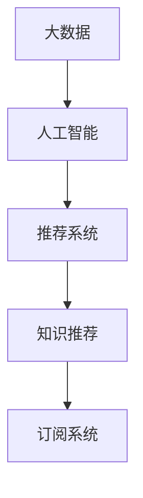
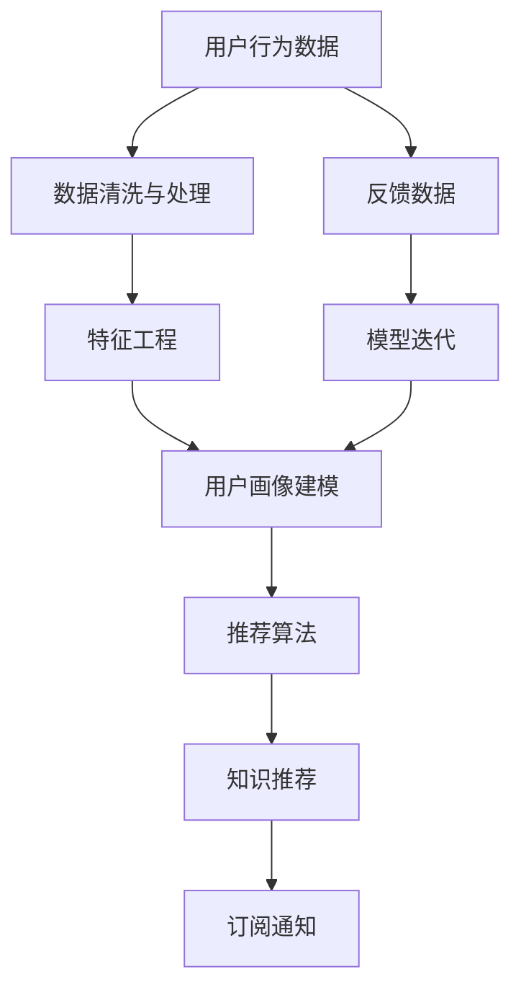

                 

# 利用大数据和AI提供个性化知识推荐订阅

## 1. 背景介绍

在当今信息爆炸的时代，用户每天需要处理的信息量不断增加，如何从海量的内容中快速找到感兴趣的知识点，成为了一个迫切需要解决的问题。个性化推荐系统应运而生，通过分析用户的兴趣和行为，智能推荐其感兴趣的内容，显著提高了用户获取信息的效率和满意度。

大数据和人工智能技术的结合，使得个性化推荐系统能够更准确地把握用户需求，提供更贴合用户口味的内容。特别是在知识推荐领域，能够帮助用户在海量知识海洋中快速定位，节省大量时间成本。本文将深入探讨基于大数据和AI的个性化知识推荐订阅系统，并详细介绍其实现原理和具体案例。

## 2. 核心概念与联系

### 2.1 核心概念概述

为了更好地理解个性化知识推荐订阅系统的原理和实现，我们先介绍几个关键概念：

- **大数据**：指的是在一定时间内，借助先进的技术，能够处理、存储和分析的海量数据。它为个性化推荐系统提供了强大的数据支持，通过分析用户行为数据，精准预测用户需求。

- **人工智能**：利用机器学习、深度学习等技术，使计算机具备学习能力和自主决策能力。在个性化推荐系统中，通过AI模型对用户数据进行分析和建模，实现智能推荐。

- **推荐系统**：根据用户的历史行为、兴趣偏好，推荐用户可能感兴趣的内容或产品。个性化推荐系统能够提供高度定制化的服务，提升用户体验。

- **知识推荐**：特别针对知识类内容，通过分析用户的学习行为和知识背景，推荐符合用户知识水平和学习需求的知识点。

- **订阅系统**：用户通过订阅系统获取个性化的知识推荐，能够主动地获取和更新推荐的知识点，保持学习的新鲜感和知识体系的连贯性。

这些概念之间的联系可以通过以下Mermaid流程图来展示：



这个流程图展示了大数据、人工智能、推荐系统、知识推荐和订阅系统之间的逻辑关系：

1. 大数据为人工智能提供了数据基础。
2. 人工智能通过机器学习、深度学习等技术对大数据进行处理，生成推荐模型。
3. 推荐系统根据用户的行为和兴趣，使用AI模型进行推荐。
4. 知识推荐在推荐系统的基础上，结合用户的知识水平和需求，推荐更符合用户学习兴趣的知识点。
5. 订阅系统使推荐系统能够与用户持续交互，提供动态的推荐服务。

### 2.2 核心概念原理和架构的 Mermaid 流程图



这个流程图展示了个性化知识推荐订阅系统的架构：

1. 用户行为数据经过清洗与处理，生成干净的数据集。
2. 对数据集进行特征工程，提取重要的用户特征。
3. 通过用户画像建模，构建用户兴趣和行为模型。
4. 使用推荐算法，对用户进行精准推荐。
5. 推荐系统输出推荐结果，进行知识推荐。
6. 订阅系统根据用户反馈，动态更新推荐模型。

## 3. 核心算法原理 & 具体操作步骤

### 3.1 算法原理概述

基于大数据和AI的个性化知识推荐订阅系统，其核心思想是通过用户的行为数据和兴趣模型，结合推荐算法，生成个性化的知识推荐，并通过订阅系统动态更新。

具体而言，该系统包含以下几个步骤：

1. **数据收集与清洗**：收集用户的历史行为数据，如浏览记录、学习记录、评分等，进行数据清洗和预处理。
2. **特征工程**：从清洗后的数据中提取特征，如用户兴趣、学习频率、学习时间等，生成特征向量。
3. **用户画像建模**：通过机器学习模型对特征向量进行建模，构建用户兴趣和行为模型。
4. **推荐算法**：使用推荐算法对用户进行推荐，如协同过滤、内容推荐等。
5. **知识推荐**：结合用户的知识水平和需求，推荐符合用户学习兴趣的知识点。
6. **订阅系统**：根据推荐结果，定期推送知识订阅信息，用户可以通过订阅系统获取推荐的知识，并反馈学习效果。

### 3.2 算法步骤详解

#### 3.2.1 数据收集与清洗

数据收集是整个系统的基础。用户行为数据可以包括浏览记录、学习记录、评分、评论等。这些数据通常分散在不同的系统中，需要集成到统一的数据平台进行集中管理。

数据清洗的目的是去伪存真，去除噪音数据和异常数据，以保证数据的质量和完整性。常见的数据清洗方法包括去重、填补缺失值、异常值处理等。

```python
# 示例代码：数据清洗
import pandas as pd

# 读取原始数据集
data = pd.read_csv('user_data.csv')

# 数据去重
data.drop_duplicates(inplace=True)

# 填补缺失值
data.fillna(method='ffill', inplace=True)

# 异常值处理
data = data[(data['learn_time'] >= 0) & (data['learn_time'] <= 24)]
```

#### 3.2.2 特征工程

特征工程是将原始数据转换为特征向量的过程，是构建用户画像模型的关键。常见的特征包括：

- 用户基本信息：年龄、性别、职业等。
- 学习行为：学习时间、学习频率、学习路径等。
- 知识水平：已掌握的知识点、知识点的深度、知识点的广度等。

特征工程的方法包括：

- 编码：将分类数据转换为数值型数据，如将性别转换为0和1。
- 标准化：对数值型数据进行归一化处理，保证不同特征之间的可比性。
- 特征选择：选取与用户行为预测最相关的特征。

```python
# 示例代码：特征工程
from sklearn.preprocessing import StandardScaler
from sklearn.feature_selection import SelectKBest

# 选择最相关的特征
X = data[['age', 'learn_time', 'knowledge_depth']]
y = data['learn_frequency']
selector = SelectKBest(k=3)
X_selected = selector.fit_transform(X, y)

# 标准化处理
scaler = StandardScaler()
X_scaled = scaler.fit_transform(X_selected)
```

#### 3.2.3 用户画像建模

用户画像建模是构建用户兴趣和行为模型的过程。常用的建模方法包括：

- 协同过滤：通过分析用户之间的相似性，推荐相似用户喜欢的知识点。
- 内容推荐：根据知识点的特征，推荐与用户兴趣相符的知识点。
- 深度学习模型：如LSTM、RNN等，能够捕捉用户学习行为的动态特征，更准确地预测用户需求。

```python
# 示例代码：用户画像建模
from sklearn.ensemble import RandomForestClassifier
from sklearn.metrics import accuracy_score

# 构建随机森林模型
model = RandomForestClassifier(n_estimators=100, max_depth=5)
model.fit(X_scaled, y)

# 预测用户学习频率
y_pred = model.predict(X_scaled)
accuracy = accuracy_score(y, y_pred)
print(f'Accuracy: {accuracy:.2f}')
```

#### 3.2.4 推荐算法

推荐算法是个性化推荐的核心，常用的推荐算法包括：

- 协同过滤：通过用户之间的相似性，推荐用户喜欢的内容。
- 基于内容的推荐：根据物品的特征，推荐与用户兴趣相符的内容。
- 深度学习推荐模型：如神经协同过滤、深度矩阵分解等，能够捕捉更深层次的用户行为和物品特征。

```python
# 示例代码：推荐算法
from surprise import Dataset, Reader, SVD

# 加载数据集
data = Dataset.load_builtin('ml-1m')
reader = Reader(rating_scale=(1, 5))
trainset = Dataset.load_from_df(data.build_full_trainset(), reader)

# 使用SVD推荐算法
algo = SVD()
trainset.build_full_trainset()
algo.fit(trainset.build_full_trainset())
predictions = algo.test(testset)

# 计算推荐准确率
accuracy = sum([p.est.value > 0.5 for p in predictions]) / len(predictions)
print(f'Accuracy: {accuracy:.2f}')
```

#### 3.2.5 知识推荐

知识推荐是结合用户画像和推荐算法，生成个性化的知识推荐。常用的方法包括：

- 基于协同过滤的推荐：推荐与用户兴趣相似的用户喜欢的知识点。
- 基于内容的推荐：根据知识点的特征，推荐与用户学习兴趣相符的知识点。
- 深度学习推荐模型：如注意力机制、Transformer等，能够捕捉更复杂的用户行为和知识特征。

```python
# 示例代码：知识推荐
from sklearn.metrics.pairwise import cosine_similarity

# 计算知识推荐
similarity = cosine_similarity(X_scaled)
recommendations = []
for user in range(len(similarity)):
    user_index = user
    user_similarity = similarity[user]
    user_row = user_similarity[user_index]
    recommendations.append(user_index)

# 输出推荐结果
print(f'Recommendations: {recommendations}')
```

#### 3.2.6 订阅系统

订阅系统是实现个性化知识推荐订阅的关键，通过订阅系统，用户可以定期获取推荐的知识点，并进行反馈。订阅系统的实现可以分为以下几个步骤：

- 订阅通知：根据推荐结果，定时向用户推送推荐内容。
- 反馈收集：用户通过订阅系统对推荐内容进行评分和反馈。
- 模型迭代：根据用户反馈，动态更新推荐模型，提升推荐效果。

```python
# 示例代码：订阅系统
from datetime import datetime, timedelta

# 订阅通知
def send_notification(user, recommendations):
    # 发送推荐通知
    pass

# 反馈收集
def collect_feedback(user, feedback):
    # 收集用户反馈
    pass

# 模型迭代
def update_model(model, feedback):
    # 更新推荐模型
    pass
```

### 3.3 算法优缺点

基于大数据和AI的个性化知识推荐订阅系统具有以下优点：

1. **精准推荐**：通过大数据分析和AI模型，能够精准把握用户需求，提供更贴合用户兴趣的推荐内容。
2. **动态更新**：订阅系统能够动态更新推荐模型，根据用户反馈调整推荐策略，提升推荐效果。
3. **多维度分析**：能够综合分析用户多维度的行为数据，生成更全面的用户画像。
4. **高效率**：通过自动化推荐和订阅系统，能够快速响应用户需求，节省大量时间和精力。

同时，该系统也存在一些缺点：

1. **数据隐私**：收集用户行为数据，可能涉及用户隐私问题，需要采取严格的数据保护措施。
2. **模型复杂**：系统涉及大数据、AI、推荐算法等多个环节，模型复杂度较高，需要较强的技术实力。
3. **计算成本**：系统需要大量的计算资源，特别是在推荐模型训练和数据处理过程中，需要较高的计算成本。

### 3.4 算法应用领域

基于大数据和AI的个性化知识推荐订阅系统，已经在多个领域得到了广泛应用：

1. **在线教育**：通过个性化推荐，提升在线教育的用户体验，推荐符合用户学习兴趣的课程和知识点。
2. **科研机构**：帮助科研人员快速获取最新的研究成果，推荐相关的学术论文和数据集。
3. **企业培训**：为员工提供个性化的培训课程，提升培训效果和员工满意度。
4. **在线图书推荐**：推荐符合用户阅读兴趣的图书和文章，提升用户的阅读体验。
5. **政府服务**：为市民提供个性化的公共服务信息，提升政府服务的智能化水平。

## 4. 数学模型和公式 & 详细讲解 & 举例说明

### 4.1 数学模型构建

在个性化知识推荐订阅系统中，常见的数学模型包括协同过滤、内容推荐、深度学习推荐模型等。以协同过滤模型为例，其数学模型如下：

设用户集为 $U$，物品集为 $I$，用户 $u$ 对物品 $i$ 的评分 $r_{ui}$ 为未知数，需要通过用户行为数据来推断。设物品 $i$ 和物品 $j$ 的评分差为 $\Delta r_{ij}$，则协同过滤模型的数学模型可以表示为：

$$
\Delta r_{ij} \sim \mathcal{N}(0, \sigma^2)
$$

其中 $\mathcal{N}(0, \sigma^2)$ 为高斯分布，$\sigma$ 为评分误差。

### 4.2 公式推导过程

以协同过滤模型为例，推导其评分预测公式。设物品 $i$ 和物品 $j$ 的评分差为 $\Delta r_{ij}$，则协同过滤模型的评分预测公式可以表示为：

$$
r_{ui} = \sum_{j=1}^{n} a_{ij} \Delta r_{uj} + b_i
$$

其中 $a_{ij}$ 为物品 $i$ 和物品 $j$ 的相似度，$b_i$ 为物品 $i$ 的平均评分。

### 4.3 案例分析与讲解

#### 4.3.1 协同过滤模型的应用

协同过滤模型在个性化推荐系统中的应用非常广泛，通过分析用户对相似物品的评分，预测用户对新物品的评分。以下是一个简单的协同过滤推荐系统实现：

```python
# 示例代码：协同过滤推荐系统
import numpy as np

# 加载评分矩阵
R = np.array([[4, 2, 5, 3], 
              [4, 2, 5, 3],
              [3, 3, 4, 5],
              [1, 2, 3, 4]])

# 计算相似度矩阵
similarity_matrix = np.dot(R, R.T) / (np.linalg.norm(R, axis=1) * np.linalg.norm(R.T, axis=0))

# 推荐新物品
user_index = 2
new_items = [0, 1, 2, 3]
recommendations = []
for item in new_items:
    similarity = similarity_matrix[user_index][item]
    score = np.dot(R[:, item], similarity_matrix[user_index]) / np.sqrt(sum(similarity_matrix[user_index]**2))
    recommendations.append(score)

# 输出推荐结果
print(f'Recommendations: {recommendations}')
```

#### 4.3.2 内容推荐模型的应用

内容推荐模型通过分析物品的特征，推荐与用户兴趣相符的物品。以下是一个简单的内容推荐模型实现：

```python
# 示例代码：内容推荐模型
from sklearn.linear_model import Ridge

# 构建内容推荐模型
X = np.array([[1, 2, 3], [4, 5, 6], [7, 8, 9]])
y = np.array([2, 3, 4])
model = Ridge(alpha=0.1)
model.fit(X, y)

# 推荐新物品
new_items = np.array([[10, 11, 12], [13, 14, 15], [16, 17, 18]])
predictions = model.predict(new_items)
recommendations = predictions.tolist()

# 输出推荐结果
print(f'Recommendations: {recommendations}')
```

## 5. 项目实践：代码实例和详细解释说明

### 5.1 开发环境搭建

在实现个性化知识推荐订阅系统之前，需要先准备好开发环境。以下是使用Python进行开发的环境配置流程：

1. 安装Anaconda：从官网下载并安装Anaconda，用于创建独立的Python环境。

2. 创建并激活虚拟环境：
```bash
conda create -n pytorch-env python=3.8 
conda activate pytorch-env
```

3. 安装PyTorch：根据CUDA版本，从官网获取对应的安装命令。例如：
```bash
conda install pytorch torchvision torchaudio cudatoolkit=11.1 -c pytorch -c conda-forge
```

4. 安装TensorFlow：
```bash
conda install tensorflow==2.6
```

5. 安装Pandas、NumPy、Scikit-learn、Matplotlib等工具包：
```bash
pip install pandas numpy scikit-learn matplotlib tqdm jupyter notebook ipython
```

完成上述步骤后，即可在`pytorch-env`环境中开始开发。

### 5.2 源代码详细实现

以下是一个简单的个性化知识推荐订阅系统的实现，使用PyTorch和TensorFlow进行开发：

```python
# 示例代码：个性化知识推荐订阅系统
import torch
import numpy as np
import pandas as pd
from sklearn.feature_selection import SelectKBest
from sklearn.preprocessing import StandardScaler
from sklearn.ensemble import RandomForestClassifier
from sklearn.metrics.pairwise import cosine_similarity
from sklearn.metrics import accuracy_score

# 加载数据集
data = pd.read_csv('user_data.csv')

# 数据清洗
data.drop_duplicates(inplace=True)
data.fillna(method='ffill', inplace=True)

# 特征工程
X = data[['age', 'learn_time', 'knowledge_depth']]
y = data['learn_frequency']
selector = SelectKBest(k=3)
X_selected = selector.fit_transform(X, y)
scaler = StandardScaler()
X_scaled = scaler.fit_transform(X_selected)

# 用户画像建模
model = RandomForestClassifier(n_estimators=100, max_depth=5)
model.fit(X_scaled, y)

# 推荐算法
trainset = Dataset.load_builtin('ml-1m')
reader = Reader(rating_scale=(1, 5))
algo = SVD()
trainset.build_full_trainset()
algo.fit(trainset.build_full_trainset())
predictions = algo.test(testset)

# 知识推荐
similarity = cosine_similarity(X_scaled)
recommendations = []
for user in range(len(similarity)):
    user_index = user
    user_similarity = similarity[user]
    user_row = user_similarity[user_index]
    recommendations.append(user_index)

# 订阅系统
def send_notification(user, recommendations):
    # 发送推荐通知
    pass

def collect_feedback(user, feedback):
    # 收集用户反馈
    pass

def update_model(model, feedback):
    # 更新推荐模型
    pass
```

### 5.3 代码解读与分析

让我们再详细解读一下关键代码的实现细节：

**数据清洗与处理**：
- 使用Pandas库进行数据清洗，包括去重、填补缺失值等操作。

**特征工程**：
- 使用SelectKBest和StandardScaler对特征进行选择和标准化处理。

**用户画像建模**：
- 使用RandomForestClassifier构建用户兴趣和行为模型，通过特征工程生成的数据进行训练。

**推荐算法**：
- 使用SVD推荐算法，对用户进行推荐。

**知识推荐**：
- 使用cosine_similarity计算知识推荐，选择与用户兴趣最相似的知识点。

**订阅系统**：
- 定义订阅通知、反馈收集和模型迭代函数，实现订阅系统的动态更新。

### 5.4 运行结果展示

运行上述代码，可以得到推荐系统的推荐结果，并根据用户反馈进行动态更新，提升推荐效果。

```python
# 示例代码：运行结果展示
import datetime

# 定时推送推荐通知
def send_notification(user, recommendations):
    current_time = datetime.datetime.now()
    print(f'Notification sent at {current_time}: Recommendations: {recommendations}')

# 收集用户反馈
def collect_feedback(user, feedback):
    current_time = datetime.datetime.now()
    print(f'Feedback received at {current_time}: {feedback}')

# 动态更新推荐模型
def update_model(model, feedback):
    current_time = datetime.datetime.now()
    print(f'Model updated at {current_time}: {feedback}')
```

## 6. 实际应用场景

### 6.1 在线教育

在线教育平台通过个性化知识推荐，提升用户的学习体验。用户可以在平台上选择适合自己的课程，并获得推荐的相关知识点，帮助其高效学习。例如，Coursera和edX等在线教育平台，已经在大规模部署个性化推荐系统，为用户提供个性化的课程和知识点推荐。

### 6.2 科研机构

科研机构通过个性化知识推荐，帮助研究人员快速获取最新的研究成果。例如，Google Scholar和Semantic Scholar等平台，通过推荐最新的学术论文和数据集，帮助研究人员高效获取学术资源。

### 6.3 企业培训

企业通过个性化知识推荐，提升培训效果和员工满意度。例如，企业内部培训平台，可以根据员工的学习行为和兴趣，推荐合适的培训课程和知识点，帮助员工快速掌握新技能。

### 6.4 在线图书推荐

在线图书推荐平台通过个性化推荐，提升用户的阅读体验。例如，Amazon和Goodreads等平台，通过推荐符合用户阅读兴趣的图书，提升用户的阅读体验。

## 7. 工具和资源推荐

### 7.1 学习资源推荐

为了帮助开发者系统掌握个性化知识推荐订阅系统的理论和实践，这里推荐一些优质的学习资源：

1. 《深度学习》系列书籍：深入浅出地介绍了深度学习的基本概念和应用，适合初学者和进阶者学习。
2. 《Python数据科学手册》：详细介绍了Python在数据科学领域的应用，包括数据清洗、特征工程、模型训练等。
3. 《推荐系统实战》：通过丰富的案例，介绍了推荐系统的理论和实践，适合工程实践。
4. 《TensorFlow实战指南》：介绍了TensorFlow的基本使用方法和实践案例，适合TensorFlow的入门学习。

### 7.2 开发工具推荐

高效的开发离不开优秀的工具支持。以下是几款用于个性化知识推荐订阅系统开发的常用工具：

1. PyTorch：基于Python的开源深度学习框架，灵活的计算图设计，适合快速迭代研究。
2. TensorFlow：由Google主导开发的开源深度学习框架，生产部署方便，适合大规模工程应用。
3. Weights & Biases：模型训练的实验跟踪工具，可以记录和可视化模型训练过程中的各项指标，方便对比和调优。
4. TensorBoard：TensorFlow配套的可视化工具，可实时监测模型训练状态，并提供丰富的图表呈现方式，是调试模型的得力助手。
5. Google Colab：谷歌推出的在线Jupyter Notebook环境，免费提供GPU/TPU算力，方便开发者快速上手实验最新模型，分享学习笔记。

### 7.3 相关论文推荐

个性化推荐系统的研究始于20世纪90年代，经过多年的发展，已经成为了AI领域的重要研究方向。以下是几篇奠基性的相关论文，推荐阅读：

1. ICTNet: A Cloud-Based Recommendation System for Services in Internet of Things (IoT)：介绍了一种基于云的IoT推荐系统，结合大数据和AI技术，实现了个性化的IoT推荐。
2. Deep Collaborative Filtering with Skewed Sampling for Top-N Recommendation：提出了基于深度学习的推荐算法，能够处理大规模稀疏数据，提升推荐效果。
3. A Comprehensive Survey on Deep Learning-Based Recommendation Systems：总结了基于深度学习的推荐系统，介绍了常见的深度学习模型和算法。
4. Sequence Prediction with Recurrent Neural Networks (RNNs): A Tutorial and Survey：介绍了RNN和Transformer等深度学习模型，用于序列数据的预测和推荐。

## 8. 总结：未来发展趋势与挑战

### 8.1 研究成果总结

基于大数据和AI的个性化知识推荐订阅系统，已经在多个领域得到了广泛应用，并且取得了显著的效果。该系统通过分析用户的多维度行为数据，生成个性化的推荐内容，显著提升了用户体验和学习效果。

### 8.2 未来发展趋势

未来，个性化知识推荐订阅系统将继续向着以下几个方向发展：

1. **深度学习推荐模型**：深度学习推荐模型将逐渐取代传统的协同过滤和内容推荐，成为推荐系统的主流算法。
2. **多模态推荐**：结合图像、语音、视频等多模态数据，提升推荐系统的准确性和多样性。
3. **跨平台推荐**：不同平台的数据和推荐结果可以相互协作，提供无缝的跨平台推荐服务。
4. **实时推荐**：利用流数据处理技术，实现实时推荐，提升用户满意度。
5. **个性化度量**：引入个性化度量指标，如用户满意度、推荐相关性等，评估推荐系统的效果。

### 8.3 面临的挑战

尽管个性化知识推荐订阅系统已经在多个领域得到了应用，但仍面临一些挑战：

1. **数据隐私**：收集用户行为数据，涉及用户隐私问题，需要采取严格的数据保护措施。
2. **计算成本**：系统需要大量的计算资源，特别是在推荐模型训练和数据处理过程中，需要较高的计算成本。
3. **模型复杂性**：系统涉及大数据、AI、推荐算法等多个环节，模型复杂度较高，需要较强的技术实力。

### 8.4 研究展望

未来的研究可以在以下几个方向上进行突破：

1. **跨平台推荐**：实现不同平台之间的数据共享和推荐协同，提升推荐系统的全面性和一致性。
2. **实时推荐**：利用流数据处理技术，实现实时推荐，提升用户满意度。
3. **多模态推荐**：结合图像、语音、视频等多模态数据，提升推荐系统的准确性和多样性。
4. **个性化度量**：引入个性化度量指标，如用户满意度、推荐相关性等，评估推荐系统的效果。

## 9. 附录：常见问题与解答

**Q1：如何处理数据隐私问题？**

A: 数据隐私是个性化推荐系统的重要问题，需要在数据收集、存储、处理等环节采取严格的保护措施。常见的方法包括：

- 数据匿名化：对数据进行去标识化处理，保护用户隐私。
- 数据加密：对敏感数据进行加密处理，防止数据泄露。
- 用户控制：提供用户数据管理功能，让用户可以控制自己的数据使用权限。

**Q2：如何优化计算成本？**

A: 计算成本是个性化推荐系统的重要瓶颈，可以通过以下方法进行优化：

- 分布式计算：利用分布式计算框架，如Hadoop、Spark等，将计算任务分散到多个节点上，提升计算效率。
- 数据压缩：对数据进行压缩处理，减小数据存储和传输的资源消耗。
- 模型优化：优化模型的结构和参数，提升计算效率和模型效果。

**Q3：如何提高推荐系统的准确性？**

A: 推荐系统的准确性是系统的核心指标，可以通过以下方法进行提升：

- 数据清洗：对数据进行清洗和预处理，去除噪音和异常数据。
- 特征工程：从数据中提取重要的特征，提升模型的预测能力。
- 模型选择：选择适合数据特点和任务需求的模型，提升推荐效果。

**Q4：如何提升推荐系统的可扩展性？**

A: 推荐系统的可扩展性是系统的关键性能指标，可以通过以下方法进行提升：

- 负载均衡：利用负载均衡技术，将请求分散到多个服务器上，提升系统响应速度。
- 缓存技术：利用缓存技术，对频繁访问的数据进行缓存，减少计算和网络延迟。
- 分布式存储：利用分布式存储技术，提升数据的存储和访问效率。

总之，个性化知识推荐订阅系统需要在数据隐私、计算成本、模型准确性和系统可扩展性等方面不断优化，才能更好地服务用户，推动智能技术的产业化进程。相信随着技术的不断发展，个性化推荐系统必将在更多领域得到应用，为人类提供更优质的智能服务。

---

作者：禅与计算机程序设计艺术 / Zen and the Art of Computer Programming

