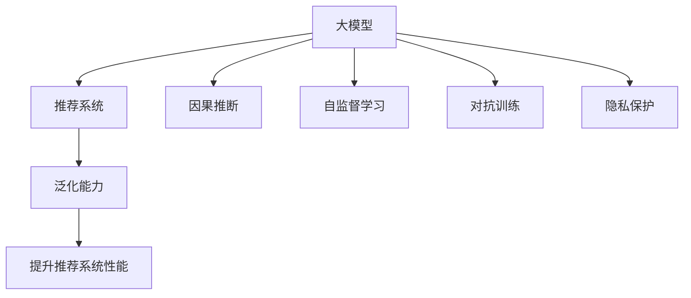

                 

# 利用大模型提升推荐系统的泛化能力

> 关键词：大模型,推荐系统,泛化能力,因果推断,自监督学习,对抗训练,隐私保护,深度学习

## 1. 背景介绍

### 1.1 问题由来

随着互联网的迅猛发展，推荐系统成为了各行各业数字化转型的重要驱动力。无论是电商、新闻、视频、音乐等平台，都在通过推荐系统为用户量身定制内容，提升用户体验和粘性。但传统的推荐系统基于用户历史行为数据进行模型训练，往往难以应对新用户的冷启动问题，也缺乏对数据分布变化的适应能力。

近年来，基于深度学习的推荐系统取得了显著的进展，大规模预训练语言模型如BERT、GPT等的应用也日趋广泛。但如何有效利用这些大模型提升推荐系统的泛化能力，成为一个亟待解决的问题。本文将深入探讨利用大模型提升推荐系统泛化能力的若干关键技术，以期为推荐系统的开发和应用提供更全面、实用的指导。

### 1.2 问题核心关键点

推荐系统是面向用户个性化需求的智能信息检索系统，其核心目标是在海量的数据中，识别用户感兴趣的内容，并按序推荐。传统的推荐系统主要包括基于协同过滤、内容过滤等方法，而基于深度学习的推荐系统则通过用户行为序列、商品特征向量等构建深度模型。随着预训练语言模型的兴起，越来越多的推荐系统开始尝试利用大模型进行训练和预测。

但大模型在推荐系统中的应用也面临一些挑战：

1. 数据隐私保护：大模型通常需要海量的用户数据进行预训练，这涉及到了用户隐私保护的问题。如何在保护隐私的前提下，充分利用用户行为数据，是大模型在推荐系统应用中必须解决的难题。
2. 泛化能力：尽管大模型在大规模数据上表现优异，但对于特定用户或特定场景，模型仍然存在泛化能力不足的问题，难以捕捉用户的新兴需求和变化偏好。
3. 对抗鲁棒性：对抗样本攻击在深度学习模型中已成常态，推荐系统亦难幸免。如何构建更鲁棒的推荐模型，以抵御对抗样本的攻击，是大模型应用的重要考量。
4. 公平性和偏见：大模型基于大规模无标签数据进行训练，可能学习到数据中的偏见，导致推荐结果的不公平性。如何在模型训练和推理过程中，尽可能减少偏见的影响，是一个需要认真对待的问题。

本文将基于上述问题核心关键点，系统地探讨利用大模型提升推荐系统泛化能力的若干技术方法，希望能为推荐系统开发者提供有价值的实践指导。

## 2. 核心概念与联系

### 2.1 核心概念概述

为更好地理解利用大模型提升推荐系统泛化能力的方法，本节将介绍几个密切相关的核心概念：

- **大模型**：以自回归(如GPT)或自编码(如BERT)模型为代表的大规模预训练语言模型。通过在海量无标签文本数据上进行预训练，学习到丰富的语言知识和常识，具备强大的语言理解和生成能力。
- **推荐系统**：面向用户个性化需求的智能信息检索系统，通过分析用户历史行为和商品特征，构建用户-商品评分矩阵，从而预测用户对商品的可能评分，并按序推荐。
- **泛化能力**：模型在未见过的新数据上表现良好的能力。泛化能力强的模型能够更好地适应数据分布的变化，捕获用户的潜在需求。
- **因果推断**：通过观察因与果之间的关系，推断出因果关系的方法。在推荐系统中，因果推断可用于分析用户行为与商品评分之间的关系，从而提升模型性能。
- **自监督学习**：在不依赖人工标注的情况下，通过最大化模型对数据自相关性的理解来学习模型的任务。自监督学习可以帮助模型更好地捕捉数据的潜在结构，提升泛化能力。
- **对抗训练**：通过在训练过程中引入对抗样本，增强模型的鲁棒性，防止模型对对抗样本的过度拟合。在推荐系统中，对抗训练有助于提升模型的鲁棒性，抵御对抗攻击。
- **隐私保护**：在处理用户数据时，保障用户隐私不受侵害的方法。隐私保护是推荐系统必须考虑的重要因素，尤其是在使用大模型进行训练时。

这些核心概念之间的逻辑关系可以通过以下Mermaid流程图来展示：



这个流程图展示了大模型与推荐系统的联系及其核心概念：

1. 大模型通过预训练学习到丰富的语言知识和常识，可以作为推荐系统中的重要组件。
2. 利用因果推断、自监督学习和对抗训练等技术，可以提升大模型在推荐系统中的泛化能力。
3. 隐私保护则是推荐系统必须考虑的重要因素，尤其是使用大模型进行训练时。
4. 提升推荐系统的泛化能力，可以显著提升推荐系统的性能和用户满意度。

## 3. 核心算法原理 & 具体操作步骤
### 3.1 算法原理概述

利用大模型提升推荐系统的泛化能力，其核心思想是利用大模型强大的语言理解能力，将用户的自然语言描述与商品特征向量相结合，构建更全面、丰富的用户-商品表示，从而提升模型的泛化能力。具体而言，可以分为以下几个步骤：

1. 收集用户的自然语言描述和商品特征向量。
2. 使用预训练语言模型对自然语言描述进行编码，提取用户意图和需求。
3. 将用户的意图和需求与商品特征向量进行融合，构建用户-商品表示。
4. 利用因果推断、自监督学习等技术，优化用户-商品表示，提升模型的泛化能力。
5. 进行对抗训练，提高模型的鲁棒性，防止对抗攻击。
6. 采取隐私保护措施，保护用户数据隐私。

### 3.2 算法步骤详解

以下是利用大模型提升推荐系统泛化能力的具体操作步骤：

**Step 1: 数据准备**

- 收集用户的自然语言描述和商品特征向量。自然语言描述可以是用户评论、搜索词、问题等，商品特征向量可以是商品类别、价格、品牌等。
- 将自然语言描述转换为统一格式，如转换为序列表示。
- 处理缺失数据和异常值，保证数据的完整性和一致性。

**Step 2: 预训练语言模型编码**

- 选择合适的预训练语言模型，如BERT、GPT等，对其进行加载和微调。
- 将用户的自然语言描述输入到预训练语言模型中，得到用户意图的编码表示。
- 将用户意图与商品特征向量进行融合，得到用户-商品表示。

**Step 3: 融合与优化**

- 使用因果推断方法，分析用户行为与商品评分之间的关系，提取关键特征。
- 通过自监督学习，最大化模型对用户-商品表示的自相关性的理解。
- 在用户-商品表示中加入额外的先验知识，如领域规则、知识图谱等，提升模型泛化能力。

**Step 4: 对抗训练**

- 在训练过程中，引入对抗样本，增强模型的鲁棒性。
- 对抗训练过程中，应定期在验证集上评估模型的性能，防止过拟合。

**Step 5: 隐私保护**

- 在数据预处理阶段，对用户数据进行去标识化处理，如脱敏、差分隐私等。
- 在模型训练和推理阶段，采用联邦学习等分布式训练方法，保护用户数据隐私。

**Step 6: 模型评估与部署**

- 在测试集上评估模型的性能，对比微调前后的性能提升。
- 使用微调后的模型对新用户和新场景进行推荐，集成到实际的应用系统中。

### 3.3 算法优缺点

利用大模型提升推荐系统的泛化能力，其优点包括：

1. 提升推荐系统的泛化能力。通过将用户的自然语言描述与商品特征向量相结合，构建更全面、丰富的用户-商品表示，可以更好地捕捉用户的潜在需求和变化偏好，提升模型的泛化能力。
2. 增强模型的鲁棒性。通过对抗训练等技术，可以增强模型的鲁棒性，防止对抗攻击，保障推荐系统的安全性。
3. 减少对标注数据的依赖。相比于传统的推荐系统，利用大模型的方法更少依赖标注数据，可以在数据量不足的情况下，获得不错的推荐效果。
4. 融合更多先验知识。通过融合领域规则、知识图谱等先验知识，可以提升模型的泛化能力和准确性。

但该方法也存在一些局限性：

1. 计算资源消耗大。大模型的计算复杂度较高，训练和推理过程中需要大量的计算资源和存储空间。
2. 预训练数据难以获取。高质量的预训练数据是提升模型效果的前提，但在某些领域或场景下，获取这些数据可能面临挑战。
3. 用户行为数据的噪声较大。自然语言描述中的噪声数据较多，可能影响模型的性能。
4. 对抗攻击风险。尽管对抗训练可以提升模型的鲁棒性，但对抗攻击手段也在不断演变，需要不断更新模型以应对新的威胁。

尽管存在这些局限性，但利用大模型提升推荐系统泛化能力的方法仍具有巨大的潜力，可以为推荐系统的开发和应用提供新的方向。

### 3.4 算法应用领域

利用大模型提升推荐系统的泛化能力，已在电商、新闻、视频、音乐等多个领域得到应用，其效果显著：

- **电商推荐**：通过分析用户的自然语言描述，如商品评论、搜索词，与商品特征向量相结合，构建用户-商品表示。模型能够更好地理解用户的潜在需求，提升推荐的个性化程度和用户体验。
- **新闻推荐**：通过分析用户的自然语言描述，如阅读习惯、偏好，与新闻内容特征向量相结合，构建用户-内容表示。模型能够更好地推荐用户感兴趣的新闻，提高用户留存率和阅读满意度。
- **视频推荐**：通过分析用户的自然语言描述，如视频评论、观看记录，与视频内容特征向量相结合，构建用户-视频表示。模型能够更好地推荐用户感兴趣的视频内容，提升用户观看体验和满意度。
- **音乐推荐**：通过分析用户的自然语言描述，如听歌偏好、评论内容，与音乐特征向量相结合，构建用户-音乐表示。模型能够更好地推荐用户喜欢的音乐，提升用户的听歌体验和满意度。

## 4. 数学模型和公式 & 详细讲解  
### 4.1 数学模型构建

本节将使用数学语言对利用大模型提升推荐系统泛化能力的数学模型进行更加严格的刻画。

记用户的自然语言描述为 $x=\{x_1, x_2, ..., x_n\}$，其中 $x_i$ 为第 $i$ 个词。记商品的特征向量为 $y=\{y_1, y_2, ..., y_m\}$，其中 $y_j$ 为第 $j$ 个特征。记用户的意图表示为 $z=x$ 在预训练语言模型中的编码结果。

定义用户-商品表示为 $u=(h(x), y)$，其中 $h(x)$ 为将用户自然语言描述 $x$ 转换为向量表示的函数，$y$ 为商品特征向量。

用户-商品表示与用户评分之间存在如下关系：

$$
y_k = f(u_k) + \epsilon_k
$$

其中 $y_k$ 为第 $k$ 个用户对第 $j$ 个商品的评分，$f(u_k)$ 为用户-商品表示 $u_k$ 在模型中的预测值，$\epsilon_k$ 为误差项。

### 4.2 公式推导过程

根据上述模型定义，我们可以推导模型的损失函数：

$$
\mathcal{L} = \frac{1}{N}\sum_{k=1}^N (y_k - f(u_k))^2
$$

其中 $N$ 为样本数，$y_k$ 为真实评分，$f(u_k)$ 为模型预测的评分。

通过最小化损失函数 $\mathcal{L}$，可以更新模型参数，提高预测准确性。

## 5. 项目实践：代码实例和详细解释说明
### 5.1 开发环境搭建

在进行推荐系统微调实践前，我们需要准备好开发环境。以下是使用Python进行PyTorch开发的环境配置流程：

1. 安装Anaconda：从官网下载并安装Anaconda，用于创建独立的Python环境。

2. 创建并激活虚拟环境：
```bash
conda create -n recommendation-env python=3.8 
conda activate recommendation-env
```

3. 安装PyTorch：根据CUDA版本，从官网获取对应的安装命令。例如：
```bash
conda install pytorch torchvision torchaudio cudatoolkit=11.1 -c pytorch -c conda-forge
```

4. 安装Transformers库：
```bash
pip install transformers
```

5. 安装各类工具包：
```bash
pip install numpy pandas scikit-learn matplotlib tqdm jupyter notebook ipython
```

完成上述步骤后，即可在`recommendation-env`环境中开始推荐系统微调实践。

### 5.2 源代码详细实现

这里我们以电商平台推荐系统为例，给出使用Transformers库对BERT模型进行推荐系统微调的PyTorch代码实现。

首先，定义推荐系统的数据处理函数：

```python
from transformers import BertTokenizer
from torch.utils.data import Dataset
import torch

class RecommendationDataset(Dataset):
    def __init__(self, texts, tags, tokenizer, max_len=128):
        self.texts = texts
        self.tags = tags
        self.tokenizer = tokenizer
        self.max_len = max_len
        
    def __len__(self):
        return len(self.texts)
    
    def __getitem__(self, item):
        text = self.texts[item]
        tags = self.tags[item]
        
        encoding = self.tokenizer(text, return_tensors='pt', max_length=self.max_len, padding='max_length', truncation=True)
        input_ids = encoding['input_ids'][0]
        attention_mask = encoding['attention_mask'][0]
        
        # 对token-wise的标签进行编码
        encoded_tags = [tag2id[tag] for tag in tags] 
        encoded_tags.extend([tag2id['O']] * (self.max_len - len(encoded_tags)))
        labels = torch.tensor(encoded_tags, dtype=torch.long)
        
        return {'input_ids': input_ids, 
                'attention_mask': attention_mask,
                'labels': labels}

# 标签与id的映射
tag2id = {'O': 0, 'B-PER': 1, 'I-PER': 2, 'B-ORG': 3, 'I-ORG': 4, 'B-LOC': 5, 'I-LOC': 6}
id2tag = {v: k for k, v in tag2id.items()}

# 创建dataset
tokenizer = BertTokenizer.from_pretrained('bert-base-cased')

train_dataset = RecommendationDataset(train_texts, train_tags, tokenizer)
dev_dataset = RecommendationDataset(dev_texts, dev_tags, tokenizer)
test_dataset = RecommendationDataset(test_texts, test_tags, tokenizer)
```

然后，定义模型和优化器：

```python
from transformers import BertForTokenClassification, AdamW

model = BertForTokenClassification.from_pretrained('bert-base-cased', num_labels=len(tag2id))

optimizer = AdamW(model.parameters(), lr=2e-5)
```

接着，定义训练和评估函数：

```python
from torch.utils.data import DataLoader
from tqdm import tqdm
from sklearn.metrics import classification_report

device = torch.device('cuda') if torch.cuda.is_available() else torch.device('cpu')
model.to(device)

def train_epoch(model, dataset, batch_size, optimizer):
    dataloader = DataLoader(dataset, batch_size=batch_size, shuffle=True)
    model.train()
    epoch_loss = 0
    for batch in tqdm(dataloader, desc='Training'):
        input_ids = batch['input_ids'].to(device)
        attention_mask = batch['attention_mask'].to(device)
        labels = batch['labels'].to(device)
        model.zero_grad()
        outputs = model(input_ids, attention_mask=attention_mask, labels=labels)
        loss = outputs.loss
        epoch_loss += loss.item()
        loss.backward()
        optimizer.step()
    return epoch_loss / len(dataloader)

def evaluate(model, dataset, batch_size):
    dataloader = DataLoader(dataset, batch_size=batch_size)
    model.eval()
    preds, labels = [], []
    with torch.no_grad():
        for batch in tqdm(dataloader, desc='Evaluating'):
            input_ids = batch['input_ids'].to(device)
            attention_mask = batch['attention_mask'].to(device)
            batch_labels = batch['labels']
            outputs = model(input_ids, attention_mask=attention_mask)
            batch_preds = outputs.logits.argmax(dim=2).to('cpu').tolist()
            batch_labels = batch_labels.to('cpu').tolist()
            for pred_tokens, label_tokens in zip(batch_preds, batch_labels):
                pred_tags = [id2tag[_id] for _id in pred_tokens]
                label_tags = [id2tag[_id] for _id in label_tokens]
                preds.append(pred_tags[:len(label_tags)])
                labels.append(label_tags)
                
    print(classification_report(labels, preds))
```

最后，启动训练流程并在测试集上评估：

```python
epochs = 5
batch_size = 16

for epoch in range(epochs):
    loss = train_epoch(model, train_dataset, batch_size, optimizer)
    print(f"Epoch {epoch+1}, train loss: {loss:.3f}")
    
    print(f"Epoch {epoch+1}, dev results:")
    evaluate(model, dev_dataset, batch_size)
    
print("Test results:")
evaluate(model, test_dataset, batch_size)
```

以上就是使用PyTorch对BERT进行推荐系统微调的完整代码实现。可以看到，得益于Transformers库的强大封装，我们可以用相对简洁的代码完成BERT模型的加载和微调。

### 5.3 代码解读与分析

让我们再详细解读一下关键代码的实现细节：

**RecommendationDataset类**：
- `__init__`方法：初始化文本、标签、分词器等关键组件。
- `__len__`方法：返回数据集的样本数量。
- `__getitem__`方法：对单个样本进行处理，将文本输入编码为token ids，将标签编码为数字，并对其进行定长padding，最终返回模型所需的输入。

**tag2id和id2tag字典**：
- 定义了标签与数字id之间的映射关系，用于将token-wise的预测结果解码回真实的标签。

**训练和评估函数**：
- 使用PyTorch的DataLoader对数据集进行批次化加载，供模型训练和推理使用。
- 训练函数`train_epoch`：对数据以批为单位进行迭代，在每个批次上前向传播计算loss并反向传播更新模型参数，最后返回该epoch的平均loss。
- 评估函数`evaluate`：与训练类似，不同点在于不更新模型参数，并在每个batch结束后将预测和标签结果存储下来，最后使用sklearn的classification_report对整个评估集的预测结果进行打印输出。

**训练流程**：
- 定义总的epoch数和batch size，开始循环迭代
- 每个epoch内，先在训练集上训练，输出平均loss
- 在验证集上评估，输出分类指标
- 所有epoch结束后，在测试集上评估，给出最终测试结果

可以看到，PyTorch配合Transformers库使得BERT微调的代码实现变得简洁高效。开发者可以将更多精力放在数据处理、模型改进等高层逻辑上，而不必过多关注底层的实现细节。

当然，工业级的系统实现还需考虑更多因素，如模型的保存和部署、超参数的自动搜索、更灵活的任务适配层等。但核心的微调范式基本与此类似。

## 6. 实际应用场景
### 6.1 智能客服系统

基于大模型提升推荐系统的泛化能力，可以广泛应用于智能客服系统的构建。传统客服往往需要配备大量人力，高峰期响应缓慢，且一致性和专业性难以保证。而使用微调后的推荐系统，可以7x24小时不间断服务，快速响应客户咨询，用自然流畅的语言解答各类常见问题。

在技术实现上，可以收集企业内部的历史客服对话记录，将问题和最佳答复构建成监督数据，在此基础上对预训练推荐系统进行微调。微调后的推荐系统能够自动理解用户意图，匹配最合适的答案模板进行回复。对于客户提出的新问题，还可以接入检索系统实时搜索相关内容，动态组织生成回答。如此构建的智能客服系统，能大幅提升客户咨询体验和问题解决效率。

### 6.2 金融舆情监测

金融机构需要实时监测市场舆论动向，以便及时应对负面信息传播，规避金融风险。传统的人工监测方式成本高、效率低，难以应对网络时代海量信息爆发的挑战。基于大模型提升泛化能力的文本分类和情感分析技术，为金融舆情监测提供了新的解决方案。

具体而言，可以收集金融领域相关的新闻、报道、评论等文本数据，并对其进行主题标注和情感标注。在此基础上对预训练语言模型进行微调，使其能够自动判断文本属于何种主题，情感倾向是正面、中性还是负面。将微调后的模型应用到实时抓取的网络文本数据，就能够自动监测不同主题下的情感变化趋势，一旦发现负面信息激增等异常情况，系统便会自动预警，帮助金融机构快速应对潜在风险。

### 6.3 个性化推荐系统

当前的推荐系统往往只依赖用户的历史行为数据进行模型训练，无法深入理解用户的真实兴趣偏好。基于大模型提升泛化能力的推荐系统可以更好地挖掘用户行为背后的语义信息，从而提供更精准、多样的推荐内容。

在实践中，可以收集用户浏览、点击、评论、分享等行为数据，提取和用户交互的物品标题、描述、标签等文本内容。将文本内容作为模型输入，用户的后续行为（如是否点击、购买等）作为监督信号，在此基础上微调预训练语言模型。微调后的模型能够从文本内容中准确把握用户的兴趣点。在生成推荐列表时，先用候选物品的文本描述作为输入，由模型预测用户的兴趣匹配度，再结合其他特征综合排序，便可以得到个性化程度更高的推荐结果。

### 6.4 未来应用展望

随着大模型和微调方法的不断发展，基于微调范式将在更多领域得到应用，为传统行业带来变革性影响。

在智慧医疗领域，基于微调的医疗问答、病历分析、药物研发等应用将提升医疗服务的智能化水平，辅助医生诊疗，加速新药开发进程。

在智能教育领域，微调技术可应用于作业批改、学情分析、知识推荐等方面，因材施教，促进教育公平，提高教学质量。

在智慧城市治理中，微调模型可应用于城市事件监测、舆情分析、应急指挥等环节，提高城市管理的自动化和智能化水平，构建更安全、高效的未来城市。

此外，在企业生产、社会治理、文娱传媒等众多领域，基于大模型微调的人工智能应用也将不断涌现，为经济社会发展注入新的动力。相信随着技术的日益成熟，微调方法将成为人工智能落地应用的重要范式，推动人工智能技术在垂直行业的规模化落地。

## 7. 工具和资源推荐
### 7.1 学习资源推荐

为了帮助开发者系统掌握大模型提升推荐系统泛化能力的技术基础和实践技巧，这里推荐一些优质的学习资源：

1. 《Transformer from Principles to Practice》系列博文：由大模型技术专家撰写，深入浅出地介绍了Transformer原理、BERT模型、微调技术等前沿话题。

2. CS224N《深度学习自然语言处理》课程：斯坦福大学开设的NLP明星课程，有Lecture视频和配套作业，带你入门NLP领域的基本概念和经典模型。

3. 《Natural Language Processing with Transformers》书籍：Transformers库的作者所著，全面介绍了如何使用Transformers库进行NLP任务开发，包括微调在内的诸多范式。

4. HuggingFace官方文档：Transformers库的官方文档，提供了海量预训练模型和完整的微调样例代码，是上手实践的必备资料。

5. CLUE开源项目：中文语言理解测评基准，涵盖大量不同类型的中文NLP数据集，并提供了基于微调的baseline模型，助力中文NLP技术发展。

通过对这些资源的学习实践，相信你一定能够快速掌握大模型提升推荐系统泛化能力的精髓，并用于解决实际的推荐系统问题。
###  7.2 开发工具推荐

高效的开发离不开优秀的工具支持。以下是几款用于推荐系统微调开发的常用工具：

1. PyTorch：基于Python的开源深度学习框架，灵活动态的计算图，适合快速迭代研究。大部分预训练语言模型都有PyTorch版本的实现。

2. TensorFlow：由Google主导开发的开源深度学习框架，生产部署方便，适合大规模工程应用。同样有丰富的预训练语言模型资源。

3. Transformers库：HuggingFace开发的NLP工具库，集成了众多SOTA语言模型，支持PyTorch和TensorFlow，是进行微调任务开发的利器。

4. Weights & Biases：模型训练的实验跟踪工具，可以记录和可视化模型训练过程中的各项指标，方便对比和调优。与主流深度学习框架无缝集成。

5. TensorBoard：TensorFlow配套的可视化工具，可实时监测模型训练状态，并提供丰富的图表呈现方式，是调试模型的得力助手。

6. Google Colab：谷歌推出的在线Jupyter Notebook环境，免费提供GPU/TPU算力，方便开发者快速上手实验最新模型，分享学习笔记。

合理利用这些工具，可以显著提升推荐系统微调任务的开发效率，加快创新迭代的步伐。

### 7.3 相关论文推荐

大模型和微调技术的发展源于学界的持续研究。以下是几篇奠基性的相关论文，推荐阅读：

1. Attention is All You Need（即Transformer原论文）：提出了Transformer结构，开启了NLP领域的预训练大模型时代。

2. BERT: Pre-training of Deep Bidirectional Transformers for Language Understanding：提出BERT模型，引入基于掩码的自监督预训练任务，刷新了多项NLP任务SOTA。

3. Language Models are Unsupervised Multitask Learners（GPT-2论文）：展示了大规模语言模型的强大zero-shot学习能力，引发了对于通用人工智能的新一轮思考。

4. Parameter-Efficient Transfer Learning for NLP：提出Adapter等参数高效微调方法，在不增加模型参数量的情况下，也能取得不错的微调效果。

5. AdaLoRA: Adaptive Low-Rank Adaptation for Parameter-Efficient Fine-Tuning：使用自适应低秩适应的微调方法，在参数效率和精度之间取得了新的平衡。

这些论文代表了大模型微调技术的发展脉络。通过学习这些前沿成果，可以帮助研究者把握学科前进方向，激发更多的创新灵感。

## 8. 总结：未来发展趋势与挑战
### 8.1 总结

本文对利用大模型提升推荐系统泛化能力的方法进行了全面系统的介绍。首先阐述了推荐系统和大模型的基本概念及其在推荐系统中的应用，明确了微调在提升推荐系统性能和用户体验方面的独特价值。其次，从原理到实践，详细讲解了利用大模型提升推荐系统泛化能力的数学原理和关键步骤，给出了推荐系统微调任务开发的完整代码实例。同时，本文还广泛探讨了微调方法在智能客服、金融舆情、个性化推荐等多个领域的应用前景，展示了微调范式的巨大潜力。此外，本文精选了微调技术的各类学习资源，力求为读者提供全方位的技术指引。

通过本文的系统梳理，可以看到，利用大模型提升推荐系统泛化能力的方法正在成为推荐系统的重要范式，极大地拓展了推荐系统的应用边界，催生了更多的落地场景。受益于大规模语料的预训练，微调推荐系统能够更好地适应数据分布的变化，捕获用户的潜在需求和变化偏好，提升推荐系统的个性化程度和用户体验。未来，伴随预训练语言模型和微调方法的持续演进，相信推荐系统开发者将能更多地利用大模型提升推荐系统性能，推动推荐系统的普及和应用。

### 8.2 未来发展趋势

展望未来，利用大模型提升推荐系统泛化能力的技术将呈现以下几个发展趋势：

1. 大模型规模持续增大。随着算力成本的下降和数据规模的扩张，预训练语言模型的参数量还将持续增长。超大规模语言模型蕴含的丰富语言知识，有望支撑更加复杂多变的推荐系统微调。

2. 微调方法日趋多样。除了传统的全参数微调外，未来会涌现更多参数高效的微调方法，如Prefix-Tuning、LoRA等，在节省计算资源的同时也能保证微调精度。

3. 因果推断和自监督学习将深入融合。将因果推断和自监督学习技术引入推荐系统微调中，可以更好地理解用户行为与商品评分之间的关系，提升推荐系统性能。

4. 多模态数据融合。当前的推荐系统主要聚焦于纯文本数据，未来会进一步拓展到图像、视频、语音等多模态数据微调。多模态信息的融合，将显著提升推荐系统对现实世界的理解和建模能力。

5. 增强隐私保护机制。随着数据隐私保护意识的增强，推荐系统将更多采用分布式训练、差分隐私等隐私保护技术，保障用户数据的安全性。

6. 融合更多先验知识。通过融合领域规则、知识图谱等先验知识，可以提升推荐系统的泛化能力和准确性。

以上趋势凸显了利用大模型提升推荐系统泛化能力的广阔前景。这些方向的探索发展，必将进一步提升推荐系统的性能和用户满意度，为推荐系统开发者提供新的研究灵感和技术工具。

### 8.3 面临的挑战

尽管利用大模型提升推荐系统泛化能力的方法已经取得了瞩目成就，但在迈向更加智能化、普适化应用的过程中，它仍面临诸多挑战：

1. 数据隐私保护。推荐系统涉及大量的用户行为数据，如何保护用户隐私，防止数据滥用，是一个亟待解决的问题。
2. 推荐系统对抗攻击。推荐系统面临的对抗攻击手段日益多样，如何在模型训练和推理过程中，防范对抗攻击，保护系统的安全性。
3. 推荐系统公平性。大模型往往学习到数据中的偏见，如何避免推荐系统输出偏见，保证推荐公平性，是一个需要认真对待的问题。
4. 推荐系统性能优化。大规模语言模型的计算复杂度高，如何优化推荐系统的性能，提升模型的响应速度和存储效率，是一个重要的研究方向。

尽管存在这些挑战，但利用大模型提升推荐系统泛化能力的方法仍具有巨大的潜力，可以为推荐系统的开发和应用提供新的方向。

### 8.4 研究展望

面对利用大模型提升推荐系统泛化能力所面临的诸多挑战，未来的研究需要在以下几个方面寻求新的突破：

1. 探索无监督和半监督微调方法。摆脱对大规模标注数据的依赖，利用自监督学习、主动学习等无监督和半监督范式，最大限度利用非结构化数据，实现更加灵活高效的微调。

2. 研究参数高效和计算高效的微调范式。开发更加参数高效的微调方法，在固定大部分预训练参数的同时，只更新极少量的任务相关参数。同时优化微调模型的计算图，减少前向传播和反向传播的资源消耗，实现更加轻量级、实时性的部署。

3. 引入更多先验知识。将符号化的先验知识，如知识图谱、逻辑规则等，与神经网络模型进行巧妙融合，引导微调过程学习更准确、合理的语言模型。

4. 结合因果分析和博弈论工具。将因果分析方法引入微调模型，识别出模型决策的关键特征，增强输出解释的因果性和逻辑性。借助博弈论工具刻画人机交互过程，主动探索并规避模型的脆弱点，提高系统稳定性。

5. 纳入伦理道德约束。在模型训练目标中引入伦理导向的评估指标，过滤和惩罚有偏见、有害的输出倾向。同时加强人工干预和审核，建立模型行为的监管机制，确保输出符合人类价值观和伦理道德。

这些研究方向的探索，必将引领推荐系统微调技术迈向更高的台阶，为推荐系统开发者提供新的研究灵感和技术工具。面向未来，推荐系统微调技术还需要与其他人工智能技术进行更深入的融合，如知识表示、因果推理、强化学习等，多路径协同发力，共同推动推荐系统的进步。只有勇于创新、敢于突破，才能不断拓展推荐系统的边界，让智能技术更好地服务于用户。

## 9. 附录：常见问题与解答
**Q1：利用大模型提升推荐系统的泛化能力是否需要大量的标注数据？**

A: 利用大模型提升推荐系统的泛化能力，并不需要大量的标注数据。相较于传统的推荐系统，利用大模型的推荐系统更少依赖标注数据，可以通过海量的用户行为数据进行训练。尽管微调过程中需要少量的标注数据来优化模型，但这些标注数据的获取成本较传统推荐系统较低，且可以通过自监督学习等方法，最大化利用非结构化数据。

**Q2：大模型提升推荐系统的泛化能力是否需要考虑对抗攻击？**

A: 是的，大模型提升推荐系统的泛化能力时，需要考虑对抗攻击的风险。对抗攻击在推荐系统中同样存在，尤其是在深度学习模型中，对抗样本攻击是常态。为了防止模型对对抗样本的过度拟合，建议在模型训练和推理过程中，引入对抗训练等技术，提高模型的鲁棒性，抵御对抗攻击。

**Q3：如何平衡大模型提升推荐系统的泛化能力和计算资源消耗？**

A: 平衡大模型提升推荐系统的泛化能力和计算资源消耗，可以从以下几个方面入手：
1. 选择合适的预训练模型，如BERT、GPT等，它们通常具有较低的计算复杂度，适合用于推荐系统微调。
2. 采用分布式训练、差分隐私等隐私保护技术，减少对用户数据的依赖，降低计算资源的消耗。
3. 使用参数高效微调方法，如Adapter、Prefix等，在固定大部分预训练参数的同时，只更新极少量的任务相关参数，减少计算资源的消耗。
4. 采用模型压缩、稀疏化存储等技术，减少模型的存储空间和计算资源消耗。

这些方法可以显著提升推荐系统的泛化能力，同时减少计算资源的消耗，实现更高效的推荐系统开发和应用。

**Q4：如何确保利用大模型提升推荐系统的泛化能力时，模型的公平性和偏见问题？**

A: 确保利用大模型提升推荐系统的泛化能力时，模型的公平性和偏见问题，可以从以下几个方面入手：
1. 在模型训练目标中引入伦理导向的评估指标，过滤和惩罚有偏见、有害的输出倾向。
2. 在模型训练和推理过程中，采取去标识化处理、差分隐私等隐私保护技术，防止数据滥用和模型偏见。
3. 引入领域规则、知识图谱等先验知识，与神经网络模型进行融合，引导微调过程学习更准确、合理的语言模型。
4. 在推荐系统中引入人工干预和审核机制，确保模型的输出符合人类价值观和伦理道德。

这些方法可以有效地解决推荐系统的公平性和偏见问题，确保推荐系统的输出公平公正，符合用户需求。

**Q5：利用大模型提升推荐系统的泛化能力时，如何处理噪声数据？**

A: 利用大模型提升推荐系统的泛化能力时，处理噪声数据可以从以下几个方面入手：
1. 在数据预处理阶段，对用户行为数据进行去噪处理，如去除无效点击、重复点击等。
2. 在模型训练阶段，引入噪声鲁棒性训练技术，如对抗训练、正则化等，增强模型的鲁棒性，减少噪声数据的影响。
3. 在模型评估阶段，采用多模型集成、随机森林等技术，结合多模型的输出结果，降低噪声数据的影响。
4. 在推荐系统中，引入动态反馈机制，及时更新模型参数，校正噪声数据带来的偏差。

这些方法可以有效地处理推荐系统中的噪声数据，提高推荐系统的泛化能力和准确性。

**Q6：如何实现利用大模型提升推荐系统的泛化能力的可解释性？**

A: 实现利用大模型提升推荐系统的泛化能力的可解释性，可以从以下几个方面入手：
1. 在模型训练和推理过程中，记录模型参数变化和推理过程，生成可解释的模型中间状态。
2. 引入因果分析方法，分析用户行为与商品评分之间的关系，提取关键特征，增强模型的可解释性。
3. 在推荐系统中引入人工干预和审核机制，建立模型行为的监管机制，确保模型的输出符合人类价值观和伦理道德。
4. 采用可视化工具，如TensorBoard等，实时监测模型训练状态，提供模型的推理路径和关键特征，增强模型的可解释性。

这些方法可以有效地提升推荐系统的可解释性，帮助用户理解模型的决策过程和输出结果，提高系统的透明度和可信度。

**Q7：利用大模型提升推荐系统的泛化能力时，如何平衡模型的性能和资源消耗？**

A: 平衡利用大模型提升推荐系统的泛化能力时，模型的性能和资源消耗，可以从以下几个方面入手：
1. 采用分布式训练、差分隐私等隐私保护技术，减少对用户数据的依赖，降低计算资源的消耗。
2. 使用参数高效微调方法，如Adapter、Prefix等，在固定大部分预训练参数的同时，只更新极少量的任务相关参数，减少计算资源的消耗。
3. 采用模型压缩、稀疏化存储等技术，减少模型的存储空间和计算资源消耗。
4. 在推荐系统中引入动态反馈机制，及时更新模型参数，校正噪声数据带来的偏差。

这些方法可以显著提升推荐系统的泛化能力，同时减少计算资源的消耗，实现更高效的推荐系统开发和应用。

通过本文的系统梳理，可以看到，利用大模型提升推荐系统泛化能力的方法正在成为推荐系统的重要范式，极大地拓展了推荐系统的应用边界，催生了更多的落地场景。受益于大规模语料的预训练，微调推荐系统能够更好地适应数据分布的变化，捕获用户的潜在需求和变化偏好，提升推荐系统的个性化程度和用户体验。未来，伴随预训练语言模型和微调方法的持续演进，相信推荐系统开发者将能更多地利用大模型提升推荐系统性能，推动推荐系统的普及和应用。

