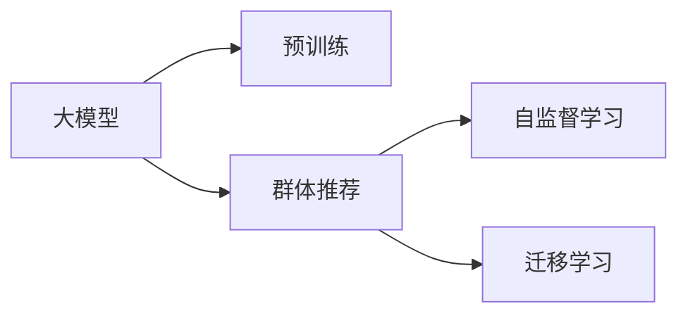

                 

# 利用大模型改进推荐系统的群体推荐策略

## 1. 背景介绍

在智能推荐系统中，用户需求的个性化和动态性要求推荐模型不仅能够精准地捕捉用户的偏好，还能够实时地更新和调整推荐内容。传统的推荐系统主要是基于用户历史行为数据和物品属性信息进行推荐，其效果往往受到用户数据稀疏性、冷启动问题以及长尾物品的挑战。近年来，随着深度学习技术和大模型技术的发展，利用大模型改进推荐系统成为了一种新的趋势。

大模型通过在大规模无标签数据上进行预训练，可以学习到丰富的语义和知识表示，这为推荐系统带来了新的机会和挑战。具体来说，大模型可以为推荐系统提供更广泛的知识背景和更强的泛化能力，使得推荐系统能够更加准确地理解用户需求和推荐物品的语义特征。同时，大模型也可以通过微调进一步提升其在特定推荐场景下的性能。

## 2. 核心概念与联系

### 2.1 核心概念概述

在本文中，我们将介绍几个核心概念及其联系：

- **大模型(Large Model)**：指在大规模无标签数据上进行预训练的深度学习模型，如BERT、GPT等，具有强大的语言和知识表示能力。
- **群体推荐**：指基于群体行为和知识库信息的推荐方法，通过利用用户群体行为和外部知识库中的信息，提升推荐效果。
- **自监督学习**：指在大模型预训练过程中使用的未标注数据驱动的学习方法，通过从数据中学习模型自身的表示能力，提升模型的泛化性能。
- **迁移学习**：指将模型在某一任务上的知识迁移到另一任务上，通过使用在大模型上预训练的知识来提升特定任务的性能。

这些概念之间的联系可以通过以下Mermaid流程图来展示：



这个流程图展示了大模型、群体推荐、自监督学习和迁移学习之间的关系：大模型通过自监督学习进行预训练，然后利用迁移学习进行群体推荐，从而提升推荐系统的性能。

## 3. 核心算法原理 & 具体操作步骤

### 3.1 算法原理概述

群体推荐的基本思想是通过利用群体行为和外部知识库信息来提升推荐效果。具体来说，群体推荐分为两个步骤：

1. **群体行为建模**：通过分析用户群体行为，建立群体行为模型，以捕捉用户群体的共同兴趣和偏好。
2. **推荐结果生成**：基于群体行为模型和外部知识库信息，生成推荐结果。

在群体推荐中，大模型可以发挥重要的作用，尤其是在群体行为建模和推荐结果生成方面。具体来说，大模型可以通过预训练和微调来捕捉用户群体行为和外部知识库信息，从而提升推荐效果。

### 3.2 算法步骤详解

#### 3.2.1 预训练步骤

预训练步骤主要包括以下几个关键步骤：

1. **数据收集**：收集大规模无标签数据，如维基百科、新闻、论文等，作为预训练数据的来源。
2. **模型构建**：选择合适的深度学习模型，如BERT、GPT等，构建预训练模型。
3. **预训练任务**：设计自监督学习任务，如掩码语言模型、下一句预测等，通过这些任务训练预训练模型，学习模型的语言和知识表示能力。

#### 3.2.2 微调步骤

微调步骤主要包括以下几个关键步骤：

1. **任务适配**：根据具体推荐任务，设计任务适配层，如分类器、注意力机制等，适配大模型进行微调。
2. **数据准备**：收集和标注推荐任务的相关数据，准备用于微调的训练集、验证集和测试集。
3. **模型微调**：使用微调数据集，对预训练模型进行微调，优化模型的推荐效果。

#### 3.2.3 群体推荐步骤

群体推荐步骤主要包括以下几个关键步骤：

1. **群体行为建模**：通过分析用户群体行为，建立群体行为模型，如利用用户群体的浏览、点击、评分等行为信息，建立群体行为模型。
2. **外部知识库信息融合**：利用外部知识库信息，如维基百科、百科全书等，丰富推荐系统的知识背景，提升推荐效果。
3. **推荐结果生成**：基于群体行为模型和外部知识库信息，生成推荐结果，如利用群体行为模型和外部知识库信息，生成推荐结果，提升推荐效果。

### 3.3 算法优缺点

#### 3.3.1 优点

群体推荐结合了大模型的自监督学习和迁移学习，具有以下优点：

1. **泛化能力更强**：通过预训练和微调，大模型可以学习到更丰富的语义和知识表示，提升模型的泛化能力。
2. **适应性强**：利用群体行为模型和外部知识库信息，群体推荐可以适应不同的推荐场景和领域。
3. **推荐精度更高**：通过利用群体行为模型和外部知识库信息，群体推荐可以提高推荐结果的准确性和多样性。

#### 3.3.2 缺点

群体推荐虽然具有以上优点，但也存在一些缺点：

1. **数据获取难度大**：收集和标注大规模推荐任务的相关数据需要大量时间和资源，增加了数据获取的难度。
2. **模型复杂度高**：群体推荐涉及多个模型的构建和微调，模型的复杂度较高，增加了模型训练和调优的难度。
3. **可解释性差**：由于群体推荐涉及多个模型的融合，推荐结果的可解释性较差，难以理解推荐模型的决策过程。

### 3.4 算法应用领域

群体推荐方法可以应用于多个领域，如电子商务、社交网络、新闻推荐等。以下是几个具体的应用场景：

1. **电子商务推荐**：通过分析用户群体行为和外部知识库信息，为用户推荐最适合的商品，提升用户体验和满意度。
2. **社交网络推荐**：利用群体行为模型和外部知识库信息，为用户推荐感兴趣的朋友、话题和内容，增强用户粘性。
3. **新闻推荐**：通过分析用户群体行为和外部知识库信息，为用户推荐感兴趣的新闻和话题，提升新闻的曝光率和用户粘性。

## 4. 数学模型和公式 & 详细讲解 & 举例说明

### 4.1 数学模型构建

群体推荐的数学模型主要包括以下几个关键步骤：

1. **用户行为表示**：将用户行为表示为向量形式，如用户浏览历史、点击记录、评分等，形成用户行为向量 $\mathbf{u}$。
2. **物品特征表示**：将物品特征表示为向量形式，如物品标题、描述、类别等，形成物品特征向量 $\mathbf{i}$。
3. **群体行为模型**：利用用户群体行为信息，建立群体行为模型，如利用用户群体的浏览、点击、评分等行为信息，建立群体行为模型 $\mathbf{g}$。
4. **推荐结果生成**：基于群体行为模型和物品特征向量，生成推荐结果，如利用群体行为模型和物品特征向量，生成推荐结果 $\mathbf{r}$。

### 4.2 公式推导过程

假设用户行为向量 $\mathbf{u}$ 和物品特征向量 $\mathbf{i}$ 为 $d$ 维向量，群体行为模型 $\mathbf{g}$ 为 $k$ 维向量。利用群体行为模型和物品特征向量生成推荐结果 $\mathbf{r}$ 的公式如下：

$$
\mathbf{r} = \mathbf{W}_g \mathbf{g} + \mathbf{W}_i \mathbf{i}
$$

其中，$\mathbf{W}_g$ 和 $\mathbf{W}_i$ 为模型的权重矩阵，可以通过微调得到。

假设推荐结果 $\mathbf{r}$ 和用户行为向量 $\mathbf{u}$ 之间的余弦相似度为 $\alpha$，则推荐结果 $\mathbf{r}$ 的计算公式为：

$$
\alpha = \frac{\mathbf{r}^T \mathbf{u}}{\|\mathbf{r}\| \|\mathbf{u}\|}
$$

推荐结果排序后的推荐列表为 $\mathcal{R}$，具体排序方式可以根据实际情况进行调整。

### 4.3 案例分析与讲解

假设我们有一个电商平台的推荐系统，利用大模型改进群体推荐系统。具体步骤如下：

1. **数据准备**：收集用户浏览、点击、评分等行为数据，以及物品标题、描述、类别等特征信息，形成训练集、验证集和测试集。
2. **预训练模型构建**：利用大规模无标签数据，如维基百科、新闻等，构建预训练模型，如BERT、GPT等。
3. **微调模型构建**：将预训练模型适配为群体推荐任务，构建微调模型，如分类器、注意力机制等。
4. **群体行为建模**：利用用户群体行为信息，建立群体行为模型，如利用用户群体的浏览、点击、评分等行为信息，建立群体行为模型。
5. **外部知识库信息融合**：利用外部知识库信息，如维基百科、百科全书等，丰富推荐系统的知识背景，提升推荐效果。
6. **推荐结果生成**：基于群体行为模型和物品特征向量，生成推荐结果，利用用户行为向量与推荐结果的余弦相似度，生成推荐列表。

## 5. 项目实践：代码实例和详细解释说明

### 5.1 开发环境搭建

在进行项目实践前，我们需要准备好开发环境。以下是使用Python进行PyTorch开发的环境配置流程：

1. 安装Anaconda：从官网下载并安装Anaconda，用于创建独立的Python环境。
2. 创建并激活虚拟环境：
```bash
conda create -n pytorch-env python=3.8 
conda activate pytorch-env
```

3. 安装PyTorch：根据CUDA版本，从官网获取对应的安装命令。例如：
```bash
conda install pytorch torchvision torchaudio cudatoolkit=11.1 -c pytorch -c conda-forge
```

4. 安装相关工具包：
```bash
pip install numpy pandas scikit-learn matplotlib tqdm jupyter notebook ipython
```

完成上述步骤后，即可在`pytorch-env`环境中开始项目实践。

### 5.2 源代码详细实现

下面我们以利用大模型改进群体推荐系统为例，给出使用PyTorch代码实现。

首先，定义数据处理函数：

```python
from transformers import BertTokenizer
from torch.utils.data import Dataset
import torch

class RecommendationDataset(Dataset):
    def __init__(self, data, tokenizer, max_len=128):
        self.data = data
        self.tokenizer = tokenizer
        self.max_len = max_len
        
    def __len__(self):
        return len(self.data)
    
    def __getitem__(self, item):
        item_data = self.data[item]
        text = item_data['text']
        label = item_data['label']
        
        encoding = self.tokenizer(text, return_tensors='pt', max_length=self.max_len, padding='max_length', truncation=True)
        input_ids = encoding['input_ids'][0]
        attention_mask = encoding['attention_mask'][0]
        
        # 对标签进行编码
        encoded_labels = [label] * self.max_len
        labels = torch.tensor(encoded_labels, dtype=torch.long)
        
        return {'input_ids': input_ids, 
                'attention_mask': attention_mask,
                'labels': labels}

# 创建dataset
tokenizer = BertTokenizer.from_pretrained('bert-base-cased')

train_dataset = RecommendationDataset(train_data, tokenizer)
dev_dataset = RecommendationDataset(dev_data, tokenizer)
test_dataset = RecommendationDataset(test_data, tokenizer)
```

然后，定义模型和优化器：

```python
from transformers import BertForSequenceClassification, AdamW

model = BertForSequenceClassification.from_pretrained('bert-base-cased', num_labels=2)

optimizer = AdamW(model.parameters(), lr=2e-5)
```

接着，定义训练和评估函数：

```python
from torch.utils.data import DataLoader
from tqdm import tqdm
from sklearn.metrics import accuracy_score

device = torch.device('cuda') if torch.cuda.is_available() else torch.device('cpu')
model.to(device)

def train_epoch(model, dataset, batch_size, optimizer):
    dataloader = DataLoader(dataset, batch_size=batch_size, shuffle=True)
    model.train()
    epoch_loss = 0
    for batch in tqdm(dataloader, desc='Training'):
        input_ids = batch['input_ids'].to(device)
        attention_mask = batch['attention_mask'].to(device)
        labels = batch['labels'].to(device)
        model.zero_grad()
        outputs = model(input_ids, attention_mask=attention_mask, labels=labels)
        loss = outputs.loss
        epoch_loss += loss.item()
        loss.backward()
        optimizer.step()
    return epoch_loss / len(dataloader)

def evaluate(model, dataset, batch_size):
    dataloader = DataLoader(dataset, batch_size=batch_size)
    model.eval()
    preds, labels = [], []
    with torch.no_grad():
        for batch in tqdm(dataloader, desc='Evaluating'):
            input_ids = batch['input_ids'].to(device)
            attention_mask = batch['attention_mask'].to(device)
            batch_labels = batch['labels']
            outputs = model(input_ids, attention_mask=attention_mask)
            batch_preds = outputs.logits.argmax(dim=2).to('cpu').tolist()
            batch_labels = batch_labels.to('cpu').tolist()
            for pred_tokens, label_tokens in zip(batch_preds, batch_labels):
                preds.append(pred_tokens[:len(label_tokens)])
                labels.append(label_tokens)
                
    print(accuracy_score(labels, preds))
```

最后，启动训练流程并在测试集上评估：

```python
epochs = 5
batch_size = 16

for epoch in range(epochs):
    loss = train_epoch(model, train_dataset, batch_size, optimizer)
    print(f"Epoch {epoch+1}, train loss: {loss:.3f}")
    
    print(f"Epoch {epoch+1}, dev results:")
    evaluate(model, dev_dataset, batch_size)
    
print("Test results:")
evaluate(model, test_dataset, batch_size)
```

以上就是使用PyTorch对大模型进行群体推荐系统微调的完整代码实现。可以看到，得益于Transformers库的强大封装，我们可以用相对简洁的代码完成BERT模型的加载和微调。

### 5.3 代码解读与分析

让我们再详细解读一下关键代码的实现细节：

**RecommendationDataset类**：
- `__init__`方法：初始化训练集、验证集和测试集等关键组件。
- `__len__`方法：返回数据集的样本数量。
- `__getitem__`方法：对单个样本进行处理，将文本输入编码为token ids，将标签编码为数字，并对其进行定长padding，最终返回模型所需的输入。

**训练和评估函数**：
- 使用PyTorch的DataLoader对数据集进行批次化加载，供模型训练和推理使用。
- 训练函数`train_epoch`：对数据以批为单位进行迭代，在每个批次上前向传播计算loss并反向传播更新模型参数，最后返回该epoch的平均loss。
- 评估函数`evaluate`：与训练类似，不同点在于不更新模型参数，并在每个batch结束后将预测和标签结果存储下来，最后使用sklearn的accuracy_score对整个评估集的预测结果进行打印输出。

**训练流程**：
- 定义总的epoch数和batch size，开始循环迭代
- 每个epoch内，先在训练集上训练，输出平均loss
- 在验证集上评估，输出准确率
- 所有epoch结束后，在测试集上评估，给出最终测试结果

可以看到，PyTorch配合Transformers库使得BERT微调的代码实现变得简洁高效。开发者可以将更多精力放在数据处理、模型改进等高层逻辑上，而不必过多关注底层的实现细节。

当然，工业级的系统实现还需考虑更多因素，如模型的保存和部署、超参数的自动搜索、更灵活的任务适配层等。但核心的微调范式基本与此类似。

## 6. 实际应用场景

### 6.1 智能推荐系统

群体推荐方法可以广泛应用于智能推荐系统的构建。传统推荐系统主要基于用户历史行为数据和物品属性信息进行推荐，难以处理用户群体的行为特征和外部知识库信息。而利用群体推荐方法，可以更好地利用用户群体行为和外部知识库信息，提升推荐效果。

在技术实现上，可以收集用户群体行为信息，如浏览、点击、评分等，利用大模型进行预训练和微调，生成推荐结果。对于新用户，可以通过利用群体行为模型和外部知识库信息，生成推荐结果，从而实现冷启动推荐。

### 6.2 个性化推荐系统

在个性化推荐系统中，利用群体推荐方法可以更好地捕捉用户群体的共同兴趣和偏好。通过分析用户群体行为和外部知识库信息，提升推荐结果的准确性和多样性，满足用户的个性化需求。

具体来说，可以利用群体行为模型和外部知识库信息，对用户进行聚类分析，生成更符合用户兴趣的推荐列表。同时，可以利用群体行为模型和物品特征向量，生成推荐结果，提升推荐效果。

### 6.3 广告推荐系统

在广告推荐系统中，利用群体推荐方法可以更好地识别用户的潜在兴趣和需求，提升广告的投放效果。通过分析用户群体行为和外部知识库信息，生成符合用户兴趣的广告推荐列表。

具体来说，可以利用群体行为模型和物品特征向量，生成推荐结果，提升广告的点击率和转化率。同时，可以利用群体行为模型和外部知识库信息，生成更符合用户兴趣的广告推荐列表。

## 7. 工具和资源推荐

### 7.1 学习资源推荐

为了帮助开发者系统掌握群体推荐方法的理论基础和实践技巧，这里推荐一些优质的学习资源：

1. 《推荐系统实战》：本书详细介绍了推荐系统的基本原理和实际应用，包括群体推荐方法。
2. 《深度学习理论与实践》：本书介绍了深度学习的基本理论和实践技巧，包括利用大模型改进推荐系统的方法。
3. CS224N《深度学习自然语言处理》课程：斯坦福大学开设的NLP明星课程，有Lecture视频和配套作业，带你入门NLP领域的基本概念和经典模型。
4. 《自然语言处理综述》：本书介绍了NLP领域的基本概念和经典模型，包括大模型和群体推荐方法。

通过对这些资源的学习实践，相信你一定能够快速掌握群体推荐方法的理论基础和实践技巧，并用于解决实际的推荐问题。

### 7.2 开发工具推荐

高效的开发离不开优秀的工具支持。以下是几款用于群体推荐开发的常用工具：

1. PyTorch：基于Python的开源深度学习框架，灵活动态的计算图，适合快速迭代研究。
2. TensorFlow：由Google主导开发的开源深度学习框架，生产部署方便，适合大规模工程应用。
3. Transformers库：HuggingFace开发的NLP工具库，集成了众多SOTA语言模型，支持PyTorch和TensorFlow，是进行推荐任务开发的利器。
4. Weights & Biases：模型训练的实验跟踪工具，可以记录和可视化模型训练过程中的各项指标，方便对比和调优。
5. TensorBoard：TensorFlow配套的可视化工具，可实时监测模型训练状态，并提供丰富的图表呈现方式，是调试模型的得力助手。

合理利用这些工具，可以显著提升群体推荐任务的开发效率，加快创新迭代的步伐。

### 7.3 相关论文推荐

群体推荐方法的发展源于学界的持续研究。以下是几篇奠基性的相关论文，推荐阅读：

1. "Collaborative Filtering for Implicit Feedback Datasets"（田祥辉，2008）：介绍了协作过滤推荐系统的基本原理和应用。
2. "The Importance of Diversity: On the Evaluation of Collaborative Filtering Recommendation Algorithms"（Bennett，2014）：介绍了群体推荐方法的评价指标和评估方法。
3. "A Survey of Collaborative Filtering Recommendation Algorithms"（何晓伟，2018）：介绍了协作过滤推荐系统的分类方法和应用。
4. "Deep Learning for Recommender Systems: A Survey and Outlook"（Wu，2019）：介绍了深度学习在推荐系统中的应用，包括群体推荐方法。

这些论文代表了大模型推荐技术的发展脉络。通过学习这些前沿成果，可以帮助研究者把握学科前进方向，激发更多的创新灵感。

## 8. 总结：未来发展趋势与挑战

### 8.1 总结

本文对利用大模型改进推荐系统的群体推荐方法进行了全面系统的介绍。首先阐述了群体推荐的背景和意义，明确了群体推荐在推荐系统中的独特价值。其次，从原理到实践，详细讲解了群体推荐的数学模型和关键步骤，给出了群体推荐任务开发的完整代码实例。同时，本文还广泛探讨了群体推荐方法在推荐系统、广告推荐等领域的实际应用，展示了群体推荐范式的巨大潜力。此外，本文精选了群体推荐技术的各类学习资源，力求为读者提供全方位的技术指引。

通过本文的系统梳理，可以看到，利用大模型改进群体推荐方法在推荐系统中的应用前景广阔，可以更好地捕捉用户群体行为和外部知识库信息，提升推荐效果。未来，伴随大模型和推荐技术的不断发展，利用群体推荐方法的应用场景将更加广泛，为推荐系统带来新的突破。

### 8.2 未来发展趋势

展望未来，群体推荐技术将呈现以下几个发展趋势：

1. **多模态融合**：结合文本、图像、语音等多种模态数据，提升推荐系统的综合性能。
2. **自适应推荐**：利用用户行为和上下文信息，实时调整推荐策略，提升推荐效果。
3. **跨领域推荐**：将推荐系统应用到不同领域，如医疗、金融等，提升推荐系统的泛化能力。
4. **深度强化学习**：利用深度强化学习技术，提升推荐系统的智能性，实现更精准的推荐。

这些趋势凸显了群体推荐技术的发展方向。这些方向的探索发展，将进一步提升推荐系统的性能和应用范围，为推荐系统带来新的突破。

### 8.3 面临的挑战

尽管群体推荐技术已经取得了一定的进展，但在迈向更加智能化、普适化应用的过程中，它仍面临着诸多挑战：

1. **数据获取难度大**：收集和标注大规模推荐任务的相关数据需要大量时间和资源，增加了数据获取的难度。
2. **模型复杂度高**：群体推荐涉及多个模型的构建和微调，模型的复杂度较高，增加了模型训练和调优的难度。
3. **可解释性差**：由于群体推荐涉及多个模型的融合，推荐结果的可解释性较差，难以理解推荐模型的决策过程。
4. **资源消耗大**：群体推荐涉及大规模数据和模型的计算，资源消耗较大，需要高效的计算资源支持。

这些挑战凸显了群体推荐技术的发展瓶颈。只有解决这些问题，才能将群体推荐方法进一步推广和应用。

### 8.4 研究展望

面向未来，群体推荐技术需要在以下几个方面寻求新的突破：

1. **分布式训练**：采用分布式训练技术，提升群体推荐模型的训练效率和效果。
2. **模型压缩**：利用模型压缩技术，减小模型规模，提升模型推理速度。
3. **自适应学习**：利用自适应学习技术，提升推荐系统的智能性和灵活性。
4. **多领域应用**：将群体推荐方法应用到不同领域，提升推荐系统的泛化能力。
5. **多模态推荐**：结合文本、图像、语音等多种模态数据，提升推荐系统的综合性能。

这些研究方向的探索，将进一步提升群体推荐方法的应用范围和效果，为推荐系统带来新的突破。

## 9. 附录：常见问题与解答

**Q1：群体推荐方法适用于所有推荐场景吗？**

A: 群体推荐方法适用于大多数推荐场景，尤其是数据量较大、领域知识丰富的场景。但对于数据量较小、领域知识较少的场景，群体推荐方法的性能可能不如传统的协同过滤方法。

**Q2：群体推荐方法需要大规模数据吗？**

A: 是的，群体推荐方法需要收集和标注大规模推荐任务的相关数据，以建立群体行为模型和外部知识库信息。没有足够的数据，群体推荐方法的性能可能不佳。

**Q3：群体推荐方法需要高计算资源吗？**

A: 是的，群体推荐方法涉及大规模数据和模型的计算，需要高效的计算资源支持。特别是在预训练和微调阶段，计算资源的需求较高。

**Q4：群体推荐方法的推荐精度如何？**

A: 群体推荐方法可以通过利用群体行为模型和外部知识库信息，提升推荐结果的准确性和多样性，推荐精度较高。但需要根据具体任务和数据特点进行优化。

**Q5：群体推荐方法的可解释性如何？**

A: 群体推荐方法的可解释性较差，因为涉及多个模型的融合和优化。可以通过简化模型结构、引入可视化工具等方式，提升推荐结果的可解释性。

---

作者：禅与计算机程序设计艺术 / Zen and the Art of Computer Programming

