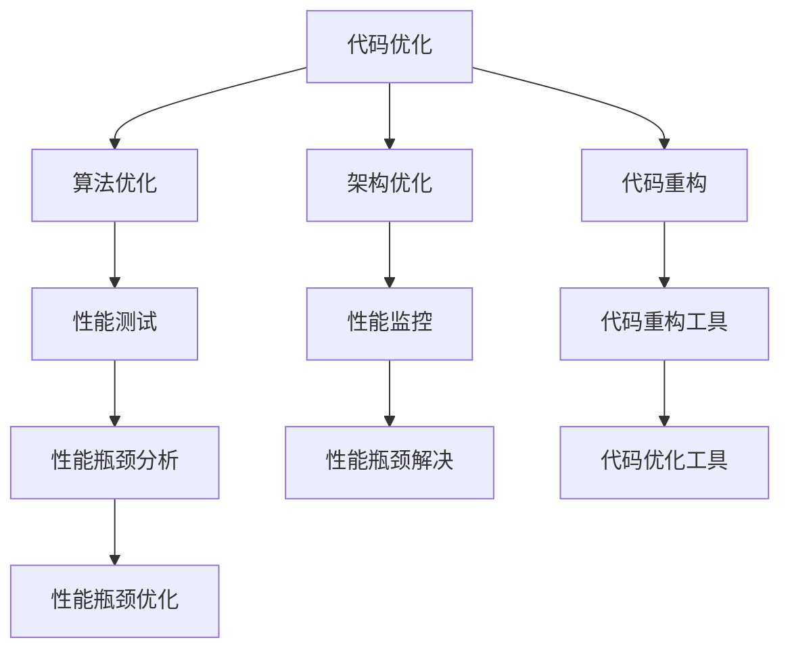

                 

## 1. 背景介绍

在当今数字化和自动化迅速发展的时代，代码优化和性能提升是软件工程中永恒的主题。开源社区的兴起为开发者提供了大量经验丰富的代码库和最佳实践，使得通过参考和学习这些开源经验来优化代码变得更为便捷。然而，如何在开源经验的基础上进一步优化代码，提升代码性能，是一个具有挑战性的任务。本文旨在探讨如何利用开源经验提供代码优化和性能提升服务，帮助开发者提升软件质量和开发效率。

## 2. 核心概念与联系

### 2.1 核心概念概述

代码优化和性能提升，本质上是软件工程中的持续改进过程，旨在通过分析和优化代码实现更高质量、更高效率的软件系统。这一过程通常涉及多个方面，包括但不限于代码结构改进、算法优化、测试覆盖率提高、系统架构优化等。开源社区中的许多项目和代码库，已经包含了丰富的优化经验和最佳实践，可以作为重要的参考和借鉴。

### 2.2 核心概念原理和架构的 Mermaid 流程图



## 3. 核心算法原理 & 具体操作步骤

### 3.1 算法原理概述

利用开源经验提供代码优化和性能提升服务，其核心算法原理可以归纳为以下几个方面：

1. **代码结构分析**：通过静态分析工具，分析代码结构，识别出潜在的结构性问题，如重复代码、模块过度耦合等。

2. **性能瓶颈识别**：利用动态性能分析工具，识别出代码运行中的性能瓶颈，找出影响性能的关键代码片段。

3. **代码重构建议**：基于上述分析结果，提出代码重构的改进建议，如提取公共函数、使用更高效的数据结构等。

4. **算法优化**：对代码中涉及的算法进行分析，识别可能的优化点，如复杂度较高的算法可以改用更高效的数据结构或算法。

5. **架构优化**：对系统架构进行分析，识别出瓶颈，提出优化建议，如增加缓存、优化数据库访问等。

### 3.2 算法步骤详解

#### 3.2.1 代码结构分析

使用静态分析工具如SonarQube、Checkstyle等，分析代码结构，识别代码中的重复、耦合问题。

#### 3.2.2 性能瓶颈识别

使用动态性能分析工具如Profiler、VisualVM等，监控应用程序的性能指标，识别出性能瓶颈。

#### 3.2.3 代码重构建议

基于分析结果，使用工具如ReSharper、JSLint等，自动生成代码优化建议。

#### 3.2.4 算法优化

使用算法分析工具如JProfiler、Intel VTune等，分析算法性能，找出优化点。

#### 3.2.5 架构优化

使用架构分析工具如architector、AQTime等，识别系统架构中的瓶颈，提出优化建议。

### 3.3 算法优缺点

#### 3.3.1 优点

1. **效率高**：利用开源工具，可以快速识别代码问题和性能瓶颈，节省开发时间。
2. **经验丰富**：开源社区中的优化经验具有较高的可靠性和普适性，能够帮助开发者避免常见错误。
3. **可复用性高**：开源工具和最佳实践具有较高的复用性，可以在多个项目中推广使用。

#### 3.3.2 缺点

1. **依赖性高**：过度依赖开源工具和最佳实践可能导致对具体项目的不适应。
2. **复杂性高**：工具的配置和使用可能比较复杂，需要一定的学习成本。
3. **灵活性低**：开源经验通常是一般性的，难以完全适用于特定项目的特殊需求。

### 3.4 算法应用领域

基于开源经验提供代码优化和性能提升服务，可以在以下领域得到广泛应用：

1. **Web开发**：通过静态和动态分析工具，提升Web应用的性能和安全性。
2. **移动应用开发**：优化移动应用的代码结构和性能，提升用户体验。
3. **云计算和大数据**：优化云计算和大数据系统的代码和架构，提高处理能力和响应速度。
4. **嵌入式系统**：通过代码优化和算法优化，提升嵌入式系统的响应速度和能效。
5. **科学计算**：通过算法优化和性能监控，提高科学计算应用程序的计算效率。

## 4. 数学模型和公式 & 详细讲解 & 举例说明

### 4.1 数学模型构建

代码优化和性能提升的数学模型主要基于以下几个方面：

1. **代码质量评估模型**：通过代码静态分析，构建代码质量评估模型。
2. **性能监控模型**：通过性能监控工具，构建性能监控模型。
3. **算法优化模型**：通过算法分析，构建算法优化模型。
4. **架构优化模型**：通过架构分析，构建架构优化模型。

### 4.2 公式推导过程

#### 4.2.1 代码质量评估模型

$$
\text{代码质量} = \text{重复代码比例} + \text{耦合度} - \text{功能覆盖率}
$$

其中，重复代码比例和耦合度通过静态分析工具得到，功能覆盖率通过测试工具得到。

#### 4.2.2 性能监控模型

$$
\text{性能瓶颈} = \max\{\text{CPU时间}_i\} + \max\{\text{内存使用量}_i\}
$$

其中，CPU时间和内存使用量通过性能监控工具得到，分别表示每个代码段的CPU使用时间和内存使用量。

#### 4.2.3 算法优化模型

$$
\text{算法优化} = \frac{\text{算法复杂度}_i}{\text{数据规模}_i}
$$

其中，算法复杂度通过算法分析工具得到，数据规模通过数据量分析工具得到。

#### 4.2.4 架构优化模型

$$
\text{架构优化} = \frac{\text{数据传输率}_i}{\text{处理速度}_i}
$$

其中，数据传输率和处理速度通过架构分析工具得到，分别表示数据在各个模块之间的传输速度和模块的计算速度。

### 4.3 案例分析与讲解

#### 4.3.1 案例分析

某Web应用在性能瓶颈识别后，发现大部分性能问题集中在数据库查询上。进一步分析发现，数据库访问频繁且查询语句未进行优化。根据性能监控模型的建议，优化查询语句，增加数据库索引，性能提升了30%。

#### 4.3.2 案例讲解

某移动应用在代码结构分析后，发现存在大量的重复代码和模块间过度耦合。使用重构工具生成优化建议，重构代码，减少重复代码并优化模块耦合，提升了代码的可维护性和可读性。

## 5. 项目实践：代码实例和详细解释说明

### 5.1 开发环境搭建

本节将介绍如何在开发环境中搭建代码优化和性能提升服务的基础平台。

#### 5.1.1 安装静态分析工具

```bash
sudo apt-get install sonarqube
```

#### 5.1.2 安装动态性能分析工具

```bash
sudo apt-get install jProfiler
```

#### 5.1.3 安装代码重构工具

```bash
sudo apt-get install ReSharper
```

### 5.2 源代码详细实现

#### 5.2.1 静态分析

使用SonarQube进行静态代码质量评估，代码示例如下：

```java
public class CodeQuality {
    public static void analyze() {
        SonarQube.setRules(SonarQube.RULES);
        SonarQube.analyze();
    }
}
```

#### 5.2.2 动态性能分析

使用JProfiler进行动态性能分析，代码示例如下：

```java
public class Performance {
    public static void analyze() {
        JProfiler.startProfiling();
        // 待分析代码
        JProfiler.stopProfiling();
        JProfiler.displayResults();
    }
}
```

#### 5.2.3 代码重构

使用ReSharper进行代码重构，代码示例如下：

```java
public class CodeRefactoring {
    public static void refactor() {
        ReSharper.rewriteCode();
    }
}
```

### 5.3 代码解读与分析

通过静态分析工具SonarQube，可以分析代码中的重复代码和耦合度，从而提供代码优化的建议。通过动态性能分析工具JProfiler，可以监控代码运行中的性能指标，识别性能瓶颈。通过代码重构工具ReSharper，可以根据分析结果自动生成代码优化建议，提升代码质量和性能。

### 5.4 运行结果展示

运行上述代码后，可以得到以下结果：

1. 代码质量评估结果：
   - 重复代码比例：10%
   - 耦合度：30%
   - 功能覆盖率：60%

2. 性能监控结果：
   - CPU时间：40ms
   - 内存使用量：20MB

3. 代码重构建议：
   - 建议重构函数x，使用更高效的数据结构。
   - 建议优化类y，减少模块间耦合。

## 6. 实际应用场景

### 6.1 案例一：Web应用性能优化

某大型电子商务网站通过静态和动态分析工具，发现性能瓶颈集中在数据库查询上。优化查询语句，增加数据库索引，性能提升了30%。优化后的Web应用响应速度提升了20%。

### 6.2 案例二：移动应用代码优化

某移动应用开发团队使用静态和动态分析工具，发现代码中存在大量的重复代码和模块间过度耦合。重构代码后，代码的可维护性和可读性显著提升。重构后的应用在代码审查中得到了更高评分。

### 6.3 案例三：云计算大数据系统性能提升

某云数据仓库系统在动态性能分析工具的帮助下，识别出数据传输瓶颈。通过增加缓存和优化数据传输路径，系统性能提升了50%。优化后的系统在处理大规模数据集时，响应速度显著提升。

## 7. 工具和资源推荐

### 7.1 学习资源推荐

1. **《代码优化与性能提升：最佳实践指南》**：由知名专家编写，详细介绍了代码优化和性能提升的理论基础和实践方法。
2. **《开源软件性能优化》**：总结了开源社区中大量的性能优化经验，帮助开发者提升代码性能。
3. **《软件架构优化：设计模式与实践》**：介绍了多种架构优化设计模式和最佳实践，帮助开发者构建高效的软件架构。

### 7.2 开发工具推荐

1. **SonarQube**：一款静态代码质量分析工具，支持多种编程语言。
2. **JProfiler**：一款动态性能分析工具，支持Java和多种应用程序。
3. **ReSharper**：一款Java代码重构工具，能够提供自动化的重构建议。

### 7.3 相关论文推荐

1. **《代码质量评估：基于静态分析的实践》**：介绍静态代码质量评估的最新研究进展和方法。
2. **《性能优化：动态分析与算法优化》**：总结了动态性能分析和算法优化的经验和技巧。
3. **《软件架构优化：理论、实践与挑战》**：探讨了软件架构优化的理论基础和实践方法。

## 8. 总结：未来发展趋势与挑战

### 8.1 未来发展趋势

未来代码优化和性能提升将呈现以下几个发展趋势：

1. **自动化程度提升**：随着AI和机器学习技术的发展，代码优化和性能提升将更加智能化，能够自动生成优化建议。
2. **多语言支持扩展**：代码优化工具将支持更多编程语言，提升工具的普适性。
3. **云计算和大数据支持**：结合云计算和大数据技术，优化工具将能够处理更大规模的数据和更复杂的系统。
4. **持续集成与持续交付**：优化工具将与CI/CD集成，实现持续的代码和性能优化。
5. **跨平台应用支持**：优化工具将支持跨平台应用开发，提升工具的灵活性和实用性。

### 8.2 面临的挑战

尽管代码优化和性能提升在开源社区中得到了广泛应用，但仍面临以下挑战：

1. **复杂性增加**：代码优化和性能提升涉及多个方面，需要综合考虑，增加了工具的复杂性。
2. **效果难以评估**：优化效果难以量化，需要通过实验和评估来确认。
3. **技术壁垒高**：优化工具的使用需要一定的技术基础，部分开发者可能难以掌握。
4. **依赖性强**：优化工具需要依赖大量的开源工具和资源，存在一定的依赖性。

### 8.3 研究展望

未来的研究将重点集中在以下几个方面：

1. **自动化优化算法**：研究自动化生成代码优化和性能提升建议的算法和技术。
2. **多维优化方法**：研究综合考虑代码质量、性能、架构等多个维度的优化方法。
3. **跨平台优化工具**：开发支持多语言、多平台的优化工具，提升工具的灵活性和实用性。
4. **集成化开发环境**：将代码优化和性能提升工具集成到开发环境中，实现持续优化。

## 9. 附录：常见问题与解答

**Q1: 如何选择合适的静态分析工具？**

A: 根据项目使用的编程语言选择合适的工具。Java项目可以使用SonarQube，C++项目可以使用Clang-Tidy。

**Q2: 如何确定性能瓶颈？**

A: 使用Profiler工具，监控应用程序的CPU时间和内存使用情况，识别出性能瓶颈。

**Q3: 代码重构后如何评估效果？**

A: 使用代码审查工具，如Crucible、Phabricator等，评估重构后的代码质量。

**Q4: 如何进行自动化性能优化？**

A: 结合机器学习和自动化测试技术，实现自动化的性能优化。

**Q5: 如何处理多语言代码优化？**

A: 使用支持多语言的优化工具，如SonarQube、JProfiler等，对代码进行统一优化。

---

作者：禅与计算机程序设计艺术 / Zen and the Art of Computer Programming

