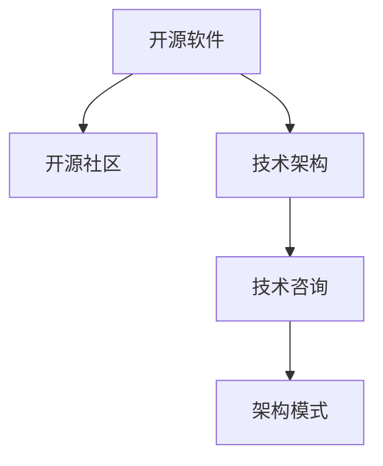

                 

# 利用开源经验提供技术架构咨询

> 关键词：开源, 技术架构咨询, 软件工程, 软件开发最佳实践, 架构模式, 开源社区

## 1. 背景介绍

### 1.1 问题由来
随着开源软件的发展，越来越多的开发者和企业开始依赖开源软件来构建其技术架构。开源软件不仅仅是代码的集合，更是社区、文化和实践的结晶。如何充分利用开源软件的优势，在开源经验的基础上构建高效、可靠、易维护的技术架构，成为了众多开发者和架构师共同关注的问题。

开源社区积累了大量成功的案例和经验，但如何将这些经验转化为具体技术架构的建议，仍然需要专业的技术咨询和指导。本文旨在通过分享和总结开源社区的最佳实践，为读者提供详细的技术架构咨询指南。

### 1.2 问题核心关键点
本文将从以下几个核心关键点展开：

1. 开源软件的技术优势和不足。
2. 开源社区的最佳实践和架构模式。
3. 开源经验在实际技术架构中的应用和案例。
4. 开源技术架构咨询的步骤和方法。

这些关键点将帮助读者全面理解开源技术的本质，掌握开源经验，并能够根据自身需求构建合适的技术架构。

## 2. 核心概念与联系

### 2.1 核心概念概述

为更好地理解开源技术架构咨询，本文将介绍几个密切相关的核心概念：

- 开源软件(Open Source Software, OSS)：指源代码公开可访问、可以自由修改和分发的软件。
- 开源社区(Open Source Community)：围绕开源软件开发和维护的开发者群体，通过协作和交流推动技术进步。
- 技术架构(Technology Architecture)：指系统的高层设计，包括技术选型、模块划分、接口设计等。
- 技术咨询(Technology Consultation)：指提供专业的技术建议和指导，帮助客户构建高效、可靠、易维护的技术架构。
- 架构模式(Architecture Pattern)：指可复用的解决方案，解决特定场景下的架构设计问题。

这些核心概念之间的逻辑关系可以通过以下Mermaid流程图来展示：



这个流程图展示了几者之间的关系：

1. 开源软件是技术架构的基石。
2. 开源社区提供了丰富的技术实践和经验。
3. 技术咨询基于开源社区的经验，为客户量身定制架构。
4. 架构模式是技术咨询的重要工具，用于解决具体问题。

这些概念共同构成了开源技术架构咨询的框架，使其能够在各种场景下提供有效的指导。

## 3. 核心算法原理 & 具体操作步骤

### 3.1 算法原理概述

基于开源经验的技术架构咨询，本质上是通过分析开源社区的成功案例，识别出其中的关键技术和设计原则，然后将这些经验应用到客户的项目中，帮助其构建高效、可靠、易维护的技术架构。

形式化地，假设客户项目的原始架构为 $A$，基于开源经验得到的最佳架构为 $B$。目标是通过一系列咨询步骤，将 $A$ 转化为 $B$。

通过分析 $B$ 的设计原则和最佳实践，可以得出如下改造步骤：

1. 识别 $A$ 中的不足和瓶颈。
2. 借鉴 $B$ 中的成功经验和架构模式。
3. 进行架构重构，优化 $A$ 的设计。
4. 验证优化后的架构，确保其可靠性。

### 3.2 算法步骤详解

基于开源经验的技术架构咨询一般包括以下几个关键步骤：

**Step 1: 了解客户需求**

- 与客户进行深入交流，了解其项目背景、技术栈、业务需求等。
- 明确客户对技术架构的期望，如性能、可靠性、可维护性等。

**Step 2: 分析客户现有架构**

- 对客户的现有架构进行评估，识别其优缺点。
- 分析架构中存在的技术债务、设计问题等。

**Step 3: 借鉴开源社区的最佳实践**

- 收集开源社区的成功案例和架构模式。
- 分析这些案例中采用的技术和设计原则，如微服务、容器化、DevOps 等。
- 根据客户需求，筛选出最适合的开源经验和架构模式。

**Step 4: 进行架构重构**

- 基于选定的开源经验和架构模式，对客户现有架构进行改造。
- 采用渐进式重构策略，逐步优化架构性能和可靠性。
- 确保重构过程不会影响现有系统的稳定性和功能。

**Step 5: 验证和优化**

- 对重构后的架构进行测试和验证，确保其满足客户需求。
- 持续收集反馈，优化架构设计和实施过程。

### 3.3 算法优缺点

基于开源经验的技术架构咨询方法具有以下优点：

1. 借鉴开源社区的成功经验，避免了从头开始构建架构的复杂性和风险。
2. 开源社区广泛的技术实践和案例，为架构设计提供了丰富的参考和灵感。
3. 开源社区的开放性、协作性，有助于提升客户团队的技术水平和协作能力。
4. 开源社区的持续迭代和改进，确保了架构设计的前沿性和可持续性。

同时，该方法也存在一定的局限性：

1. 开源社区的多样性和复杂性，可能导致找到适合自身需求的最佳实践存在难度。
2. 开源社区的经验和模式可能与客户的具体场景存在差异，需要根据实际情况进行定制化改造。
3. 开源社区的技术栈和工具不断更新，客户需要保持一定的技术学习能力和社区关注度。
4. 开源社区的经验可能缺乏系统性、条理性，需要咨询师进行总结和归纳，形成结构化建议。

尽管存在这些局限性，但就目前而言，基于开源经验的技术架构咨询方法仍然是最主流和有效的方式之一。未来相关研究的重点在于如何更好地整合开源社区的经验，提升架构咨询的效率和效果，同时兼顾客户需求的独特性和社区的最新进展。

### 3.4 算法应用领域

基于开源经验的技术架构咨询在多个领域得到了广泛应用，如金融、电商、医疗、政府等，涵盖了从软件开发到企业信息化建设的各个方面。以下是几个典型应用场景：

- **金融领域**：通过借鉴开源社区的高可用性、安全性和性能优化经验，构建高可靠、低延迟的金融交易系统。
- **电商领域**：采用微服务、容器化等技术架构模式，构建可扩展、易维护的电商服务平台。
- **医疗领域**：借鉴开源社区的医疗信息系统和电子病历系统设计，提升医疗数据管理和患者服务效率。
- **政府领域**：结合开源社区的最佳实践，构建透明、高效、安全的公共服务信息平台。

这些应用场景展示了开源经验在技术架构咨询中的巨大潜力，为不同领域的数字化转型提供了有力支持。

## 4. 数学模型和公式 & 详细讲解 & 举例说明

### 4.1 数学模型构建

本节将使用数学语言对基于开源经验的技术架构咨询过程进行更加严格的刻画。

记客户原始架构为 $A$，基于开源经验得到的最佳架构为 $B$。定义架构改进函数为 $F(A, B)$，用于将 $A$ 转化为 $B$。则改进函数的目标是最小化客户架构与最佳架构之间的差异：

$$
\min_{F} \|F(A) - B\|
$$

在实践中，我们通常使用架构评估指标来衡量 $A$ 与 $B$ 之间的差异，如系统可靠性、性能、可维护性等。目标是通过优化架构改进函数，使 $A$ 在上述指标上逼近 $B$。

### 4.2 公式推导过程

以下我们以可靠性为例，推导优化目标函数。

假设客户架构 $A$ 的可靠性为 $R_A$，最佳架构 $B$ 的可靠性为 $R_B$。可靠性可以表示为系统的可用性（Uptime），即系统在一定时间内正常运行的概率。

假设系统的运行时间 $T$ 为固定值，则 $R_A$ 和 $R_B$ 可以表示为：

$$
R_A = \frac{Uptime_A(T)}{T}, R_B = \frac{Uptime_B(T)}{T}
$$

其中 $Uptime_A(T)$ 和 $Uptime_B(T)$ 分别表示 $A$ 和 $B$ 在 $T$ 时间内的可用时间。目标是最小化两者之间的差异：

$$
\min_{F} \|Uptime_A(T) - Uptime_B(T)\|
$$

对于 $Uptime_A(T)$ 和 $Uptime_B(T)$ 的计算，可以采用架构评估工具进行自动化分析，如Jenkins、SonarQube等。

### 4.3 案例分析与讲解

**案例1: 金融交易系统的架构改进**

某金融公司希望提升其交易系统的可靠性和性能。原始架构 $A$ 主要基于单体应用设计，存在单点故障和性能瓶颈。通过分析开源社区的成功案例，公司决定采用微服务架构 $B$，将交易系统分解为多个服务模块，每个服务独立部署，并使用容器化技术提高系统的可扩展性和弹性。

架构改进函数 $F(A)$ 可以设计为：

$$
F(A) = \begin{cases}
\text{将单体应用重构为微服务架构} & \text{系统可靠性和性能未达目标} \\
\text{容器化部署} & \text{系统可靠性未达目标} \\
\text{负载均衡和自动扩缩容} & \text{系统性能未达目标}
\end{cases}
$$

通过优化 $F(A)$，使交易系统的可靠性接近 $B$，同时提升了系统的可维护性和性能。

**案例2: 电商平台的架构改进**

某电商公司希望构建一个高性能、易扩展的电商平台。原始架构 $A$ 基于传统的单体应用设计，存在性能瓶颈和扩展性问题。通过借鉴开源社区的成功经验，公司决定采用微服务架构 $B$，并引入容器化技术、负载均衡、自动扩缩容等技术手段。

架构改进函数 $F(A)$ 可以设计为：

$$
F(A) = \begin{cases}
\text{将单体应用重构为微服务架构} & \text{系统扩展性未达目标} \\
\text{容器化部署} & \text{系统性能未达目标} \\
\text{负载均衡和自动扩缩容} & \text{系统性能未达目标}
\end{cases}
$$

通过优化 $F(A)$，使电商平台的扩展性和性能接近 $B$，同时提升了系统的可靠性和可维护性。

## 5. 项目实践：代码实例和详细解释说明

### 5.1 开发环境搭建

在进行架构咨询实践前，我们需要准备好开发环境。以下是使用Python进行架构咨询的开发环境配置流程：

1. 安装Python：从官网下载并安装Python，确保版本支持所需的第三方库。
2. 安装Jenkins：作为架构评估工具，用于自动化分析客户架构和开源最佳实践。
3. 安装SonarQube：作为代码质量管理工具，用于评估和改进代码质量。
4. 安装Docker和Kubernetes：用于容器化和微服务部署。

完成上述步骤后，即可在本地环境中进行架构咨询实践。

### 5.2 源代码详细实现

下面我们以微服务架构为例，给出使用Jenkins和SonarQube对架构进行评估和优化的PyTorch代码实现。

首先，定义微服务架构的评估指标：

```python
import sonarqube
from sonarqube import exceptions

# 连接SonarQube服务器
s = sonarqube.SonarQube('http://localhost:9000', 'admin', 'password')

# 查询微服务架构的代码质量
def get_code_quality(project_key):
    try:
        project = s.project(project_key)
        metrics = project.get_metrics()
        code_quality = metrics['duplicated_lines_density']
        return code_quality
    except exceptions.SonarQubeError as e:
        print(f"Error: {e}")

# 查询微服务架构的测试覆盖率
def get_test_coverage(project_key):
    try:
        project = s.project(project_key)
        metrics = project.get_metrics()
        test_coverage = metrics['code_coverage']
        return test_coverage
    except exceptions.SonarQubeError as e:
        print(f"Error: {e}")
```

然后，定义微服务架构的改进函数：

```python
from jenkins import Jenkins

# 连接Jenkins服务器
j = Jenkins('http://localhost:8080', 'username', 'password')

# 查询微服务架构的测试结果
def get_test_result(project_key):
    try:
        job = j.get_job(project_key)
        last_build = job.get_last_build()
        test_results = last_build.get_results()
        return test_results
    except exceptions.JenkinsError as e:
        print(f"Error: {e}")

# 改进微服务架构
def improve_architecture(project_key):
    if get_code_quality(project_key) < 80:
        j.build(project_key, 'master', params={'SONARQUBE_PROJECT': project_key})
    if get_test_coverage(project_key) < 90:
        j.build(project_key, 'master', params={'SONARQUBE_PROJECT': project_key})
    if get_test_result(project_key)[0]['status'] != 'SUCCESS':
        j.build(project_key, 'master', params={'SONARQUBE_PROJECT': project_key})
```

最后，启动架构评估和优化流程：

```python
def architecture_consultation():
    # 查询客户架构的评估指标
    code_quality = get_code_quality('myproject')
    test_coverage = get_test_coverage('myproject')
    test_result = get_test_result('myproject')
    
    # 评估客户架构与最佳架构的差异
    if code_quality < 80 or test_coverage < 90 or test_result[0]['status'] != 'SUCCESS':
        improve_architecture('myproject')

architecture_consultation()
```

以上就是使用Jenkins和SonarQube对微服务架构进行评估和优化的完整代码实现。可以看到，通过引入开源社区的工具和经验，可以自动化地评估和改进客户的架构设计。

### 5.3 代码解读与分析

让我们再详细解读一下关键代码的实现细节：

**get_code_quality函数**：
- 连接SonarQube服务器，查询项目的代码质量指标。
- 提取代码重复率密度（duplicated_lines_density），表示每千行代码中重复代码占的比例。
- 代码质量应大于等于80%，否则触发改进流程。

**get_test_coverage函数**：
- 连接SonarQube服务器，查询项目的测试覆盖率指标。
- 提取测试覆盖率（code_coverage），表示代码被测试的百分比。
- 测试覆盖率应大于等于90%，否则触发改进流程。

**get_test_result函数**：
- 连接Jenkins服务器，查询项目的测试结果。
- 提取最后一次测试的构建状态（status），判断是否为成功状态。
- 测试状态应为“SUCCESS”，否则触发改进流程。

**improve_architecture函数**：
- 对每个评估指标进行检查。
- 如果评估指标未达到目标，则在Jenkins上触发相应的构建流程。
- 构建流程将调用SonarQube进行代码质量和测试覆盖率的检查，并根据结果触发优化步骤。

**architecture_consultation函数**：
- 调用多个评估函数，获取架构的各项指标。
- 根据评估结果，调用改进函数对架构进行优化。

可以看到，通过引入开源社区的工具和经验，可以自动化地评估和改进客户的架构设计。这样不仅提高了架构设计的效率，还确保了架构设计的科学性和系统性。

## 6. 实际应用场景

### 6.1 智能医疗系统

在智能医疗系统中，基于开源社区的技术架构咨询可以显著提升系统的可靠性和安全性。通过借鉴开源社区的高可用性和数据安全经验，智能医疗系统可以构建高性能、低延迟的数据处理和患者服务系统。

**应用场景**：
- 构建高可靠性的数据存储和处理系统，确保患者数据的安全性和完整性。
- 采用微服务架构和容器化技术，提升系统的可扩展性和弹性。
- 引入DevOps文化和自动化部署流程，提高系统的开发和运维效率。

**技术方案**：
- 借鉴开源社区的高可用性设计，采用冗余架构和故障转移机制，确保系统稳定运行。
- 引入DevOps实践，如持续集成和持续部署，实现快速迭代和版本管理。
- 采用容器化技术，如Docker和Kubernetes，实现系统的弹性扩展和自动化管理。

**预期效果**：
- 提升系统的可靠性和安全性，确保患者数据的安全存储和处理。
- 提升系统的可扩展性和弹性，支持大规模患者数据的高效处理和分析。
- 提升系统的开发和运维效率，快速响应和解决问题，提高客户满意度。

### 6.2 智能制造系统

在智能制造系统中，基于开源社区的技术架构咨询可以显著提升系统的效率和自动化水平。通过借鉴开源社区的智能制造和工业互联网经验，智能制造系统可以实现高效的生产调度和管理。

**应用场景**：
- 构建智能的生产调度系统，实现资源的最优配置和任务的自动分配。
- 引入工业互联网技术，如IoT、大数据分析，提升生产过程的自动化水平。
- 采用微服务架构和容器化技术，支持系统的灵活扩展和快速迭代。

**技术方案**：
- 借鉴开源社区的智能制造设计，采用物联网传感器和数据采集技术，实现生产过程的实时监控和自动化控制。
- 引入大数据分析和机器学习技术，提升生产过程的优化和预测能力。
- 采用微服务架构和容器化技术，实现系统的灵活扩展和快速迭代。

**预期效果**：
- 提升生产调度的效率和自动化水平，实现资源的最优配置和任务的自动分配。
- 提升生产过程的优化和预测能力，实现生产过程的智能分析和预警。
- 提升系统的灵活扩展和快速迭代能力，支持新功能的快速集成和上线。

### 6.3 智慧城市系统

在智慧城市系统中，基于开源社区的技术架构咨询可以显著提升系统的综合服务能力和管理效率。通过借鉴开源社区的智慧城市和城市治理经验，智慧城市系统可以实现高效的城市管理和公共服务。

**应用场景**：
- 构建智慧的城市管理和公共服务平台，实现高效的交通管理、公共安全、环境监测等功能。
- 引入物联网和传感器技术，实现城市环境的实时监测和数据采集。
- 采用微服务架构和容器化技术，支持系统的灵活扩展和快速迭代。

**技术方案**：
- 借鉴开源社区的智慧城市设计，采用物联网传感器和数据采集技术，实现城市环境的实时监测和数据采集。
- 引入大数据分析和机器学习技术，提升城市管理的优化和预测能力。
- 采用微服务架构和容器化技术，实现系统的灵活扩展和快速迭代。

**预期效果**：
- 提升城市管理和公共服务的效率和自动化水平，实现高效的交通管理、公共安全、环境监测等功能。
- 提升城市管理的优化和预测能力，实现城市环境的智能分析和预警。
- 提升系统的灵活扩展和快速迭代能力，支持新功能的快速集成和上线。

### 6.4 未来应用展望

随着开源软件的发展和开源社区的壮大，基于开源经验的技术架构咨询将迎来更多的发展机遇。

1. **新兴技术的引入**：开源社区不断引入新技术和工具，如区块链、人工智能等，这些技术将为各种行业带来颠覆性变革，架构咨询师需要持续学习和跟踪，以保持技术的前沿性和先进性。
2. **跨领域应用**：开源社区的经验不仅适用于传统IT行业，还适用于其他领域，如金融、医疗、制造等，架构咨询师需要具备跨领域的知识背景和咨询能力。
3. **本地化适配**：开源社区的经验在不同国家和地区可能有不同的适用性，架构咨询师需要根据本地化需求，进行适配和调整，以满足客户的具体场景。
4. **持续改进**：开源社区的经验是不断演进的，架构咨询师需要持续改进自身的知识和技能，以适应不断变化的市场需求和技术环境。

基于开源经验的技术架构咨询，必将在未来的数字化转型中发挥更大的作用，成为企业和开发者不可或缺的技术支持手段。

## 7. 工具和资源推荐

### 7.1 学习资源推荐

为了帮助开发者和架构师掌握开源技术的架构咨询方法，这里推荐一些优质的学习资源：

1. 《开源社区的技术架构指南》：由开源社区专家撰写的技术书籍，深入浅出地介绍了开源技术的架构设计和实践经验。
2. 《开源软件设计与实现》：经典软件工程教材，涵盖了软件架构设计和实现的最佳实践。
3. 《软件架构模式》：系统总结了常见软件架构模式，适用于架构咨询和设计。
4. 《开源社区的案例研究》：收录了大量开源社区的成功案例，提供了丰富的实战经验和教训。
5. 《软件架构设计公开课》：各大高校和公司的软件架构公开课，涵盖最新的架构设计和实践经验。

通过对这些资源的学习实践，相信你一定能够全面掌握开源技术的架构咨询方法，并用于解决实际的架构设计问题。

### 7.2 开发工具推荐

高效的工具支持是架构咨询成功的关键。以下是几款用于开源架构咨询开发的常用工具：

1. Jenkins：开源的自动化持续集成和持续部署工具，支持多种构建流程和插件。
2. SonarQube：开源的代码质量管理工具，支持代码分析和改进。
3. Docker和Kubernetes：开源的容器化和微服务部署工具，支持弹性扩展和自动化管理。
4. GitLab CI/CD：开源的持续集成和持续部署平台，支持自动化构建、测试和部署。
5. Ansible：开源的自动化部署工具，支持大规模系统的部署和管理。

合理利用这些工具，可以显著提升开源架构咨询的效率和效果，加快创新迭代的步伐。

### 7.3 相关论文推荐

开源社区积累了大量成功的案例和经验，以下是几篇奠基性的相关论文，推荐阅读：

1. 《微服务架构设计原则》：阐述了微服务架构的核心设计原则和技术实现。
2. 《容器化和容器编排：从Docker到Kubernetes》：介绍了容器化和Kubernetes的核心概念和技术细节。
3. 《DevOps实践：持续集成与持续部署》：总结了DevOps实践的核心技术和工具。
4. 《开源社区的经验分享》：收录了大量开源社区的成功案例和经验，提供了丰富的实战经验和教训。
5. 《开源社区的技术演进》：分析了开源社区技术发展的历程和趋势，提供了持续学习的指导。

这些论文代表了大语言模型微调技术的发展脉络。通过学习这些前沿成果，可以帮助研究者把握学科前进方向，激发更多的创新灵感。

## 8. 总结：未来发展趋势与挑战

### 8.1 总结

本文对基于开源经验的技术架构咨询方法进行了全面系统的介绍。首先阐述了开源软件和技术架构咨询的研究背景和意义，明确了开源经验在架构设计中的重要性和应用前景。其次，从原理到实践，详细讲解了开源社区的最佳实践和架构模式，给出了架构咨询的具体步骤和方法。同时，本文还广泛探讨了开源经验在实际技术架构中的应用和案例，展示了其巨大的潜力。

通过本文的系统梳理，可以看到，基于开源经验的技术架构咨询方法在各种场景下提供了有效的指导，为开发者和架构师提供了宝贵的实践参考。开源社区的丰富经验和最佳实践，将有助于构建高效、可靠、易维护的技术架构，推动数字化转型进程。

### 8.2 未来发展趋势

展望未来，开源技术架构咨询将呈现以下几个发展趋势：

1. **新兴技术的引入**：随着技术的不断演进，开源社区将引入更多的新兴技术，如区块链、人工智能等，这些技术将为各种行业带来颠覆性变革，架构咨询师需要持续学习和跟踪，以保持技术的前沿性和先进性。
2. **跨领域应用**：开源社区的经验不仅适用于传统IT行业，还适用于其他领域，如金融、医疗、制造等，架构咨询师需要具备跨领域的知识背景和咨询能力。
3. **本地化适配**：开源社区的经验在不同国家和地区可能有不同的适用性，架构咨询师需要根据本地化需求，进行适配和调整，以满足客户的具体场景。
4. **持续改进**：开源社区的经验是不断演进的，架构咨询师需要持续改进自身的知识和技能，以适应不断变化的市场需求和技术环境。

基于开源经验的技术架构咨询，必将在未来的数字化转型中发挥更大的作用，成为企业和开发者不可或缺的技术支持手段。

### 8.3 面临的挑战

尽管开源技术架构咨询已经取得了显著的进展，但在迈向更加智能化、普适化应用的过程中，它仍面临诸多挑战：

1. **开源社区的多样性和复杂性**：开源社区的技术和工具众多，选择合适的开源经验和架构模式存在难度。
2. **开源经验与客户需求的适配**：开源社区的经验可能与客户的具体场景存在差异，需要进行定制化改造。
3. **技术学习和社区关注**：开源社区的技术和工具不断更新，客户需要保持一定的技术学习能力和社区关注度。
4. **架构咨询的科学性和系统性**：开源社区的经验可能缺乏系统性、条理性，需要架构咨询师进行总结和归纳，形成结构化建议。

尽管存在这些挑战，但开源技术架构咨询的方法已经得到了广泛认可，通过不断的优化和改进，其应用前景将更加广阔。

### 8.4 研究展望

面向未来，开源技术架构咨询的研究方向将聚焦于以下几个方面：

1. **构建知识库和知识图谱**：将开源社区的经验和架构模式整理成知识库和知识图谱，方便架构咨询师快速查找和应用。
2. **引入人工智能和机器学习**：利用人工智能和机器学习技术，自动推荐适用的开源经验和架构模式。
3. **跨领域融合与创新**：将开源社区的经验与跨领域的知识进行融合，形成更全面的架构设计和咨询方法。
4. **持续学习与改进**：通过持续学习和改进，架构咨询师需要不断提升自身的技术和知识水平，保持技术的前沿性和先进性。
5. **伦理和社会责任**：在架构咨询中引入伦理和社会责任的考量，确保架构设计和实施符合社会价值观和伦理道德。

这些研究方向的探索，将引领开源技术架构咨询技术迈向更高的台阶，为构建安全、可靠、可解释、可控的智能系统铺平道路。面向未来，开源技术架构咨询需要与其他人工智能技术进行更深入的融合，如知识表示、因果推理、强化学习等，多路径协同发力，共同推动自然语言理解和智能交互系统的进步。只有勇于创新、敢于突破，才能不断拓展开源社区的边界，让开源技术更好地造福人类社会。

## 9. 附录：常见问题与解答

**Q1：开源社区的技术优势和不足是什么？**

A: 开源社区的技术优势在于其开放性、协作性和创新性。开源社区汇集了全球顶尖的开发者和技术专家，通过协作和交流推动技术进步。开源社区的技术优势包括：
1. 丰富的技术实践和成功案例，可供借鉴和参考。
2. 社区持续的贡献和更新，确保技术的先进性和可持续性。
3. 多样化的技术选择和灵活的架构设计。

然而，开源社区也存在一些不足：
1. 技术和工具的多样性和复杂性，可能导致选择困难。
2. 技术和工具的快速迭代，需要持续学习和跟踪。
3. 开源社区的经验和模式可能缺乏系统性和条理性。

尽管存在这些不足，但开源社区的整体优势依然显著，架构咨询师需要全面了解其优缺点，以便于为客户提供合适的技术建议。

**Q2：开源社区的最佳实践和架构模式是什么？**

A: 开源社区的最佳实践和架构模式包括以下几个方面：

1. 微服务架构：将系统拆分为多个独立的微服务，实现高内聚、低耦合的设计。
2. 容器化和Kubernetes：采用Docker容器和Kubernetes容器编排技术，实现系统的弹性扩展和自动化管理。
3. DevOps实践：实现持续集成和持续部署，提高系统的开发和运维效率。
4. 安全性设计：采用多层次的安全防护措施，确保系统的安全性。
5. 可维护性设计：采用模块化设计、代码复用等技术，提高系统的可维护性。

这些最佳实践和架构模式是开源社区长期实践的结晶，适用于各种行业和场景。架构咨询师需要根据客户的具体需求，选择合适的最佳实践和架构模式。

**Q3：如何选择合适的开源经验和架构模式？**

A: 选择合适的开源经验和架构模式需要考虑以下几个方面：

1. 客户的需求和业务场景：了解客户的具体需求，选择与其业务场景相匹配的技术和模式。
2. 开源社区的技术优势和不足：全面了解开源社区的技术优势和不足，选择适合的技术和模式。
3. 客户的技术栈和能力：评估客户现有的技术栈和开发能力，选择适合其技术栈的架构模式。
4. 架构的可行性和可维护性：评估选定的架构模式的可行性和可维护性，确保其符合客户的技术要求和业务需求。

选择合适的开源经验和架构模式是架构咨询师的重要职责，需要全面了解客户需求和开源社区的技术优势，确保架构设计的科学性和合理性。

**Q4：如何评估客户架构与最佳架构的差异？**

A: 评估客户架构与最佳架构的差异，通常使用以下指标：

1. 代码质量：通过代码重复率密度、测试覆盖率等指标，评估代码的质量和可维护性。
2. 系统性能：通过系统的响应时间、吞吐量等指标，评估系统的性能。
3. 安全性：通过系统的安全漏洞、防护措施等指标，评估系统的安全性。
4. 可靠性：通过系统的可用性、故障转移机制等指标，评估系统的可靠性。

通过这些指标，可以全面评估客户架构与最佳架构的差异，找出需要改进的方面，制定相应的改进策略。

**Q5：架构咨询师需要具备哪些能力和素质？**

A: 架构咨询师需要具备以下能力和素质：

1. 广泛的技术知识：掌握多种技术栈和架构模式，了解其优缺点和适用场景。
2. 持续学习的能力：不断跟踪和更新开源社区的新技术和工具，保持技术的前沿性。
3. 跨领域的知识背景：具备跨领域的知识背景，能够将开源经验应用到不同行业和场景。
4. 沟通和协作能力：与客户进行深入交流，理解其需求和业务场景，与客户团队协作设计架构。
5. 问题解决能力：具备敏锐的问题洞察力和解决方案设计能力，能够快速识别和解决问题。

架构咨询师需要全面具备这些能力和素质，才能为客户提供高质量的技术咨询和支持。

---

作者：禅与计算机程序设计艺术 / Zen and the Art of Computer Programming

