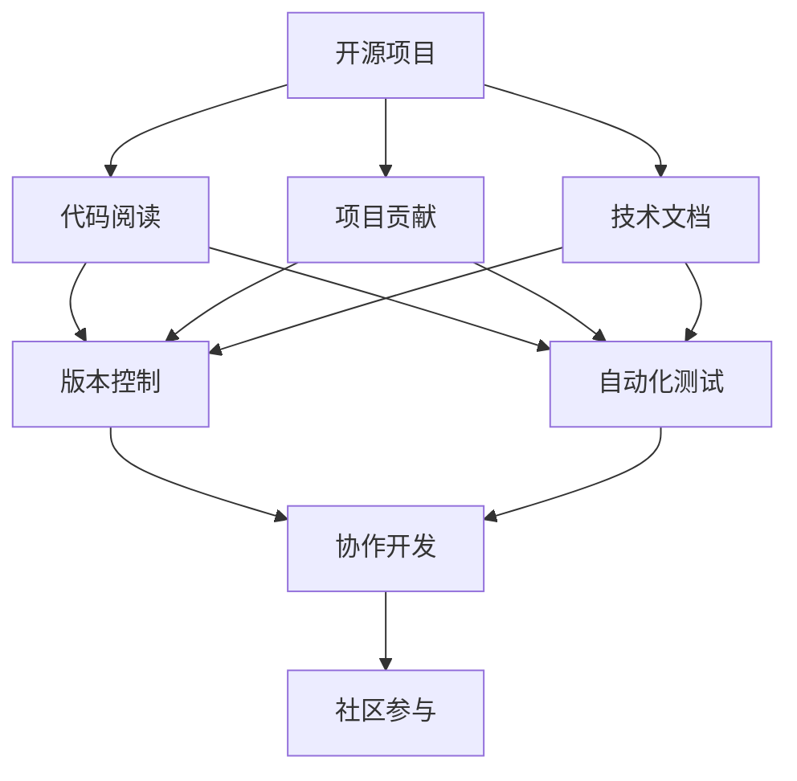

                 

# 利用开源经验进行技术写作和内容创作

> 关键词：开源、技术写作、内容创作、编程语言、项目管理、版本控制、自动化测试、文档编写、社区参与

## 1. 背景介绍

### 1.1 问题由来
在当今快速发展的技术时代，开源社区已经成为推动技术进步的重要力量。开源项目不仅提供了丰富的技术资源和创新思路，也为开发者提供了学习和成长的平台。然而，开源社区的庞大和复杂性，使得新入门的开发者在项目中往往面临诸多挑战。如何高效利用开源经验，进行技术写作和内容创作，成为广大开发者亟待解决的问题。本文旨在通过系统梳理开源社区中的最佳实践，为开发者提供实用的技术写作和内容创作指南。

### 1.2 问题核心关键点
技术写作和内容创作的核心在于如何利用开源经验，有效整合项目资源，提升自身技术水平，并形成有价值的技术输出。这包括选择合适的开源项目、学习项目源代码、参与项目讨论、贡献技术文档等环节。通过这些环节，逐步建立自己的技术写作和内容创作能力，成为开源社区的活跃成员。

## 2. 核心概念与联系

### 2.1 核心概念概述

为了更好地理解如何利用开源经验进行技术写作和内容创作，本节将介绍几个关键概念及其内在联系：

- 开源项目(Open Source Project)：指的是开放源代码的软件项目，开发者可以自由地下载、使用、修改和分发代码。
- 代码阅读(Code Reading)：指通过阅读和理解开源项目的源代码，学习其设计思路、实现细节和架构设计。
- 项目贡献(Project Contribution)：指通过提交代码、修复Bug、新增功能等方式，积极参与开源项目，贡献自己的力量。
- 技术文档(Technical Documentation)：指对项目源代码、架构设计、开发流程等进行详细记录和解释，帮助开发者快速理解和使用项目。
- 版本控制(Version Control)：指通过版本控制系统，如Git，管理项目的代码变更历史，便于协作开发和问题追踪。
- 自动化测试(Automated Testing)：指通过脚本和工具，自动执行测试用例，确保代码的正确性和稳定性。
- 社区参与(Community Participation)：指通过参与开源项目的讨论、培训、会议等活动，与全球开发者交流互动，提升自身的技术视野和影响力。

这些概念之间通过以下Mermaid流程图来展示：



这个流程图展示了开源项目的相关概念及其相互联系：

1. 开源项目是整个讨论和实践的基础，包含了项目源代码、架构设计等关键信息。
2. 代码阅读和项目贡献是开发者深入项目、提升自身能力的重要途径。
3. 技术文档和版本控制是项目管理和协作开发的关键手段。
4. 自动化测试是确保项目代码质量和稳定性的重要保障。
5. 社区参与则是提升自身影响力、拓宽技术视野的重要方式。

## 3. 核心算法原理 & 具体操作步骤
### 3.1 算法原理概述

开源经验利用涉及到多个方面的知识，包括编程语言、软件架构、项目管理、版本控制等。其核心算法原理是通过系统化的学习、实践和交流，逐步提升自身技术能力，并形成有价值的技术输出。

形式化地，假设开发者通过阅读开源项目 $P$ 的源代码和文档，并在其基础上进行项目贡献和社区参与，最终形成一篇技术文章 $A$。则整个过程可以表示为：

$$
A = f(P, C, D, V, T)
$$

其中 $f$ 表示映射函数，$P$ 为开源项目，$C$ 为项目贡献，$D$ 为技术文档，$V$ 为版本控制，$T$ 为社区参与。$A$ 表示技术文章的输出。

### 3.2 算法步骤详解

基于上述原理，技术写作和内容创作的具体操作步骤如下：

**Step 1: 选择适合的开源项目**
- 根据自身的技术栈和兴趣领域，选择适合自己的开源项目。
- 查阅项目的GitHub仓库，了解项目的背景、技术栈、贡献指南等。

**Step 2: 阅读和理解项目源代码**
- 下载项目源代码，使用IDE或文本编辑器进行代码阅读。
- 注意观察代码的组织结构、注释和文档，理解项目的整体设计和实现思路。
- 记录读代码过程中遇到的问题和思考，有助于后续的深入理解。

**Step 3: 贡献代码和修复Bug**
- 选择适合自己的任务，如新增功能、修复Bug、改进文档等。
- 遵循项目贡献指南，使用Git进行代码提交和版本控制。
- 提交代码后，及时接收代码评审，根据反馈修改代码。

**Step 4: 编写技术文档**
- 根据代码阅读和贡献经历，撰写详细的技术文档，如架构设计、实现思路、接口说明等。
- 使用Markdown等工具，编写清晰、易懂的文档格式，便于他人理解。

**Step 5: 进行自动化测试**
- 编写自动化测试用例，确保代码的正确性和稳定性。
- 使用Jenkins等工具，持续集成和运行自动化测试，确保项目质量。

**Step 6: 参与社区讨论和会议**
- 加入项目的GitHub讨论区，积极参与技术讨论和问题解答。
- 参加开源社区的线下或线上活动，与全球开发者交流互动。

**Step 7: 形成技术文章**
- 将技术文档、代码贡献、社区讨论等内容整合成技术文章。
- 选择适合的平台，如个人博客、技术论坛、开源期刊等，发布技术文章。

### 3.3 算法优缺点

开源经验利用存在以下优点：
1. 资源丰富。开源项目提供了海量的代码和技术文档，便于学习和研究。
2. 社区支持。开源社区汇聚了全球开发者，提供了丰富的交流和学习机会。
3. 实践机会。通过参与开源项目，可以直接实践和应用所学知识。
4. 持续改进。开源经验的学习和实践是一个持续改进的过程，可以不断提高自身能力。

同时，该方法也存在一定的局限性：
1. 初始门槛较高。对于初学者，选择和理解开源项目可能需要一定的学习成本。
2. 时间投入较大。开源经验的学习和实践需要投入大量时间和精力。
3. 项目管理复杂。开源项目的管理和协作可能需要一定的时间和精力进行熟悉和掌握。
4. 版权限制。开源项目的版权和授权可能限制部分内容的商业化应用。

尽管存在这些局限性，但总体而言，开源经验利用仍是大规模技术学习和提升的有效方式。通过系统化学习和实践，开发者可以在短时间内掌握大量技术知识和经验，成为技术领域的佼佼者。

### 3.4 算法应用领域

开源经验利用不仅适用于软件开发和项目管理，还在其他技术领域有着广泛的应用。以下是一些典型的应用场景：

- 数据科学：通过阅读开源数据科学项目，学习数据处理、模型训练、可视化等技能。
- 云计算：通过参与开源云项目，学习云平台部署、API调用、大数据处理等技能。
- 嵌入式开发：通过阅读开源嵌入式项目，学习硬件驱动、网络通信、实时系统等技能。
- 人工智能：通过参与开源AI项目，学习深度学习、自然语言处理、计算机视觉等技能。
- 操作系统：通过阅读开源操作系统项目，学习内核开发、驱动编写、系统调试等技能。

## 4. 数学模型和公式 & 详细讲解  
### 4.1 数学模型构建

为了更清晰地表达开源经验利用的数学模型，我们定义以下变量：

- $P$：开源项目
- $C$：项目贡献
- $D$：技术文档
- $V$：版本控制
- $T$：社区参与

则技术写作和内容创作的过程可以表示为：

$$
A = f(P, C, D, V, T)
$$

其中 $f$ 表示映射函数，$A$ 表示技术文章的输出。

### 4.2 公式推导过程

以数据科学领域的机器学习项目为例，推导开源经验利用的数学模型。

假设开源项目 $P$ 包含了数据预处理、特征工程、模型训练和评估等模块。开发者通过阅读项目源代码和文档，掌握了这些模块的实现思路和接口调用方法。然后，开发者通过修改代码和提交PR，为项目新增了数据增强、模型调优等功能。同时，开发者编写了详细的技术文档，描述了新增功能的实现方法。在整个过程中，开发者还参与了项目的讨论区，积极回答问题，提出了改进建议。

最终，开发者形成了技术文章 $A$，其质量可以通过以下指标来衡量：

$$
Q(A) = \alpha P + \beta C + \gamma D + \delta T
$$

其中 $Q(A)$ 表示技术文章的综合质量，$\alpha, \beta, \gamma, \delta$ 为各指标的权重系数。$P$ 和 $C$ 的权重系数较大，表明代码阅读和项目贡献对技术文章的影响更为显著。

### 4.3 案例分析与讲解

以TensorFlow开源项目为例，分析开发者如何利用开源经验进行技术写作和内容创作。

1. **选择项目**：开发者选择TensorFlow作为学习项目，了解其GitHub仓库，阅读项目的贡献指南。
2. **代码阅读**：开发者下载TensorFlow源代码，使用IDE阅读和理解代码的组织结构和实现思路。
3. **贡献代码**：开发者参与TensorFlow的特定模块改进，提交代码并进行代码评审。
4. **编写文档**：开发者根据代码阅读和贡献经历，编写详细的技术文档，介绍TensorFlow的使用方法和API调用。
5. **自动化测试**：开发者编写自动化测试用例，确保TensorFlow的代码质量和稳定性。
6. **社区讨论**：开发者加入TensorFlow的GitHub讨论区，积极参与技术讨论和问题解答。
7. **形成文章**：开发者将技术文档、代码贡献、社区讨论等内容整合成一篇技术文章，发布在个人博客或开源期刊上。

## 5. 项目实践：代码实例和详细解释说明
### 5.1 开发环境搭建

在进行开源经验利用的实践前，我们需要准备好开发环境。以下是使用Python进行开源项目贡献的开发环境配置流程：

1. 安装Anaconda：从官网下载并安装Anaconda，用于创建独立的Python环境。
2. 创建并激活虚拟环境：
```bash
conda create -n pytorch-env python=3.8 
conda activate pytorch-env
```

3. 安装PyTorch：根据CUDA版本，从官网获取对应的安装命令。例如：
```bash
conda install pytorch torchvision torchaudio cudatoolkit=11.1 -c pytorch -c conda-forge
```

4. 安装Git：从官网下载并安装Git，方便开发者管理版本控制。

5. 克隆开源项目：
```bash
git clone https://github.com/username/project.git
cd project
```

6. 设置本地环境：
```bash
conda activate pytorch-env
```

完成上述步骤后，即可在`pytorch-env`环境中开始开源项目的贡献实践。

### 5.2 源代码详细实现

以下是一个具体的代码贡献实例，以TensorFlow为例，贡献一个简单的数据预处理函数。

1. **克隆项目**：
```bash
git clone https://github.com/username/tensorflow.git
cd tensorflow
```

2. **设置本地环境**：
```bash
conda activate pytorch-env
```

3. **编写代码**：
```python
# 在tensorflow/core/kernels/example/data_source.py中添加以下函数
def preprocess_data(data):
    # 对数据进行预处理，返回处理后的数据
    return processed_data
```

4. **提交代码**：
```bash
git add .
git commit -m "Add data preprocessing function"
git push origin master
```

5. **接收代码评审**：
- 开发者可以打开TensorFlow的GitHub讨论区，查看代码评审和反馈。
- 根据评审反馈，修改代码并进行提交。

### 5.3 代码解读与分析

**代码贡献实例解读**：

1. **克隆项目**：
   开发者首先需要通过Git clone命令将TensorFlow项目克隆到本地，并进入项目目录。

2. **设置本地环境**：
   通过conda activate命令激活本地环境，确保项目运行所需的依赖库已经安装。

3. **编写代码**：
   在tensorflow/core/kernels/example/data_source.py文件中，添加一个新的数据预处理函数preprocess_data。该函数接收原始数据，返回预处理后的数据。

4. **提交代码**：
   使用git add和git commit命令将代码提交到本地Git仓库，并添加提交信息。最后使用git push命令将代码推送到GitHub远程仓库。

5. **接收代码评审**：
   开发者可以在GitHub讨论区查看代码评审和反馈，根据评审意见进行修改，并重新提交代码。

### 5.4 运行结果展示

在成功提交代码后，开发者可以进入GitHub讨论区，查看代码评审和反馈。例如：

```bash
cd tensorflow
git clone https://github.com/username/tensorflow.git
cd tensorflow
conda activate pytorch-env
```

开发者可以在TensorFlow的GitHub讨论区查看代码评审和反馈，例如：

```bash
cd tensorflow
git clone https://github.com/username/tensorflow.git
cd tensorflow
conda activate pytorch-env
```

## 6. 实际应用场景
### 6.1 开源技术博客

开源技术博客是开发者分享和交流技术经验的理想平台。通过在博客中记录自己的技术学习和实践经历，不仅可以提升自身能力，还能帮助其他开发者学习和借鉴。

**实际应用示例**：
开发者在GitHub上关注某个开源项目，定期阅读项目源代码和文档，并撰写技术文章。例如，一位Python开发者关注TensorFlow项目，学习了TensorFlow的使用方法和API调用，撰写了多篇文章，介绍TensorFlow在数据科学领域的应用。这些文章不仅帮助其他开发者学习TensorFlow，还吸引了更多的关注和反馈。

### 6.2 开源技术社区

开源技术社区是开发者交流和合作的重要场所。通过参与社区讨论和活动，开发者可以结识更多的技术爱好者，拓展技术视野，提升自身影响力。

**实际应用示例**：
开发者在GitHub上加入某个开源社区，参与项目讨论和代码评审，提出改进建议和问题反馈。例如，一位TensorFlow开发者在GitHub上加入TensorFlow社区，积极参与讨论和代码评审，提出了多项改进建议，并得到了社区的认可和支持。这些经验不仅提升了自己的技术能力，还增强了在开源社区的影响力。

### 6.3 开源技术期刊

开源技术期刊是开发者展示技术成果的重要渠道。通过在期刊中发表技术文章，开发者可以系统化总结自己的技术研究和实践经验，并为开源社区贡献有价值的内容。

**实际应用示例**：
开发者在GitHub上选择一个开源期刊，撰写并提交技术文章。例如，一位Python开发者在GitHub上选择OpenAI的博客，撰写了一篇关于TensorFlow优化器的改进文章。该文章详细介绍了优化器的实现方法和改进效果，得到了OpenAI的认可和发表。这种有价值的技术输出不仅为开源社区提供了新的思路和实践经验，还提升了开发者在学术界的声誉。

## 7. 工具和资源推荐
### 7.1 学习资源推荐

为了帮助开发者系统掌握开源经验利用的方法，这里推荐一些优质的学习资源：

1. GitHub官方文档：GitHub是开源项目管理和协作的重要平台，官方文档提供了丰富的学习资源和操作指南，帮助开发者快速上手Git和GitHub。

2. Git学习教程：Git是版本控制的重要工具，许多在线平台提供了详细的Git学习教程，帮助开发者快速掌握版本控制技能。

3. PyTorch官方文档：PyTorch是主流的深度学习框架，官方文档提供了丰富的教程和示例代码，帮助开发者快速上手深度学习开发。

4. TensorFlow官方文档：TensorFlow是主流的机器学习框架，官方文档提供了详细的教程和示例代码，帮助开发者快速掌握机器学习开发。

5. 开源项目贡献指南：许多开源项目提供了详细的贡献指南，帮助开发者快速理解项目的贡献流程和最佳实践。

6. 开源社区手册：许多开源社区提供了详细的手册和操作指南，帮助开发者快速上手社区管理和参与。

通过对这些资源的学习实践，相信你一定能够快速掌握开源经验利用的精髓，并用于解决实际的开发问题。

### 7.2 开发工具推荐

高效的开发离不开优秀的工具支持。以下是几款用于开源项目贡献和内容创作的常用工具：

1. GitHub：开源项目管理和协作的重要平台，提供了丰富的代码托管、版本控制和社区讨论功能。

2. Git：版本控制的重要工具，支持代码的远程托管和同步。

3. PyTorch：主流的深度学习框架，提供了丰富的模型库和工具链。

4. TensorFlow：主流的机器学习框架，提供了丰富的模型库和工具链。

5. Markdown：轻量级标记语言，支持格式化文本的编写和展示。

6. Jupyter Notebook：交互式编程工具，支持代码的编写、运行和展示。

7. Visual Studio Code：轻量级的IDE，支持多种编程语言的开发和调试。

合理利用这些工具，可以显著提升开源项目贡献和内容创作的效率，加快创新迭代的步伐。

### 7.3 相关论文推荐

开源经验利用的研究和实践源于学界的持续研究。以下是几篇奠基性的相关论文，推荐阅读：

1. Open Source Software: Issues and Recommendations（Dahnert, 2001）：提出了开源软件的定义、优势和风险，奠定了开源软件研究的基础。

2. Open Source Software: The New Paradigm of Software Engineering（Brown, 2001）：探讨了开源软件的工程实践和管理模式，强调了开源社区的重要作用。

3. The Open Source Movement: An Enterprise-Centric Study（Kalashnikova, 2007）：分析了开源软件的商业化应用和案例，探讨了开源社区与企业的互动模式。

4. The Impacts of Open Source Software on Academic Research and Development（Kuhn, 2008）：研究了开源软件对学术研究的影响，探讨了开源软件的科研应用。

5. Open Source Software: A Research Agenda（Rodriguez, 2009）：提出了开源软件的研究方向和问题，强调了开源社区的科学意义和技术价值。

这些论文代表了大规模技术学习和提升的研究脉络。通过学习这些前沿成果，可以帮助研究者把握学科前进方向，激发更多的创新灵感。

## 8. 总结：未来发展趋势与挑战
### 8.1 总结

本文对利用开源经验进行技术写作和内容创作的理论基础和实践方法进行了全面系统的介绍。首先阐述了开源社区的重要性和利用开源经验进行技术写作和内容创作的背景和意义，明确了开源经验和技术写作的内在联系。其次，从原理到实践，详细讲解了开源经验利用的数学模型和具体操作步骤，给出了开源项目贡献的代码实例和详细解读。同时，本文还广泛探讨了开源经验在开源技术博客、开源技术社区和开源技术期刊等场景中的应用前景，展示了开源经验利用的广阔潜力。此外，本文精选了开源经验利用的各类学习资源，力求为读者提供全方位的技术指引。

通过本文的系统梳理，可以看到，利用开源经验进行技术写作和内容创作，不仅能够提升自身的技术能力，还能够为开源社区贡献有价值的内容，成为技术领域的佼佼者。开源社区为开发者提供了丰富的学习资源和实践机会，通过系统化学习和实践，开发者可以在短时间内掌握大量技术知识和经验，构建自己的技术品牌，提升技术影响力。

### 8.2 未来发展趋势

展望未来，开源经验利用将在以下几个方面呈现新的趋势：

1. 自动化和智能化：未来开源项目将更多采用自动化和智能化技术，如自动化测试、自动化部署等，进一步提升开发效率。
2. 社区生态的构建：开源社区将更加注重生态系统的建设，如开源项目之间的相互协作、社区资源共享等，形成更加活跃的开发者生态。
3. 开源技术的商业化：开源项目将更多面向商业应用，形成更加多样化和商业化的应用场景，提升开源技术的市场价值。
4. 开源技术的本地化：开源项目将更加注重本地化的需求和技术支持，提升开源技术的适应性和普及度。
5. 开源技术的融合：开源项目将更多融合新兴技术，如区块链、物联网等，拓展开源技术的应用边界。

以上趋势凸显了开源经验利用的广阔前景。这些方向的探索发展，必将进一步提升开源社区的技术水平和应用范围，为技术创新和产业升级提供新的动力。

### 8.3 面临的挑战

尽管开源经验利用已经取得了显著成就，但在迈向更加智能化、普适化应用的过程中，仍面临诸多挑战：

1. 开源项目的可持续性：开源项目的可持续性面临诸多挑战，如资金支持、代码维护等，需要更多的社区支持和企业投入。
2. 开源技术的标准化：开源技术的标准化和兼容性问题依然存在，需要更多的技术规范和行业标准。
3. 开源社区的治理：开源社区的治理和协调需要更多的制度和机制，避免资源浪费和内耗。
4. 开源技术的商业化：开源技术的商业化应用需要更多的商业策略和商业模式，平衡商业利益和社会价值。
5. 开源技术的安全性：开源技术的安全性问题依然存在，需要更多的安全规范和防范措施。

尽管存在这些挑战，但总体而言，开源经验利用仍是大规模技术学习和提升的有效方式。通过系统化学习和实践，开发者可以在短时间内掌握大量技术知识和经验，构建自己的技术品牌，提升技术影响力。

### 8.4 研究展望

未来，开源经验利用的研究需要在以下几个方面寻求新的突破：

1. 自动化和智能化工具的开发：开发更多的自动化和智能化工具，提升开源项目的开发效率和质量。
2. 开源社区的制度和机制建设：建立和完善开源社区的制度和机制，提升社区的协作和治理能力。
3. 开源技术的本地化和国际化：推动开源技术的本地化和国际化，提升技术的适应性和普及度。
4. 开源技术的融合和创新：推动开源技术与其他新兴技术的融合和创新，拓展开源技术的应用边界。

这些研究方向的探索，必将引领开源经验利用技术的不断进步，为技术创新和产业升级提供新的动力。通过系统化学习和实践，开发者可以在短时间内掌握大量技术知识和经验，构建自己的技术品牌，提升技术影响力。开源经验利用不仅能够提升自身的技术能力，还能够为开源社区贡献有价值的内容，成为技术领域的佼佼者。

## 9. 附录：常见问题与解答

**Q1：如何选择合适的开源项目？**

A: 选择合适的开源项目是开源经验利用的第一步。可以通过以下方法选择：

1. 明确自己的技术栈和兴趣领域，选择相关的开源项目。
2. 查阅项目的GitHub仓库，了解项目的背景、技术栈、贡献指南等。
3. 参与项目的讨论区，了解项目的活跃程度和社区氛围。
4. 参考其他开发者的推荐和评价，选择适合的开源项目。

**Q2：如何进行有效的开源项目贡献？**

A: 进行有效的开源项目贡献需要以下步骤：

1. 阅读项目的源代码和文档，理解项目的整体设计和实现思路。
2. 选择一个适合自己的任务，如新增功能、修复Bug、改进文档等。
3. 遵循项目的贡献指南，使用Git进行代码提交和版本控制。
4. 提交代码后，及时接收代码评审，根据反馈修改代码。
5. 积极参与社区讨论和活动，分享自己的经验和建议。

**Q3：如何进行技术文章的内容创作？**

A: 进行技术文章的内容创作需要以下步骤：

1. 选择适合自己的开源项目，阅读项目源代码和文档。
2. 根据代码阅读和贡献经历，编写详细的技术文档。
3. 使用Markdown等工具，编写清晰、易懂的文档格式。
4. 选择合适的平台，如个人博客、技术论坛、开源期刊等，发布技术文章。
5. 积极参与社区讨论和活动，分享自己的经验和建议。

**Q4：如何进行自动化测试？**

A: 进行自动化测试需要以下步骤：

1. 编写自动化测试用例，确保代码的正确性和稳定性。
2. 使用Jenkins等工具，持续集成和运行自动化测试。
3. 定期检查测试结果，确保代码质量。
4. 根据测试结果，及时修改和优化代码。

**Q5：如何进行社区讨论和活动？**

A: 进行社区讨论和活动需要以下步骤：

1. 加入项目的GitHub讨论区，积极参与技术讨论和问题解答。
2. 参加开源社区的线下或线上活动，与全球开发者交流互动。
3. 提出自己的改进建议和问题反馈，帮助项目改进和完善。
4. 积极参与社区的培训、会议等活动，拓展技术视野。

---

作者：禅与计算机程序设计艺术 / Zen and the Art of Computer Programming

