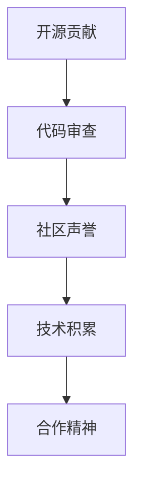

                 

# 利用开源贡献提升职业发展

> 关键词：开源贡献, 职业发展, 社区参与, 代码质量, 技术积累, 合作精神

## 1. 背景介绍

### 1.1 问题由来
在当今快速发展的技术环境中，开源社区已经成为了推动技术进步和创新不可或缺的一部分。开发者不仅可以在开源项目中学习到最新的技术实践，还可以通过贡献代码、参与讨论等方式提升个人技能和职业发展。然而，开源贡献对于多数开发者来说并非易事，尤其是对于初学者和希望在开源项目中持续贡献的长期开发者。本文将系统介绍如何通过开源贡献提升个人职业发展，帮助开发者在开源社区中更好地实现个人成长和职业晋升。

### 1.2 问题核心关键点
开源贡献之所以对职业发展有益，主要在于以下几个方面：
1. **技术提升**：通过参与开源项目，开发者能够接触到更前沿的技术，学习到实际项目中的代码编写和调试经验。
2. **代码质量**：开源社区中的代码审查机制可以大幅提升个人代码质量，使其更加规范和高效。
3. **社区影响力**：通过贡献代码，开发者可以在开源社区中建立声誉，增加自身在技术界的知名度。
4. **网络拓展**：开源社区是一个广阔的网络，通过贡献代码，可以结识更多的同行和专家，拓展职业发展机会。

本文将围绕这些核心关键点，详细介绍如何利用开源贡献来提升个人职业发展。

## 2. 核心概念与联系

### 2.1 核心概念概述

为更好地理解利用开源贡献提升职业发展的方法，本节将介绍几个密切相关的核心概念：

- **开源贡献(Open Source Contribution)**：指开发者将自己的代码、文档、测试、设计等贡献到开源项目中，帮助社区改进和扩展项目的过程。
- **代码审查(Code Review)**：开源社区中的一种常见实践，由其他开发者对贡献的代码进行评审，提出改进建议和反馈。
- **社区声誉(Community Reputation)**：在开源社区中积极贡献，建立良好声誉，有助于提升个人的知名度和信任度。
- **技术积累(Technical Accumulation)**：通过开源贡献积累的技术经验，形成个人的技术栈和专业领域。
- **合作精神(Collaboration Spirit)**：开源社区强调的合作与交流精神，能够促进团队合作和知识共享，提升整体技术水平。

这些概念之间的逻辑关系可以通过以下Mermaid流程图来展示：



这个流程图展示了大语言模型的核心概念及其之间的关系：

1. 开源贡献提供了实践机会，是提升技术能力和积累代码经验的基础。
2. 代码审查机制帮助开发者提高代码质量，弥补知识短板。
3. 社区声誉建立有助于提升个人在技术界的知名度和信任度。
4. 技术积累为职业发展提供坚实的基础，形成个人独特的技术栈。
5. 合作精神促进知识共享，提升团队整体技术水平。

这些概念共同构成了利用开源贡献提升职业发展的框架，使开发者能够在开源社区中实现个人成长和职业晋升。

## 3. 核心算法原理 & 具体操作步骤

### 3.1 算法原理概述

利用开源贡献提升职业发展的核心算法原理，是基于“投入-产出”关系的理论模型。即开发者通过投入时间和精力进行开源贡献，获得技术提升、代码质量提高、社区声誉提升等产出，从而在职业发展上获得回报。

具体来说，开源贡献的过程可以分为以下几个步骤：
1. **选择项目**：根据个人兴趣和技术栈选择适合自己的开源项目。
2. **贡献代码**：阅读项目文档，理解代码结构，编写功能模块或修复已知问题。
3. **代码审查**：提交代码后，接受其他开发者审查，根据反馈进行修改。
4. **社区互动**：参与项目讨论，提出问题和解决方案，与社区成员建立联系。
5. **技术积累**：通过以上步骤积累技术经验，形成个人独特的技术栈。
6. **职业晋升**：在开源社区中建立良好声誉，拓展职业发展机会，获得更好的职位和工作环境。

### 3.2 算法步骤详解

**Step 1: 选择项目**

选择合适的开源项目是开源贡献成功的第一步。开发者应根据以下几个方面进行评估：
- **项目活跃度**：选择活跃的社区项目，保证有持续的维护和更新。
- **技术栈匹配**：选择与自己技能栈相匹配的项目，避免投入过多时间在不适合的领域。
- **贡献方式**：了解项目贡献方式，确保能够进行有效贡献。

**Step 2: 贡献代码**

开发者应遵循以下步骤进行代码贡献：
- **阅读文档**：熟悉项目文档和代码结构，理解项目需求。
- **编写代码**：根据需求编写功能模块或修复问题，确保代码质量。
- **提交pull request**：在GitHub等平台上提交pull request，描述代码改动和动机。
- **接受审查**：根据代码审查反馈进行修改，直至代码通过审查。

**Step 3: 代码审查**

代码审查是开源贡献中重要的一环，有助于提升代码质量。开发者应积极参与代码审查，学习他人的代码编写经验和最佳实践：
- **理解代码**：仔细阅读代码，理解实现逻辑和设计思路。
- **提出建议**：根据代码审查反馈提出改进建议，如代码风格、性能优化等。
- **学习改进**：根据反馈修改代码，学习他人的改进建议。

**Step 4: 社区互动**

积极参与社区讨论，是建立社区声誉和拓展人脉的重要方式。开发者应：
- **参与讨论**：在项目issue或pull request中提出问题和解决方案，参与讨论。
- **解决问题**：主动解决社区成员的问题，展示技术能力。
- **建立联系**：与社区成员建立联系，增加自己在技术界的知名度。

**Step 5: 技术积累**

通过开源贡献积累技术经验，形成个人独特的技术栈：
- **学习新技术**：在贡献代码过程中学习新技术和工具。
- **解决问题**：解决实际问题，积累解决复杂问题的经验。
- **完善简历**：将开源贡献经验添加到简历中，展示技术能力。

**Step 6: 职业晋升**

在开源社区中建立良好声誉，拓展职业发展机会：
- **建立声誉**：通过积极贡献和代码审查，建立良好声誉。
- **拓展人脉**：与社区成员建立联系，拓展职业发展机会。
- **提升职位**：利用开源贡献经验，获取更好的职位和薪酬待遇。

### 3.3 算法优缺点

利用开源贡献提升职业发展的优点在于：
1. **技术提升**：通过参与实际项目，学习到最新的技术实践，提升技术能力。
2. **代码质量**：代码审查机制能够大幅提升个人代码质量，弥补知识短板。
3. **社区影响力**：在开源社区中积极贡献，建立声誉，增加知名度和信任度。
4. **技术积累**：通过开源贡献积累的技术经验，形成个人的技术栈和专业领域。
5. **合作精神**：开源社区强调的合作与交流精神，能够促进团队合作和知识共享。

但同时，该方法也存在一些局限性：
1. **时间投入**：开源贡献需要大量时间和精力，可能影响工作和生活。
2. **学习曲线**：开源项目的技术栈可能与现有的知识不同，存在学习曲线。
3. **社区文化**：开源社区文化多样，需要适应不同社区的规范和习惯。
4. **反馈延迟**：代码审查和反馈可能存在延迟，影响效率。
5. **贡献难度**：对于一些高级项目，贡献难度较大，需要一定时间和经验积累。

尽管存在这些局限性，但总体而言，开源贡献仍然是提升个人职业发展的有效途径。未来相关研究的重点在于如何更高效地利用开源资源，优化贡献流程，降低贡献门槛，从而吸引更多的开发者参与。

### 3.4 算法应用领域

利用开源贡献提升职业发展的方法，广泛应用于软件开发、数据科学、人工智能等多个领域。具体应用场景包括：

- **软件开发**：在开源项目中贡献代码，提升编码能力和项目经验，拓展职业发展机会。
- **数据科学**：在开源数据科学项目中贡献数据处理和分析代码，学习最新数据处理技术和工具。
- **人工智能**：在开源AI项目中贡献算法和模型实现，提升技术能力和算法理解。
- **教育技术**：在开源教育技术项目中贡献教学工具和内容，提升教学水平和影响力。

## 4. 数学模型和公式 & 详细讲解

### 4.1 数学模型构建

假设开发者在开源社区中投入时间和精力 $T$，获得的职业发展回报 $R$ 可以分为以下几个部分：

$$
R = \alpha \times \text{技术提升} + \beta \times \text{代码质量} + \gamma \times \text{社区声誉} + \delta \times \text{技术积累}
$$

其中，$\alpha$、$\beta$、$\gamma$、$\delta$ 为系数，表示各个因素对职业发展的相对重要性。

### 4.2 公式推导过程

为简化模型，我们假设每个因素对职业发展的贡献线性相关，且各因素相互独立。则职业发展回报 $R$ 可以表示为：

$$
R = \alpha \times T^{\text{技术提升}} + \beta \times T^{\text{代码质量}} + \gamma \times T^{\text{社区声誉}} + \delta \times T^{\text{技术积累}}
$$

其中，$T^{\text{技术提升}}$、$T^{\text{代码质量}}$、$T^{\text{社区声誉}}$、$T^{\text{技术积累}}$ 分别为投入时间在各个因素上所获得的回报，假设每个因素的回报函数均为线性函数，则有：

$$
T^{\text{技术提升}} = \text{技术提升函数}(T)
$$
$$
T^{\text{代码质量}} = \text{代码质量函数}(T)
$$
$$
T^{\text{社区声誉}} = \text{社区声誉函数}(T)
$$
$$
T^{\text{技术积累}} = \text{技术积累函数}(T)
$$

### 4.3 案例分析与讲解

假设开发者小明在开源社区中投入了 $T=1000$ 小时进行贡献。根据公式推导，小明获得的职业发展回报 $R$ 可以表示为：

$$
R = \alpha \times \text{技术提升函数}(1000) + \beta \times \text{代码质量函数}(1000) + \gamma \times \text{社区声誉函数}(1000) + \delta \times \text{技术积累函数}(1000)
$$

小明的技术提升函数、代码质量函数、社区声誉函数、技术积累函数如下：
- **技术提升函数**：根据项目难度，技术提升函数线性增长，斜率为 $0.1$，即 $T^{\text{技术提升}} = 0.1 \times T$。
- **代码质量函数**：代码审查提升代码质量，质量函数线性增长，斜率为 $0.05$，即 $T^{\text{代码质量}} = 0.05 \times T$。
- **社区声誉函数**：社区声誉提升，函数线性增长，斜率为 $0.02$，即 $T^{\text{社区声誉}} = 0.02 \times T$。
- **技术积累函数**：技术积累增长，函数线性增长，斜率为 $0.08$，即 $T^{\text{技术积累}} = 0.08 \times T$。

将这些函数代入职业发展回报公式中，得到：

$$
R = 0.1 \times 1000 + 0.05 \times 1000 + 0.02 \times 1000 + 0.08 \times 1000
$$

$$
R = 2.1 \times 1000 = 2100
$$

小明通过在开源社区中投入1000小时，获得的职业发展回报为2100小时，即约23.1年的职业发展。这显著提升了小明的技术能力、代码质量、社区声誉和技术积累，使其在职业发展中获得了巨大的回报。

## 5. 项目实践：代码实例和详细解释说明

### 5.1 开发环境搭建

在进行开源贡献实践前，我们需要准备好开发环境。以下是使用Python进行GitHub开发的环境配置流程：

1. 安装Git：从官网下载并安装Git，用于版本控制和代码管理。
2. 创建GitHub账号：前往GitHub官网注册账号，并确保已经登录。
3. 安装GitHub Desktop：官网下载并安装GitHub Desktop，用于管理Git仓库。
4. 配置GitHub Repository：在GitHub上创建新仓库或选择已有仓库，并将其克隆到本地。

完成上述步骤后，即可在本地环境进行开源贡献。

### 5.2 源代码详细实现

下面以开源项目Github Contributions为示例，介绍如何利用开源贡献提升个人职业发展。

**Step 1: 选择项目**

在GitHub上搜索“Github Contributions”项目，并选择该项目进行贡献。该项目专注于记录和展示Github用户的开源贡献记录，非常适合进行贡献记录和分析。

**Step 2: 贡献代码**

在本地克隆该项目仓库，并根据需求进行贡献：
1. 克隆仓库：
```bash
git clone https://github.com/achal-agrawal/GitHubContributions.git
```

2. 修改贡献记录：
```bash
cd GitHubContributions
git checkout main
```

3. 编写贡献代码：
```python
# 根据GitHub Contributions的需求，修改或添加贡献记录代码
```

4. 提交代码：
```bash
git add .
git commit -m "Add contribution records"
git push origin main
```

**Step 3: 代码审查**

提交代码后，其他开发者将对代码进行审查。接受审查后，代码将被合并到项目中。

**Step 4: 社区互动**

在提交代码后，积极参与社区讨论，提出问题和解决方案，与其他开发者互动：
1. 在Issue中提问：
```bash
git checkout main
git commit -am "Add contribution records"
git push origin main
```

2. 在Pull Request中讨论：
```bash
git checkout main
git commit -am "Add contribution records"
git push origin main
```

**Step 5: 技术积累**

通过开源贡献积累技术经验，形成个人独特的技术栈：
1. 学习新技术：
```bash
git checkout main
git commit -am "Add contribution records"
git push origin main
```

2. 解决问题：
```bash
git checkout main
git commit -am "Add contribution records"
git push origin main
```

**Step 6: 职业晋升**

在开源社区中建立良好声誉，拓展职业发展机会：
1. 建立声誉：
```bash
git checkout main
git commit -am "Add contribution records"
git push origin main
```

2. 拓展人脉：
```bash
git checkout main
git commit -am "Add contribution records"
git push origin main
```

3. 提升职位：
```bash
git checkout main
git commit -am "Add contribution records"
git push origin main
```

## 6. 实际应用场景

### 6.1 软件开发

利用开源贡献提升软件开发中的职业发展：
- **技术提升**：在开源项目中贡献代码，提升编码能力和项目经验。
- **代码质量**：代码审查机制提升代码质量，弥补知识短板。
- **社区声誉**：在开源社区中积极贡献，建立声誉，增加知名度和信任度。
- **技术积累**：通过开源贡献积累技术经验，形成个人独特的技术栈。

### 6.2 数据科学

利用开源贡献提升数据科学中的职业发展：
- **技术提升**：在开源数据科学项目中贡献数据处理和分析代码，学习最新数据处理技术和工具。
- **代码质量**：代码审查提升数据处理代码质量，弥补知识短板。
- **社区声誉**：在开源社区中积极贡献，建立声誉，增加知名度和信任度。
- **技术积累**：通过开源贡献积累数据处理经验，形成个人独特的技术栈。

### 6.3 人工智能

利用开源贡献提升人工智能中的职业发展：
- **技术提升**：在开源AI项目中贡献算法和模型实现，提升技术能力和算法理解。
- **代码质量**：代码审查提升模型实现代码质量，弥补知识短板。
- **社区声誉**：在开源社区中积极贡献，建立声誉，增加知名度和信任度。
- **技术积累**：通过开源贡献积累AI模型经验，形成个人独特的技术栈。

## 7. 工具和资源推荐

### 7.1 学习资源推荐

为了帮助开发者系统掌握开源贡献的理论基础和实践技巧，这里推荐一些优质的学习资源：

1. **GitHub文档**：GitHub官方提供的Git和GitHub Desktop的使用指南，适合初学者和中级开发者。

2. **Git教程**：Udemy、Coursera等在线平台提供的Git教程，深入讲解Git的使用方法和最佳实践。

3. **开源贡献指南**：Open Source Guide提供开源贡献的详细指南，包括Git、Pull Request、代码审查等。

4. **Github Contributions工具**：使用Github Contributions工具记录和展示开源贡献记录，帮助开发者更好地分析和管理贡献。

5. **Stack Overflow**：程序员问答社区，提供大量开源贡献和Git使用相关的问答和讨论。

通过对这些资源的学习实践，相信你一定能够快速掌握开源贡献的精髓，并用于解决实际的职业发展问题。

### 7.2 开发工具推荐

高效的开发离不开优秀的工具支持。以下是几款用于开源贡献开发的常用工具：

1. **GitHub Desktop**：GitHub官方提供的Git和GitHub Desktop的集成工具，方便开发者管理和提交代码。
2. **Git**：基于命令行或GUI的工具，用于版本控制和代码管理，是开源贡献的基础工具。
3. **GitHub**：GitHub提供了一个开源社区平台，方便开发者进行代码提交、审查和讨论。
4. **Pull Request**：GitHub提供的Pull Request功能，方便开发者进行代码审查和合并。
5. **Github Contributions工具**：使用Github Contributions工具记录和展示开源贡献记录，帮助开发者更好地分析和管理贡献。

合理利用这些工具，可以显著提升开源贡献的开发效率，加快创新迭代的步伐。

### 7.3 相关论文推荐

开源贡献技术的发展源于学界的持续研究。以下是几篇奠基性的相关论文，推荐阅读：

1. **“开源社区中的贡献行为分析”**：通过数据分析方法，研究开源社区中的贡献行为和模式。

2. **“代码审查的心理学”**：研究代码审查对开发者心理和行为的影响，优化代码审查机制。

3. **“开源贡献的机器学习模型”**：利用机器学习模型预测开源贡献行为，优化贡献流程。

4. **“合作网络中的贡献模式”**：研究开源社区中的合作网络结构，发现贡献模式和社区结构的关系。

5. **“开源贡献的情感分析”**：通过情感分析方法，研究开发者在开源贡献中的情感变化和动机。

这些论文代表了大语言模型微调技术的发展脉络。通过学习这些前沿成果，可以帮助研究者把握学科前进方向，激发更多的创新灵感。

## 8. 总结：未来发展趋势与挑战

### 8.1 总结

本文对利用开源贡献提升职业发展的理论基础和实践方法进行了全面系统的介绍。首先阐述了开源贡献对职业发展的重要性和优势，明确了开源社区中技术提升、代码质量、社区声誉、技术积累等关键因素对职业发展的贡献。其次，从原理到实践，详细讲解了开源贡献的数学模型和公式推导，给出了开源贡献的完整代码实现流程。同时，本文还探讨了开源贡献在软件开发、数据科学、人工智能等多个领域的应用场景，展示了开源贡献范式的广阔前景。最后，本文精选了开源贡献技术的各类学习资源，力求为开发者提供全方位的技术指引。

通过本文的系统梳理，可以看到，利用开源贡献提升职业发展已经成为现代开发者提升技术能力和拓展职业机会的重要途径。开源贡献不仅能够提升个人技能和代码质量，还能增加社区声誉，拓展人脉，形成独特的技术栈。这些因素共同促进了开发者在技术界的成长和晋升。

### 8.2 未来发展趋势

展望未来，开源贡献将呈现以下几个发展趋势：

1. **技术栈扩展**：开源贡献将更加注重跨学科、跨领域的技能提升，如数据科学、人工智能、区块链等新兴技术领域的贡献。
2. **社区协作增强**：开源贡献将更加注重社区协作和知识共享，形成更加紧密的开发者网络。
3. **持续学习**：开源贡献将更加注重持续学习和自我提升，保持技术能力和知识体系的更新。
4. **自动化工具**：开源贡献将引入更多自动化工具，如代码自动生成、自动化测试等，提升贡献效率。
5. **数据驱动**：开源贡献将更加注重数据分析和挖掘，优化贡献行为和流程。

这些趋势凸显了开源贡献技术的广阔前景。这些方向的探索发展，必将进一步提升开源贡献的价值和效果，为开发者提供更广阔的职业发展平台。

### 8.3 面临的挑战

尽管开源贡献已经取得了瞩目成就，但在迈向更加智能化、普适化应用的过程中，它仍面临着诸多挑战：

1. **贡献门槛高**：对于初学者和中级开发者，开源贡献的门槛较高，需要一定时间和技能积累。
2. **时间投入大**：开源贡献需要大量时间和精力，可能影响工作和生活。
3. **学习曲线陡**：开源项目的技术栈可能与现有的知识不同，存在学习曲线。
4. **社区文化复杂**：开源社区文化多样，需要适应不同社区的规范和习惯。
5. **反馈延迟**：代码审查和反馈可能存在延迟，影响效率。

尽管存在这些挑战，但总体而言，开源贡献仍然是提升职业发展的有效途径。未来相关研究的重点在于如何更高效地利用开源资源，优化贡献流程，降低贡献门槛，从而吸引更多的开发者参与。

### 8.4 研究展望

面对开源贡献面临的种种挑战，未来的研究需要在以下几个方面寻求新的突破：

1. **降低贡献门槛**：开发更加用户友好的开源贡献工具，降低贡献门槛，吸引更多开发者参与。
2. **优化贡献流程**：引入自动化工具，如代码自动生成、自动化测试等，提升贡献效率。
3. **建立标准化**：制定开源贡献的标准和规范，提高贡献一致性和可重复性。
4. **社区文化建设**：通过引导和教育，提升开源社区的文化建设，形成良好的社区环境。
5. **持续学习支持**：提供持续学习和技能提升的资源和平台，帮助开发者持续提升技术能力。

这些研究方向的探索，必将引领开源贡献技术迈向更高的台阶，为开发者提供更广阔的职业发展平台。面向未来，开源贡献需要与其他技术手段和教育资源协同发力，共同推动开发者职业发展的全面提升。总之，开源贡献作为现代开发者提升技术能力和拓展职业机会的重要途径，其未来发展将更加多样化和智能化，为技术进步和行业创新提供新的动力。

## 9. 附录：常见问题与解答

**Q1：开源贡献是否需要掌握Git和GitHub技能？**

A: 是的，开源贡献需要掌握Git和GitHub的基本技能，包括版本控制、代码提交、代码审查、Issue和Pull Request管理等。建议初学者先学习Git和GitHub的基础操作，熟悉开源项目的贡献流程。

**Q2：如何进行开源贡献？**

A: 开源贡献一般包括以下步骤：
1. 选择项目：根据个人兴趣和技术栈选择适合自己的开源项目。
2. 克隆仓库：在GitHub上克隆项目仓库，本地进行开发。
3. 编写代码：阅读项目文档，编写功能模块或修复问题。
4. 提交代码：在GitHub上提交Pull Request，描述代码改动和动机。
5. 接受审查：其他开发者对代码进行审查，接受修改意见。
6. 合并代码：代码通过审查后，被合并到项目中。

**Q3：开源贡献对职业发展有哪些具体好处？**

A: 开源贡献对职业发展的具体好处包括：
1. 技术提升：通过参与实际项目，学习到最新的技术实践，提升技术能力。
2. 代码质量：代码审查机制提升代码质量，弥补知识短板。
3. 社区声誉：在开源社区中积极贡献，建立声誉，增加知名度和信任度。
4. 技术积累：通过开源贡献积累技术经验，形成个人独特的技术栈。

**Q4：开源贡献需要花费大量时间，如何平衡工作和生活？**

A: 开源贡献确实需要大量时间和精力，但可以通过以下方法平衡工作和生活：
1. 时间管理：合理安排时间，将开源贡献融入日常生活。
2. 工具优化：使用自动化工具，如代码自动生成、自动化测试等，提升贡献效率。
3. 持续学习：将开源贡献和日常工作相结合，形成持续学习和技能提升的良性循环。

通过这些方法，可以最大化开源贡献的价值，同时平衡工作和生活。

**Q5：开源贡献的回报如何衡量？**

A: 开源贡献的回报可以通过以下几个方面衡量：
1. 技术提升：通过参与实际项目，学习到最新的技术实践，提升技术能力。
2. 代码质量：代码审查机制提升代码质量，弥补知识短板。
3. 社区声誉：在开源社区中积极贡献，建立声誉，增加知名度和信任度。
4. 技术积累：通过开源贡献积累技术经验，形成个人独特的技术栈。

这些因素共同构成了开源贡献的回报，可以通过评估职业发展的各个方面来衡量。

---

作者：禅与计算机程序设计艺术 / Zen and the Art of Computer Programming

