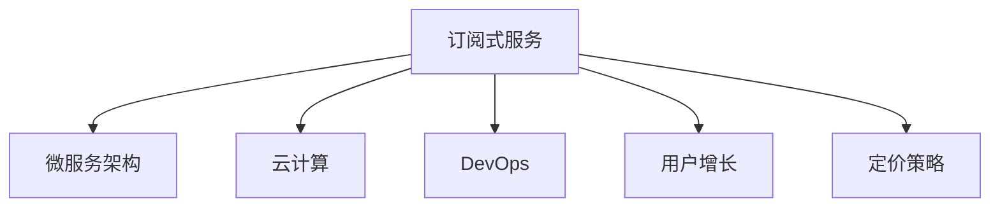

                 

# 利用技术优势创建订阅式服务

> 关键词：订阅式服务,微服务架构,云计算,DevOps,用户增长

## 1. 背景介绍

### 1.1 问题由来

近年来，随着互联网和移动互联网的迅猛发展，订阅式服务（Subscription-based Service）已经成为各行各业的主流商业模式之一。无论是SaaS、PaaS、BaaS，还是各种增值服务，都离不开订阅服务模式。

然而，构建和运营一个成功的订阅式服务并不是一件简单的事情。从市场分析、产品设计、用户增长，到定价策略、技术架构，再到用户留存、收入变现，每一个环节都充满挑战。

特别是技术架构的选择，对于订阅服务的持续发展和规模化扩展至关重要。如何利用最新技术优势，构建稳定、高效、灵活的订阅式服务架构，成为技术团队的重要课题。

本文聚焦于如何利用微服务架构、云计算、DevOps等前沿技术，构建具有强大生命力的订阅式服务，并探讨其未来的发展趋势和面临的挑战。

### 1.2 问题核心关键点

构建订阅式服务的关键在于选择合适的技术架构，并充分利用现代技术提供的各种优势，包括但不限于：

1. **微服务架构（Microservices Architecture）**：通过将服务拆分为小的、可独立部署的服务模块，提高系统的灵活性、可扩展性和可维护性。
2. **云计算（Cloud Computing）**：利用云平台提供的弹性计算和存储资源，降低运维成本，快速部署和扩展服务。
3. **DevOps（Development & Operations）**：通过持续集成（CI）、持续交付（CD）等自动化工具和流程，加速服务迭代和部署，缩短上市时间。
4. **用户增长（User Growth）**：利用数据驱动的用户行为分析和营销策略，提升用户获取和留存率。
5. **定价策略（Pricing Strategy）**：通过灵活的订阅定价策略，提升服务收益，降低用户流失率。

## 2. 核心概念与联系

### 2.1 核心概念概述

为更好地理解如何利用技术优势构建订阅式服务，本节将介绍几个密切相关的核心概念：

- **订阅式服务（Subscription-based Service）**：基于定期付费机制，为用户提供持续、可扩展的服务模式。订阅式服务常见于SaaS、PaaS、BaaS等领域。
- **微服务架构（Microservices Architecture）**：将一个大应用拆分为多个小的、可独立部署的服务模块，每个服务模块围绕业务功能进行设计。
- **云计算（Cloud Computing）**：通过虚拟化的方式，将计算和存储资源以服务的形式提供给用户，按需使用、按量计费。
- **DevOps（Development & Operations）**：通过自动化和协作的工具和流程，加速软件的持续交付和部署。
- **用户增长（User Growth）**：通过市场分析、产品设计、推广策略等手段，提升用户的获取和留存率，实现商业增长。
- **定价策略（Pricing Strategy）**：通过灵活的定价方式，如免费试用、按需计费、梯度定价等，提升服务的市场竞争力。

这些核心概念之间的逻辑关系可以通过以下Mermaid流程图来展示：



这个流程图展示订阅式服务的核心概念及其之间的关系：

1. 订阅式服务通过微服务架构进行系统设计，提高系统的灵活性和可扩展性。
2. 订阅式服务通过云计算平台提供弹性资源，降低运维成本，快速部署服务。
3. DevOps技术加速服务的迭代和交付，缩短上市时间。
4. 用户增长策略提升用户获取和留存率，增强市场竞争力。
5. 定价策略通过灵活的计费方式，提升服务收益。

## 3. 核心算法原理 & 具体操作步骤

### 3.1 算法原理概述

订阅式服务的构建涉及多个环节，包括市场分析、产品设计、技术架构、运营管理等。本文重点关注技术架构，特别是如何利用微服务架构、云计算和DevOps等技术，实现订阅服务的快速迭代、灵活扩展和高效运营。

### 3.2 算法步骤详解

构建订阅式服务的一般流程如下：

**Step 1: 市场分析和用户需求调研**
- 通过问卷调查、访谈、竞争分析等手段，获取用户需求和市场趋势。
- 确定服务的核心功能模块和价值主张。

**Step 2: 设计服务模块**
- 根据市场分析结果，设计服务模块及其功能边界。
- 划分服务模块之间的依赖关系，确定服务间的通信协议。

**Step 3: 部署服务架构**
- 选择合适的云计算平台，进行计算和存储资源的规划和部署。
- 在云平台上搭建微服务架构，根据服务模块划分应用层次，设计数据存储和访问方案。

**Step 4: 配置DevOps工具链**
- 引入持续集成（CI）和持续交付（CD）工具，自动化代码构建、测试和部署流程。
- 配置自动化监控和告警系统，实时监控服务性能和健康状态。

**Step 5: 实施用户增长策略**
- 通过数据驱动的用户行为分析，设计用户获取和留存策略。
- 利用自动化营销工具，实施推广活动，提升用户注册和转化率。

**Step 6: 定价策略设计**
- 根据成本、市场竞争和用户需求，设计灵活的定价策略。
- 推出免费试用、按需计费、梯度定价等多种计费方式。

**Step 7: 用户反馈和迭代**
- 收集用户反馈，持续优化产品和服务质量。
- 根据用户需求和市场变化，灵活调整服务模块和技术架构。

### 3.3 算法优缺点

利用技术优势构建订阅式服务的方法具有以下优点：

1. **灵活性高**：微服务架构使服务模块能够独立部署和更新，提高系统的灵活性和可扩展性。
2. **扩展性强**：云计算平台提供的弹性资源，可以快速扩展服务规模，应对业务增长。
3. **运维成本低**：自动化工具和DevOps流程减少人工运维工作量，降低运维成本。
4. **上市时间短**：自动化工具和持续交付流程，加速服务迭代和部署，缩短上市时间。
5. **用户粘性强**：数据驱动的用户增长策略，提升用户获取和留存率，增强市场竞争力。

同时，该方法也存在一些缺点：

1. **架构复杂**：微服务架构带来模块化的优势，但也增加了系统复杂度，设计和管理难度增大。
2. **成本高**：云计算平台资源按需计费，对中小型企业来说，初期成本较高。
3. **技术门槛高**：DevOps和云计算技术要求较高的技术储备，需要专业团队支持。
4. **依赖云平台**：服务的稳定性和安全性在一定程度上依赖于云平台的服务质量。

尽管存在这些缺点，但就目前而言，利用技术优势构建订阅式服务仍然是最主流和高效的方法之一。未来相关研究的重点在于如何进一步简化微服务架构，降低云计算成本，提升DevOps技术能力，以适应不同规模和需求的企业。

### 3.4 算法应用领域

利用技术优势构建的订阅式服务，已经在金融、电商、教育、医疗等多个领域得到了广泛应用，为各行业的数字化转型提供了强大的技术支撑。

- **金融领域**：金融科技公司通过订阅服务模式，为用户提供线上开户、投资理财、贷款申请等服务，提升用户体验和市场竞争力。
- **电商领域**：电商平台通过订阅服务，提供增值服务如会员特权、个性化推荐、快速物流等，提升用户粘性和购买率。
- **教育领域**：在线教育平台通过订阅服务，提供课程学习、辅导答疑、职业规划等服务，满足用户不同层次的学习需求。
- **医疗领域**：远程医疗平台通过订阅服务，提供健康咨询、在线诊疗、远程监测等服务，提升医疗服务可及性和便捷性。

除了这些典型应用外，利用技术优势构建的订阅式服务还在智能制造、智慧城市、能源管理等新兴领域中不断涌现，展现出广阔的发展潜力。

## 4. 数学模型和公式 & 详细讲解 & 举例说明

### 4.1 数学模型构建

为了更好地理解订阅式服务的技术实现，本节将使用数学语言对服务构建过程进行更加严格的刻画。

记订阅式服务为 $S$，包括 $n$ 个微服务模块 $M_i$，$i \in [1, n]$。每个微服务模块的功能和接口定义如下：

- **服务接口**：每个微服务模块 $M_i$ 提供一组接口函数 $f_i$，用于与其他模块进行通信。
- **服务状态**：每个微服务模块 $M_i$ 维护自身的内部状态 $s_i$，包括计算资源、数据存储等。
- **服务依赖**：每个微服务模块 $M_i$ 对其他模块的依赖关系为 $D_i = \{j|j \in [1, n], j \neq i\}$。

订阅服务的功能和性能可以由以下数学模型描述：

1. **服务依赖关系**：
   $$
   D = \{(i, j) | i \in [1, n], j \in [1, n], j \neq i\}
   $$

2. **服务功能模型**：
   $$
   F = \{f_i | i \in [1, n]\}
   $$

3. **服务状态模型**：
   $$
   S_i = \{s_i | i \in [1, n]\}
   $$

4. **服务资源模型**：
   $$
   R = \{r_i | i \in [1, n], r_i \in \mathbb{R}^+ \times \mathbb{R}^+}
   $$

5. **服务性能模型**：
   $$
   P = \{p_i | i \in [1, n], p_i \in \mathbb{R}^+ \times \mathbb{R}^+\}
   $$

### 4.2 公式推导过程

在上述数学模型的基础上，可以推导出订阅服务的总性能模型：

设订阅服务的总性能为 $P_S$，每个微服务模块的性能为 $P_i$，则：

$$
P_S = \prod_{i=1}^n P_i
$$

其中 $P_i$ 为微服务模块 $M_i$ 的性能指标，可以表示为：

$$
P_i = f_i(S_i, R_i)
$$

其中 $S_i$ 和 $R_i$ 分别为微服务模块 $M_i$ 的内部状态和资源，可以通过计算资源、数据存储等参数表示。

### 4.3 案例分析与讲解

以在线教育平台为例，分析如何利用技术优势构建订阅式服务。

在线教育平台提供各种在线课程和学习资源，用户可以通过订阅服务获取个性化学习和辅导。订阅服务的功能和性能模型可以表示为：

1. **服务依赖关系**：
   - 课程内容模块（Course Content）依赖教材数据库模块（Textbooks），用于获取课程教材和习题。
   - 学习分析模块（Learning Analytics）依赖课程内容模块和用户行为数据模块（User Behavior），用于生成学习报告和推荐。
   - 辅导答疑模块（Tutoring Support）依赖课程内容模块和用户学习数据模块（Learning Data），用于提供个性化的答疑和辅导。

2. **服务功能模型**：
   - 课程内容模块：提供课程介绍、课程大纲、课程讲义等。
   - 学习分析模块：分析用户学习行为，生成学习报告，推荐学习资源。
   - 辅导答疑模块：提供在线答疑，提供个性化的学习辅导。

3. **服务状态模型**：
   - 课程内容模块：维护课程信息和教材数据库。
   - 学习分析模块：维护用户学习行为数据和分析模型。
   - 辅导答疑模块：维护在线答疑数据和辅导资源。

4. **服务资源模型**：
   - 课程内容模块：计算资源、数据存储、课程教材等。
   - 学习分析模块：计算资源、数据存储、用户行为数据等。
   - 辅导答疑模块：计算资源、数据存储、辅导资源等。

5. **服务性能模型**：
   - 课程内容模块：课程内容更新速度、教材下载速度、讲义生成速度等。
   - 学习分析模块：学习报告生成速度、数据分析速度、推荐生成速度等。
   - 辅导答疑模块：在线答疑响应速度、辅导资源加载速度、个性化答疑准确率等。

通过以上模型，可以定量分析在线教育平台的订阅服务功能、性能和资源需求，从而指导系统的设计和优化。

## 5. 项目实践：代码实例和详细解释说明

### 5.1 开发环境搭建

在进行订阅式服务开发前，我们需要准备好开发环境。以下是使用Python进行Django开发的环境配置流程：

1. 安装Anaconda：从官网下载并安装Anaconda，用于创建独立的Python环境。

2. 创建并激活虚拟环境：
```bash
conda create -n django-env python=3.8 
conda activate django-env
```

3. 安装Django：
```bash
pip install django
```

4. 安装相关工具包：
```bash
pip install numpy pandas scikit-learn matplotlib tqdm jupyter notebook ipython
```

完成上述步骤后，即可在`django-env`环境中开始开发。

### 5.2 源代码详细实现

这里我们以在线教育平台为例，给出使用Django框架构建订阅服务的PyTorch代码实现。

首先，定义订阅服务的模型和视图：

```python
from django.http import JsonResponse
from django.views.decorators.csrf import csrf_exempt
import json

# 定义订阅服务模型
class SubscriptionService(models.Model):
    name = models.CharField(max_length=50)
    plan = models.CharField(max_length=50)
    price = models.DecimalField(max_digits=10, decimal_places=2)
    active = models.BooleanField(default=False)

# 定义订阅服务视图
@csrf_exempt
def create_subscription(request):
    if request.method == 'POST':
        subscription = json.loads(request.body)
        subscription = SubscriptionService.objects.create(name=subscription['name'], plan=subscription['plan'], price=subscription['price'], active=True)
        return JsonResponse({'success': True, 'id': subscription.id})
    else:
        return JsonResponse({'success': False, 'message': 'Invalid request method'})
```

然后，定义订阅服务的表单和样式：

```html
<!-- 订阅服务表单 -->
<form action="" method="post">
    
    <input type="text" name="name" placeholder="服务名称">
    <input type="text" name="plan" placeholder="服务计划">
    <input type="text" name="price" placeholder="服务价格">
    <button type="submit">创建订阅</button>
</form>
```

最后，启动Django开发服务器，进行订阅服务的创建和调用：

```bash
python manage.py runserver
```

在浏览器中访问`http://localhost:8000`，即可进行订阅服务的创建和调用。

### 5.3 代码解读与分析

让我们再详细解读一下关键代码的实现细节：

**SubscriptionService模型**：
- 定义了订阅服务的基本属性，包括服务名称、服务计划、服务价格和是否激活等。

**create_subscription视图**：
- 使用`@csrf_exempt`装饰器，允许非CSRF保护的POST请求。
- 通过`json.loads(request.body)`解析请求体，获取订阅服务的基本信息。
- 使用`SubscriptionService.objects.create()`方法创建新的订阅服务，并返回其ID。

**订阅服务表单**：
- 使用HTML表单收集订阅服务的基本信息。
- 通过``添加CSRF token，确保请求的安全性。
- 通过`<input>`标签收集订阅服务名称、计划和价格。

可以看到，Django提供了便捷的Web开发框架，使得订阅服务的构建变得简单易行。开发者可以根据具体需求，扩展模型的功能，设计更复杂的服务流程，提升用户体验。

当然，实际的Web应用开发还需考虑更多因素，如数据库设计、前端交互、API接口等。但核心的订阅服务构建思路基本与此类似。

## 6. 实际应用场景

### 6.1 智能制造平台

智能制造平台通过订阅服务，为用户提供设备监控、生产调度、质量检测等服务，提升制造业的智能化和自动化水平。

在技术实现上，可以构建基于微服务架构的智能制造平台，每个服务模块负责不同的功能，如设备数据采集模块、生产调度模块、质量检测模块等。通过云计算平台提供弹性资源，确保平台的高可靠性和可扩展性。同时，通过DevOps流程自动化服务部署和运维，缩短上市时间，提升服务质量。

### 6.2 智慧城市治理

智慧城市治理通过订阅服务，提供城市事件监测、舆情分析、应急指挥等服务，提升城市管理的智能化和协同化水平。

在技术实现上，可以构建基于微服务架构的智慧城市治理平台，每个服务模块负责不同的功能，如城市事件监测模块、舆情分析模块、应急指挥模块等。通过云计算平台提供弹性资源，确保平台的高可靠性和可扩展性。同时，通过DevOps流程自动化服务部署和运维，缩短上市时间，提升服务质量。

### 6.3 医疗健康服务

医疗健康服务通过订阅服务，提供在线诊疗、健康咨询、远程监测等服务，提升医疗服务的可及性和便捷性。

在技术实现上，可以构建基于微服务架构的医疗健康服务平台，每个服务模块负责不同的功能，如在线诊疗模块、健康咨询模块、远程监测模块等。通过云计算平台提供弹性资源，确保平台的高可靠性和可扩展性。同时，通过DevOps流程自动化服务部署和运维，缩短上市时间，提升服务质量。

### 6.4 未来应用展望

随着订阅式服务的不断发展，未来将在更多领域得到应用，为各行各业带来变革性影响。

在智慧农业领域，通过订阅服务，提供作物监测、病虫害预测、智能灌溉等服务，提升农业生产的智能化和精准化水平。

在智慧零售领域，通过订阅服务，提供客户数据分析、个性化推荐、智能客服等服务，提升零售体验和销售效率。

在智慧交通领域，通过订阅服务，提供交通流量监测、智能调度、安全预警等服务，提升交通管理的智能化和安全性。

此外，在智慧能源、智慧旅游、智慧安全等众多领域，订阅式服务也将不断涌现，为各行各业带来新的应用场景和技术突破。相信伴随技术的不断进步，订阅式服务将变得更加广泛和深入，为社会的数字化转型提供更强大的技术支撑。

## 7. 工具和资源推荐

### 7.1 学习资源推荐

为了帮助开发者系统掌握订阅式服务的技术基础和实践技巧，这里推荐一些优质的学习资源：

1. **《微服务架构》（Microservices Architecture）系列博文**：由微服务架构专家撰写，深入浅出地介绍了微服务架构的概念、设计原则和实践技巧。

2. **《云计算基础》（Cloud Computing Fundamentals）课程**：Coursera开设的云计算基础课程，涵盖云计算的基本原理和应用场景，是入门云计算的必备资源。

3. **《DevOps实践指南》（DevOps Best Practices）书籍**：介绍DevOps的最佳实践，包括持续集成、持续交付、自动化运维等。

4. **《订阅式服务设计与实现》（Subscription Service Design and Implementation）论文**：探讨订阅式服务的设计和实现方法，提供多种实际案例和解决方案。

5. **Django官方文档**：Django的官方文档，提供了丰富的开发指南和代码示例，是快速上手Django开发的必备资料。

通过对这些资源的学习实践，相信你一定能够快速掌握订阅式服务的技术实现，并应用于实际的开发项目中。

### 7.2 开发工具推荐

高效的开发离不开优秀的工具支持。以下是几款用于订阅式服务开发的常用工具：

1. **Django框架**：基于Python的开源Web开发框架，简单易用，提供丰富的数据库支持和Web开发组件。

2. **Flask框架**：基于Python的开源Web开发框架，灵活轻量，适用于快速原型开发和API服务构建。

3. **Kubernetes集群**：开源的容器编排平台，通过自动化的资源管理和调度，提升云服务的可扩展性和高可用性。

4. **Prometheus和Grafana**：监控和可视化工具，用于实时监控服务性能和健康状态，提供丰富的图表展示方式。

5. **Ansible自动化工具**：用于自动化IT基础设施管理，支持配置管理和应用部署，提升服务部署效率。

合理利用这些工具，可以显著提升订阅式服务的开发效率，加快创新迭代的步伐。

### 7.3 相关论文推荐

订阅式服务的构建涉及多个技术领域，涵盖软件工程、云计算、系统架构等多个方向。以下是几篇奠基性的相关论文，推荐阅读：

1. **《微服务架构：构建可扩展的服务导向架构》（Microservices Architecture: Designing Flexible Services for the Enterprise）**：介绍微服务架构的概念、设计原则和实施方法。

2. **《云计算中的弹性计算与存储》（Elastic Computing and Storage in Cloud Computing）**：介绍云计算的弹性资源管理和优化方法。

3. **《DevOps：持续交付与自动化运维》（DevOps: Continuous Delivery and Automation）**：介绍DevOps的最佳实践，包括持续集成、持续交付、自动化运维等。

4. **《订阅式服务设计与实现》（Subscription Service Design and Implementation）**：探讨订阅式服务的设计和实现方法，提供多种实际案例和解决方案。

5. **《订阅式服务的用户增长策略》（User Growth Strategies for Subscription-based Services）**：介绍用户增长策略的实施方法和数据驱动的用户分析方法。

这些论文代表了大语言模型微调技术的发展脉络。通过学习这些前沿成果，可以帮助研究者把握学科前进方向，激发更多的创新灵感。

## 8. 总结：未来发展趋势与挑战

### 8.1 总结

本文对如何利用技术优势构建订阅式服务进行了全面系统的介绍。首先阐述了订阅式服务在各行各业的重要性和构建过程中需要考虑的关键点。其次，从原理到实践，详细讲解了订阅式服务的数学模型、算法步骤和具体实现。同时，本文还广泛探讨了订阅式服务在多个行业领域的应用前景，展示了订阅式服务的强大生命力。

通过本文的系统梳理，可以看到，利用技术优势构建订阅式服务已经成为推动各行业数字化转型的重要手段。订阅式服务通过微服务架构、云计算和DevOps等技术手段，实现了系统的灵活性、可扩展性和高可靠性，为传统行业带来了新的商业价值和发展机遇。

### 8.2 未来发展趋势

展望未来，订阅式服务的发展趋势主要集中在以下几个方面：

1. **服务定制化**：订阅式服务将进一步细分市场，提供更加个性化、定制化的服务方案，满足不同行业和用户的具体需求。

2. **跨领域融合**：订阅式服务将突破传统的行业边界，实现跨领域的融合和协同，提升整体系统的智能化水平。

3. **数据驱动**：订阅式服务将更加依赖数据驱动的用户行为分析和营销策略，提升用户获取和留存率，增强市场竞争力。

4. **AI赋能**：订阅式服务将与人工智能技术深度融合，实现智能化推荐、个性化服务、智能客服等功能，提升用户体验和满意度。

5. **生态建设**：订阅式服务将构建完善的生态系统，包括开发者社区、第三方应用、API接口等，提升服务的可扩展性和互联互通性。

以上趋势凸显了订阅式服务在各行业的广泛应用前景，未来将迎来更多的创新和突破。

### 8.3 面临的挑战

尽管订阅式服务在各行业中得到了广泛应用，但在迈向更加智能化、普适化应用的过程中，它仍面临着诸多挑战：

1. **技术复杂度高**：微服务架构和DevOps技术要求较高的技术储备，需要专业团队支持。
2. **运维成本高**：云计算平台资源按需计费，对中小企业来说，初期成本较高。
3. **市场竞争激烈**：订阅式服务市场竞争激烈，需要持续创新和优化，以保持市场竞争力。
4. **用户教育难度大**：订阅服务模式较为新颖，需要用户对付费机制和服务的理解，增加了用户教育和营销难度。
5. **数据隐私和安全**：订阅服务涉及大量用户数据，数据隐私和安全问题不容忽视。

尽管存在这些挑战，但订阅式服务的技术优势依然显著。未来需要通过技术创新、产品优化、市场推广等多方面协同发力，克服发展过程中的障碍，推动订阅式服务迈向更广阔的应用空间。

### 8.4 研究展望

面对订阅式服务所面临的种种挑战，未来的研究需要在以下几个方面寻求新的突破：

1. **微服务架构优化**：开发更加简洁、高效的微服务架构，减少模块间的依赖和复杂度，提升系统性能。
2. **云计算资源优化**：进一步优化云计算资源的利用和管理，降低成本，提升服务可用性。
3. **DevOps流程改进**：引入更高效的自动化工具和流程，提升服务部署和运维效率。
4. **用户增长策略创新**：引入更多数据驱动的用户行为分析方法，提升用户获取和留存率。
5. **安全性保障**：加强数据隐私和安全防护，确保用户数据的安全性和隐私性。

这些研究方向将引领订阅式服务技术的发展，推动订阅式服务在更多领域得到广泛应用，为各行各业带来更大的商业价值和社会效益。

## 9. 附录：常见问题与解答

**Q1：订阅式服务是否可以适用于所有行业？**

A: 订阅式服务适用于大多数行业，特别是那些需要持续服务、灵活扩展、数据驱动的领域。例如，SaaS、PaaS、BaaS等领域，以及智慧城市、智能制造、医疗健康等新兴领域。但对于一些特定领域的行业，如农业、传统制造等，需要根据实际情况进行定制化设计和实施。

**Q2：如何选择合适的云计算平台？**

A: 选择合适的云计算平台需要考虑多个因素，包括服务的稳定性、可用性、扩展性、价格等。常见的选择包括AWS、Azure、Google Cloud等主流平台，可以根据业务需求和预算进行选择。同时，可以参考其他企业的选择和经验，进行综合评估。

**Q3：如何提升订阅服务的用户留存率？**

A: 提升订阅服务的用户留存率需要综合考虑多个因素，包括用户满意度高、服务质量好、定价策略合理等。具体措施包括：
- 提供高质量的服务和个性化推荐。
- 通过用户行为分析，优化产品和服务质量。
- 实施优惠政策和用户忠诚计划，提升用户黏性。
- 建立完善的客户服务体系，及时解决用户问题。

**Q4：如何优化订阅服务的性能？**

A: 优化订阅服务的性能可以从多个方面入手，包括系统架构优化、资源管理和运维优化等。具体措施包括：
- 采用微服务架构，提升系统的灵活性和可扩展性。
- 使用弹性资源管理工具，确保服务的高可用性和性能。
- 引入自动化运维工具，提升服务部署和运维效率。
- 通过负载均衡和缓存技术，提升服务响应速度和并发处理能力。

通过以上措施，可以有效提升订阅服务的性能，满足用户和市场的需求。

**Q5：如何确保订阅服务的用户数据安全？**

A: 确保订阅服务的用户数据安全需要从多个方面入手，包括数据加密、权限控制、访问审计等。具体措施包括：
- 对用户数据进行加密存储和传输，防止数据泄露。
- 实施严格的权限控制，确保只有授权用户可以访问敏感数据。
- 定期进行安全审计和漏洞扫描，及时发现和修复安全问题。
- 建立完善的用户隐私保护政策，确保用户数据的安全性和隐私性。

通过以上措施，可以有效保障订阅服务的用户数据安全，提升用户的信任度和满意度。

---

作者：禅与计算机程序设计艺术 / Zen and the Art of Computer Programming

