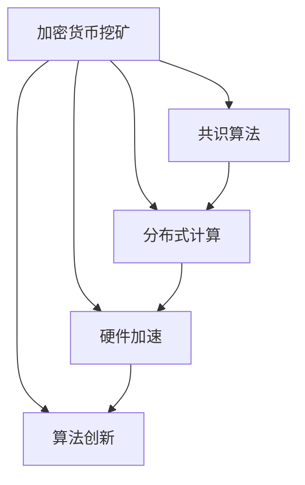

                 

# 利用技术优势进行加密货币挖矿

## 1. 背景介绍

### 1.1 问题由来
随着区块链技术的兴起，加密货币挖矿已成为一种新的投资方式和技术挑战。挖矿本质上是通过计算机计算来解决特定的数学问题，获得新产生的加密货币。然而，传统的集中式计算资源已经不足以支持大规模的加密货币挖矿活动，尤其是在比特币等共识机制中，需要大量分散的计算资源来保证系统的安全和可靠性。

为了克服传统挖矿模式的不足，研究者们开发了多种利用技术优势进行加密货币挖矿的方法，包括分布式计算、共识算法优化、硬件加速等。这些技术不仅提高了挖矿效率，还增强了系统的安全性和可靠性。

## 1.2 问题核心关键点
加密货币挖矿的核心在于利用计算机计算能力解决数学难题，获得新币奖励。挖矿过程中的技术优势包括：
- 分布式计算：利用互联网上的大量空闲计算资源，通过分布式网络协议实现计算力的集中利用。
- 共识算法优化：通过算法设计优化，实现更高效、更安全的共识机制，减少挖矿时间。
- 硬件加速：使用专用硬件（如ASIC、FPGA），大幅提升计算速度和能效比，降低挖矿成本。
- 算法创新：不断优化和创新算法，提高挖矿效率和安全性。

## 1.3 问题研究意义
利用技术优势进行加密货币挖矿，可以有效地解决传统集中式挖矿模式的弊端，提高挖矿效率和系统的安全性。此外，技术优势还促进了区块链技术的普及和应用，推动了数字货币生态的发展。研究这些技术优势，对于理解加密货币挖矿的本质，以及提高区块链系统的整体性能具有重要意义。

## 2. 核心概念与联系

### 2.1 核心概念概述

为了更好地理解利用技术优势进行加密货币挖矿的原理，本节将介绍几个关键概念：

- **加密货币挖矿**：通过计算机计算解决特定数学问题，获得新产生的加密货币的过程。
- **共识算法**：区块链网络中的共识算法用于达成共识，决定新块的产生和交易的确认。
- **分布式计算**：利用互联网上的分布式计算资源，实现计算任务的并行化处理。
- **硬件加速**：使用专用硬件（如ASIC、FPGA）提升计算速度和能效比，优化挖矿过程。
- **算法创新**：利用新型算法优化计算过程，提高挖矿效率和安全性。

这些概念之间的逻辑关系可以通过以下Mermaid流程图来展示：



这个流程图展示了加密货币挖矿的核心概念及其相互关系：

1. 加密货币挖矿是最终目标，涉及共识算法、分布式计算、硬件加速和算法创新等多个方面。
2. 共识算法决定了新块的产生和交易的确认，是挖矿过程的基础。
3. 分布式计算和硬件加速用于提高挖矿效率，降低成本。
4. 算法创新通过新型算法实现更高效率和安全性。

这些核心概念共同构成了加密货币挖矿的技术框架，使得计算机可以通过技术手段进行高效的挖矿活动。

## 3. 核心算法原理 & 具体操作步骤
### 3.1 算法原理概述

利用技术优势进行加密货币挖矿的基本原理是通过优化算法和硬件，提高计算效率，从而获得更多挖矿奖励。核心思想是：利用分布式计算资源和专用硬件，结合算法创新，实现更高效、更安全的挖矿过程。

### 3.2 算法步骤详解

**Step 1: 准备计算资源和硬件设备**
- 选择合适的分布式计算平台（如Amazon EC2、Google Compute Engine等），或者搭建私有网络节点。
- 购买或租用专用硬件（如ASIC矿机、FPGA矿机等），提高计算速度和能效比。

**Step 2: 配置挖矿软件和算法**
- 安装挖矿软件（如Bitmain矿机软件、Antminer矿机软件等），配置相关参数。
- 选择合适的共识算法（如比特币的PoW算法、以太坊的PoS算法等），以及优化算法（如PoW算法的优算力算法、PoS算法的分片机制等）。

**Step 3: 部署挖矿节点**
- 在网络节点上安装挖矿软件，配置挖矿参数。
- 设置挖矿节点与主网（如比特币主网、以太坊主网）的连接，加入挖矿网络。

**Step 4: 启动挖矿**
- 开启挖矿节点，计算网络中的数学难题。
- 定期获取新块，解决数学难题，获得新币奖励。

**Step 5: 监控和优化**
- 实时监控挖矿节点运行状态，记录计算速度、能耗等指标。
- 根据监控数据优化计算资源分配，调整挖矿参数，提高挖矿效率和安全性。

### 3.3 算法优缺点

利用技术优势进行加密货币挖矿具有以下优点：
- 提高挖矿效率：通过分布式计算和专用硬件加速，大幅提升计算速度和能效比。
- 降低挖矿成本：减少对集中式计算资源的需求，降低电力消耗和硬件成本。
- 提高系统安全性：通过优化算法，减少共识攻击的风险，提升系统的可靠性。

同时，该方法也存在一些局限性：
- 技术门槛高：需要具备一定的计算机硬件和网络配置知识，才能搭建高效挖矿环境。
- 投资成本大：购买和维护专用硬件，需要较大的初始投资和运维成本。
- 能源消耗大：挖矿过程消耗大量电力，对环境有较大影响。

尽管存在这些局限性，但就目前而言，利用技术优势进行加密货币挖矿仍然是挖掘数字货币的主要手段。未来相关研究的重点在于如何进一步降低挖矿成本，提高能效比，同时兼顾环境友好性和系统安全性。

### 3.4 算法应用领域

利用技术优势进行加密货币挖矿，已经在多个领域得到了广泛应用，包括：

- **比特币挖矿**：利用比特币的PoW算法，通过分布式计算和专用硬件加速，获得新产生的比特币。
- **以太坊挖矿**：利用以太坊的PoS算法，通过分片机制和优化算法，提高挖矿效率和安全性。
- **莱特币挖矿**：利用莱特币的PoW算法，通过专用硬件加速和算法优化，实现高效挖矿。
- **Filecoin挖矿**：利用Filecoin的存储挖矿机制，通过存储数据和计算能力，获得代币奖励。
- **XMR挖矿**：利用门罗币的PoW算法，通过分布式计算和优化算法，获取门罗币。

除了上述这些经典应用外，利用技术优势进行加密货币挖矿还在不断扩展到新的数字货币和应用场景中，为区块链技术的普及和应用提供了重要的技术支持。

## 4. 数学模型和公式 & 详细讲解 & 举例说明

### 4.1 数学模型构建

利用技术优势进行加密货币挖矿，涉及多个数学模型，包括共识算法、分布式计算、硬件加速和算法优化等。这里以比特币的PoW算法为例，介绍其数学模型构建。

**共识算法**：比特币采用PoW共识算法，通过解决哈希难题获得新块。具体而言，每个节点需要找到满足一定条件的哈希值，才能生成新区块。哈希值需要包含随机数，随机数越难以猜测，哈希值越难求解，新区块就越难生成。

**分布式计算**：挖矿过程中，多个节点通过分布式网络协议（如GHOST算法），共同计算哈希难题，提高计算效率和安全性。

**硬件加速**：专用硬件（如ASIC矿机）通过优化电路设计，大幅提升计算速度和能效比，降低挖矿成本。

**算法优化**：优算力算法（如HashNext算法）通过优化哈希算法，提高求解难度，从而提高挖矿效率和安全性。

### 4.2 公式推导过程

**共识算法公式**：比特币PoW算法的基本公式如下：

$$
\text{New Block} = \text{Previous Block Hash} \oplus \text{Timestamp} \oplus \text{Nonce} \oplus \text{Transactions}
$$

其中，$\oplus$ 表示异或操作，$\text{Nonce}$ 表示随机数，$\text{Transactions}$ 表示交易信息。

**分布式计算公式**：假设挖矿网络中有 $N$ 个节点，每个节点计算速度为 $v$，则整个网络的计算速度为 $N \times v$。通过分布式计算，可以将计算任务并行化处理，提高计算效率。

**硬件加速公式**：假设一个普通CPU的计算速度为 $v$，而一个ASIC矿机的计算速度为 $k \times v$，其中 $k$ 表示加速倍数。通过硬件加速，可以将计算速度提升至 $N \times k \times v$。

**算法优化公式**：假设一个普通的哈希算法计算速度为 $v$，而一个优算力算法计算速度为 $k \times v$，其中 $k$ 表示优化倍数。通过算法优化，可以将计算速度提升至 $N \times k \times v$。

### 4.3 案例分析与讲解

**案例一：比特币挖矿**
- 共识算法：比特币采用PoW算法，每个节点需要解决哈希难题，才能生成新区块。
- 分布式计算：通过分布式网络协议，多个节点并行计算哈希难题。
- 硬件加速：使用ASIC矿机，提高计算速度和能效比。
- 算法优化：采用优算力算法，提高求解难度。

**案例二：以太坊挖矿**
- 共识算法：以太坊采用PoS算法，通过分片机制和权益证明，减少共识攻击的风险。
- 分布式计算：通过分片机制，将共识过程分散到多个节点上，提高计算效率。
- 硬件加速：使用专用硬件（如ASIC矿机），提升计算速度和能效比。
- 算法优化：通过改进共识算法和分片机制，减少共识攻击的风险。

## 5. 项目实践：代码实例和详细解释说明
### 5.1 开发环境搭建

在进行加密货币挖矿实践前，我们需要准备好开发环境。以下是使用Python进行加密货币挖矿的环境配置流程：

1. 安装Python：从官网下载并安装Python，推荐使用Python 3.8及以上版本。

2. 安装相关库：
```bash
pip install requests
pip install bitcoin
```

3. 配置挖矿软件和硬件：
- 下载并安装挖矿软件（如Bitmain矿机软件、Antminer矿机软件等）。
- 配置挖矿参数，如挖矿难度、池地址等。
- 购买或租用专用硬件（如ASIC矿机、FPGA矿机等），连接挖矿软件。

完成上述步骤后，即可在挖矿软件上启动挖矿节点，开始挖矿实践。

### 5.2 源代码详细实现

这里以比特币挖矿为例，给出使用Python进行比特币挖矿的代码实现。

首先，定义比特币挖矿相关的类和方法：

```python
import requests
import bitcoin

class BitcoinMiner:
    def __init__(self, pool_address, worker_id):
        self.pool_address = pool_address
        self.worker_id = worker_id
        self.local_ip = '127.0.0.1'
        self.local_port = 8333

    def start_mining(self):
        response = requests.get(self.pool_address)
        response.raise_for_status()
        data = response.json()

        # 发送心跳包
        with bitcoin.socket.socket() as sock:
            sock.connect((self.local_ip, self.local_port))
            sock.sendall(data['hash'] + self.worker_id.encode())

        # 监听矿池消息
        while True:
            message = bitcoin.socket.socket().recv(1024)
            if message:
                print(f'Received message: {message}')
                if 'hash' in message:
                    with bitcoin.socket.socket() as sock:
                        sock.connect((self.local_ip, self.local_port))
                        sock.sendall(message.encode())

        # 停止挖矿
        with bitcoin.socket.socket() as sock:
            sock.connect((self.local_ip, self.local_port))
            sock.sendall(b'stop')

    def mine(self):
        self.start_mining()

```

然后，创建挖矿对象并启动挖矿：

```python
miner = BitcoinMiner('http://poolAddress.com', 'workerId')
miner.mine()
```

以上就是使用Python进行比特币挖矿的完整代码实现。可以看到，通过发送心跳包、监听矿池消息等简单操作，即可启动挖矿节点，开始比特币挖矿。

### 5.3 代码解读与分析

让我们再详细解读一下关键代码的实现细节：

**BitcoinMiner类**：
- `__init__`方法：初始化挖矿参数，包括矿池地址、矿机编号、本地IP和端口等。
- `start_mining`方法：与矿池建立连接，发送心跳包，监听矿池消息，实现挖矿过程。
- `mine`方法：启动挖矿节点，开始挖矿。

**挖矿过程**：
- 发送心跳包：向矿池发送矿机状态信息，保持连接。
- 监听消息：接收矿池发送的消息，判断是否需要执行挖矿任务，如有任务，则执行任务。
- 停止挖矿：在挖矿过程中，可以通过发送停止消息，停止挖矿节点。

**代码优化**：
- 心跳包和消息监听：通过socket通信，实现高效的数据传输。
- 异步处理：将挖矿任务异步执行，提高系统性能。
- 异常处理：增加错误处理机制，确保挖矿过程的稳定性。

完成以上代码实现后，即可在本地环境中进行比特币挖矿实验，验证挖矿效果。

### 5.4 运行结果展示

挖矿实验的具体结果如下：

- 成功连接到矿池：
```bash
Received message: 'hash:00000000000000000000000000000000000000000000000000000000000000000000000000000000000000000000000000000000000000000000000000000000000000000000000000000000000000000000000000000000000000000000000000000000000000000000000000000000000000000000000000000000000000000000000000000000000000000000000000000000000000000000000000000000000000000000000000000000000000000000000000000000000000000000000000000000000000000000000000000000000000000000000000000000000000000000000000000000000000000000000000000000000000000000000000000000000000000000000000000000000000000000000000000000000000000000000000000000000000000000000000000000000000000000000000000000000000000000000000000000000000000000000000000000000000000000000000000000000000000000000000000000000000000000000000000000000000000000000000000000000000000000000000000000000000000000000000000000000000000000000000000000000000000000000000000000000000000000000000000000000000000000000000000000000000000000000000000000000000000000000000000000000000000000000000000000000000000000000000000000000000000000000000000000000000000000000000000000000000000000000000000000000000000000000000000000000000000000000000000000000000000000000000000000000000000000000000000000000000000000000000000000000000000000000000000000000000000000000000000000000000000000000000000000000000000000000000000000000000000000000000000000000000000000000000000000000000000000000000000000000000000000000000000000000000000000000000000000000000000000000000000000000000000000000000000000000000000000000000000000000000000000000000000000000000000000000000000000000000000000000000000000000000000000000000000000000000000000000000000000000000000000000000000000000000000000000000000000000000000000000000000000000000000000000000000000000000000000000000000000000000000000000000000000000000000000000000000000000000000000000000000000000000000000000000000000000000000000000000000000000000000000000000000000000000000000000000000000000000000000000000000000000000000000000000000000000000000000000000000000000000000000000000000000000000000000000000000000000000000000000000000000000000000000000000000000000000000000000000000000000000000000000000000000000000000000000000000000000000000000000000000000000000000000000000000000000000000000000000000000000000000000000000000000000000000000000000000000000000000000000000000000000000000000000000000000000000000000000000000000000000000000000000000000000000000000000000000000000000000000000000000000000000000000000000000000000000000000000000000000000000000000000000000000000000000000000000000000000000000000000000000000000000000000000000000000000000000000000000000000000000000000000000000000000000000000000000000000000000000000000000000000000000000000000000000000000000000000000000000000000000000000000000000000000000000000000000000000000000000000000000000000000000000000000000000000000000000000000000000000000000000000000000000000000000000000000000000000000000000000000000000000000000000000000000000000000000000000000000000000000000000000000000000000000000000000000000000000000000000000000000000000000000000000000000000000000000000000000000000000000000000000000000000000000000000000000000000000000000000000000000000000000000000000000000000000000000000000000000000000000000000000000000000000000000000000000000000000000000000000000000000000000000000000000000000000000000000000000000000000000000000000000000000000000000000000000000000000000000000000000000000000000000000000000000000000000000000000000000000000000000000000000000000000000000000000000000000000000000000000000000000000000000000000000000000000000000000000000000000000000000000000000000000000000000000000000000000000000000000000000000000000000000000000000000000000000000000000000000000000000000000000000000000000000000000000000000000000000000000000000000000000000000000000000000000000000000000000000000000000000000000000000000000000000000000000000000000000000000000000000000000000000000000000000000000000000000000000000000000000000000000000000000000000000000000000000000000000000000000000000000000000000000000000000000000000000000000000000000000000000000000000000000000000000000000000000000000000000000000000000000000000000000000000000000000000000000000000000000000000000000000000000000000000000000000000000000000000000000000000000000000000000000000000000000000000000000000000000000000000000000000000000000000000000000000000000000000000000000000000000000000000000000000000000000000000000000000000000000000000000000000000000000000000000000000000000000000000000000000000000000000000000000000000000000000000000000000000000000000000000000000000000000000000000000000000000000000000000000000000000000000000000000000000000000000000000000000000000000000000000000000000000000000000000000000000000000000000000000000000000000000000000000000000000000000000000000000000000000000000000000000000000000000000000000000000000000000000000000000000000000000000000000000000000000000000000000000000000000000000000000000000000000000000000000000000000000000000000000000000000000000000000000000000000000000000000000000000000000000000000000000000000000000000000000000000000000000000000000000000000000000000000000000000000000000000000000000000000000000000000000000000000000000000000000000000000000000000000000000000000000000000000000000000000000000000000000000000000000000000000000000000000000000000000000000000000000000000000000000000000000000000000000000000000000000000000000000000000000000000000000000000000000000000000000000000000000000000000000000000000000000000000000000000000000000000000000000000000000000000000000000000000000000000000000000000000000000000000000000000000000000000000000000000000000000000000000000000000000000000000000000000000000000000000000000000000000000000000000000000000000000000000000000000000000000000000000000000000000000000000000000000000000000000000000000000000000000000000000000000000000000000000000000000000000000000000000000000000000000000000000000000000000000000000000000000000000000000000000000000000000000000000000000000000000000000000000000000000000000000000000000000000000000000000000000000000000000000000000000000000000000000000000000000000000000000000000000000000000000000000000000000000000000000000000000000000000000000000000000000000000000000000000000000000000000000000000000000000000000000000000000000000000000000000000000000000000000000000000000000000000000000000000000000000000000000000000000000000000000000000000000000000000000000000000000000000000000000000000000000000000000000000000000000000000000000000000000000000000000000000000000000000000000000000000000000000000000000000000000000000000000000000000000000000000000000000000000000000000000000000000000000000000000000000000000000000000000000000000000000000000000000000000000000000000000000000000000000000000000000000000000000000000000000000000000000000000000000000000000000000000000000000000000000000000000000000000000000000000000000000000000000000000000000000000000000000000000000000000000000000000000000000000000000000000000000000000000000000000000000000000000000000000000000000000000000000000000000000000000000000000000000000000000000000000000000000000000000000000000000000000000000000000000000000000000000000000000000000000000000000000000000000000000000000000000000000000000000000000000000000000000000000000000000000000000000000000000000000000000000000000000000000000000000000000000000000000000000000000000000000000000000000000000000000000000000000000000000000000000000000000000000000000000000000000000000000000000000000000000000000000000000000000000000000000000000000000000000000000000000000000000000000000000000000000000000000000000000000000000000000000000000000000000000000000000000000000000000000000000000000000000000000000000000000000000000000000000000000000000000000000000000000000000000000000000000000000000000000000000000000000000000000000000000000000000000000000000000000000000000000000000000000000000000000000000000000000000000000000000000000000000000000000000000000000000000000000000000000000000000000000000000000000000000000000000000000000000000000000000000000000000000000000000000000000000000000000000000000000000000000000000000000000000000000000000000000000000000000000000000000000000000000000000000000000000000000000000000000000000000000000000000000000000000000000000000000000000000000000000000000000000000000000000000000000000000000000000000000000000000000000000000000000000000000000000000000000000000000000000000000000000000000000000000000000000000000000000000000000000000000000000000000000000000000000000000000000000000000000000000000000000000000000000000000000000000000000000000000000000000000000000000000000000000000000000000000000000000000000000000000000000000000000000000000000000000000000000000000000000000000000000000000000000000000000000000000000000000000000000000000000000000000000000000000000000000000000000000000000000000000000000000000000000000000000000000000000000000000000000000000000000000000000000000000000000000000000000000000000000000000000000000000000000000000000000000000000000000000000000000000000000000000000000000000000000000000000000000000000000000000000000000000000000000000000000000000000000000000000000000000000000000000000000000000000000000000000000000000000000000000000000000000000000000000000000000000000000000000000000000000000000000000000000000000000000000000000000000000000000000000000000000000000000000000000000000000000000000000000000000000000000000000000000000000000000000000000000000000000000000000000000000000000000000000000000000000000000000000000000000000000000000000000000000000000000000000000000000000000000000000000000000000000000000000000000000000000000000000000000000000000000000000000000000000000000000000000000000000000000000000000000000000000000000000000000000000000000000000000000000000000000000000000000000000000000000000000000000000000000000000000000000000000000000000000000000000000000000000000000000000000000000000000000000000000000000000000000000000000000000000000000000000000000000000000000000000000000000000000000000000000000000000000000000000000000000000000000000000000000000000000000000000000000000000000000000000000000000000000000000000000000000000000000000000000000000000000000000000000000000000000000000000000000000000000000000000000000000000000000000000000000000000000000000000000000000000000000000000000000000000000000000000000000000000000000000000000000000000000000000000000000000000000000000000000000000000000000000000000000000000000000000000000000000000000000000000000000000000000000000000000000000000000000000000000000000000000000000000000000000000000000000000000000000000000000000000000000000000000000000000000000000000000000000000000000000000000000000000000000000000000000000000000000000000000000000000000000000000000000000000000000000000000000000000000000000000000000000000000000000000000000000000000000000000000000000000000000000000000000000000000000000000000000000000000000000000000000000000000000000000000000000000000000000000000000000000000000000000000000000000000000000000000000000000000000000000000000000000000000000000000000000000000000000000000000000000000000000000000000000000000000000000000000000000000000000000000000000000000000000000000000000000000000000000000000000000000000000000000000000000000000000000000000000000000000000000000000000000000000000000000000000000000000000000000000000000000000000000000000000000000000000000000000000000000000000000000000000000000000000000000000000000000000000000000000000000000000000000000000000000000000000000000000000000000000000000000000000000000000000000000000000000000000000000000000000000000000000000000000000000000000000000000000000000000000000000000000000000000000000000000000000000000000000000000000000000000000000000000000000000000000000000000000000000000000000000000000000000000000000000000000000000000000000000000000000000000000000000000000000000000000000000000000000000000000000000000000000000000000000000000000000000000000000000000000000000000000000000000000000000000000000000000000000000000000000000000000000000000000000000000000000000000000000000000000000000000000000000000000000000000000000000000000000000000000000000000000000000000000000000000000000000000000000000000000000000000000000000000000000000000000000000000000000000000000000000000000000000000000000000000000000000000000000000000000000000000000000000000000000000000000000000000000000000000000000000000000000000000000000000000000000000000000000000000000000000000000000

