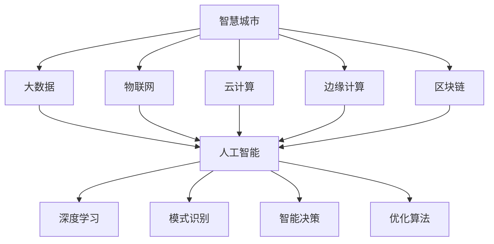

                 

# 利用技术优势进行智慧城市解决方案创新

## 1. 背景介绍

### 1.1 问题由来

智慧城市（Smart City）作为新一代城市发展形态，利用信息技术和物联网技术，优化城市资源配置，提高城市运行效率，改善居民生活水平。智慧城市建设涉及交通管理、公共安全、环保监测、医疗服务、教育文化等多个方面，数据复杂、场景丰富，单一技术手段难以应对。

近年来，人工智能（AI）和大数据技术的迅猛发展，为智慧城市提供了新的技术支撑。通过将AI和大数据技术与城市管理结合，可以实现智能化、精细化、个性化的城市治理，大幅提升城市治理能力和服务水平。

### 1.2 问题核心关键点

智慧城市建设的核心在于数据整合、深度分析、智能决策与持续优化。AI技术在智慧城市建设中扮演了关键角色：

1. **数据整合与清洗**：智慧城市涉及海量异构数据，包括传感器数据、视频监控数据、社交媒体数据等，AI技术可有效整合这些数据，统一数据格式和标准。
2. **深度学习与模式识别**：AI能够处理大规模数据，挖掘数据背后的关联性，发现潜在规律，支持城市管理决策。
3. **智能决策与优化**：AI技术通过预测分析和自适应算法，优化城市资源配置，提升城市运营效率。
4. **持续学习与进化**：AI具备自适应和持续学习能力，能够根据城市动态变化实时调整策略。

但AI在智慧城市中的应用也面临诸多挑战：数据安全、算法透明度、伦理问题等，需结合其他技术手段共同解决。

## 2. 核心概念与联系

### 2.1 核心概念概述

为更好地理解智慧城市中AI的应用，本节将介绍几个密切相关的核心概念：

- **智慧城市（Smart City）**：融合现代信息技术，实现城市全方位、全层次、全要素智能化的城市形态。
- **大数据（Big Data）**：指海量、高速、多样化的数据集合，智慧城市建设需依托大数据技术，实现数据的有效整合与分析。
- **人工智能（AI）**：通过模拟人类智能行为，实现自主学习、决策和优化，支持智慧城市的多领域应用。
- **物联网（IoT）**：连接所有可互联物体的网络，智慧城市需利用IoT技术实现设备互联、数据共享。
- **云计算（Cloud Computing）**：提供弹性计算资源，支持智慧城市的存储、计算和数据处理需求。
- **边缘计算（Edge Computing）**：将数据处理任务从云端下放到边缘设备，提升响应速度和效率。
- **区块链（Blockchain）**：提供去中心化的数据存储与传输机制，保障智慧城市数据的安全和透明。

这些核心概念之间的逻辑关系可以通过以下Mermaid流程图来展示：



这个流程图展示了智慧城市的关键技术组件及其之间的关系：

1. 智慧城市通过物联网、云计算、边缘计算、区块链等技术实现数据的采集、传输、存储和处理。
2. 大数据技术处理整合海量异构数据，为人工智能提供数据支持。
3. AI技术通过深度学习、模式识别、智能决策、优化算法等，实现对数据的深度分析和智能决策。

## 3. 核心算法原理 & 具体操作步骤

### 3.1 算法原理概述

智慧城市中的AI应用涉及多个领域，包括交通管理、公共安全、环保监测、医疗服务、教育文化等。AI技术通过以下三个主要算法进行数据处理和智能决策：

1. **深度学习（Deep Learning）**：利用多层神经网络结构，模拟人类智能学习过程，实现对数据的特征提取和分类识别。
2. **模式识别（Pattern Recognition）**：通过训练模型，自动识别数据中的模式和规律，辅助决策支持。
3. **优化算法（Optimization Algorithms）**：如遗传算法、粒子群算法等，优化资源配置，提升城市运行效率。

### 3.2 算法步骤详解

以智慧城市中的交通管理为例，演示AI的深度学习与模式识别应用：

**Step 1: 数据采集与预处理**
- 通过物联网设备采集交通流量、车辆位置、红绿灯状态等数据。
- 使用大数据技术进行数据清洗和整合，生成交通数据集。

**Step 2: 深度学习模型训练**
- 利用深度学习框架（如TensorFlow、PyTorch）构建交通流量预测模型。
- 在交通数据集上训练模型，调整网络结构和超参数，使模型精确预测交通流量变化。

**Step 3: 模式识别与智能决策**
- 对预测结果进行模式识别，如识别交通高峰期、拥堵区域等。
- 根据模式识别结果，智能调整红绿灯控制策略、优化交通路线。

**Step 4: 模型评估与优化**
- 在测试集上评估模型性能，调整网络结构和超参数，进一步优化模型。

**Step 5: 应用部署与监控**
- 将优化后的模型部署到智慧交通系统中，实时监测交通流量，进行智能决策。
- 定期回访模型性能，持续优化模型，适应交通环境变化。

### 3.3 算法优缺点

AI在智慧城市中的应用具有以下优点：

1. **高效处理海量数据**：AI可高效处理大规模异构数据，快速提取数据中的有用信息。
2. **智能决策与优化**：AI具备自主学习与决策能力，能够优化资源配置，提升城市运行效率。
3. **实时响应与动态调整**：AI可实时监测城市动态变化，动态调整决策策略。

但AI在智慧城市中也存在以下缺点：

1. **数据隐私和安全问题**：智慧城市数据涉及市民隐私，需要严格的数据保护措施。
2. **算法透明性与可解释性**：AI模型决策过程复杂，缺乏透明度，难以解释其内部工作机制。
3. **伦理与社会影响**：AI决策可能存在偏见，影响社会公平，需要考虑伦理问题。
4. **技术壁垒与实施成本**：AI技术实施需要高昂的成本和技术门槛，需多方协调配合。

### 3.4 算法应用领域

AI技术在智慧城市中的应用涉及多个领域，主要包括以下几个方面：

1. **智慧交通**：通过交通流量预测、车辆识别、智能导航等，实现交通智能化管理。
2. **公共安全**：利用视频监控、人脸识别、行为分析等技术，提升城市安全水平。
3. **环保监测**：通过环境数据监测、污染源追踪等，实现环境质量实时评估与预警。
4. **医疗服务**：利用图像识别、语音识别等技术，优化医疗资源配置，提升医疗服务质量。
5. **教育文化**：通过学生行为分析、文化资源推荐等，实现教育文化服务智能化。

## 4. 数学模型和公式 & 详细讲解 & 举例说明

### 4.1 数学模型构建

以智慧交通中的交通流量预测为例，构建数学模型。

设交通数据集为 $D=\{(x_i,y_i)\}_{i=1}^N$，其中 $x_i$ 为输入数据（如时间、天气等）， $y_i$ 为输出数据（交通流量）。假设模型的预测结果为 $\hat{y}$，则模型的预测误差可以表示为：

$$
\epsilon_i = y_i - \hat{y}
$$

模型的目标是最小化预测误差的平方和：

$$
\mathcal{L} = \frac{1}{N} \sum_{i=1}^N \epsilon_i^2
$$

使用深度学习模型 $M_{\theta}$ 进行预测，其中 $\theta$ 为模型参数，则模型的输出为：

$$
\hat{y} = M_{\theta}(x_i)
$$

### 4.2 公式推导过程

深度学习模型的目标是最小化损失函数 $\mathcal{L}$，根据梯度下降优化算法，模型的参数更新公式为：

$$
\theta \leftarrow \theta - \eta \nabla_{\theta}\mathcal{L}
$$

其中 $\eta$ 为学习率， $\nabla_{\theta}\mathcal{L}$ 为损失函数对模型参数的梯度，可通过反向传播算法计算。

### 4.3 案例分析与讲解

以智慧城市中的交通流量预测为例，详细讲解深度学习模型的构建与优化过程：

1. **模型选择**：选择适合的深度学习模型结构，如LSTM、CNN等。
2. **特征工程**：对输入数据进行特征提取和预处理，如时间归一化、缺失值处理等。
3. **模型训练**：使用训练集数据 $D_{train}$ 对模型进行训练，调整网络结构和超参数。
4. **模型评估**：在测试集 $D_{test}$ 上评估模型性能，使用均方误差（MSE）或平均绝对误差（MAE）等指标。
5. **模型优化**：根据评估结果，调整网络结构和超参数，进一步优化模型性能。

## 5. 项目实践：代码实例和详细解释说明

### 5.1 开发环境搭建

在进行智慧城市AI应用开发前，需要准备好开发环境。以下是使用Python进行TensorFlow开发的工具环境配置流程：

1. 安装Anaconda：从官网下载并安装Anaconda，用于创建独立的Python环境。

2. 创建并激活虚拟环境：
```bash
conda create -n tf-env python=3.7
conda activate tf-env
```

3. 安装TensorFlow：从官网获取对应的安装命令。例如：
```bash
conda install tensorflow==2.3
```

4. 安装其他必要库：
```bash
pip install numpy scipy pandas scikit-learn
```

完成上述步骤后，即可在`tf-env`环境中开始智慧城市AI应用开发。

### 5.2 源代码详细实现

以下是使用TensorFlow进行智慧城市交通流量预测的Python代码实现：

```python
import tensorflow as tf
import numpy as np
from tensorflow.keras.layers import Dense, LSTM
from tensorflow.keras.models import Sequential
from sklearn.model_selection import train_test_split
from sklearn.preprocessing import MinMaxScaler

# 准备数据
data = pd.read_csv('traffic_data.csv')
X = data.drop('traffic', axis=1)
y = data['traffic']

# 数据预处理
scaler = MinMaxScaler(feature_range=(0, 1))
X_scaled = scaler.fit_transform(X)
y_scaled = scaler.fit_transform(y.reshape(-1, 1))

# 构建模型
model = Sequential()
model.add(LSTM(64, return_sequences=True, input_shape=(X_scaled.shape[1], 1)))
model.add(LSTM(64))
model.add(Dense(1))
model.compile(optimizer='adam', loss='mse')

# 数据分割
X_train, X_test, y_train, y_test = train_test_split(X_scaled, y_scaled, test_size=0.2, random_state=42)

# 模型训练
model.fit(X_train, y_train, epochs=100, batch_size=32, validation_data=(X_test, y_test))

# 模型评估
y_pred = model.predict(X_test)
mse = np.mean((y_test - y_pred) ** 2)
print('MSE:', mse)
```

以上代码实现了智慧城市中的交通流量预测功能，具体步骤如下：

1. 准备数据：从CSV文件中读取交通数据，分为输入数据（X）和输出数据（y）。
2. 数据预处理：对数据进行归一化处理，将输入数据和输出数据缩放到0-1范围内。
3. 构建模型：使用LSTM层构建深度学习模型，进行特征提取和预测。
4. 数据分割：将数据分为训练集和测试集。
5. 模型训练：在训练集上训练模型，使用均方误差（MSE）损失函数，Adam优化器进行参数优化。
6. 模型评估：在测试集上评估模型性能，输出均方误差。

### 5.3 代码解读与分析

让我们再详细解读一下关键代码的实现细节：

1. **数据预处理**：使用MinMaxScaler进行数据归一化处理，将数据缩放到0-1范围内，便于模型训练。
2. **模型构建**：使用LSTM层构建深度学习模型，LSTM层具有时序处理能力，适合处理时间序列数据。
3. **模型训练**：使用训练集数据进行模型训练，Adam优化器可以自动调整学习率，加快收敛速度。
4. **模型评估**：在测试集上评估模型性能，输出均方误差，用于衡量预测结果的准确性。

## 6. 实际应用场景

### 6.1 智能交通管理

智能交通管理是智慧城市的重要组成部分，通过AI技术实现交通流量预测、车辆识别、智能导航等功能，可以大幅提升交通管理效率。

1. **交通流量预测**：利用深度学习模型，实时预测交通流量变化，动态调整交通信号灯控制策略，缓解交通拥堵。
2. **车辆识别**：通过人脸识别、车牌识别等技术，实现车辆识别和追踪，提升交通监控能力。
3. **智能导航**：利用路径规划算法，结合实时交通数据，提供个性化导航建议，减少交通拥堵。

### 6.2 公共安全监控

公共安全监控是智慧城市的另一个重要领域，通过AI技术实现视频监控、行为分析、异常检测等功能，提高城市安全水平。

1. **视频监控**：利用深度学习模型，实时分析视频监控数据，识别异常行为和事件。
2. **行为分析**：通过行为识别算法，分析人员活动轨迹，提升安全防范能力。
3. **异常检测**：利用模式识别技术，检测异常行为和事件，快速响应潜在威胁。

### 6.3 环保监测与治理

环保监测与治理是智慧城市建设的重要内容，通过AI技术实现环境数据监测、污染源追踪、环境预警等功能，保护城市环境。

1. **环境数据监测**：利用传感器和IoT设备，实时采集环境数据，包括空气质量、水质等。
2. **污染源追踪**：通过数据分析和模式识别，追踪污染源，优化环境治理策略。
3. **环境预警**：利用预测模型，实时预警环境污染事件，提前采取防范措施。

### 6.4 未来应用展望

未来，智慧城市AI技术的应用将更加广泛和深入，呈现以下几个发展趋势：

1. **多模态融合**：融合视频、声音、图像等多种数据源，实现多模态智能决策。
2. **边缘计算**：将数据处理任务下放到边缘设备，提升数据处理速度和响应时间。
3. **区块链**：利用区块链技术，保障城市数据的安全和透明，防止数据篡改和滥用。
4. **人机协同**：通过增强现实（AR）、虚拟现实（VR）等技术，实现人机协同决策和互动。
5. **普惠智能**：将AI技术应用到更多领域，实现城市治理和服务的普惠化。

## 7. 工具和资源推荐

### 7.1 学习资源推荐

为了帮助开发者系统掌握智慧城市中AI的应用，这里推荐一些优质的学习资源：

1. **智慧城市AI技术课程**：各大在线平台如Coursera、edX等，提供智慧城市AI技术的系统课程，涵盖智慧交通、公共安全、环保监测等多个领域。
2. **TensorFlow官方文档**：TensorFlow官方提供的详细文档，包括深度学习模型构建、优化算法、数据处理等方面的详细介绍。
3. **深度学习框架比较**：深入比较TensorFlow、PyTorch、Keras等主流深度学习框架的特点和适用场景，帮助选择适合的技术栈。
4. **智慧城市AI应用案例**：各大智慧城市项目公开的案例和实践经验，提供丰富的学习参考。

### 7.2 开发工具推荐

高效的开发离不开优秀的工具支持。以下是几款用于智慧城市AI开发常用的工具：

1. **TensorFlow**：开源深度学习框架，支持分布式计算和模型部署，是智慧城市AI开发的主流选择。
2. **PyTorch**：开源深度学习框架，灵活易用，适合快速原型开发和研究。
3. **Keras**：高层次API，易于上手，支持多种深度学习模型和优化算法。
4. **Jupyter Notebook**：交互式开发环境，方便调试和演示代码。
5. **OpenCV**：开源计算机视觉库，支持图像处理和视频分析，适用于视频监控和行为分析。

### 7.3 相关论文推荐

智慧城市AI技术的发展源于学界的持续研究。以下是几篇奠基性的相关论文，推荐阅读：

1. **《智慧城市中深度学习的应用研究》**：探讨深度学习在智慧城市交通、公共安全、环保监测等领域的应用，提出多种深度学习模型和算法。
2. **《基于智慧城市的智能交通系统》**：介绍智慧交通系统的构建和应用，强调AI技术在交通流量预测、车辆识别、智能导航等方面的重要作用。
3. **《智慧城市中的大数据与人工智能》**：分析智慧城市中大数据和AI技术的结合，探讨其应用场景和挑战。

## 8. 总结：未来发展趋势与挑战

### 8.1 研究成果总结

本文对智慧城市中的AI应用进行了全面系统的介绍。首先阐述了智慧城市建设的重要性，明确了AI技术在智慧城市中的关键作用。其次，从原理到实践，详细讲解了深度学习、模式识别、优化算法等核心技术在智慧城市中的应用，给出了具体代码实现。同时，本文还探讨了AI技术在智慧城市建设中的未来发展方向和面临的挑战。

通过本文的系统梳理，可以看到，AI技术在智慧城市中的应用前景广阔，具有高效处理数据、智能决策、实时响应等优势。但AI技术的应用也面临数据隐私、算法透明、伦理问题等挑战，需要结合其他技术手段共同解决。未来，伴随AI技术的发展和智慧城市建设的深入，相信AI将更好地服务于城市治理和人民生活。

### 8.2 未来发展趋势

展望未来，智慧城市AI技术将呈现以下几个发展趋势：

1. **多模态融合**：融合视频、声音、图像等多种数据源，实现多模态智能决策。
2. **边缘计算**：将数据处理任务下放到边缘设备，提升数据处理速度和响应时间。
3. **区块链**：利用区块链技术，保障城市数据的安全和透明，防止数据篡改和滥用。
4. **人机协同**：通过增强现实（AR）、虚拟现实（VR）等技术，实现人机协同决策和互动。
5. **普惠智能**：将AI技术应用到更多领域，实现城市治理和服务的普惠化。

### 8.3 面临的挑战

尽管智慧城市AI技术已经取得了瞩目成就，但在迈向更加智能化、普适化应用的过程中，仍面临诸多挑战：

1. **数据隐私和安全问题**：智慧城市数据涉及市民隐私，需要严格的数据保护措施。
2. **算法透明性与可解释性**：AI模型决策过程复杂，缺乏透明度，难以解释其内部工作机制。
3. **伦理与社会影响**：AI决策可能存在偏见，影响社会公平，需要考虑伦理问题。
4. **技术壁垒与实施成本**：AI技术实施需要高昂的成本和技术门槛，需多方协调配合。

### 8.4 研究展望

面对智慧城市AI技术面临的种种挑战，未来的研究需要在以下几个方面寻求新的突破：

1. **数据隐私保护**：采用隐私保护技术，如差分隐私、联邦学习等，保障数据隐私和安全。
2. **算法透明与可解释性**：开发可解释性AI模型，提高算法的透明性和可解释性，确保决策过程可信。
3. **伦理与社会影响**：引入伦理导向的评估指标，过滤和惩罚有偏见、有害的输出倾向，确保AI决策符合伦理标准。
4. **技术融合与应用优化**：结合其他技术手段，如区块链、物联网等，优化AI技术的实施和应用效果。

## 9. 附录：常见问题与解答

**Q1：AI技术在智慧城市中的应用前景如何？**

A: AI技术在智慧城市中的应用前景广阔，具有高效处理数据、智能决策、实时响应等优势。未来，通过多模态融合、边缘计算、区块链等技术的应用，AI技术将更好地服务于城市治理和人民生活。

**Q2：AI技术在智慧城市中面临哪些挑战？**

A: AI技术在智慧城市中的应用面临数据隐私、算法透明、伦理问题等挑战。未来，需要结合其他技术手段，如隐私保护、可解释性AI等，共同解决这些问题。

**Q3：如何提高AI模型的可解释性？**

A: 开发可解释性AI模型，如使用可视化工具展示模型决策过程，提高算法的透明性和可解释性，确保决策过程可信。

**Q4：如何在智慧城市中实现数据隐私保护？**

A: 采用隐私保护技术，如差分隐私、联邦学习等，保障数据隐私和安全，防止数据泄露和滥用。

**Q5：AI技术在智慧城市中的应用成本如何控制？**

A: 通过多层次的数据处理和优化算法，减少数据处理和模型训练的资源消耗，降低实施成本。同时，引入开源技术和开源社区，共享研究成果和资源，共同推动智慧城市AI技术的普及和应用。

---

作者：禅与计算机程序设计艺术 / Zen and the Art of Computer Programming

