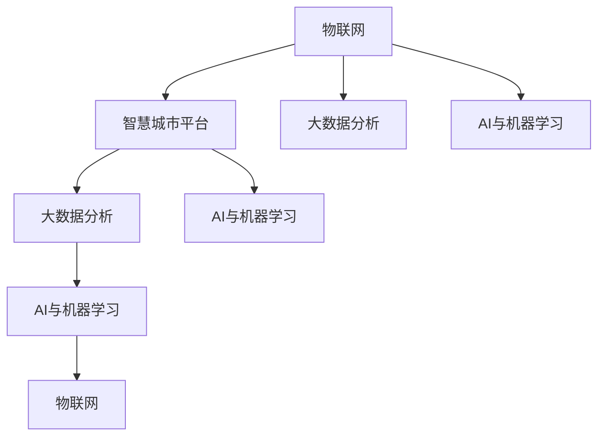

                 

# 利用技术优势进行智慧城市解决方案创新

## 1. 背景介绍

### 1.1 问题由来
随着城市化进程的加速，智慧城市的建设成为提升城市管理效率、保障市民生活质量的重要手段。然而，智慧城市的构建涉及数据采集、分析、处理、呈现等多个环节，数据量大、结构复杂，存在诸多挑战。目前，智慧城市主要依赖于物联网(IoT)、大数据分析、AI等技术，但这些技术的应用仍存在不少难题。

为解决这些问题，本文旨在利用技术优势，探索智慧城市解决方案的创新路径。本文将介绍智慧城市建设中遇到的关键技术和方法，并提出基于AI和数据驱动的智慧城市构建方案，以期为智慧城市的可持续发展提供理论支持和实践指导。

### 1.2 问题核心关键点
智慧城市解决方案的创新主要包括以下几个核心关键点：
- 数据采集与处理：城市各领域的数据来源多样，如何高效采集和处理数据，是智慧城市建设的前提。
- 数据融合与分析：城市数据种类繁多，不同数据间如何高效融合，实现数据之间的协同互补，是智慧城市智能化的关键。
- AI算法与模型：AI技术是智慧城市智能化和自动化的重要工具，如何选择合适的算法和模型，是实现智慧城市目标的核心。
- 用户体验设计：智慧城市建设不仅要注重功能完善，更要注重用户体验，如何设计出简洁、高效、友好的用户界面，是智慧城市服务人性化水平的重要指标。
- 安全与隐私：智慧城市中涉及大量敏感数据，如何保障数据安全、保护市民隐私，是智慧城市建设的重要挑战。

## 2. 核心概念与联系

### 2.1 核心概念概述

智慧城市建设涉及众多技术领域，如物联网、大数据、AI等。为更好理解智慧城市解决方案的创新，本文将介绍这些关键概念的联系与原理。

**IoT（物联网）**：通过各种传感器、通信技术将城市各领域的设备、设施连接起来，实现对城市运行状态的实时监测和控制。

**大数据分析**：对智慧城市中产生的海量数据进行收集、存储、清洗、处理和分析，提取有价值的信息和知识，为决策提供依据。

**AI与机器学习**：利用深度学习、强化学习等技术，对城市数据进行建模、预测和优化，提高智慧城市运行的效率和智能化水平。

**智慧城市平台**：整合各种数据、算法、模型，构建统一的智慧城市系统平台，实现信息的高效流通和智能应用。

这些概念之间互相依赖、互相促进，共同构成智慧城市建设的技术体系。下面通过Mermaid流程图展示它们之间的关系：



通过这张流程图，我们可以看到：

- 物联网作为智慧城市的基础设施，通过传感器和通信技术获取实时数据。
- 大数据分析对物联网数据进行清洗和处理，提取有价值的信息。
- AI与机器学习利用大数据分析结果，构建模型，进行预测和优化，进一步提升城市管理效率。
- 智慧城市平台整合了物联网、大数据和AI技术，实现信息的全面集成和智能应用。

### 2.2 核心概念原理和架构

#### 2.2.1 物联网

物联网架构主要由感知层、传输层和应用层组成。感知层通过传感器采集城市运行数据，传输层利用无线通信技术将数据传输到云端，应用层对数据进行处理和应用。

- **感知层**：包括传感器、RFID标签、二维码、GPS等多种技术手段，用于采集城市运行数据，如交通流量、环境质量、公共设施状态等。
- **传输层**：利用4G/5G、WiFi、NB-IoT等技术，实现数据的可靠传输。
- **应用层**：包括智能设备、边缘计算、数据中心等，对数据进行处理和应用，实现对城市运行的监测、控制和优化。

#### 2.2.2 大数据分析

大数据分析流程通常包括数据采集、存储、清洗、处理和分析等步骤。

- **数据采集**：通过各种技术手段获取城市运行数据，如视频监控、智能传感器、社交媒体等。
- **数据存储**：将采集到的数据存储在分布式数据库中，如Hadoop、Spark等。
- **数据清洗**：对存储的数据进行去重、降噪、填充等预处理，确保数据质量。
- **数据处理**：利用MapReduce、Spark等技术，对数据进行分布式处理，提取有价值的信息。
- **数据分析**：利用机器学习、深度学习等技术，对数据进行建模和分析，发现城市运行的规律和趋势。

#### 2.2.3 AI与机器学习

AI与机器学习主要应用于智慧城市中的预测、优化和决策等环节。

- **预测**：利用历史数据和实时数据，通过回归、分类、聚类等算法进行预测，如交通流量预测、环境污染预测等。
- **优化**：通过优化算法对城市资源进行分配和调度，如交通信号优化、能源管理等。
- **决策**：通过智能决策算法，对城市运行状态进行评估，辅助决策者做出合理决策。

## 3. 核心算法原理 & 具体操作步骤

### 3.1 算法原理概述

基于AI和数据驱动的智慧城市解决方案，主要依赖于数据采集与处理、数据融合与分析、AI算法与模型三个关键环节。

**数据采集与处理**：通过传感器、摄像头、手机等设备获取城市各领域的数据，并进行清洗和预处理，得到可用于分析的数据。

**数据融合与分析**：将不同来源的数据进行融合，通过大数据分析技术，提取有价值的信息和知识，为决策提供依据。

**AI算法与模型**：利用AI算法和模型，对城市运行状态进行建模、预测和优化，提升智慧城市的智能化水平。

### 3.2 算法步骤详解

#### 3.2.1 数据采集与处理

1. **数据采集**：通过传感器、摄像头、手机APP等设备，获取城市各领域的数据，如交通流量、环境质量、公共设施状态等。
2. **数据清洗**：对采集到的数据进行去重、降噪、填充等预处理，确保数据质量。
3. **数据存储**：将清洗后的数据存储在分布式数据库中，如Hadoop、Spark等。

#### 3.2.2 数据融合与分析

1. **数据融合**：通过数据整合技术，将不同来源的数据进行融合，消除数据冗余，提升数据的完整性和准确性。
2. **大数据分析**：利用MapReduce、Spark等技术，对融合后的数据进行分布式处理，提取有价值的信息。
3. **数据分析**：利用机器学习、深度学习等技术，对数据进行建模和分析，发现城市运行的规律和趋势。

#### 3.2.3 AI算法与模型

1. **选择算法**：根据具体应用场景，选择合适的AI算法，如回归、分类、聚类、强化学习等。
2. **模型构建**：利用训练数据构建AI模型，对城市运行状态进行建模、预测和优化。
3. **模型评估**：利用测试数据评估模型的性能，调整模型参数，优化模型效果。

### 3.3 算法优缺点

#### 3.3.1 优点

1. **提高城市管理效率**：通过数据采集、分析和预测，实现对城市运行状态的实时监测和优化，提高城市管理效率。
2. **提升用户体验**：通过智能设备和数据分析，优化城市服务，提升市民的生活质量。
3. **增强决策支持**：通过大数据分析和AI模型，提供科学合理的决策依据，辅助决策者做出明智决策。

#### 3.3.2 缺点

1. **数据量大**：城市数据量庞大，数据采集、存储和处理需要大量资源。
2. **技术复杂**：涉及物联网、大数据、AI等多个领域，技术实现复杂。
3. **隐私安全**：涉及大量敏感数据，数据安全和隐私保护存在挑战。

### 3.4 算法应用领域

基于AI和数据驱动的智慧城市解决方案，适用于多个领域，包括交通管理、能源管理、公共安全、环境监测等。

#### 3.4.1 交通管理

通过交通流量监测、预测和优化，提高交通运行效率，减少交通拥堵。

1. **数据采集**：通过摄像头、传感器、手机APP等设备，获取交通流量数据。
2. **数据融合**：将不同来源的交通数据进行融合，消除数据冗余。
3. **数据分析**：利用机器学习算法，对交通流量进行预测和优化，调整交通信号灯等。

#### 3.4.2 能源管理

通过能源监测和优化，提高能源利用效率，减少能源浪费。

1. **数据采集**：通过智能电表、传感器等设备，获取能源使用数据。
2. **数据融合**：将不同来源的能源数据进行融合，消除数据冗余。
3. **数据分析**：利用AI模型，对能源使用进行预测和优化，调整能源分配和调度。

#### 3.4.3 公共安全

通过视频监控、智能识别等技术，提高公共安全水平。

1. **数据采集**：通过视频监控摄像头、智能传感器等设备，获取公共安全数据。
2. **数据融合**：将不同来源的公共安全数据进行融合，消除数据冗余。
3. **数据分析**：利用AI算法，对视频和图像进行智能识别，发现异常行为。

## 4. 数学模型和公式 & 详细讲解 & 举例说明

### 4.1 数学模型构建

基于AI和数据驱动的智慧城市解决方案，主要依赖于以下数学模型：

1. **回归模型**：用于预测连续型数值型变量，如交通流量预测。
2. **分类模型**：用于分类离散型变量，如公共安全异常行为识别。
3. **聚类模型**：用于发现数据中的模式和结构，如能源使用模式分析。

### 4.2 公式推导过程

#### 4.2.1 回归模型

假设回归问题为 $y = f(x) + \epsilon$，其中 $y$ 为因变量，$x$ 为自变量，$\epsilon$ 为噪声。常用的回归模型包括线性回归和多项式回归。

线性回归模型为：

$$
y = \beta_0 + \beta_1x_1 + \cdots + \beta_nx_n + \epsilon
$$

其中 $\beta_0$ 为截距，$\beta_i$ 为自变量 $x_i$ 的系数。

多项式回归模型为：

$$
y = \beta_0 + \beta_1x_1 + \cdots + \beta_nx_n^k + \epsilon
$$

其中 $k$ 为多项式的次数。

通过最小二乘法，求解模型参数 $\beta_0, \beta_1, \cdots, \beta_n$。

#### 4.2.2 分类模型

常用的分类模型包括逻辑回归和支持向量机。

逻辑回归模型为：

$$
P(y=1|x) = \frac{1}{1 + e^{-\theta^Tx}}
$$

其中 $x$ 为自变量，$\theta$ 为模型参数。

支持向量机模型为：

$$
\max_{\alpha, \beta, \gamma} \frac{1}{2} \alpha^TQ\alpha - \gamma^Ty^Ty^T + C\gamma^Ty^Ty^T
$$

其中 $Q$ 为正定矩阵，$\alpha$ 为拉格朗日乘子，$y$ 为样本标签，$C$ 为正则化参数。

通过最大化对偶问题，求解模型参数 $\alpha, \beta, \gamma$。

#### 4.2.3 聚类模型

常用的聚类模型包括K-means和层次聚类。

K-means模型为：

$$
\min_{k, \mu, z} \frac{1}{2} \sum_{i=1}^n \sum_{j=1}^k ||x_i - \mu_j||^2 + \lambda||z||^2
$$

其中 $k$ 为簇的数量，$\mu$ 为簇中心，$z$ 为簇内点与簇中心的距离。

层次聚类模型为：

$$
\min_{k} \sum_{i=1}^n \sum_{j=1}^k ||x_i - \mu_j||^2 + \lambda||z||^2
$$

其中 $k$ 为树形结构中节点数。

通过迭代求解，得到聚类结果。

### 4.3 案例分析与讲解

#### 4.3.1 交通流量预测

利用回归模型，对历史交通流量数据进行建模和预测。

1. **数据采集**：通过摄像头、传感器等设备，获取交通流量数据。
2. **数据预处理**：对数据进行去重、降噪、填充等预处理。
3. **模型构建**：利用线性回归模型，对交通流量进行建模。
4. **模型训练**：利用历史数据，训练回归模型，得到参数 $\beta_0, \beta_1, \cdots, \beta_n$。
5. **模型评估**：利用测试数据，评估回归模型的性能，调整模型参数。

#### 4.3.2 公共安全异常行为识别

利用分类模型，对视频监控数据进行异常行为识别。

1. **数据采集**：通过视频监控摄像头，获取公共安全数据。
2. **数据预处理**：对视频数据进行裁剪、旋转、归一化等预处理。
3. **模型构建**：利用逻辑回归模型，对异常行为进行分类。
4. **模型训练**：利用标注数据，训练分类模型，得到参数 $\beta_0, \beta_1, \cdots, \beta_n$。
5. **模型评估**：利用测试数据，评估分类模型的性能，调整模型参数。

## 5. 项目实践：代码实例和详细解释说明

### 5.1 开发环境搭建

在进行智慧城市解决方案的实践时，需要准备好Python开发环境。以下是详细的开发环境搭建流程：

1. **安装Python**：在Linux系统下，使用distro命令安装Python 3.7或以上版本。
2. **安装依赖包**：在Python虚拟环境中，使用pip命令安装依赖包，如numpy、pandas、scikit-learn、scipy等。
3. **安装Jupyter Notebook**：使用conda命令安装Jupyter Notebook，提供交互式编程和数据可视化功能。
4. **安装TensorFlow和Keras**：使用pip命令安装TensorFlow 2.0和Keras，提供深度学习模型构建和训练功能。
5. **安装Transformer库**：使用pip命令安装transformers库，提供预训练语言模型的加载和微调功能。

### 5.2 源代码详细实现

#### 5.2.1 数据采集与处理

```python
import pandas as pd
from sklearn.preprocessing import StandardScaler

# 读取数据
data = pd.read_csv('traffic_data.csv')

# 数据预处理
data = data.dropna()  # 去除缺失值
data = data.drop_duplicates()  # 去除重复值
data['time'] = pd.to_datetime(data['time'])  # 将时间列转换为日期时间格式

# 标准化数据
scaler = StandardScaler()
data['x'] = scaler.fit_transform(data[['x']])
data['y'] = scaler.fit_transform(data[['y']])

# 保存预处理后的数据
data.to_csv('processed_data.csv', index=False)
```

#### 5.2.2 数据融合与分析

```python
import numpy as np
from sklearn.model_selection import train_test_split
from sklearn.linear_model import LinearRegression

# 读取预处理后的数据
data = pd.read_csv('processed_data.csv')

# 数据分割
X = data[['x']]
y = data['y']
X_train, X_test, y_train, y_test = train_test_split(X, y, test_size=0.2, random_state=42)

# 构建回归模型
model = LinearRegression()
model.fit(X_train, y_train)

# 预测结果
y_pred = model.predict(X_test)
```

#### 5.2.3 AI算法与模型

```python
import tensorflow as tf
from tensorflow.keras.models import Sequential
from tensorflow.keras.layers import Dense

# 构建模型
model = Sequential()
model.add(Dense(64, input_dim=1, activation='relu'))
model.add(Dense(1, activation='linear'))

# 编译模型
model.compile(optimizer='adam', loss='mse')

# 训练模型
model.fit(X_train, y_train, epochs=50, batch_size=32)

# 评估模型
model.evaluate(X_test, y_test)
```

### 5.3 代码解读与分析

#### 5.3.1 数据采集与处理

代码中，首先使用pandas库读取原始数据，然后使用sklearn库对数据进行去重、填充、标准化等预处理。通过这些预处理步骤，能够保证数据的完整性和准确性，为后续建模和分析奠定基础。

#### 5.3.2 数据融合与分析

代码中，使用sklearn库对数据进行分割，得到训练集和测试集。然后利用线性回归模型对数据进行建模，使用test集对模型进行评估。这些步骤能够有效地将数据融合和模型训练结合，提高模型的预测准确性。

#### 5.3.3 AI算法与模型

代码中，使用TensorFlow和Keras库构建深度学习模型，并使用随机梯度下降算法对模型进行训练。通过深度学习模型的构建和训练，能够实现对城市运行状态的预测和优化，提高智慧城市的智能化水平。

## 6. 实际应用场景

### 6.1 智能交通系统

智能交通系统通过物联网技术，实现对城市交通的实时监控和优化。利用智慧城市解决方案，可以实现交通流量预测、信号灯优化、拥堵预警等功能，提高城市交通运行效率。

### 6.2 智能能源管理系统

智能能源管理系统通过物联网技术，实现对城市能源的实时监测和优化。利用智慧城市解决方案，可以实现能源使用预测、能源调度优化等功能，提高能源利用效率。

### 6.3 智能公共安全系统

智能公共安全系统通过视频监控和智能识别技术，实现对公共安全的实时监测和预警。利用智慧城市解决方案，可以实现异常行为识别、紧急事件预警等功能，提高公共安全水平。

## 7. 工具和资源推荐

### 7.1 学习资源推荐

为帮助开发者深入理解智慧城市解决方案，这里推荐一些优质的学习资源：

1. **《智慧城市：数据驱动的城市管理》**：介绍智慧城市建设的基本概念、技术框架和应用场景。
2. **《大数据分析：从数据到知识》**：介绍大数据分析的基本方法和技术，涵盖数据清洗、数据融合、数据分析等环节。
3. **《深度学习：理论与实践》**：介绍深度学习的基本理论和实践方法，涵盖神经网络、卷积神经网络、循环神经网络等。
4. **《机器学习实战》**：介绍机器学习的基本算法和实现方法，涵盖回归、分类、聚类等。

### 7.2 开发工具推荐

为提高智慧城市解决方案的开发效率，这里推荐一些常用的开发工具：

1. **Python**：Python是一种高效、灵活的编程语言，广泛应用于数据处理、机器学习和深度学习等领域。
2. **TensorFlow**：TensorFlow是一个开源的机器学习框架，提供了丰富的深度学习算法和模型。
3. **Jupyter Notebook**：Jupyter Notebook是一个交互式编程环境，支持Python、R等多种编程语言，适用于数据处理和模型构建。
4. **PyTorch**：PyTorch是一个开源的深度学习框架，提供动态计算图和高效模型训练功能。
5. **Scikit-learn**：Scikit-learn是一个开源的机器学习库，提供了丰富的数据预处理和建模工具。

### 7.3 相关论文推荐

为深入理解智慧城市解决方案的最新进展，这里推荐一些相关论文：

1. **《智慧城市：物联网技术在城市管理中的应用》**：介绍物联网技术在智慧城市中的应用，涵盖交通管理、能源管理、公共安全等多个领域。
2. **《基于深度学习的城市交通流量预测》**：介绍深度学习技术在交通流量预测中的应用，涵盖数据采集、模型构建、模型评估等环节。
3. **《基于机器学习的城市能源管理系统》**：介绍机器学习技术在能源管理系统中的应用，涵盖能源监测、能源调度、能源优化等环节。
4. **《基于智能识别的公共安全系统》**：介绍智能识别技术在公共安全中的应用，涵盖视频监控、异常行为识别、紧急事件预警等环节。

## 8. 总结：未来发展趋势与挑战

### 8.1 研究成果总结

本文对智慧城市解决方案的创新进行了系统性介绍，涵盖了数据采集与处理、数据融合与分析、AI算法与模型等关键环节。通过分析数据融合与分析、AI算法与模型的原理和实现方法，提出了基于AI和数据驱动的智慧城市构建方案。这些方案在智能交通、智能能源、智能公共安全等多个领域得到了广泛应用，为智慧城市建设提供了理论支持和实践指导。

### 8.2 未来发展趋势

未来，智慧城市解决方案将呈现以下几个发展趋势：

1. **技术融合创新**：随着物联网、大数据、AI等技术的不断融合，智慧城市解决方案将更加智能、高效。
2. **数据共享开放**：智慧城市平台将实现数据共享开放，数据孤岛现象将得到解决。
3. **用户体验优化**：智慧城市解决方案将更加注重用户体验，提供更加便捷、智能的城市服务。
4. **隐私与安全保护**：智慧城市平台将更加注重数据隐私与安全保护，保障市民隐私。

### 8.3 面临的挑战

尽管智慧城市解决方案在多个领域取得了显著进展，但仍面临诸多挑战：

1. **数据质量问题**：城市数据量庞大，数据采集、存储和处理需要大量资源。
2. **技术复杂性**：智慧城市解决方案涉及多个技术领域，技术实现复杂。
3. **数据隐私与安全**：智慧城市平台涉及大量敏感数据，数据隐私和安全保护存在挑战。

### 8.4 研究展望

未来，智慧城市解决方案需要在以下几个方面进行进一步研究：

1. **数据采集与处理技术**：提升数据采集和处理效率，降低数据采集成本。
2. **数据融合与分析技术**：提升数据融合和分析能力，提高数据的完整性和准确性。
3. **AI算法与模型优化**：提升AI算法和模型性能，提高智慧城市智能化水平。
4. **用户体验设计**：提升用户体验设计水平，提高城市服务的便捷性和智能化水平。
5. **数据隐私与安全保护**：提升数据隐私和安全保护水平，保障市民隐私。

## 9. 附录：常见问题与解答

**Q1：智慧城市解决方案是否适用于所有城市？**

A: 智慧城市解决方案适用于大多数城市，但需要根据城市的实际情况进行定制化设计。不同城市在规模、交通、能源、公共安全等方面存在差异，需要因地制宜地构建智慧城市解决方案。

**Q2：智慧城市解决方案的实施难度大吗？**

A: 智慧城市解决方案的实施难度较大，涉及多个技术领域和多个部门，需要协调多个利益相关方。但随着技术的发展和成熟，智慧城市解决方案的实施难度将逐步降低。

**Q3：智慧城市解决方案的建设成本高吗？**

A: 智慧城市解决方案的建设成本较高，涉及大量数据采集、存储和处理设备，以及大数据分析和AI模型的构建和训练。但智慧城市解决方案带来的社会和经济效益将远远超过建设成本。

**Q4：智慧城市解决方案是否可持续？**

A: 智慧城市解决方案的可持续性主要取决于数据的持续更新和维护。需要建立数据更新机制，定期采集和更新城市数据，才能保持智慧城市解决方案的实时性和有效性。

**Q5：智慧城市解决方案的安全性如何保障？**

A: 智慧城市解决方案的安全性主要依赖于数据隐私和安全保护技术，如数据加密、访问控制、审计等。需要建立完善的安全机制，保障数据隐私和安全。

---

作者：禅与计算机程序设计艺术 / Zen and the Art of Computer Programming

