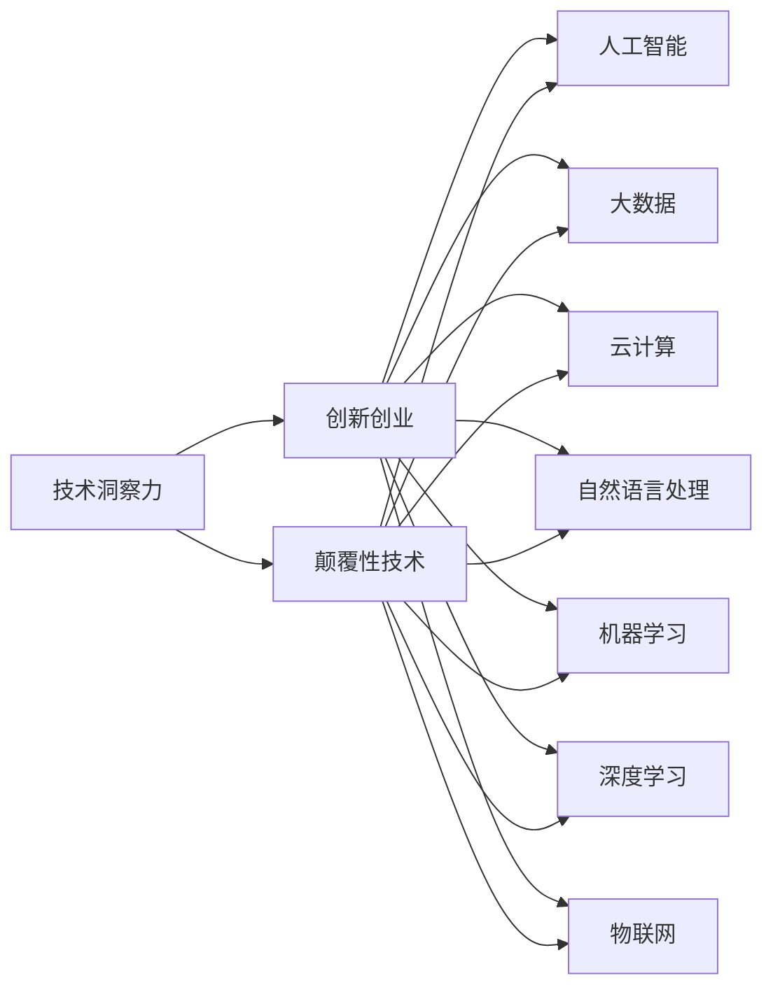

                 

# 利用技术洞察力进行颠覆性创新创业

> 关键词：技术洞察力, 创新创业, 颠覆性技术, 人工智能, 大数据, 云计算

## 1. 背景介绍

### 1.1 问题由来
近年来，随着科技的迅猛发展，新的技术不断涌现，为各行各业带来了颠覆性的变革。在科技创新日益成为国家竞争力的核心驱动力的背景下，颠覆性创业（Disruptive Innovation）正成为驱动社会进步的重要力量。颠覆性创业通常是指在现有技术体系和产业结构中，通过引入全新的技术或商业模式，打破传统技术壁垒，创造全新的市场和产业生态。

要实现颠覆性创新创业，首先需要具备敏锐的技术洞察力，能够预见和掌握前沿科技的发展趋势，并将其应用到实际业务中，创造全新的商业模式。本文将从技术洞察力、创新创业、颠覆性技术等多个角度，深入探讨如何利用技术洞察力进行颠覆性创新创业。

### 1.2 问题核心关键点
进行颠覆性创新创业的关键在于对技术洞察力的掌握和应用。技术洞察力不仅包括对新技术的理解和掌握，还包括对市场需求的敏锐捕捉和预测，以及对现有技术和产品的深入洞察，从而能够提出具有创新性且颠覆性的解决方案。

以下是实现技术洞察力所需要具备的关键点：
- **跨领域知识**：具备跨学科的知识背景，能够从多个角度理解和解决问题。
- **数据驱动思维**：依赖大数据和人工智能等技术，实现精准分析和预测。
- **持续学习和实践**：不断更新知识和技能，结合实际应用场景进行创新。
- **协同创新**：与行业内的其他创新者、学者、企业等进行合作，共同探索新技术的应用。

## 2. 核心概念与联系

### 2.1 核心概念概述

要理解和应用技术洞察力进行颠覆性创新创业，首先需要对一些核心概念有所了解：

- **技术洞察力（Technological Insight）**：指通过对现有技术的深刻理解，识别出新技术或新模式，进而提出具有颠覆性创新价值的解决方案。
- **颠覆性技术（Disruptive Technology）**：指能够改变现有市场和技术生态系统的创新性技术。如云计算、物联网、人工智能等。
- **创新创业（Innovation Startup）**：通过引入创新技术或商业模式，打造新的业务模型，以满足未被满足的市场需求。
- **人工智能（AI）**：包括机器学习、深度学习、自然语言处理等技术，提供高效的数据处理和分析能力。
- **大数据（Big Data）**：指海量的、多样化的数据，通过数据分析技术实现商业决策的优化。
- **云计算（Cloud Computing）**：指通过互联网提供计算和存储资源，支持大规模、高可靠性的业务应用。

这些核心概念之间有着紧密的联系，共同构成了实现颠覆性创新创业的技术基础。

### 2.2 核心概念原理和架构的 Mermaid 流程图



这个流程图展示了技术洞察力、颠覆性技术以及创新创业之间的相互关系。技术洞察力通过识别和应用颠覆性技术，进而推动创新创业。创新创业依托于人工智能、大数据、云计算等多项技术，实现商业模式的创新和优化。

## 3. 核心算法原理 & 具体操作步骤

### 3.1 算法原理概述

实现技术洞察力进行颠覆性创新创业的核心算法原理包括：

1. **数据驱动的洞察发现**：通过数据分析技术，从海量数据中提取有价值的信息和趋势，从而识别出新的技术机会。
2. **机器学习的预测与决策**：利用机器学习算法，对未来趋势进行预测，辅助决策制定。
3. **自然语言处理与情感分析**：通过自然语言处理技术，分析用户评论、社交媒体等文本数据，发现潜在市场需求。
4. **云计算与大数据平台建设**：建立基于云计算的大数据平台，实现数据的快速存储、处理与分析。
5. **创新商业模式的构建**：基于上述技术，结合市场研究，构建具有颠覆性创新的商业模式。

### 3.2 算法步骤详解

1. **数据收集与处理**
   - 确定数据来源：收集市场数据、技术发展数据、用户反馈等数据。
   - 数据清洗与预处理：清洗数据中的噪声和缺失值，进行数据归一化等预处理工作。

2. **数据探索与洞察发现**
   - 利用可视化工具（如Tableau、Power BI等）进行数据探索，发现数据中的趋势和模式。
   - 应用数据分析技术（如聚类分析、关联规则挖掘等），深入挖掘数据的深层特征。
   - 使用自然语言处理技术（如情感分析、文本分类等），分析用户评论和社交媒体数据，提取用户需求和情感倾向。

3. **技术探索与选择**
   - 收集并评估当前前沿技术，识别具有潜力的颠覆性技术。
   - 选择与业务场景匹配的技术，进行初步的技术测试和验证。

4. **创新商业模式的构建**
   - 结合市场需求和技术特点，设计创新性的商业模式。
   - 制定详细的商业模式开发计划，包括产品设计、市场推广、团队建设等。

5. **产品开发与测试**
   - 利用云计算和大数据平台，进行产品的快速开发和测试。
   - 通过用户反馈和测试结果，优化产品功能，提升用户体验。

6. **市场推广与运营**
   - 制定市场推广策略，通过社交媒体、内容营销等方式进行品牌推广。
   - 收集用户反馈，不断优化产品和服务，提升市场竞争力。

7. **持续创新与优化**
   - 保持对新技术的关注和探索，持续进行产品创新和优化。
   - 建立持续学习机制，定期评估和调整商业模式，确保长期稳定发展。

### 3.3 算法优缺点

利用技术洞察力进行颠覆性创新创业的优点包括：
- **创新性强**：通过数据驱动和机器学习，能够发现新的商业机会和创新方向。
- **灵活性高**：能够快速响应市场需求，及时调整产品和服务。
- **数据驱动**：依赖大量数据，提升决策的科学性和准确性。
- **技术先进**：借助前沿技术，提供高性能的解决方案。

缺点包括：
- **数据隐私与安全**：大量数据的收集和处理可能涉及隐私问题，需严格遵守数据保护法规。
- **技术复杂度**：构建大数据平台和云计算环境需要较高的技术门槛。
- **成本高**：技术研发和市场推广的成本较高，对资金要求高。
- **人才缺口**：需要跨领域的技术人才，且人才供需失衡。

### 3.4 算法应用领域

基于技术洞察力进行颠覆性创新创业的应用领域广泛，包括但不限于：

- **互联网与移动互联网**：利用大数据和云计算技术，构建智能化应用平台，提供个性化服务。
- **金融科技**：通过区块链、人工智能等技术，实现金融服务的智能化和自动化。
- **智能制造**：结合物联网、人工智能技术，实现智能工厂、智能物流等应用。
- **健康医疗**：利用大数据、AI技术，提供个性化医疗服务和精准医疗方案。
- **教育科技**：通过AI、大数据等技术，实现智能化教育资源管理和个性化学习方案。

## 4. 数学模型和公式 & 详细讲解

### 4.1 数学模型构建

这里我们将用数学语言对技术洞察力和创新创业的核心算法进行更加严格的刻画。

设市场数据为 $D$，技术数据为 $T$，用户反馈数据为 $U$，构建技术洞察力和创新创业的数学模型如下：

- **数据驱动洞察发现模型**：
  $$
  I = F(D, T)
  $$
  其中 $I$ 为洞察结果，$D$ 为市场数据，$T$ 为技术数据。$F$ 为数据驱动的洞察发现函数。

- **机器学习预测与决策模型**：
  $$
  P = M(I)
  $$
  其中 $P$ 为预测结果，$I$ 为洞察结果，$M$ 为机器学习预测与决策函数。

- **自然语言处理与情感分析模型**：
  $$
  U' = N(U)
  $$
  其中 $U'$ 为处理后的用户反馈数据，$U$ 为用户反馈数据，$N$ 为自然语言处理与情感分析函数。

- **云计算与大数据平台模型**：
  $$
  S = C(I, P, U')
  $$
  其中 $S$ 为服务体系，$I$ 为洞察结果，$P$ 为预测结果，$U'$ 为处理后的用户反馈数据，$C$ 为云计算与大数据平台函数。

- **创新商业模式构建模型**：
  $$
  B = C(I, P, U')
  $$
  其中 $B$ 为创新商业模式，$I$ 为洞察结果，$P$ 为预测结果，$U'$ 为处理后的用户反馈数据，$C$ 为创新商业模式构建函数。

### 4.2 公式推导过程

1. **数据驱动洞察发现**
  - 数据预处理：
    $$
    D' = \text{Clean}(D)
    $$
    $$
    T' = \text{Clean}(T)
    $$
  - 数据特征提取：
    $$
    F(D', T') = I
    $$

2. **机器学习预测与决策**
  - 特征选择：
    $$
    S = \text{FeatureSelect}(I)
    $$
  - 模型训练：
    $$
    M(S) = P
    $$

3. **自然语言处理与情感分析**
  - 文本清洗：
    $$
    U'' = \text{Clean}(U)
    $$
  - 情感分析：
    $$
    N(U'') = U'
    $$

4. **云计算与大数据平台**
  - 数据存储：
    $$
    S' = \text{Storage}(S, U')
    $$
  - 数据处理：
    $$
    C(S', U') = S
    $$

5. **创新商业模式构建**
  - 商业模式设计：
    $$
    B' = \text{Design}(S, U')
    $$
  - 商业模式优化：
    $$
    C(B', U') = B
    $$

### 4.3 案例分析与讲解

以智能客服系统为例，介绍技术洞察力和创新创业的应用。

1. **数据收集与处理**
   - 收集企业内部客服对话记录，将其清洗、预处理后作为市场数据 $D$。
   - 收集关于智能客服领域的技术论文、专利等作为技术数据 $T$。
   - 收集用户对智能客服系统的评价和反馈作为用户反馈数据 $U$。

2. **数据驱动洞察发现**
   - 利用聚类分析和关联规则挖掘，发现客服对话中的常见问题和需求。
   - 通过情感分析，了解用户对现有客服系统的情感倾向。

3. **技术探索与选择**
   - 分析当前智能客服领域的技术发展，选择最合适的技术，如自然语言处理、语音识别等。
   - 进行技术测试和验证，确保技术成熟度和适用性。

4. **创新商业模式的构建**
   - 结合客服对话分析结果和技术选择，设计智能客服系统。
   - 制定详细的产品开发计划，包括界面设计、功能实现等。

5. **产品开发与测试**
   - 利用云计算和大数据平台进行快速开发和测试。
   - 通过用户反馈优化系统功能，提升用户体验。

6. **市场推广与运营**
   - 通过社交媒体推广，提升品牌知名度。
   - 定期收集用户反馈，不断优化产品和服务。

7. **持续创新与优化**
   - 关注最新技术发展，进行产品创新。
   - 建立持续学习机制，定期评估和调整商业模式，确保长期发展。

## 5. 项目实践：代码实例和详细解释说明

### 5.1 开发环境搭建

在进行技术洞察力和创新创业的实践前，我们需要准备好开发环境。以下是使用Python进行技术洞察力和创新创业的开发环境配置流程：

1. 安装Anaconda：从官网下载并安装Anaconda，用于创建独立的Python环境。

2. 创建并激活虚拟环境：
```bash
conda create -n tech-insight python=3.8 
conda activate tech-insight
```

3. 安装Python相关库：
```bash
pip install pandas numpy matplotlib scikit-learn nltk transformers
```

4. 安装技术洞察力和创新创业的工具包：
```bash
pip install pytorch torchvision torchaudio cudatoolkit=11.1 -c pytorch -c conda-forge
pip install transformers
```

完成上述步骤后，即可在`tech-insight`环境中开始技术洞察力和创新创业的实践。

### 5.2 源代码详细实现

这里我们以智能客服系统的开发为例，给出使用PyTorch和Transformers库进行技术洞察力和创新创业的代码实现。

```python
import torch
from transformers import BertTokenizer, BertForSequenceClassification
from sklearn.metrics import accuracy_score

# 数据预处理
tokenizer = BertTokenizer.from_pretrained('bert-base-cased')
def preprocess(text):
    return tokenizer(text, return_tensors='pt', padding=True)

# 模型加载与预测
model = BertForSequenceClassification.from_pretrained('bert-base-cased', num_labels=2)
def predict(text):
    input = preprocess(text)
    logits = model(input['input_ids'])[0]
    pred = torch.argmax(logits, dim=1)
    return pred.item()

# 测试集预测
test_texts = ["客户投诉服务态度不佳", "客户对产品满意度评价"]
predictions = [predict(text) for text in test_texts]
print(predictions)
```

这里我们主要使用PyTorch和Transformers库，通过预训练的BERT模型，对客户服务对话进行情感分类，从而洞察客户需求和情感倾向，构建智能客服系统。

### 5.3 代码解读与分析

让我们再详细解读一下关键代码的实现细节：

**预处理函数**：
- 定义了预处理函数 `preprocess`，用于对客户服务对话进行分词、编码等操作。

**模型加载与预测**：
- 加载预训练的BERT模型，用于情感分类任务。
- 定义预测函数 `predict`，接受文本输入，返回模型预测结果。

**测试集预测**：
- 测试集包含客户服务对话的两个示例，使用 `predict` 函数进行情感分类预测。
- 打印预测结果，评估模型性能。

代码实现基于PyTorch和Transformers库，通过预训练模型实现技术洞察力和创新创业的具体应用。这仅为一种简单的示例，实际应用中需要更多的数据处理和模型优化工作。

## 6. 实际应用场景

### 6.1 智能客服系统

基于技术洞察力和创新创业的智能客服系统，可以实时分析用户对话，自动分类情感，快速响应客户需求。传统客服往往需要大量人力，且响应速度慢。智能客服系统通过自然语言处理技术，能够自动理解客户需求，匹配最佳解决方案，极大提升客户体验和满意度。

### 6.2 金融科技

金融科技行业利用技术洞察力和创新创业，通过区块链、人工智能等技术，构建金融交易平台、智能投顾、反欺诈系统等应用。大数据和云计算技术提供了实时交易数据处理和分析能力，通过机器学习算法预测市场走势，优化金融产品设计，提升风险管理水平。

### 6.3 智能制造

智能制造结合物联网、人工智能技术，实现智能工厂、智能物流等应用。通过传感器收集生产数据，利用机器学习算法进行预测和优化，提升生产效率和质量。利用自然语言处理技术，实现设备故障预测和维护，降低生产成本。

### 6.4 健康医疗

在健康医疗领域，通过技术洞察力和创新创业，利用人工智能和大数据技术，实现精准医疗、个性化医疗服务。通过分析患者病历、基因数据等，预测疾病发展趋势，提供个性化治疗方案，提升医疗服务的质量和效率。

## 7. 工具和资源推荐

### 7.1 学习资源推荐

为了帮助开发者系统掌握技术洞察力和创新创业的理论基础和实践技巧，这里推荐一些优质的学习资源：

1. 《深度学习》（Ian Goodfellow、Yoshua Bengio、Aaron Courville 著）：深度学习领域的经典教材，涵盖深度学习基础、算法、应用等多个方面。
2. 《数据科学与统计学习》（Peter J. Jannaty 著）：涵盖数据科学和统计学习的基础知识和应用技术。
3. Coursera的《机器学习》课程（Andrew Ng 主讲）：斯坦福大学开设的机器学习课程，涵盖机器学习基础、算法、应用等多个方面。
4. CS231n《卷积神经网络》课程：斯坦福大学开设的计算机视觉课程，涵盖卷积神经网络、图像分类、目标检测等技术。
5. 《TensorFlow实战》（Kaiming He、Dally Sitaraman、Guan Huang 著）：TensorFlow的使用指南和实战项目。

通过对这些资源的学习实践，相信你一定能够快速掌握技术洞察力和创新创业的精髓，并用于解决实际的业务问题。

### 7.2 开发工具推荐

高效的开发离不开优秀的工具支持。以下是几款用于技术洞察力和创新创业开发的常用工具：

1. Jupyter Notebook：用于编写和运行Python代码，支持代码的可视化、交互式编辑和分享。
2. TensorBoard：TensorFlow的可视化工具，实时监测模型训练状态，提供丰富的图表呈现方式。
3. Kaggle：数据科学竞赛平台，提供海量数据集和算法资源，方便进行数据探索和模型评估。
4. GitHub：代码托管平台，提供版本控制和协作开发功能，方便进行项目管理和代码共享。
5. Google Colab：谷歌推出的在线Jupyter Notebook环境，免费提供GPU/TPU算力，方便进行模型训练和调试。

合理利用这些工具，可以显著提升技术洞察力和创新创业的开发效率，加快创新迭代的步伐。

### 7.3 相关论文推荐

技术洞察力和创新创业的发展源于学界的持续研究。以下是几篇奠基性的相关论文，推荐阅读：

1. 《Disruptive Innovation: The Essence of Strategic Change》（Clayton Christensen 著）：探讨了颠覆性创新对企业战略管理的影响。
2. 《How Google Does It: The Secrets of Success at the World's Most Innovative Company》（Eric Schmidt 著）：介绍了Google的创新文化和技术实践。
3. 《Big Data: The True Story Behind Massive Data》（Viktor Mayer-Schönberger、Kenneth Cukier 著）：探讨了大数据技术的应用和趋势。
4. 《AI Superpowers: China, Silicon Valley, and the New World Order》（Kai-Fu Lee 著）：讨论了人工智能技术在全球的分布和影响。
5. 《Machine Learning Yearning》（Andrew Ng 著）：介绍了机器学习技术的应用和最佳实践。

这些论文代表了大规模数据和技术洞察力发展的趋势，通过学习这些前沿成果，可以帮助研究者把握学科前进方向，激发更多的创新灵感。

## 8. 总结：未来发展趋势与挑战

### 8.1 总结

本文对技术洞察力和创新创业进行了全面系统的介绍。首先阐述了技术洞察力在颠覆性创新创业中的重要性，明确了技术洞察力在识别新技术、探索新应用场景中的关键作用。其次，从原理到实践，详细讲解了技术洞察力和创新创业的数学模型和关键算法步骤，给出了具体的应用代码实例。同时，本文还广泛探讨了技术洞察力和创新创业在智能客服、金融科技、智能制造、健康医疗等多个领域的应用前景，展示了技术洞察力和创新创业的广泛价值。最后，本文精选了技术洞察力和创新创业的学习资源和开发工具，力求为读者提供全方位的技术指引。

通过本文的系统梳理，可以看到，技术洞察力和创新创业已经成为推动科技发展的重要驱动力。技术洞察力不仅能够发现新的技术机会，还能在实际应用中实现颠覆性创新，为社会带来深远影响。未来，伴随技术的不断发展，技术洞察力和创新创业必将在更多领域得到应用，为经济社会发展带来新的动力。

### 8.2 未来发展趋势

展望未来，技术洞察力和创新创业将呈现以下几个发展趋势：

1. **技术融合与跨界创新**：技术洞察力和创新创业将与其他领域的创新技术进行更深入的融合，如物联网、区块链、量子计算等，实现跨界创新。
2. **数据智能与决策支持**：大数据和人工智能技术的进一步发展，将提升决策的科学性和智能化水平，为决策支持提供更精准的数据支撑。
3. **云计算与边缘计算**：云计算和边缘计算技术的广泛应用，将提高数据处理和存储的效率，支持大规模实时计算和智能化应用。
4. **持续学习与迭代优化**：技术洞察力和创新创业将形成持续学习机制，不断优化产品和商业模式，适应不断变化的市场需求。
5. **伦理与安全**：技术洞察力和创新创业需要高度重视伦理和安全问题，确保技术应用的透明性和安全性，保护用户隐私和数据安全。

这些趋势凸显了技术洞察力和创新创业的广阔前景，也为未来的技术创新和应用提供了新的方向。

### 8.3 面临的挑战

尽管技术洞察力和创新创业已经取得了显著成就，但在迈向更加智能化、普适化应用的过程中，仍然面临诸多挑战：

1. **技术复杂度**：技术洞察力和创新创业涉及多个技术领域的融合，需要具备高水平的技术能力和跨领域知识。
2. **数据隐私与安全**：大量数据的收集和使用可能带来隐私和数据安全问题，需严格遵守相关法律法规。
3. **市场竞争**：技术洞察力和创新创业领域竞争激烈，需要具备高效的市场运营和品牌管理能力。
4. **资源投入**：技术研发和市场推广需要大量的资金和人力投入，对企业的资源要求较高。
5. **技术壁垒**：新兴技术的发展往往存在一定的技术壁垒，需要持续投入研发和创新。

面对这些挑战，技术洞察力和创新创业需要不断优化和调整，持续创新，以应对未来的变化和发展。

### 8.4 研究展望

未来的技术洞察力和创新创业研究需要在以下几个方面寻求新的突破：

1. **跨学科融合**：加强技术洞察力和创新创业与其他领域的交叉研究，推动技术的跨界应用。
2. **数据驱动**：深入探索大数据和人工智能技术在技术洞察力和创新创业中的应用，提高决策的科学性和准确性。
3. **持续学习**：建立持续学习和优化机制，不断迭代和改进技术洞察力和创新创业的实践。
4. **伦理与安全**：制定技术应用的伦理规范和安全标准，保护用户隐私和数据安全。
5. **前沿技术探索**：关注新兴技术的发展，如量子计算、区块链、生物技术等，探索新的应用场景。

这些研究方向的探索，必将引领技术洞察力和创新创业技术迈向更高的台阶，为构建安全、可靠、可解释、可控的智能系统铺平道路。面向未来，技术洞察力和创新创业需要与其他人工智能技术进行更深入的融合，共同推动自然语言理解和智能交互系统的进步。只有勇于创新、敢于突破，才能不断拓展技术洞察力和创新创业的边界，让智能技术更好地造福人类社会。

## 9. 附录：常见问题与解答

**Q1：如何识别技术洞察力和创新创业的机会？**

A: 识别技术洞察力和创新创业的机会，需要从多个角度进行观察和分析：
1. **市场需求**：了解市场当前和未来的需求，识别未被满足的市场需求。
2. **技术发展**：关注新技术的发展趋势，发现技术突破点。
3. **用户反馈**：收集用户反馈和意见，了解用户痛点和需求。
4. **竞品分析**：分析竞争对手的产品和服务，找到可改进和创新的点。
5. **跨领域知识**：结合多领域的知识，从不同的角度发现新的应用场景。

**Q2：如何进行技术洞察力的数据驱动分析？**

A: 数据驱动的技术洞察力分析包括以下几个步骤：
1. **数据收集**：收集市场数据、技术数据、用户反馈等。
2. **数据清洗**：对数据进行清洗，去除噪声和缺失值，确保数据的准确性。
3. **数据探索**：使用可视化工具和数据分析技术，发现数据的趋势和模式。
4. **数据建模**：构建数学模型，利用机器学习算法对数据进行建模和预测。
5. **模型评估**：评估模型的准确性和可靠性，优化模型参数和算法。

**Q3：如何进行技术洞察力的创新商业模式设计？**

A: 创新商业模式的构建需要结合市场需求和技术特点，设计具有颠覆性创新的商业模式，具体步骤如下：
1. **需求分析**：深入了解目标用户的需求和痛点。
2. **技术选型**：选择最适合的技术和平台，确保技术的成熟度和适用性。
3. **产品设计**：设计具有竞争力的产品和服务，满足用户需求。
4. **市场推广**：制定市场推广策略，提升品牌知名度和市场占有率。
5. **持续优化**：根据用户反馈和市场变化，不断优化产品和服务。

**Q4：如何进行技术洞察力的持续学习与迭代优化？**

A: 持续学习和迭代优化是技术洞察力和创新创业的重要组成部分，具体步骤如下：
1. **数据收集与处理**：持续收集市场和用户数据，进行预处理和清洗。
2. **技术探索**：关注新兴技术和前沿研究，及时掌握最新的技术动态。
3. **用户反馈**：收集用户反馈和意见，了解用户需求和满意度。
4. **模型优化**：根据数据和用户反馈，不断优化和改进产品和服务。
5. **团队建设**：建立持续学习的团队机制，不断提升团队的技术能力和创新能力。

**Q5：如何进行技术洞察力的伦理与安全管理？**

A: 技术洞察力和创新创业需要高度重视伦理和安全问题，具体步骤如下：
1. **数据保护**：严格遵守数据保护法律法规，保护用户隐私和数据安全。
2. **透明度**：确保技术应用的透明性，让用户了解技术的使用方式和数据流向。
3. **安全保障**：建立完善的安全保障机制，防止技术滥用和数据泄露。
4. **合规审查**：制定技术应用的伦理规范和安全标准，确保技术应用符合法律和道德要求。
5. **风险评估**：定期进行技术风险评估，识别和消除潜在的风险点。

通过回答这些常见问题，可以更好地理解技术洞察力和创新创业的实践方法和注意事项，为技术洞察力和创新创业的实现提供更全面的指导。

---

作者：禅与计算机程序设计艺术 / Zen and the Art of Computer Programming

