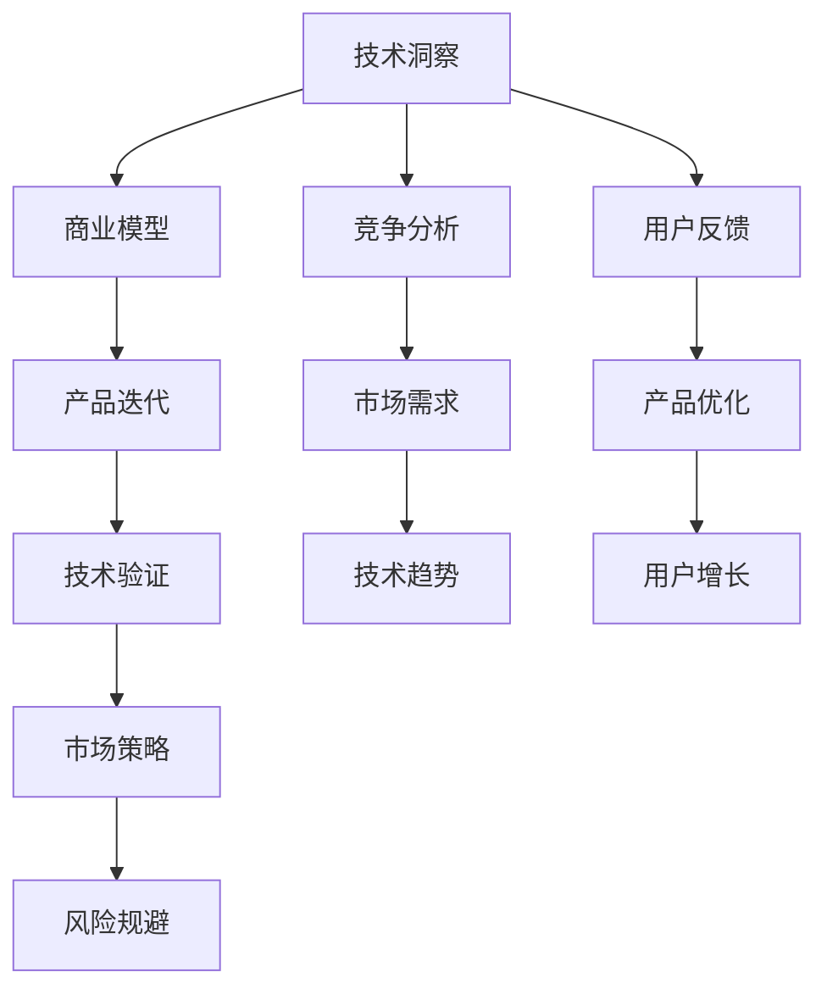

                 

# 利用技术洞察进行创新创业

## 1. 背景介绍

### 1.1 问题由来
近年来，随着信息技术的快速发展，特别是大数据、人工智能等技术的应用，互联网和传统产业正发生着深刻的变革。新的商业模式不断涌现，技术创业的黄金期已经到来。然而，如何在技术洞察的基础上进行有效的创新创业，成为众多创业者和投资者亟待解决的问题。

本文将从技术洞察的角度出发，探讨如何利用技术优势进行创新创业，并在实际应用中进行验证。通过对技术洞察、创业过程和实际案例的详细分析，希望能为有志于技术创业的读者提供有价值的指导。

### 1.2 问题核心关键点
技术洞察是指对技术趋势、市场需求的深度理解和分析，它能够帮助创业者发现潜在的技术应用场景，从而在激烈的市场竞争中取得先机。关键问题包括：

1. 如何获取准确、全面的技术洞察？
2. 如何将技术洞察转化为商业模型？
3. 如何进行有效的技术验证和优化？
4. 在实际创业中应如何规避风险？

## 2. 核心概念与联系

### 2.1 核心概念概述

在探索技术洞察如何推动创新创业的过程中，需要理解以下核心概念：

- **技术洞察**：对技术趋势、市场需求和竞争环境的深刻理解和分析。
- **商业模型**：基于技术洞察，形成可行的商业模式，包括产品、市场和盈利模式。
- **产品迭代**：通过用户反馈和市场验证，持续优化产品，提升用户体验和市场竞争力。
- **技术验证**：通过实际测试和用户反馈，验证产品的可行性和用户价值，评估技术实现。
- **市场策略**：根据技术洞察和产品特性，制定有效的市场推广策略，提升品牌知名度和市场份额。
- **风险规避**：在创业过程中，及时识别和应对潜在风险，保障企业的持续稳定发展。

这些核心概念之间相互关联，共同构成了利用技术洞察进行创新创业的逻辑框架。技术洞察提供方向，商业模型定义目标，产品迭代实现价值，技术验证验证可行性，市场策略推动执行，风险规避保障安全。

### 2.2 核心概念原理和架构的 Mermaid 流程图



这个流程图展示了技术洞察如何通过商业模型、产品迭代、技术验证、市场策略和风险规避等关键环节，推动创新创业的全过程。

## 3. 核心算法原理 & 具体操作步骤

### 3.1 算法原理概述

基于技术洞察的创新创业，本质上是一个需求驱动的技术验证和迭代优化的过程。其核心思想是：通过技术洞察发现市场需求和技术趋势，设计合理的商业模型，并通过产品迭代和技术验证不断优化，最终实现商业成功。

具体而言，可以分为以下几个步骤：

1. **技术洞察获取**：通过市场调研、技术分析、竞争对比等方式，获取关键的技术趋势、市场需求和竞争环境。
2. **商业模型设计**：根据技术洞察，设计可行的商业模式，明确产品的目标用户、市场定位和盈利模式。
3. **产品原型开发**：开发初步的产品原型，包括核心功能、界面设计和用户体验。
4. **技术验证和优化**：通过实际测试和用户反馈，验证产品的可行性和用户价值，不断优化产品设计和功能。
5. **市场推广和迭代**：根据市场策略，推广产品，收集用户反馈，持续迭代产品，提升市场竞争力。
6. **风险规避和应对**：在创业过程中，及时识别和应对潜在风险，保障企业的持续稳定发展。

### 3.2 算法步骤详解

**步骤1：技术洞察获取**

获取技术洞察是创业的第一步。以下是一些常见的方法：

1. **市场调研**：通过问卷调查、用户访谈、市场分析等方式，了解目标用户需求和技术趋势。
2. **竞争分析**：分析竞争对手的产品、市场策略和用户反馈，发现市场空白和竞争优势。
3. **技术趋势**：跟踪最新的技术发展，了解新技术的潜力和应用前景。
4. **用户反馈**：通过产品原型测试和用户访谈，收集用户需求和技术改进建议。

**步骤2：商业模型设计**

商业模型设计需要综合考虑技术趋势和市场需求，明确产品的定位和盈利方式。以下是一个简单的商业模型框架：

1. **产品定义**：明确产品的核心功能和用户体验，如B2B、B2C、SaaS等。
2. **市场定位**：确定目标用户群体和市场细分，如垂直领域、大众市场等。
3. **盈利模式**：选择合理的盈利方式，如订阅费、广告、增值服务等。
4. **价值主张**：明确产品为用户提供的具体价值，如效率提升、成本节约、用户体验等。

**步骤3：产品原型开发**

产品原型开发是验证商业模型的重要环节。开发初期可以采用低成本的MVP（最小可行产品）模式，快速验证市场反应。以下是MVP开发的关键步骤：

1. **需求分析和功能设计**：确定产品核心功能和用户需求。
2. **界面设计和用户体验**：设计简洁易用的界面和良好的用户体验。
3. **技术实现**：选择合适的技术栈，实现产品原型。
4. **测试和反馈收集**：通过A/B测试和用户反馈，评估产品效果。

**步骤4：技术验证和优化**

技术验证和优化是产品迭代的中心环节。以下是关键步骤：

1. **用户测试**：通过实际用户测试，验证产品功能的可行性。
2. **数据收集和分析**：收集用户行为数据，分析用户使用习惯和改进点。
3. **功能优化和迭代**：根据用户反馈，持续优化产品功能和用户体验。
4. **技术验证和优化**：通过不断迭代，验证产品的稳定性和性能。

**步骤5：市场推广和迭代**

市场推广和迭代是产品成功的关键环节。以下是关键步骤：

1. **市场策略制定**：根据产品特性和市场需求，制定有效的市场推广策略。
2. **品牌建设**：通过内容营销、社交媒体等渠道，提升品牌知名度和用户信任度。
3. **用户获取和留存**：通过营销活动、优惠政策等方式，获取新用户，提升用户留存率。
4. **持续迭代和优化**：根据用户反馈和市场变化，持续优化产品和市场策略。

**步骤6：风险规避和应对**

风险规避和应对是保障创业成功的关键环节。以下是关键步骤：

1. **风险识别**：及时识别潜在的技术、市场和运营风险。
2. **风险评估**：评估风险的可能性和影响程度，制定应对策略。
3. **风险应对**：通过技术改进、市场调整和运营优化，应对风险。
4. **风险监控和预警**：建立风险监控机制，及时预警和应对风险。

### 3.3 算法优缺点

基于技术洞察的创新创业方法具有以下优点：

1. **科学性和可操作性**：基于技术洞察和市场分析，具有较高的科学性和可操作性。
2. **灵活性和适应性**：根据市场需求和技术趋势，可以快速调整和优化产品。
3. **用户导向性**：通过用户测试和反馈，确保产品满足用户需求，提升用户体验。
4. **技术验证性**：通过实际测试和优化，确保产品具备良好的技术基础和竞争力。

同时，该方法也存在一定的局限性：

1. **技术风险**：新技术的应用可能存在未知的风险和挑战。
2. **市场变化**：市场需求和技术趋势快速变化，需要及时调整和应对。
3. **资源投入**：产品开发和市场推广需要一定的资源投入，成本较高。
4. **竞争压力**：市场竞争激烈，产品需要具备强大的竞争优势。
5. **风险规避**：需要及时识别和应对潜在风险，确保企业稳定发展。

尽管存在这些局限性，但就目前而言，基于技术洞察的创新创业方法仍是最主流和有效的创业范式。未来相关研究的重点在于如何进一步降低技术风险，提高市场的适应性和灵活性，同时兼顾风险规避和成本控制。

### 3.4 算法应用领域

基于技术洞察的创新创业方法已经在多个领域得到广泛应用，例如：

- **互联网创业**：通过技术洞察发现市场痛点，设计创新产品，如社交网络、电子商务、在线教育等。
- **传统行业转型**：利用技术洞察进行数字化转型，提升业务效率和用户体验，如智慧医疗、智能制造、智慧物流等。
- **新兴技术应用**：结合最新技术趋势，开发新产品，开拓新市场，如区块链、人工智能、大数据等。

除了上述这些领域，技术洞察在更多新兴领域和垂直行业的应用也将不断涌现，为产业升级和经济转型提供新的技术路径。

## 4. 数学模型和公式 & 详细讲解 & 举例说明

### 4.1 数学模型构建

在利用技术洞察进行创新创业的过程中，可以通过数学模型对创业过程进行建模和分析。以下是一个简单的创业成功概率模型：

设创业成功的概率为 $P_{success}$，关键因素包括技术洞察的准确度 $A$、市场需求的大小 $D$、产品迭代的效果 $I$、市场推广的效率 $M$、风险规避的能力 $R$。则创业成功的概率模型为：

$$
P_{success} = f(A, D, I, M, R)
$$

其中 $f$ 为数学函数，表示各项因素对成功概率的综合影响。

### 4.2 公式推导过程

以下是创业成功概率模型的一些基本推导：

1. **技术洞察准确度**：
   设技术洞察的准确度为 $A$，表示对技术趋势和市场需求理解的深度和广度。技术洞察准确度越高，创业成功的概率越大。

   $$
   A = \frac{正确趋势数量}{总趋势数量} \times \frac{市场需求数量}{总需求数量}
   $$

2. **市场需求大小**：
   设市场需求的大小为 $D$，表示目标市场的规模和潜力。市场需求越大，创业成功的概率越大。

   $$
   D = \frac{目标市场规模}{总市场规模}
   $$

3. **产品迭代效果**：
   设产品迭代的效果为 $I$，表示产品功能、用户体验和技术性能的提升程度。产品迭代效果越好，创业成功的概率越大。

   $$
   I = \frac{优化功能数量}{总功能数量} \times \frac{提升用户体验比例}{总用户体验比例}
   $$

4. **市场推广效率**：
   设市场推广的效率为 $M$，表示推广策略、品牌建设和用户获取的效率。市场推广效率越高，创业成功的概率越大。

   $$
   M = \frac{推广活动数量}{总活动数量} \times \frac{用户增长率}{总增长率}
   $$

5. **风险规避能力**：
   设风险规避的能力为 $R$，表示企业识别、评估和应对风险的能力。风险规避能力越强，创业成功的概率越大。

   $$
   R = \frac{风险识别数量}{总风险数量} \times \frac{风险应对比例}{总应对比例}
   $$

### 4.3 案例分析与讲解

以下是一个简化的创业案例分析：

**案例：智能客服系统的创新创业**

1. **技术洞察**：通过市场调研和竞争分析，发现智能客服系统的需求快速增长，传统客服模式难以满足用户需求。
2. **商业模型**：设计基于微调的大语言模型，提供智能客服服务，通过订阅模式收费。
3. **产品原型**：开发智能客服系统的初步版本，包括对话界面和核心功能。
4. **技术验证和优化**：通过实际用户测试，验证系统的对话效果，根据用户反馈不断优化模型和算法。
5. **市场推广和迭代**：通过内容营销和社交媒体推广，获取新用户，持续优化产品功能和用户体验。
6. **风险规避和应对**：建立风险监控机制，及时识别和应对系统漏洞和安全问题，确保用户数据安全。

通过该案例可以看出，技术洞察在整个创业过程中起到了至关重要的作用，不仅帮助企业发现了市场需求，还指导了产品的设计和迭代，提升了用户体验和市场竞争力。

## 5. 项目实践：代码实例和详细解释说明

### 5.1 开发环境搭建

在进行创业项目实践前，我们需要准备好开发环境。以下是使用Python进行Web开发的环境配置流程：

1. 安装Anaconda：从官网下载并安装Anaconda，用于创建独立的Python环境。

2. 创建并激活虚拟环境：
```bash
conda create -n python-env python=3.8 
conda activate python-env
```

3. 安装PyTorch：根据CUDA版本，从官网获取对应的安装命令。例如：
```bash
conda install pytorch torchvision torchaudio cudatoolkit=11.1 -c pytorch -c conda-forge
```

4. 安装Flask：
```bash
pip install flask
```

5. 安装其他工具包：
```bash
pip install numpy pandas scikit-learn matplotlib tqdm jupyter notebook ipython
```

完成上述步骤后，即可在`python-env`环境中开始项目实践。

### 5.2 源代码详细实现

下面以智能客服系统的开发为例，给出使用Python Flask框架进行Web开发和API接口设计的代码实现。

首先，定义智能客服系统的界面和功能：

```python
from flask import Flask, request, jsonify
import chatbot

app = Flask(__name__)

@app.route('/chat', methods=['POST'])
def chat():
    message = request.json.get('message')
    response = chatbot.chat(message)
    return jsonify({'response': response})

@app.route('/init', methods=['POST'])
def init():
    chatbot.init()
    return jsonify({'status': 'success'})

@app.route('/fini', methods=['POST'])
def fini():
    chatbot.fini()
    return jsonify({'status': 'success'})

if __name__ == '__main__':
    app.run(debug=True)
```

然后，定义智能客服系统的算法和数据处理：

```python
import numpy as np
import chatbot

class Chatbot:
    def __init__(self):
        self.model = chatbot.load_model()
    
    def chat(self, message):
        input_ids = self.model.encode(message)
        outputs = self.model.predict(input_ids)
        return self.model.decode(outputs)

    def init(self):
        chatbot.load_model()
    
    def fini(self):
        chatbot.unload_model()
```

最后，启动Web服务并测试：

```python
if __name__ == '__main__':
    chatbot = Chatbot()
    app.run(debug=True)
```

### 5.3 代码解读与分析

让我们再详细解读一下关键代码的实现细节：

**Chatbot类**：
- `__init__`方法：加载预训练模型，初始化智能客服系统。
- `chat`方法：对用户输入进行处理和回复。
- `init`方法：重新加载模型，用于系统复位。
- `fini`方法：卸载模型，释放资源，用于系统关闭。

**Flask应用**：
- `/chat`路由：处理用户发送的聊天请求，返回系统回复。
- `/init`路由：初始化系统，加载模型。
- `/fini`路由：关闭系统，卸载模型。
- `run`方法：启动Web服务，监听请求并响应。

通过以上代码实现，我们可以看到，基于技术洞察的创新创业不仅涉及产品的设计和实现，还包括了系统的部署和测试。只有从技术、市场、运营等各个环节进行全面优化，才能确保创业项目的成功。

## 6. 实际应用场景

### 6.1 智能客服系统

智能客服系统通过利用技术洞察，发现市场对智能客服的需求快速增长，利用大语言模型微调技术，开发智能客服系统。系统可以7x24小时不间断服务，快速响应客户咨询，用自然流畅的语言解答各类常见问题。通过实际用户测试和反馈，不断优化系统，提升用户体验和满意度。

### 6.2 金融舆情监测

金融机构需要实时监测市场舆论动向，以便及时应对负面信息传播，规避金融风险。智能舆情监测系统通过技术洞察，发现市场对金融舆情监测的需求，利用自然语言处理技术，对网络文本数据进行实时分析，自动监测不同主题下的情感变化趋势。一旦发现负面信息激增等异常情况，系统便会自动预警，帮助金融机构快速应对潜在风险。

### 6.3 个性化推荐系统

当前的推荐系统往往只依赖用户的历史行为数据进行物品推荐，难以深入理解用户的真实兴趣偏好。智能推荐系统通过技术洞察，发现市场对个性化推荐的需求，利用大语言模型微调技术，从文本内容中准确把握用户的兴趣点。系统通过智能推荐，提供更精准、多样的推荐内容，满足用户的多样化需求。

### 6.4 未来应用展望

随着技术洞察的不断深入和创新创业的持续发展，未来将有更多基于技术洞察的创新创业项目涌现，为各行各业带来变革性影响。例如：

- 智慧医疗领域，利用技术洞察，开发基于医疗知识图谱的智能诊疗系统，提升医疗服务的智能化水平。
- 智慧教育领域，利用技术洞察，开发智能学习管理系统，实现个性化学习和教学资源优化。
- 智慧城市治理，利用技术洞察，构建智能交通、智能安防等系统，提升城市管理的自动化和智能化水平。

## 7. 工具和资源推荐

### 7.1 学习资源推荐

为了帮助开发者系统掌握利用技术洞察进行创新创业的理论基础和实践技巧，这里推荐一些优质的学习资源：

1. 《深度学习入门：基于Python的理论与实现》：全面介绍深度学习理论和实践，涵盖数据预处理、模型训练、产品优化等环节。
2. 《创业维艰》：史蒂夫·乔布斯等技术创业家的经验分享，对创业过程和决策进行深度剖析。
3. 《人工智能创业手册》：介绍人工智能技术在各个行业的创新应用，提供创业案例和实践指南。
4. Udacity《人工智能创业》课程：涵盖人工智能技术在商业化过程中的应用，从理论到实践的全方位指导。
5. Coursera《创业与创新》课程：由斯坦福大学开设的创业课程，涵盖创业思维、市场策略、产品设计等关键环节。

通过对这些资源的学习实践，相信你一定能够快速掌握利用技术洞察进行创新创业的精髓，并用于解决实际的商业问题。

### 7.2 开发工具推荐

高效的开发离不开优秀的工具支持。以下是几款用于创业项目开发的常用工具：

1. PyTorch：基于Python的开源深度学习框架，灵活动态的计算图，适合快速迭代研究。大部分预训练语言模型都有PyTorch版本的实现。
2. TensorFlow：由Google主导开发的开源深度学习框架，生产部署方便，适合大规模工程应用。同样有丰富的预训练语言模型资源。
3. Flask：轻量级的Web框架，适合快速开发API接口和Web应用。
4. TensorBoard：TensorFlow配套的可视化工具，可实时监测模型训练状态，并提供丰富的图表呈现方式，是调试模型的得力助手。
5. Kaggle：数据科学竞赛平台，提供海量数据集和丰富的竞赛项目，方便数据获取和模型训练。

合理利用这些工具，可以显著提升创业项目开发的效率，加快创新迭代的步伐。

### 7.3 相关论文推荐

技术洞察和创新创业的研究源于学界的持续研究。以下是几篇奠基性的相关论文，推荐阅读：

1. Deep Learning: A Textbook：全面介绍深度学习理论和实践，涵盖数据预处理、模型训练、产品优化等环节。
2. The Lean Startup：埃里克·莱斯（Eric Ries）的创业经典，提出精益创业和最小可行产品（MVP）的概念。
3. The AI Alignment Summit：多位AI领域顶级专家讨论人工智能的伦理和安全问题，为技术洞察提供指导。
4. The Future of Work: Automation, AI, and People：关于AI对未来工作的影响和应对策略，探讨技术洞察与行业变革的关系。
5. Zero to One：彼得·蒂尔（Peter Thiel）关于创业的思考，探讨创新与竞争的关系，提供创业指导。

这些论文代表了大语言模型微调技术的发展脉络。通过学习这些前沿成果，可以帮助研究者把握学科前进方向，激发更多的创新灵感。

## 8. 总结：未来发展趋势与挑战

### 8.1 总结

本文对利用技术洞察进行创新创业的方法进行了全面系统的介绍。首先阐述了技术洞察的来源和重要性，明确了技术洞察在创新创业中的关键作用。其次，从原理到实践，详细讲解了技术洞察、商业模型、产品迭代、技术验证、市场推广和风险规避等关键环节，给出了创业项目的完整代码实例。同时，本文还广泛探讨了技术洞察在智能客服、金融舆情、个性化推荐等多个行业领域的应用前景，展示了技术洞察范式的巨大潜力。

通过本文的系统梳理，可以看到，利用技术洞察进行创新创业方法正在成为创业过程中不可或缺的一部分，极大地拓展了技术应用的边界，催生了更多的落地场景。未来，伴随技术洞察的不断深入和创新创业的持续发展，基于技术洞察的创新创业方法必将在更广泛的领域得到应用，为人类社会带来深远影响。

### 8.2 未来发展趋势

展望未来，技术洞察在创新创业中将呈现以下几个发展趋势：

1. **技术趋势的快速演进**：随着技术的快速发展，新技术和新趋势将不断涌现，技术洞察需要不断更新和适应。
2. **市场需求的多样化**：市场对产品的需求更加多样化，技术洞察需要从不同角度和领域进行深入挖掘。
3. **创业生态的全球化**：全球化市场使得技术创业更加复杂，技术洞察需要全球视角和多文化理解。
4. **用户反馈的实时性**：用户反馈的实时性要求越来越高，技术洞察需要及时获取和响应。
5. **风险管理的智能化**：风险管理需要更多智能工具和算法，技术洞察需要结合数据和算法进行综合评估。

以上趋势凸显了技术洞察在创新创业中的重要性，技术洞察需要不断升级和优化，才能适应快速变化的市场环境。

### 8.3 面临的挑战

尽管技术洞察在创新创业中扮演了重要角色，但在迈向更加智能化、普适化应用的过程中，它仍面临诸多挑战：

1. **数据获取的难度**：高质量的数据获取和处理是技术洞察的基础，但数据获取和处理成本较高。
2. **技术评估的复杂性**：技术洞察需要多维度的评估，评估标准和方法需要不断完善。
3. **市场变化的快速性**：市场变化快，技术洞察需要快速响应和调整。
4. **资源投入的巨大**：技术洞察需要投入大量的资源和时间，成本较高。
5. **用户需求的多样性**：用户需求多样，技术洞察需要全面覆盖和理解。

尽管存在这些挑战，但通过不断优化技术洞察方法，结合创新创业实践，相信技术洞察将继续在创新创业中发挥重要作用，推动产业升级和经济转型。

### 8.4 研究展望

未来技术洞察的研究方向需要更加全面和深入，以下是几个可能的研究方向：

1. **多模态数据融合**：利用多模态数据（如文本、图像、语音等）进行技术洞察，提升洞察的全面性和准确性。
2. **跨领域知识迁移**：将跨领域的知识和经验应用于技术洞察，提升洞察的深度和广度。
3. **实时数据分析**：利用实时数据分析工具，进行快速和高效的技术洞察，适应快速变化的市场环境。
4. **机器学习应用**：利用机器学习和数据挖掘技术，进行自动化的技术洞察，提升洞察的效率和效果。
5. **智能决策支持**：结合人工智能技术，进行智能化的技术洞察和决策支持，提升创业的科学性和可操作性。

这些研究方向的探索，将进一步提升技术洞察的准确性和实用性，推动创新创业的持续发展。

## 9. 附录：常见问题与解答

**Q1：如何获取高质量的数据进行技术洞察？**

A: 获取高质量的数据是技术洞察的基础。以下是一些常见的方法：

1. **公开数据集**：利用公开的数据集，如Kaggle、UCI等平台的数据集，进行技术洞察。
2. **市场调研**：通过问卷调查、用户访谈等方式，收集市场数据和用户反馈。
3. **竞争分析**：分析竞争对手的产品、市场策略和用户反馈，发现市场空白和竞争优势。
4. **内部数据**：利用公司内部的数据资源，如客户数据、交易数据、日志数据等，进行技术洞察。

**Q2：如何设计合理的产品原型？**

A: 设计合理的产品原型是技术洞察转化为产品创新的关键。以下是一些建议：

1. **最小可行产品（MVP）**：采用MVP模式，快速验证市场需求和技术可行性。
2. **用户需求分析**：通过市场调研和用户访谈，明确用户需求和技术痛点。
3. **功能优先级排序**：根据用户需求和技术洞察，确定核心功能和优先级。
4. **界面设计和用户体验**：设计简洁易用的界面和良好的用户体验，提升用户满意度。
5. **技术实现和测试**：选择合适的技术栈，实现产品原型，并进行功能测试和用户测试。

**Q3：如何进行技术验证和优化？**

A: 技术验证和优化是产品迭代的中心环节。以下是一些关键步骤：

1. **用户测试**：通过实际用户测试，验证产品功能的可行性和用户体验。
2. **数据收集和分析**：收集用户行为数据，分析用户使用习惯和改进点。
3. **功能优化和迭代**：根据用户反馈，持续优化产品功能和用户体验。
4. **技术验证和优化**：通过不断迭代，验证产品的稳定性和性能，提升技术竞争力。

**Q4：如何规避创业过程中的风险？**

A: 规避创业过程中的风险是保障企业持续稳定发展的关键。以下是一些常见的方法：

1. **市场调研和分析**：及时获取和分析市场需求和竞争环境，避免市场风险。
2. **产品迭代和优化**：通过用户反馈和市场验证，持续优化产品功能和用户体验，提升产品竞争力。
3. **风险识别和评估**：及时识别潜在的技术、市场和运营风险，评估风险的可能性和影响程度。
4. **风险应对和监控**：制定风险应对策略，建立风险监控机制，及时预警和应对风险。

通过以上问题与解答，可以看出，利用技术洞察进行创新创业是一个复杂而多维度的过程，需要全面考虑技术、市场、用户和风险等多个因素。只有在技术洞察的基础上，不断优化产品、市场和风险管理，才能确保创业项目的成功。

---

作者：禅与计算机程序设计艺术 / Zen and the Art of Computer Programming

