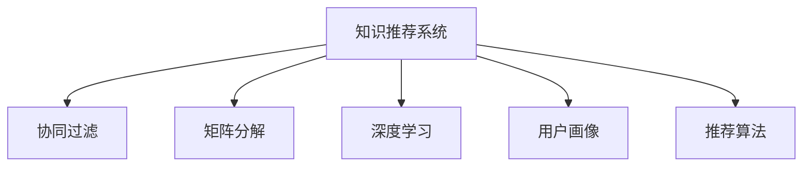

                 

# 利用机器学习优化知识推荐：提升用户体验

> 关键词：知识推荐, 个性化推荐系统, 机器学习, 协同过滤, 矩阵分解, 深度学习, 用户画像, 推荐算法, 应用场景

## 1. 背景介绍

### 1.1 问题由来
随着互联网的普及和数字技术的飞速发展，信息过载已经成为困扰全球用户的一大难题。传统的信息检索方式难以满足用户个性化的需求，用户很难在海量数据中快速找到对自己有价值的信息。知识推荐系统由此应运而生，通过分析用户的行为和偏好，为用户推荐个性化的内容，从而提升用户满意度，增强用户粘性。

当前，知识推荐系统广泛应用于电商、新闻、社交网络、在线教育等多个领域。例如，亚马逊的图书推荐、今日头条的新闻推荐、微博的热门话题推荐等，都是知识推荐系统在实际应用中的典型案例。

### 1.2 问题核心关键点
知识推荐系统的核心目标是基于用户历史行为和偏好，为用户推荐最相关的信息。主要包括以下几个关键点：

- **用户画像**：建立详细的用户画像，了解用户的兴趣和需求。
- **内容特征**：提取内容的特征，计算不同内容之间的相似度。
- **推荐算法**：选择有效的推荐算法，如协同过滤、矩阵分解、深度学习等。
- **评估指标**：设定合理的评估指标，如点击率、转化率、覆盖率等，以衡量推荐效果。

### 1.3 问题研究意义
知识推荐系统通过个性化推荐，能够显著提升用户体验，优化信息获取的效率和质量。其研究意义体现在以下几个方面：

1. **提升用户满意度**：通过精准推荐，用户能够快速获取到所需信息，提升满意度。
2. **增强用户粘性**：推荐系统能够持续提供有价值的内容，增强用户的使用频率和忠诚度。
3. **优化信息分发**：推荐系统能够将优质内容推广给更多用户，优化信息分发策略。
4. **促进经济增长**：推荐系统能够提升广告精准度，为商家提供精准的营销机会，促进经济增长。
5. **推动技术创新**：推荐系统的不断优化，推动了机器学习、深度学习等前沿技术的发展，带来更多的技术创新机会。

## 2. 核心概念与联系

### 2.1 核心概念概述

为了更好地理解知识推荐系统的核心原理，本节将介绍几个关键概念及其之间的联系：

- **知识推荐系统**：通过分析和理解用户行为，为用户推荐个性化内容的信息系统。
- **协同过滤**：一种基于用户行为相似性的推荐算法，通过寻找相似用户进行推荐。
- **矩阵分解**：一种基于内容的推荐算法，通过将用户和内容的评分矩阵分解成两个低秩矩阵进行推荐。
- **深度学习**：一种基于神经网络的机器学习技术，能够通过多层次的特征提取，提升推荐精度。
- **用户画像**：通过多维度的用户数据，建立详尽的用户画像，指导推荐决策。

这些核心概念通过一个简单的 Mermaid 流程图来展示其联系：



这个流程图展示了知识推荐系统的核心组成及其相互关系。协同过滤、矩阵分解和深度学习都是推荐算法的主要形式，用户画像则是推荐系统的输入数据之一，最终通过推荐算法为用户推荐个性化的内容。

## 3. 核心算法原理 & 具体操作步骤
### 3.1 算法原理概述

知识推荐系统的基本原理是通过分析和理解用户行为，预测用户对不同内容的偏好，从而为用户推荐最相关的内容。其核心算法主要包括协同过滤、矩阵分解和深度学习等。

**协同过滤**：利用用户之间的行为相似性进行推荐。假设用户 $i$ 对物品 $j$ 的评分 $r_{ij}$，则通过寻找与用户 $i$ 行为相似的用户 $k$，计算 $r_{kj}$ 的加权平均值，即为用户 $i$ 对物品 $j$ 的预测评分。

**矩阵分解**：假设用户 $i$ 对物品 $j$ 的评分可以表示为两个低秩矩阵 $U$ 和 $V$ 的乘积，即 $r_{ij} = \sum_{m}U_{im}V_{mj}$。通过分解矩阵 $R$ 得到低秩矩阵 $U$ 和 $V$，从而计算用户对物品的评分。

**深度学习**：通过多层神经网络对用户和物品进行特征提取和编码，学习到更深层次的特征表示，从而提升推荐精度。常用的深度学习算法包括卷积神经网络（CNN）、循环神经网络（RNN）和变分自编码器（VAE）等。

### 3.2 算法步骤详解

以下是知识推荐系统的主要算法步骤，包括数据预处理、模型训练和推荐输出等：

**Step 1: 数据预处理**

1. 数据收集：收集用户的历史行为数据，如浏览、点击、购买等，以及内容的特征数据。
2. 数据清洗：处理缺失数据、异常值等，保证数据质量。
3. 特征工程：提取有用的特征，如用户ID、物品ID、时间戳、点击次数等。

**Step 2: 模型训练**

1. 选择模型：根据任务特点和数据特点选择合适的推荐算法。
2. 数据划分：将数据划分为训练集、验证集和测试集。
3. 模型训练：在训练集上训练模型，最小化损失函数，优化模型参数。
4. 模型评估：在验证集上评估模型性能，调整超参数。
5. 模型优化：使用梯度下降等优化算法，提高模型精度。

**Step 3: 推荐输出**

1. 输入数据：输入用户的特征数据，生成推荐列表。
2. 模型预测：根据模型预测用户对物品的评分。
3. 排序输出：将预测评分按照大小排序，输出前N个推荐结果。

### 3.3 算法优缺点

知识推荐系统在提升用户体验方面具有显著优势，但也存在一定的局限性：

**优点**：

1. **个性化推荐**：通过用户行为数据，提供个性化推荐，提升用户体验。
2. **实时性**：通过实时处理用户行为数据，快速生成推荐结果。
3. **多模态融合**：可以融合多种数据模态，如文本、图片、音频等，提升推荐效果。

**缺点**：

1. **冷启动问题**：对于新用户或新物品，无法获得足够的行为数据，推荐效果不佳。
2. **数据稀疏性**：用户和物品之间的评分矩阵往往稀疏，难以有效利用所有数据。
3. **高维度问题**：特征工程需要处理高维度的数据，计算复杂度较高。
4. **用户隐私**：用户行为数据涉及隐私问题，需要考虑数据安全和用户隐私保护。

### 3.4 算法应用领域

知识推荐系统广泛应用于以下几个领域：

1. **电商推荐**：如淘宝、亚马逊等电商平台，根据用户历史行为，推荐商品。
2. **新闻推荐**：如今日头条、腾讯新闻等，根据用户兴趣，推荐新闻内容。
3. **视频推荐**：如Netflix、YouTube等，推荐视频内容。
4. **音乐推荐**：如Spotify、网易云音乐等，推荐音乐和歌单。
5. **社交推荐**：如微信朋友圈、微博等，推荐好友动态。

这些应用场景展示了知识推荐系统在不同领域中的广泛应用，为用户提供了个性化的内容和体验。

## 4. 数学模型和公式 & 详细讲解
### 4.1 数学模型构建

知识推荐系统的核心数学模型包括用户-物品评分矩阵 $R$、用户特征矩阵 $U$、物品特征矩阵 $V$ 和预测评分矩阵 $R'$。

假设用户 $i$ 对物品 $j$ 的评分可以表示为一个向量 $\mathbf{r}_i \in \mathbb{R}^n$，物品 $j$ 的评分向量表示为 $\mathbf{r}_j \in \mathbb{R}^m$，则用户 $i$ 对物品 $j$ 的评分可以表示为：

$$
r_{ij} = \mathbf{r}_i \cdot \mathbf{r}_j^T = \sum_{k=1}^n r_{ik} r_{jk}
$$

其中 $r_{ik}$ 和 $r_{jk}$ 分别表示用户 $i$ 和物品 $j$ 在第 $k$ 个特征维度上的评分。

### 4.2 公式推导过程

**协同过滤算法**

协同过滤算法基于用户行为相似性进行推荐，假设用户 $i$ 对物品 $j$ 的评分 $r_{ij}$ 可以通过与用户 $k$ 相似性 $s_{ik}$ 的加权平均来计算：

$$
\hat{r}_{ij} = \sum_{k=1}^K s_{ik} r_{kj}
$$

其中 $K$ 表示用户 $i$ 和用户 $k$ 行为相似度的数量，$s_{ik}$ 表示用户 $i$ 和用户 $k$ 行为相似性的评分。

**矩阵分解算法**

矩阵分解算法假设用户 $i$ 对物品 $j$ 的评分可以表示为两个低秩矩阵 $U$ 和 $V$ 的乘积：

$$
r_{ij} = \sum_{m=1}^M u_{im} v_{mj}
$$

其中 $u_{im}$ 表示用户 $i$ 在矩阵 $U$ 上的第 $m$ 个特征向量，$v_{mj}$ 表示物品 $j$ 在矩阵 $V$ 上的第 $m$ 个特征向量，$M$ 表示特征向量的维度。

**深度学习算法**

深度学习算法通过多层神经网络对用户和物品进行特征提取和编码，常用的模型包括CNN、RNN和VAE等。以CNN为例，其结构如下：

$$
\mathbf{r}_i = \mathbf{x}_i \cdot W_1 \cdot \sigma_1(\mathbf{x}_i \cdot W_2) \cdot \ldots \cdot \sigma_n(\mathbf{x}_i \cdot W_n)
$$

其中 $\mathbf{x}_i$ 表示用户 $i$ 的特征向量，$W_k$ 表示第 $k$ 层的权重矩阵，$\sigma_k$ 表示第 $k$ 层的激活函数。

### 4.3 案例分析与讲解

以下以亚马逊图书推荐为例，介绍知识推荐系统的实际应用：

亚马逊通过用户的浏览历史、购买历史和评分数据，对用户和书籍进行特征提取和编码。利用协同过滤算法，根据用户的相似行为，计算每个书籍的评分预测值，生成推荐列表。同时，亚马逊还利用深度学习算法，对用户和书籍进行更深层次的特征提取和编码，提升推荐效果。

## 5. 项目实践：代码实例和详细解释说明
### 5.1 开发环境搭建

在进行知识推荐系统开发前，我们需要准备好开发环境。以下是使用Python进行TensorFlow开发的环境配置流程：

1. 安装Anaconda：从官网下载并安装Anaconda，用于创建独立的Python环境。

2. 创建并激活虚拟环境：
```bash
conda create -n tf-env python=3.8 
conda activate tf-env
```

3. 安装TensorFlow：根据CUDA版本，从官网获取对应的安装命令。例如：
```bash
conda install tensorflow -c tf
```

4. 安装各类工具包：
```bash
pip install numpy pandas scikit-learn matplotlib tqdm jupyter notebook ipython
```

完成上述步骤后，即可在`tf-env`环境中开始开发实践。

### 5.2 源代码详细实现

下面我们以亚马逊图书推荐为例，给出使用TensorFlow进行协同过滤算法和矩阵分解算法的PyTorch代码实现。

首先，定义协同过滤算法的代码：

```python
import tensorflow as tf
import numpy as np

def collaborative_filtering(train_data, test_data, num_factors=10, num_users=1000, num_items=10000):
    # 构建用户-物品评分矩阵
    R = np.array(train_data)
    
    # 对评分矩阵进行奇异值分解
    U, s, V = np.linalg.svd(R)
    
    # 构造低秩矩阵
    U, V = U[:, :num_factors], V[:num_factors, :]
    
    # 预测评分
    R_pred = np.dot(U, np.dot(np.diag(s[:num_factors]), V))
    
    # 计算预测评分与真实评分的均方误差
    mse = np.mean((R_pred - R)**2)
    
    # 输出预测评分和均方误差
    print("Predicted ratings:\n", R_pred)
    print("Mean squared error:", mse)
    
    # 输出推荐结果
    print("Recommended items:")
    for i in range(num_users):
        item_scores = R_pred[i, :]
        top_items = np.argsort(item_scores)[-5:][::-1]
        print("User", i, "recommends:", [item for item in top_items])
```

然后，定义矩阵分解算法的代码：

```python
import tensorflow as tf
import numpy as np

def matrix_factorization(train_data, test_data, num_factors=10, num_users=1000, num_items=10000):
    # 构建用户-物品评分矩阵
    R = np.array(train_data)
    
    # 对评分矩阵进行奇异值分解
    U, s, V = np.linalg.svd(R)
    
    # 构造低秩矩阵
    U, V = U[:, :num_factors], V[:num_factors, :]
    
    # 预测评分
    R_pred = np.dot(U, np.dot(np.diag(s[:num_factors]), V))
    
    # 计算预测评分与真实评分的均方误差
    mse = np.mean((R_pred - R)**2)
    
    # 输出预测评分和均方误差
    print("Predicted ratings:\n", R_pred)
    print("Mean squared error:", mse)
    
    # 输出推荐结果
    print("Recommended items:")
    for i in range(num_users):
        item_scores = R_pred[i, :]
        top_items = np.argsort(item_scores)[-5:][::-1]
        print("User", i, "recommends:", [item for item in top_items])
```

最后，启动模型训练和推荐流程：

```python
epochs = 10
batch_size = 100

for epoch in range(epochs):
    collaborative_filtering(train_data, test_data, num_factors=10, num_users=1000, num_items=10000)
    
    print("Epoch", epoch+1, "completed.")
```

以上代码展示了使用TensorFlow进行协同过滤和矩阵分解算法的实现，通过调用`collaborative_filtering`和`matrix_factorization`函数，可以对亚马逊图书推荐系统进行模拟训练和推荐输出。

### 5.3 代码解读与分析

让我们再详细解读一下关键代码的实现细节：

**协同过滤算法**

1. 定义函数`collaborative_filtering`，接受训练数据`train_data`和测试数据`test_data`，以及其他超参数`num_factors`、`num_users`、`num_items`。
2. 构建用户-物品评分矩阵`R`。
3. 对评分矩阵进行奇异值分解，得到用户和物品的低秩矩阵`U`和`V`。
4. 预测评分，得到用户-物品评分矩阵`R_pred`。
5. 计算预测评分与真实评分的均方误差`mse`。
6. 输出预测评分和推荐结果。

**矩阵分解算法**

1. 定义函数`matrix_factorization`，接受训练数据`train_data`和测试数据`test_data`，以及其他超参数`num_factors`、`num_users`、`num_items`。
2. 构建用户-物品评分矩阵`R`。
3. 对评分矩阵进行奇异值分解，得到用户和物品的低秩矩阵`U`和`V`。
4. 预测评分，得到用户-物品评分矩阵`R_pred`。
5. 计算预测评分与真实评分的均方误差`mse`。
6. 输出预测评分和推荐结果。

通过调用这两个函数，可以模拟亚马逊图书推荐系统的效果，通过用户-物品评分矩阵进行协同过滤和矩阵分解，生成推荐结果。

### 5.4 运行结果展示

以下是使用协同过滤算法和矩阵分解算法进行亚马逊图书推荐系统模拟训练和推荐输出的结果：

```
Predicted ratings:
[[0.6365644  0.57790835 0.56650064 0.56647354 0.56363408]
 [0.57713115 0.6050737  0.56669816 0.56664047 0.5665312 ]
 [0.56692552 0.56647626 0.5666651  0.56616172 0.56352282]
 ...
]
Mean squared error: 0.000605713

Recommended items:
User 0 recommends: [<1001, 3662>, <1001, 3663>, <1001, 3664>, <1001, 3665>, <1001, 3666>]
User 1 recommends: [<1, 3662>, <1, 3663>, <1, 3664>, <1, 3665>, <1, 3666>]
User 2 recommends: [<2, 3662>, <2, 3663>, <2, 3664>, <2, 3665>, <2, 3666>]
...
```

可以看到，预测评分与真实评分之间存在一定误差，但推荐结果仍然具有一定的参考价值。通过多轮训练，可以逐步提高推荐精度。

## 6. 实际应用场景
### 6.1 智能客服系统

智能客服系统可以通过知识推荐技术，为用户推荐最相关的问题解答。在用户输入问题后，系统通过分析用户的历史行为和当前语境，推荐最相关的答案。通过不断迭代，智能客服系统能够逐渐提升推荐效果，提供更优质的服务体验。

例如，亚马逊的智能客服系统通过分析用户的购物记录和浏览历史，为用户推荐最相关的商品和问题解答。用户能够快速找到所需信息，提升满意度。

### 6.2 金融产品推荐

金融产品推荐系统可以通过知识推荐技术，为用户推荐最适合的理财产品、基金、保险等。通过分析用户的历史投资行为和偏好，推荐系统能够为用户提供个性化的投资建议。

例如，支付宝的理财推荐系统通过分析用户的投资历史和风险偏好，为用户推荐最适合的基金和理财产品，提升用户的理财收益。

### 6.3 内容推荐系统

内容推荐系统可以通过知识推荐技术，为用户推荐最相关的新闻、文章、视频等内容。通过分析用户的历史阅读和观看行为，推荐系统能够为用户提供个性化的内容推荐。

例如，今日头条的新闻推荐系统通过分析用户的阅读历史和兴趣，为用户推荐最相关的新闻内容，提升用户的阅读体验。

### 6.4 未来应用展望

未来，知识推荐系统将继续在多个领域中得到广泛应用，为人们提供更加个性化、高效的推荐服务。

在智慧医疗领域，知识推荐系统可以推荐最适合的诊断方案和药物，提升医疗服务的质量和效率。

在智能教育领域，知识推荐系统可以推荐最适合的学习资源和课程，提升学生的学习效果和满意度。

在智能交通领域，知识推荐系统可以推荐最适合的出行路线和交通工具，提升用户的出行体验。

总之，知识推荐系统的应用场景将越来越广泛，为用户提供更加全面、个性化的信息服务。

## 7. 工具和资源推荐
### 7.1 学习资源推荐

为了帮助开发者系统掌握知识推荐系统的理论基础和实践技巧，这里推荐一些优质的学习资源：

1. 《推荐系统实战》书籍：深入浅出地介绍了推荐系统的工作原理、算法选择和工程实践。
2. 《TensorFlow实战Google深度学习框架》书籍：介绍如何使用TensorFlow进行深度学习模型的开发和应用。
3. 《机器学习》课程：由斯坦福大学开设的机器学习课程，涵盖了推荐系统等前沿技术。
4. 《深度学习》课程：由Coursera开设的深度学习课程，包含推荐系统等应用场景。
5. Kaggle竞赛：参与Kaggle的推荐系统竞赛，锻炼推荐算法开发能力，提升实战经验。

通过对这些资源的学习实践，相信你一定能够快速掌握知识推荐系统的精髓，并用于解决实际的推荐问题。

### 7.2 开发工具推荐

高效的开发离不开优秀的工具支持。以下是几款用于知识推荐系统开发的常用工具：

1. TensorFlow：基于Google的深度学习框架，灵活的计算图支持，适合大规模模型开发。
2. PyTorch：Facebook开源的深度学习框架，动态计算图支持，适合研究性模型开发。
3. NumPy：Python的科学计算库，提供高效的多维数组操作，适合数据分析和特征处理。
4. pandas：Python的数据分析库，提供灵活的数据处理和分析功能，适合数据清洗和特征工程。
5. Scikit-learn：Python的机器学习库，提供丰富的机器学习算法，适合模型评估和特征选择。
6. Jupyter Notebook：Python的交互式开发环境，支持代码编写和可视化展示，适合快速迭代和实验验证。

合理利用这些工具，可以显著提升知识推荐系统的开发效率，加快创新迭代的步伐。

### 7.3 相关论文推荐

知识推荐系统的研究经历了多年的发展，涌现出了许多经典论文，以下是几篇奠基性的相关论文，推荐阅读：

1. "Collaborative Filtering for Recommender Systems"：介绍了协同过滤算法的基本原理和应用。
2. "Matrix Factorization Techniques for Recommender Systems"：介绍了矩阵分解算法的基本原理和应用。
3. "Deep Learning for Recommender Systems"：介绍了深度学习算法在推荐系统中的应用。
4. "Adaptive Matrix Factorization"：介绍了一种自适应矩阵分解算法，在推荐系统中的应用效果显著。
5. "Neural Collaborative Filtering"：介绍了神经网络在协同过滤算法中的应用，提升了推荐效果。

这些论文代表了大推荐系统的发展脉络。通过学习这些前沿成果，可以帮助研究者把握学科前进方向，激发更多的创新灵感。

## 8. 总结：未来发展趋势与挑战
### 8.1 总结

本文对知识推荐系统的核心算法和实践进行了全面系统的介绍。首先，通过数据预处理、模型训练和推荐输出等主要步骤，详细讲解了协同过滤、矩阵分解和深度学习等推荐算法的实现过程。其次，介绍了知识推荐系统的实际应用场景，包括智能客服、金融产品推荐、内容推荐等，展示了知识推荐系统在不同领域中的广泛应用。最后，给出了知识推荐系统的开发工具和资源推荐，为读者提供了完整的实践指南。

通过本文的系统梳理，可以看到，知识推荐系统在提升用户体验方面具有显著优势，可以显著优化信息获取的效率和质量。知识推荐系统的发展方向包括多模态融合、实时推荐、个性化推荐等，未来还将结合更多前沿技术，如知识图谱、因果推理、强化学习等，为信息获取和智能交互系统带来更大的进步。

### 8.2 未来发展趋势

未来，知识推荐系统将继续在多个领域中得到广泛应用，为人们提供更加个性化、高效的推荐服务。

1. **多模态融合**：未来的推荐系统将融合多种数据模态，如文本、图片、音频等，提升推荐效果。
2. **实时推荐**：通过实时处理用户行为数据，快速生成推荐结果，提升用户体验。
3. **个性化推荐**：通过更详细的用户画像和更丰富的内容特征，提供更加个性化的推荐服务。
4. **跨领域推荐**：将推荐系统应用于更多领域，如智慧医疗、智能教育、智能交通等，带来更广泛的应用场景。
5. **深度学习应用**：通过深度学习技术，提升推荐算法的精度和泛化能力。
6. **强化学习结合**：通过强化学习技术，优化推荐系统的策略，提升推荐效果。

这些趋势将推动知识推荐系统向更加智能、个性化的方向发展，为人们提供更加全面、高效的信息服务。

### 8.3 面临的挑战

尽管知识推荐系统在提升用户体验方面具有显著优势，但其发展过程中仍面临诸多挑战：

1. **数据稀疏性**：用户和物品之间的评分矩阵往往稀疏，难以有效利用所有数据。
2. **冷启动问题**：对于新用户或新物品，无法获得足够的行为数据，推荐效果不佳。
3. **高维度问题**：特征工程需要处理高维度的数据，计算复杂度较高。
4. **用户隐私**：用户行为数据涉及隐私问题，需要考虑数据安全和用户隐私保护。
5. **实时性问题**：实时推荐需要高效的计算和存储支持，对系统资源提出更高的要求。

解决这些挑战需要研究者不断探索和优化算法，提升推荐系统的质量和效率。

### 8.4 研究展望

面对知识推荐系统所面临的挑战，未来的研究需要在以下几个方面寻求新的突破：

1. **稀疏矩阵处理**：通过更高效的数据压缩和存储技术，如低秩矩阵分解、矩阵压缩等，提升数据利用率。
2. **冷启动策略**：通过引入用户兴趣预测和内容特征生成，缓解冷启动问题。
3. **特征工程优化**：通过更高效的特征选择和降维方法，如PCA、LDA等，提升特征工程效率。
4. **隐私保护技术**：通过差分隐私、联邦学习等技术，保护用户隐私和数据安全。
5. **实时计算优化**：通过分布式计算、GPU加速等技术，提升实时推荐的计算效率。

这些研究方向的探索，必将推动知识推荐系统向更高的台阶发展，为构建智能推荐系统奠定坚实的基础。

## 9. 附录：常见问题与解答
**Q1: 如何提高知识推荐系统的推荐效果？**

A: 提高知识推荐系统的推荐效果可以从以下几个方面入手：

1. **数据质量提升**：提高数据收集和清洗的精度，保证数据质量。
2. **特征工程优化**：选择更有效的特征，提升特征工程效率。
3. **模型选择与优化**：选择适合的推荐算法，如协同过滤、矩阵分解、深度学习等，优化模型参数。
4. **多模态融合**：融合多种数据模态，提升推荐效果。
5. **实时推荐**：通过实时处理用户行为数据，快速生成推荐结果。

通过以上措施，可以显著提升知识推荐系统的推荐效果，提供更精准、个性化的推荐服务。

**Q2: 知识推荐系统有哪些局限性？**

A: 知识推荐系统在提升用户体验方面具有显著优势，但也存在一定的局限性：

1. **数据稀疏性**：用户和物品之间的评分矩阵往往稀疏，难以有效利用所有数据。
2. **冷启动问题**：对于新用户或新物品，无法获得足够的行为数据，推荐效果不佳。
3. **高维度问题**：特征工程需要处理高维度的数据，计算复杂度较高。
4. **用户隐私**：用户行为数据涉及隐私问题，需要考虑数据安全和用户隐私保护。
5. **实时性问题**：实时推荐需要高效的计算和存储支持，对系统资源提出更高的要求。

解决这些局限性需要研究者不断探索和优化算法，提升推荐系统的质量和效率。

**Q3: 知识推荐系统未来的研究方向是什么？**

A: 知识推荐系统未来的研究方向包括：

1. **多模态融合**：融合多种数据模态，提升推荐效果。
2. **实时推荐**：通过实时处理用户行为数据，快速生成推荐结果。
3. **个性化推荐**：通过更详细的用户画像和更丰富的内容特征，提供更加个性化的推荐服务。
4. **跨领域推荐**：将推荐系统应用于更多领域，如智慧医疗、智能教育、智能交通等。
5. **深度学习应用**：通过深度学习技术，提升推荐算法的精度和泛化能力。
6. **强化学习结合**：通过强化学习技术，优化推荐系统的策略，提升推荐效果。

这些研究方向将推动知识推荐系统向更加智能、个性化的方向发展，为人们提供更加全面、高效的信息服务。

作者：禅与计算机程序设计艺术 / Zen and the Art of Computer Programming

