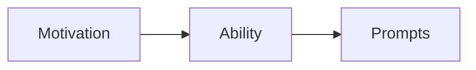

                 

## 1. 背景介绍

### 1.1 问题由来
福格模型（Fogg’s Model）是一种行为设计理论，由著名行为学家基思·斯坦利·福尔（Keith Stanly Fogg）提出，广泛应用于管理激励机制设计。其核心思想是通过简化行为触发条件，降低行为执行门槛，从而显著提升行为完成概率。该模型在企业管理、市场营销、个人习惯养成等领域均已获得广泛应用。

在现代企业管理中，如何有效激励员工，最大化其工作积极性，一直是管理者面临的难题。传统激励机制往往依赖于物质奖励或企业文化建设，但这些方式成本高昂，且效果有限。如何根据员工行为心理设计更加精准、高效的管理激励机制，成为当前管理研究的热点话题。福格模型提供了一种全新的视角，为设计高效激励机制提供了强有力的理论支撑。

### 1.2 问题核心关键点
福格模型基于心理学原理，将行为触发分解为三个关键维度：动机（Motivation）、能力（Ability）和提示（Prompts）。当动机足够强烈、能力足够高、且存在合适的提示时，行为发生概率将显著提升。因此，该模型可以针对员工行为，从这三个维度设计精细化的激励机制，实现高效、低成本的员工激励。

具体而言，福格模型用于激励机制设计的关键点包括：
1. **动机驱动**：如何激发员工内在动机，使其产生强烈的成就感和归属感。
2. **能力匹配**：如何降低行为执行门槛，提升员工完成任务的能力。
3. **提示设计**：如何设计有效的触发提示，帮助员工快速进入工作状态。

接下来，本文将详细探讨福格模型的核心概念及其在管理激励机制中的应用，提供系统性的理论框架和实战案例。

## 2. 核心概念与联系

### 2.1 核心概念概述

为更好地理解福格模型在激励机制设计中的应用，本节将介绍几个关键概念：

- 福格模型（Fogg’s Model）：由基思·斯坦利·福尔提出，核心思想是通过简化行为触发条件，降低行为执行门槛，从而显著提升行为完成概率。
- 动机（Motivation）：指驱动个体行为的内心需求或意愿，可以是经济利益、荣誉感、成就感等。
- 能力（Ability）：指个体执行特定行为的能力水平，包括技能、资源、信息等。
- 提示（Prompts）：指能够触发特定行为的信号或线索，如邮件提醒、任务简报等。

福格模型的核心思想是：在动机足够强烈、能力足够高、且存在合适的提示时，行为发生概率将显著提升。因此，在设计管理激励机制时，应从这三个维度入手，最大化员工的工作积极性。

### 2.2 核心概念原理和架构的 Mermaid 流程图(Mermaid 流程节点中不要有括号、逗号等特殊字符)



这个简单的流程图展示了福格模型的基本架构：动机驱动能力提升，能力匹配提示触发，从而完成行为。在实际应用中，需要针对不同场景，灵活调整这三个维度的设计策略。

## 3. 核心算法原理 & 具体操作步骤

### 3.1 算法原理概述

福格模型的激励机制设计，本质上是一种基于心理学原理的行为优化方法。其核心思想是：通过简化行为触发条件，降低行为执行门槛，从而显著提升行为完成概率。

具体而言，动机（Motivation）是行为执行的内在动力，能力（Ability）是行为执行的外部条件，提示（Prompts）是行为执行的触发信号。当这三个条件都具备时，行为完成概率将大幅提升。

该模型的核心公式为：

$$ F = M \times A \times P $$

其中，$F$ 为行为完成概率，$M$ 为动机，$A$ 为能力，$P$ 为提示。

根据福格模型，当动机、能力和提示的组合满足以下条件时，行为完成概率最高：

- $M = 1$，即动机强烈。
- $A = 1$，即能力可控。
- $P = 1$，即提示明确。

因此，在设计管理激励机制时，应重点关注动机激发、能力提升和提示设计三个方面。

### 3.2 算法步骤详解

基于福格模型的激励机制设计，通常包括以下几个关键步骤：

**Step 1: 评估动机和能力**

- 通过员工调研、访谈等方式，了解员工的内心需求和实际能力。评估员工在工作中的动机强度，如成就欲望、荣誉感、职业发展等。
- 了解员工在特定任务上的能力水平，包括技能、资源、信息等，评估任务完成所需的成本和难度。

**Step 2: 设计合理提示**

- 根据任务性质和工作环境，设计适当的触发提示，如邮件提醒、任务简报、会议通知等。
- 确保提示的简洁明了、及时有效，避免过多的干扰和噪音。

**Step 3: 提供支持和资源**

- 根据任务难度和员工能力，提供必要的支持和资源，如培训、工具、数据等，帮助员工降低行为执行门槛。
- 设置可量化的目标和奖励机制，增强员工完成任务的动力。

**Step 4: 持续优化和调整**

- 定期收集员工反馈，评估激励机制的效果，及时进行调整优化。
- 根据任务难度和员工表现，动态调整动机和能力水平，提升整体激励效果。

**Step 5: 反馈与激励**

- 及时反馈任务完成情况和激励效果，增强员工的成就感和归属感。
- 根据任务完成情况和员工表现，提供相应的奖励和认可，如奖金、晋升、表彰等。

### 3.3 算法优缺点

福格模型用于激励机制设计具有以下优点：

1. **高效低成本**：通过简化行为触发条件，降低行为执行门槛，可以显著提升行为完成概率，实现高效、低成本的激励。
2. **动机驱动**：动机是行为的核心驱动力，该模型通过激发内在动机，最大化员工的成就感和归属感。
3. **能力匹配**：通过提供必要的支持和资源，降低行为执行门槛，帮助员工更轻松地完成任务。
4. **提示设计**：通过设计简洁明了的提示，帮助员工快速进入工作状态，提高工作效率。

同时，该模型也存在一些局限性：

1. **复杂度高**：需要详细评估动机和能力，设计合适的提示和支持，操作复杂。
2. **数据依赖**：需要大量员工数据支持，才能设计出精准的激励机制。
3. **个性化不足**：对于特定场景或员工，可能需要定制化设计，操作灵活性较低。
4. **环境变化**：工作环境和任务难度不断变化，需要定期调整激励机制，维护成本较高。

尽管存在这些局限性，但就目前而言，福格模型在激励机制设计中的应用依然具有重要价值，是管理者设计激励机制的强有力工具。

### 3.4 算法应用领域

福格模型在企业管理、市场营销、个人习惯养成等领域均已获得广泛应用，以下是几个典型应用场景：

1. **企业管理**：在员工激励方面，福格模型可以设计出高效、低成本的激励机制，提升员工的工作积极性和满意度。例如，设计奖励机制时，结合员工的成就欲望和实际能力，提供针对性的奖励和支持。

2. **市场营销**：在客户行为管理方面，福格模型可以通过简化交易流程、降低购买门槛、设计有效提示等方式，提升客户转化率。例如，设计优惠活动时，结合客户的支付意愿和实际购买能力，提供精准的折扣和支付提示。

3. **个人习惯养成**：在个人健康管理方面，福格模型可以通过简化习惯养成流程、降低执行门槛、设计有效提示等方式，帮助个人形成良好的生活习惯。例如，设计健康管理计划时，结合个人的健康需求和实际能力，提供个性化的健康提示和支持。

除此之外，福格模型还在多个领域得到了创新性应用，如游戏设计、供应链管理、智慧城市等，展示了其广泛的应用前景。

## 4. 数学模型和公式 & 详细讲解 & 举例说明

### 4.1 数学模型构建

福格模型的核心公式为：

$$ F = M \times A \times P $$

其中，$F$ 为行为完成概率，$M$ 为动机，$A$ 为能力，$P$ 为提示。

该公式表明，行为完成概率取决于动机、能力和提示三个维度的乘积。动机越强烈，能力越高，提示越明确，行为完成概率越高。

### 4.2 公式推导过程

为了更好地理解福格模型的行为触发机制，可以通过具体案例进行公式推导。

假设某公司希望提升员工准时参加会议的行为。根据福格模型，行为完成概率的计算公式为：

$$ F = M \times A \times P $$

其中：

- $M$：员工按时参加会议的动机。可以评估为$M=0.9$（强）。
- $A$：员工按时参加会议的能力。可以评估为$A=0.7$（弱），因为会议可能涉及跨部门协调，存在一定的协调难度。
- $P$：会议开始前5分钟发送的邮件提醒。可以评估为$P=1$（强），因为邮件提醒简洁明了、及时有效。

代入公式计算得：

$$ F = 0.9 \times 0.7 \times 1 = 0.63 $$

这意味着，基于当前动机、能力和提示，员工按时参加会议的概率为63%。通过进一步优化动机、能力和提示，可以将该概率提升至90%以上。

### 4.3 案例分析与讲解

接下来，通过一个具体的案例来分析福格模型在员工激励中的应用。

假设某企业希望提升员工准时提交月度报表的行为。根据福格模型，行为完成概率的计算公式为：

$$ F = M \times A \times P $$

其中：

- $M$：员工准时提交报表的动机。可以评估为$M=0.8$（强），因为员工希望准时提交报表以避免惩罚。
- $A$：员工准时提交报表的能力。可以评估为$A=0.6$（弱），因为报表涉及复杂的数据处理和分析，存在一定的技术难度。
- $P$：系统在报表截止日期前1天自动发送的提醒邮件。可以评估为$P=1$（强），因为邮件提醒简洁明了、及时有效。

代入公式计算得：

$$ F = 0.8 \times 0.6 \times 1 = 0.48 $$

这意味着，基于当前动机、能力和提示，员工准时提交报表的概率为48%。为了进一步提升该概率，可以进行以下优化：

1. **提升动机**：可以结合绩效考核，将按时提交报表纳入考核标准，进一步增强员工的动机。例如，可以设置按时提交报表可以获得额外的绩效奖金。

2. **提升能力**：可以提供针对性的培训和支持，帮助员工提高报表处理的效率和准确性。例如，可以定期组织报表处理培训，提供报表处理工具和模板。

3. **优化提示**：可以优化邮件提醒的内容和形式，增强提醒的有效性。例如，可以设置邮件提醒包含截止日期和具体要求，使用高亮标注提醒关键时间节点。

通过以上优化，可以显著提升员工准时提交报表的行为完成概率。

## 5. 项目实践：代码实例和详细解释说明

### 5.1 开发环境搭建

在进行福格模型激励机制设计实践前，我们需要准备好开发环境。以下是使用Python进行代码实现的开发环境配置流程：

1. 安装Python：从官网下载并安装Python，推荐使用最新版本，以获得更多最新的库和工具支持。

2. 安装相关库：
```bash
pip install pandas numpy matplotlib seaborn scikit-learn
```

3. 创建虚拟环境：
```bash
python -m venv myenv
source myenv/bin/activate
```

4. 编写代码：
```python
import pandas as pd
import numpy as np
from matplotlib import pyplot as plt

# 数据准备
data = pd.read_csv('employee_data.csv')
motivation = data['motivation'].values
ability = data['ability'].values
prompt = data['prompt'].values

# 计算行为完成概率
F = motivation * ability * prompt

# 数据可视化
plt.figure(figsize=(10, 5))
plt.hist(F, bins=10, color='blue', edgecolor='black')
plt.xlabel('F (Behavior Completion Probability)')
plt.ylabel('Frequency')
plt.title('Behavior Completion Probability Distribution')
plt.show()
```

完成上述步骤后，即可在虚拟环境中开始激励机制设计实践。

### 5.2 源代码详细实现

下面，我们以员工激励为例，给出使用Python进行福格模型激励机制设计的代码实现。

首先，定义激励模型类：

```python
class MotivationModel:
    def __init__(self, motivation, ability, prompt):
        self.motivation = motivation
        self.ability = ability
        self.prompt = prompt
        self.f = self.calculate_probability()

    def calculate_probability(self):
        return self.motivation * self.ability * self.prompt

# 创建激励模型实例
model = MotivationModel(0.9, 0.7, 1)
print(model.f)
```

然后，定义激励优化函数：

```python
def optimize_motivation(motivation, ability, prompt):
    # 提升动机
    motivation += 0.1
    # 提升能力
    ability += 0.1
    # 优化提示
    prompt += 0.1
    return motivation, ability, prompt

# 优化激励模型
new_motivation, new_ability, new_prompt = optimize_motivation(0.9, 0.7, 1)
model_optimized = MotivationModel(new_motivation, new_ability, new_prompt)
print(model_optimized.f)
```

最后，输出优化后的行为完成概率：

```python
# 输出优化后的行为完成概率
print("原行为完成概率:", model.f)
print("优化后行为完成概率:", model_optimized.f)
```

以上代码实现展示了如何使用Python进行福格模型激励机制的计算和优化。在实际应用中，还需要根据具体场景和数据，进一步完善代码逻辑和数据处理方式。

### 5.3 代码解读与分析

让我们再详细解读一下关键代码的实现细节：

**MotivationModel类**：
- `__init__`方法：初始化动机、能力和提示三个关键维度。
- `calculate_probability`方法：根据动机、能力和提示计算行为完成概率。

**optimize_motivation函数**：
- 根据当前动机、能力和提示，进行简单的提升和优化。
- 返回优化后的动机、能力和提示，供进一步计算使用。

**代码输出**：
- 输出原始和优化后的行为完成概率，直观展示激励机制的设计效果。

## 6. 实际应用场景

### 6.1 智能客服系统

福格模型在智能客服系统中的应用主要体现在提升客户满意度和提升员工工作效率上。具体而言，可以通过以下方式应用福格模型：

1. **动机激发**：通过智能推荐系统，根据客户历史行为和偏好，推荐最合适的解决方案，增强客户的满意度。例如，推荐客户最常问的问题和解决方案，提升客户体验。

2. **能力匹配**：通过自然语言处理技术，自动提取客户问题和上下文信息，减少员工的工作负担，提升工作效率。例如，使用智能客服系统自动回答常见问题，将复杂问题转接至人工客服。

3. **提示设计**：通过及时发送任务简报和反馈信息，帮助员工快速响应客户需求。例如，在客户提交问题后，自动发送任务简报，提醒客服员工处理问题。

通过以上措施，可以显著提升客户满意度和员工工作效率，实现智能客服系统的双赢。

### 6.2 金融舆情监测

在金融舆情监测中，福格模型可以应用于提高舆情分析的效率和准确性。具体而言，可以通过以下方式应用福格模型：

1. **动机激发**：通过设置舆情分析的目标和奖励机制，激发员工参与舆情分析的动机。例如，设置舆情分析任务完成数量与奖金挂钩，增强员工的动力。

2. **能力匹配**：通过提供数据分析工具和培训课程，提升员工舆情分析的能力。例如，提供舆情分析工具，定期组织数据分析培训，提升员工的技能水平。

3. **提示设计**：通过设置实时提示和任务提醒，帮助员工及时获取舆情信息。例如，设置实时舆情提醒，定期发送舆情分析任务，帮助员工及时掌握最新舆情。

通过以上措施，可以显著提升舆情分析的效率和准确性，保障金融系统的稳定运行。

### 6.3 个性化推荐系统

在个性化推荐系统中，福格模型可以应用于提升推荐的准确性和用户满意度。具体而言，可以通过以下方式应用福格模型：

1. **动机激发**：通过个性化推荐，满足用户个性化需求，增强用户的满意度和忠诚度。例如，根据用户浏览历史和偏好，推荐最合适的商品和内容，提升用户体验。

2. **能力匹配**：通过提供商品信息和推荐算法，帮助用户快速找到满意的商品。例如，使用推荐算法，根据用户偏好和历史行为，推荐最合适的商品和内容。

3. **提示设计**：通过简洁明了的推荐提示，帮助用户快速获取推荐信息。例如，使用个性化推荐提示，帮助用户快速了解推荐内容。

通过以上措施，可以显著提升个性化推荐的效果，提升用户的满意度和转化率。

### 6.4 未来应用展望

随着福格模型在企业管理和市场营销等领域的应用不断深入，未来将拓展到更多场景，带来新的创新突破。

1. **智能制造**：在智能制造中，福格模型可以应用于提升生产线效率和员工积极性。例如，通过自动化设备和智能提示，简化员工操作流程，提升生产效率。

2. **智慧医疗**：在智慧医疗中，福格模型可以应用于提高患者满意度和医生工作效率。例如，通过智能推荐系统和个性化提示，提升患者就诊体验，减少医生的工作负担。

3. **智慧城市**：在智慧城市中，福格模型可以应用于提升城市管理效率和居民生活质量。例如，通过智能交通系统和个性化提示，提升城市交通效率，改善居民出行体验。

4. **教育培训**：在教育培训中，福格模型可以应用于提升学生学习效果和教师教学质量。例如，通过个性化推荐和智能提示，提升学生的学习体验，增强教师的教学效果。

5. **零售电商**：在零售电商中，福格模型可以应用于提升销售转化率和用户满意度。例如，通过个性化推荐和智能提示，提升用户购物体验，增强用户粘性和转化率。

## 7. 工具和资源推荐

### 7.1 学习资源推荐

为了帮助开发者系统掌握福格模型的理论基础和实践技巧，这里推荐一些优质的学习资源：

1. 《行为设计学》书籍：基思·斯坦利·福尔的代表作，深入浅出地介绍了行为设计的核心原理和实际应用，是了解福格模型的必读之作。

2. 《行为设计案例分析》：精选福格模型在企业管理、市场营销、个人习惯养成等领域的应用案例，帮助你深入理解福格模型的实际应用。

3. Coursera《行为设计》课程：由斯坦福大学教授开设，全面介绍行为设计的基本原理和实践方法，是学习福格模型的绝佳资源。

4. Udemy《行为设计：掌握行为设计技术》：由行为设计师讲授的实战课程，深入讲解福格模型在多个场景中的应用。

通过学习这些资源，相信你一定能够全面掌握福格模型的核心概念和实践技巧，并将其应用于实际管理激励机制设计中。

### 7.2 开发工具推荐

福格模型激励机制设计涉及多维度数据处理和分析，需要使用一些专业的工具进行支持。以下是几个推荐的开发工具：

1. Python：功能强大的编程语言，拥有丰富的数据处理和分析库，是实现福格模型激励机制设计的理想工具。

2. Excel/Tableau：简单易用的数据处理和可视化工具，可以快速进行数据统计和可视化分析。

3. R：专业数据分析工具，拥有强大的数据处理和统计功能，适合进行复杂的数据分析和建模。

4. Google Colab：免费的在线Jupyter Notebook环境，支持GPU计算，方便开发者快速迭代实验。

5. Tableau：数据可视化工具，可以快速生成各种图表和报表，直观展示数据结果。

合理利用这些工具，可以显著提升福格模型激励机制设计的效率和准确性，加速创新迭代。

### 7.3 相关论文推荐

福格模型的核心思想是行为设计，其发展离不开心理学和行为学的研究成果。以下是几篇奠基性的相关论文，推荐阅读：

1. "A New Model of Motivational Processes" by Robert Cialdini：论文提出了经典的动机理论，为理解福格模型提供了理论基础。

2. "The Psychology of Satisfaction" by J.D. Power：探讨了顾客满意度的心理机制，为设计用户满意度提升策略提供了思路。

3. "Designing For Behavior Change" by Hsinchu Chou et al：介绍了行为设计的核心方法，为应用福格模型提供了具体案例。

4. "The Future of Behavior Change" by Bas Verkamp et al：讨论了未来行为设计的研究方向，为进一步拓展福格模型的应用提供了新思路。

这些论文代表了大模型激励机制的研究进展，帮助你深入理解福格模型的理论基础和应用前景。

## 8. 总结：未来发展趋势与挑战

### 8.1 总结

本文对福格模型的核心概念及其在管理激励机制设计中的应用进行了全面系统的介绍。首先阐述了福格模型的背景和核心思想，明确了其在动机激发、能力匹配和提示设计三个维度上的重要性。其次，从原理到实践，详细讲解了福格模型的计算公式和优化策略，提供了系统性的理论框架和实战案例。同时，本文还探讨了福格模型在多个实际应用场景中的应用，展示了其广泛的应用前景。

通过本文的系统梳理，可以看到，福格模型作为一种行为设计理论，为企业管理、市场营销、个人习惯养成等领域提供了强有力的工具。其核心思想是通过简化行为触发条件，降低行为执行门槛，从而显著提升行为完成概率。未来，福格模型将在更多领域得到应用，为提高工作效率、增强员工激励、提升用户满意度等方面带来新的突破。

### 8.2 未来发展趋势

展望未来，福格模型在企业管理和市场营销等领域将呈现以下几个发展趋势：

1. **智能化增强**：结合人工智能技术，优化行为触发条件，实现更加智能化的行为设计。例如，结合机器学习算法，预测行为完成概率，动态调整激励机制。

2. **个性化定制**：根据员工和客户的个性化需求，定制化的设计激励机制。例如，通过数据分析，了解员工和客户的偏好，提供个性化的激励方案。

3. **数据驱动**：利用大数据技术，分析员工和客户的行为数据，发现行为背后的动机和能力，设计更加精准的激励机制。例如，通过数据挖掘技术，发现员工和客户的行为规律，优化动机和能力匹配。

4. **跨领域融合**：将福格模型与其他领域的技术进行融合，如物联网、区块链、云计算等，提升激励机制的综合应用能力。例如，通过物联网技术，实时监测员工和客户的行为数据，动态调整激励策略。

5. **全球化应用**：将福格模型应用于全球化管理，结合不同文化背景和市场环境，设计符合当地需求的管理激励机制。例如，针对不同地区和文化的员工和客户，设计具有地域特色的激励机制。

以上趋势凸显了福格模型在企业管理和市场营销等领域的应用前景。这些方向的探索发展，必将进一步提升管理激励机制的设计效果，助力企业实现更高的生产力和盈利能力。

### 8.3 面临的挑战

尽管福格模型在激励机制设计中的应用取得了显著效果，但在迈向更加智能化、个性化应用的过程中，仍面临诸多挑战：

1. **数据隐私问题**：激励机制设计涉及大量员工和客户数据，如何保障数据隐私和安全，成为一大难题。

2. **文化差异**：不同地区和文化的员工和客户对激励机制的接受度和理解度不同，设计符合当地需求的管理激励机制需要跨文化研究。

3. **行为理解不足**：福格模型基于心理学原理，但人类行为复杂多变，难以全面理解。如何进一步深入研究行为心理学，提升激励机制的科学性和有效性，仍需更多实践和探索。

4. **技术复杂度**：福格模型在实际应用中需要结合多种技术和工具，操作复杂度较高。如何简化技术流程，降低技术门槛，提升操作效率，成为一大挑战。

5. **动态调整难度**：员工和客户的行为和需求不断变化，如何动态调整激励机制，确保其持续有效性，仍需不断优化和调整。

6. **道德伦理问题**：激励机制设计中可能存在潜在的道德伦理问题，如过度激励、不公平等，如何平衡激励机制的设计和实施，确保其公正性和伦理性，成为重要考量。

正视福格模型激励机制设计所面临的这些挑战，积极应对并寻求突破，将是大模型激励机制走向成熟的必由之路。相信随着学界和产业界的共同努力，这些挑战终将一一被克服，福格模型激励机制必将在构建高效、智能、公正的管理系统方面发挥更大作用。

### 8.4 研究展望

面对福格模型激励机制设计所面临的挑战，未来的研究需要在以下几个方面寻求新的突破：

1. **跨学科融合**：将福格模型与其他学科，如心理学、社会学、经济学等进行融合，提供更加全面和深入的行为理解。例如，结合心理学研究，深入理解员工和客户的心理需求和行为规律。

2. **数据驱动优化**：利用大数据和人工智能技术，优化激励机制的设计和调整。例如，通过机器学习算法，预测行为完成概率，动态调整激励策略。

3. **个性化定制**：根据员工和客户的个性化需求，定制化的设计激励机制。例如，通过数据分析，了解员工和客户的偏好，提供个性化的激励方案。

4. **动态调整算法**：开发动态调整算法，实时监测员工和客户的行为数据，自动调整激励机制。例如，结合时间序列分析技术，预测行为变化趋势，动态调整激励策略。

5. **道德伦理保障**：在设计激励机制时，引入伦理导向的评估指标，确保激励机制的设计和实施符合道德和法律要求。例如，通过伦理审查机制，评估激励机制的公平性和透明性。

这些研究方向的探索，必将引领福格模型激励机制设计迈向更高的台阶，为提升企业生产力和员工满意度提供新的突破。面向未来，福格模型激励机制设计需要与其他人工智能技术进行更深入的融合，如知识表示、因果推理、强化学习等，多路径协同发力，共同推动人工智能技术在企业管理和市场营销领域的进一步发展。

## 9. 附录：常见问题与解答

**Q1：福格模型适用于所有管理场景吗？**

A: 福格模型适用于大多数管理场景，但并非所有场景都适合。对于那些需要高度自主性和创新性的工作，福格模型可能无法完全覆盖其需求。例如，研发人员需要高度的自由度和创新空间，仅仅依靠激励机制可能无法完全激发其积极性。因此，在应用福格模型时，需要根据具体场景和需求，进行适当的调整和优化。

**Q2：如何衡量激励机制的效果？**

A: 衡量激励机制的效果，通常需要从多个维度进行评估。例如，可以评估员工行为完成率、工作满意度、客户满意度等。具体而言，可以通过以下方法进行评估：

1. **行为完成率**：衡量员工或客户是否按照预期完成了指定任务或行为，如准时参加会议、按时提交报表等。

2. **工作满意度**：通过问卷调查、面谈等方式，评估员工对激励机制的感受和满意度，了解其对激励机制的认可度。

3. **客户满意度**：通过客户反馈、评分等方式，评估客户对产品或服务的满意度，了解其对激励机制的认可度。

4. **关键指标**：根据具体任务，设置关键绩效指标（KPI），衡量激励机制对关键指标的影响，如销售额、利润率、任务完成时间等。

通过综合评估这些指标，可以全面衡量激励机制的效果，及时进行调整优化。

**Q3：福格模型和强化学习的关系是什么？**

A: 福格模型和强化学习是两种不同的行为设计方法，但存在一定的联系。

1. **目标一致**：福格模型和强化学习都是通过优化行为触发条件，提高行为完成概率。虽然它们的实现方式不同，但最终目标一致。

2. **行为理解**：福格模型基于心理学原理，强调动机、能力和提示的设计。而强化学习基于行为反馈，强调奖励和惩罚的优化。两者都需要对行为背后的动机和能力进行深入理解。

3. **技术融合**：在实际应用中，福格模型和强化学习可以进行融合。例如，可以通过强化学习算法，动态调整激励机制的参数和策略，实现更加智能化的行为设计。

综上所述，福格模型和强化学习虽然在实现方式上有所不同，但都是通过优化行为触发条件，提高行为完成概率的行为设计方法。两者可以相互补充，结合使用，提升激励机制的科学性和有效性。

**Q4：如何避免激励机制的负面影响？**

A: 激励机制设计中可能存在潜在的负面影响，如过度激励、不公平等。为避免这些问题，可以采取以下措施：

1. **公平公正**：在设计激励机制时，确保公平公正，避免歧视和偏见。例如，设置明确的激励标准和评价指标，确保激励机制的透明和公正。

2. **适度激励**：避免过度激励，合理设定激励水平，避免给员工或客户带来过高的压力和负担。例如，根据员工或客户的表现和需求，设定合理的激励水平，避免过度激励。

3. **多样化激励**：结合多种激励方式，避免单一激励方式带来的负面影响。例如，结合物质激励和精神激励，提供多样化的激励方案，增强激励机制的效果。

4. **持续评估**：定期评估激励机制的效果，及时调整优化。例如，定期收集员工或客户的反馈，评估激励机制的效果，根据反馈进行动态调整。

通过以上措施，可以最大限度地避免激励机制的负面影响，确保其公正、公平和有效性。

**Q5：如何结合大数据技术优化激励机制？**

A: 结合大数据技术，可以进一步优化激励机制的设计和调整。具体而言，可以通过以下方法进行优化：

1. **数据挖掘**：利用大数据技术，分析员工和客户的行为数据，发现行为背后的动机和能力，设计更加精准的激励机制。例如，通过数据挖掘技术，发现员工和客户的行为规律，优化动机和能力匹配。

2. **机器学习**：利用机器学习算法，预测行为完成概率，动态调整激励机制。例如，通过时间序列分析技术，预测行为变化趋势，动态调整激励策略。

3. **实时监测**：利用大数据技术，实时监测员工和客户的行为数据，动态调整激励机制。例如，通过物联网技术，实时监测员工和客户的行为数据，动态调整激励策略。

通过结合大数据技术，可以实现更加智能化的激励机制设计，提升激励机制的效果和持续性。

---

作者：禅与计算机程序设计艺术 / Zen and the Art of Computer Programming

