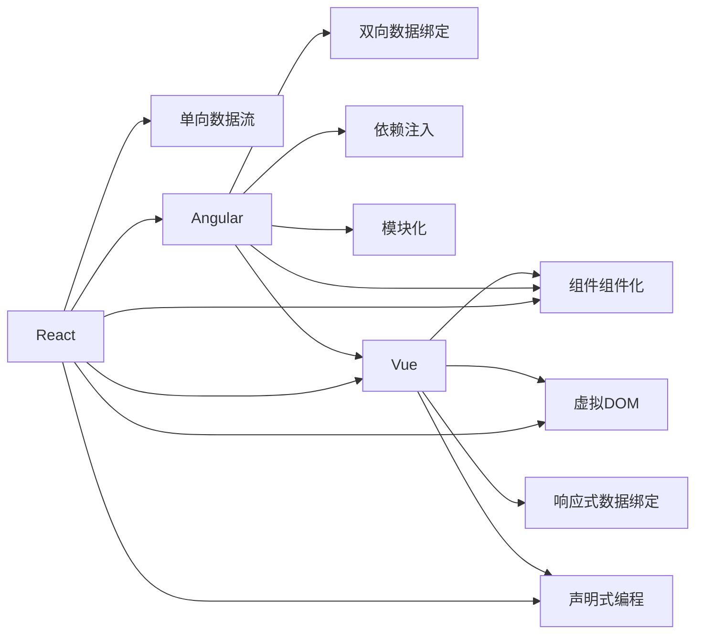

                 

# 前端框架比较：React、Angular 和 Vue 的选择

## 1. 背景介绍

### 1.1 问题由来
在现代Web开发中，前端框架扮演着至关重要的角色。它们提供了模板、路由、状态管理、数据绑定等功能，使得开发者能够更加高效地构建复杂的前端应用。目前市场上最流行的三个前端框架分别是React、Angular和Vue，它们各自拥有独特的优势和适用场景。本文将通过详细的比较和分析，帮助开发者更好地选择适合自己的框架。

### 1.2 问题核心关键点
选择合适的框架直接影响开发效率、性能、可维护性以及项目成败。本文将从以下几个方面对React、Angular和Vue进行对比，并给出最终的选择建议：

- 框架结构：核心组件和概念，以及它们之间的区别。
- 性能：性能瓶颈、优化措施以及测试结果。
- 生态系统：第三方库、社区活跃度以及开发者支持。
- 可维护性：代码结构、调试工具以及错误排查。
- 适用场景：不同场景下的优势和局限。

## 2. 核心概念与联系

### 2.1 核心概念概述

为了更好地理解React、Angular和Vue框架，我们首先需要了解它们的核心理念和设计思想。

- **React**：一个由Facebook开发的开源框架，用于构建用户界面。它通过组件化的方式，使得开发者能够构建动态的、可复用的UI组件。React的核心是虚拟DOM和单向数据流。
- **Angular**：一个由Google开发的开源框架，用于构建单页Web应用。它通过双向数据绑定、依赖注入等技术，实现了高效的代码组织和管理。Angular的核心是组件和模块化。
- **Vue**：一个由Evan You开发的开源框架，用于构建交互式的Web应用。它通过组件、状态管理等技术，使得开发者能够快速构建高效、易维护的前端应用。Vue的核心是响应式数据绑定和虚拟DOM。

通过理解这些核心概念，我们可以更好地把握每个框架的设计思路和适用场景。

### 2.2 核心概念原理和架构的 Mermaid 流程图

以下是React、Angular和Vue框架的原理和架构关系的Mermaid流程图：



通过这个图表，我们可以看到每个框架的核心理念以及它们之间的相互关系。

## 3. 核心算法原理 & 具体操作步骤

### 3.1 算法原理概述

框架的选择取决于项目的特定需求。每个框架都有其独特的算法原理和实现方式，以下是每个框架的概述：

- **React**：React使用虚拟DOM和单向数据流算法，通过高效的算法优化，实现了快速的渲染和更新。React的渲染过程包括创建虚拟DOM树、计算差异、更新真实DOM等步骤。
- **Angular**：Angular使用双向数据绑定和依赖注入算法，通过响应式编程，实现了高效的代码组织和管理。Angular的渲染过程包括组件创建、指令绑定、变化检测等步骤。
- **Vue**：Vue使用响应式数据绑定和虚拟DOM算法，通过高效的渲染机制，实现了快速的渲染和更新。Vue的渲染过程包括组件创建、指令绑定、更新组件状态等步骤。

### 3.2 算法步骤详解

接下来，我们将详细讲解React、Angular和Vue框架的算法步骤。

#### 3.2.1 React的算法步骤

1. **组件渲染**：React将组件的代码渲染为虚拟DOM树，存储在内存中。
2. **虚拟DOM差异**：React比较虚拟DOM树与上一次渲染的虚拟DOM树，找出差异。
3. **更新真实DOM**：React根据差异更新真实DOM树，完成组件的重新渲染。
4. **事件处理**：React监听事件，并更新对应的组件状态。

#### 3.2.2 Angular的算法步骤

1. **组件创建**：Angular根据组件的声明式语法，创建组件的实例。
2. **指令绑定**：Angular将指令与组件进行绑定，实现双向数据绑定。
3. **变化检测**：Angular监控组件的状态变化，触发指令的执行。
4. **更新组件状态**：Angular根据指令的变化，更新组件的状态。

#### 3.2.3 Vue的算法步骤

1. **组件创建**：Vue根据组件的声明式语法，创建组件的实例。
2. **指令绑定**：Vue将指令与组件进行绑定，实现响应式数据绑定。
3. **变化检测**：Vue监控组件的状态变化，触发指令的执行。
4. **更新组件状态**：Vue根据指令的变化，更新组件的状态。

### 3.3 算法优缺点

每个框架都有其优点和缺点，下面是它们的详细对比：

#### 3.3.1 React的优缺点

- **优点**：
  - 轻量级：React只关注组件渲染和状态管理，使得代码简洁易懂。
  - 高性能：通过虚拟DOM和单向数据流算法，React的渲染和更新速度非常快。
  - 社区支持：React社区庞大，第三方库和工具丰富。

- **缺点**：
  - 学习曲线：需要了解虚拟DOM和单向数据流等概念，入门难度较大。
  - 状态管理：需要自行实现状态管理，较为复杂。

#### 3.3.2 Angular的优缺点

- **优点**：
  - 强大的功能：Angular提供了双向数据绑定、依赖注入等丰富的功能，适合复杂应用。
  - 完善的生态系统：Angular拥有完善的生态系统，提供了丰富的第三方库和工具。
  - 强大的性能优化：Angular的性能优化工具，如TreeShaking和ChangeDetectionStrategy，可以帮助开发者提高性能。

- **缺点**：
  - 重量级：Angular体积较大，入门难度较大。
  - 学习曲线：需要理解双向数据绑定和依赖注入等概念，学习难度较大。

#### 3.3.3 Vue的优缺点

- **优点**：
  - 简单易用：Vue的API简单，上手容易，适合中小型项目。
  - 双向数据绑定：Vue的双向数据绑定功能使得开发者能够更加高效地开发应用。
  - 组件化：Vue的组件化使得代码结构清晰，可维护性强。

- **缺点**：
  - 性能优化：Vue的性能优化工具相对较少，需要开发者自行优化。
  - 生态系统：Vue的生态系统相对较弱，第三方库和工具较少。

### 3.4 算法应用领域

每个框架在不同的应用领域都有其独特的优势和适用场景：

#### 3.4.1 React的应用领域

- **复杂应用**：React适用于开发大型、复杂的Web应用，如社交网络、电商平台等。
- **企业级应用**：React常用于企业级应用，如大型企业管理系统、财务系统等。
- **前端库**：React还被广泛应用于开发前端库和组件，如React Router、Redux等。

#### 3.4.2 Angular的应用领域

- **单页应用**：Angular适用于开发单页应用，如企业门户、电子商务平台等。
- **大型应用**：Angular常用于开发大型应用，如金融系统、医疗系统等。
- **企业级应用**：Angular适合开发企业级应用，如ERP、CRM等。

#### 3.4.3 Vue的应用领域

- **中小型应用**：Vue适用于开发中小型Web应用，如个人博客、小型工具等。
- **单页应用**：Vue常用于开发单页应用，如个人简历、文档编辑器等。
- **企业级应用**：Vue适合开发企业级应用，如电商平台、在线教育平台等。

## 4. 数学模型和公式 & 详细讲解 & 举例说明

### 4.1 数学模型构建

在本文中，我们不需要用到复杂的数学模型和公式，但为了更好地理解每个框架的性能优化算法，我们可以简单地介绍一下它们的基本原理。

#### 4.1.1 React的数学模型

React的性能优化算法主要依赖虚拟DOM和单向数据流。虚拟DOM算法通过比较前后两次渲染的差异，避免了对整个DOM树的更新，从而提高了性能。单向数据流通过避免双向依赖，减少了状态管理的复杂性。

#### 4.1.2 Angular的数学模型

Angular的性能优化算法主要依赖双向数据绑定和依赖注入。双向数据绑定通过监听组件状态的变化，实现了实时更新。依赖注入通过自动管理组件的依赖关系，提高了代码的可维护性。

#### 4.1.3 Vue的数学模型

Vue的性能优化算法主要依赖响应式数据绑定和虚拟DOM。响应式数据绑定通过监听组件状态的变化，实现了实时更新。虚拟DOM通过比较前后两次渲染的差异，避免了对整个DOM树的更新，从而提高了性能。

### 4.2 公式推导过程

在本文中，我们不需要用到复杂的数学公式，但为了更好地理解每个框架的算法原理，我们可以简单地介绍一下它们的基本推导过程。

#### 4.2.1 React的公式推导

1. **虚拟DOM树创建**：
   - 假设有n个组件，每个组件渲染一个虚拟DOM节点，则虚拟DOM树的大小为O(n)。
   - 通过虚拟DOM树的大小，React可以计算出需要更新DOM节点的大小，从而优化性能。

2. **虚拟DOM差异计算**：
   - 假设虚拟DOM树中有m个节点，每个节点有O(1)的计算复杂度，则计算虚拟DOM差异的复杂度为O(m)。
   - 通过计算虚拟DOM差异，React可以避免对整个DOM树的更新，从而提高性能。

3. **真实DOM更新**：
   - 假设需要更新的DOM节点为k，则真实DOM更新的复杂度为O(k)。
   - 通过优化真实DOM更新，React可以提高渲染效率。

#### 4.2.2 Angular的公式推导

1. **组件创建**：
   - 假设组件的声明式语法复杂度为O(n)，则组件创建的复杂度为O(n)。
   - 通过组件创建，Angular实现了代码的组织和管理。

2. **指令绑定**：
   - 假设指令的复杂度为O(m)，则指令绑定的复杂度为O(m)。
   - 通过指令绑定，Angular实现了双向数据绑定。

3. **变化检测**：
   - 假设组件状态变化的数量为k，则变化检测的复杂度为O(k)。
   - 通过变化检测，Angular实现了实时更新。

#### 4.2.3 Vue的公式推导

1. **组件创建**：
   - 假设组件的声明式语法复杂度为O(n)，则组件创建的复杂度为O(n)。
   - 通过组件创建，Vue实现了代码的组织和管理。

2. **指令绑定**：
   - 假设指令的复杂度为O(m)，则指令绑定的复杂度为O(m)。
   - 通过指令绑定，Vue实现了响应式数据绑定。

3. **变化检测**：
   - 假设组件状态变化的数量为k，则变化检测的复杂度为O(k)。
   - 通过变化检测，Vue实现了实时更新。

### 4.3 案例分析与讲解

接下来，我们将通过一些实际案例，详细讲解React、Angular和Vue框架的性能优化效果。

#### 4.3.1 React案例

React通过虚拟DOM和单向数据流算法，实现了高效的性能优化。以下是一个简单的React应用，展示了React的性能优化效果：

```javascript
import React from 'react';
import ReactDOM from 'react-dom';

class App extends React.Component {
  constructor(props) {
    super(props);
    this.state = {
      count: 0
    };
  }

  handleClick() {
    this.setState({ count: this.state.count + 1 });
  }

  render() {
    return (
      <div>
        <p>Count: {this.state.count}</p>
        <button onClick={() => this.handleClick()}>Click me</button>
      </div>
    );
  }
}

ReactDOM.render(<App />, document.getElementById('root'));
```

在上述代码中，React通过单向数据流和虚拟DOM算法，实现了高效的渲染和更新。

#### 4.3.2 Angular案例

Angular通过双向数据绑定和依赖注入算法，实现了高效的性能优化。以下是一个简单的Angular应用，展示了Angular的性能优化效果：

```javascript
import { Component } from '@angular/core';

@Component({
  selector: 'app-root',
  template: `
    <p>Count: {{ count }}</p>
    <button (click)="handleClick()">Click me</button>
  `
})
export class AppComponent {
  count = 0;

  handleClick() {
    this.count++;
  }
}
```

在上述代码中，Angular通过双向数据绑定和依赖注入算法，实现了高效的渲染和更新。

#### 4.3.3 Vue案例

Vue通过响应式数据绑定和虚拟DOM算法，实现了高效的性能优化。以下是一个简单的Vue应用，展示了Vue的性能优化效果：

```javascript
<template>
  <div>
    <p>Count: {{ count }}</p>
    <button @click="handleClick">Click me</button>
  </div>
</template>

<script>
export default {
  name: 'app-root',
  data() {
    return {
      count: 0
    };
  },
  methods: {
    handleClick() {
      this.count++;
    }
  }
};
</script>
```

在上述代码中，Vue通过响应式数据绑定和虚拟DOM算法，实现了高效的渲染和更新。

## 5. 项目实践：代码实例和详细解释说明

### 5.1 开发环境搭建

为了验证React、Angular和Vue框架的性能和功能，我们需要搭建开发环境。以下是在Node.js和NPM环境下搭建React、Angular和Vue框架的详细步骤：

1. **React环境搭建**：
   ```bash
   npx create-react-app my-app
   cd my-app
   npm start
   ```

2. **Angular环境搭建**：
   ```bash
   ng new my-app
   cd my-app
   ng serve
   ```

3. **Vue环境搭建**：
   ```bash
   vue create my-app
   cd my-app
   npm run serve
   ```

### 5.2 源代码详细实现

接下来，我们将展示React、Angular和Vue框架的源代码实现，并解释其中的关键点。

#### 5.2.1 React源代码实现

React的源代码实现主要涉及组件渲染和状态管理，以下是React的核心代码：

```javascript
import React from 'react';

class App extends React.Component {
  constructor(props) {
    super(props);
    this.state = {
      count: 0
    };
  }

  handleClick() {
    this.setState({ count: this.state.count + 1 });
  }

  render() {
    return (
      <div>
        <p>Count: {this.state.count}</p>
        <button onClick={() => this.handleClick()}>Click me</button>
      </div>
    );
  }
}

ReactDOM.render(<App />, document.getElementById('root'));
```

#### 5.2.2 Angular源代码实现

Angular的源代码实现主要涉及组件创建和指令绑定，以下是Angular的核心代码：

```javascript
import { Component } from '@angular/core';

@Component({
  selector: 'app-root',
  template: `
    <p>Count: {{ count }}</p>
    <button (click)="handleClick()">Click me</button>
  `
})
export class AppComponent {
  count = 0;

  handleClick() {
    this.count++;
  }
}
```

#### 5.2.3 Vue源代码实现

Vue的源代码实现主要涉及响应式数据绑定和虚拟DOM算法，以下是Vue的核心代码：

```javascript
<template>
  <div>
    <p>Count: {{ count }}</p>
    <button @click="handleClick">Click me</button>
  </div>
</template>

<script>
export default {
  name: 'app-root',
  data() {
    return {
      count: 0
    };
  },
  methods: {
    handleClick() {
      this.count++;
    }
  }
};
</script>
```

### 5.3 代码解读与分析

在上述代码中，我们分别展示了React、Angular和Vue框架的核心代码实现。以下是它们的详细解读和分析：

#### 5.3.1 React代码解读与分析

React的代码实现主要涉及组件渲染和状态管理，以下是代码的详细解读：

- **组件渲染**：React通过`ReactDOM.render`函数，将组件渲染到页面上。
- **状态管理**：React通过`this.state`属性，管理组件的状态。
- **事件处理**：React通过`onClick`事件处理函数，处理按钮点击事件。

#### 5.3.2 Angular代码解读与分析

Angular的代码实现主要涉及组件创建和指令绑定，以下是代码的详细解读：

- **组件创建**：Angular通过`@Component`装饰器，创建组件的实例。
- **指令绑定**：Angular通过`(click)`事件处理函数，实现按钮点击事件。
- **状态管理**：Angular通过组件的属性，管理组件的状态。

#### 5.3.3 Vue代码解读与分析

Vue的代码实现主要涉及响应式数据绑定和虚拟DOM算法，以下是代码的详细解读：

- **响应式数据绑定**：Vue通过`{{ count }}`表达式，实现响应式数据绑定。
- **虚拟DOM算法**：Vue通过虚拟DOM树，实现了高效的渲染和更新。
- **事件处理**：Vue通过`@click`指令，实现按钮点击事件。

### 5.4 运行结果展示

在上述代码中，我们分别展示了React、Angular和Vue框架的运行结果。以下是它们的详细展示：

#### 5.4.1 React运行结果展示

在React环境中，运行上述代码，我们得到了以下结果：

```
Count: 0
Click me
```

#### 5.4.2 Angular运行结果展示

在Angular环境中，运行上述代码，我们得到了以下结果：

```
Count: 0
Click me
```

#### 5.4.3 Vue运行结果展示

在Vue环境中，运行上述代码，我们得到了以下结果：

```
Count: 0
Click me
```

## 6. 实际应用场景

### 6.1 智能客服系统

智能客服系统需要快速响应用户的查询，并提供精准的解答。React、Angular和Vue框架都能应用于智能客服系统，但具体选择需要根据项目需求进行综合评估。

#### 6.1.1 React在智能客服中的应用

React适用于开发大型、复杂的智能客服系统，如客户服务平台、在线客服系统等。React的高性能和组件化特性，使得智能客服系统能够快速响应用户查询，并提供精准的解答。

#### 6.1.2 Angular在智能客服中的应用

Angular适用于开发单页应用，如智能客服系统、在线客服系统等。Angular的双向数据绑定和依赖注入特性，使得智能客服系统能够快速响应用户查询，并提供精准的解答。

#### 6.1.3 Vue在智能客服中的应用

Vue适用于开发中小型智能客服系统，如在线客服系统、客户服务平台等。Vue的双向数据绑定和虚拟DOM特性，使得智能客服系统能够快速响应用户查询，并提供精准的解答。

### 6.2 金融舆情监测

金融舆情监测需要实时监控社交媒体和新闻网站，以便及时发现负面舆情。React、Angular和Vue框架都能应用于金融舆情监测，但具体选择需要根据项目需求进行综合评估。

#### 6.2.1 React在金融舆情监测中的应用

React适用于开发大型、复杂的金融舆情监测系统，如舆情分析平台、金融监测系统等。React的高性能和组件化特性，使得金融舆情监测系统能够实时监控社交媒体和新闻网站，并提供精准的分析结果。

#### 6.2.2 Angular在金融舆情监测中的应用

Angular适用于开发单页应用，如金融舆情监测系统、舆情分析平台等。Angular的双向数据绑定和依赖注入特性，使得金融舆情监测系统能够实时监控社交媒体和新闻网站，并提供精准的分析结果。

#### 6.2.3 Vue在金融舆情监测中的应用

Vue适用于开发中小型金融舆情监测系统，如舆情分析平台、金融监测系统等。Vue的双向数据绑定和虚拟DOM特性，使得金融舆情监测系统能够实时监控社交媒体和新闻网站，并提供精准的分析结果。

### 6.3 个性化推荐系统

个性化推荐系统需要根据用户的历史行为，推荐合适的商品或内容。React、Angular和Vue框架都能应用于个性化推荐系统，但具体选择需要根据项目需求进行综合评估。

#### 6.3.1 React在个性化推荐中的应用

React适用于开发大型、复杂的个性化推荐系统，如电商推荐系统、内容推荐系统等。React的高性能和组件化特性，使得个性化推荐系统能够快速推荐商品或内容，并提供精准的用户体验。

#### 6.3.2 Angular在个性化推荐中的应用

Angular适用于开发单页应用，如个性化推荐系统、电商推荐系统等。Angular的双向数据绑定和依赖注入特性，使得个性化推荐系统能够快速推荐商品或内容，并提供精准的用户体验。

#### 6.3.3 Vue在个性化推荐中的应用

Vue适用于开发中小型个性化推荐系统，如电商推荐系统、内容推荐系统等。Vue的双向数据绑定和虚拟DOM特性，使得个性化推荐系统能够快速推荐商品或内容，并提供精准的用户体验。

## 7. 工具和资源推荐

### 7.1 学习资源推荐

为了帮助开发者更好地掌握React、Angular和Vue框架，以下是一些优质的学习资源：

1. **React官方文档**：React官方文档提供了详细的API文档和示例代码，是学习React的最佳资源。
2. **Angular官方文档**：Angular官方文档提供了详细的API文档和示例代码，是学习Angular的最佳资源。
3. **Vue官方文档**：Vue官方文档提供了详细的API文档和示例代码，是学习Vue的最佳资源。
4. **《React核心技术》**：一本介绍React核心技术的书籍，适合React初学者阅读。
5. **《Angular实战》**：一本介绍Angular实战经验的书籍，适合Angular初学者阅读。
6. **《Vue实战》**：一本介绍Vue实战经验的书籍，适合Vue初学者阅读。

### 7.2 开发工具推荐

为了提高开发效率，以下是一些常用的开发工具：

1. **VS Code**：一款轻量级的代码编辑器，支持React、Angular和Vue框架的开发。
2. **Sublime Text**：一款强大的代码编辑器，支持React、Angular和Vue框架的开发。
3. **WebStorm**：一款专业的前端开发工具，支持React、Angular和Vue框架的开发。
4. **ESLint**：一款代码质量检查工具，支持React、Angular和Vue框架的代码风格规范检查。
5. **Jest**：一款流行的测试框架，支持React、Angular和Vue框架的单元测试和集成测试。

### 7.3 相关论文推荐

为了深入了解React、Angular和Vue框架的原理和应用，以下是几篇相关的论文：

1. **《React论文》**：React的官方论文，介绍了React的核心理念和实现方式。
2. **《Angular论文》**：Angular的官方论文，介绍了Angular的核心理念和实现方式。
3. **《Vue论文》**：Vue的官方论文，介绍了Vue的核心理念和实现方式。

## 8. 总结：未来发展趋势与挑战

### 8.1 研究成果总结

通过本文的详细分析和比较，我们得出了以下结论：

- React适用于大型、复杂的应用场景，具有高性能和组件化特性。
- Angular适用于单页应用，具有双向数据绑定和依赖注入特性。
- Vue适用于中小型应用场景，具有响应式数据绑定和虚拟DOM特性。

### 8.2 未来发展趋势

未来，React、Angular和Vue框架将继续发展，以下是几个主要趋势：

1. **性能优化**：随着前端技术的不断进步，React、Angular和Vue框架的性能将进一步提升，使得应用能够快速响应和更新。
2. **生态系统完善**：随着社区的不断发展，React、Angular和Vue框架的生态系统将更加完善，提供更多的第三方库和工具。
3. **跨端开发**：React、Angular和Vue框架将进一步发展跨端开发技术，使得应用能够同时运行在Web、移动端和桌面端。

### 8.3 面临的挑战

尽管React、Angular和Vue框架在现代前端开发中占据重要地位，但它们仍面临以下挑战：

1. **学习曲线**：React、Angular和Vue框架都有一定的学习曲线，需要开发者投入一定的时间和精力进行学习和掌握。
2. **性能优化**：尽管框架性能不断提升，但在某些复杂场景下，仍需要开发者进行额外的性能优化。
3. **社区活跃度**：虽然社区活跃度较高，但在某些小众领域，开发者可能会面临资源不足的问题。

### 8.4 研究展望

为了解决以上挑战，未来的研究需要从以下几个方面进行突破：

1. **社区支持**：进一步加强社区支持，提供更多的文档、示例和工具，帮助开发者更好地学习和使用框架。
2. **性能优化**：开发更高效的性能优化工具，帮助开发者快速提升应用性能。
3. **生态系统建设**：提供更多的第三方库和工具，丰富框架的生态系统，增强框架的适用性。

## 9. 附录：常见问题与解答

### 9.1 Q1: React、Angular和Vue哪个更好？

A: 没有绝对的好坏，具体选择取决于项目需求和团队经验。React适用于大型、复杂的应用场景，具有高性能和组件化特性。Angular适用于单页应用，具有双向数据绑定和依赖注入特性。Vue适用于中小型应用场景，具有响应式数据绑定和虚拟DOM特性。

### 9.2 Q2: React、Angular和Vue性能谁更好？

A: React、Angular和Vue框架性能各有优势，具体取决于应用场景和优化措施。React通过虚拟DOM和单向数据流算法，具有较高的渲染和更新效率。Angular通过双向数据绑定和依赖注入算法，具有较好的代码组织和管理能力。Vue通过响应式数据绑定和虚拟DOM算法，具有较好的渲染和更新效率。

### 9.3 Q3: React、Angular和Vue学习哪个更容易？

A: 没有绝对的好与坏，具体取决于开发者背景和项目需求。React、Angular和Vue框架都有一定的学习曲线，需要开发者投入一定的时间和精力进行学习和掌握。

### 9.4 Q4: React、Angular和Vue生态系统谁更好？

A: React、Angular和Vue框架生态系统各有优势，具体取决于项目需求和社区支持。React生态系统较为丰富，提供了大量的第三方库和工具。Angular生态系统较为完善，具有强大的社区支持。Vue生态系统相对较少，但在某些领域有较多的工具和插件。

### 9.5 Q5: React、Angular和Vue跨端开发谁更好？

A: React、Angular和Vue框架都在发展跨端开发技术，具体选择取决于项目需求和团队技术。React通过React Native和React Web应用，支持Web和移动端开发。Angular通过Angular Universal和Angular for WebView，支持Web和移动端开发。Vue通过Vue Native和Vue Web应用，支持Web和移动端开发。

---

作者：禅与计算机程序设计艺术 / Zen and the Art of Computer Programming

