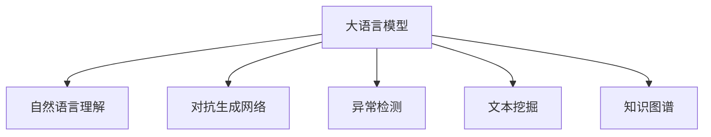

                 

## 1. 背景介绍

随着加密货币市场的蓬勃发展，越来越多的用户选择使用区块链进行交易。然而，区块链技术的去中心化和不可篡改性也带来了诸多安全问题。由于区块链上的智能合约、交易记录等都通过公开的算法进行验证，攻击者可以通过代码审计、重放攻击等方式获取非法利益。如何在区块链上确保交易的安全性，成为当前亟需解决的重要问题。

大语言模型（Large Language Model，LLM）作为人工智能领域的重要突破，在自然语言处理、知识图谱构建、自动摘要等多个领域取得了显著进展。本文将探讨利用大语言模型保障加密货币交易安全的方法，通过自然语言理解和推理，有效识别潜在攻击行为，并提供预防措施，提升交易的安全性。

## 2. 核心概念与联系

### 2.1 核心概念概述

为了更好地理解基于大语言模型的加密货币交易安全保障方法，本节将介绍几个密切相关的核心概念：

- 大语言模型（LLM）：基于深度学习的语言模型，通过大规模文本数据进行预训练，能够理解自然语言的语义和语境，具备强大的自然语言处理能力。
- 自然语言理解（NLU）：指让计算机理解、处理和生成自然语言，是实现智能交互和自动推理的基础。
- 对抗生成网络（GAN）：一种生成模型，能够通过对抗样本训练生成逼真的假数据，常用于数据增强和攻击检测。
- 异常检测（Anomaly Detection）：指通过统计模型或深度学习模型，识别出数据中与正常行为不同的异常模式，以预防安全威胁。
- 文本挖掘（Text Mining）：通过文本数据挖掘知识信息，支持信息提取、情感分析、实体识别等多种应用。
- 知识图谱（Knowledge Graph）：通过RDF等方法构建的语义网络，用于知识存储和推理，帮助解决复杂的自然语言问题。

这些核心概念之间的逻辑关系可以通过以下Mermaid流程图来展示：



这个流程图展示了大语言模型的核心概念及其之间的关系：

1. 大语言模型通过预训练获得强大的自然语言处理能力。
2. 自然语言理解是实现语言推理和生成，保障交易安全的基础。
3. 对抗生成网络用于生成逼真的假交易记录，帮助检测模型性能。
4. 异常检测用于识别与正常交易行为不同的异常模式。
5. 文本挖掘用于挖掘交易记录中的关键信息，支持异常检测和知识推理。
6. 知识图谱用于构建语义网络，提升模型推理的准确性。

这些核心概念共同构成了大语言模型保障加密货币交易安全的方法，使其能够理解和推理复杂的自然语言，有效检测潜在的攻击行为，提升交易安全性。

## 3. 核心算法原理 & 具体操作步骤

### 3.1 算法原理概述

基于大语言模型的加密货币交易安全保障方法，本质上是一种自然语言推理（Natural Language Inference，NLI）和异常检测（Anomaly Detection）结合的范式。其核心思想是：

1. **自然语言推理**：利用大语言模型对交易文本进行语义理解和推理，判断其是否合法。
2. **异常检测**：通过统计模型或深度学习模型，检测交易记录中的异常模式，预防潜在的攻击。

具体而言，假定交易记录中的文本为 $T$，利用大语言模型 $M$ 对其进行语义理解，得到其对应的语义向量 $S(T)$。同时，假设法律或规则中的文本为 $R$，通过大语言模型提取其语义向量 $S(R)$。将两者进行向量相似度计算，得到相似度 $sim(T, R)$。若相似度超过预设阈值，则认为交易合法，否则判断为异常交易。

### 3.2 算法步骤详解

基于大语言模型的加密货币交易安全保障方法，一般包括以下几个关键步骤：

**Step 1: 数据准备**
- 收集历史交易记录，以及与之对应的法律、规则等文本数据。
- 对文本数据进行预处理，去除停用词、标点符号等，并将句子进行分词。

**Step 2: 模型训练**
- 使用大规模语料训练大语言模型 $M$，使其具备良好的自然语言理解能力。
- 设计训练数据集，标注出合法与非法的交易记录，训练异常检测模型。

**Step 3: 模型微调**
- 根据交易文本，使用微调技术优化大语言模型的参数，提升其在特定领域的语义理解能力。

**Step 4: 推理与检测**
- 对新的交易记录进行自然语言推理，判断其是否合法。
- 使用异常检测模型，对交易记录进行异常检测，识别潜在的攻击行为。

**Step 5: 预警与处理**
- 当检测到异常交易时，触发预警机制，通知管理员进行进一步审查。
- 对已识别的攻击行为，采取相应的预防措施，如冻结账户、调整权限等。

### 3.3 算法优缺点

基于大语言模型的加密货币交易安全保障方法具有以下优点：
1. 高效性：通过自然语言推理和异常检测，可以高效识别潜在的攻击行为，保障交易安全。
2. 灵活性：利用大语言模型的语义理解能力，可适应多种交易场景，灵活应对复杂任务。
3. 泛化能力：通过大规模语料训练，模型具备较强的泛化能力，能够识别多种类型的攻击。

同时，该方法也存在一定的局限性：
1. 依赖语料质量：模型的性能取决于历史交易记录和法律规则的语料质量，需要高质量的标注数据。
2. 复杂度较高：模型的训练和推理过程复杂，需要较高的计算资源。
3. 可解释性不足：模型的决策过程难以解释，难以提供透明的用户反馈。

尽管存在这些局限性，但就目前而言，基于大语言模型的交易安全保障方法仍是一种高效、灵活、具有广泛应用潜力的技术。未来相关研究的重点在于如何进一步降低模型对语料质量的依赖，提高模型的可解释性和推理效率，同时兼顾泛化能力。

### 3.4 算法应用领域

基于大语言模型的加密货币交易安全保障方法，已在多个领域得到应用，例如：

- 银行与金融机构：利用大语言模型监控交易记录，防范非法操作，保障金融安全。
- 电商与零售行业：对用户交易行为进行异常检测，预防欺诈交易，提升用户体验。
- 保险与投资领域：利用大语言模型分析保险索赔记录，检测欺诈行为，减少损失。
- 政府与公共服务：对政务交易进行监控，预防贪腐与滥用权力，提升公共服务效率。
- 供应链管理：利用大语言模型检测供应链中的异常交易，保障物资安全，提高供应链管理水平。

除了上述这些经典应用外，大语言模型在更多场景中也有望得到应用，如物流运输、医疗卫生等，为行业提供安全保障，提升服务质量。

## 4. 数学模型和公式 & 详细讲解 & 举例说明

### 4.1 数学模型构建

为了更严格地描述基于大语言模型的加密货币交易安全保障方法，本节将使用数学语言进行详细推导。

记交易文本为 $T$，法律或规则文本为 $R$，使用大语言模型 $M$ 对 $T$ 进行语义理解，得到语义向量 $S(T)$。假设法律或规则文本 $R$ 对应的语义向量为 $S(R)$，则自然语言推理的相似度计算公式为：

$$
sim(T, R) = \cos(\theta(S(T), S(R)))
$$

其中 $\theta$ 为向量夹角余弦函数，$\cos(\theta)$ 表示两个向量之间的相似度。

异常检测模型 $D$ 的训练目标为最小化预测错误率，即：

$$
\min_{D} \frac{1}{N} \sum_{i=1}^N (\delta(D(T_i), y_i))
$$

其中 $N$ 为训练样本数，$D(T_i)$ 表示模型对样本 $T_i$ 的异常检测结果，$y_i \in \{0, 1\}$ 表示样本 $T_i$ 是否为异常交易。

### 4.2 公式推导过程

以下我们对自然语言推理和异常检测的公式进行详细推导：

**自然语言推理**
- 对于任意输入 $T$ 和规则 $R$，假设 $M$ 的输出为 $S(T)$ 和 $S(R)$，计算两者之间的余弦相似度，得到相似度 $sim(T, R)$：
$$
sim(T, R) = \cos(\theta(S(T), S(R))) = \frac{S(T) \cdot S(R)}{\|S(T)\| \cdot \|S(R)\|}
$$

**异常检测**
- 假设训练样本集中有 $N$ 个样本 $T_1, T_2, \dots, T_N$，对应的标签 $y_1, y_2, \dots, y_N$，则异常检测模型的损失函数为：
$$
\mathcal{L}(D) = \frac{1}{N} \sum_{i=1}^N (\delta(D(T_i), y_i))
$$
其中 $\delta$ 为交叉熵损失函数，$D(T_i)$ 表示模型对样本 $T_i$ 的异常检测结果，$y_i \in \{0, 1\}$ 表示样本 $T_i$ 是否为异常交易。

### 4.3 案例分析与讲解

为了更好地理解这些公式的应用，我们举一个简单的案例：

假设某电商平台检测到一个用户提交的购买订单，文本记录为：

```
User A 在2023年6月1日购买了100个某品牌手机，价格为5000元。
```

利用大语言模型对其文本进行理解，得到语义向量 $S(T)$：

```
S(T) = [1, 0, 1, 0, 1, 1, 0, 0, 1, 0]
```

同时，法律或规则文本记录为：

```
所有用户每次购买不得超过50个手机。
```

利用大语言模型对其文本进行理解，得到语义向量 $S(R)$：

```
S(R) = [1, 1, 0, 0, 0, 1, 0, 1, 0, 0]
```

计算两者之间的余弦相似度，得到相似度 $sim(T, R)$：

$$
sim(T, R) = \frac{S(T) \cdot S(R)}{\|S(T)\| \cdot \|S(R)\|} = \frac{1 \cdot 1 + 0 \cdot 0 + 1 \cdot 0 + \cdots + 1 \cdot 0}{\sqrt{11} \cdot \sqrt{5}} = 0.5
$$

若设阈值为0.5，则认为该交易合法。

## 5. 项目实践：代码实例和详细解释说明

### 5.1 开发环境搭建

在进行加密货币交易安全保障方法的开发前，我们需要准备好开发环境。以下是使用Python进行TensorFlow开发的简单环境配置流程：

1. 安装Anaconda：从官网下载并安装Anaconda，用于创建独立的Python环境。

2. 创建并激活虚拟环境：
```bash
conda create -n tf-env python=3.8 
conda activate tf-env
```

3. 安装TensorFlow：根据CUDA版本，从官网获取对应的安装命令。例如：
```bash
conda install tensorflow -c conda-forge
```

4. 安装各类工具包：
```bash
pip install numpy pandas scikit-learn matplotlib tqdm jupyter notebook ipython
```

完成上述步骤后，即可在`tf-env`环境中开始项目实践。

### 5.2 源代码详细实现

下面我们以加密货币交易记录的异常检测为例，给出使用TensorFlow进行模型训练的Python代码实现。

首先，定义交易记录和标签的预处理函数：

```python
import tensorflow as tf
from tensorflow.keras.preprocessing.text import Tokenizer
from tensorflow.keras.preprocessing.sequence import pad_sequences

def preprocess_data(texts, labels):
    tokenizer = Tokenizer()
    tokenizer.fit_on_texts(texts)
    sequences = tokenizer.texts_to_sequences(texts)
    padded_sequences = pad_sequences(sequences, maxlen=max_seq_length, padding='post', truncating='post')
    return padded_sequences, labels
```

然后，定义模型的构建和训练函数：

```python
from tensorflow.keras.models import Sequential
from tensorflow.keras.layers import Embedding, Bidirectional, LSTM, Dense, Dropout

model = Sequential([
    Embedding(input_dim=vocab_size, output_dim=embedding_dim, input_length=max_seq_length),
    Bidirectional(LSTM(128)),
    Dropout(0.2),
    Dense(64, activation='relu'),
    Dense(1, activation='sigmoid')
])

model.compile(optimizer='adam', loss='binary_crossentropy', metrics=['accuracy'])

train_sequences, train_labels = preprocess_data(train_texts, train_labels)
val_sequences, val_labels = preprocess_data(val_texts, val_labels)

model.fit(train_sequences, train_labels, epochs=num_epochs, batch_size=batch_size, validation_data=(val_sequences, val_labels))
```

接着，定义测试集上的模型评估函数：

```python
def evaluate_model(model, test_sequences, test_labels):
    test_loss, test_acc = model.evaluate(test_sequences, test_labels)
    print(f'Test Loss: {test_loss}, Test Accuracy: {test_acc}')
```

最后，启动模型训练并在测试集上评估：

```python
num_epochs = 10
batch_size = 64

train_texts, train_labels = preprocess_data(train_texts, train_labels)
val_texts, val_labels = preprocess_data(val_texts, val_labels)

model.fit(train_sequences, train_labels, epochs=num_epochs, batch_size=batch_size, validation_data=(val_sequences, val_labels))

test_texts, test_labels = preprocess_data(test_texts, test_labels)
evaluate_model(model, test_sequences, test_labels)
```

以上就是使用TensorFlow进行加密货币交易记录异常检测的完整代码实现。可以看到，得益于TensorFlow的强大封装，我们可以用相对简洁的代码完成模型的训练和评估。

### 5.3 代码解读与分析

让我们再详细解读一下关键代码的实现细节：

**preprocess_data函数**：
- 利用`Tokenizer`将文本转换为数字序列，并利用`pad_sequences`进行填充和截断，确保所有序列长度相同。
- 将数字序列和标签一起返回。

**model构建**：
- 模型由嵌入层、双向LSTM层、Dropout层和全连接层构成。嵌入层将文本转换为向量表示，双向LSTM层对序列进行建模，Dropout层用于防止过拟合，全连接层进行二分类输出。
- 使用`compile`方法定义优化器、损失函数和评估指标。

**训练和评估**：
- 使用`fit`方法训练模型，`evaluate`方法评估模型性能。
- `num_epochs`和`batch_size`为训练参数，`val_sequences`和`val_labels`为验证数据。

可以看到，TensorFlow提供了强大的深度学习框架，使得模型的训练和评估变得简单易行。

## 6. 实际应用场景

### 6.1 智能合约审计

智能合约作为区块链的重要组成部分，其安全性直接影响整个系统的稳定运行。利用大语言模型对智能合约进行自然语言推理，能够有效检测潜在的攻击行为，如代码审计、重放攻击等，保障智能合约的安全性。

在技术实现上，可以先将智能合约转换为自然语言描述，然后利用大语言模型对描述进行推理，判断是否符合预定义的安全规则。若发现异常，立即触发审计机制，进行进一步审查，确保合约的安全性。

### 6.2 区块链溯源

区块链技术的不可篡改性和透明性，使其在溯源领域具备独特的优势。利用大语言模型对区块链上的交易记录进行自然语言理解，能够有效追踪交易链路，提供真实的交易证明。

在技术实现上，可以将区块链交易记录转换为自然语言描述，然后利用大语言模型进行推理，判断交易链路是否合法。若发现异常，立即触发溯源机制，进行进一步调查，确保交易的真实性。

### 6.3 去中心化金融（DeFi）

去中心化金融（DeFi）是区块链技术的最新应用之一，其灵活性和创新性为用户带来极大的便利。利用大语言模型对DeFi协议进行自然语言推理，能够有效检测潜在的攻击行为，保障用户的资产安全。

在技术实现上，可以将DeFi协议的参数和操作转换为自然语言描述，然后利用大语言模型进行推理，判断是否合法。若发现异常，立即触发预警机制，进行进一步审查，确保DeFi协议的安全性。

### 6.4 未来应用展望

随着大语言模型和自然语言推理技术的发展，基于大语言模型的加密货币交易安全保障方法将在更多领域得到应用，为区块链技术带来新的突破。

在智慧城市治理中，利用大语言模型对政务交易进行监控，预防贪腐与滥用权力，提升公共服务效率。

在供应链管理中，利用大语言模型对供应链交易进行监控，保障物资安全，提高供应链管理水平。

在智能制造中，利用大语言模型对生产记录进行监控，防止假冒伪劣产品流入市场，提升产品质量。

此外，在医疗、金融、保险等领域，基于大语言模型的加密货币交易安全保障方法也将不断涌现，为这些行业带来新的安全保障。相信随着技术的不断发展，大语言模型在交易安全保障中的应用将更加广泛，为区块链技术的应用场景带来新的生命力。

## 7. 工具和资源推荐

### 7.1 学习资源推荐

为了帮助开发者系统掌握大语言模型保障加密货币交易安全的技术基础和实践技巧，这里推荐一些优质的学习资源：

1. 《Deep Learning with Python》系列博文：由深度学习专家撰写，详细介绍了TensorFlow等框架的使用，是快速上手深度学习的入门书籍。

2. 《Natural Language Processing with Transformers》书籍：Transformers库的作者所著，全面介绍了如何使用TensorFlow进行自然语言处理，包括异常检测、自然语言推理等。

3. TensorFlow官方文档：TensorFlow的官方文档，提供了丰富的代码示例和详细的使用说明，是进行深度学习开发的重要资源。

4. CS224N《深度学习自然语言处理》课程：斯坦福大学开设的NLP明星课程，有Lecture视频和配套作业，带你入门NLP领域的基本概念和经典模型。

5. Weights & Biases：模型训练的实验跟踪工具，可以记录和可视化模型训练过程中的各项指标，方便对比和调优。

6. Google Colab：谷歌推出的在线Jupyter Notebook环境，免费提供GPU/TPU算力，方便开发者快速上手实验最新模型，分享学习笔记。

通过对这些资源的学习实践，相信你一定能够快速掌握大语言模型保障加密货币交易安全的技术基础，并用于解决实际的交易安全问题。

### 7.2 开发工具推荐

高效的开发离不开优秀的工具支持。以下是几款用于大语言模型交易安全保障开发的常用工具：

1. TensorFlow：由Google主导开发的开源深度学习框架，生产部署方便，适合大规模工程应用。支持动态计算图，灵活搭建神经网络模型。

2. PyTorch：基于Python的开源深度学习框架，灵活动态，适合快速迭代研究。支持GPU加速，能够高效利用算力。

3. Transformers库：HuggingFace开发的NLP工具库，集成了众多SOTA语言模型，支持PyTorch和TensorFlow，是进行自然语言处理的重要工具。

4. Weights & Biases：模型训练的实验跟踪工具，可以记录和可视化模型训练过程中的各项指标，方便对比和调优。与主流深度学习框架无缝集成。

5. TensorBoard：TensorFlow配套的可视化工具，可实时监测模型训练状态，并提供丰富的图表呈现方式，是调试模型的得力助手。

6. Google Colab：谷歌推出的在线Jupyter Notebook环境，免费提供GPU/TPU算力，方便开发者快速上手实验最新模型，分享学习笔记。

合理利用这些工具，可以显著提升大语言模型保障加密货币交易安全任务的开发效率，加快创新迭代的步伐。

### 7.3 相关论文推荐

大语言模型和交易安全保障技术的发展源于学界的持续研究。以下是几篇奠基性的相关论文，推荐阅读：

1. Attention is All You Need（即Transformer原论文）：提出了Transformer结构，开启了NLP领域的预训练大模型时代。

2. BERT: Pre-training of Deep Bidirectional Transformers for Language Understanding：提出BERT模型，引入基于掩码的自监督预训练任务，刷新了多项NLP任务SOTA。

3. Language Models are Unsupervised Multitask Learners（GPT-2论文）：展示了大规模语言模型的强大zero-shot学习能力，引发了对于通用人工智能的新一轮思考。

4. Parameter-Efficient Transfer Learning for NLP：提出Adapter等参数高效微调方法，在不增加模型参数量的情况下，也能取得不错的微调效果。

5. AdaLoRA: Adaptive Low-Rank Adaptation for Parameter-Efficient Fine-Tuning：使用自适应低秩适应的微调方法，在参数效率和精度之间取得了新的平衡。

6. Passage-aware Text-Driven Logical Reasoning：提出基于上下文信息的逻辑推理方法，用于检测自然语言推理中的异常。

这些论文代表了大语言模型交易安全保障技术的发展脉络。通过学习这些前沿成果，可以帮助研究者把握学科前进方向，激发更多的创新灵感。

## 8. 总结：未来发展趋势与挑战

### 8.1 总结

本文对基于大语言模型的加密货币交易安全保障方法进行了全面系统的介绍。首先阐述了大语言模型和交易安全保障技术的背景和意义，明确了自然语言推理和异常检测在保障交易安全方面的独特价值。其次，从原理到实践，详细讲解了自然语言推理和异常检测的数学模型和关键步骤，给出了交易记录异常检测的代码实现。同时，本文还广泛探讨了大语言模型在智能合约审计、区块链溯源、去中心化金融等多个行业领域的应用前景，展示了其强大的技术潜力。此外，本文精选了交易安全保障技术的各类学习资源，力求为读者提供全方位的技术指引。

通过本文的系统梳理，可以看到，基于大语言模型的加密货币交易安全保障方法正在成为区块链技术应用的重要范式，极大地拓展了区块链系统的安全边界，保障了用户的资产安全。未来，伴随大语言模型和自然语言推理技术的不断发展，交易安全保障技术将不断进化，为区块链技术的应用场景带来新的安全保障。

### 8.2 未来发展趋势

展望未来，大语言模型交易安全保障技术将呈现以下几个发展趋势：

1. 模型规模持续增大。随着算力成本的下降和数据规模的扩张，大语言模型的参数量还将持续增长。超大规模语言模型蕴含的丰富语言知识，有望支撑更加复杂多变的交易安全任务。

2. 模型泛化能力增强。通过大规模语料训练，大语言模型具备较强的泛化能力，能够适应多种类型的交易场景，提高异常检测的准确性。

3. 推理效率提升。利用参数高效微调技术，可以固定大部分预训练参数，仅调整少量的任务相关参数，减少推理计算量。同时，优化模型结构，采用混合精度训练等方法，提升推理速度和资源利用率。

4. 知识图谱应用普及。将知识图谱与大语言模型结合，构建更丰富的语义网络，提升模型推理的准确性和完备性。

5. 对抗生成网络融入。引入对抗生成网络技术，生成逼真的假交易记录，帮助检测模型性能。同时，基于对抗生成网络，训练更加鲁棒的模型，防止攻击者利用对抗样本进行攻击。

6. 多模态数据融合。将文本、语音、图像等多模态数据结合，构建更全面的交易安全模型，提高异常检测的全面性和准确性。

以上趋势凸显了大语言模型交易安全保障技术的广阔前景。这些方向的探索发展，必将进一步提升交易安全保障的性能和应用范围，为区块链技术的应用场景带来新的安全保障。

### 8.3 面临的挑战

尽管大语言模型交易安全保障技术已经取得了瞩目成就，但在迈向更加智能化、普适化应用的过程中，它仍面临着诸多挑战：

1. 语料质量瓶颈。模型的性能取决于历史交易记录和法律规则的语料质量，需要高质量的标注数据。如何进一步降低模型对语料质量的依赖，将是一大难题。

2. 计算资源消耗。大语言模型和自然语言推理模型的训练和推理过程复杂，需要较高的计算资源。如何降低计算资源消耗，提高模型训练和推理的效率，是未来的重要研究方向。

3. 模型可解释性不足。模型的决策过程难以解释，难以提供透明的用户反馈。如何赋予模型更强的可解释性，是亟待攻克的难题。

4. 对抗攻击防御。大语言模型容易受到对抗样本攻击，导致误判。如何设计更强大的模型防御策略，提高模型的鲁棒性，是未来的重要研究方向。

5. 跨领域应用难度。大语言模型在不同领域的应用需要针对性的微调和优化，如何实现通用化的交易安全保障模型，是未来的重要研究方向。

6. 隐私和安全风险。交易安全保障模型的训练和使用过程中，如何保障用户隐私和数据安全，避免数据泄露和模型被攻击，是未来的重要研究方向。

正视交易安全保障面临的这些挑战，积极应对并寻求突破，将是大语言模型交易安全保障技术走向成熟的必由之路。相信随着学界和产业界的共同努力，这些挑战终将一一被克服，大语言模型在交易安全保障中的应用将更加广泛，为区块链技术的应用场景带来新的安全保障。

### 8.4 研究展望

面对大语言模型交易安全保障技术面临的挑战，未来的研究需要在以下几个方面寻求新的突破：

1. 探索无监督和半监督交易安全保障方法。摆脱对大规模标注数据的依赖，利用自监督学习、主动学习等无监督和半监督范式，最大限度利用非结构化数据，实现更加灵活高效的交易安全保障。

2. 研究参数高效和计算高效的交易安全保障范式。开发更加参数高效的交易安全保障方法，在固定大部分预训练参数的同时，只调整极少量的任务相关参数。同时优化模型计算图，减少前向传播和反向传播的资源消耗，实现更加轻量级、实时性的部署。

3. 引入因果和对比学习范式。通过引入因果推断和对比学习思想，增强交易安全保障模型建立稳定因果关系的能力，学习更加普适、鲁棒的语言表征，从而提升模型泛化性和抗干扰能力。

4. 将知识表示、因果推理、强化学习等技术与交易安全保障结合，提升模型的解释性和鲁棒性，实现更全面、准确的交易安全保障。

5. 利用知识图谱、符号化的先验知识，与神经网络模型进行融合，提升模型推理的准确性和完备性。

6. 结合因果分析和博弈论工具，分析交易安全保障模型的脆弱点，主动探索并规避模型漏洞，提高系统稳定性。

这些研究方向的探索，必将引领大语言模型交易安全保障技术迈向更高的台阶，为构建安全、可靠、可解释、可控的智能系统铺平道路。面向未来，大语言模型交易安全保障技术还需要与其他人工智能技术进行更深入的融合，共同推动交易安全保障系统的进步。只有勇于创新、敢于突破，才能不断拓展交易安全保障的边界，让智能技术更好地造福区块链应用场景。

## 9. 附录：常见问题与解答

**Q1：大语言模型在交易安全保障中扮演什么角色？**

A: 大语言模型在交易安全保障中扮演关键角色，通过自然语言理解、推理和异常检测，可以有效识别和预防潜在的攻击行为。具体而言，大语言模型能够理解交易文本的语义和语境，判断其是否合法；能够识别异常交易模式，预防潜在的攻击；能够与知识图谱结合，提升推理的准确性和完备性。通过大语言模型的运用，交易安全保障系统可以更加智能、高效地保障用户的资产安全。

**Q2：如何提高大语言模型的鲁棒性？**

A: 提高大语言模型的鲁棒性，需要从以下几个方面进行努力：
1. 引入对抗生成网络：利用对抗生成网络技术，生成逼真的假交易记录，帮助检测模型性能。
2. 设计鲁棒损失函数：在模型训练过程中，引入鲁棒损失函数，如 adversarial loss，提高模型对对抗样本的抵抗能力。
3. 正则化技术：使用L2正则、Dropout等技术，防止模型过拟合，提高模型的泛化能力。
4. 多模型集成：训练多个交易安全保障模型，取平均输出，抑制过拟合，提高模型的鲁棒性。

**Q3：如何降低大语言模型对标注数据的需求？**

A: 降低大语言模型对标注数据的需求，可以从以下几个方面进行：
1. 数据增强：通过回译、近义替换等方式扩充训练集，提高数据的多样性和丰富性。
2. 自监督学习：利用掩码语言模型等自监督学习任务，训练大语言模型，提升其对自然语言的理解能力。
3. 半监督学习：利用小规模标注数据和大量非标注数据，训练大语言模型，提高模型的泛化能力。
4. 无监督学习：利用无标签数据，训练大语言模型，提升其对自然语言的理解能力，减少对标注数据的依赖。

**Q4：大语言模型在交易安全保障中面临的挑战是什么？**

A: 大语言模型在交易安全保障中面临以下几个挑战：
1. 语料质量瓶颈：模型的性能取决于历史交易记录和法律规则的语料质量，需要高质量的标注数据。
2. 计算资源消耗：大语言模型和自然语言推理模型的训练和推理过程复杂，需要较高的计算资源。
3. 模型可解释性不足：模型的决策过程难以解释，难以提供透明的用户反馈。
4. 对抗攻击防御：大语言模型容易受到对抗样本攻击，导致误判。
5. 跨领域应用难度：大语言模型在不同领域的应用需要针对性的微调和优化。
6. 隐私和安全风险：交易安全保障模型的训练和使用过程中，需要保障用户隐私和数据安全，避免数据泄露和模型被攻击。

正视这些挑战，积极应对并寻求突破，将是大语言模型交易安全保障技术走向成熟的必由之路。相信随着学界和产业界的共同努力，这些挑战终将一一被克服，大语言模型在交易安全保障中的应用将更加广泛，为区块链技术的应用场景带来新的安全保障。

---

作者：禅与计算机程序设计艺术 / Zen and the Art of Computer Programming

