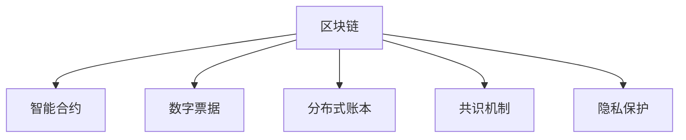

                 

# 区块链在供应链金融中的创新应用

> 关键词：区块链, 供应链金融, 智能合约, 数字票据, 供应链透明

## 1. 背景介绍

### 1.1 问题由来
随着全球经济一体化进程的加快，供应链金融逐渐成为企业间资金链管理的重要组成部分。传统供应链金融面临着信息不对称、融资效率低、风险难以控制等诸多问题。而区块链技术，凭借其去中心化、透明性、不可篡改等特性，为解决这些问题提供了新的思路。

### 1.2 问题核心关键点
基于区块链的供应链金融，通过智能合约、数字票据、分布式账本等技术手段，实现供应链上下游企业间的信任关系数字化，从而提高融资效率、降低交易成本、增强风险控制能力。核心关键点包括：

- **智能合约**：自动执行并记录交易的代码，确保交易的不可逆和透明性。
- **数字票据**：不可篡改的数字化凭证，实现高效的结算和融资。
- **分布式账本**：记录所有交易的透明且不可篡改的账本，增强供应链的信任度。
- **共识机制**：确保所有参与者共同维护账本的更新，防止单方面恶意篡改。
- **隐私保护**：在保护交易隐私的前提下，确保供应链各节点信息的透明性。

这些核心关键点共同构成了区块链在供应链金融中的创新应用框架，其旨在解决供应链金融中信息孤岛、信任缺失、融资效率低等问题，实现供应链资金流的透明化、数字化、可控化。

### 1.3 问题研究意义
研究区块链在供应链金融中的创新应用，对于提升供应链金融的效率和安全性，降低金融风险，推动数字经济的转型升级，具有重要意义：

1. **提升融资效率**：区块链的智能合约技术可以自动完成合同执行和资金划转，缩短了融资流程，提高了资金的流转效率。
2. **增强供应链信任**：区块链的分布式账本和不可篡改特性，确保了供应链各节点的透明性和信任度，降低了信息不对称和欺诈风险。
3. **降低交易成本**：去中心化的交易模式减少了传统金融中介环节，降低了交易成本。
4. **控制金融风险**：通过智能合约和实时监控，区块链可以实时跟踪交易状态，增强风险防控能力。
5. **促进数字经济**：区块链技术的应用，推动了数字资产的流通和应用，促进了数字经济的蓬勃发展。

## 2. 核心概念与联系

### 2.1 核心概念概述

为更好地理解区块链在供应链金融中的应用，本节将介绍几个密切相关的核心概念：

- **区块链(Blockchain)**：一种分布式账本技术，通过去中心化的方式记录交易信息，实现透明性和不可篡改性。
- **智能合约(Smart Contract)**：一种自动执行的代码，能够实现预设的交易逻辑和条件。
- **数字票据(Digital Bill)**：数字化形式的票据，支持快速清算和融资。
- **分布式账本(Distributed Ledger)**：多个节点共同维护的账本，记录所有交易信息。
- **共识机制(Consensus Mechanism)**：确保所有节点达成一致，共同维护账本的安全性和可靠性。
- **隐私保护(Privacy Protection)**：在保障数据隐私的前提下，确保供应链各节点信息的透明性。

这些核心概念之间的逻辑关系可以通过以下Mermaid流程图来展示：



这个流程图展示了大语言模型的核心概念及其之间的关系：

1. 区块链通过智能合约、数字票据、分布式账本等技术手段，实现供应链金融的数字化、透明化和可控化。
2. 智能合约自动执行并记录交易，确保交易的不可逆和透明性。
3. 数字票据提供高效的结算和融资方式，提高供应链的资金流转效率。
4. 分布式账本记录所有交易，增强供应链的信任度和透明性。
5. 共识机制确保所有参与者共同维护账本的更新，防止单方面恶意篡改。
6. 隐私保护在保护交易隐私的前提下，确保供应链各节点信息的透明性。

## 3. 核心算法原理 & 具体操作步骤
### 3.1 算法原理概述

基于区块链的供应链金融，本质上是一个分布式账本和智能合约的应用过程。其核心思想是：利用区块链的透明性和不可篡改性，结合智能合约的自动执行能力，实现供应链各节点间的信任和自动化管理，从而提高融资效率、降低交易成本、增强风险控制能力。

形式化地，假设供应链中存在多个节点，每个节点通过区块链维护一个分布式账本，记录交易信息和状态。智能合约定义了交易的逻辑和规则，一旦满足触发条件，便自动执行并更新账本。在实际应用中，通常使用公钥密码学和共识机制保证账本的安全性和一致性。

### 3.2 算法步骤详解

基于区块链的供应链金融一般包括以下几个关键步骤：

**Step 1: 初始化区块链和智能合约**
- 根据供应链各节点的需求，设计智能合约的逻辑和触发条件。
- 在区块链上部署智能合约，确保其能够自动执行并记录交易信息。
- 每个节点初始化本地账本，确保所有交易记录一致。

**Step 2: 生成和传输数字票据**
- 供应链上游节点根据订单需求生成数字票据，代表货物的所有权或货款的支付权利。
- 将数字票据数字化，并使用公钥密码学进行加密，确保其不可篡改和唯一性。
- 将数字票据传输到下游节点，完成货款的结算和融资。

**Step 3: 执行智能合约**
- 下游节点根据智能合约的触发条件，自动执行相关操作，如提取货物、支付货款等。
- 智能合约自动更新区块链账本，确保交易的透明性和不可篡改性。
- 通过共识机制，确保所有节点对交易状态的一致认可。

**Step 4: 监测和审计**
- 供应链节点可以通过区块链账本，实时监测交易状态和货物流向。
- 利用智能合约的审计功能，检查交易是否满足预设条件，防范欺诈行为。
- 定期对区块链账本进行审计，确保交易记录的准确性和完整性。

### 3.3 算法优缺点

基于区块链的供应链金融方法具有以下优点：
1. 提高融资效率：智能合约自动执行交易，减少了传统金融中介环节，提高了资金流转速度。
2. 增强信任度：区块链的透明性和不可篡改特性，确保了供应链各节点之间的信任关系。
3. 降低交易成本：去中心化的交易模式减少了中介环节，降低了交易成本。
4. 增强风险控制：通过智能合约和实时监控，提高了供应链风险的防控能力。

同时，该方法也存在一定的局限性：
1. 初始化复杂：区块链和智能合约的初始化需要技术门槛，实施成本较高。
2. 技术成熟度不足：区块链技术仍处于早期发展阶段，面临一些技术难题和实现挑战。
3. 可扩展性问题：大规模供应链金融应用需要处理海量交易，现有区块链系统的性能和扩展性有待提高。
4. 隐私保护问题：在确保透明性的同时，如何保护供应链各节点的隐私，仍是一个难题。

尽管存在这些局限性，但就目前而言，区块链在供应链金融中的应用已经初见成效，未来有望得到更广泛的应用。

### 3.4 算法应用领域

基于区块链的供应链金融技术已经在物流、制造、零售等多个领域得到了应用，具体包括：

- **物流领域**：通过区块链技术实现货物的追踪和防伪，提高了物流运输的透明度和安全性。
- **制造领域**：利用区块链技术记录生产过程和质量数据，提高了生产管理的自动化和透明性。
- **零售领域**：通过智能合约和数字票据，实现供应链上下游的快速结算和融资。

除了上述这些经典应用外，区块链技术还在跨境支付、供应链融资、保险等领域展现了强大的应用潜力，为传统供应链金融带来了全新的变革。

## 4. 数学模型和公式 & 详细讲解 & 举例说明

### 4.1 数学模型构建

为了更好地理解基于区块链的供应链金融算法，本节将使用数学语言对算法过程进行更加严格的刻画。

假设供应链中存在$n$个节点，每个节点在区块链上维护一个分布式账本，记录交易信息。设每个节点的本地账本为$L_i$，初始化时$L_i=\emptyset$。智能合约定义了交易的逻辑和规则，假设智能合约的触发条件为$T$，触发时自动执行相关操作。

定义交易$t$的哈希值为$H_t$，数字票据$B_t$的哈希值为$H_B$，公钥为$K$，私钥为$K'$。智能合约的执行状态为$S$，初始化为$S_0$。

### 4.2 公式推导过程

以下我们以供应链金融中的数字票据生成为例，推导智能合约的执行过程和区块链账本的更新。

假设供应链下游节点接收到上游节点生成的数字票据$B_t$，其哈希值为$H_B$，公钥为$K$。首先，上游节点使用私钥$K'$对数字票据进行加密，确保其不可篡改和唯一性。

1. 智能合约的执行：
   - 下游节点触发智能合约$M$，检查数字票据$B_t$是否满足触发条件$T$。
   - 若满足条件，智能合约$M$自动执行相关操作，如提取货物、支付货款等。
   - 智能合约执行状态从$S_0$更新为$S_1$，表示交易成功。

2. 区块链账本的更新：
   - 上游节点将数字票据$B_t$和交易状态$S_1$记录在本地账本$L_i$中。
   - 所有节点将交易信息$(t, H_t, H_B, K, S_1)$记录在区块链账本中。
   - 通过共识机制，确保所有节点对交易状态的认可，更新账本记录。

3. 数字票据的传输：
   - 下游节点接收到加密的数字票据$B_t$和交易状态$S_1$。
   - 下游节点使用公钥$K$对数字票据进行解密，获取票据信息。
   - 下游节点将数字票据和交易状态记录在本地账本$L_j$中。

通过上述过程，实现了数字票据的生成和传输，确保了交易的透明性和不可篡改性，提高了供应链融资效率和信任度。

### 4.3 案例分析与讲解

下面以一个具体的供应链金融场景为例，展示区块链技术的应用效果：

**案例描述**：某制造企业需要从供应商处采购原材料，供应商需要资金周转，双方希望通过区块链技术实现融资和结算。

**操作步骤**：
1. 供应商生成数字票据，代表货物所有权或货款支付权利，并使用私钥加密。
2. 制造企业通过区块链查询数字票据信息，确认票据的真实性和有效性。
3. 制造企业触发智能合约，自动执行货款支付和货物提取。
4. 智能合约自动更新区块链账本，记录交易状态。
5. 供应链各节点通过区块链账本，实时监测交易状态和货物流向，确保交易透明性和不可篡改性。

通过上述过程，实现了供应链上下游的快速融资和结算，提高了资金流转效率，增强了供应链信任度。同时，区块链技术确保了交易的透明性和不可篡改性，提高了风险防控能力。

## 5. 项目实践：代码实例和详细解释说明
### 5.1 开发环境搭建

在进行区块链在供应链金融中的应用开发前，我们需要准备好开发环境。以下是使用Hyperledger Fabric开发的环境配置流程：

1. 安装Hyperledger Fabric：从官网下载并安装Hyperledger Fabric，安装Hyperledger Composer和Composer CLI工具。
2. 创建Composer项目：
   ```bash
   composer init
   ```
3. 创建智能合约：
   ```bash
   composer create chaincode --language solidity <chaincode_name> --path ./<chaincode_path>
   ```
4. 编译智能合约：
   ```bash
   composer build chaincode
   ```
5. 部署智能合约：
   ```bash
   peer chaincode deploy -o orderer.example.com -n <channel_name> -c <chaincode_id> -p <org_id> <chaincode_package
   ```
6. 编写区块链应用：
   ```python
   from composer.runtime.consensus import ConsensusService
   from composer.runtime.channel import Channel
   from composer.runtime.chaincode import Chaincode
   from composer.runtime.transaction import Transaction
   from composer.runtime.ledger import Ledger

   # 连接区块链网络
   channel = Channel("mychannel")
   cc = Chaincode("mychaincode")
   cc.set_input("input")
   cc.set_output("output")

   # 提交交易
   tx = Transaction(cc)
   tx.add_arg("input")
   cc = Chaincode(cc)
   cc.set_output("output")
   channel.send_transaction(tx)
   ```

完成上述步骤后，即可在Hyperledger Fabric环境中进行区块链在供应链金融中的应用开发。

### 5.2 源代码详细实现

下面我们以供应链金融中的数字票据生成为例，给出使用Hyperledger Fabric进行区块链应用的PyTorch代码实现。

首先，定义智能合约的代码：

```python
from HyperledgerFabric.composer import Chaincode
from HyperledgerFabric.composer.runtime.private_data import PrivateDataCollection

@Chaincode()
class MyChaincode(Chaincode):
    def __init__(self):
        self.private_data_collection = PrivateDataCollection('digital_bills')

    def set_digital_bill(self, tx):
        # 从交易中获取票据信息
        bill_id = tx.get_arg("bill_id")
        bill_amount = tx.get_arg("bill_amount")

        # 将票据信息存储到私有数据集合中
        self.private_data_collection.set_value(bill_id, bill_amount)
        print(f"Digital bill {bill_id} set with amount {bill_amount}")

    def get_digital_bill(self, tx):
        # 从交易中获取票据ID
        bill_id = tx.get_arg("bill_id")

        # 从私有数据集合中获取票据信息
        bill_amount = self.private_data_collection.get_value(bill_id)

        # 返回票据信息
        print(f"Digital bill {bill_id} amount {bill_amount}")
        return bill_amount
```

然后，定义区块链应用的代码：

```python
from HyperledgerFabric.composer.runtime.private_data import PrivateDataCollection

# 创建私有数据集合
private_data_collection = PrivateDataCollection('digital_bills')

# 设置数字票据信息
private_data_collection.set_value('1001', 10000)

# 获取数字票据信息
amount = private_data_collection.get_value('1001')
print(f"Digital bill amount: {amount}")
```

最后，启动区块链网络并执行智能合约：

```python
from HyperledgerFabric.composer.runtime import Transaction
from HyperledgerFabric.composer.runtime.channel import Channel

# 连接区块链网络
channel = Channel("mychannel")
cc = MyChaincode()

# 提交交易
tx = Transaction(cc)
tx.add_arg("bill_id", "1001")
tx.add_arg("bill_amount", 10000)
channel.send_transaction(tx)

# 获取数字票据信息
amount = private_data_collection.get_value('1001')
print(f"Digital bill amount: {amount}")
```

以上就是使用Hyperledger Fabric进行区块链在供应链金融中的数字票据生成的完整代码实现。可以看到，通过Composer和Composer CLI工具，我们能够高效地实现智能合约和区块链应用。

### 5.3 代码解读与分析

让我们再详细解读一下关键代码的实现细节：

**MyChaincode类**：
- `__init__`方法：初始化私有数据集合，用于存储数字票据信息。
- `set_digital_bill`方法：从交易中获取票据信息，并将其存储到私有数据集合中。
- `get_digital_bill`方法：从私有数据集合中获取票据信息，并返回给交易者。

**区块链应用代码**：
- 创建私有数据集合，用于存储数字票据信息。
- 设置数字票据信息，将票据ID和金额存储到私有数据集合中。
- 获取数字票据信息，从私有数据集合中获取票据金额。

通过上述过程，我们实现了数字票据的生成和获取，确保了交易的透明性和不可篡改性，提高了供应链融资效率和信任度。

## 6. 实际应用场景
### 6.1 智能合约融资

基于区块链的供应链金融技术，可以实现智能合约融资，即通过预设的触发条件，自动执行货款支付和货物提取操作。具体场景如下：

**案例描述**：某制造企业需要从供应商处采购原材料，供应商需要资金周转，双方希望通过区块链技术实现融资和结算。

**操作步骤**：
1. 供应商生成数字票据，代表货物所有权或货款支付权利，并使用私钥加密。
2. 制造企业通过区块链查询数字票据信息，确认票据的真实性和有效性。
3. 制造企业触发智能合约，自动执行货款支付和货物提取。
4. 智能合约自动更新区块链账本，记录交易状态。
5. 供应链各节点通过区块链账本，实时监测交易状态和货物流向，确保交易透明性和不可篡改性。

通过上述过程，实现了供应链上下游的快速融资和结算，提高了资金流转效率，增强了供应链信任度。同时，区块链技术确保了交易的透明性和不可篡改性，提高了风险防控能力。

### 6.2 供应链追溯

基于区块链的供应链金融技术，可以实现供应链追溯，即通过记录和查询供应链各节点的交易信息，确保货物的真实性和质量安全。具体场景如下：

**案例描述**：某零售企业需要对进口商品的来源和生产过程进行追溯，以确保商品的质量和合规性。

**操作步骤**：
1. 生产商在区块链上记录商品的来源、生产日期等信息。
2. 物流公司通过区块链查询商品信息，确认商品的合法性和真实性。
3. 零售企业通过区块链查询商品信息，了解商品的来源和生产过程。
4. 供应链各节点通过区块链账本，实时监测商品流向，确保货物的真实性和质量安全。

通过上述过程，实现了供应链商品的追溯，提高了供应链的透明度和可信度，增强了商品的质量和合规性。

### 6.3 风险管理

基于区块链的供应链金融技术，可以实现风险管理，即通过智能合约和实时监控，防范供应链各节点的欺诈和违约行为。具体场景如下：

**案例描述**：某制造企业需要从供应商处采购原材料，供应商需要资金周转，双方希望通过区块链技术实现融资和结算，并防范欺诈行为。

**操作步骤**：
1. 供应商生成数字票据，代表货物所有权或货款支付权利，并使用私钥加密。
2. 制造企业通过区块链查询数字票据信息，确认票据的真实性和有效性。
3. 制造企业触发智能合约，自动执行货款支付和货物提取。
4. 智能合约自动更新区块链账本，记录交易状态。
5. 供应链各节点通过区块链账本，实时监测交易状态和货物流向，防范欺诈行为。

通过上述过程，实现了供应链融资和结算，并通过智能合约和实时监控，提高了供应链的风险防控能力，增强了供应链的信任度。

### 6.4 未来应用展望

随着区块链技术的不断发展，基于区块链的供应链金融将迎来更广阔的应用前景：

1. **跨境支付**：利用区块链技术实现跨国交易的快速结算，降低跨境支付的复杂性和成本。
2. **供应链保险**：通过智能合约和实时监控，实现供应链保险的自动化和透明化。
3. **供应链融资平台**：基于区块链技术搭建供应链融资平台，为中小供应商提供融资支持。
4. **供应链风险管理**：通过区块链技术记录和查询供应链各节点的交易信息，防范欺诈和违约行为。
5. **供应链透明化**：利用区块链技术实现供应链上下游的信息共享和透明化，增强供应链的信任度。

区块链技术的应用，将进一步提升供应链金融的效率和安全性，降低金融风险，推动数字经济的转型升级。

## 7. 工具和资源推荐
### 7.1 学习资源推荐

为了帮助开发者系统掌握区块链在供应链金融中的应用理论基础和实践技巧，这里推荐一些优质的学习资源：

1. **Hyperledger Fabric官方文档**：Hyperledger Fabric的官方文档提供了详细的技术实现和应用示例，是入门Hyperledger Fabric的最佳资源。

2. **《区块链：新金融蓝图》**：Metcalfe和Swan合著的区块链经典书籍，深入浅出地介绍了区块链技术的基本原理和应用场景。

3. **《智能合约：区块链技术与商业应用》**：Feldman等合著的智能合约书籍，介绍了智能合约在区块链上的实现和应用。

4. **Composer官方文档**：Composer的官方文档提供了详细的智能合约开发和应用示例，是学习Composer和Hyperledger Fabric的最佳资源。

5. **Hyperledger Fabric社区**：Hyperledger Fabric的社区提供了丰富的技术交流和学习资源，包括论坛、博客、开源项目等，是学习Hyperledger Fabric的优秀平台。

通过对这些资源的学习实践，相信你一定能够快速掌握区块链在供应链金融中的应用精髓，并用于解决实际的NLP问题。

### 7.2 开发工具推荐

高效的开发离不开优秀的工具支持。以下是几款用于区块链在供应链金融中的应用开发的常用工具：

1. **Hyperledger Fabric**：基于区块链技术的分布式账本平台，提供了智能合约和区块链应用的开发和部署环境。

2. **Composer**：Hyperledger Composer的CLI工具，用于智能合约的开发、测试和部署。

3. **Composer CLI**：Hyperledger Composer的命令行工具，用于区块链应用的开发、测试和部署。

4. **Web3.js**：以太坊区块链的JavaScript库，支持智能合约的开发和交互。

5. **Ethereum**：基于区块链技术的智能合约平台，支持智能合约的开发和部署。

6. **Git**：版本控制系统，支持代码的协作开发和管理。

合理利用这些工具，可以显著提升区块链在供应链金融中的应用开发效率，加快创新迭代的步伐。

### 7.3 相关论文推荐

区块链在供应链金融中的应用研究源于学界的持续研究。以下是几篇奠基性的相关论文，推荐阅读：

1. **"Hyperledger Fabric: A Distributed ledger framework for enterprise blockchain applications"**：Hyperledger Fabric的架构设计和核心技术介绍。

2. **"Smart Contracts: Trustless Interactive Protocols on the Blockchain"**：Nick Szabo提出的智能合约概念和实现方式。

3. **"Blockchain Technology and Its Applications in Supply Chain Management"**：区块链技术在供应链管理中的应用研究综述。

4. **"Blockchain and Supply Chain Finance: A Survey"**：区块链技术在供应链金融中的应用研究综述。

5. **"Blockchain Technology in Supply Chain: A Review of Research"**：区块链技术在供应链中的应用研究综述。

这些论文代表了大语言模型微调技术的发展脉络。通过学习这些前沿成果，可以帮助研究者把握学科前进方向，激发更多的创新灵感。

## 8. 总结：未来发展趋势与挑战

### 8.1 总结

本文对区块链在供应链金融中的应用进行了全面系统的介绍。首先阐述了区块链技术的基本原理和应用场景，明确了智能合约、数字票据、分布式账本等核心概念在供应链金融中的应用价值。其次，从原理到实践，详细讲解了区块链在供应链金融中的应用流程，给出了智能合约融资、供应链追溯、风险管理等场景的实现代码和解读。同时，本文还广泛探讨了区块链在供应链金融中的实际应用场景，展示了区块链技术的广泛应用前景。

通过本文的系统梳理，可以看到，基于区块链的供应链金融技术已经在物流、制造、零售等多个领域得到应用，为传统供应链金融带来了全新的变革。区块链技术的应用，将进一步提升供应链金融的效率和安全性，降低金融风险，推动数字经济的转型升级。

### 8.2 未来发展趋势

展望未来，区块链在供应链金融中的应用将呈现以下几个发展趋势：

1. **智能合约普及**：随着智能合约技术的不断成熟，其在供应链金融中的应用将更加广泛，从融资、结算到供应链管理，各个环节都将受益。
2. **跨链技术发展**：未来区块链平台之间的互操作性将得到进一步提升，实现跨链资产流通和信息共享。
3. **去中心化自治组织(DAO)**：基于区块链的去中心化自治组织将进一步发展，提高供应链金融的透明性和自治性。
4. **隐私保护技术进步**：随着区块链隐私保护技术的不断进步，供应链金融将能够更好地保护交易隐私，增强信任度。
5. **多模态数据融合**：未来区块链将与物联网、人工智能等技术融合，实现多模态数据的整合和共享。

以上趋势凸显了区块链在供应链金融中的广阔前景。这些方向的探索发展，必将进一步提升区块链技术的应用水平，为供应链金融带来新的突破。

### 8.3 面临的挑战

尽管区块链在供应链金融中的应用已经初见成效，但在迈向更加智能化、普适化应用的过程中，仍面临诸多挑战：

1. **技术门槛高**：区块链和智能合约的开发需要一定的技术门槛，实施成本较高，需要专业的技术团队和资源支持。
2. **性能瓶颈**：现有区块链平台的性能和扩展性仍需进一步提升，以应对大规模供应链金融应用的需求。
3. **隐私保护问题**：在确保透明性的同时，如何保护供应链各节点的隐私，仍是一个难题。
4. **共识机制问题**：现有共识机制面临安全性、效率和可扩展性等方面的挑战，需要进一步优化。
5. **法律法规问题**：区块链技术的应用需要与现有的法律法规体系相适应，如何建立完善的技术法律框架，仍是一个难题。

尽管存在这些挑战，但区块链在供应链金融中的应用前景依然广阔。未来，随着技术、法规和市场的多方位协同推进，区块链有望在供应链金融中发挥更大的作用，推动数字经济的持续发展。

### 8.4 研究展望

面向未来，区块链在供应链金融中的研究需要在以下几个方面寻求新的突破：

1. **智能合约自动化**：进一步提升智能合约的自动化程度，实现供应链各节点的自动化管理。
2. **隐私保护技术**：探索更好的隐私保护技术，在确保透明性的同时，保护供应链各节点的隐私。
3. **跨链技术**：推动区块链平台之间的互操作性，实现跨链资产流通和信息共享。
4. **去中心化自治组织**：探索去中心化自治组织在供应链金融中的应用，提高供应链的透明性和自治性。
5. **多模态数据融合**：探索多模态数据的整合和共享，提高供应链的智能决策能力。

这些研究方向的探索，必将引领区块链在供应链金融中的应用进入新的高度，为供应链金融带来新的变革。只有勇于创新、敢于突破，才能不断拓展区块链技术的应用边界，推动供应链金融向更加智能化、普适化方向发展。

## 9. 附录：常见问题与解答

**Q1：区块链在供应链金融中的核心优势是什么？**

A: 区块链在供应链金融中的核心优势在于其去中心化、透明性、不可篡改特性，确保了供应链各节点之间的信任关系，提高了融资效率、降低了交易成本、增强了风险防控能力。

**Q2：智能合约在供应链金融中的应用场景有哪些？**

A: 智能合约在供应链金融中的应用场景包括：
1. 融资：通过智能合约自动执行货款支付和货物提取，提高融资效率。
2. 结算：通过智能合约实现货物的所有权转移和支付，确保交易的透明性和不可篡改性。
3. 审计：通过智能合约的审计功能，检查交易是否满足预设条件，防范欺诈行为。

**Q3：区块链在供应链金融中的隐私保护措施有哪些？**

A: 区块链在供应链金融中的隐私保护措施包括：
1. 匿名交易：使用匿名地址和公钥密码学，保护交易方的隐私。
2. 访问控制：通过访问控制列表(ACL)和权限管理，限制特定节点的访问权限。
3. 数据脱敏：对敏感数据进行脱敏处理，确保数据的隐私性。

**Q4：区块链在供应链金融中的应用面临哪些挑战？**

A: 区块链在供应链金融中的应用面临以下挑战：
1. 技术门槛高：区块链和智能合约的开发需要一定的技术门槛，实施成本较高。
2. 性能瓶颈：现有区块链平台的性能和扩展性仍需进一步提升，以应对大规模供应链金融应用的需求。
3. 隐私保护问题：在确保透明性的同时，如何保护供应链各节点的隐私，仍是一个难题。
4. 共识机制问题：现有共识机制面临安全性、效率和可扩展性等方面的挑战，需要进一步优化。
5. 法律法规问题：区块链技术的应用需要与现有的法律法规体系相适应，如何建立完善的技术法律框架，仍是一个难题。

**Q5：区块链在供应链金融中的应用前景如何？**

A: 区块链在供应链金融中的应用前景广阔，包括智能合约融资、供应链追溯、风险管理、跨境支付、供应链保险等。未来，随着技术的不断进步和应用场景的拓展，区块链将在供应链金融中发挥更大的作用，推动数字经济的持续发展。

---

作者：禅与计算机程序设计艺术 / Zen and the Art of Computer Programming

