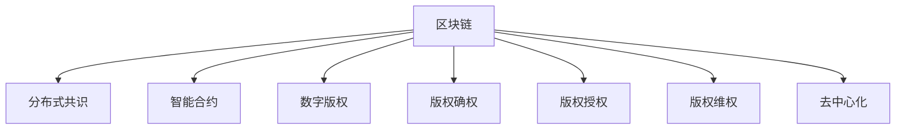

                 

# 区块链在版权保护中的应用

## 1. 背景介绍

### 1.1 问题由来
随着互联网技术的发展，数字版权问题日益凸显。盗版、侵权、篡改等行为不断挑战版权保护的底线，给创作者和权利人带来了巨大的经济和名誉损失。传统版权保护方法如版权登记、法律诉讼等，面临效率低、成本高、执行难等问题。如何利用前沿技术，构建更高效、透明、可追溯的版权保护机制，成为数字时代亟需解决的重要课题。

### 1.2 问题核心关键点
区块链技术作为分布式账本、去中心化信任、加密算法等核心思想的集成，为版权保护提供了全新的思路和方法。利用区块链技术，可以实现版权的分布式存储、不可篡改性、透明性、可追溯性等特性，在版权确权、版权交易、版权授权、版权维权等各个环节，提供强有力的技术保障。

## 2. 核心概念与联系

### 2.1 核心概念概述

为更好地理解区块链在版权保护中的应用，本节将介绍几个密切相关的核心概念：

- 区块链(Blockchain)：一种分布式账本技术，通过去中心化的网络共识机制，维护一个按时间顺序排列的区块链。每个区块包含交易记录，并通过复杂的加密算法实现数据的一致性和不可篡改性。

- 分布式共识(Distributed Consensus)：区块链的核心技术之一，指网络中多个节点通过共识算法，就数据的一致性和有效性达成一致的过程。常见的共识算法包括工作量证明(PoW)、权益证明(PoS)、委托证明(PoD)等。

- 智能合约(Smart Contract)：一种去中心化的自动化合约，通过区块链的脚本语言编写，可自动执行交易规则和条件，实现自动化的版权确权、授权和交易。

- 数字版权(Digital Copyright)：指数字作品(如音乐、电影、软件等)的版权保护。与传统版权不同，数字版权可以跨越地域、时间，通过网络进行复制、分发、共享。

- 版权确权(Copyright Ownership)：指版权所有权的确认和记录，确保创作成果归属于特定权利人。

- 版权授权(Copyright Licensing)：指版权权利人将部分或全部版权权益授权给第三方使用，以获取报酬或回报。

- 版权维权(Copyright Enforcement)：指在版权权益受到侵害时，权利人采取法律手段或技术手段，保护自身权益的过程。

- 去中心化(Decentralization)：指不依赖于单一的中心化机构，通过分布式网络节点共同维护数据一致性、安全性。

这些核心概念之间的逻辑关系可以通过以下Mermaid流程图来展示：



这个流程图展示出区块链技术如何通过其分布式、透明、不可篡改的特性，在版权保护的不同环节发挥关键作用。

## 3. 核心算法原理 & 具体操作步骤
### 3.1 算法原理概述

区块链在版权保护中的应用，主要基于其核心特性：不可篡改性、分布式存储、透明性和可追溯性。

- **不可篡改性**：通过加密算法确保区块链上数据的不可篡改性，防止版权信息被恶意篡改或删除。
- **分布式存储**：通过区块链网络中的多个节点共同存储版权信息，确保数据的安全性和冗余性。
- **透明性**：所有版权交易信息公开透明，可实时查询验证，增强版权确权和授权的可信度。
- **可追溯性**：通过区块链的时间戳和哈希算法，构建版权交易的完整追溯链，确保版权流转的透明可追溯。

这些特性使得区块链在版权确权、授权、维权等方面具有独特的优势。

### 3.2 算法步骤详解

区块链在版权保护中的应用，主要包括以下几个关键步骤：

**Step 1: 版权确权与登记**
- 创建区块链账户，进行版权确权，记录创作者或权利人的信息。
- 将版权信息（如作品名称、作者、创作时间、作品内容等）上传至区块链网络。
- 使用哈希算法对版权信息进行摘要处理，生成版权哈希值，用于标识版权信息。
- 将版权哈希值写入区块链，并通过智能合约自动完成确权和登记。

**Step 2: 版权授权与交易**
- 版权所有者通过智能合约将部分或全部版权权益授权给第三方使用，生成授权记录。
- 授权记录包括授权类型（独占、非独占、永久、期限等）、被授权人信息、授权范围（使用、复制、修改、传播等）、授权期限等。
- 授权记录在区块链上写入，并通过智能合约自动执行，确保授权信息透明、可追溯。

**Step 3: 版权维权与举证**
- 当版权权益受到侵害时，权利人可向区块链网络提交维权请求，智能合约自动审核。
- 智能合约根据版权哈希值和授权记录，验证侵权行为是否属实。
- 如确有侵权行为，智能合约自动触发维权机制，通知权利人或第三方进行维权。
- 维权记录在区块链上永久保存，权利人可根据需要，提供确权、授权、维权等完整的链上证据。

### 3.3 算法优缺点

区块链在版权保护中的应用具有以下优点：
1. **不可篡改性**：确保版权信息的完整性和真实性，防止版权信息被篡改或删除。
2. **透明性**：所有版权交易信息公开透明，可实时查询验证，增强版权确权和授权的可信度。
3. **可追溯性**：通过区块链的时间戳和哈希算法，构建版权交易的完整追溯链，确保版权流转的透明可追溯。
4. **去中心化**：通过分布式网络节点共同维护数据一致性、安全性，降低版权保护的中心化风险。
5. **自动化执行**：智能合约自动执行版权确权、授权和维权等过程，提高版权保护的效率。

同时，该方法也存在以下局限性：
1. **处理效率**：区块链的去中心化和共识机制，使得处理速度较慢，适用于少量版权信息的高价值交易。
2. **高成本**：区块链的交易费用较高，不适合版权量大、交易频繁的场景。
3. **复杂性**：智能合约的编写和执行较为复杂，需要专业技术人员进行维护。
4. **普及率低**：公众对区块链技术的认知和接受度有待提高，现有版权保护体系还需与区块链并行运作。
5. **技术门槛高**：对区块链技术的理解和使用有一定门槛，需进行专业培训和实践。

尽管存在这些局限性，但就目前而言，区块链技术仍是大规模版权保护的重要工具。未来相关研究的方向在于如何降低区块链的使用门槛，提高系统的处理效率，同时兼顾可靠性和成本效益。

### 3.4 算法应用领域

区块链在版权保护中的应用，主要集中在以下几个领域：

- **数字出版与创作**：版权确权、授权、交易、维权等过程，通过区块链实现自动化、透明化。
- **版权管理与服务**：版权信息的分发、版权交易的撮合、版权服务的提供等，依托区块链技术实现。
- **版权保护平台**：基于区块链的版权确权平台、版权交易平台、版权维权平台等，提供完整的版权保护生态。
- **文化创意产业**：电影、音乐、文学、艺术品等领域的版权保护，通过区块链实现高效、透明的管理。
- **版权维权与诉讼**：版权维权的链上取证、智能合约自动执行、维权过程的公开透明等，通过区块链提供支持。

这些应用领域涵盖了版权保护的各个环节，展示了区块链技术的广阔前景。

## 4. 数学模型和公式 & 详细讲解
### 4.1 数学模型构建

假设版权信息为 $C$，其哈希值为 $H(C)$。版权确权后，记录为 $R(C)$，版权哈希值为 $H(R(C))$。版权授权后，生成授权记录 $A(C)$，版权哈希值为 $H(A(C))$。版权维权时，智能合约验证侵权行为为 $V(C)$。

区块链中的版权确权、授权、维权过程可以用如下数学模型描述：

$$
R(C) = \text{Encrypt}(H(C))
$$

$$
A(C) = \text{Encrypt}(H(C), H(R(C)))
$$

$$
V(C) = \text{Verify}(H(C), H(R(C)), H(A(C)))
$$

其中，$\text{Encrypt}$ 表示加密操作，$\text{Verify}$ 表示验证操作。

### 4.2 公式推导过程

版权确权过程如下：
- 创作者或权利人将版权信息 $C$ 上传到区块链网络。
- 区块链节点通过哈希算法计算 $H(C)$。
- 智能合约对 $H(C)$ 进行加密，生成版权哈希值 $H(R(C))$。
- 版权哈希值 $H(R(C))$ 作为确权记录 $R(C)$ 写入区块链。

版权授权过程如下：
- 版权所有者通过智能合约生成授权记录 $A(C)$，包括授权类型、被授权人信息、授权范围、授权期限等。
- 智能合约对版权信息 $C$ 和确权记录 $R(C)$ 进行哈希，得到 $H(C)$ 和 $H(R(C))$。
- 对 $H(C)$ 和 $H(R(C))$ 进行加密，生成新的授权哈希值 $H(A(C))$。
- 授权哈希值 $H(A(C))$ 作为授权记录 $A(C)$ 写入区块链。

版权维权过程如下：
- 权利人提交维权请求，智能合约自动验证侵权行为是否属实。
- 智能合约验证侵权行为时，需要 $H(C)$、$H(R(C))$ 和 $H(A(C))$。
- 验证通过后，智能合约自动触发维权机制，通知权利人或第三方进行维权。

### 4.3 案例分析与讲解

以下以数字出版为例，展示区块链在版权保护中的应用过程：

1. **版权确权与登记**
   - 作者完成作品创作，并通过区块链账户记录版权信息。
   - 区块链节点计算版权信息的哈希值 $H(C)$。
   - 智能合约对 $H(C)$ 进行加密，生成版权哈希值 $H(R(C))$。
   - 版权哈希值 $H(R(C))$ 作为确权记录 $R(C)$ 写入区块链，完成版权确权。

2. **版权授权与交易**
   - 版权所有者通过智能合约生成授权记录 $A(C)$，授权某出版社进行数字出版。
   - 智能合约对版权信息 $C$ 和确权记录 $R(C)$ 进行哈希，得到 $H(C)$ 和 $H(R(C))$。
   - 对 $H(C)$ 和 $H(R(C))$ 进行加密，生成新的授权哈希值 $H(A(C))$。
   - 授权哈希值 $H(A(C))$ 作为授权记录 $A(C)$ 写入区块链，完成版权授权。

3. **版权维权与举证**
   - 如果发现某平台未经授权发布该作品，版权所有者可通过区块链网络提交维权请求。
   - 智能合约自动验证侵权行为是否属实，需要 $H(C)$、$H(R(C))$ 和 $H(A(C))$。
   - 如确有侵权行为，智能合约自动触发维权机制，通知版权所有者进行维权。
   - 维权记录在区块链上永久保存，版权所有者可根据需要，提供确权、授权、维权等完整的链上证据。

## 5. 项目实践：代码实例和详细解释说明
### 5.1 开发环境搭建

在进行区块链版权保护系统的开发前，我们需要准备好开发环境。以下是使用Python进行Hyperledger Fabric区块链开发的配置流程：

1. 安装Hyperledger Fabric：从官网下载并安装Hyperledger Fabric，创建和管理区块链网络。

2. 创建通道(Channel)：定义区块链网络中的通道，通道内包含多个区块链网络。

3. 创建区块链账本(Ledger)：在通道内创建区块链账本，存储版权信息。

4. 创建智能合约(Smart Contract)：使用Golang编写智能合约，实现版权确权、授权、维权等功能的自动化执行。

5. 启动区块链网络：使用Hyperledger Fabric启动区块链网络，参与节点的配置和通信。

完成上述步骤后，即可在Hyperledger Fabric环境下开始区块链版权保护系统的开发。

### 5.2 源代码详细实现

这里我们以版权确权与授权的流程为例，给出使用Hyperledger Fabric进行版权保护的PyTorch代码实现。

首先，定义版权信息类：

```python
class Copyright:
    def __init__(self, title, author, creation_date):
        self.title = title
        self.author = author
        self.creation_date = creation_date
        self.hash = self.calculate_hash()
    
    def calculate_hash(self):
        # 实现哈希函数，将版权信息转换为哈希值
        # 假设使用了SHA-256算法
        hasher = hashlib.sha256()
        hasher.update(str(self.title).encode() + str(self.author).encode() + str(self.creation_date).encode())
        return hasher.hexdigest()
```

然后，定义智能合约类：

```python
from typing import Dict

class SmartContract:
    def __init__(self):
        self.ledgers = {}  # 版权信息存储
        self.ledgers['Contract'] = {'hash': '', 'author': '', 'title': '', 'creation_date': ''}
    
    def register_copyright(self, copyright: Copyright):
        # 版权确权与登记
        self.ledgers['Contract']['hash'] = copyright.hash
        self.ledgers['Contract']['author'] = copyright.author
        self.ledgers['Contract']['title'] = copyright.title
        self.ledgers['Contract']['creation_date'] = copyright.creation_date
    
    def grant_copyright(self, copyright_hash: str, author: str, license_type: str, license_range: str, license_start_date: str, license_end_date: str):
        # 版权授权与交易
        if self.ledgers['Contract']['hash'] == copyright_hash:
            self.ledgers['Contract'][author] = {'type': license_type, 'range': license_range, 'start_date': license_start_date, 'end_date': license_end_date}
        else:
            return False
```

最后，启动区块链网络并进行版权确权与授权：

```python
from hyperledger.fabric import Client
from hyperledger.fabric_ca.utils import register_user

# 初始化Hyperledger Fabric客户端
client = Client()

# 注册CA（认证中心）用户
user_id = client.register_ca('admin', 'password', 'org1')

# 加入通道
client.join('channel1')

# 创建智能合约
contract = SmartContract()

# 版权确权与登记
copyright = Copyright('作品A', '张三', '2023-01-01')
contract.register_copyright(copyright)

# 版权授权与交易
contract.grant_copyright(copyright.hash, '李四', '非独占', '使用', '2023-02-01', '2024-01-31')
```

以上就是使用Hyperledger Fabric进行版权确权与授权的完整代码实现。可以看到，在智能合约的辅助下，版权确权和授权过程得到了自动化和透明化的处理。

### 5.3 代码解读与分析

让我们再详细解读一下关键代码的实现细节：

**Copyright类**：
- `__init__`方法：初始化版权信息，包括作品名称、作者、创作日期等。
- `calculate_hash`方法：使用哈希函数计算版权信息的摘要，生成版权哈希值。

**SmartContract类**：
- `__init__`方法：初始化智能合约，创建版权信息存储区。
- `register_copyright`方法：将版权信息记录到区块链账本中，完成版权确权。
- `grant_copyright`方法：根据版权哈希值和被授权人信息，生成授权记录，完成版权授权。

**区块链网络启动流程**：
- 使用Hyperledger Fabric初始化客户端，注册CA用户。
- 加入区块链通道，创建智能合约。
- 通过智能合约进行版权确权与授权。

可以看到，Hyperledger Fabric提供的智能合约机制，使得版权确权与授权的自动化和透明化处理变得简便高效。开发者只需编写智能合约代码，即可通过Hyperledger Fabric的网络机制，实现版权信息的安全存储和流转。

当然，工业级的系统实现还需考虑更多因素，如模型压缩、网络安全性、智能合约的安全性等。但核心的版权确权与授权逻辑基本与此类似。

## 6. 实际应用场景
### 6.1 智能出版平台

智能出版平台可以利用区块链技术，实现版权确权、授权、交易、维权等全流程自动化处理。通过区块链的不可篡改性和透明性，保证版权信息的完整性和可信度。

具体而言，智能出版平台可提供以下功能：
- **版权确权与登记**：作者上传作品后，智能合约自动完成版权确权与登记，生成版权哈希值，确保版权信息的真实性。
- **版权授权与交易**：版权所有者可通过智能合约，将部分或全部版权权益授权给出版社、平台、读者等，生成授权记录。
- **版权维权与举证**：平台发现侵权行为时，智能合约自动验证侵权行为是否属实，并提供确权、授权、维权等完整的链上证据。

### 6.2 数字音乐版权管理

数字音乐版权管理涉及版权确权、授权、交易、维权等多个环节。区块链技术可以提供强有力的技术保障，确保版权信息的安全性和透明性。

具体而言，数字音乐版权管理可提供以下功能：
- **版权确权与登记**：音乐作品上传后，智能合约自动完成版权确权与登记，生成版权哈希值，确保版权信息的真实性。
- **版权授权与交易**：音乐公司可通过智能合约，将版权权益授权给平台、艺人、出版社等，生成授权记录。
- **版权维权与举证**：平台发现侵权行为时，智能合约自动验证侵权行为是否属实，并提供确权、授权、维权等完整的链上证据。

### 6.3 文化创意产业版权保护

文化创意产业包括电影、音乐、文学、艺术品等，版权保护尤为重要。区块链技术可以提供完整的版权确权、授权、维权链条，确保创意作品的知识产权。

具体而言，文化创意产业版权保护可提供以下功能：
- **版权确权与登记**：创作者上传作品后，智能合约自动完成版权确权与登记，生成版权哈希值，确保版权信息的真实性。
- **版权授权与交易**：版权所有者可通过智能合约，将版权权益授权给制片公司、出版社、电商平台等，生成授权记录。
- **版权维权与举证**：平台发现侵权行为时，智能合约自动验证侵权行为是否属实，并提供确权、授权、维权等完整的链上证据。

### 6.4 未来应用展望

随着区块链技术的发展，版权保护将迎来更加高效、透明、可追溯的新时代。未来区块链在版权保护中的应用将呈现以下趋势：

1. **去中心化版权保护**：通过区块链的分布式网络，构建去中心化的版权保护系统，降低版权保护的中心化风险。

2. **智能合约自动化**：使用智能合约自动化执行版权确权、授权、维权等过程，提高版权保护的效率和透明度。

3. **跨链版权保护**：通过区块链的互联互通，实现不同区块链之间的版权保护和交换，提高版权保护的多样性和灵活性。

4. **版权资产管理**：区块链技术将版权信息转化为数字资产，便于版权信息的流转和管理，实现版权资产的证券化。

5. **版权交易平台**：基于区块链的版权交易平台，提供版权确权、授权、交易、维权等完整的版权保护生态。

6. **版权确权链**：基于区块链的版权确权链，通过联盟链、公有链等多种形式，实现版权确权的自动化、透明化和标准化。

7. **版权维权平台**：利用区块链的去中心化和不可篡改性，构建版权维权的链上取证和自动执行机制，提高版权维权的效果和效率。

8. **区块链版权生态**：区块链技术将全面融入版权保护的各个环节，构建完整的版权保护生态，促进版权产业的健康发展。

这些趋势展示了区块链在版权保护中的广阔前景，未来区块链技术的进一步发展，将为版权保护带来更加强大、透明、高效的保障。

## 7. 工具和资源推荐
### 7.1 学习资源推荐

为了帮助开发者系统掌握区块链在版权保护中的应用，这里推荐一些优质的学习资源：

1. **《Blockchain for Beginners》（《区块链入门》）**：这本书全面介绍了区块链的基本原理和应用场景，适合区块链初学者入门。

2. **Hyperledger Fabric官方文档**：Hyperledger Fabric的官方文档，提供了丰富的开发示例和API接口，是区块链开发的必备资源。

3. **《Smart Contract with Hyperledger Fabric》（《Hyperledger Fabric智能合约》）**：这本书详细介绍了Hyperledger Fabric智能合约的开发和应用，适合开发人员参考。

4. **Blockchain Council**：区块链技术的学习平台，提供丰富的区块链课程和实战项目，适合不同层次的学习者。

5. **Coursera和edX**：提供区块链相关课程，涵盖区块链基础、应用开发、智能合约等多个方面，适合系统学习。

通过对这些资源的学习实践，相信你一定能够快速掌握区块链在版权保护中的应用，并用于解决实际的版权问题。

### 7.2 开发工具推荐

高效的开发离不开优秀的工具支持。以下是几款用于区块链版权保护开发的常用工具：

1. **Hyperledger Fabric**：由Linux基金会主导的区块链平台，提供完整的区块链开发框架和工具链，适合大规模企业应用。

2. **Truffle和Remix IDE**：以太坊社区提供的区块链开发工具，支持智能合约的编写、测试和部署，适合开发基于以太坊的区块链应用。

3. **Blockchain Protocol Suite**：提供丰富的区块链开发组件和SDK，支持多种区块链平台和智能合约语言。

4. **Node.js和npm**：用于区块链开发和测试的编程语言和包管理器，支持Hyperledger Fabric等区块链平台。

5. **AWS和IBM Blockchain**：提供完整的区块链开发和部署环境，支持大规模企业应用和分布式网络部署。

合理利用这些工具，可以显著提升区块链版权保护任务的开发效率，加快创新迭代的步伐。

### 7.3 相关论文推荐

区块链在版权保护中的应用源于学界的持续研究。以下是几篇奠基性的相关论文，推荐阅读：

1. **Blockchain Technology for Digital Copyright Enforcement**：提出基于区块链的版权确权与维权机制，展示区块链在版权保护中的潜在价值。

2. **Smart Contracts in Copyright Law**：研究智能合约在版权确权、授权、维权中的应用，探讨智能合约的自动化执行和透明性。

3. **Blockchain and Digital Rights Management**：探讨区块链技术在数字版权管理中的应用，提出区块链的不可篡改性和透明性如何增强版权保护的信任度。

4. **Decentralized Digital Rights Management**：提出基于区块链的分布式数字版权管理系统，展示区块链在版权确权与授权中的优势。

5. **Blockchain and Intellectual Property Rights**：研究区块链技术在知识产权保护中的应用，提出区块链的分布式存储和去中心化优势。

这些论文代表了大语言模型微调技术的发展脉络。通过学习这些前沿成果，可以帮助研究者把握学科前进方向，激发更多的创新灵感。

## 8. 总结：未来发展趋势与挑战
### 8.1 总结

本文对区块链在版权保护中的应用进行了全面系统的介绍。首先阐述了区块链技术在版权保护中的独特优势和应用前景，明确了区块链在版权确权、授权、维权等各个环节的核心价值。其次，从原理到实践，详细讲解了区块链在版权保护中的核心算法和操作步骤，给出了版权确权与授权的完整代码实例。同时，本文还广泛探讨了区块链在版权保护领域的应用场景，展示了区块链技术的广阔前景。最后，本文精选了区块链版权保护的相关学习资源、开发工具和研究论文，力求为读者提供全方位的技术指引。

通过本文的系统梳理，可以看到，区块链技术正在成为版权保护的重要工具，通过其不可篡改性、透明性和可追溯性，为版权确权、授权、维权等各个环节提供了强有力的技术保障。未来，区块链技术的不断发展，必将在版权保护领域发挥更大的作用，助力版权产业的健康发展。

### 8.2 未来发展趋势

展望未来，区块链在版权保护中的应用将呈现以下几个发展趋势：

1. **去中心化版权保护**：通过区块链的分布式网络，构建去中心化的版权保护系统，降低版权保护的中心化风险。

2. **智能合约自动化**：使用智能合约自动化执行版权确权、授权、维权等过程，提高版权保护的效率和透明度。

3. **跨链版权保护**：通过区块链的互联互通，实现不同区块链之间的版权保护和交换，提高版权保护的多样性和灵活性。

4. **版权资产管理**：区块链技术将版权信息转化为数字资产，便于版权信息的流转和管理，实现版权资产的证券化。

5. **版权交易平台**：基于区块链的版权交易平台，提供版权确权、授权、交易、维权等完整的版权保护生态。

6. **版权确权链**：基于区块链的版权确权链，通过联盟链、公有链等多种形式，实现版权确权的自动化、透明化和标准化。

7. **版权维权平台**：利用区块链的去中心化和不可篡改性，构建版权维权的链上取证和自动执行机制，提高版权维权的效果和效率。

8. **区块链版权生态**：区块链技术将全面融入版权保护的各个环节，构建完整的版权保护生态，促进版权产业的健康发展。

这些趋势展示了区块链在版权保护中的广阔前景，未来区块链技术的进一步发展，将为版权保护带来更加强大、透明、高效的保障。

### 8.3 面临的挑战

尽管区块链在版权保护中的应用已经取得了不少进展，但在迈向更加智能化、普适化应用的过程中，它仍面临着诸多挑战：

1. **处理效率**：区块链的去中心化和共识机制，使得处理速度较慢，适用于少量版权信息的高价值交易。
2. **高成本**：区块链的交易费用较高，不适合版权量大、交易频繁的场景。
3. **复杂性**：智能合约的编写和执行较为复杂，需要专业技术人员进行维护。
4. **普及率低**：公众对区块链技术的认知和接受度有待提高，现有版权保护体系还需与区块链并行运作。
5. **技术门槛高**：对区块链技术的理解和使用有一定门槛，需进行专业培训和实践。
6. **安全性问题**：区块链网络的安全性问题，如共识机制的脆弱性、智能合约的安全漏洞等，需要进一步研究和解决。

尽管存在这些挑战，但随着区块链技术的发展，相关问题正在逐步得到解决。未来研究的方向在于如何降低区块链的使用门槛，提高系统的处理效率，同时兼顾可靠性和成本效益。

### 8.4 研究展望

面对区块链版权保护所面临的种种挑战，未来的研究需要在以下几个方面寻求新的突破：

1. **提高处理效率**：开发更高效的共识算法和智能合约，提高区块链系统的处理速度。
2. **降低成本**：通过优化交易费用机制和智能合约设计，降低区块链的使用成本。
3. **简化智能合约**：开发更易用、更安全的智能合约语言和开发工具，降低智能合约的编写和维护难度。
4. **提高普及率**：通过教育和培训，提高公众对区块链技术的认知和接受度，推动区块链在版权保护中的应用普及。
5. **加强安全性**：研究区块链网络的安全性问题，提升共识机制的鲁棒性和智能合约的安全性。
6. **跨链协作**：研究不同区块链之间的互联互通，实现跨链版权保护和数据共享。
7. **版权生态建设**：构建完整的区块链版权生态，促进版权确权、授权、维权等各个环节的协同发展。

这些研究方向的探索，必将引领区块链版权保护技术迈向更高的台阶，为构建安全、可靠、可解释、可控的版权保护系统铺平道路。面向未来，区块链版权保护技术还需要与其他前沿技术进行更深入的融合，如知识表示、因果推理、强化学习等，多路径协同发力，共同推动版权保护技术的进步。只有勇于创新、敢于突破，才能不断拓展区块链技术在版权保护领域的边界，让版权保护更加高效、透明、可追溯。

## 9. 附录：常见问题与解答

**Q1：区块链在版权保护中是否适合所有应用场景？**

A: 区块链在版权保护中具有不可篡改性、透明性和可追溯性等优点，适用于版权确权、授权、维权等各个环节。但对于一些特定场景，如版权交易频繁、处理量大等，区块链的处理效率和成本问题仍需进一步优化。因此，需要根据具体应用场景，综合考虑区块链和其他技术手段，构建最合适的版权保护方案。

**Q2：区块链如何保障版权信息的安全性？**

A: 区块链通过加密算法和分布式存储，确保版权信息的安全性和不可篡改性。版权信息经过哈希函数处理后，生成版权哈希值，该哈希值在区块链上永久保存，任何人无法修改。同时，区块链的共识机制确保版权信息的一致性和可信度。

**Q3：如何选择合适的区块链平台？**

A: 选择合适的区块链平台需要考虑应用场景、业务需求、技术成熟度等因素。Hyperledger Fabric适用于大规模企业应用，Ethereum适用于智能合约和去中心化应用，Ripple适用于跨境支付和金融服务。需根据具体应用需求，选择合适的区块链平台。

**Q4：区块链在版权保护中的成本问题如何解决？**

A: 区块链的成本问题可以通过优化共识算法、降低交易费用、提高智能合约效率等方式解决。例如，采用权益证明共识算法(PoS)和分层共识机制，降低交易费用。同时，使用更高效的智能合约语言和开发工具，提高合约编写和执行的效率。

**Q5：区块链在版权保护中的普及率低如何应对？**

A: 提高区块链在版权保护中的普及率，需要通过教育和培训，提高公众对区块链技术的认知和接受度。同时，推出更多的区块链版权保护应用，展示区块链技术的优势，促进版权保护的数字化转型。

这些问题的解答，展示了区块链在版权保护中的实际应用情况和优化策略，帮助读者更好地理解区块链在版权保护中的应用。

