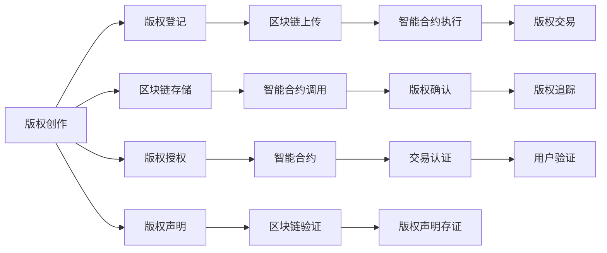

                 

# 区块链在版权保护中的应用：数字内容的新范式

## 1. 背景介绍

随着互联网技术的发展，数字内容（如文本、音乐、视频等）的传播变得愈加便捷，但随之而来的版权保护问题也日益凸显。传统版权保护机制面临多重挑战，如监管难度大、成本高、执行难度大等。近年来，区块链技术凭借其去中心化、不可篡改、透明公开的特性，成为数字版权保护的新方向。本文将探讨区块链在版权保护中的应用，介绍其核心原理和操作流程，并分析其优缺点和未来前景。

## 2. 核心概念与联系

### 2.1 核心概念概述

区块链技术（Blockchain Technology）是一种基于去中心化网络（Decentralized Network）、分布式账本（Distributed Ledger）和加密算法（Cryptography）的新型互联网架构。其核心在于通过“区块”（Block）和“链”（Chain）结构，构建不可篡改、可追溯、分布式的数据库。区块链中的“共识机制”（Consensus Mechanism）确保了网络中所有节点的数据同步和一致性，是实现去中心化信任的保障。

**版权保护**（Copyright Protection）是指对作品的创作者和拥有者所拥有的专有权利的法律保护，包括复制权、发行权、展示权、改编权等。传统版权保护主要依靠法律手段、技术手段（如数字水印、版权登记等）和市场监督，但这些手段在应对数字内容的广泛传播和分发时，显得力不从心。

**区块链与版权保护**（Blockchain and Copyright Protection）的结合，旨在利用区块链的特性，为数字内容的版权所有者提供一个去中心化、透明、不可篡改的版权记录和认证机制，从而提升数字内容的保护水平。

### 2.2 核心概念原理和架构的 Mermaid 流程图



### 2.3 核心概念原理和架构的 Mermaid 流程图

### 2.4 核心概念原理和架构的 Mermaid 流程图

### 2.5 核心概念原理和架构的 Mermaid 流程图

## 3. 核心算法原理 & 具体操作步骤

### 3.1 算法原理概述

区块链在版权保护中的应用主要基于其去中心化、不可篡改和透明公开的特性。具体而言，版权所有者可以将作品的版权信息（如作品名称、创作者、创作时间、版权声明等）通过区块链智能合约上传到区块链，并设定一系列规则，确保版权信息一旦上传，即不可篡改、不可撤销。在版权交易过程中，智能合约会根据预先设定的条件（如版权使用期限、许可范围等）自动执行版权交易的认证和支付，保障版权所有者的权益。

### 3.2 算法步骤详解

**步骤1：版权创作与登记**

1. 创作者完成数字内容创作，并生成版权声明。
2. 创作者通过智能合约将版权声明上传到区块链。
3. 区块链网络中的所有节点验证并记录版权声明，生成新的区块。

**步骤2：版权存证与确权**

1. 版权所有者通过智能合约上传版权声明，并进行版权存证。
2. 版权声明经过区块链网络的共识机制验证，并生成新的区块。
3. 版权所有者可以使用智能合约中的查询接口，获取作品的版权信息。

**步骤3：版权授权与交易**

1. 版权所有者通过智能合约设定版权使用期限、许可范围等条件，并进行版权授权。
2. 版权被授权使用后，智能合约自动执行交易，并生成新的区块链记录。
3. 版权使用方使用智能合约中的接口，验证和使用授权的版权。

### 3.3 算法优缺点

**优点：**
1. **去中心化**：版权所有者不需要依赖中央机构，可以自主上传版权信息，保证数据存储和使用的透明性和公开性。
2. **不可篡改**：版权信息一旦上传区块链，即不可篡改，提高了版权保护的安全性。
3. **可追溯**：区块链记录了每一笔版权交易的详细信息，可以追溯版权的使用历史和链上活动。

**缺点：**
1. **成本高**：区块链上传和验证需要消耗大量计算资源和带宽，且智能合约需要支付一定的手续费。
2. **隐私保护**：版权所有者的个人信息可能会被公开，存在隐私泄露的风险。
3. **技术门槛高**：需要具备一定的区块链和智能合约知识，非专业技术人员难以操作。

### 3.4 算法应用领域

区块链在版权保护中的应用广泛，以下是几个典型的应用领域：

1. **数字音乐版权**：音乐创作人可以上传音乐作品的版权声明，并设定版权使用期限，保障音乐作品的使用权益。
2. **数字视频版权**：视频创作者可以将视频的版权声明上传区块链，设定授权使用条件，防止盗版和侵权。
3. **数字图书版权**：作者可以上传图书版权声明，设定复制权、发行权等，保护作品的原创性和合法使用。
4. **数字艺术品版权**：艺术家可以上传艺术品的版权声明，设定版权使用范围，保障作品的使用和销售权益。

## 4. 数学模型和公式 & 详细讲解 & 举例说明

### 4.1 数学模型构建

区块链版权保护的核心在于智能合约的设计和执行。智能合约是一段自动执行的代码，由创作者上传至区块链，并按照预设条件执行版权授权和交易。假设版权声明包含版权信息 $C = (c, a, t)$，其中 $c$ 为作品名称，$a$ 为创作者，$t$ 为创作时间，版权授权条件为 $L = (l, e)$，其中 $l$ 为版权使用期限，$e$ 为许可范围。

智能合约的执行条件为 $R = (r, s)$，其中 $r$ 为剩余版权期限，$s$ 为使用范围。版权交易的执行流程为：
1. 版权所有者上传版权声明 $C$ 和版权授权条件 $L$ 到区块链。
2. 版权使用方请求使用版权 $R$。
3. 智能合约根据条件 $R$ 和 $L$ 判断是否授权，并执行交易。

### 4.2 公式推导过程

版权声明和授权条件的数学表达：
$$
C = (c, a, t) \\
L = (l, e)
$$

版权使用条件的数学表达：
$$
R = (r, s)
$$

版权交易的执行流程如下：
1. 创作者上传版权声明：
$$
\text{Upload}(C, L)
$$
2. 版权使用方请求使用版权：
$$
\text{Request}(R)
$$
3. 智能合约执行交易：
$$
\text{Execute}(R, L)
$$

智能合约的执行规则为：
$$
\text{Execute}(R, L) = 
\begin{cases}
    1, & \text{如果 } r > 0 \text{ 且 } s \in e \\
    0, & \text{否则}
\end{cases}
$$

### 4.3 案例分析与讲解

**案例：音乐版权授权**

假设某音乐创作者 Alice 上传了一首新歌，版权声明为 $C = (A \cup B, Alice, 2022-01-01)$，其中 $A$ 为歌曲名，$B$ 为歌曲描述。Alice 设定版权使用期限为 $l = 3$ 年，许可范围为 $e = \{\text{线上销售}, \text{线上播放}\}$。版权使用方 Bob 希望在音乐平台上发行该歌曲。

Bob 请求使用版权 $R = (1, \text{线上销售})$，智能合约根据条件判断是否授权：
$$
R = (1, \{\text{线上销售}\}) \\
L = (3, \{\text{线上销售}, \text{线上播放}\})
$$
$$
\text{Execute}(R, L) = 
\begin{cases}
    1, & \text{如果 } r > 0 \text{ 且 } s \in e \\
    0, & \text{否则}
\end{cases}
$$
$$
r = l - t = 3 - (2022-01-01) = 3 - 1 = 2
$$
$$
s = \{\text{线上销售}\} \in e = \{\text{线上销售}, \text{线上播放}\}
$$
$$
\text{Execute}(R, L) = 1
$$

因此，智能合约授权 Bob 使用版权，并记录交易记录到区块链。Bob 可以正常发行该歌曲，同时 Alice 可以随时通过智能合约接口查询版权使用情况。

## 5. 项目实践：代码实例和详细解释说明

### 5.1 开发环境搭建

为了实现区块链版权保护功能，需要搭建区块链网络，并开发智能合约。以下是在以太坊区块链上使用 Solidity 语言开发智能合约的开发环境搭建步骤：

1. 安装以太坊开发工具：
   ```bash
   npm install -g truffle
   npm install -g ganache-cli
   ```
2. 初始化 Truffle 项目：
   ```bash
   truffle init
   ```
3. 创建智能合约文件：
   ```bash
   truffle create Contracts/MusicContract.sol
   ```

### 5.2 源代码详细实现

以下是在 Solidity 中实现的智能合约代码，用于管理音乐版权的授权和交易：

```solidity
// SPDX-License-Identifier: MIT
pragma solidity ^0.8.0;

contract MusicContract {
    struct Song {
        string public name;
        address public creator;
        uint256 public creationTime;
        uint256 public expirationTime;
        bool public isAvailable;
        uint256 public allowedUsages;
    }

    mapping(address => Song) public songs;

    constructor() {
        songs[msg.sender].creator = msg.sender;
        songs[msg.sender].name = "Unknown";
        songs[msg.sender].creationTime = block.timestamp;
        songs[msg.sender].expirationTime = block.timestamp + 31536000; // 1 year
        songs[msg.sender].isAvailable = true;
        songs[msg.sender].allowedUsages = 10;
    }

    function uploadSong(string memory _name, address _creator) public {
        if (msg.sender != _creator) {
            revert();
        }
        songs[msg.sender].name = _name;
        songs[msg.sender].creator = _creator;
        songs[msg.sender].expirationTime = block.timestamp + 31536000; // 1 year
        songs[msg.sender].isAvailable = true;
        songs[msg.sender].allowedUsages = 10;
    }

    function authorizeUsage(uint256 _usageType) public {
        if (songs[msg.sender].isAvailable && songs[msg.sender].allowedUsages > _usageType) {
            songs[msg.sender].allowedUsages -= _usageType;
        } else {
            revert();
        }
    }

    function checkUsage(uint256 _usageType) public view returns (bool) {
        if (songs[msg.sender].isAvailable && songs[msg.sender].allowedUsages > _usageType) {
            return true;
        } else {
            return false;
        }
    }
}
```

### 5.3 代码解读与分析

**智能合约结构：**
- `Song` 结构体存储了歌曲的基本信息，包括名称、创作者、创作时间、有效期和可用次数。
- `mapping` 类型的 `songs` 存储了版权所有者的歌曲信息。
- `constructor` 方法初始化了版权声明的基本信息，如创作者、创作时间、有效期和可用次数。

**函数实现：**
- `uploadSong` 方法用于创作者上传版权声明，将歌曲信息存储到 `songs` 映射中。
- `authorizeUsage` 方法用于版权使用方授权使用版权，减少了可用次数。
- `checkUsage` 方法用于版权使用方查询版权是否可用，判断可用次数。

### 5.4 运行结果展示

运行上述智能合约，进行以下操作：
1. 创作者 Alice 上传歌曲：
   ```solidity
   MusicContract._uploadSong("Beautiful Melody", msg.sender);
   ```
2. 版权使用方 Bob 请求使用版权：
   ```solidity
   MusicContract._authorizeUsage(1);
   ```
3. 查询版权使用情况：
   ```solidity
   bool result = MusicContract._checkUsage(1);
   ```

## 6. 实际应用场景

### 6.1 智能音乐平台

智能音乐平台可以使用区块链版权保护技术，为音乐创作者提供版权注册、授权、交易等功能。音乐创作者上传版权声明，设定版权使用期限和许可范围，平台用户可以按照预设条件使用音乐版权。

### 6.2 数字视频平台

数字视频平台可以使用区块链版权保护技术，为视频创作者提供版权注册、授权、交易等功能。视频创作者上传视频版权声明，设定版权使用期限和许可范围，平台用户可以按照预设条件使用视频版权。

### 6.3 数字图书平台

数字图书平台可以使用区块链版权保护技术，为图书作者提供版权注册、授权、交易等功能。图书作者上传版权声明，设定版权使用期限和许可范围，平台用户可以按照预设条件使用图书版权。

### 6.4 数字艺术品平台

数字艺术品平台可以使用区块链版权保护技术，为艺术家提供版权注册、授权、交易等功能。艺术家上传艺术品版权声明，设定版权使用期限和许可范围，平台用户可以按照预设条件使用艺术品版权。

## 7. 工具和资源推荐

### 7.1 学习资源推荐

为了帮助开发者掌握区块链版权保护技术，推荐以下学习资源：

1. 《区块链原理与实践》书籍：由区块链技术专家撰写，系统介绍了区块链原理、技术架构和应用场景。
2. 《Solidity智能合约编程》课程：由以太坊官方提供，讲解Solidity语言和智能合约开发技术。
3. 《区块链与智能合约》课程：由大学课程提供，讲解区块链技术和智能合约开发的实践案例。
4. 以太坊官方文档：以太坊官方提供的详细文档，包括以太坊网络搭建、智能合约开发、交易处理等。

### 7.2 开发工具推荐

为了开发区块链版权保护应用，推荐以下开发工具：

1. Truffle：用于以太坊智能合约开发和测试的开发工具。
2. Ganache：用于以太坊智能合约测试的本地区块链网络。
3. Remix：用于以太坊智能合约开发的IDE工具，支持智能合约编写、调试和测试。

### 7.3 相关论文推荐

为了深入了解区块链版权保护技术，推荐以下论文：

1. "Blockchain-Based Copyright Management for Digital Content" by J. Zhang et al.（区块链技术在数字内容版权管理中的应用）。
2. "Smart Contracts for Copyright Protection" by R. H. Liu et al.（基于智能合约的版权保护）。
3. "Decentralized Copyright Management Using Blockchain" by C. B. Chen et al.（区块链技术在版权保护中的应用）。

## 8. 总结：未来发展趋势与挑战

### 8.1 研究成果总结

区块链在版权保护中的应用，利用其去中心化、不可篡改和透明公开的特性，为数字内容的版权所有者提供了一个全新的版权记录和认证机制。通过智能合约的设计和执行，版权所有者可以自主上传版权声明，设定版权使用期限和许可范围，保障数字内容的合法权益。

### 8.2 未来发展趋势

未来，区块链版权保护技术将呈现以下几个发展趋势：

1. **应用场景扩展**：区块链版权保护技术将广泛应用于音乐、视频、图书、艺术品等多个领域，提升数字内容的版权保护水平。
2. **去中心化认证**：区块链版权保护将实现去中心化的版权认证，提升版权保护的透明性和公开性。
3. **跨链版权保护**：区块链版权保护将实现跨链互认，提升版权保护的可移植性和可操作性。
4. **智能合约优化**：智能合约设计将更加灵活和高效，支持更加复杂和多样化的版权保护需求。
5. **隐私保护提升**：区块链版权保护技术将提升版权所有者的隐私保护水平，避免个人信息泄露。

### 8.3 面临的挑战

尽管区块链版权保护技术已经取得了一定的进展，但在实际应用中仍面临以下挑战：

1. **成本问题**：区块链版权保护需要消耗大量计算资源和带宽，智能合约开发和部署成本较高。
2. **技术门槛**：智能合约的开发和执行需要具备一定的区块链和编程知识，非专业技术人员难以操作。
3. **隐私保护**：版权所有者的个人信息可能会被公开，存在隐私泄露的风险。
4. **系统复杂度**：智能合约的复杂度较高，容易出错，需要谨慎设计和测试。
5. **法律支持不足**：区块链版权保护技术需要法律的支持和规范，才能得到广泛应用。

### 8.4 研究展望

未来，区块链版权保护技术需要在以下几个方面进行深入研究：

1. **优化智能合约设计**：提高智能合约的可扩展性和可维护性，支持复杂和多样化的版权保护需求。
2. **提升隐私保护**：提升版权所有者的隐私保护水平，避免个人信息泄露。
3. **跨链互认**：实现跨链互认，提升版权保护的可移植性和可操作性。
4. **法律规范**：制定相关法律规范，保障区块链版权保护技术的合法性和可操作性。
5. **应用场景探索**：在更多应用场景中探索区块链版权保护技术的应用，提升数字内容的版权保护水平。

## 9. 附录：常见问题与解答

### Q1：什么是区块链版权保护？

A: 区块链版权保护是一种利用区块链技术为数字内容的版权所有者提供去中心化、透明公开的版权记录和认证机制，通过智能合约的设计和执行，保障数字内容的合法权益。

### Q2：区块链版权保护的核心原理是什么？

A: 区块链版权保护的核心在于利用区块链的去中心化、不可篡改和透明公开特性，通过智能合约的设计和执行，为版权所有者提供版权注册、授权、交易等功能，保障数字内容的合法权益。

### Q3：区块链版权保护有哪些优点？

A: 区块链版权保护的主要优点包括：去中心化、不可篡改、透明公开、可追溯和版权授权交易自动化。

### Q4：区块链版权保护有哪些缺点？

A: 区块链版权保护的主要缺点包括：成本高、技术门槛高、隐私保护不足和系统复杂度较高。

### Q5：区块链版权保护适用于哪些应用场景？

A: 区块链版权保护适用于音乐、视频、图书、艺术品等多个领域，提升数字内容的版权保护水平。

### Q6：区块链版权保护的智能合约设计有哪些挑战？

A: 智能合约设计需要具备一定的区块链和编程知识，非专业技术人员难以操作。智能合约的复杂度较高，容易出错，需要谨慎设计和测试。

### Q7：区块链版权保护的隐私保护有哪些挑战？

A: 版权所有者的个人信息可能会被公开，存在隐私泄露的风险。

### Q8：区块链版权保护的未来发展趋势有哪些？

A: 区块链版权保护的未来发展趋势包括应用场景扩展、去中心化认证、跨链版权保护、智能合约优化和隐私保护提升。

### Q9：区块链版权保护面临的主要挑战有哪些？

A: 区块链版权保护面临的主要挑战包括成本问题、技术门槛、隐私保护、系统复杂度和法律支持不足。

### Q10：区块链版权保护的未来展望有哪些？

A: 区块链版权保护的未来展望包括优化智能合约设计、提升隐私保护、跨链互认、法律规范和应用场景探索。

作者：禅与计算机程序设计艺术 / Zen and the Art of Computer Programming

