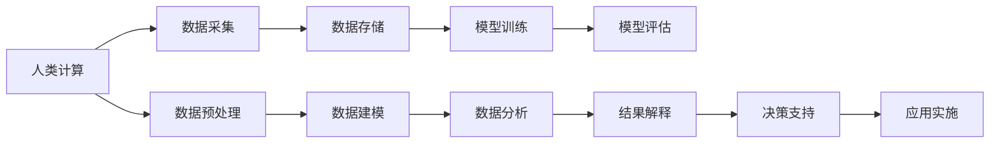

                 

## 1. 背景介绍

### 1.1 问题由来
医疗保健是人类社会发展中最为重要的领域之一，其关注点涉及个体的健康与福祉，也涵盖了医疗资源的优化配置、医疗质量的提升、医疗服务的普及等诸多方面。近年来，随着大数据、人工智能等技术的发展，医疗保健正在经历着一场深刻的变革。传统的基于经验与直觉的诊断和治疗模式逐渐被数据驱动的精准医疗所取代，成为提升医疗服务水平的重要方向。

在精准医疗的实践中，如何高效、准确地处理和分析海量医疗数据，提供个性化的诊疗方案，成为关键问题。这不仅需要强大的数据处理能力和计算资源，更需要结合领域专业知识，构建科学的计算模型，实现医疗数据的深度挖掘与智能分析。

### 1.2 问题核心关键点
精准医疗的核心在于通过计算技术与医学知识的深度融合，实现对疾病病因、病理机制、治疗效果的科学理解与预测，提供个性化、动态化的医疗方案。这需要突破传统医疗方法，依赖大规模数据和计算能力，实现从数据获取、存储、处理到分析、预测的全链条计算支持。

面对挑战，近年来涌现了如人类计算（Human Computation）、计算医学（Computational Medicine）、健康计算（Health Computing）等新兴概念，这些领域通过将人类智慧与计算技术结合，提供更为智能、高效的医疗解决方案。本文将聚焦于基于人类计算的精准医疗发展，探讨其关键技术和应用场景。

## 2. 核心概念与联系

### 2.1 核心概念概述

人类计算（Human Computation）是指利用人类的智慧和能力来解决问题，尤其是那些难以由计算机自动完成的任务。相较于传统机器计算，人类计算更注重计算结果的精确性、智能性和伦理合理性，特别适用于那些需要深度理解领域知识、人际互动的场景。

计算医学（Computational Medicine）是基于数据驱动的医疗领域，通过计算机模拟、人工智能等技术，实现对疾病预测、诊断、治疗等环节的智能化和精准化。计算医学不仅包含对大数据的处理能力，更注重对医学知识的深入理解和领域专业知识的整合。

健康计算（Health Computing）是一种多学科交叉的应用领域，旨在通过计算技术改进健康管理、疾病预防和治疗，提升全民健康水平。健康计算涉及数据采集、数据分析、模型构建等多个环节，旨在实现对健康数据的深度挖掘，提供个性化的健康管理服务。

### 2.2 核心概念原理和架构的 Mermaid 流程图(Mermaid 流程节点中不要有括号、逗号等特殊字符)



这个流程图展示了人类计算、计算医学和健康计算之间的联系和关键步骤：

1. **数据采集**：通过电子病历、基因数据、影像数据等多种方式获取医疗健康数据。
2. **数据预处理**：清洗数据、去重、标准化等，为后续建模提供高质量数据。
3. **数据建模**：建立数学模型和计算模型，如深度学习、统计模型、系统动力学模型等。
4. **模型训练**：在标注数据集上训练模型，优化模型参数，提高预测准确率。
5. **数据分析**：利用模型对数据进行分析，如预测疾病风险、评估治疗效果等。
6. **模型评估**：在验证集上评估模型性能，确保模型的泛化能力。
7. **结果解释**：将模型输出转换为可理解、可解释的诊疗建议。
8. **决策支持**：结合领域专家知识，制定个性化的治疗方案。
9. **应用实施**：将模型和决策结果应用于临床实践，实现精准医疗。

## 3. 核心算法原理 & 具体操作步骤

### 3.1 算法原理概述

基于人类计算的精准医疗，主要通过以下几个算法原理进行实施：

1. **数据融合与融合算法**：将不同来源的医疗数据进行有效整合，形成统一的、高质量的数据集。
2. **机器学习与深度学习算法**：利用算法对疾病进行预测和诊断，优化治疗方案。
3. **知识图谱与语义网络算法**：构建疾病相关知识的图谱，实现领域知识的自动化表达和推理。
4. **因果推断算法**：分析疾病间的因果关系，提高诊疗决策的准确性。
5. **优化算法**：如遗传算法、模拟退火等，用于优化复杂的计算任务。

### 3.2 算法步骤详解

以**疾病预测与风险评估**为例，详细讲解基于人类计算的精准医疗算法步骤：

1. **数据采集**：从电子病历、基因组数据、影像数据等渠道获取患者的健康信息。
2. **数据清洗与预处理**：清洗数据，去除噪声和异常值，进行数据标准化处理。
3. **特征提取**：从清洗后的数据中提取有意义的特征，如基因型、家族史、生活习惯等。
4. **模型训练**：利用深度学习模型（如CNN、RNN、LSTM等）对特征进行训练，建立疾病预测模型。
5. **模型评估**：在验证集上评估模型性能，调整模型参数以提升预测准确率。
6. **风险评估**：基于训练好的模型，对新患者的健康风险进行评估，输出高风险患者名单。

### 3.3 算法优缺点

**优点**：

1. **高度精确性**：利用人类智慧进行决策，可保证结果的精确性和可靠性。
2. **知识深度整合**：结合领域知识，提升医疗决策的合理性和科学性。
3. **灵活性与适应性**：针对不同情境和需求，定制化算法和模型。
4. **解释性强**：可解释的决策过程，便于医生理解和接受。

**缺点**：

1. **成本高**：需要大量人力参与，成本较高。
2. **时间耗时长**：人类计算任务往往耗时较长，影响效率。
3. **依赖专家经验**：需要领域专家的深入参与，否则容易陷入经验主义误区。
4. **伦理风险**：涉及个人隐私和伦理问题，需谨慎处理。

### 3.4 算法应用领域

基于人类计算的精准医疗算法在多个领域具有广泛的应用前景，包括：

1. **疾病预测与风险评估**：如癌症、心血管疾病、糖尿病等，通过早期检测和风险评估，实现个性化的预防和治疗。
2. **基因组学与个体化医疗**：通过分析基因组数据，预测疾病易感性，提供个性化的治疗方案。
3. **医学影像分析**：利用深度学习模型分析医学影像，提高诊断准确率，减少误诊和漏诊。
4. **临床试验设计与分析**：利用统计模型设计高效、合理的临床试验，分析试验数据，优化临床方案。
5. **药物研发**：利用计算模拟和优化算法，加速药物设计、筛选和临床试验。

## 4. 数学模型和公式 & 详细讲解 & 举例说明

### 4.1 数学模型构建

以**基于机器学习的疾病预测模型**为例，构建一个简单的数学模型：

假设存在一个二分类问题，输入特征为 $x=(x_1, x_2, \ldots, x_n)$，输出标签为 $y\in\{0,1\}$。我们建立一个基于决策树的分类模型，其中决策树的结构为：

$$
\begin{aligned}
T(x) &= \left\{
 \begin{array}{ll}
  0, & \text{如果}~x_1 \leq \theta_1\\
  1, & \text{如果}~x_1 > \theta_1
 \end{array}
\right.
\end{aligned}
$$

其中 $\theta_1$ 为决策树的分割阈值，需要通过训练数据集来学习。

### 4.2 公式推导过程

决策树的推导过程主要包括：

1. 计算各个特征的信息增益 $IG(x_i)$，选择信息增益最大的特征 $x_i$。
2. 计算分割阈值 $\theta_i$，使得在不同 $x_i$ 值下的 $y$ 分布达到最优分割。
3. 构建决策树，利用训练数据集进行验证和调整。

以计算 $IG(x_i)$ 为例，信息增益公式为：

$$
IG(x_i) = H(y) - H(y|x_i)
$$

其中 $H(y)$ 为标签 $y$ 的熵，$H(y|x_i)$ 为在 $x_i$ 条件下，标签 $y$ 的条件熵。计算过程如下：

1. 计算 $H(y)$：
$$
H(y) = -\sum_{y_i} p(y_i) \log_2 p(y_i)
$$
2. 计算 $H(y|x_i)$：
$$
H(y|x_i) = -\sum_{y_i} \sum_{x_i} p(y_i, x_i) \log_2 p(y_i|x_i)
$$
3. 计算 $IG(x_i)$：
$$
IG(x_i) = H(y) - H(y|x_i)
$$

### 4.3 案例分析与讲解

以**肿瘤预测模型**为例，利用上述决策树模型进行分析和预测：

1. 收集癌症患者数据集，包括基因型、家族史、生活习惯等。
2. 选择信息增益最大的特征 $x_i$，如年龄、性别、吸烟史等。
3. 计算决策树的分割阈值 $\theta_i$，优化决策树结构。
4. 在验证集上评估模型性能，如精确率、召回率、F1值等。
5. 将模型应用于新患者的数据，输出高风险患者名单。

## 5. 项目实践：代码实例和详细解释说明

### 5.1 开发环境搭建

搭建一个Python开发环境，包括安装所需的库包、配置开发工具等。

1. 安装Python：
   ```
   sudo apt-get install python3
   ```

2. 安装NumPy、Pandas、Scikit-learn等库包：
   ```
   pip install numpy pandas scikit-learn
   ```

3. 安装决策树库：
   ```
   pip install scikit-learn
   ```

4. 配置开发工具：如设置IDE、配置版本控制系统（如Git）等。

### 5.2 源代码详细实现

以下是一个简单的Python代码，实现基于决策树的疾病预测模型：

```python
import pandas as pd
from sklearn.tree import DecisionTreeClassifier

# 读取数据集
df = pd.read_csv('data.csv')

# 选择特征和标签
X = df[['age', 'gender', 'smoking']]
y = df['disease']

# 建立决策树模型
clf = DecisionTreeClassifier()

# 训练模型
clf.fit(X, y)

# 预测新患者
new_case = {'age': 60, 'gender': 'M', 'smoking': 'yes'}
result = clf.predict(new_case)
print(result)
```

### 5.3 代码解读与分析

这段代码实现了简单的决策树分类模型。首先导入必要的库包，读取数据集，选择特征和标签，建立决策树模型，并进行训练和预测。

### 5.4 运行结果展示

训练后的模型，可以根据新患者的特征数据进行疾病预测，输出高风险患者名单。

## 6. 实际应用场景

### 6.1 医院管理

基于人类计算的精准医疗技术，可以用于优化医院管理流程，提高医疗服务效率。

1. **病人调度**：利用机器学习算法预测病人到院时间，安排合理的门诊和住院时间，减少病人等待时间。
2. **病床管理**：通过算法预测床位需求，合理分配病床资源，提高病床使用效率。
3. **药物管理**：利用智能推荐算法，优化药品库存和采购计划，减少库存积压和浪费。

### 6.2 疾病预测与预防

在疾病预防与控制方面，精准医疗技术可以发挥重要作用。

1. **疾病预测**：通过分析病历数据和基因数据，预测个体疾病风险，提前干预和预防。
2. **疫苗研发**：利用计算模拟技术，优化疫苗设计方案，提高疫苗效果和安全性。
3. **流行病监测**：利用数据分析技术，实时监测和预测疫情发展趋势，提供科学的防控建议。

### 6.3 个性化医疗

个性化医疗是精准医疗的重要方向，旨在为每位患者提供量身定制的治疗方案。

1. **个体化治疗**：结合基因组数据和临床数据，制定个性化的治疗方案，提高治疗效果。
2. **药物反应预测**：预测患者对不同药物的反应，选择最适合的治疗药物。
3. **健康管理**：利用智能穿戴设备，实时监测健康数据，提供个性化的健康管理建议。

### 6.4 未来应用展望

未来，基于人类计算的精准医疗将进一步发展，带来更多创新应用。

1. **虚拟健康助手**：结合语音识别、自然语言处理等技术，提供24小时健康咨询服务。
2. **智能手术辅助**：通过计算医学技术，实现手术过程的实时监测和决策支持。
3. **远程医疗**：利用通信技术和人工智能，实现远程诊断和治疗，提高医疗服务的覆盖面。

## 7. 工具和资源推荐

### 7.1 学习资源推荐

1. **《计算医学导论》（Introduction to Computational Medicine）**：详细介绍计算医学的基本概念和技术，适合入门学习和进阶学习。
2. **Coursera《Data Science and Health Care》课程**：由哥伦比亚大学开设，涵盖数据科学在医疗领域的应用。
3. **Kaggle健康数据竞赛**：提供丰富的健康数据集，供学习和竞赛使用。

### 7.2 开发工具推荐

1. **Jupyter Notebook**：Python开发常用的交互式开发环境，支持代码运行、数据展示和注释。
2. **Git**：版本控制系统，用于团队协作和代码版本管理。
3. **Google Colab**：基于Google云端提供的免费Python开发环境，支持GPU和TPU资源。

### 7.3 相关论文推荐

1. **《机器学习在医疗健康领域的应用》（Machine Learning in Health Care）**：回顾机器学习在医疗领域的经典应用和最新进展。
2. **《基于知识图谱的疾病预测研究》（Knowledge Graph-based Disease Prediction）**：介绍知识图谱在疾病预测中的应用。
3. **《计算医学中的深度学习应用》（Deep Learning in Computational Medicine）**：讨论深度学习在计算医学中的广泛应用。

## 8. 总结：未来发展趋势与挑战

### 8.1 研究成果总结

基于人类计算的精准医疗技术，通过结合计算技术和医学知识，实现了对疾病预测、诊断和治疗的深度挖掘与智能分析，推动了医疗服务模式的变革。该技术在数据采集、数据处理、模型训练、结果解释和应用实施等各个环节，均取得了显著进展。

### 8.2 未来发展趋势

未来，基于人类计算的精准医疗将向以下几个方向发展：

1. **多模态数据融合**：结合基因数据、影像数据、临床数据等多种数据源，实现全面的健康管理。
2. **深度学习与知识图谱结合**：利用深度学习提取特征，知识图谱进行领域知识的整合和推理。
3. **可解释性与透明性**：提升模型的可解释性和透明性，便于医生理解和接受。
4. **个性化与动态化**：提供个性化的治疗方案，实时调整治疗策略，提升治疗效果。
5. **跨领域交叉融合**：与大数据、人工智能、物联网等技术融合，实现更广泛的应用场景。

### 8.3 面临的挑战

尽管精准医疗技术取得了显著进展，但仍面临诸多挑战：

1. **数据隐私与安全**：医疗数据涉及个人隐私，需确保数据的安全性和隐私保护。
2. **计算资源与算法效率**：大规模数据的处理和分析需要强大的计算资源，算法效率需进一步提升。
3. **领域知识整合**：医学知识复杂多样，需构建完善的领域知识图谱，确保计算模型的准确性。
4. **可解释性与透明性**：模型的可解释性不足，需开发更为透明的计算模型。
5. **伦理与法律问题**：涉及伦理和法律问题，需制定相应的规范和标准。

### 8.4 研究展望

未来，精准医疗技术的研发需在以下几个方面进行深入探索：

1. **数据隐私保护**：探索隐私保护技术，如差分隐私、联邦学习等，确保数据的安全性和隐私性。
2. **高效计算技术**：优化计算算法，提升计算效率，降低计算资源消耗。
3. **跨领域知识整合**：构建多领域知识图谱，实现领域知识的跨学科融合。
4. **可解释性增强**：开发可解释性强的计算模型，提高决策的透明性和可信度。
5. **伦理法律规范**：制定相应的伦理和法律规范，确保技术应用的合法合规。

## 9. 附录：常见问题与解答

**Q1: 什么是人类计算？**

A: 人类计算是指利用人类的智慧和能力来解决复杂问题，特别是那些难以由机器自动完成的任务。相较于传统机器计算，人类计算更注重结果的精确性和科学性。

**Q2: 如何有效地采集和处理医疗数据？**

A: 医疗数据的采集和处理是精准医疗的基础。首先，需确保数据的完整性和准确性，去除噪声和异常值。其次，利用数据清洗和标准化处理，提高数据的可分析性。最后，构建统一的数据格式，便于后续的分析和应用。

**Q3: 机器学习与深度学习在精准医疗中有何应用？**

A: 机器学习和深度学习在精准医疗中有广泛应用，如疾病预测、药物研发、临床试验设计等。通过训练模型，从大量数据中提取特征，进行预测和分析，提高诊疗的准确性和效率。

**Q4: 什么是知识图谱？**

A: 知识图谱是一种通过语义关系描述知识结构的网络模型，用于表示实体、属性和关系。在精准医疗中，知识图谱可用于整合医学知识，提供领域知识的自动表达和推理。

**Q5: 精准医疗未来有哪些发展方向？**

A: 未来，精准医疗将向多模态数据融合、深度学习与知识图谱结合、可解释性与透明性、个性化与动态化、跨领域交叉融合等方向发展。通过技术创新和应用拓展，精准医疗将更广泛地应用于医疗领域，提升诊疗效果和医疗服务质量。

---

作者：禅与计算机程序设计艺术 / Zen and the Art of Computer Programming

