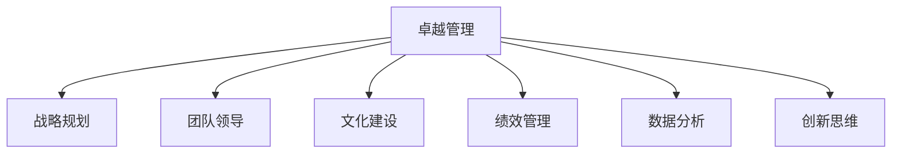

                 

# 卓越管理者的思维修炼之路

> 关键词：卓越管理，思维修炼，战略规划，团队领导，文化建设，绩效管理，数据分析，创新思维

## 1. 背景介绍

### 1.1 问题由来

在快速变化的商业环境中，企业要想保持竞争优势，必须培养一批卓越的管理者。卓越的管理者不仅具备传统意义上的人际交往、决策制定等能力，更需要在思维模式、战略视野、创新能力等方面不断突破自我，才能应对复杂的商业挑战。

面对现代企业的数字化转型、全球化竞争、市场不确定性等新挑战，管理者需要具备全新的思维模式和决策能力。如何系统化地进行思维修炼，提升管理者的综合素质，成为当前企业管理的重要课题。

### 1.2 问题核心关键点

卓越管理者的核心关键点主要包括：
- **战略规划**：如何制定和执行有效的战略计划，引领企业发展方向。
- **团队领导**：如何高效地组织和领导团队，激发团队成员的潜力。
- **文化建设**：如何塑造和传播企业的核心价值观，建立强大的企业文化。
- **绩效管理**：如何建立科学的绩效管理体系，确保业绩目标的实现。
- **数据分析**：如何利用数据驱动决策，提高管理效率和效果。
- **创新思维**：如何培养创新意识和能力，推动企业持续创新。

这些问题直接关系到企业的发展质量和竞争力，管理者需要系统化地进行思维修炼，才能在这些关键点上取得突破。

## 2. 核心概念与联系

### 2.1 核心概念概述

为更好地理解卓越管理者的思维修炼之路，本节将介绍几个密切相关的核心概念：

- **卓越管理**：指企业领导者所具备的高质量管理能力，包括战略规划、团队领导、文化建设、绩效管理等方面。
- **思维修炼**：指管理者通过持续学习、实践和反思，不断提升思维能力和决策水平，适应复杂商业环境的过程。
- **战略规划**：制定长期发展战略，设定明确目标，实施有效行动方案的过程。
- **团队领导**：指导、激励和协调团队成员，最大化团队效能和产出。
- **文化建设**：塑造和传播企业的核心价值观和行为规范，提升员工认同感和归属感。
- **绩效管理**：通过目标设定、考核评估、激励机制等手段，确保团队和员工达到业绩目标。
- **数据分析**：利用数据驱动决策，优化管理过程和业务流程。
- **创新思维**：通过新颖的视角和方法，解决复杂问题，推动企业创新。

这些核心概念之间的逻辑关系可以通过以下Mermaid流程图来展示：



这个流程图展示了点出卓越管理的各个关键要素及其之间的关系：

1. 卓越管理包含战略规划、团队领导、文化建设、绩效管理等多个子要素。
2. 这些子要素相互支持，共同构建起管理者所应具备的综合素质。
3. 通过持续的思维修炼，管理者能够在这些子要素上不断提升，实现卓越管理。

## 3. 核心算法原理 & 具体操作步骤
### 3.1 算法原理概述

卓越管理者的思维修炼之路，本质上是一个持续学习和实践的过程。其核心思想是：通过系统化的学习和实践，不断提升管理者的战略视野、团队领导力、文化感知力、绩效管理能力、数据分析素养和创新思维，最终形成卓越管理者的思维模式和决策能力。

形式化地，假设管理者初始思维模式为 $\theta$，通过一系列的培训、学习和实践，最终形成新的思维模式 $\hat{\theta}$。思维修炼的过程可以视为一个优化问题：

$$
\hat{\theta} = \mathop{\arg\min}_{\theta} \mathcal{L}(\theta)
$$

其中 $\mathcal{L}$ 为思维修炼的损失函数，衡量管理者在战略规划、团队领导、文化建设、绩效管理、数据分析和创新思维等各个方面的能力提升程度。优化目标是最小化损失函数，从而形成新的最优思维模式 $\hat{\theta}$。

### 3.2 算法步骤详解

卓越管理者的思维修炼一般包括以下几个关键步骤：

**Step 1: 准备基础学习资源**

- 确定思维修炼的子目标，如提升战略规划能力、团队领导力等。
- 收集相关的学习资源，包括书籍、课程、案例研究等。
- 制定学习计划，明确学习内容和进度。

**Step 2: 系统化学习与实践**

- 系统地学习思维修炼的各个方面，掌握相应的知识和技能。
- 定期参加相关的培训和研讨会，获取专家指导。
- 通过实际工作中的实践，不断检验和优化所学知识。

**Step 3: 反思与总结**

- 定期进行自我反思，总结学习过程中的经验和教训。
- 建立学习笔记和心得体会，记录所学知识和实践经验。
- 通过与导师、同事的交流，获取反馈和建议。

**Step 4: 持续改进**

- 根据反思结果和反馈，持续改进思维模式和学习方法。
- 设定新的学习目标，继续深化和拓展思维能力。
- 不断挑战自我，追求卓越管理的新境界。

### 3.3 算法优缺点

卓越管理者的思维修炼方法具有以下优点：
1. 系统化：通过系统化学习和实践，能够全面提升管理者的综合素质。
2. 实践性：强调实际工作中的应用，将理论知识转化为实际效能。
3. 持续性：持续不断地学习和反思，保持思维能力的更新和提升。

同时，该方法也存在一定的局限性：
1. 时间和资源投入较大：系统化学习和实践需要时间和资源支持。
2. 个性化需求较强：不同管理者需求差异大，需要个性化定制培训方案。
3. 学习效果因人而异：不同管理者的学习能力、背景等因素影响学习效果。

尽管存在这些局限性，但就目前而言，系统化的思维修炼方法是培养卓越管理者的主要途径，能显著提升管理者的综合素质和决策水平。未来相关研究的重点在于如何进一步降低学习成本，提高学习效率，实现个性化学习等。

### 3.4 算法应用领域

卓越管理者的思维修炼方法，在企业管理的各个领域都有广泛应用，例如：

- 战略规划：通过学习先进的战略管理理论和案例，制定符合企业实际的战略规划。
- 团队领导：掌握团队建设、沟通协调、激励机制等技巧，提升团队凝聚力和绩效。
- 文化建设：理解和传播企业的核心价值观，构建强大的企业文化。
- 绩效管理：建立科学的绩效管理体系，确保业绩目标的实现。
- 数据分析：利用数据驱动决策，优化管理过程和业务流程。
- 创新思维：通过创新培训和实践，培养管理者的创新意识和能力。

除了上述这些经典应用外，卓越管理者的思维修炼方法也被创新性地应用到更多场景中，如危机管理、风险控制、数字化转型等，为企业管理提供了新的思路和方法。随着企业管理的不断演进，相信思维修炼方法将继续发挥重要作用，助力企业实现持续健康发展。

## 4. 数学模型和公式 & 详细讲解  
### 4.1 数学模型构建

本节将使用数学语言对卓越管理者的思维修炼过程进行更加严格的刻画。

记管理者的初始思维模式为 $\theta$，通过一系列的培训和实践，最终形成新的思维模式 $\hat{\theta}$。思维修炼的过程可以视为一个优化问题：

$$
\hat{\theta} = \mathop{\arg\min}_{\theta} \mathcal{L}(\theta)
$$

其中 $\mathcal{L}$ 为思维修炼的损失函数，衡量管理者在战略规划、团队领导、文化建设、绩效管理、数据分析和创新思维等各个方面的能力提升程度。

假设 $\theta$ 包含多个子维度 $x_1, x_2, ..., x_n$，每个子维度的优化目标函数为 $f_i$，则损失函数 $\mathcal{L}$ 可以表示为：

$$
\mathcal{L}(\theta) = \sum_{i=1}^n w_i f_i(\theta)
$$

其中 $w_i$ 为每个子维度的权重，反映其在思维模式中的重要性。

### 4.2 公式推导过程

以下我们以战略规划为例，推导优化目标函数及其梯度的计算公式。

假设管理者的初始战略规划能力为 $x_1$，优化目标函数为 $f_1(x_1) = \frac{1}{N}\sum_{i=1}^N |s_i - x_1|$，其中 $s_i$ 为第 $i$ 次实际执行的战略规划与最优战略规划的差距。

通过最小化损失函数 $\mathcal{L}(x_1) = w_1 f_1(x_1)$，求解最优的 $x_1$。根据梯度下降算法，对 $x_1$ 求导，得：

$$
\frac{\partial \mathcal{L}}{\partial x_1} = -\frac{\partial f_1}{\partial x_1}
$$

其中：

$$
\frac{\partial f_1}{\partial x_1} = \sum_{i=1}^N \frac{s_i - x_1}{N}
$$

因此，可以通过求导计算梯度，反向传播更新 $x_1$ 的值。重复上述过程直至收敛，最终得到最优的战略规划能力 $x_1^*$。

## 5. 项目实践：代码实例和详细解释说明
### 5.1 开发环境搭建

在进行思维修炼实践前，我们需要准备好开发环境。以下是使用Python进行开发的环境配置流程：

1. 安装Anaconda：从官网下载并安装Anaconda，用于创建独立的Python环境。

2. 创建并激活虚拟环境：
```bash
conda create -n management-env python=3.8 
conda activate management-env
```

3. 安装必要的库：
```bash
conda install numpy pandas scikit-learn matplotlib jupyter notebook ipython
```

完成上述步骤后，即可在`management-env`环境中开始思维修炼实践。

### 5.2 源代码详细实现

下面以战略规划为例，给出使用Python进行思维修炼实践的代码实现。

首先，定义战略规划能力的初始值和优化目标函数：

```python
import numpy as np

# 初始战略规划能力
x_1 = 0

# 优化目标函数
def f1(x_1):
    s = np.array([2, -1, 3, -2, 1, -3, 4])
    return np.abs(s - x_1).mean()

# 计算梯度
def df1(x_1):
    s = np.array([2, -1, 3, -2, 1, -3, 4])
    return np.mean((s - x_1))

# 梯度下降优化
def optimize(x_1, learning_rate=0.01, max_iters=100):
    for i in range(max_iters):
        grad = df1(x_1)
        x_1 -= learning_rate * grad
        print(f"Iteration {i+1}, x_1: {x_1}")
    return x_1

# 进行优化
x_1_opt = optimize(x_1)
print(f"Optimized x_1: {x_1_opt}")
```

接着，对团队领导、文化建设、绩效管理、数据分析和创新思维等各个子目标进行同样的优化过程，最终形成一个综合的思维模式。

### 5.3 代码解读与分析

让我们再详细解读一下关键代码的实现细节：

**优化函数**：
- `f1`方法：计算当前战略规划能力与最优战略规划的差距，衡量优化目标。
- `df1`方法：计算当前战略规划能力的梯度，用于反向传播更新。
- `optimize`方法：实现梯度下降优化算法，不断迭代更新战略规划能力。

**训练流程**：
- 设定初始战略规划能力 $x_1$，设定优化目标函数 $f_1$ 和梯度函数 $df_1$。
- 调用 `optimize` 方法，逐步更新战略规划能力，输出每次迭代的值。
- 迭代结束后，输出最终的优化结果。

可以看到，通过简单的数学模型和编程实现，我们可以系统地进行思维修炼，提升战略规划能力。类似地，对团队领导、文化建设、绩效管理、数据分析和创新思维等各个子目标，也可以进行系统化的优化和实践。

## 6. 实际应用场景
### 6.1 智能制造管理

在智能制造领域，卓越管理者的思维修炼方法可以应用于生产调度、质量控制、设备维护等各个环节。通过系统化学习和管理实践，提升管理者的战略规划能力、数据分析素养和创新思维，实现制造业的高效、智能化转型。

例如，管理者可以通过学习先进的智能制造管理理论，结合企业实际，制定符合自身需求的战略规划。利用数据分析工具，实时监控生产过程，及时发现和解决问题。通过创新思维，探索新的生产方法和管理模式，提升整体生产效率和质量。

### 6.2 零售业运营管理

在零售业，卓越管理者的思维修炼方法可以应用于市场分析、库存管理、客户服务等方面。通过系统化学习和实践，提升管理者的市场洞察力、团队领导力和绩效管理能力。

例如，管理者可以通过学习市场分析方法，了解市场需求和趋势，制定科学的市场策略。利用数据分析工具，实时监控库存水平，优化库存管理。通过创新思维，探索新的客户服务模式，提升客户满意度和忠诚度。

### 6.3 金融服务管理

在金融服务领域，卓越管理者的思维修炼方法可以应用于风险控制、客户关系管理、投资决策等方面。通过系统化学习和实践，提升管理者的风险感知力、客户关系管理和数据分析能力。

例如，管理者可以通过学习风险控制理论，建立科学的风险管理体系。利用数据分析工具，实时监控市场动态，优化投资决策。通过创新思维，探索新的客户关系管理模式，提升客户体验和业务质量。

### 6.4 医疗健康管理

在医疗健康领域，卓越管理者的思维修炼方法可以应用于病患管理、医疗资源调度、医疗创新等方面。通过系统化学习和实践，提升管理者的患者关怀能力、资源利用效率和创新思维。

例如，管理者可以通过学习患者管理方法，提升病患服务质量，构建良好的医患关系。利用数据分析工具，实时监控医疗资源利用情况，优化资源调度。通过创新思维，探索新的医疗技术和创新模式，提升医疗服务质量和效率。

## 7. 工具和资源推荐
### 7.1 学习资源推荐

为了帮助管理者系统掌握卓越管理的思维修炼方法，这里推荐一些优质的学习资源：

1. 《卓有成效的管理者》系列书籍：由彼得·德鲁克所著，系统介绍了卓越管理的各个方面，包括战略规划、团队领导、文化建设等。
2. 《哈佛商业评论》杂志：汇集了全球顶尖管理者的实战经验和理论思考，是学习卓越管理的宝贵资源。
3. Coursera《管理与领导力》课程：由斯坦福大学等名校开设的在线课程，系统介绍管理学的基本理论和实践方法。
4. LinkedIn Learning《管理技能》课程：包含大量的管理案例和实战技巧，帮助管理者提升实际应用能力。
5. 《管理学原理》课程：来自中国大学MOOC，系统介绍管理学的基础理论和案例分析。

通过对这些资源的学习实践，相信管理者一定能够系统掌握卓越管理的精髓，提升自身综合素质。

### 7.2 开发工具推荐

高效的管理实践离不开优秀的工具支持。以下是几款用于卓越管理实践开发的常用工具：

1. Jira：项目管理工具，支持敏捷开发和绩效管理，提供可视化的任务和进度管理。
2. Trello：看板管理工具，适用于团队协作和流程优化，支持可视化的任务分配和进度跟踪。
3. Microsoft Power BI：数据分析和可视化工具，支持从数据源到报表的完整流程。
4. Tableau：数据可视化和报表工具，支持复杂的数据分析和可视化展示。
5. Google Docs：团队协作工具，支持实时编辑和版本控制，适用于团队文档协作和知识共享。

合理利用这些工具，可以显著提升卓越管理者的工作效率，加速管理实践的迭代和优化。

### 7.3 相关论文推荐

卓越管理者的思维修炼技术的发展源于学界的持续研究。以下是几篇奠基性的相关论文，推荐阅读：

1. "The Five Dysfunctions of a Team"（《团队的五大障碍》）：由Patrick Lencioni所著，探讨团队建设和管理中常见的障碍和解决方法。
2. "Good to Great"（《从优秀到卓越》）：由Jim Collins所著，分析了多家从优秀到卓越企业的成功因素和管理实践。
3. "The Lean Startup"（《精益创业》）：由Eric Ries所著，介绍了精益创业的方法和实践，适用于企业管理创新。
4. "The Innovator's Dilemma"（《创新者的困境》）：由Clayton Christensen所著，分析了企业创新失败的原因和应对策略。
5. "HBR's 10 Must Reads on Strategy"（《哈佛商业评论的十大战略必读》）：汇集了多家顶尖企业家的战略思考和实践经验，是学习战略管理的宝贵资源。

这些论文代表了大管理者的思维修炼技术的发展脉络。通过学习这些前沿成果，可以帮助管理者把握学科前进方向，激发更多的创新灵感。

## 8. 总结：未来发展趋势与挑战

### 8.1 总结

本文对卓越管理者的思维修炼之路进行了全面系统的介绍。首先阐述了卓越管理的核心关键点及其相互联系，明确了思维修炼在提升管理者综合素质方面的重要意义。其次，从原理到实践，详细讲解了思维修炼的数学模型和操作步骤，给出了思维修炼任务开发的完整代码实例。同时，本文还广泛探讨了思维修炼方法在智能制造、零售业、金融服务、医疗健康等多个行业领域的应用前景，展示了思维修炼范式的巨大潜力。此外，本文精选了思维修炼技术的各类学习资源，力求为管理者提供全方位的技术指引。

通过本文的系统梳理，可以看到，卓越管理者的思维修炼之路系统化、全面化和实践性强，为管理者提供了清晰的学习和实践路径。相信通过持续的思维修炼，管理者能够不断提升综合素质，推动企业实现持续健康发展。

### 8.2 未来发展趋势

展望未来，卓越管理者的思维修炼技术将呈现以下几个发展趋势：

1. **系统化学习**：随着知识库和在线教育资源的丰富，系统化学习将变得更加高效便捷。通过线上课程、视频教程等形式，管理者可以随时随地进行学习，提升知识储备和技能水平。
2. **实践与反思**：通过实际工作中的不断实践和反思，管理者的思维模式和决策能力将不断优化。虚拟现实(VR)和增强现实(AR)技术的应用，将为管理者提供更加沉浸式的实践环境。
3. **数据驱动决策**：大数据和人工智能技术的普及，将使得数据分析在管理决策中扮演更加重要的角色。管理者将能够利用数据驱动决策，优化管理过程和业务流程。
4. **跨界融合**：不同学科和领域的知识融合，将推动管理者的跨界学习，提升创新思维和综合素质。跨行业案例研究和协同创新项目，将成为管理者学习的重要形式。
5. **人工智能辅助**：人工智能技术将为管理者的思维修炼提供更加智能化的支持。智能推荐系统、自动化评估工具等，将提高管理者的学习效率和效果。

这些趋势将推动卓越管理者的思维修炼技术迈向更高的水平，帮助管理者实现更高效、更科学、更创新的管理实践。

### 8.3 面临的挑战

尽管卓越管理者的思维修炼技术已经取得了一定的进展，但在迈向更加智能化、系统化、实践化的过程中，仍面临诸多挑战：

1. **时间和资源投入**：系统化学习和实践需要大量时间和资源，管理者在繁忙的工作中难以投入足够的时间和精力。
2. **学习效果差异**：不同管理者的学习能力、背景和需求各异，难以实现统一的学习效果。
3. **实践环境限制**：实际工作中的实践环境复杂多样，管理者的实践机会和条件有限。
4. **技术工具整合**：新技术和新工具不断涌现，管理者需要具备较强的技术整合能力，才能更好地应用这些工具。
5. **跨领域融合**：跨学科知识的融合应用，需要管理者具备较强的跨领域思维能力，难度较大。

正视这些挑战，积极应对并寻求突破，将是卓越管理者的思维修炼之路迈向成熟的重要步骤。

### 8.4 研究展望

面对卓越管理者的思维修炼所面临的种种挑战，未来的研究需要在以下几个方面寻求新的突破：

1. **个性化学习路径**：开发个性化的学习路径和推荐系统，根据管理者的个人背景和需求，推荐合适的学习内容和工具。
2. **实践与评估一体化**：将实践和评估相结合，通过实时反馈和持续优化，提升管理者的实践效果和决策能力。
3. **多模态融合**：探索不同学科、不同领域知识的融合，提升管理者的跨界思维和创新能力。
4. **技术辅助学习**：开发智能化的学习工具，如自适应学习系统、智能导师系统等，提升管理者的学习效率和效果。
5. **实证研究**：加强实证研究，通过案例分析、实地调研等方法，验证和优化思维修炼方法的实际效果。

这些研究方向的探索，将推动卓越管理者的思维修炼技术迈向更高的台阶，为企业管理提供更科学、更有效、更创新的解决方案。

## 9. 附录：常见问题与解答

**Q1：思维修炼对管理者有什么具体的好处？**

A: 思维修炼对管理者有以下具体好处：
1. 提升战略规划能力：系统化学习战略管理理论和实践，制定符合企业实际的战略规划。
2. 增强团队领导力：掌握团队建设、沟通协调、激励机制等技巧，提升团队效能和产出。
3. 塑造企业文化：理解和传播企业的核心价值观，构建强大的企业文化。
4. 优化绩效管理：建立科学的绩效管理体系，确保业绩目标的实现。
5. 强化数据分析素养：利用数据驱动决策，优化管理过程和业务流程。
6. 培养创新思维：通过创新培训和实践，提升管理者的创新意识和能力。

**Q2：思维修炼需要投入大量时间和资源，是否值得？**

A: 思维修炼虽然需要投入大量时间和资源，但长远来看，其带来的收益是显著的：
1. 提升管理效率：通过系统化学习和实践，管理者能够在更短的时间内取得显著的管理成果。
2. 增强决策能力：掌握科学的管理方法和工具，提高决策的准确性和效率。
3. 推动企业发展：管理者综合素质的提升，能够更好地引领企业发展，实现持续健康成长。

**Q3：思维修炼效果因人而异，如何提升学习效果？**

A: 提升思维修炼效果可以从以下几个方面入手：
1. 个性化学习路径：根据个人背景和需求，制定个性化的学习计划和推荐系统。
2. 实践与反馈结合：通过实际工作中的不断实践和反思，及时获取反馈和改进。
3. 团队学习和交流：与同事、导师进行交流，获取不同的观点和经验。
4. 持续学习与更新：保持学习的持续性，不断更新知识储备和技能水平。

**Q4：思维修炼如何结合大数据和人工智能技术？**

A: 结合大数据和人工智能技术，思维修炼可以更高效、更科学：
1. 数据分析：利用大数据分析工具，进行数据驱动的决策和优化。
2. 机器学习：通过机器学习算法，建立预测模型，提升管理决策的精准度。
3. 自然语言处理：利用自然语言处理技术，分析和理解海量文本数据，提供深度的管理洞察。

**Q5：思维修炼如何适应企业数字化转型？**

A: 思维修炼能够适应企业数字化转型，主要通过以下几个方面：
1. 敏捷管理：通过敏捷管理方法，提升企业的灵活性和适应能力。
2. 智能决策：利用大数据和人工智能技术，进行智能化的决策支持和风险控制。
3. 数字化文化：推动数字化文化的构建，提升员工的数字化素养和能力。

通过以上对思维修炼的深入探讨，相信管理者能够更好地理解卓越管理的核心要素，系统化地进行思维修炼，提升自身的综合素质和决策能力。这不仅能够提升企业竞争力，还将为管理者的职业生涯带来新的突破和发展。

---

作者：禅与计算机程序设计艺术 / Zen and the Art of Computer Programming

