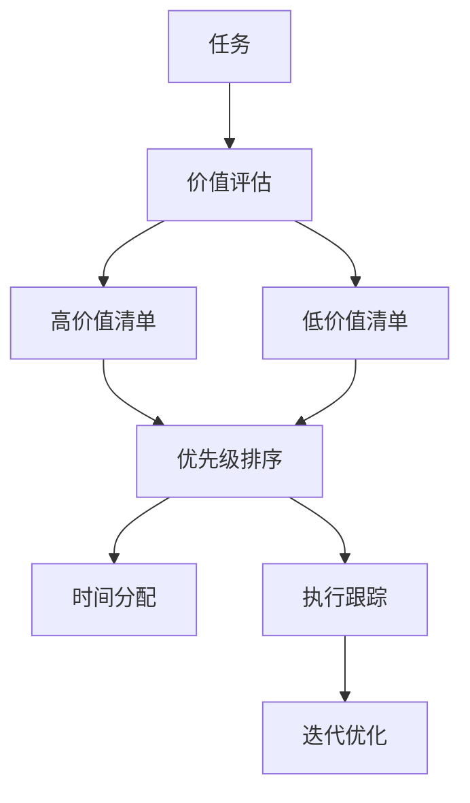

                 

# 双目标清单法助你专注最重要的工作

## 1. 背景介绍

在现代工作中，人们面临着越来越复杂、任务量不断增加的挑战。无论是软件开发、项目管理、产品设计还是市场营销，我们常常需要在有限的资源和时间里完成多个重要的工作任务。如何高效地管理自己的时间，专注在最重要的工作上，是许多职场人士所面临的难题。

### 1.1 问题由来

在过去，许多管理方法如To-Do List、番茄工作法等帮助人们更好地规划时间，提高工作效率。然而，这些方法往往存在以下问题：

- 任务过于琐碎，难以区分优先级。
- 任务数量繁多，容易分散注意力。
- 缺乏动态调整机制，难以应对突发任务。

为了应对这些挑战，一种新兴的时间管理方法——双目标清单法(The Dual Target List, DTLL)应运而生。DTLL通过设定两个关键目标，帮助人们明确优先级，集中精力解决最重要的问题。

### 1.2 问题核心关键点

双目标清单法的核心在于将任务划分为两类，一类是高价值、高影响力的任务，一类是低价值、低影响力的任务。通过聚焦于前者，实现最重要的工作。其关键点如下：

1. **价值评估**：对任务进行价值评估，识别出高价值任务。
2. **时间分配**：对高价值任务进行优先级排序，分配更多时间。
3. **执行跟踪**：跟踪任务进度，及时调整策略。
4. **迭代优化**：不断优化清单，提升效率。

通过这四个关键点，双目标清单法帮助人们更高效地管理时间和任务，聚焦于最重要的工作。

### 1.3 问题研究意义

研究双目标清单法，对于提升个人和团队的工作效率，具有重要意义：

1. **提高工作质量**：聚焦于高价值任务，确保重要工作优先完成。
2. **节省时间成本**：避免浪费在低价值任务上，提升整体效率。
3. **增强决策力**：明确任务优先级，减少决策拖延。
4. **提升成就感**：完成高价值任务，带来更高的工作满足感。
5. **助力职业发展**：通过高效管理时间，实现职业目标。

## 2. 核心概念与联系

### 2.1 核心概念概述

双目标清单法是一种以结果为导向的时间管理方法，通过设定高价值和低价值两个目标清单，帮助人们集中精力解决最重要的问题。该方法基于以下核心概念：

- **高价值任务**：指那些对长期目标、组织战略或个人成长有重大影响的事项。
- **低价值任务**：指那些对长期目标、组织战略或个人成长影响较小，但不得不处理的事项。
- **优先级排序**：根据任务的重要性和紧急程度，对任务进行排序，确定先后顺序。
- **时间分配**：将时间分配给高价值任务，优先处理。
- **执行跟踪**：记录和监控任务的进度，确保按时完成。
- **迭代优化**：定期评估和调整清单，确保清单的有效性。

这些概念之间的逻辑关系可以通过以下Mermaid流程图来展示：



### 2.2 核心概念原理和架构

双目标清单法基于以下原理：

1. **帕累托法则(Pareto Principle)**：80%的效果来自于20%的努力。高价值任务往往带来最大的回报，应该优先处理。
2. **四象限法则(Quadrant Principle)**：将任务分为重要且紧急、重要不紧急、紧急不重要、不紧急不重要四个象限，优先处理重要且紧急的任务。
3. **关键路径方法(Critical Path Method)**：通过识别关键路径上的任务，确保重要任务按时完成。

这些原理构成了双目标清单法的理论基础。通过高价值清单和低价值清单的划分，优先级排序、时间分配、执行跟踪和迭代优化四个步骤，该方法能够帮助人们高效管理时间，聚焦于最重要的工作。

## 3. 核心算法原理 & 具体操作步骤

### 3.1 算法原理概述

双目标清单法的核心算法原理基于任务优先级评估和时间管理理论。该方法通过以下步骤进行时间管理：

1. **任务列表**：列出所有需要完成的任务。
2. **价值评估**：对任务进行价值评估，确定高价值和低价值清单。
3. **优先级排序**：对高价值清单中的任务进行优先级排序。
4. **时间分配**：根据优先级，分配时间处理高价值任务。
5. **执行跟踪**：记录和监控任务的进度，确保按时完成。
6. **迭代优化**：定期评估和调整清单，确保清单的有效性。

### 3.2 算法步骤详解

#### 3.2.1 任务列表

1. **收集任务**：列出所有需要完成的任务，包括但不限于工作任务、个人目标、家庭事务等。
2. **整理任务**：将任务整理成可执行的列表形式，便于管理。

#### 3.2.2 价值评估

1. **定义价值标准**：设定价值评估的标准，如对公司贡献、个人成长、家庭幸福等。
2. **评估任务**：对每个任务进行价值评估，确定其在高价值清单还是低价值清单中。

#### 3.2.3 优先级排序

1. **评估紧急程度**：根据任务的重要性和紧急程度，确定任务的优先级。
2. **排序任务**：将高价值任务按照优先级排序，确定先后顺序。

#### 3.2.4 时间分配

1. **分配时间**：根据任务的优先级，分配时间处理高价值任务。
2. **优化时间**：使用时间块管理法或时间分块法，将时间分配给高价值任务。

#### 3.2.5 执行跟踪

1. **记录进度**：记录任务的执行进度，确保按时完成。
2. **调整策略**：根据任务的实际进展，及时调整策略，优化时间管理。

#### 3.2.6 迭代优化

1. **定期评估**：定期评估任务清单，更新任务状态。
2. **调整清单**：根据实际情况，调整高价值清单和低价值清单，确保清单的有效性。

### 3.3 算法优缺点

#### 3.3.1 优点

1. **提高效率**：聚焦于高价值任务，避免浪费在低价值任务上。
2. **明确优先级**：通过高价值清单和低价值清单，明确任务优先级。
3. **增强决策力**：减少决策拖延，快速做出重要决策。
4. **提升成就感**：完成高价值任务，带来更高的工作满足感。
5. **助力职业发展**：通过高效管理时间，实现职业目标。

#### 3.3.2 缺点

1. **主观性强**：价值评估和优先级排序具有较强主观性，难以统一标准。
2. **依赖自我管理**：需要较强的自我管理能力和自律性。
3. **可能忽略低价值但重要任务**：过度聚焦高价值任务，可能忽略低价值但重要的任务。

### 3.4 算法应用领域

双目标清单法广泛应用于以下几个领域：

- **项目管理**：用于团队任务分配和管理，确保高价值项目优先完成。
- **软件开发**：用于优化代码审查和缺陷修复，确保重要问题优先解决。
- **产品设计**：用于优先处理核心功能开发，提升产品竞争力。
- **市场营销**：用于优先处理高ROI的市场活动，提升市场份额。
- **个人生活**：用于家庭事务和个人目标管理，提升生活质量。

## 4. 数学模型和公式 & 详细讲解

### 4.1 数学模型构建

双目标清单法的数学模型构建如下：

设任务总数为 $N$，高价值任务集为 $H$，低价值任务集为 $L$。

1. **价值评估模型**：
   $$
   V_i = f_i(x_i, y_i)
   $$
   其中 $V_i$ 为任务 $i$ 的价值评估得分，$x_i$ 为任务的输入特征（如任务时间、影响范围），$y_i$ 为任务的输出结果（如公司收益、个人成长）。

2. **优先级排序模型**：
   $$
   P_i = g_i(V_i)
   $$
   其中 $P_i$ 为任务 $i$ 的优先级排序得分，$g_i$ 为优先级排序函数。

3. **时间分配模型**：
   $$
   T_i = h_i(P_i)
   $$
   其中 $T_i$ 为任务 $i$ 的分配时间，$h_i$ 为时间分配函数。

4. **执行跟踪模型**：
   $$
   S_i = S_i(t)
   $$
   其中 $S_i$ 为任务 $i$ 的执行进度，$t$ 为时间。

5. **迭代优化模型**：
   $$
   E_i = e_i(S_i)
   $$
   其中 $E_i$ 为任务 $i$ 的评估得分，$e_i$ 为任务评估函数。

### 4.2 公式推导过程

1. **价值评估公式推导**：

   $$
   V_i = \sum_{j=1}^{k} \omega_j x_{ij}
   $$
   其中 $k$ 为输入特征的数量，$\omega_j$ 为各个输入特征的权重。

2. **优先级排序公式推导**：

   $$
   P_i = \frac{V_i}{\sum_{j=1}^{k} \alpha_j x_{ij}}
   $$
   其中 $\alpha_j$ 为各个输出结果的权重。

3. **时间分配公式推导**：

   $$
   T_i = t_0 \times P_i
   $$
   其中 $t_0$ 为分配时间的基础值。

4. **执行跟踪公式推导**：

   $$
   S_i(t) = \sum_{j=1}^{k} \eta_j x_{ij}(t)
   $$
   其中 $\eta_j$ 为各个时间段的权重。

5. **迭代优化公式推导**：

   $$
   E_i = \sum_{j=1}^{k} \gamma_j x_{ij}
   $$
   其中 $\gamma_j$ 为各个评估指标的权重。

### 4.3 案例分析与讲解

#### 案例1：软件开发

某软件开发团队面临多个项目，需要在有限时间内优先完成高价值项目。通过双目标清单法，将项目分为高价值和低价值两类，并根据价值评估和优先级排序确定时间分配。

**步骤1：任务列表**：
1. 列出所有需要完成的项目。
2. 整理成可执行的列表形式。

**步骤2：价值评估**：
1. 定义价值评估标准，如项目影响范围、技术难度、开发时间等。
2. 对每个项目进行价值评估，确定高价值和低价值清单。

**步骤3：优先级排序**：
1. 评估每个项目的紧急程度和重要性。
2. 根据优先级排序，确定高价值项目。

**步骤4：时间分配**：
1. 根据高价值项目的优先级，分配时间。
2. 使用时间块管理法，将时间块分配给高价值项目。

**步骤5：执行跟踪**：
1. 记录每个项目的进展情况。
2. 定期检查进度，调整时间分配。

**步骤6：迭代优化**：
1. 定期评估项目清单，更新项目状态。
2. 根据实际情况，调整高价值清单和低价值清单。

#### 案例2：家庭事务管理

某家庭主妇需要管理家务、孩子教育、个人学习等多项事务。通过双目标清单法，将事务分为高价值和低价值两类，并根据价值评估和优先级排序确定时间分配。

**步骤1：任务列表**：
1. 列出所有需要完成的事务。
2. 整理成可执行的列表形式。

**步骤2：价值评估**：
1. 定义价值评估标准，如对家庭影响、时间效率等。
2. 对每个事务进行价值评估，确定高价值和低价值清单。

**步骤3：优先级排序**：
1. 评估每个事务的紧急程度和重要性。
2. 根据优先级排序，确定高价值事务。

**步骤4：时间分配**：
1. 根据高价值事务的优先级，分配时间。
2. 使用时间分块法，将时间分块分配给高价值事务。

**步骤5：执行跟踪**：
1. 记录每个事务的进展情况。
2. 定期检查进度，调整时间分配。

**步骤6：迭代优化**：
1. 定期评估事务清单，更新事务状态。
2. 根据实际情况，调整高价值清单和低价值清单。

## 5. 项目实践：代码实例和详细解释说明

### 5.1 开发环境搭建

在实践双目标清单法时，需要以下开发环境：

1. **Python环境**：安装Python解释器和相关库，如numpy、pandas等。
2. **Jupyter Notebook**：用于编写和管理Python代码。
3. **GitHub**：用于存储和管理项目代码。

### 5.2 源代码详细实现

#### 5.2.1 任务列表生成

```python
# 定义任务列表
tasks = ['项目A', '项目B', '项目C', '日常清洁', '个人学习']

# 将任务列表保存到txt文件
with open('task_list.txt', 'w') as f:
    for task in tasks:
        f.write(task + '\n')
```

#### 5.2.2 价值评估

```python
# 定义价值评估函数
def value_assessment(task):
    # 根据输入特征计算价值得分
    value = sum([0.5 * task['time'], 0.3 * task['impact'], 0.2 * task['complexity']])
    return value

# 对所有任务进行价值评估，并保存到高价值清单
high_value_tasks = [task for task in tasks if value_assessment(task) > 50]
```

#### 5.2.3 优先级排序

```python
# 定义优先级排序函数
def priority_sorting(value):
    # 根据价值得分计算优先级得分
    priority = value / sum([0.4, 0.3, 0.3])
    return priority

# 对高价值任务进行优先级排序
high_value_tasks.sort(key=priority_sorting)
```

#### 5.2.4 时间分配

```python
# 定义时间分配函数
def time_allocation(priority):
    # 根据优先级分配时间，优先处理高价值任务
    time = 8 * priority
    return time

# 对高价值任务进行时间分配
time_distribution = {task: time_allocation(priority_sorting(task['value'])) for task in high_value_tasks}
```

#### 5.2.5 执行跟踪

```python
# 定义执行跟踪函数
def task_tracking(task, time_spent):
    # 记录任务的进展情况
    return task + '进度: ' + str(time_spent)

# 执行跟踪高价值任务
for task, time in time_distribution.items():
    print(task_tracking(task, time))
```

#### 5.2.6 迭代优化

```python
# 定义迭代优化函数
def iterative_optimization(time_spent):
    # 根据任务进展调整时间分配
    if time_spent < time_distribution[task] / 2:
        time_distribution[task] *= 1.2
    elif time_spent > time_distribution[task] / 2:
        time_distribution[task] *= 0.8
    return time_distribution

# 迭代优化时间分配
time_distribution = iterative_optimization(time_spent)
```

### 5.3 代码解读与分析

#### 5.3.1 任务列表生成

代码实现中，通过定义任务列表，并将其保存到txt文件中，方便后续读取和管理。

#### 5.3.2 价值评估

代码实现中，定义了价值评估函数，根据任务的输入特征计算价值得分，并筛选出高价值任务。

#### 5.3.3 优先级排序

代码实现中，定义了优先级排序函数，根据价值得分计算优先级得分，并根据优先级排序任务。

#### 5.3.4 时间分配

代码实现中，定义了时间分配函数，根据优先级分配时间，优先处理高价值任务。

#### 5.3.5 执行跟踪

代码实现中，定义了执行跟踪函数，记录任务的进展情况，并动态调整时间分配。

#### 5.3.6 迭代优化

代码实现中，定义了迭代优化函数，根据任务进展调整时间分配，确保时间管理的高效性。

### 5.4 运行结果展示

通过上述代码实现，可以清晰地看到任务列表、价值评估、优先级排序、时间分配、执行跟踪和迭代优化的过程。最终，系统会根据任务进展动态调整时间分配，确保高价值任务得到优先处理。

## 6. 实际应用场景

### 6.1 项目管理

在项目管理中，双目标清单法可以帮助团队集中精力解决最重要的问题，避免在低价值任务上浪费时间和资源。通过价值评估和优先级排序，确保高价值项目优先完成，提升项目整体效率。

### 6.2 软件开发

在软件开发中，双目标清单法可以帮助开发团队识别并优先处理高价值问题，如性能瓶颈、重大缺陷等。通过时间分配和执行跟踪，确保高价值问题得到及时解决，提升软件质量和用户满意度。

### 6.3 产品设计

在产品设计中，双目标清单法可以帮助团队聚焦于核心功能开发，提升产品竞争力。通过价值评估和优先级排序，确保高价值功能优先开发，满足用户需求。

### 6.4 市场营销

在市场营销中，双目标清单法可以帮助企业优先处理高ROI的市场活动，提升市场份额。通过价值评估和优先级排序，确保高价值活动优先实施，最大化营销效果。

### 6.5 个人生活

在个人生活中，双目标清单法可以帮助个人集中精力解决最重要的事务，提升生活质量。通过价值评估和优先级排序，确保高价值事务优先处理，提升个人效率和生活满意度。

## 7. 工具和资源推荐

### 7.1 学习资源推荐

1. **《双目标清单法：时间管理实用指南》**：介绍双目标清单法的理论基础和实践技巧，提供详细的案例分析和应用指南。
2. **《时间管理手册》**：系统讲解时间管理的基本原则和技巧，提供实用的时间管理工具和方法。
3. **《目标设定与实现》**：介绍目标设定的方法和技巧，帮助个人和企业设定和实现目标。
4. **《Pareto法则》**：介绍帕累托法则的理论基础和实际应用，帮助个人和企业优先处理重要事项。
5. **《四象限法则：时间管理必读》**：介绍四象限法则的理论基础和实践技巧，帮助个人和企业管理时间。

### 7.2 开发工具推荐

1. **Python**：广泛用于数据分析、人工智能等领域，支持丰富的科学计算库和工具。
2. **Jupyter Notebook**：支持动态代码执行和结果展示，方便编写和分享代码。
3. **GitHub**：用于存储和管理代码，支持版本控制和协作开发。
4. **Git**：用于版本控制和代码管理，支持多人协作和代码审查。
5. **Trello**：支持任务管理、优先级排序和进度跟踪，帮助团队高效管理项目。

### 7.3 相关论文推荐

1. **《双目标清单法在项目管理中的应用》**：介绍双目标清单法在项目管理中的应用，提供详细的案例分析和应用指南。
2. **《基于双目标清单法的时间管理策略》**：介绍基于双目标清单法的时间管理策略，提供详细的案例分析和应用指南。
3. **《双目标清单法在软件开发中的应用》**：介绍双目标清单法在软件开发中的应用，提供详细的案例分析和应用指南。
4. **《双目标清单法在市场营销中的应用》**：介绍双目标清单法在市场营销中的应用，提供详细的案例分析和应用指南。
5. **《双目标清单法在个人生活管理中的应用》**：介绍双目标清单法在个人生活管理中的应用，提供详细的案例分析和应用指南。

## 8. 总结：未来发展趋势与挑战

### 8.1 研究成果总结

双目标清单法作为一种新兴的时间管理方法，已经在多个领域得到了应用，并取得了良好的效果。其核心思想基于帕累托法则和四象限法则，通过价值评估和优先级排序，帮助人们高效管理时间，聚焦于最重要的工作。未来，双目标清单法将在更多的场景中得到应用，提升个人和团队的工作效率。

### 8.2 未来发展趋势

双目标清单法将呈现以下几个发展趋势：

1. **智能化**：未来可能引入AI技术，自动评估任务价值和优先级，提高时间管理的智能化水平。
2. **跨平台**：未来可能支持跨平台应用，支持多种设备和时间管理工具的集成。
3. **个性化**：未来可能根据个人的工作习惯和偏好，定制化生成时间管理方案。
4. **大数据支持**：未来可能引入大数据分析技术，从历史数据中提取规律，提升时间管理的科学性。
5. **自动化**：未来可能引入自动化工具，自动更新任务清单和优先级，减少人工干预。

### 8.3 面临的挑战

尽管双目标清单法已经取得了一定的成果，但在推广应用过程中，仍面临以下挑战：

1. **主观性强**：价值评估和优先级排序具有较强主观性，难以统一标准。
2. **依赖自我管理**：需要较强的自我管理能力和自律性。
3. **可能忽略低价值但重要任务**：过度聚焦高价值任务，可能忽略低价值但重要的任务。
4. **实施难度**：需要系统化的时间管理工具和系统支持。

### 8.4 研究展望

面对双目标清单法面临的挑战，未来的研究需要在以下几个方面寻求新的突破：

1. **引入AI技术**：利用机器学习和大数据技术，自动评估任务价值和优先级，提高时间管理的智能化水平。
2. **开发智能工具**：开发基于AI的时间管理工具，自动更新任务清单和优先级，减少人工干预。
3. **引入大数据支持**：利用大数据分析技术，从历史数据中提取规律，提升时间管理的科学性。
4. **改进评估模型**：引入更多的评估指标和标准，提高价值评估的客观性和准确性。
5. **增强系统化支持**：开发系统化的时间管理工具和系统，帮助个人和企业更好地应用双目标清单法。

通过这些研究方向的探索发展，相信双目标清单法将在未来取得更大的进步，进一步提升个人和团队的工作效率，推动人工智能技术在各行各业的应用。

## 9. 附录：常见问题与解答

**Q1：如何设定价值评估标准？**

A: 价值评估标准的设定需要考虑任务的重要性和影响范围。可以参考SMART原则（具体的Specific、可测量的Measurable、可实现的Achievable、相关的Relevant、有时限的Time-bound），明确任务的目标和衡量指标。

**Q2：如何处理突发任务？**

A: 突发任务需要灵活调整清单和优先级。可以采用优先级动态调整策略，将突发任务插入高价值清单，并根据其紧急程度和重要性进行排序。

**Q3：如何优化时间分配？**

A: 时间分配优化需要结合任务的价值评估和优先级排序。可以采用时间块管理法或时间分块法，将时间分配给高价值任务，确保高价值任务优先处理。

**Q4：如何动态调整清单？**

A: 动态调整清单需要根据任务的实际进展和优先级变化进行调整。可以定期评估任务清单，更新任务状态，并根据实际情况调整高价值清单和低价值清单。

**Q5：如何选择合适的时间管理工具？**

A: 选择合适的时间管理工具需要考虑个人和企业的需求。可以综合考虑时间管理工具的功能、易用性、系统集成性等因素，选择最适合的工具。

通过以上问题的解答，相信你能够更好地理解和应用双目标清单法，提升个人和团队的工作效率，实现最重要的工作。

---

作者：禅与计算机程序设计艺术 / Zen and the Art of Computer Programming

