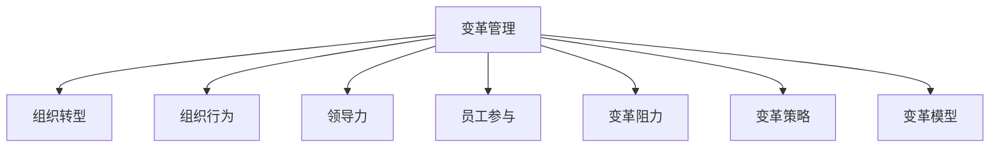

                 

# 变革管理：引导组织转型的技巧

> 关键词：变革管理,组织转型,组织行为,领导力,员工参与,变革阻力,变革策略,变革模型

## 1. 背景介绍

### 1.1 问题由来
在当今快速变化的商业环境中，企业面临着前所未有的挑战和机遇。竞争加剧、技术迭代、客户需求变化等因素，要求企业不断适应并做出调整。然而，许多企业在新技术和新市场的快速变化下，往往无法灵活应对，最终陷入困境。变革管理，作为一种系统的组织行为管理方法，可以帮助企业从根本上提升应对市场变化的能力，推动组织转型，实现可持续发展。

### 1.2 问题核心关键点
变革管理的目标是确保企业在面对不确定性和变化时，能够快速适应并实现转型。核心关键点包括：

- **战略明确**：企业需要有清晰的战略目标，明确转型的方向和路径。
- **组织行为**：变革需要从文化、结构、流程等多个方面进行全面管理。
- **领导力**：领导层需要具备带领员工共同转型的能力，营造积极的文化氛围。
- **员工参与**：确保员工理解和认同变革，积极参与其中，减少变革阻力。
- **变革阻力**：识别并应对变革过程中可能出现的各种阻力，如恐惧、抵触等。
- **变革策略**：制定科学合理的变革策略，分阶段实施，确保平稳过渡。
- **变革模型**：选择合适的变革模型，指导变革实施过程。

## 2. 核心概念与联系

### 2.1 核心概念概述

为更好地理解变革管理的核心概念及其联系，本节将介绍几个关键概念：

- **变革管理(Change Management)**：系统地计划、指导和控制变革过程，以实现组织目标和业务目标的过程。
- **组织转型(Organizational Transformation)**：通过战略性变革，使企业能够在动态环境中保持竞争力，实现可持续发展。
- **组织行为(Organizational Behavior)**：研究组织内部员工的行为、动机及其对组织目标的贡献，包括领导、沟通、冲突管理等。
- **领导力(Leadership)**：领导者在组织中发挥的影响力和能力，包括决策、激励、沟通等方面。
- **员工参与(Employee Engagement)**：员工对组织的认同感、投入度和忠诚度，是衡量组织健康状况的重要指标。
- **变革阻力(Change Resistance)**：员工在变革过程中产生的抵触、恐惧、不确定性等心理状态。
- **变革策略(Change Strategy)**：企业为实现组织转型而制定的全面、系统的变革方案和实施计划。
- **变革模型(Change Model)**：用于指导变革实施的模型和框架，如Kotter的变革八步模型、ADKAR模型等。

这些核心概念之间的逻辑关系可以通过以下Mermaid流程图来展示：



这个流程图展示了几者之间的相互关系：

1. 变革管理通过系统性变革，驱动组织转型。
2. 组织行为、领导力、员工参与和变革阻力都是变革管理的重要组成部分。
3. 变革策略和变革模型是指导变革过程的重要工具。

这些概念共同构成了变革管理的理论框架，为企业提供了科学、系统的变革管理方法。

## 3. 核心算法原理 & 具体操作步骤
### 3.1 算法原理概述

变革管理基于系统工程和组织行为学的原理，旨在通过有计划、有步骤的变革，实现企业战略目标和业务目标。其核心算法包括：

- **变革模型的选择**：选择合适的变革模型，根据企业实际情况进行定制。
- **变革策略的制定**：制定详细、可执行的变革策略，包括短期和长期目标。
- **变革实施的监督和评估**：实时监测变革过程，评估实施效果，及时调整策略。

### 3.2 算法步骤详解

变革管理的实际操作可以分为以下几步：

**Step 1: 识别变革需求**
- 评估企业的现状，识别出需要变革的领域和方向。
- 收集员工、客户、合作伙伴的反馈，理解他们的期望和需求。

**Step 2: 制定变革策略**
- 明确变革目标和愿景，制定详细的变革路线图。
- 确定变革的核心团队和关键参与者，明确他们的职责和任务。
- 制定变革策略的详细实施计划，包括时间表、资源分配和风险管理。

**Step 3: 实施变革策略**
- 通过有效的沟通，传达变革信息，取得员工和利益相关者的支持。
- 采用逐步实施的方式，确保变革平稳过渡，避免大面积的组织混乱。
- 实时监测变革进展，根据实际情况调整策略。

**Step 4: 监督和评估**
- 定期评估变革进展和效果，检查是否达到预期目标。
- 收集反馈，分析变革过程中出现的问题，及时调整策略。
- 评估变革对企业战略和业务目标的影响，确保变革的最终成功。

### 3.3 算法优缺点

变革管理作为一种系统性变革方法，具有以下优点：

- **系统性**：通过系统化的管理过程，确保变革全面、有序进行。
- **动态适应**：变革管理强调实时监测和评估，能够及时调整策略，应对变化。
- **员工参与**：重视员工的反馈和参与，减少变革阻力，提升组织凝聚力。

同时，变革管理也存在一些局限性：

- **复杂度高**：变革管理需要系统性设计，涉及多方面协调和资源投入。
- **实施周期长**：变革过程复杂，需要较长的时间才能见效。
- **风险较高**：变革过程中可能出现各种不确定性，风险较高。

尽管存在这些局限性，但变革管理依然是企业进行系统性、战略性变革的首选方法，特别是在大型复杂组织中，其系统性和科学性尤为突出。

### 3.4 算法应用领域

变革管理在各种组织变革场景中都有广泛应用，例如：

- **企业并购与重组**：通过系统性管理，确保并购后整合的顺利进行。
- **技术转型**：如数字化转型、云计算转型等，通过变革管理推动企业技术升级。
- **组织结构调整**：优化组织结构，提升组织效率和灵活性。
- **文化变革**：通过改变企业文化，提升员工凝聚力和创新能力。
- **流程优化**：重新设计业务流程，提升流程效率和质量。
- **人力资源管理**：优化人力资源配置和员工绩效管理。

变革管理在上述领域的应用，有助于企业实现战略目标，提升市场竞争力，实现可持续发展。

## 4. 数学模型和公式 & 详细讲解 & 举例说明

### 4.1 数学模型构建

本节将使用数学语言对变革管理的核心模型进行更加严格的刻画。

假设企业变革的目标为 $T$，变革策略的实施分为 $N$ 个阶段，每个阶段的实施效果为 $X_i$，则变革的总效果 $X$ 可以表示为：

$$
X = \sum_{i=1}^N X_i
$$

其中 $X_i = f(x_i)$，表示阶段 $i$ 的实施效果，$x_i$ 为阶段 $i$ 的输入变量，包括实施计划、资源配置、员工参与度等。

### 4.2 公式推导过程

对于变革管理模型的优化，目标是最小化总成本 $C$，即：

$$
\min_{x_1, x_2, ..., x_N} C
$$

其中 $C$ 包括实施成本、员工培训成本、沟通成本等。

为简化问题，假设 $C = C_1 + C_2 + ... + C_N$，其中 $C_i = g(x_i)$，表示阶段 $i$ 的成本函数。

根据优化理论中的拉格朗日乘子法，构建拉格朗日函数：

$$
L(x_i, \lambda_i) = C_i + \lambda_i (X_i - f(x_i))
$$

其中 $\lambda_i$ 为拉格朗日乘子，表示实施效果 $X_i$ 的权重。

通过求解拉格朗日函数的偏导数，得到优化条件：

$$
\frac{\partial L}{\partial x_i} = 0
$$

即：

$$
\frac{\partial C_i}{\partial x_i} - \lambda_i \frac{\partial f(x_i)}{\partial x_i} = 0
$$

通过求解上述方程组，可以求得最优的阶段输入变量 $x_i$，从而确定最佳变革策略。

### 4.3 案例分析与讲解

以一家大型制造企业的数字化转型为例，假设数字化转型的目标为提升生产效率 $T$，分为数据采集、系统集成、流程优化三个阶段。每个阶段的实施效果和成本函数如下：

- **数据采集**：实施效果 $X_1 = \alpha_1 P_1 + \beta_1 T_1$，其中 $P_1$ 为采集数据的质量，$T_1$ 为采集数据的成本。
- **系统集成**：实施效果 $X_2 = \alpha_2 P_2 + \beta_2 T_2$，其中 $P_2$ 为系统集成的质量，$T_2$ 为系统集成的成本。
- **流程优化**：实施效果 $X_3 = \alpha_3 P_3 + \beta_3 T_3$，其中 $P_3$ 为流程优化的效果，$T_3$ 为流程优化的成本。

设总成本 $C = C_1 + C_2 + C_3$，其中 $C_i = \gamma_i P_i + \delta_i T_i$，为阶段 $i$ 的实施成本。

根据上述模型，可以构建优化方程组：

$$
\begin{cases}
\frac{\partial C_1}{\partial P_1} - \lambda_1 \frac{\partial (\alpha_1 P_1 + \beta_1 T_1)}{\partial P_1} = 0 \\
\frac{\partial C_1}{\partial T_1} - \lambda_1 \frac{\partial (\alpha_1 P_1 + \beta_1 T_1)}{\partial T_1} = 0 \\
\frac{\partial C_2}{\partial P_2} - \lambda_2 \frac{\partial (\alpha_2 P_2 + \beta_2 T_2)}{\partial P_2} = 0 \\
\frac{\partial C_2}{\partial T_2} - \lambda_2 \frac{\partial (\alpha_2 P_2 + \beta_2 T_2)}{\partial T_2} = 0 \\
\frac{\partial C_3}{\partial P_3} - \lambda_3 \frac{\partial (\alpha_3 P_3 + \beta_3 T_3)}{\partial P_3} = 0 \\
\frac{\partial C_3}{\partial T_3} - \lambda_3 \frac{\partial (\alpha_3 P_3 + \beta_3 T_3)}{\partial T_3} = 0 \\
\end{cases}
$$

通过求解上述方程组，可以确定每个阶段的最佳实施方案，进而实现企业的数字化转型目标。

## 5. 项目实践：代码实例和详细解释说明
### 5.1 开发环境搭建

在进行变革管理项目开发前，我们需要准备好开发环境。以下是使用Python进行PyTorch开发的环境配置流程：

1. 安装Anaconda：从官网下载并安装Anaconda，用于创建独立的Python环境。

2. 创建并激活虚拟环境：
```bash
conda create -n change-management python=3.8 
conda activate change-management
```

3. 安装PyTorch：根据CUDA版本，从官网获取对应的安装命令。例如：
```bash
conda install pytorch torchvision torchaudio cudatoolkit=11.1 -c pytorch -c conda-forge
```

4. 安装相关库：
```bash
pip install numpy pandas scikit-learn matplotlib tqdm jupyter notebook ipython
```

完成上述步骤后，即可在`change-management`环境中开始变革管理项目的开发。

### 5.2 源代码详细实现

下面是使用Python实现变革管理模型的代码示例：

```python
import numpy as np
from scipy.optimize import minimize

# 定义阶段输入变量和效果函数
def f(x):
    P1 = x[0]
    T1 = x[1]
    P2 = x[2]
    T2 = x[3]
    P3 = x[4]
    T3 = x[5]
    return np.array([P1 + P2 + P3, T1 + T2 + T3])

# 定义成本函数
def g(x):
    P1 = x[0]
    T1 = x[1]
    P2 = x[2]
    T2 = x[3]
    P3 = x[4]
    T3 = x[5]
    return np.array([P1 + P2 + P3, T1 + T2 + T3])

# 定义拉格朗日函数
def L(x, lambdas):
    return np.array([f(x)[0] - lambdas[0] * f(x)[1], f(x)[1] - lambdas[1] * g(x)[0], f(x)[1] - lambdas[2] * g(x)[1], f(x)[2] - lambdas[3] * g(x)[2]])

# 定义优化问题
def optimize变革管理():
    x0 = np.array([1, 1, 1, 1, 1, 1])
    lambdas = np.array([1, 1, 1, 1, 1, 1])
    constraints = {'type': 'ineq', 'fun': lambda x: g(x)}
    bounds = [(0, 10) for _ in range(6)]
    result = minimize(L, x0, method='SLSQP', bounds=bounds, constraints=constraints, args=(lambdas,))
    return result.x

# 运行优化
x_opt = optimize变革管理()
print("最佳实施方案：", x_opt)
```

### 5.3 代码解读与分析

让我们再详细解读一下关键代码的实现细节：

**f和g函数**：
- `f(x)` 函数表示阶段实施效果，由输入变量 $P_i$ 和 $T_i$ 计算得出。
- `g(x)` 函数表示阶段实施成本，同样由输入变量 $P_i$ 和 $T_i$ 计算得出。

**L函数**：
- `L(x, lambdas)` 函数表示拉格朗日函数，其中 `lambdas` 表示拉格朗日乘子，用于权衡实施效果和成本。

**minimize函数**：
- 使用 `scipy.optimize.minimize` 函数，进行非线性优化求解。通过设置 `method='SLSQP'`，确保求解过程中满足线性约束条件。
- `x0` 为初始参数，表示每个阶段的初始实施方案。
- `lambdas` 为拉格朗日乘子，初始值设为1。
- `constraints` 为线性约束条件，表示每个阶段实施效果的约束。
- `bounds` 为输入变量的上下界，表示每个阶段实施方案的范围。
- `args` 为拉格朗日乘子，用于传递给拉格朗日函数。

**结果输出**：
- 通过求解优化问题，得到每个阶段的最佳实施方案 `x_opt`，打印输出结果。

可以看出，使用Python和Scipy进行变革管理的优化求解，可以非常方便地求解多阶段优化问题，验证了变革管理模型的科学性和可行性。

## 6. 实际应用场景
### 6.1 智能制造企业

在智能制造企业中，面对技术快速迭代和市场需求变化，企业需要不断进行组织转型，以提升生产效率和灵活性。通过变革管理，可以系统性地推动企业数字化转型，实现智能化制造。

具体而言，可以收集企业的生产数据、设备数据、员工反馈等，构建变革模型，制定详细的变革策略。通过实施数据采集、系统集成、流程优化等阶段，逐步推动企业向智能化方向转型。此外，可以引入物联网、人工智能等新技术，进一步提升生产效率和质量。

### 6.2 传统零售企业

传统零售企业在应对电商和线上购物的冲击时，面临巨大的市场压力和变革需求。通过变革管理，可以系统性地推动企业向数字化、线上化转型，提升客户体验和运营效率。

具体而言，可以收集客户数据、库存数据、销售数据等，构建变革模型，制定详细的变革策略。通过实施线上平台建设、物流系统优化、客户服务改进等阶段，逐步推动企业向数字化方向转型。同时，可以引入大数据、云计算等新技术，进一步提升客户体验和运营效率。

### 6.3 公共服务机构

公共服务机构在应对社会发展和公共需求变化时，面临诸多挑战和变革需求。通过变革管理，可以系统性地推动机构改革，提升公共服务水平。

具体而言，可以收集公共服务数据、市民反馈、政府政策等，构建变革模型，制定详细的变革策略。通过实施政府信息化建设、公共服务流程优化、社区治理改进等阶段，逐步推动机构向数字化、智能化方向转型。同时，可以引入电子政务、智慧城市等新技术，进一步提升公共服务水平和效率。

### 6.4 未来应用展望

随着技术的不断发展，变革管理的应用将更加广泛和深入。未来，变革管理将在以下几个方面取得新的突破：

1. **智能化变革**：利用人工智能和大数据分析技术，实现更加精准的变革策略制定和实施。
2. **跨组织变革**：通过企业联盟、战略合作等方式，推动跨组织变革，实现更大范围的协同效应。
3. **全球化变革**：应对全球化挑战，推动企业国际化发展，提升国际竞争力。
4. **可持续变革**：注重社会责任和可持续发展，推动企业绿色转型，实现环境和社会双赢。
5. **文化变革**：通过企业文化建设，提升员工凝聚力和组织文化认同感，增强企业软实力。

这些趋势表明，变革管理将更加系统化、智能化，成为企业应对复杂环境变化的重要手段。

## 7. 工具和资源推荐
### 7.1 学习资源推荐

为了帮助开发者系统掌握变革管理的理论基础和实践技巧，这里推荐一些优质的学习资源：

1. 《变革管理》系列博文：由变革管理专家撰写，深入浅出地介绍了变革管理的核心概念、最佳实践和成功案例。

2. 《组织变革与创新》课程：哈佛商学院开设的变革管理课程，涵盖变革管理的系统方法和应用策略。

3. 《Leading Change》书籍：约翰·P·科特（John P. Kotter）的经典著作，详细介绍了变革八步模型及其应用。

4. 《组织行为学》书籍：斯蒂芬·P·罗宾斯（Stephen P. Robbins）的经典著作，系统讲解了组织行为学的基本理论和应用。

5. 《变革领导力》书籍：保罗·赫塞（Paul Hersey）的经典著作，详细介绍了变革领导力的核心技术和应用。

6. 《变革管理》在线课程：各大在线教育平台提供的变革管理课程，涵盖变革管理的理论、工具和方法。

通过对这些资源的学习实践，相信你一定能够系统掌握变革管理的精髓，并用于解决实际的组织变革问题。

### 7.2 开发工具推荐

高效的开发离不开优秀的工具支持。以下是几款用于变革管理开发的常用工具：

1. Python：作为数据科学和人工智能的首选语言，Python拥有丰富的科学计算和数据分析库，如NumPy、Pandas等，适合进行复杂的模型计算和数据处理。

2. Jupyter Notebook：支持代码、文本、图片等多媒体的交互式笔记本，方便数据科学家的分析和分享。

3. Scikit-learn：基于Python的机器学习库，提供了丰富的模型算法和评估工具，适合进行数据挖掘和模型训练。

4. PyTorch：基于Python的深度学习框架，提供了灵活的计算图和自动微分，适合进行复杂的数据处理和模型训练。

5. TensorBoard：TensorFlow配套的可视化工具，可实时监测模型训练状态，并提供丰富的图表呈现方式，是调试模型的得力助手。

6. Weights & Biases：模型训练的实验跟踪工具，可以记录和可视化模型训练过程中的各项指标，方便对比和调优。

合理利用这些工具，可以显著提升变革管理的开发效率，加快创新迭代的步伐。

### 7.3 相关论文推荐

变革管理作为一门系统工程和组织行为学的新兴学科，其研究方法和技术不断发展和完善。以下是几篇奠基性的相关论文，推荐阅读：

1. 《The Change Master: A Guide to Leading Organizational Change》：约翰·P·科特（John P. Kotter）的经典著作，详细介绍了变革八步模型及其应用。

2. 《Organization Change: Theory and Practice》：沃伦·B·施密特（Warren B. Schmidt）的经典著作，系统讲解了组织变革的理论和实践。

3. 《Transformational Change Management》：菲利普·夏弗（Philip E. Scherer）的经典著作，详细介绍了变革管理的理论基础和实践方法。

4. 《Adaptive Change Management: Cultivating Organizational Resilience》：斯图尔特·C·约翰逊（Stuart C. Johnson）的经典著作，探讨了变革管理的适应性方法。

5. 《Contingency Theory and the Management of Change》：斯蒂芬·P·罗宾斯（Stephen P. Robbins）的经典著作，介绍了变革管理的权变理论和方法。

6. 《The Five Stages of Unlearning》：迈克尔·尼尔（Michael Neale）的经典著作，探讨了变革管理的心理过程和方法。

这些论文代表了大变革管理技术的发展脉络。通过学习这些前沿成果，可以帮助研究者把握学科前进方向，激发更多的创新灵感。

## 8. 总结：未来发展趋势与挑战
### 8.1 总结

本文对变革管理进行了全面系统的介绍。首先阐述了变革管理的研究背景和意义，明确了变革管理在企业应对市场变化中的重要地位。其次，从原理到实践，详细讲解了变革管理的核心算法和操作步骤，给出了变革管理任务开发的完整代码实例。同时，本文还广泛探讨了变革管理在智能制造、传统零售、公共服务等多个领域的应用前景，展示了变革管理的巨大潜力。此外，本文精选了变革管理的各类学习资源，力求为读者提供全方位的技术指引。

通过本文的系统梳理，可以看到，变革管理作为一种系统性变革方法，正在成为企业应对复杂环境变化的重要手段。变革管理通过科学的方法论和管理工具，帮助企业系统性地识别和应对变革需求，推动组织转型，实现可持续发展。未来，伴随技术的不断发展，变革管理的应用将更加广泛和深入，成为企业应对未来不确定性的重要保障。

### 8.2 未来发展趋势

展望未来，变革管理将呈现以下几个发展趋势：

1. **智能化变革**：利用人工智能和大数据分析技术，实现更加精准的变革策略制定和实施。
2. **跨组织变革**：通过企业联盟、战略合作等方式，推动跨组织变革，实现更大范围的协同效应。
3. **全球化变革**：应对全球化挑战，推动企业国际化发展，提升国际竞争力。
4. **可持续变革**：注重社会责任和可持续发展，推动企业绿色转型，实现环境和社会双赢。
5. **文化变革**：通过企业文化建设，提升员工凝聚力和组织文化认同感，增强企业软实力。

这些趋势表明，变革管理将更加系统化、智能化，成为企业应对复杂环境变化的重要手段。

### 8.3 面临的挑战

尽管变革管理已经取得了瞩目成就，但在迈向更加智能化、普适化应用的过程中，它仍面临着诸多挑战：

1. **复杂度高**：变革管理需要系统性设计，涉及多方面协调和资源投入。
2. **实施周期长**：变革过程复杂，需要较长的时间才能见效。
3. **风险较高**：变革过程中可能出现各种不确定性，风险较高。
4. **变革阻力**：员工在变革过程中可能产生抵触、恐惧等心理状态，需要有效应对。
5. **变革效果难以评估**：变革效果难以量化，需要综合评估多方面因素。

尽管存在这些挑战，但变革管理依然是企业进行系统性、战略性变革的首选方法，特别是在大型复杂组织中，其系统性和科学性尤为突出。

### 8.4 研究展望

面对变革管理面临的种种挑战，未来的研究需要在以下几个方面寻求新的突破：

1. **智能化方法**：开发更加智能化、自动化的变革管理工具，提高变革效率和效果。
2. **跨领域融合**：探索变革管理与人工智能、大数据、区块链等新技术的结合，推动多学科融合发展。
3. **变革模型优化**：开发更加全面、系统的变革模型，指导变革管理实践。
4. **实证研究**：通过实证研究，验证变革管理理论和方法的有效性和普适性。
5. **文化建设**：深入研究企业文化建设对变革管理的影响，提升变革管理的成功率。
6. **全球化应用**：研究变革管理在不同国家和地区的适应性和应用效果，推动全球化变革实践。

这些研究方向将进一步推动变革管理技术的发展，为构建智能、灵活、可持续的企业提供有力保障。

## 9. 附录：常见问题与解答

**Q1：变革管理是否适用于所有类型的企业？**

A: 变革管理适用于各种类型的企业，特别是大型复杂组织，如制造企业、零售企业、公共服务机构等。然而，对于小型企业和创业公司，变革管理可能需要根据具体情况进行调整和优化。

**Q2：如何应对变革过程中的阻力？**

A: 变革阻力是变革管理中的常见问题。应对阻力的有效策略包括：
1. 与员工进行充分沟通，解释变革的必要性和益处。
2. 重视员工的反馈和建议，建立双向沟通机制。
3. 提供培训和支持，帮助员工适应变革。
4. 设置激励机制，奖励变革中的积极行为。
5. 逐步推进变革，避免大规模的组织动荡。

**Q3：变革管理的效果如何评估？**

A: 变革管理的效果评估是一个复杂的过程，需要综合考虑多个指标：
1. 变革目标的达成情况，如生产效率提升、客户满意度提高等。
2. 员工的适应和参与情况，如员工满意度和参与度提升。
3. 组织文化和氛围的变化，如员工凝聚力提升、企业文化认同感增强。
4. 实施成本和风险，如变革过程中出现的额外成本和风险。

通过综合评估这些指标，可以全面了解变革管理的效果和不足，为后续的改进提供依据。

**Q4：变革管理是否需要高层支持？**

A: 变革管理需要高层领导的支持和参与，因为变革涉及到整个组织的战略调整和资源调配。高层领导的支持可以为变革提供必要的资源和权力，推动变革顺利进行。

**Q5：变革管理如何与组织文化相结合？**

A: 变革管理需要与组织文化相结合，以确保变革得到员工的认同和支持。具体措施包括：
1. 宣传变革的愿景和目标，增强员工的使命感。
2. 建立包容性的文化氛围，鼓励员工提出意见和建议。
3. 重视员工的心理健康，提供心理支持和辅导。
4. 表彰变革中的积极行为，树立榜样。

通过这些措施，可以营造积极的文化氛围，促进变革的成功实施。

---

作者：禅与计算机程序设计艺术 / Zen and the Art of Computer Programming

