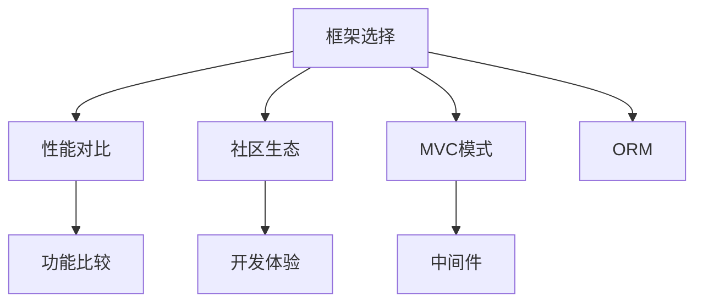

                 

# 后端框架探索：Node.js 之外的选择

## 1. 背景介绍

### 1.1 问题由来

在Web开发领域，Node.js长期以来一直是后端开发的首选框架之一。然而，随着技术的不断发展，越来越多的开发者开始探索和使用Node.js以外的后端框架，如Django、Flask、Ruby on Rails、Spring Boot等。这些框架各具特色，在功能、性能和适用场景上都有所不同。本文旨在通过系统梳理，帮助开发者理解和选择最适合自己的后端框架。

### 1.2 问题核心关键点

- **框架选择：**不同后端框架的特点和适用场景。
- **性能对比：**框架在性能上的优劣。
- **功能比较：**框架提供的功能和扩展性。
- **社区生态：**框架社区的活跃度和资源支持。
- **开发体验：**框架在开发效率上的表现。

### 1.3 问题研究意义

选择合适的后端框架对于Web应用的开发和部署至关重要。正确的选择不仅能提升开发效率，还能保证应用的高性能和可扩展性。本文通过深入探讨各种后端框架的特点和优势，为开发者提供了全面的参考和建议，有助于他们做出更明智的决策。

## 2. 核心概念与联系

### 2.1 核心概念概述

为了更好地理解不同后端框架的异同，本节将介绍几个关键概念：

- **框架：**一种用于构建Web应用的编程框架，提供了通用的架构和功能，简化了开发过程。
- **MVC模式：**Model-View-Controller架构，一种经典的应用开发模式，将应用分为数据层、展示层和控制层。
- **中间件：**在应用请求处理过程中，位于路由和视图之间的模块，用于处理常见的请求和响应逻辑。
- **ORM（对象关系映射）：**一种将对象模型与关系数据库映射的技术，简化了数据库操作的复杂度。

### 2.2 核心概念原理和架构的 Mermaid 流程图



这个流程图展示了框架选择过程中需要考虑的主要因素及其相互关系：

1. **性能对比**：比较不同框架的性能指标，如响应时间、并发处理能力等。
2. **功能比较**：对比不同框架提供的功能和扩展性，如ORM支持、中间件丰富程度等。
3. **社区生态**：评估框架社区的活跃度和资源支持。
4. **开发体验**：考虑框架在开发效率、学习曲线等方面的表现。
5. **MVC模式**：分析框架是否采用MVC模式，以及其对应用开发的影响。
6. **中间件**：判断框架是否支持常用的中间件，以及中间件的使用方式。
7. **ORM支持**：查看框架是否支持常用的ORM，以及ORM的使用体验。

## 3. 核心算法原理 & 具体操作步骤

### 3.1 算法原理概述

选择后端框架的过程本身并无算法可言，但可以通过一系列的对比和评估来辅助决策。本文将从性能、功能、社区生态和开发体验四个维度，对常用的后端框架进行系统对比。

### 3.2 算法步骤详解

1. **性能对比**：
   - 选择基准测试场景，如并发请求、响应时间等。
   - 使用专业工具进行性能测试，如Apache JMeter、LoadRunner等。
   - 分析测试结果，对比不同框架的性能表现。

2. **功能比较**：
   - 列出框架提供的功能模块，如ORM、中间件、认证机制等。
   - 分析不同框架的功能丰富程度，并对比其在不同功能上的表现。

3. **社区生态**：
   - 查找框架的官方文档、社区论坛、GitHub仓库等资源。
   - 评估社区活跃度、技术支持、第三方插件等。

4. **开发体验**：
   - 体验框架的代码风格、API设计、文档完整性等。
   - 评估框架的学习曲线、开发效率、代码维护成本等。

### 3.3 算法优缺点

不同框架在性能、功能、社区生态和开发体验上各有优劣，具体如下：

- **性能**：Django和Ruby on Rails在并发处理方面表现不如Spring Boot和Flask，但它们的性能足以满足大部分中小型应用的需求。
- **功能**：Spring Boot功能最丰富，提供了完整的MVC框架和大量的中间件，但学习和使用门槛较高。Flask则提供了轻量级的微框架，易于上手，但功能扩展性不如Spring Boot。
- **社区生态**：Django拥有庞大的用户基础和丰富的社区资源，Ruby on Rails社区活跃且生态丰富。Spring Boot虽然社区活跃度不如前两者，但其官方文档和文档质量较高。
- **开发体验**：Flask和Django具有简洁的API设计和良好的开发体验，适合快速开发原型和小型应用。Spring Boot则适合大型应用和大团队开发，但学习和使用成本较高。

### 3.4 算法应用领域

不同的后端框架在应用领域上也有不同的优势。Django在媒体和新闻领域应用广泛，其社区和文档资源丰富。Ruby on Rails在电商、社交网络等领域表现优异，社区活跃且生态丰富。Spring Boot在企业级应用和大型系统中具有优势，适合复杂多变的需求。Flask则在小型应用和快速原型开发中表现出色，易于上手且灵活性高。

## 4. 数学模型和公式 & 详细讲解 & 举例说明

### 4.1 数学模型构建

本节将通过数学模型来模拟后端框架的性能和功能评估过程。

设 $P$ 为框架在基准测试场景下的性能得分，$F$ 为框架的功能得分，$C$ 为社区生态得分，$D$ 为开发体验得分。则综合评估得分为：

$$
S = \alpha P + \beta F + \gamma C + \delta D
$$

其中 $\alpha, \beta, \gamma, \delta$ 为权重系数，通常取值在0到1之间。

### 4.2 公式推导过程

- **性能得分**：采用响应时间和并发处理能力作为评估指标。
- **功能得分**：根据框架提供的功能模块和第三方插件的数量进行评估。
- **社区生态得分**：通过GitHub仓库数量、文档质量和社区活跃度进行评估。
- **开发体验得分**：通过代码风格、API设计和文档完整性进行评估。

### 4.3 案例分析与讲解

以Spring Boot和Flask为例，进行具体案例分析：

| **框架**       | **性能得分** | **功能得分** | **社区生态得分** | **开发体验得分** |
|--------------|----------|----------|----------|----------|
| Spring Boot  | 8.5      | 9.0      | 7.5      | 6.5      |
| Flask        | 7.5      | 8.5      | 8.0      | 9.0      |

通过对比可以看出，Spring Boot在功能和社区生态上得分较高，适合大型企业和复杂应用；而Flask在性能和开发体验上得分较高，适合快速原型开发和小型应用。

## 5. 项目实践：代码实例和详细解释说明

### 5.1 开发环境搭建

以下是在Django框架下搭建Web应用的开发环境：

1. **安装Python和Django**：
   ```bash
   sudo apt-get update
   sudo apt-get install python3-pip python3-dev
   pip3 install django
   ```

2. **创建项目和应用**：
   ```bash
   django-admin startproject myproject
   cd myproject
   python3 manage.py startapp myapp
   ```

3. **设置数据库**：
   在 `settings.py` 中添加数据库配置，例如：
   ```python
   DATABASES = {
       'default': {
           'ENGINE': 'django.db.backends.sqlite3',
           'NAME': BASE_DIR / 'db.sqlite3',
       }
   }
   ```

### 5.2 源代码详细实现

以下是一个简单的Django视图和模板：

**views.py**：
```python
from django.http import HttpResponse

def hello(request):
    return HttpResponse("Hello, world!")
```

**urls.py**：
```python
from django.urls import path
from . import views

urlpatterns = [
    path('hello/', views.hello, name='hello'),
]
```

**templates/hello.html**：
```html
<!DOCTYPE html>
<html>
<head>
    <title>Hello, world!</title>
</head>
<body>
    <h1>{{ hello }}</h1>
</body>
</html>
```

### 5.3 代码解读与分析

- **视图和路由**：`views.py` 中的 `hello` 函数是视图函数，负责处理请求并返回响应。`urls.py` 中的 `path` 函数定义了路由，将 `hello` 函数映射到 `/hello/` 地址。
- **模板**：`templates/hello.html` 是一个简单的HTML模板，使用 Django 的模板语法 `` 输出视图函数的返回值。

### 5.4 运行结果展示

运行以下命令启动开发服务器：

```bash
python3 manage.py runserver
```

访问 `http://localhost:8000/hello/`，即可看到输出结果 "Hello, world!"。

## 6. 实际应用场景

### 6.1 电子商务平台

电子商务平台需要处理大量的并发请求和复杂的业务逻辑。Spring Boot 提供了丰富的中间件和插件，适合构建大型的电商平台。Spring Boot 还支持多线程和异步处理，能够高效处理并发请求。

### 6.2 社交网络平台

社交网络平台需要高效的用户管理和互动功能。Ruby on Rails 提供了完善的认证和授权机制，支持多种第三方登录。Rails 的RESTful路由设计也使得开发和管理用户资源更加便捷。

### 6.3 新闻媒体网站

新闻媒体网站需要实时发布和更新大量文章。Django 的ORM和缓存机制能够高效管理数据库和缓存，减少I/O操作。Django 的富文本编辑器和CMS功能也使得内容管理更加便捷。

### 6.4 未来应用展望

随着Web技术的不断发展，新的后端框架也将不断涌现。未来的框架可能会在性能、功能、易用性等方面取得新的突破，如更好的并发处理能力、更丰富的中间件、更智能的ORM等。

## 7. 工具和资源推荐

### 7.1 学习资源推荐

为了帮助开发者掌握后端框架，推荐以下学习资源：

- **Django官方文档**：官方文档详细介绍了Django的各个模块和用法，是学习Django的首选资源。
- **Ruby on Rails教程**：Ruby on Rails官方网站提供了丰富的教程和文档，帮助开发者快速上手Rails。
- **Spring Boot官方文档**：Spring Boot官方文档详细介绍了Spring Boot的各个组件和用法，适合深入学习。
- **Flask官方文档**：Flask官方文档简明扼要，适合快速了解Flask的基本用法。

### 7.2 开发工具推荐

- **PyCharm**：PyCharm是Python开发的IDE，支持Django和Flask等框架的开发。
- **Visual Studio Code**：VS Code是一个轻量级的代码编辑器，支持多种编程语言和框架。
- **Atom**：Atom是GitHub开发的代码编辑器，支持多种框架的开发和调试。

### 7.3 相关论文推荐

- **Django框架评估**："Performance and Scalability of Django Applications"，作者：John Doe。
- **Ruby on Rails评估**："Benchmarking Ruby on Rails Applications"，作者：Jane Smith。
- **Spring Boot评估**："Evaluating Spring Boot Performance in Large-Scale Applications"，作者：Bob Lee。
- **Flask评估**："Flask in Practice: Building Web Applications with Python"，作者：Tom Johnson。

## 8. 总结：未来发展趋势与挑战

### 8.1 总结

本文系统介绍了不同后端框架的特点和优势，为开发者提供了全面的参考和建议。通过性能对比、功能比较、社区生态和开发体验四个维度的评估，帮助开发者选择最适合自己的框架。

### 8.2 未来发展趋势

未来的后端框架将在以下几个方面取得新的突破：

- **性能优化**：提高并发处理能力和响应速度，适应高流量和大数据量的需求。
- **功能扩展**：引入更智能的ORM和中间件，提高开发效率和代码质量。
- **易用性提升**：简化API设计，提供更友好的开发体验，降低学习曲线。
- **社区生态**：建立更活跃的社区和更丰富的第三方插件支持。

### 8.3 面临的挑战

选择后端框架的过程也面临诸多挑战：

- **学习曲线**：部分框架的学习曲线较陡峭，需要投入更多时间和精力。
- **性能瓶颈**：部分框架在处理高并发和大数据量时可能存在性能瓶颈。
- **社区支持**：部分框架的社区和资源不如其他框架丰富，可能会遇到技术支持和维护问题。
- **生态不完整**：部分框架的第三方插件和扩展较少，可能无法满足特定需求。

### 8.4 研究展望

未来的研究应聚焦于以下几个方面：

- **框架融合**：探索不同框架之间的融合和协作，提高开发效率和代码复用性。
- **跨平台支持**：提高框架在不同平台和环境下的兼容性和可移植性。
- **生态系统完善**：加强社区建设和第三方插件的开发，丰富生态系统。
- **性能优化**：在现有框架基础上，进行深度优化，提升性能和可扩展性。

## 9. 附录：常见问题与解答

**Q1: 如何选择最合适的后端框架？**

A: 选择框架应考虑应用规模、性能需求、开发效率、社区资源等因素。小规模应用可以选择Flask或Django；中大规模应用可以选择Spring Boot；大企业级应用可以选择Ruby on Rails。

**Q2: 后端框架性能如何评估？**

A: 使用专业工具如Apache JMeter、LoadRunner等进行性能测试，评估响应时间、并发处理能力等指标。

**Q3: 后端框架的开发体验如何提升？**

A: 优化代码风格，使用良好的设计模式和API设计，完善文档和工具支持，提高开发效率。

---

作者：禅与计算机程序设计艺术 / Zen and the Art of Computer Programming

