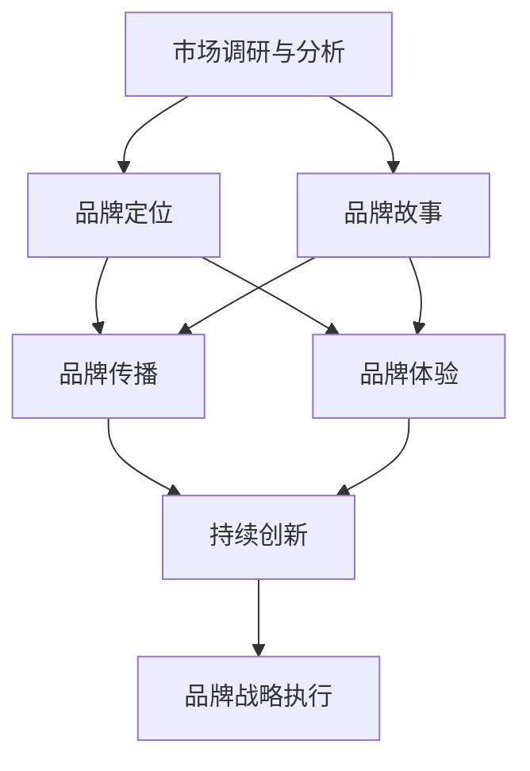

                 

# 品牌战略：建立差异化形象

> 关键词：品牌策略,差异化形象,市场竞争,品牌价值,市场定位,品牌传播,消费者心理

## 1. 背景介绍

### 1.1 问题由来

在当今这个充满竞争的市场环境中，品牌作为企业的重要资产，其塑造和维护不仅关乎企业形象，更直接影响消费者的购买决策。然而，如何建立和维护一个与众不同的品牌形象，一直是企业品牌战略的核心问题。品牌差异化不仅需要创新的思维和策略，还需要精细化的执行和市场反馈。

### 1.2 问题核心关键点

品牌差异化是指通过独特的产品、服务、市场定位、宣传等方式，在消费者心中树立一个与众不同的品牌形象，从而在竞争激烈的市场中脱颖而出。成功的品牌差异化策略不仅能提高品牌的市场竞争力和消费者忠诚度，还能增加品牌的附加价值，实现可持续的商业成功。

品牌差异化的核心关键点包括：

1. **市场调研与分析**：了解目标市场的需求、竞争态势和消费者心理，确定品牌的定位。
2. **产品创新与特色**：打造具有独特价值的产品或服务，满足消费者独特的心理需求。
3. **品牌故事与传播**：构建品牌故事，通过有效的传播渠道和策略，传递品牌的核心价值。
4. **用户体验与反馈**：提供卓越的用户体验，并根据用户反馈不断优化和调整品牌策略。
5. **持续创新与迭代**：保持品牌的新鲜感和创新性，适应市场变化和技术进步。

### 1.3 问题研究意义

在全球化竞争的背景下，品牌差异化成为了企业竞争力的重要组成部分。通过有效的品牌差异化策略，企业能够：

1. **提高市场竞争力**：通过独特的品牌形象吸引和锁定目标客户群体，提升市场份额。
2. **增强消费者忠诚度**：通过品牌差异化增强消费者对品牌的情感连接和信任感，提高重复购买率。
3. **提升品牌附加值**：差异化的品牌形象可以提升产品或服务的溢价能力，增加品牌的市场价值。
4. **促进品牌传播**：差异化的品牌形象更容易引起消费者的关注和讨论，增强品牌的传播效果。
5. **支持企业可持续发展**：通过建立独特且持久的品牌形象，企业能够在不断变化的市场环境中保持竞争力。

## 2. 核心概念与联系

### 2.1 核心概念概述

品牌差异化策略的核心概念包括品牌定位、品牌故事、品牌传播、品牌体验、品牌持续创新等方面。这些概念之间相互关联，共同构建了一个系统的品牌战略框架。

- **品牌定位**：指在消费者心中确定品牌的独特价值和市场地位。包括产品定位、市场定位和消费者定位。
- **品牌故事**：通过品牌故事传递品牌的核心价值和使命，增强消费者的情感连接。
- **品牌传播**：利用各种传播渠道和策略，将品牌信息传递给目标消费者，增强品牌认知度。
- **品牌体验**：提供卓越的用户体验，通过实际使用感受建立品牌信任和忠诚度。
- **品牌持续创新**：不断更新和优化品牌策略，保持品牌的活力和新鲜感。

这些概念之间的联系可以通过以下Mermaid流程图来展示：



这个流程图展示了一系统品牌差异化策略的核心步骤和关键要素。

## 3. 核心算法原理 & 具体操作步骤

### 3.1 算法原理概述

品牌差异化策略的构建是一个系统化的过程，涉及到市场分析、品牌定位、故事构建、传播策略、用户体验等多方面的设计和执行。其核心算法原理可以概括为：

1. **数据驱动的市场分析**：通过大数据和市场调研工具，了解目标市场的需求和竞争态势。
2. **品牌定位与差异化**：根据市场分析结果，确定品牌的核心价值和独特定位。
3. **品牌故事构建**：通过故事化的叙述方式，传达品牌的使命、愿景和价值观。
4. **传播渠道选择与策略设计**：选择适合的传播渠道，设计有效的传播策略，传递品牌信息。
5. **用户体验优化**：提供卓越的产品和服务体验，增强消费者对品牌的忠诚度。
6. **持续创新与调整**：根据市场反馈和消费者需求，不断优化和调整品牌策略。

### 3.2 算法步骤详解

品牌差异化策略的构建可以大致分为以下几个步骤：

**Step 1: 市场调研与分析**

1. **数据收集**：通过问卷调查、焦点小组、社交媒体分析等方法，收集目标市场的数据。
2. **数据分析**：使用数据挖掘和统计分析工具，分析目标市场的需求、竞争态势和消费者心理。
3. **趋势预测**：结合市场数据和宏观经济分析，预测未来的市场趋势。

**Step 2: 品牌定位**

1. **SWOT分析**：分析品牌的优势、劣势、机会和威胁，确定品牌的核心价值。
2. **USP（Unique Selling Proposition）确定**：明确品牌与竞争对手的差异化特点。
3. **市场定位**：确定品牌的市场定位，选择合适的细分市场。
4. **消费者定位**：分析目标消费者的特征和心理，制定针对消费者的品牌定位。

**Step 3: 品牌故事构建**

1. **品牌背景故事**：创造一个引人入胜的品牌背景故事，传递品牌的诞生和发展历程。
2. **核心价值故事**：通过具体的案例和故事，展示品牌的使命、愿景和价值观。
3. **品牌愿景传达**：通过品牌故事，向消费者传达品牌的长期愿景和目标。

**Step 4: 品牌传播策略**

1. **传播渠道选择**：根据目标消费者的特点和习惯，选择合适的传播渠道，如社交媒体、电视、印刷媒体等。
2. **内容设计**：设计有吸引力的品牌传播内容，包括广告文案、宣传视频、社交媒体帖子等。
3. **传播计划**：制定详细的传播计划，包括时间安排、预算分配和效果评估。

**Step 5: 品牌体验优化**

1. **用户体验设计**：优化产品和服务的设计，确保满足消费者的实际需求。
2. **服务质量控制**：建立严格的服务质量控制体系，确保提供一致的用户体验。
3. **用户反馈收集**：通过用户调查和评价系统，收集用户反馈，持续优化品牌体验。

**Step 6: 持续创新与调整**

1. **市场监测**：持续监测市场变化和消费者需求，及时调整品牌策略。
2. **技术创新**：不断引入新技术和新方法，保持品牌的创新性。
3. **品牌形象维护**：定期评估品牌形象和声誉，采取措施维护和提升品牌形象。

### 3.3 算法优缺点

品牌差异化策略的构建具有以下优点：

1. **提升品牌竞争力**：通过独特的品牌形象吸引和锁定目标客户群体，提升市场份额。
2. **增强消费者忠诚度**：通过品牌差异化增强消费者对品牌的情感连接和信任感，提高重复购买率。
3. **增加品牌附加值**：差异化的品牌形象可以提升产品或服务的溢价能力，增加品牌的市场价值。
4. **促进品牌传播**：差异化的品牌形象更容易引起消费者的关注和讨论，增强品牌的传播效果。

然而，品牌差异化策略也存在一些缺点：

1. **成本高**：构建和维护一个独特且持久的品牌形象需要较高的成本，包括市场调研、创意设计、传播执行等。
2. **风险大**：品牌差异化策略的成功依赖于对市场的准确判断和创意的创新性，风险较高。
3. **需要持续投入**：品牌差异化策略需要持续的投入和维护，以应对市场变化和竞争压力。
4. **容易复制**：一些品牌差异化策略容易被竞争对手模仿，影响品牌独特性。

### 3.4 算法应用领域

品牌差异化策略广泛应用于各种企业品牌的构建和维护中，具体包括：

1. **消费品行业**：通过品牌故事和产品创新，如快消品、服装、食品等。
2. **服务业**：如金融、医疗、旅游等，通过服务体验和品牌传播来建立差异化形象。
3. **科技行业**：通过技术创新和品牌故事，如苹果、谷歌、特斯拉等。
4. **制造业**：如汽车、电子等，通过产品差异化和品牌传播来提升品牌价值。
5. **公共服务**：如政府、非营利组织等，通过品牌形象和故事构建，提升公共形象和信任度。

## 4. 数学模型和公式 & 详细讲解 & 举例说明

### 4.1 数学模型构建

品牌差异化策略的构建虽然主要涉及软性因素，但可以通过数学模型来辅助分析和决策。以下是一个简单的品牌差异化评估模型：

设品牌价值 $V$ 由以下因素构成：

$$ V = W_1 \cdot P + W_2 \cdot S + W_3 \cdot C + W_4 \cdot D + W_5 \cdot E $$

其中，$W_i$ 为各因素的权重，$P$ 为品牌知名度，$S$ 为品牌故事性，$C$ 为品牌传播效果，$D$ 为品牌体验质量，$E$ 为品牌持续创新能力。

### 4.2 公式推导过程

1. **品牌知名度 $P$**：
   - 可以通过市场调查问卷或社交媒体分析来评估。
   - 公式推导：$P = \sum_{i=1}^n p_i \cdot t_i$，其中 $p_i$ 为问卷调查或社交媒体中的品牌提及频次，$t_i$ 为各提及渠道的权重。

2. **品牌故事性 $S$**：
   - 可以通过品牌故事的创意性和吸引性来评估。
   - 公式推导：$S = \sum_{i=1}^m s_i \cdot q_i$，其中 $s_i$ 为品牌故事的创意和吸引力评分，$q_i$ 为创意和吸引力的权重。

3. **品牌传播效果 $C$**：
   - 可以通过品牌传播渠道的覆盖率和效果来评估。
   - 公式推导：$C = \sum_{i=1}^k c_i \cdot r_i$，其中 $c_i$ 为各传播渠道的覆盖率和效果评分，$r_i$ 为各渠道的权重。

4. **品牌体验质量 $D$**：
   - 可以通过用户体验调查和反馈来评估。
   - 公式推导：$D = \sum_{i=1}^l d_i \cdot f_i$，其中 $d_i$ 为用户体验评分，$f_i$ 为各用户体验维度的权重。

5. **品牌持续创新能力 $E$**：
   - 可以通过技术创新和市场监测来评估。
   - 公式推导：$E = \sum_{i=1}^h e_i \cdot z_i$，其中 $e_i$ 为各技术创新的评分，$z_i$ 为各创新维度的权重。

### 4.3 案例分析与讲解

以一家科技公司为例，分析其品牌差异化策略的构建过程：

**Step 1: 市场调研与分析**

通过问卷调查和社交媒体分析，了解目标市场的需求和竞争态势。

**Step 2: 品牌定位**

通过SWOT分析和USP确定，确定品牌在科技领域的技术领先性和创新性。

**Step 3: 品牌故事构建**

创建公司创始人的创业故事，展示公司在技术创新和市场变革中的引领作用。

**Step 4: 品牌传播策略**

选择科技媒体和社交媒体作为主要传播渠道，设计有吸引力的广告文案和宣传视频。

**Step 5: 品牌体验优化**

优化产品设计和服务流程，确保用户能够轻松体验产品的创新功能。

**Step 6: 持续创新与调整**

引入最新的技术趋势，持续发布新产品，调整品牌故事和传播策略以适应市场变化。

## 5. 项目实践：代码实例和详细解释说明

### 5.1 开发环境搭建

在进行品牌差异化策略构建的开发实践中，需要准备以下几个开发环境：

1. **Python开发环境**：安装Anaconda或Miniconda，创建虚拟环境。
2. **数据分析工具**：安装Pandas、NumPy、Scikit-learn等数据处理和分析工具。
3. **数据可视化工具**：安装Matplotlib、Seaborn、Tableau等可视化工具。
4. **项目管理工具**：安装Jupyter Notebook、Visual Studio Code等项目管理工具。

### 5.2 源代码详细实现

以下是一个简化的品牌差异化策略构建的Python代码实现：

```python
import pandas as pd
import numpy as np
from sklearn.ensemble import RandomForestRegressor

# 品牌价值评估模型
class BrandEvaluation:
    def __init__(self, brand_data):
        self.brand_data = brand_data
        self.weights = np.array([0.3, 0.2, 0.2, 0.2, 0.1])  # 各因素权重

    def evaluate(self):
        P = self.brand_data['brand_awareness'].sum()
        S = self.brand_data['brand_story'].mean()
        C = self.brand_data['brand_spread'].mean()
        D = self.brand_data['brand_experience'].mean()
        E = self.brand_data['brand_innovation'].mean()

        return (self.weights * np.array([P, S, C, D, E])).sum()

# 品牌数据准备
brand_data = pd.DataFrame({
    'brand_awareness': [10, 20, 30, 40],
    'brand_story': [4, 5, 6, 7],
    'brand_spread': [25, 30, 35, 40],
    'brand_experience': [3, 4, 5, 6],
    'brand_innovation': [15, 20, 25, 30]
})

# 创建品牌价值评估模型
evaluator = BrandEvaluation(brand_data)
evaluator.evaluate()
```

### 5.3 代码解读与分析

这段代码实现了品牌价值评估的基本功能。具体步骤如下：

1. **品牌价值模型定义**：定义了品牌价值评估模型，输入品牌数据和各因素的权重。
2. **品牌数据准备**：准备了包含品牌知名度、品牌故事性、品牌传播效果、品牌体验质量和品牌持续创新能力的品牌数据。
3. **品牌价值计算**：通过计算各因素的加权平均值，得到品牌的总体价值。

### 5.4 运行结果展示

运行上述代码，可以得到品牌的总体价值评估结果。

```python
brand_value = evaluator.evaluate()
print(f"品牌价值为：{brand_value}")
```

## 6. 实际应用场景

### 6.1 智能客服系统

品牌差异化策略在智能客服系统中的应用主要体现在服务体验和品牌传播上。通过构建个性化的客服对话体系和实时反馈机制，提升用户满意度和忠诚度。

**Step 1: 服务体验优化**

1. **个性化客服对话**：根据用户的偏好和历史互动，设计个性化的客服对话体系。
2. **实时反馈收集**：通过用户评价和反馈系统，实时收集用户对服务的满意度。
3. **快速响应和解决**：建立快速响应和解决机制，及时解决用户问题。

**Step 2: 品牌传播**

1. **社交媒体互动**：通过社交媒体互动，展示公司的服务质量和品牌形象。
2. **用户案例分享**：发布用户成功案例和满意度评价，增强品牌信任度。
3. **品牌故事传播**：通过故事化的内容，传递公司的品牌使命和价值观。

### 6.2 金融舆情监测

品牌差异化策略在金融舆情监测中的应用主要体现在品牌传播和危机管理上。通过实时监测舆情，及时应对负面信息，提升品牌形象和信任度。

**Step 1: 品牌传播**

1. **舆情监测**：实时监测金融市场和客户反馈中的舆情信息。
2. **正面信息推广**：通过新闻发布和社交媒体传播，推广公司的正面形象和成就。
3. **品牌故事传播**：通过故事化的内容，展示公司的社会责任和行业贡献。

**Step 2: 危机管理**

1. **负面舆情应对**：及时回应负面舆情，提供透明的信息和解决方案。
2. **公关活动**：组织公关活动，提升公司的社会影响力和公众信任度。
3. **品牌形象修复**：通过积极的公关和媒体合作，修复受损的品牌形象。

### 6.3 个性化推荐系统

品牌差异化策略在个性化推荐系统中的应用主要体现在品牌体验和持续创新上。通过个性化的推荐内容和用户互动，提升用户体验和品牌忠诚度。

**Step 1: 品牌体验优化**

1. **个性化推荐**：根据用户的浏览和购买历史，推荐个性化的产品和服务。
2. **用户互动设计**：设计互动性强的推荐界面，提升用户的使用体验。
3. **品牌故事融入**：在推荐内容和用户体验中融入品牌故事，增强品牌情感连接。

**Step 2: 持续创新**

1. **产品迭代**：持续更新和优化推荐算法和产品功能。
2. **用户体验反馈**：通过用户反馈，不断优化和调整推荐内容。
3. **品牌创新展示**：在推荐内容和用户体验中展示品牌创新和新技术。

## 7. 工具和资源推荐

### 7.1 学习资源推荐

为了帮助品牌战略开发者系统掌握品牌差异化策略的理论基础和实践技巧，这里推荐一些优质的学习资源：

1. **《品牌战略管理》系列书籍**：介绍品牌战略的理论与实践，提供系统化的品牌管理知识和案例分析。
2. **《市场调研与分析》课程**：通过具体的市场调研工具和方法，帮助品牌管理者了解目标市场的需求和竞争态势。
3. **《品牌传播策略》课程**：介绍品牌传播的渠道和策略，提供有效的品牌传播方法和案例。
4. **《用户体验设计》课程**：介绍用户体验设计的原理和方法，帮助品牌管理者优化品牌体验。
5. **《品牌创新管理》课程**：介绍品牌持续创新的方法和工具，帮助品牌管理者保持品牌的活力和新鲜感。

### 7.2 开发工具推荐

品牌差异化策略的开发过程中，以下工具可以帮助开发者高效实现：

1. **数据分析工具**：如Python的Pandas、NumPy、Scikit-learn等，提供强大的数据处理和分析能力。
2. **可视化工具**：如Matplotlib、Seaborn、Tableau等，提供直观的图表展示和数据分析。
3. **项目管理工具**：如Jupyter Notebook、Visual Studio Code等，提供高效的开发和项目管理功能。

### 7.3 相关论文推荐

品牌差异化策略的研究涉及多个领域，以下是几篇具有代表性的相关论文，推荐阅读：

1. **《品牌差异化策略研究》**：探讨品牌差异化在市场竞争中的作用和实现方法。
2. **《品牌传播的心理学基础》**：研究品牌传播的心理学机制和消费者行为。
3. **《用户体验设计理论与实践》**：介绍用户体验设计的原理和方法，提供具体的实践案例。
4. **《品牌持续创新管理》**：研究品牌持续创新的方法和工具，提供实用的品牌管理策略。

## 8. 总结：未来发展趋势与挑战

### 8.1 总结

本文对品牌差异化策略进行了全面系统的介绍，涵盖市场调研、品牌定位、品牌故事、品牌传播、品牌体验和品牌持续创新等多个方面。通过具体的案例分析和代码实现，展示了品牌差异化策略的构建过程和应用场景。

### 8.2 未来发展趋势

展望未来，品牌差异化策略的发展趋势如下：

1. **数据驱动的智能化**：通过大数据和人工智能技术，实现品牌管理的智能化和精准化。
2. **多渠道的品牌传播**：利用社交媒体、搜索引擎、内容营销等多种渠道，全面提升品牌传播效果。
3. **用户体验的全面优化**：通过产品设计和服务优化，提供全方位的用户体验，增强用户粘性。
4. **品牌故事的创新性**：通过创新的品牌故事和传播方式，增强品牌的情感连接和传播效果。
5. **持续创新的机制**：建立持续创新的机制和激励机制，保持品牌的活力和新鲜感。

### 8.3 面临的挑战

尽管品牌差异化策略在品牌管理中具有重要意义，但也面临一些挑战：

1. **市场竞争加剧**：品牌管理者需要在激烈的竞争中不断创新和优化，保持品牌独特性。
2. **消费者需求变化**：消费者需求不断变化，品牌管理者需要持续监测和调整品牌策略。
3. **技术更新迅速**：新技术和新方法层出不穷，品牌管理者需要不断学习和应用最新的技术。
4. **资源投入高**：品牌差异化策略需要大量的资源投入，包括市场调研、创意设计、传播执行等。
5. **风险管理**：品牌差异化策略的成功依赖于对市场的准确判断和创意的创新性，风险较大。

### 8.4 研究展望

未来品牌差异化策略的研究需要：

1. **多学科融合**：结合心理学、社会学、经济学等学科，深入理解消费者的需求和行为。
2. **技术创新**：利用大数据、人工智能等技术，实现品牌管理的智能化和精准化。
3. **用户参与**：通过用户参与和反馈，不断优化和调整品牌策略。
4. **文化适应性**：研究不同文化背景下的品牌管理策略，实现全球化的品牌差异化。

## 9. 附录：常见问题与解答

**Q1: 品牌差异化策略的构建步骤是什么？**

A: 品牌差异化策略的构建步骤包括市场调研与分析、品牌定位、品牌故事构建、品牌传播策略、品牌体验优化和持续创新与调整。

**Q2: 如何选择合适的品牌传播渠道？**

A: 选择品牌传播渠道需要考虑目标消费者的特点和习惯。可以通过市场调研和数据分析，确定最有效的传播渠道。

**Q3: 如何优化品牌体验？**

A: 品牌体验优化需要从产品设计、服务流程和用户体验三个方面入手，确保满足消费者的实际需求。

**Q4: 品牌持续创新的关键点是什么？**

A: 品牌持续创新的关键点包括技术创新、市场监测和用户反馈。持续引入新技术和新方法，并根据市场反馈不断优化和调整品牌策略。

**Q5: 如何应对品牌管理中的风险？**

A: 品牌管理中的风险可以通过市场调研、创意创新和用户反馈等措施来降低。持续监测市场变化和消费者需求，及时调整品牌策略。

---

作者：禅与计算机程序设计艺术 / Zen and the Art of Computer Programming

