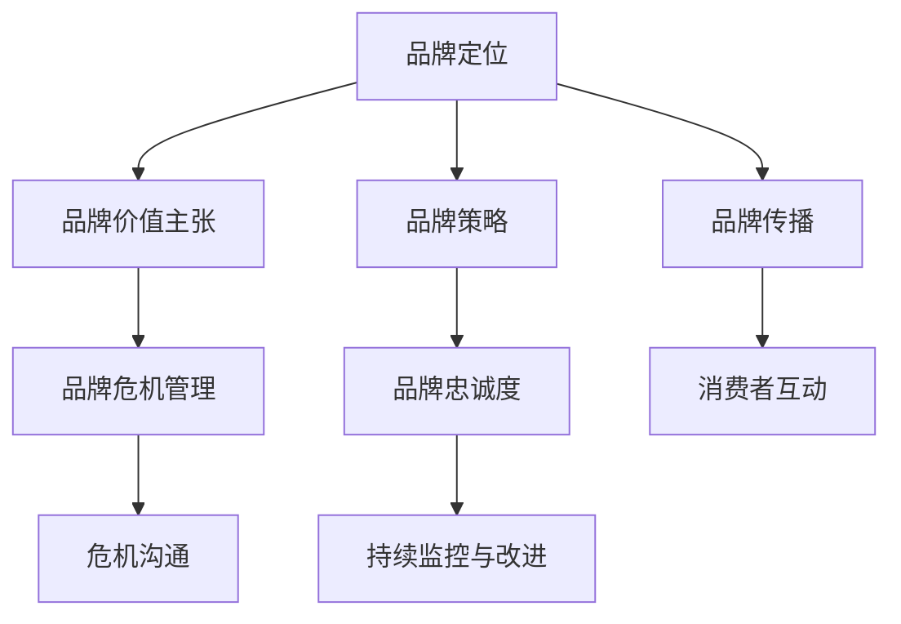

                 

## 1. 背景介绍

品牌管理（Brand Management）是企业管理的重要环节之一，它的目标是通过精心设计、有效执行和持续监控，塑造并维护企业及其产品的良好形象，以增强消费者的认知和忠诚度。在数字化时代，品牌不仅是一个标识或名称，更是一个综合性的生态系统，包含了产品、服务、文化、理念和用户体验等多个层面。

随着互联网和社交媒体的普及，品牌管理的触点日益丰富，消费者对品牌的期望和参与度也在不断提升。品牌管理不仅要满足消费者的需求，更要引领市场趋势，提供独特的价值主张。而数字化品牌管理的复杂性也随之增加，如何利用数据和技术手段提升品牌管理的效率和效果，成为了企业关注的焦点。

## 2. 核心概念与联系

### 2.1 核心概念概述

品牌管理涉及多个核心概念，包括但不限于品牌定位、品牌价值主张、品牌策略、品牌传播、品牌忠诚度、品牌危机管理等。以下是这些概念之间的逻辑关系，通过Mermaid流程图来展示：



其中：

- **品牌定位**：确定品牌在市场和消费者心中的独特位置和核心价值。
- **品牌价值主张**：明确品牌承诺的核心价值和差异化优势。
- **品牌策略**：根据品牌定位和价值主张，制定整体的品牌推广和运营策略。
- **品牌传播**：通过各种渠道和手段，将品牌信息传递给目标消费者。
- **品牌忠诚度**：培养和维持消费者对品牌的信任和忠诚。
- **品牌危机管理**：在品牌遭遇负面事件时，迅速响应和处理，最小化品牌损失。
- **持续监控与改进**：通过数据分析和消费者反馈，不断优化品牌管理和运营策略。
- **消费者互动**：与消费者建立深度互动，增强品牌与消费者之间的情感联系。
- **危机沟通**：通过有效的沟通和信息披露，缓解危机带来的负面影响。

这些概念相互关联，共同构成了品牌管理的框架，帮助企业实现其品牌的长期目标。

### 2.2 核心概念原理和架构

品牌管理的核心原理基于市场营销学的多个理论，包括但不限于消费者行为理论、品牌资产理论、价值链理论等。这些理论为品牌管理提供了理论基础和方法指导。

**消费者行为理论**：理解消费者的购买决策过程，从而设计符合消费者期望的品牌形象。
**品牌资产理论**：通过品牌认知、品牌联想和品牌忠诚度等资产构建品牌的价值。
**价值链理论**：分析品牌的各个环节，从供应链到终端用户，形成有机的价值链，提升品牌竞争力。

品牌管理的架构通常包括：

- **品牌战略规划**：确定品牌的愿景、使命、核心价值和市场定位。
- **品牌传播策略**：设计品牌传播的目标、渠道和内容。
- **品牌营销执行**：执行品牌传播策略，通过各种媒介触达目标受众。
- **品牌绩效评估**：通过数据和指标评估品牌管理的成效，及时调整策略。

## 3. 核心算法原理 & 具体操作步骤

### 3.1 算法原理概述

品牌管理中的算法原理主要集中在数据分析、机器学习和人工智能技术的应用。通过这些技术，品牌管理者可以更好地理解和预测消费者的行为，优化品牌传播策略，提升品牌效果。

- **数据分析**：利用统计学和数据挖掘技术，分析消费者行为数据，识别品牌需求和趋势。
- **机器学习**：通过机器学习模型预测消费者行为，优化品牌传播策略，提升广告效果。
- **人工智能**：利用深度学习、自然语言处理等技术，自动化品牌管理任务，如自动生成内容、情感分析等。

### 3.2 算法步骤详解

品牌管理中的算法步骤通常包括数据收集、数据预处理、模型训练、结果评估和策略优化。

1. **数据收集**：从各种渠道收集消费者数据，包括在线行为数据、社交媒体数据、客户反馈数据等。
2. **数据预处理**：清洗数据，去除噪声和异常值，标准化数据格式。
3. **模型训练**：选择合适的算法和模型，使用历史数据进行训练。
4. **结果评估**：评估模型的效果，使用指标如精确度、召回率、F1分数等。
5. **策略优化**：根据模型评估结果，调整品牌策略，优化品牌传播效果。

### 3.3 算法优缺点

品牌管理的算法有以下优点：

- **提高效率**：通过数据驱动的品牌管理，可以减少人力成本，提高决策效率。
- **精准定位**：利用机器学习和数据挖掘技术，可以更精准地理解消费者需求和市场趋势。
- **动态优化**：算法模型可以根据实时数据动态调整，及时应对市场变化。

同时，品牌管理的算法也存在一些缺点：

- **数据质量依赖**：算法的精度依赖于数据的质量，数据不完整或不准确会影响效果。
- **技术门槛高**：需要具备一定的数据科学和算法知识，技术门槛较高。
- **隐私和伦理问题**：收集和处理消费者数据时，需要严格遵守数据隐私和伦理标准。

### 3.4 算法应用领域

品牌管理算法已经在多个领域得到应用，包括但不限于：

- **消费者行为分析**：分析消费者的购买行为、偏好和趋势，优化产品设计和营销策略。
- **品牌传播优化**：通过数据分析，优化广告投放策略，提升广告效果。
- **市场竞争分析**：分析竞争对手的市场表现，制定有效的竞争策略。
- **品牌情感分析**：通过自然语言处理技术，分析消费者对品牌的情感倾向，及时调整品牌传播策略。
- **品牌危机管理**：利用社交媒体分析技术，及时发现品牌危机事件，制定应对措施。

## 4. 数学模型和公式 & 详细讲解 & 举例说明

### 4.1 数学模型构建

品牌管理中的数学模型通常基于消费者行为理论、品牌资产理论和价值链理论。以下是几个核心模型：

- **消费者行为模型**：基于逻辑回归、决策树、随机森林等算法，预测消费者行为。
- **品牌价值模型**：使用因子分析、聚类分析等技术，评估品牌价值。
- **品牌传播模型**：基于多维尺度分析（MDS）、层次分析法（AHP）等技术，优化品牌传播策略。

### 4.2 公式推导过程

以消费者行为模型为例，其基本公式为：

$$ P(Y|X) = \frac{P(Y)}{P(X|Y)P(X)} $$

其中，$P(Y|X)$ 表示在给定消费者特征$X$的情况下，消费者购买产品的概率；$P(Y)$ 表示购买产品的先验概率；$P(X|Y)$ 表示在购买产品的情况下，消费者特征$X$的概率；$P(X)$ 表示消费者特征$X$的总概率。

### 4.3 案例分析与讲解

假设我们要分析一个化妆品品牌的消费者购买行为。首先，收集消费者的年龄、性别、收入、购买历史等数据，然后使用逻辑回归模型预测消费者是否会购买该品牌的产品。模型训练步骤如下：

1. **数据收集**：通过问卷调查、社交媒体数据分析等方式，收集消费者数据。
2. **数据预处理**：清洗数据，去除异常值，标准化数据格式。
3. **模型训练**：使用逻辑回归算法，对历史数据进行训练。
4. **结果评估**：使用精确度、召回率、F1分数等指标评估模型效果。
5. **策略优化**：根据模型结果，调整品牌传播策略，如针对高价值消费者进行精准广告投放。

## 5. 项目实践：代码实例和详细解释说明

### 5.1 开发环境搭建

品牌管理算法的开发环境搭建包括以下步骤：

1. **安装Python**：从官网下载并安装Python，确保版本为3.7及以上。
2. **安装Pandas**：使用pip安装Pandas库，用于数据处理和分析。
3. **安装Scikit-learn**：使用pip安装Scikit-learn库，用于机器学习模型的构建和评估。
4. **安装TensorFlow**：使用pip安装TensorFlow库，用于深度学习模型的构建和训练。

### 5.2 源代码详细实现

以下是一个简单的消费者行为预测模型的Python代码实现：

```python
import pandas as pd
from sklearn.model_selection import train_test_split
from sklearn.linear_model import LogisticRegression
from sklearn.metrics import classification_report

# 加载数据
data = pd.read_csv('consumer_data.csv')

# 数据预处理
X = data[['age', 'gender', 'income']]
y = data['purchase']
X_train, X_test, y_train, y_test = train_test_split(X, y, test_size=0.2, random_state=42)

# 训练模型
model = LogisticRegression()
model.fit(X_train, y_train)

# 评估模型
y_pred = model.predict(X_test)
print(classification_report(y_test, y_pred))
```

### 5.3 代码解读与分析

该代码实现了一个简单的消费者行为预测模型，具体步骤如下：

1. **数据加载**：使用Pandas库加载消费者数据。
2. **数据预处理**：选择年龄、性别、收入等特征，并使用train_test_split函数将数据分为训练集和测试集。
3. **模型训练**：使用LogisticRegression算法训练模型。
4. **模型评估**：使用classification_report函数评估模型效果，输出精确度、召回率、F1分数等指标。

## 6. 实际应用场景

### 6.1 智能客服系统

智能客服系统通过数据分析和机器学习技术，能够实时监测客户互动，识别常见问题，并自动生成回复。这不仅能提升客服效率，还能提高客户满意度。例如，某电商平台的智能客服系统，通过分析用户的历史购买记录和行为数据，可以预测用户可能咨询的问题，并提前准备好相应的回复。

### 6.2 营销自动化

品牌管理者可以通过机器学习模型分析消费者的购买行为和偏好，制定个性化的营销策略。例如，某快消品牌利用消费者行为模型，分析不同消费群体的特点，并针对性地推送广告，提升了广告的点击率和转化率。

### 6.3 社交媒体分析

社交媒体数据是品牌管理的宝贵资源。通过社交媒体分析，品牌管理者可以实时监测消费者对品牌的情感倾向，及时调整品牌传播策略。例如，某汽车品牌通过分析社交媒体上的用户评论和情感数据，及时发现和处理品牌危机事件，降低了负面影响。

### 6.4 未来应用展望

未来，品牌管理将更加依赖于数据和算法，以下趋势值得关注：

- **数据驱动**：利用大数据技术和人工智能算法，精准理解和预测消费者需求，优化品牌管理决策。
- **个性化营销**：通过机器学习模型，实现对不同消费群体的个性化营销，提升广告效果。
- **社交媒体分析**：利用社交媒体分析技术，实时监测品牌声誉，及时应对负面事件。
- **品牌危机管理**：引入自然语言处理和情感分析技术，自动化品牌危机管理过程。
- **持续优化**：利用实时数据和反馈，不断优化品牌传播策略，提升品牌效果。

## 7. 工具和资源推荐

### 7.1 学习资源推荐

为了帮助品牌管理者系统掌握品牌管理算法和工具，推荐以下学习资源：

- **《数据科学导论》**：介绍数据科学的基本概念和常用算法。
- **《机器学习实战》**：通过实战案例，讲解机器学习模型的构建和评估。
- **《TensorFlow实战》**：介绍TensorFlow的基本功能和高级应用。
- **Kaggle**：在线数据科学竞赛平台，提供大量数据集和竞赛任务，锻炼数据科学技能。

### 7.2 开发工具推荐

品牌管理算法的开发工具推荐如下：

- **Jupyter Notebook**：轻量级的交互式编程环境，适合数据科学和机器学习开发。
- **PyCharm**：功能强大的Python开发环境，支持数据科学、机器学习和深度学习开发。
- **TensorBoard**：TensorFlow的可视化工具，帮助调试和优化模型。
- **SciPy**：用于科学计算的Python库，包含大量数据分析和统计学工具。

### 7.3 相关论文推荐

品牌管理算法的相关论文推荐如下：

- **《消费者行为预测模型》**：介绍多种消费者行为预测模型及其应用。
- **《品牌价值评估方法》**：探讨品牌价值评估的多种方法。
- **《品牌传播优化算法》**：介绍多种品牌传播优化算法及其效果。
- **《社交媒体分析技术》**：介绍社交媒体数据的采集、分析和应用。
- **《品牌危机管理模型》**：介绍品牌危机管理的多种模型和策略。

## 8. 总结：未来发展趋势与挑战

### 8.1 研究成果总结

本文对品牌管理中的算法原理和操作步骤进行了详细讲解，并通过实际案例展示了算法的应用效果。通过数据分析和机器学习技术，品牌管理者可以更好地理解和预测消费者需求，优化品牌传播策略，提升品牌效果。

### 8.2 未来发展趋势

未来，品牌管理将更加依赖于数据和算法，以下趋势值得关注：

- **数据驱动**：利用大数据技术和人工智能算法，精准理解和预测消费者需求，优化品牌管理决策。
- **个性化营销**：通过机器学习模型，实现对不同消费群体的个性化营销，提升广告效果。
- **社交媒体分析**：利用社交媒体分析技术，实时监测品牌声誉，及时应对负面事件。
- **品牌危机管理**：引入自然语言处理和情感分析技术，自动化品牌危机管理过程。
- **持续优化**：利用实时数据和反馈，不断优化品牌传播策略，提升品牌效果。

### 8.3 面临的挑战

尽管品牌管理中的算法在许多方面带来了便利和效率提升，但也面临一些挑战：

- **数据隐私**：在收集和分析消费者数据时，需要严格遵守数据隐私法规，如GDPR等。
- **数据质量**：数据的完整性、准确性和一致性直接影响算法的精度。
- **技术门槛**：品牌管理者需要具备一定的数据科学和算法知识，才能有效使用这些工具。
- **模型解释性**：许多品牌管理算法，如深度学习模型，存在"黑箱"问题，难以解释其决策过程。

### 8.4 研究展望

为了克服这些挑战，未来的研究需要关注以下几个方向：

- **数据隐私保护**：研究和开发数据隐私保护技术，确保品牌管理中的数据使用符合法规要求。
- **数据质量提升**：改进数据收集和预处理技术，提高数据的质量和可用性。
- **技术普及**：开发更易用的数据科学和机器学习工具，降低技术门槛，普及数据科学知识。
- **模型解释性增强**：研究如何增强算法的解释性，使其更具可解释性和可控性。

## 9. 附录：常见问题与解答

**Q1：品牌管理中的数据隐私如何保障？**

A: 保障品牌管理中的数据隐私，需要采取以下措施：

1. **数据匿名化**：通过数据匿名化技术，去除或掩盖数据中的敏感信息。
2. **数据加密**：对敏感数据进行加密处理，防止数据泄露。
3. **数据访问控制**：严格控制数据访问权限，确保只有授权人员才能访问敏感数据。
4. **数据脱敏**：对数据进行脱敏处理，去除或替换敏感信息。
5. **合规审查**：定期进行数据隐私合规审查，确保数据处理过程符合相关法规。

**Q2：如何提高品牌管理中的数据质量？**

A: 提高品牌管理中的数据质量，需要采取以下措施：

1. **数据清洗**：对数据进行去重、去噪、补全等清洗处理，去除错误和不完整的数据。
2. **数据标准化**：对数据进行格式标准化处理，确保数据的一致性和可比性。
3. **数据整合**：整合来自不同渠道的数据，形成统一的数据视图，提升数据完整性。
4. **数据验证**：对数据进行验证和校验，确保数据的准确性和可靠性。
5. **数据治理**：建立数据治理机制，明确数据管理的责任和流程，保障数据质量。

**Q3：如何提升品牌管理算法的解释性？**

A: 提升品牌管理算法的解释性，可以采取以下措施：

1. **使用可解释性模型**：选择可解释性较强的模型，如决策树、线性回归等。
2. **模型可视化**：使用可视化工具展示模型的决策过程和特征重要性。
3. **特征工程**：通过特征工程，选择和构造有意义的特征，提升模型的可解释性。
4. **模型评估**：通过多指标评估模型的效果，提供全方位的分析视角。
5. **用户反馈**：收集用户反馈，了解模型在实际应用中的表现和问题。

**Q4：品牌管理中如何平衡数据隐私和用户体验？**

A: 平衡品牌管理中的数据隐私和用户体验，需要采取以下措施：

1. **隐私保护设计**：在设计品牌管理方案时，充分考虑数据隐私保护的要求，避免数据泄露和滥用。
2. **透明沟通**：向用户透明沟通数据收集和使用目的，获得用户知情同意。
3. **最小化数据收集**：只收集必要的数据，减少对用户隐私的侵犯。
4. **数据脱敏处理**：对敏感数据进行脱敏处理，保护用户隐私。
5. **数据共享控制**：严格控制数据共享和访问，确保数据只用于品牌管理，不泄露给第三方。

---

作者：禅与计算机程序设计艺术 / Zen and the Art of Computer Programming

