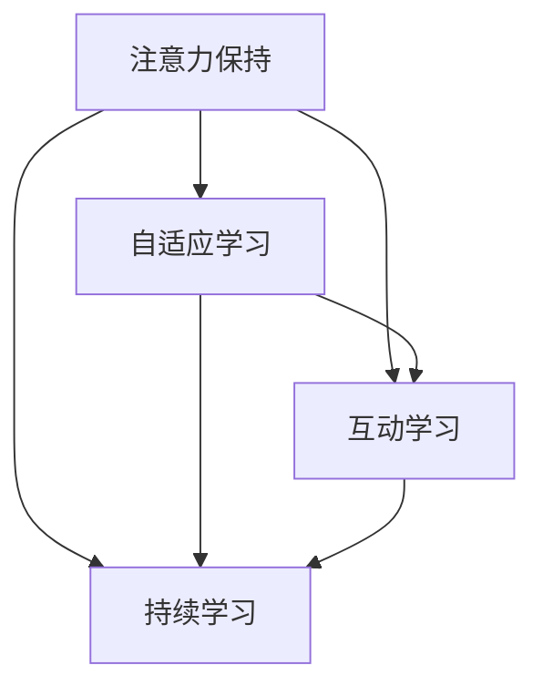

                 

# 在线教育平台的注意力保持策略

## 1. 背景介绍

### 1.1 问题由来
在线教育行业正经历迅猛发展，越来越多的学习者开始选择线上平台进行学习和自我提升。然而，如何保持学习者的注意力并维持其长时间的学习兴趣，成为一个亟待解决的问题。注意力保持（Attention Retention）是提高在线学习体验和效果的基石，直接影响学习者的学习成果和平台的用户满意度。

### 1.2 问题核心关键点
当前在线教育平台在保持学习者注意力方面面临以下核心挑战：
- **内容多样性与个性化**：如何根据学习者的背景和兴趣提供定制化的学习内容？
- **互动性**：如何增加平台与学习者的互动，提升学习兴趣？
- **动态适应性**：如何根据学习者的反馈和表现，动态调整课程内容和难度？
- **注意力持久度**：如何确保学习者在长时间学习过程中保持注意力，避免疲劳和倦怠？

### 1.3 问题研究意义
研究在线教育平台的注意力保持策略，对于提升学习效果、提高用户满意度和平台的用户留存率具有重要意义。

1. **提升学习效果**：通过注意力保持策略，学习者能更长时间地专注于学习内容，提升知识掌握程度。
2. **提高用户满意度**：良好的注意力保持能显著提升学习体验，使学习者对平台的黏性更强。
3. **增加用户留存率**：长期的注意力保持使学习者更愿意持续使用平台，提高平台的用户留存率。

## 2. 核心概念与联系

### 2.1 核心概念概述

为了深入理解在线教育平台注意力保持策略，我们先定义几个核心概念：

- **注意力保持（Attention Retention）**：指在学习过程中保持学习者注意力的能力。通过个性化学习内容、增加互动、动态调整学习难度等方式，提升学习者对学习内容的兴趣和专注度。
- **自适应学习（Adaptive Learning）**：根据学习者的实时反馈和表现，动态调整课程内容和难度，以适应学习者的学习进度和能力。
- **互动学习（Interactive Learning）**：通过增加学习者与平台之间的互动，提升学习者的参与度和学习效果。互动方式包括讨论、问答、协作等。
- **持续学习（Continuous Learning）**：通过持续的学习和反馈，使学习者能够不断积累知识和技能，长期保持学习动力。

这些核心概念之间的逻辑关系可以通过以下Mermaid流程图来展示：



这个流程图展示了几类学习策略之间的关联性：

1. **注意力保持**：通过个性化学习内容和互动增加，提高学习者的专注度。
2. **自适应学习**：根据学习者的表现和反馈，动态调整课程内容和难度。
3. **互动学习**：通过增加互动，提升学习者的参与度。
4. **持续学习**：通过持续的反馈和积累，使学习者长期保持学习动力。

这些策略相互配合，形成了一个闭环的学习生态系统，共同提升学习效果和平台的用户留存率。

## 3. 核心算法原理 & 具体操作步骤

### 3.1 算法原理概述

在线教育平台的注意力保持策略，本质上是一个以学习者为中心的个性化学习系统。其核心思想是：通过收集学习者的学习数据和行为反馈，动态调整学习内容和互动方式，以保持学习者的注意力和兴趣。

形式化地，假设在线教育平台的学习任务为 $T$，学习者为 $L$。平台的目标是找到一组参数 $\theta$，使得学习者 $L$ 在执行任务 $T$ 时，保持注意力并取得高学习效果。即：

$$
\hat{\theta}=\mathop{\arg\min}_{\theta} \mathcal{L}(L,T,\theta)
$$

其中 $\mathcal{L}$ 为衡量学习者学习效果和注意力的损失函数，用于评估学习者是否在任务 $T$ 上保持注意力并取得高成绩。常见的损失函数包括学习者成绩与预期的差距、学习者的注意力集中度等。

### 3.2 算法步骤详解

基于上述原理，在线教育平台的注意力保持策略通常包括以下几个关键步骤：

**Step 1: 收集学习者数据**
- 收集学习者的学习行为数据，如登录时间、学习时长、课程完成度、互动参与度等。
- 使用学习者的评估数据，如测试成绩、作业提交情况、提问次数等。

**Step 2: 个性化学习内容设计**
- 根据学习者的历史数据和行为特征，设计个性化的学习内容。可以包括推荐适合的课程、调整课程难度、引入相关练习等。
- 使用机器学习算法，如协同过滤、内容推荐系统等，生成个性化的学习路径。

**Step 3: 增加互动环节**
- 引入问答系统、讨论区、协作任务等方式，增加学习者和平台之间的互动。
- 设计有吸引力的互动活动，如竞赛、游戏化学习等，提升学习者的参与度。

**Step 4: 动态调整学习进度**
- 根据学习者的表现和反馈，动态调整学习进度。可以采用自适应学习算法，如Bayesian优化、梯度增强等。
- 根据学习者的学习曲线，适时调整课程难度和内容深度，避免学习者过早或过晚感到疲劳。

**Step 5: 持续学习与反馈**
- 定期收集学习者的反馈，进行课程评价和学习效果评估。
- 根据学习者的反馈和表现，持续优化课程内容和互动设计。
- 使用持续学习算法，如Reinforcement Learning、深度强化学习等，保持学习者的长期学习动力。

### 3.3 算法优缺点

在线教育平台注意力保持策略具有以下优点：
1. **个性化学习**：根据学习者的个性化需求，设计合适的学习路径，提高学习效果。
2. **互动性强**：通过增加互动环节，提升学习者的参与度和兴趣。
3. **动态适应**：根据学习者的反馈，动态调整学习进度和内容，避免过载或不足。
4. **持续改进**：通过持续的反馈和优化，不断提升学习体验和效果。

同时，该策略也存在一些局限性：
1. **数据隐私**：收集学习者数据时需要考虑数据隐私和安全性问题。
2. **模型复杂度**：设计个性化内容和学习路径的算法需要较高的计算复杂度。
3. **资源投入**：动态调整学习进度和内容需要较大的技术资源和人力投入。
4. **用户多样性**：不同学习者的需求和兴趣差异较大，统一的设计难以满足所有用户需求。

尽管存在这些局限性，但总体而言，注意力保持策略是提升在线教育平台用户体验和效果的重要手段。

### 3.4 算法应用领域

在线教育平台注意力保持策略已经在多个领域得到应用，例如：

- **K-12教育**：为中小学生设计个性化的学习内容，增加互动环节，提升学习兴趣和效果。
- **高等教育**：为大学生提供自适应学习平台，动态调整课程难度，提高学习体验。
- **职业技能培训**：为职场人士提供个性化的职业培训课程，增加实践机会，提升职业技能。
- **企业内训**：为员工提供定制化的在线学习课程，增加互动环节，提升培训效果。

## 4. 数学模型和公式 & 详细讲解 & 举例说明

### 4.1 数学模型构建

本节将使用数学语言对在线教育平台注意力保持策略进行更加严格的刻画。

假设在线教育平台的学习任务为 $T$，学习者 $L$ 在执行任务 $T$ 时，保持注意力的能力为 $R$。根据学习者的行为数据 $D$，设计个性化学习内容 $C$，增加互动环节 $I$，动态调整学习进度 $A$。平台的目标是最大化学习者的学习效果 $E$，即：

$$
\maximize_{R,C,I,A} E(T, L)
$$

其中 $E(T, L)$ 为学习者 $L$ 在任务 $T$ 上的学习效果，可以通过学习者的评估数据和行为数据来衡量。

### 4.2 公式推导过程

以下我们以一个简单的模型为例，推导注意力保持策略的优化目标函数。

假设学习者 $L$ 在任务 $T$ 上的学习效果 $E$ 由以下几个因素决定：
- **学习内容**：学习内容 $C$ 的质量直接影响学习效果。假设 $E_C = f(C)$，其中 $f$ 为质量评估函数。
- **互动环节**：互动环节 $I$ 的丰富度直接影响学习者的参与度和兴趣。假设 $E_I = g(I)$，其中 $g$ 为互动效果评估函数。
- **学习进度**：动态调整学习进度 $A$ 可避免学习者的疲劳和倦怠，提高学习效果。假设 $E_A = h(A)$，其中 $h$ 为进度调整效果评估函数。

则学习效果 $E$ 可以表示为：

$$
E(T, L) = E_C + E_I + E_A + \delta
$$

其中 $\delta$ 为学习者历史学习效果的影响。

为了最大化学习效果 $E$，我们需要优化四个变量：
- **学习内容**：$C$，通过推荐算法优化。
- **互动环节**：$I$，通过设计互动活动优化。
- **学习进度**：$A$，通过自适应学习算法优化。
- **注意力保持**：$R$，通过实时监测和反馈优化。

目标函数为：

$$
\maximize_{R,C,I,A} E_C + E_I + E_A + \delta
$$

### 4.3 案例分析与讲解

以一个简单的在线编程学习平台为例，分析注意力保持策略的应用。

**学习内容**：根据学习者的编程水平和兴趣，推荐适合的编程练习和项目。可以使用协同过滤算法，根据学习者的历史行为数据，推荐相似的学习内容。

**互动环节**：通过引入代码问答系统、编程竞赛等互动环节，增加学习者的参与度。例如，设计一个编程挑战，要求学习者在规定时间内解决特定问题，完成后可以解锁新的挑战。

**学习进度**：根据学习者的编程难度和完成情况，动态调整练习难度和进度。例如，对于新手学习者，先从简单的练习开始，逐步增加难度。对于有一定基础的学习者，直接提供更具挑战性的项目。

**注意力保持**：通过实时监测学习者的行为数据，如登录时间、练习完成度等，评估学习者的注意力保持情况。对于注意力不集中的学习者，可以提供短暂的休息提示或趣味性的互动活动，帮助其恢复注意力。

## 5. 项目实践：代码实例和详细解释说明

### 5.1 开发环境搭建

在进行注意力保持策略的实践前，我们需要准备好开发环境。以下是使用Python进行开发的环境配置流程：

1. 安装Anaconda：从官网下载并安装Anaconda，用于创建独立的Python环境。

2. 创建并激活虚拟环境：
```bash
conda create -n attention-env python=3.8 
conda activate attention-env
```

3. 安装PyTorch：根据CUDA版本，从官网获取对应的安装命令。例如：
```bash
conda install pytorch torchvision torchaudio cudatoolkit=11.1 -c pytorch -c conda-forge
```

4. 安装TensorFlow：使用pip安装TensorFlow，供互动学习模块使用。
```bash
pip install tensorflow
```

5. 安装Flask：用于搭建在线学习平台的后端服务。
```bash
pip install flask
```

6. 安装JavaScript和CSS框架：用于前端页面的开发。
```bash
npm install
```

完成上述步骤后，即可在`attention-env`环境中开始注意力保持策略的开发。

### 5.2 源代码详细实现

下面我们以一个在线编程学习平台为例，给出基于TensorFlow和Flask的注意力保持策略的PyTorch代码实现。

**后端服务**：

```python
from flask import Flask, request, jsonify
import tensorflow as tf
import torch

app = Flask(__name__)

@app.route('/recommend_content', methods=['POST'])
def recommend_content():
    # 获取学习者的行为数据
    user_data = request.json['user_data']
    
    # 使用协同过滤算法推荐内容
    content = collaborative_filtering(user_data)
    
    # 返回推荐内容
    return jsonify(content)

@app.route('/interactive_activities', methods=['POST'])
def interactive_activities():
    # 获取学习者的互动数据
    user_data = request.json['user_data']
    
    # 设计互动活动
    activities = design_interactive_activities(user_data)
    
    # 返回互动活动
    return jsonify(activities)

@app.route('/adjust_learning_progress', methods=['POST'])
def adjust_learning_progress():
    # 获取学习者的学习数据
    user_data = request.json['user_data']
    
    # 动态调整学习进度
    progress = adjust_learning_progress(user_data)
    
    # 返回调整后的进度
    return jsonify(progress)

@app.route('/monitor_attention', methods=['POST'])
def monitor_attention():
    # 获取学习者的行为数据
    user_data = request.json['user_data']
    
    # 实时监测注意力
    attention = monitor_attention(user_data)
    
    # 返回注意力监测结果
    return jsonify(attention)

if __name__ == '__main__':
    app.run(host='0.0.0.0', port=5000)
```

**前端页面**：

```html
<!DOCTYPE html>
<html>
<head>
    <title>在线编程学习平台</title>
    <link rel="stylesheet" type="text/css" href="styles.css">
    <script src="scripts.js"></script>
</head>
<body>
    <div id="content"></div>
    <script>
        // 加载推荐内容
        function load_recommend_content() {
            $.ajax({
                url: '/recommend_content',
                type: 'POST',
                data: user_data,
                success: function(data) {
                    display_content(data);
                }
            });
        }

        // 加载互动活动
        function load_interactive_activities() {
            $.ajax({
                url: '/interactive_activities',
                type: 'POST',
                data: user_data,
                success: function(data) {
                    display_activities(data);
                }
            });
        }

        // 加载学习进度
        function load_learning_progress() {
            $.ajax({
                url: '/adjust_learning_progress',
                type: 'POST',
                data: user_data,
                success: function(data) {
                    update_learning_progress(data);
                }
            });
        }

        // 监测注意力
        function monitor_attention() {
            $.ajax({
                url: '/monitor_attention',
                type: 'POST',
                data: user_data,
                success: function(data) {
                    display_attention(data);
                }
            });
        }

        $(document).ready(function() {
            load_recommend_content();
            load_interactive_activities();
            load_learning_progress();
            monitor_attention();
        });
    </script>
</body>
</html>
```

### 5.3 代码解读与分析

让我们再详细解读一下关键代码的实现细节：

**后端服务**：
- **recommend_content函数**：接收学习者的行为数据，使用协同过滤算法推荐合适的编程练习和项目，并返回推荐内容。
- **interactive_activities函数**：根据学习者的互动数据，设计有吸引力的互动活动，如编程竞赛、代码问答等，并返回活动详情。
- **adjust_learning_progress函数**：根据学习者的学习进度和难度，动态调整练习难度和进度，并返回调整后的进度。
- **monitor_attention函数**：实时监测学习者的注意力保持情况，通过行为数据评估学习者的注意力，并返回注意力监测结果。

**前端页面**：
- **load_recommend_content函数**：通过AJAX请求后端服务，加载推荐的内容并显示在页面上。
- **load_interactive_activities函数**：通过AJAX请求后端服务，加载互动活动并显示在页面上。
- **load_learning_progress函数**：通过AJAX请求后端服务，加载学习进度并更新在页面上。
- **monitor_attention函数**：通过AJAX请求后端服务，监测学习者的注意力并更新在页面上。

通过这些代码，我们可以实现一个简单的在线编程学习平台，通过后端服务动态调整学习内容和进度，增加互动环节，实时监测学习者的注意力，从而提升学习效果和用户体验。

### 5.4 运行结果展示

运行上述代码后，我们可以通过浏览器访问在线编程学习平台，体验其注意力保持策略的效果。学习者可以在平台上选择编程练习、参与互动活动、调整学习进度，同时平台会根据其行为数据实时监测注意力，动态调整学习内容和进度，提供个性化的学习体验。

## 6. 实际应用场景

### 6.1 智能在线客服

在线客服系统可以通过注意力保持策略，提升用户的服务体验和满意度。

**应用场景**：在线客服平台为消费者提供24小时在线服务。平台可以实时监测消费者的行为数据，如会话时长、问题回答情况等，评估服务质量。根据消费者反馈，动态调整客服人员的工作内容和难度，提供个性化的服务。

**技术实现**：
- 监测消费者的行为数据，如会话时长、问题回答情况等。
- 根据数据评估服务质量，动态调整客服人员的工作内容和难度。
- 设计个性化的服务对话，提升消费者的满意度。

### 6.2 企业内训平台

企业内训平台可以通过注意力保持策略，提升员工的培训效果和学习动力。

**应用场景**：企业为员工提供在线培训课程，通过注意力保持策略，提升员工的学习效果和参与度。

**技术实现**：
- 监测员工的学习行为数据，如课程完成度、互动参与度等。
- 根据数据评估学习效果，动态调整课程内容和难度。
- 设计互动环节，如讨论、协作等，提升员工的参与度。

### 6.3 在线旅游平台

在线旅游平台可以通过注意力保持策略，提升用户的旅游体验和满意度。

**应用场景**：在线旅游平台为用户提供旅游攻略、行程规划等服务。平台可以实时监测用户的浏览和预订行为，评估服务质量。根据用户反馈，动态调整推荐内容和难度，提供个性化的旅游建议。

**技术实现**：
- 监测用户的浏览和预订行为，如浏览时长、预订情况等。
- 根据数据评估服务质量，动态调整推荐内容和难度。
- 设计个性化的旅游建议，提升用户的满意度。

## 7. 工具和资源推荐

### 7.1 学习资源推荐

为了帮助开发者系统掌握在线教育平台的注意力保持策略，这里推荐一些优质的学习资源：

1. **《自适应学习系统设计与实现》系列博文**：深入浅出地介绍了自适应学习系统的设计与实现方法，包括个性化学习、互动设计、持续学习等内容。

2. **Coursera《在线学习设计与开发》课程**：斯坦福大学开设的在线课程，涵盖在线学习的各个方面，包括个性化学习、互动设计、自适应学习等。

3. **《自适应学习理论与实践》书籍**：系统介绍自适应学习理论和实践方法，包括学习者的建模、个性化内容推荐、动态调整学习进度等。

4. **WoW系统**：由麻省理工学院开发的多模态在线学习平台，展示了自适应学习系统的最新研究进展。

5. **edX平台**：提供广泛的在线课程，包括自适应学习、互动设计等领域的课程，适合初学者和进阶者学习。

通过这些资源的学习实践，相信你一定能够快速掌握在线教育平台注意力保持策略的精髓，并用于解决实际的在线学习问题。

### 7.2 开发工具推荐

高效的开发离不开优秀的工具支持。以下是几款用于在线教育平台注意力保持策略开发的常用工具：

1. **PyTorch**：基于Python的开源深度学习框架，灵活动态的计算图，适合快速迭代研究。
2. **TensorFlow**：由Google主导开发的开源深度学习框架，生产部署方便，适合大规模工程应用。
3. **Flask**：轻量级的Python Web框架，简单易用，适合搭建在线学习平台的后端服务。
4. **JavaScript和CSS框架**：如React、Vue等，用于前端页面的开发。
5. **Amazon AWS**：提供云服务，包括计算、存储、数据库等，适合搭建大规模在线学习平台。

合理利用这些工具，可以显著提升在线教育平台注意力保持策略的开发效率，加快创新迭代的步伐。

### 7.3 相关论文推荐

在线教育平台注意力保持策略的研究源于学界的持续研究。以下是几篇奠基性的相关论文，推荐阅读：

1. **《自适应学习系统：设计、开发与评估》（Adaptive Learning Systems: Design and Development）**：探讨了自适应学习系统的设计与开发方法，以及相关评估指标。

2. **《在线学习中的个性化推荐系统》（Personalized Recommendation Systems in Online Learning）**：介绍了在线学习平台中个性化推荐系统的设计与实现方法。

3. **《自适应学习算法：理论与应用》（Adaptive Learning Algorithms: Theory and Practice）**：详细介绍了自适应学习算法的设计与实现，包括协同过滤、贝叶斯优化等内容。

4. **《多模态在线学习平台的设计与实现》（Design and Realization of Multi-modal Online Learning Platform）**：展示了多模态在线学习平台的设计和实现方法，包括个性化学习、互动设计、持续学习等内容。

这些论文代表了大语言模型微调技术的发展脉络。通过学习这些前沿成果，可以帮助研究者把握学科前进方向，激发更多的创新灵感。

## 8. 总结：未来发展趋势与挑战

### 8.1 总结

本文对在线教育平台的注意力保持策略进行了全面系统的介绍。首先阐述了注意力保持策略的研究背景和意义，明确了其对提升在线教育平台用户体验和效果的重要性。其次，从原理到实践，详细讲解了注意力保持策略的数学模型和关键步骤，给出了实际应用场景的代码实例。

通过本文的系统梳理，可以看到，注意力保持策略在在线教育平台中的应用前景广阔，极大地提升用户的学习效果和平台的用户留存率。未来，伴随技术的不断发展，该策略还将不断优化和创新，带来更多的应用场景和更高的性能提升。

### 8.2 未来发展趋势

展望未来，在线教育平台注意力保持策略将呈现以下几个发展趋势：

1. **个性化学习更精细化**：利用更丰富的学习行为数据，设计更精细化的个性化学习内容，提升学习效果。
2. **互动环节更丰富**：引入更多互动环节，如协作学习、实时反馈等，提升学习者的参与度和兴趣。
3. **动态调整更精准**：使用更先进的自适应学习算法，动态调整学习进度和内容，避免学习者的疲劳和倦怠。
4. **持续学习更智能**：引入更智能的持续学习算法，如Reinforcement Learning、深度强化学习等，保持学习者的长期学习动力。
5. **多模态融合更深入**：将文本、图像、视频等多模态信息融合，提升学习体验和效果。

以上趋势凸显了在线教育平台注意力保持策略的广阔前景。这些方向的探索发展，必将进一步提升在线学习体验和效果，为在线教育平台带来更多的应用场景和更高的用户满意度。

### 8.3 面临的挑战

尽管在线教育平台注意力保持策略已经取得了不小的进步，但在迈向更加智能化、普适化应用的过程中，它仍面临着诸多挑战：

1. **数据隐私和安全**：收集学习者数据时需要考虑数据隐私和安全性问题。如何确保数据的安全和合规，是一个重要的研究方向。
2. **模型复杂度**：设计个性化内容和学习路径的算法需要较高的计算复杂度。如何简化算法，提升效率，是另一个重要研究方向。
3. **用户多样性**：不同学习者的需求和兴趣差异较大，统一的设计难以满足所有用户需求。如何设计更灵活、更个性化的策略，是未来的研究方向。
4. **技术资源投入**：动态调整学习进度和内容需要较大的技术资源和人力投入。如何降低资源成本，提高效率，是一个需要解决的问题。
5. **用户反馈机制**：如何设计有效的用户反馈机制，收集学习者的反馈信息，进行持续优化，也是一个重要的研究方向。

尽管存在这些挑战，但总体而言，注意力保持策略是提升在线教育平台用户体验和效果的重要手段。未来，通过技术创新和不断优化，这些问题终将逐一得到解决，策略将更加智能化和普适化。

### 8.4 研究展望

面对在线教育平台注意力保持策略所面临的种种挑战，未来的研究需要在以下几个方面寻求新的突破：

1. **无监督学习和半监督学习**：探索不依赖大规模标注数据的无监督和半监督学习方法，最大化利用非结构化数据，实现更加灵活高效的个性化学习。
2. **多模态融合技术**：将文本、图像、视频等多模态信息融合，提升学习体验和效果。
3. **智能推荐系统**：引入更智能的推荐算法，提升学习者的参与度和兴趣。
4. **自适应学习算法**：设计更先进的自适应学习算法，动态调整学习进度和内容，避免学习者的疲劳和倦怠。
5. **持续学习算法**：引入更智能的持续学习算法，保持学习者的长期学习动力。

这些研究方向的探索，必将引领在线教育平台注意力保持策略技术迈向更高的台阶，为构建更加智能、普适的在线学习平台铺平道路。面向未来，在线教育平台注意力保持策略还需要与其他人工智能技术进行更深入的融合，如知识表示、因果推理、强化学习等，多路径协同发力，共同推动在线教育技术的发展。只有勇于创新、敢于突破，才能不断拓展在线教育平台的边界，让在线教育技术更好地服务于社会。

## 9. 附录：常见问题与解答

**Q1：在线教育平台注意力保持策略是否适用于所有课程？**

A: 在线教育平台注意力保持策略在大多数课程上都能取得不错的效果，特别是对于数据量较小的课程。但对于一些需要深度理解和深入探索的课程，仅靠注意力保持策略可能难以达到理想的教学效果。此时需要在课程设计中加入更多的互动环节和个性化学习内容。

**Q2：如何设计有效的互动环节？**

A: 设计有效的互动环节是保持学习者注意力的关键。以下是一些设计原则：
1. **多样性**：设计多种形式的互动环节，如讨论、问答、协作等，避免单一乏味。
2. **及时反馈**：及时给予学习者反馈，帮助其了解学习效果，增强学习动力。
3. **趣味性**：增加趣味性元素，如游戏化学习、模拟实验等，提高学习者的参与度。
4. **相关性**：设计互动环节与课程内容紧密相关，帮助学习者更好地理解知识。

**Q3：如何动态调整学习进度？**

A: 动态调整学习进度需要设计自适应学习算法，以下是一些常见方法：
1. **贝叶斯优化**：根据学习者的反馈和表现，动态调整学习进度和内容深度。
2. **梯度增强**：根据学习者的学习曲线，适时调整课程难度和内容。
3. **自适应回归**：根据学习者的学习速度，动态调整学习进度和难度。

**Q4：如何实时监测学习者的注意力？**

A: 实时监测学习者的注意力需要收集和分析学习者的行为数据，以下是一些常见方法：
1. **行为数据监测**：监测学习者的登录时间、学习时长、互动参与度等行为数据。
2. **反馈数据分析**：分析学习者的反馈数据，如问卷调查、评分等，评估学习者的注意力保持情况。
3. **生理信号监测**：使用生理信号监测设备，如心率、眼球运动等，实时监测学习者的注意力。

通过这些方法，可以实时监测学习者的注意力，根据其状态动态调整学习内容和进度，提升学习效果和用户体验。

通过本文的系统梳理，可以看到，在线教育平台注意力保持策略在提升用户学习效果和平台用户留存率方面具有重要意义。未来，伴随技术的不断发展，该策略还将不断优化和创新，带来更多的应用场景和更高的性能提升。相信随着学界和产业界的共同努力，在线教育平台注意力保持策略必将迎来更加智能、普适化的未来。

