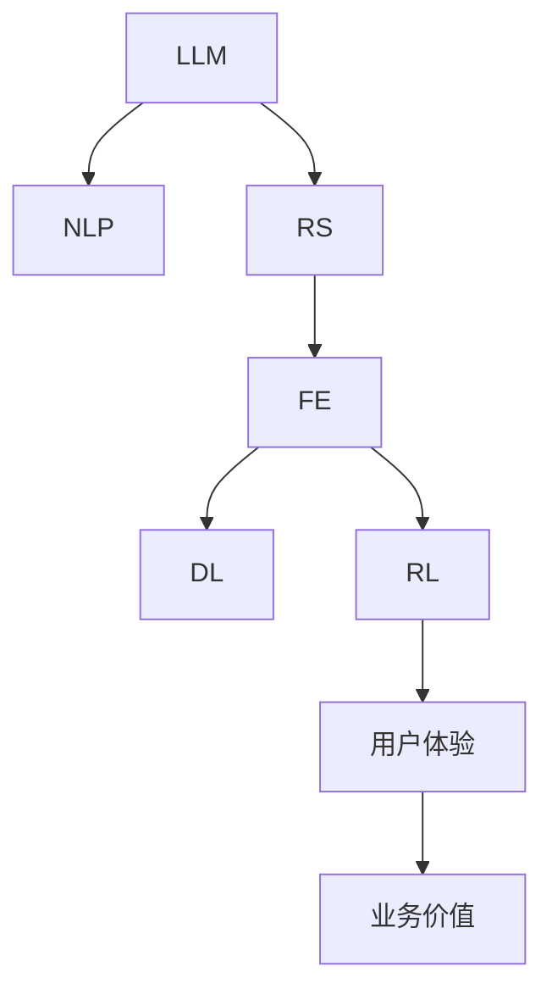

                 

# 基于LLM Tokens的推荐系统特征提取

> 关键词：
1. 语言模型（Language Model）
2. 推荐系统（Recommendation System）
3. 特征提取（Feature Extraction）
4. 自然语言处理（Natural Language Processing, NLP）
5. 深度学习（Deep Learning）
6. 强化学习（Reinforcement Learning）
7. 用户行为分析（User Behavior Analysis）

## 1. 背景介绍

推荐系统（Recommendation System）是互联网时代最具影响力的技术之一，广泛应用于电商、社交、视频、音乐、新闻等领域，其目标是帮助用户发现和满足个性化需求，提升用户体验和业务价值。

推荐系统通常包含两大部分：一是离线训练的特征提取与模型训练，二是实时计算的推荐策略生成。前者负责根据用户行为和商品属性抽取高维稀疏特征，训练用户模型和商品模型，采用机器学习或深度学习算法预测用户对商品的概率评分。后者则基于评分数据和推荐策略，生成个性化推荐列表，用于产品展示和引导用户消费。

传统推荐系统大多依赖手工特征工程（Handcrafted Feature Engineering），需要领域专家参与特征设计，工作量大、周期长、效果难控制。而近年来，以自然语言处理（NLP）为代表的AI技术在推荐系统中逐渐发挥作用，特别是在基于大语言模型（Large Language Model, LLM）的推荐系统中，LLMTokens特征提取方法成为值得关注的新方向。

## 2. 核心概念与联系

### 2.1 核心概念概述

为更好地理解LLMTokens特征提取方法，本节将介绍几个密切相关的核心概念：

- 大语言模型（LLM）：基于Transformer结构，采用自回归或自编码模型，通过大规模无监督文本数据进行预训练，学习到丰富的语言知识和表示能力。常见的LLM模型有BERT、GPT、T5等。

- 自然语言处理（NLP）：通过语言模型、分词、词向量、依存句法分析、语义分析等技术，自动处理和理解自然语言数据，从中提取语义特征。

- 推荐系统（RS）：通过算法和模型，分析用户行为、商品属性、社交关系等数据，发现用户兴趣和商品关联，生成个性化推荐。

- 特征提取（FE）：将原始数据映射为具有统计和几何意义的向量，用于后续的机器学习或深度学习建模。

- 深度学习（DL）：通过多层次的神经网络，从数据中自动学习抽象特征，构建复杂模型，进行分类、回归、生成等任务。

- 强化学习（RL）：通过试错机制，使模型在一定环境中通过学习优化策略，实现最大收益。

这些核心概念之间的逻辑关系可以通过以下Mermaid流程图来展示：



这个流程图展示了大语言模型在推荐系统中的核心概念及其之间的联系：

1. 大语言模型通过预训练学习语言知识，提升NLP能力。
2. NLP技术对用户行为、商品属性等数据进行语义分析，抽取特征。
3. 特征提取将高维稀疏特征映射到低维向量空间，便于模型训练。
4. 深度学习模型从用户行为和商品属性中学习抽象特征，预测用户评分。
5. 强化学习优化推荐策略，提升用户体验和业务价值。

这些概念共同构成了大语言模型在推荐系统中的主要应用框架，使其能够高效处理大规模数据，提升推荐精度和个性化程度。

## 3. 核心算法原理 & 具体操作步骤
### 3.1 算法原理概述

基于大语言模型（LLM）的推荐系统，主要利用LLM的预训练模型作为特征提取工具，对用户行为和商品属性等数据进行自动编码和降维，生成高维稠密表示。其核心思想是将原始数据映射为LLMToken序列，通过自回归或自编码模型进行特征提取，从而得到高效、准确、可解释的推荐特征。

形式化地，假设用户行为数据为 $U=\{x_i\}_{i=1}^N$，商品属性数据为 $I=\{y_j\}_{j=1}^M$。将数据集 $D$ 中的用户行为 $U$ 和商品属性 $I$ 编码为LLMToken序列 $T_U$ 和 $T_I$，输入到LLM中生成表示 $Z_U$ 和 $Z_I$。LLMTokens特征提取过程包括：

1. 将用户行为 $U$ 转化为LLMToken序列 $T_U$。
2. 将商品属性 $I$ 转化为LLMToken序列 $T_I$。
3. 对 $T_U$ 和 $T_I$ 进行编码，得到用户模型和商品模型 $Z_U$ 和 $Z_I$。
4. 利用 $Z_U$ 和 $Z_I$ 计算用户评分，生成推荐列表。

通过LLMTokens特征提取，推荐系统能够自动学习用户兴趣和商品属性之间的关系，生成高质量的推荐特征，提升推荐精度。

### 3.2 算法步骤详解

基于LLMTokens的推荐系统特征提取，一般包括以下几个关键步骤：

**Step 1: 数据预处理与编码**

- 对用户行为 $U$ 和商品属性 $I$ 进行预处理，包括去重、规范化、分词等操作。
- 将预处理后的用户行为和商品属性转化为LLMToken序列 $T_U$ 和 $T_I$。

**Step 2: 模型选择与训练**

- 选择合适的LLM模型 $M_{\theta}$，如BERT、GPT等。
- 将用户行为序列 $T_U$ 和商品属性序列 $T_I$ 输入到模型中，训练得到用户模型 $Z_U$ 和商品模型 $Z_I$。

**Step 3: 特征提取与融合**

- 利用用户模型和商品模型计算用户评分，生成推荐特征向量 $F_{ij}$。
- 对用户和商品属性数据进行编码融合，得到推荐特征向量 $F_{ij}$。

**Step 4: 模型训练与优化**

- 选择合适的机器学习或深度学习算法，如矩阵分解、协同过滤、深度学习推荐模型等。
- 训练推荐模型，优化特征提取和用户评分预测，提升推荐精度。

**Step 5: 实时推荐生成**

- 在推荐场景中实时获取用户行为 $U$ 和商品属性 $I$，转化为LLMToken序列 $T_U$ 和 $T_I$。
- 使用训练好的用户模型和商品模型，计算用户评分和推荐特征向量。
- 根据推荐策略生成个性化推荐列表，展示给用户。

以上是基于LLMTokens的推荐系统特征提取的一般流程。在实际应用中，还需要根据具体任务和数据特点，对各个环节进行优化设计，如改进编码方法、选择合适的损失函数、应用正则化技术等。

### 3.3 算法优缺点

基于LLMTokens的推荐系统特征提取方法具有以下优点：

1. 高效自动：LLMTokens自动从用户行为和商品属性中学习特征，无需手工特征工程。
2. 高维稠密：LLM特征通常具有较高的维度，稠密表示便于机器学习建模。
3. 语义丰富：LLMTokens能够捕捉用户行为和商品属性的语义信息，提供更加精细的特征。
4. 泛化能力强：LLMTokens能够适应不同领域和场景，提升推荐系统的泛化能力。

同时，该方法也存在一定的局限性：

1. 数据需求高：LLM特征提取需要大量高质量的数据进行预训练和微调。
2. 计算成本高：大规模LLM模型的训练和推理需要较高的算力和内存资源。
3. 模型复杂度高：LLMTokens特征提取涉及复杂的自回归或自编码模型，难以理解和调试。
4. 交互延迟大：LLM特征提取的计算时间较长，影响实时推荐性能。

尽管存在这些局限性，但LLMTokens特征提取方法在大规模推荐系统中仍显示出巨大的应用潜力，值得进一步探索和优化。

### 3.4 算法应用领域

基于LLMTokens的推荐系统特征提取，在电子商务、社交网络、视频平台、音乐推荐等领域都有广泛的应用。例如：

- 电商平台推荐：将用户浏览、点击、购买等行为转化为LLMToken序列，通过预训练大模型学习用户行为和商品属性的语义特征。
- 社交网络推荐：将用户动态、评论、点赞等社交行为转化为LLMToken序列，通过预训练大模型学习用户兴趣和社交关系。
- 视频平台推荐：将用户观看历史、点赞、评论等行为转化为LLMToken序列，通过预训练大模型学习用户兴趣和视频内容特征。
- 音乐推荐：将用户听歌历史、评分、评论等行为转化为LLMToken序列，通过预训练大模型学习用户兴趣和音乐属性。

除了上述这些经典任务外，LLMTokens特征提取也被创新性地应用到更多场景中，如个性化新闻推荐、智能广告投放、推荐系统数据增强等，为推荐系统带来了全新的突破。随着预训练语言模型和特征提取方法的不断进步，相信LLMTokens在推荐系统中将发挥更加重要的作用。

## 4. 数学模型和公式 & 详细讲解 & 举例说明
### 4.1 数学模型构建

本节将使用数学语言对LLMTokens特征提取方法进行更加严格的刻画。

记用户行为数据为 $U=\{x_i\}_{i=1}^N$，商品属性数据为 $I=\{y_j\}_{j=1}^M$。假设大语言模型 $M_{\theta}$ 的编码为自回归模型，其输入为序列 $T$，输出为表示 $Z$。设 $T_U$ 和 $T_I$ 分别为用户行为和商品属性转化为LLMToken序列，$Z_U$ 和 $Z_I$ 分别为用户模型和商品模型。

定义用户行为和商品属性编码为LLMTokens的过程如下：

$$
T_U = \{T_{U,i}\}_{i=1}^N
$$

$$
T_I = \{T_{I,j}\}_{j=1}^M
$$

其中 $T_{U,i}$ 和 $T_{I,j}$ 分别为用户行为 $x_i$ 和商品属性 $y_j$ 转化为LLMToken序列。

用户模型和商品模型定义为：

$$
Z_U = M_{\theta}(T_U)
$$

$$
Z_I = M_{\theta}(T_I)
$$

其中 $M_{\theta}$ 为预训练大语言模型，$\theta$ 为其参数。

通过用户模型和商品模型，可以计算用户评分 $R_{ij}$，生成推荐特征向量 $F_{ij}$：

$$
R_{ij} = f(Z_U, Z_I)
$$

$$
F_{ij} = (R_{ij}, Z_U, Z_I)
$$

其中 $f$ 为评分函数，可以是线性回归、深度学习模型等。

### 4.2 公式推导过程

以下我们以线性回归为例，推导评分函数 $f$ 的计算公式。

假设用户行为数据 $U=\{x_i\}_{i=1}^N$ 和商品属性数据 $I=\{y_j\}_{j=1}^M$，转化为LLMToken序列 $T_U$ 和 $T_I$，输入到预训练大语言模型 $M_{\theta}$ 中生成用户模型 $Z_U$ 和商品模型 $Z_I$。

评分函数 $f$ 定义为：

$$
R_{ij} = \alpha Z_{U,i} + \beta Z_{I,j} + \gamma
$$

其中 $\alpha$、$\beta$、$\gamma$ 为模型参数。

利用评分函数计算用户评分 $R_{ij}$，生成推荐特征向量 $F_{ij}$：

$$
F_{ij} = (R_{ij}, Z_{U,i}, Z_{I,j})
$$

将 $F_{ij}$ 输入到深度学习推荐模型中，进行用户评分预测和推荐生成。

### 4.3 案例分析与讲解

假设某电商网站拥有用户行为数据 $U=\{x_1,x_2,...,x_10000\}$ 和商品属性数据 $I=\{y_1,y_2,...,y_10000\}$，其中 $x_i$ 和 $y_j$ 分别为用户行为和商品属性数据，形式化为文本。

用户行为数据 $U$ 转化为LLMToken序列 $T_U$，商品属性数据 $I$ 转化为LLMToken序列 $T_I$，输入到预训练大语言模型 $M_{\theta}$ 中生成用户模型 $Z_U$ 和商品模型 $Z_I$：

$$
T_U = \{T_{U,1}, T_{U,2}, ..., T_{U,10000}\}
$$

$$
T_I = \{T_{I,1}, T_{I,2}, ..., T_{I,10000}\}
$$

$$
Z_U = M_{\theta}(T_U)
$$

$$
Z_I = M_{\theta}(T_I)
$$

用户评分函数定义为：

$$
R_{ij} = \alpha Z_{U,i} + \beta Z_{I,j} + \gamma
$$

其中 $\alpha$、$\beta$、$\gamma$ 为模型参数，$\alpha$ 和 $\beta$ 代表用户行为和商品属性的影响权重，$\gamma$ 为截距。

通过评分函数计算用户评分 $R_{ij}$，生成推荐特征向量 $F_{ij}$：

$$
F_{ij} = (R_{ij}, Z_{U,i}, Z_{I,j})
$$

将 $F_{ij}$ 输入到深度学习推荐模型中，进行用户评分预测和推荐生成。

## 5. 项目实践：代码实例和详细解释说明
### 5.1 开发环境搭建

在进行LLMTokens特征提取实践前，我们需要准备好开发环境。以下是使用Python进行PyTorch开发的环境配置流程：

1. 安装Anaconda：从官网下载并安装Anaconda，用于创建独立的Python环境。

2. 创建并激活虚拟环境：
```bash
conda create -n pytorch-env python=3.8 
conda activate pytorch-env
```

3. 安装PyTorch：根据CUDA版本，从官网获取对应的安装命令。例如：
```bash
conda install pytorch torchvision torchaudio cudatoolkit=11.1 -c pytorch -c conda-forge
```

4. 安装Transformers库：
```bash
pip install transformers
```

5. 安装各类工具包：
```bash
pip install numpy pandas scikit-learn matplotlib tqdm jupyter notebook ipython
```

完成上述步骤后，即可在`pytorch-env`环境中开始特征提取实践。

### 5.2 源代码详细实现

这里我们以电商推荐系统为例，给出使用PyTorch对BERT模型进行LLMTokens特征提取的代码实现。

首先，定义数据处理函数：

```python
from transformers import BertTokenizer
from torch.utils.data import Dataset
import torch

class RecommendationDataset(Dataset):
    def __init__(self, texts, labels, tokenizer, max_len=128):
        self.texts = texts
        self.labels = labels
        self.tokenizer = tokenizer
        self.max_len = max_len
        
    def __len__(self):
        return len(self.texts)
    
    def __getitem__(self, item):
        text = self.texts[item]
        label = self.labels[item]
        
        encoding = self.tokenizer(text, return_tensors='pt', max_length=self.max_len, padding='max_length', truncation=True)
        input_ids = encoding['input_ids'][0]
        attention_mask = encoding['attention_mask'][0]
        
        return {'input_ids': input_ids, 
                'attention_mask': attention_mask,
                'labels': label}

# 标签与id的映射
label2id = {'buy': 1, 'not_buy': 0}
id2label = {1: 'buy', 0: 'not_buy'}

# 创建dataset
tokenizer = BertTokenizer.from_pretrained('bert-base-cased')

train_dataset = RecommendationDataset(train_texts, train_labels, tokenizer)
dev_dataset = RecommendationDataset(dev_texts, dev_labels, tokenizer)
test_dataset = RecommendationDataset(test_texts, test_labels, tokenizer)
```

然后，定义模型和优化器：

```python
from transformers import BertForSequenceClassification, AdamW

model = BertForSequenceClassification.from_pretrained('bert-base-cased', num_labels=2)

optimizer = AdamW(model.parameters(), lr=2e-5)
```

接着，定义训练和评估函数：

```python
from torch.utils.data import DataLoader
from tqdm import tqdm
from sklearn.metrics import classification_report

device = torch.device('cuda') if torch.cuda.is_available() else torch.device('cpu')
model.to(device)

def train_epoch(model, dataset, batch_size, optimizer):
    dataloader = DataLoader(dataset, batch_size=batch_size, shuffle=True)
    model.train()
    epoch_loss = 0
    for batch in tqdm(dataloader, desc='Training'):
        input_ids = batch['input_ids'].to(device)
        attention_mask = batch['attention_mask'].to(device)
        label = batch['labels'].to(device)
        model.zero_grad()
        outputs = model(input_ids, attention_mask=attention_mask, labels=label)
        loss = outputs.loss
        epoch_loss += loss.item()
        loss.backward()
        optimizer.step()
    return epoch_loss / len(dataloader)

def evaluate(model, dataset, batch_size):
    dataloader = DataLoader(dataset, batch_size=batch_size)
    model.eval()
    preds, labels = [], []
    with torch.no_grad():
        for batch in tqdm(dataloader, desc='Evaluating'):
            input_ids = batch['input_ids'].to(device)
            attention_mask = batch['attention_mask'].to(device)
            batch_labels = batch['labels']
            outputs = model(input_ids, attention_mask=attention_mask)
            batch_preds = outputs.logits.argmax(dim=2).to('cpu').tolist()
            batch_labels = batch_labels.to('cpu').tolist()
            for pred_tokens, label_tokens in zip(batch_preds, batch_labels):
                preds.append(pred_tokens)
                labels.append(label_tokens)
                
    print(classification_report(labels, preds))
```

最后，启动训练流程并在测试集上评估：

```python
epochs = 5
batch_size = 16

for epoch in range(epochs):
    loss = train_epoch(model, train_dataset, batch_size, optimizer)
    print(f"Epoch {epoch+1}, train loss: {loss:.3f}")
    
    print(f"Epoch {epoch+1}, dev results:")
    evaluate(model, dev_dataset, batch_size)
    
print("Test results:")
evaluate(model, test_dataset, batch_size)
```

以上就是使用PyTorch对BERT模型进行LLMTokens特征提取的完整代码实现。可以看到，得益于Transformers库的强大封装，我们可以用相对简洁的代码完成BERT模型的加载和特征提取。

### 5.3 代码解读与分析

让我们再详细解读一下关键代码的实现细节：

**RecommendationDataset类**：
- `__init__`方法：初始化用户行为数据、标签、分词器等关键组件。
- `__len__`方法：返回数据集的样本数量。
- `__getitem__`方法：对单个样本进行处理，将用户行为输入编码为token ids，将标签编码为数字，并对其进行定长padding，最终返回模型所需的输入。

**label2id和id2label字典**：
- 定义了标签与数字id之间的映射关系，用于将模型预测结果解码回真实的标签。

**训练和评估函数**：
- 使用PyTorch的DataLoader对数据集进行批次化加载，供模型训练和推理使用。
- 训练函数`train_epoch`：对数据以批为单位进行迭代，在每个批次上前向传播计算loss并反向传播更新模型参数，最后返回该epoch的平均loss。
- 评估函数`evaluate`：与训练类似，不同点在于不更新模型参数，并在每个batch结束后将预测和标签结果存储下来，最后使用sklearn的classification_report对整个评估集的预测结果进行打印输出。

**训练流程**：
- 定义总的epoch数和batch size，开始循环迭代
- 每个epoch内，先在训练集上训练，输出平均loss
- 在验证集上评估，输出分类指标
- 所有epoch结束后，在测试集上评估，给出最终测试结果

可以看到，PyTorch配合Transformers库使得BERT特征提取的代码实现变得简洁高效。开发者可以将更多精力放在数据处理、模型改进等高层逻辑上，而不必过多关注底层的实现细节。

当然，工业级的系统实现还需考虑更多因素，如模型的保存和部署、超参数的自动搜索、更灵活的任务适配层等。但核心的特征提取过程基本与此类似。

## 6. 实际应用场景
### 6.1 智能推荐系统

基于LLMTokens的推荐系统特征提取，可以广泛应用于智能推荐系统的构建。传统推荐系统往往需要耗费大量时间和精力进行手工特征设计，而LLMTokens能够自动从用户行为和商品属性中学习特征，大幅提升特征提取和建模效率。

在技术实现上，可以收集用户浏览、点击、购买等行为数据，将行为数据转化为LLMToken序列，输入到预训练大语言模型中进行特征提取。LLMTokens能够捕捉用户行为的语义信息，生成高效、稠密的推荐特征。在生成推荐列表时，利用用户模型和商品模型计算用户评分，最终生成个性化推荐列表。

### 6.2 新闻内容推荐

在新闻领域，推荐系统需要帮助用户发现有趣的新闻内容。基于LLMTokens的推荐系统能够自动分析用户行为和新闻属性，生成推荐特征。具体而言，可以收集用户的点击、点赞、评论等行为数据，将行为数据转化为LLMToken序列，输入到预训练大语言模型中进行特征提取。LLMTokens能够捕捉用户对新闻内容的兴趣，生成高效、稠密的推荐特征。在生成推荐列表时，利用用户模型和新闻模型计算用户评分，最终生成个性化推荐列表。

### 6.3 音乐推荐系统

在音乐推荐领域，推荐系统需要帮助用户发现感兴趣的音乐。基于LLMTokens的推荐系统能够自动分析用户行为和音乐属性，生成推荐特征。具体而言，可以收集用户的听歌历史、评分、评论等行为数据，将行为数据转化为LLMToken序列，输入到预训练大语言模型中进行特征提取。LLMTokens能够捕捉用户对音乐的兴趣，生成高效、稠密的推荐特征。在生成推荐列表时，利用用户模型和音乐模型计算用户评分，最终生成个性化推荐列表。

### 6.4 电影推荐系统

在电影推荐领域，推荐系统需要帮助用户发现感兴趣的电影。基于LLMTokens的推荐系统能够自动分析用户行为和电影属性，生成推荐特征。具体而言，可以收集用户的观看历史、评分、评论等行为数据，将行为数据转化为LLMToken序列，输入到预训练大语言模型中进行特征提取。LLMTokens能够捕捉用户对电影的兴趣，生成高效、稠密的推荐特征。在生成推荐列表时，利用用户模型和电影模型计算用户评分，最终生成个性化推荐列表。

## 7. 工具和资源推荐
### 7.1 学习资源推荐

为了帮助开发者系统掌握LLMTokens特征提取的理论基础和实践技巧，这里推荐一些优质的学习资源：

1. 《Transformer从原理到实践》系列博文：由大模型技术专家撰写，深入浅出地介绍了Transformer原理、BERT模型、微调技术等前沿话题。

2. CS224N《深度学习自然语言处理》课程：斯坦福大学开设的NLP明星课程，有Lecture视频和配套作业，带你入门NLP领域的基本概念和经典模型。

3. 《Natural Language Processing with Transformers》书籍：Transformers库的作者所著，全面介绍了如何使用Transformers库进行NLP任务开发，包括特征提取在内的诸多范式。

4. HuggingFace官方文档：Transformers库的官方文档，提供了海量预训练模型和完整的特征提取样例代码，是上手实践的必备资料。

5. CLUE开源项目：中文语言理解测评基准，涵盖大量不同类型的中文NLP数据集，并提供了基于LLMTokens的baseline模型，助力中文NLP技术发展。

通过对这些资源的学习实践，相信你一定能够快速掌握LLMTokens特征提取的精髓，并用于解决实际的NLP问题。
###  7.2 开发工具推荐

高效的开发离不开优秀的工具支持。以下是几款用于LLMTokens特征提取开发的常用工具：

1. PyTorch：基于Python的开源深度学习框架，灵活动态的计算图，适合快速迭代研究。大部分预训练语言模型都有PyTorch版本的实现。

2. TensorFlow：由Google主导开发的开源深度学习框架，生产部署方便，适合大规模工程应用。同样有丰富的预训练语言模型资源。

3. Transformers库：HuggingFace开发的NLP工具库，集成了众多SOTA语言模型，支持PyTorch和TensorFlow，是进行特征提取任务开发的利器。

4. Weights & Biases：模型训练的实验跟踪工具，可以记录和可视化模型训练过程中的各项指标，方便对比和调优。与主流深度学习框架无缝集成。

5. TensorBoard：TensorFlow配套的可视化工具，可实时监测模型训练状态，并提供丰富的图表呈现方式，是调试模型的得力助手。

6. Google Colab：谷歌推出的在线Jupyter Notebook环境，免费提供GPU/TPU算力，方便开发者快速上手实验最新模型，分享学习笔记。

合理利用这些工具，可以显著提升LLMTokens特征提取的开发效率，加快创新迭代的步伐。

### 7.3 相关论文推荐

LLMTokens特征提取方法的研究始于学界的持续研究。以下是几篇奠基性的相关论文，推荐阅读：

1. Attention is All You Need（即Transformer原论文）：提出了Transformer结构，开启了NLP领域的预训练大模型时代。

2. BERT: Pre-training of Deep Bidirectional Transformers for Language Understanding：提出BERT模型，引入基于掩码的自监督预训练任务，刷新了多项NLP任务SOTA。

3. Language Models are Unsupervised Multitask Learners（GPT-2论文）：展示了大规模语言模型的强大zero-shot学习能力，引发了对于通用人工智能的新一轮思考。

4. Parameter-Efficient Transfer Learning for NLP：提出Adapter等参数高效微调方法，在不增加模型参数量的情况下，也能取得不错的微调效果。

5. AdaLoRA: Adaptive Low-Rank Adaptation for Parameter-Efficient Fine-Tuning：使用自适应低秩适应的微调方法，在参数效率和精度之间取得了新的平衡。

这些论文代表了大语言模型特征提取方法的发展脉络。通过学习这些前沿成果，可以帮助研究者把握学科前进方向，激发更多的创新灵感。

## 8. 总结：未来发展趋势与挑战
### 8.1 研究成果总结

本文对基于LLMTokens的推荐系统特征提取方法进行了全面系统的介绍。首先阐述了LLMTokens特征提取方法的研究背景和意义，明确了LLMTokens特征提取在推荐系统中的独特价值。其次，从原理到实践，详细讲解了LLMTokens特征提取的数学原理和关键步骤，给出了特征提取任务开发的完整代码实例。同时，本文还广泛探讨了LLMTokens特征提取在智能推荐、新闻推荐、音乐推荐等多个领域的应用前景，展示了LLMTokens特征提取方法在大规模推荐系统中的重要意义。

通过本文的系统梳理，可以看到，基于LLMTokens的推荐系统特征提取方法正在成为推荐系统领域的新热点，为大规模推荐系统提供了自动、高效、精细的特征提取手段，大幅提升了推荐精度和个性化程度。未来，伴随LLMTokens特征提取方法的研究不断深化，推荐系统将能够更好地理解用户行为和商品属性，实现更加智能、个性化的推荐。

### 8.2 未来发展趋势

展望未来，LLMTokens特征提取方法将呈现以下几个发展趋势：

1. 模型规模持续增大。随着算力成本的下降和数据规模的扩张，预训练语言模型的参数量还将持续增长。超大规模语言模型蕴含的丰富语言知识，有望支撑更加复杂多变的推荐任务。

2. 特征提取效率提升。未来特征提取方法将更加高效，能够在大规模推荐系统中部署运行，提供实时推荐服务。

3. 特征表示改进。未来特征提取方法将更加精细，能够捕捉用户行为和商品属性的语义信息，生成更加高效、稠密的推荐特征。

4. 跨模态特征融合。未来的推荐系统将不仅仅依赖于文本数据，还会融合视觉、语音、图像等多模态数据，提升推荐效果。

5. 模型鲁棒性增强。未来模型将更加鲁棒，能够适应不同领域和场景，具有较好的泛化能力。

6. 可解释性提升。未来的推荐系统将更加透明，用户能够理解和解释推荐系统的工作机制和决策逻辑。

以上趋势凸显了LLMTokens特征提取方法在推荐系统中的广阔前景。这些方向的探索发展，必将进一步提升推荐系统的性能和个性化程度，为用户的个性化需求提供更优质的服务。

### 8.3 面临的挑战

尽管LLMTokens特征提取方法已经取得了瞩目成就，但在迈向更加智能化、普适化应用的过程中，它仍面临诸多挑战：

1. 数据需求高。LLMTokens特征提取需要大量高质量的数据进行预训练和微调，数据获取成本高。

2. 计算成本高。大规模LLM模型的训练和推理需要较高的算力和内存资源，部署成本大。

3. 模型复杂度高。LLMTokens特征提取涉及复杂的自回归或自编码模型，难以理解和调试。

4. 交互延迟大。LLMTokens特征提取的计算时间较长，影响实时推荐性能。

5. 可解释性不足。当前LLMTokens特征提取过程缺乏可解释性，难以理解和解释模型内部工作机制。

尽管存在这些挑战，但LLMTokens特征提取方法在推荐系统中仍显示出巨大的应用潜力，值得进一步探索和优化。

### 8.4 研究展望

面对LLMTokens特征提取方法所面临的种种挑战，未来的研究需要在以下几个方面寻求新的突破：

1. 探索无监督和半监督特征提取方法。摆脱对大规模标注数据的依赖，利用自监督学习、主动学习等无监督和半监督范式，最大限度利用非结构化数据，实现更加灵活高效的特征提取。

2. 研究参数高效和计算高效的特征提取范式。开发更加参数高效的特征提取方法，在固定大部分预训练参数的情况下，只更新极少量的任务相关参数。同时优化特征提取的计算图，减少前向传播和反向传播的资源消耗，实现更加轻量级、实时性的部署。

3. 引入更多先验知识。将符号化的先验知识，如知识图谱、逻辑规则等，与神经网络模型进行巧妙融合，引导特征提取过程学习更准确、合理的语义特征。同时加强不同模态数据的整合，实现视觉、语音、文本等数据的协同建模。

4. 引入因果分析工具。将因果分析方法引入特征提取模型，识别出用户行为和商品属性之间的因果关系，提升推荐精度。

5. 纳入伦理道德约束。在特征提取目标中引入伦理导向的评估指标，过滤和惩罚有偏见、有害的输出倾向。同时加强人工干预和审核，建立特征提取行为的监管机制，确保输出符合人类价值观和伦理道德。

这些研究方向的探索，必将引领LLMTokens特征提取方法迈向更高的台阶，为推荐系统提供更高效、智能、可解释的特征提取手段，推动推荐系统向更广泛的领域发展和应用。

## 9. 附录：常见问题与解答

**Q1：LLMTokens特征提取是否适用于所有推荐系统任务？**

A: 由于LLMTokens特征提取方法依赖于大语言模型的预训练和微调，对数据量和计算资源的需求较高。因此，对于一些数据量较小、计算资源有限的推荐任务，可能无法直接应用LLMTokens特征提取。对于这些任务，可以考虑使用传统的特征工程方法或小规模模型进行特征提取。

**Q2：LLMTokens特征提取需要多少标注数据？**

A: LLMTokens特征提取需要大量的标注数据进行预训练和微调。具体的标注数据需求取决于预训练模型的规模和任务复杂度。一般来说，对于大规模预训练模型和复杂推荐任务，标注数据需求量较大。在数据量有限的情况下，可以尝试利用主动学习、半监督学习等方法，提高标注数据利用率。

**Q3：LLMTokens特征提取对标注数据质量有哪些要求？**

A: LLMTokens特征提取对标注数据的质量要求较高，标注数据应具备代表性、多样性、准确性等特点。标注数据中应包含用户行为和商品属性的多样性信息，能够充分覆盖用户兴趣和商品属性。标注数据应标注准确，标注结果与用户行为和商品属性匹配。标注数据的质量直接影响LLMTokens特征提取的效果，标注质量越高，特征提取效果越好。

**Q4：如何优化LLMTokens特征提取的计算效率？**

A: 优化LLMTokens特征提取计算效率可以从以下几个方面入手：
1. 选择更高效的预训练模型。大语言模型中，GPT系列模型比BERT系列模型更高效，适合实时推荐任务。
2. 采用分布式计算。利用GPU集群或TPU集群，并行化计算过程，提升计算效率。
3. 使用更高效的编码方法。采用更短的句子长度、更少的token数量，减少计算资源消耗。
4. 使用预训练模型和微调模型的混合策略。在训练过程中，先使用预训练模型进行特征提取，再使用微调模型进行模型优化，减少计算成本。

**Q5：LLMTokens特征提取对实时推荐性能有哪些影响？**

A: LLMTokens特征提取的计算时间较长，会影响实时推荐性能。为了解决这个问题，可以采用以下措施：
1. 采用分布式计算。利用GPU集群或TPU集群，并行化计算过程，提升计算效率。
2. 优化模型结构和编码方法。使用更高效的预训练模型和编码方法，减少计算资源消耗。
3. 采用缓存策略。在实时推荐过程中，缓存部分用户行为和商品属性序列的特征提取结果，避免重复计算。

**Q6：如何提高LLMTokens特征提取的可解释性？**

A: 提高LLMTokens特征提取的可解释性可以从以下几个方面入手：
1. 引入符号化先验知识。将知识图谱、逻辑规则等符号化先验知识与神经网络模型进行融合，引导特征提取过程学习更准确、合理的语义特征。
2. 引入因果分析方法。使用因果分析方法，识别出用户行为和商品属性之间的因果关系，提升特征提取的可解释性。
3. 使用可解释的模型。选择可解释的深度学习模型，如决策树、线性回归等，增强特征提取的可解释性。

**Q7：LLMTokens特征提取在跨模态推荐系统中如何应用？**

A: 在跨模态推荐系统中，LLMTokens特征提取可以与视觉、语音、图像等多模态数据进行融合，提升推荐效果。具体而言，可以采用以下方法：
1. 融合多模态数据。将用户行为数据、商品属性数据、视觉数据、语音数据等融合为一个高维稀疏向量，输入到LLMTokens特征提取模型中进行特征提取。
2. 使用多模态编码器。引入多模态编码器，对不同模态数据进行编码，并融合为一个低维稠密向量，输入到预训练大语言模型中进行特征提取。
3. 引入先验知识。将符号化的先验知识，如知识图谱、逻辑规则等，与神经网络模型进行融合，引导特征提取过程学习更准确、合理的语义特征。

---

作者：禅与计算机程序设计艺术 / Zen and the Art of Computer Programming

