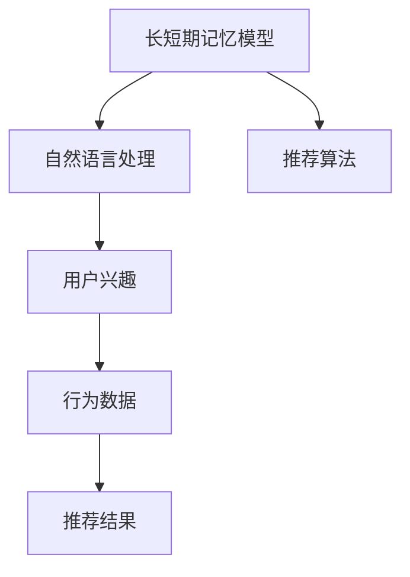

                 

# 基于LLM的推荐系统用户兴趣长短期建模

> 关键词：长短期记忆模型,推荐系统,用户兴趣建模,自回归模型,深度学习,自然语言处理(NLP)

## 1. 背景介绍

推荐系统（Recommender Systems）是一种通过分析用户行为和偏好，为用户推荐物品（如商品、新闻、视频等）的智能应用系统。在互联网时代，推荐系统已经成为提升用户体验、驱动用户消费的关键技术。

推荐系统可以分为基于协同过滤和基于内容的两大类。协同过滤通过用户间和物品间的相似性关系进行推荐，主要分为基于用户的协同过滤和基于物品的协同过滤。基于内容的推荐则侧重于物品的特征和用户兴趣的匹配，主要基于内容的相关性。

近年来，随着深度学习和大规模预训练语言模型（Large Language Models, LLMs）的兴起，推荐系统的用户兴趣建模方式也发生了巨大变革。基于LLM的推荐系统，通过自然语言处理技术，可以从文本数据中直接建模用户兴趣，弥补传统推荐系统的不足。

本文旨在介绍一种基于LLM的推荐系统，并重点探讨用户兴趣的长短期建模方法。

## 2. 核心概念与联系

### 2.1 核心概念概述

在推荐系统中，用户兴趣建模是非常重要的一环。传统的推荐算法，如基于协同过滤的算法，主要通过用户行为（如点击、购买、评分等）来建模用户兴趣。然而，这些行为数据往往难以覆盖所有用户，特别是新用户。此外，行为数据也难以捕捉到用户的深层次心理需求和兴趣。

长短期记忆模型（Long Short-Term Memory, LSTM）和大规模预训练语言模型（LLMs）的出现，为推荐系统的用户兴趣建模带来了新的思路。通过自然语言处理技术，LLMs能够从文本数据中挖掘用户兴趣，捕捉用户的语言偏好和情感倾向。

此外，LLM在自然语言处理任务中的广泛应用，也为推荐系统的研究提供了更多工具和方法。例如，通过情感分析、主题建模、语义相似度计算等技术，可以对用户兴趣进行更加细致和全面的刻画。

### 2.2 核心概念原理和架构的 Mermaid 流程图



此图展示了长短期记忆模型在推荐系统中的应用路径。首先，通过自然语言处理技术，长短期记忆模型从文本数据中提取用户兴趣。然后，将用户兴趣作为输入，结合行为数据和推荐算法，输出最终的推荐结果。

## 3. 核心算法原理 & 具体操作步骤

### 3.1 算法原理概述

基于长短期记忆模型的推荐系统，主要分为两部分：用户兴趣建模和推荐算法设计。

**用户兴趣建模**：通过自然语言处理技术，将用户的文本数据（如评论、文章、聊天记录等）转化为用户兴趣的向量表示。其中，长短期记忆模型是核心工具，通过递归神经网络（RNN）结构，能够捕捉用户兴趣的序列特征和时序变化。

**推荐算法设计**：将用户兴趣向量与物品特征向量进行匹配，通过一定的评分函数计算出推荐评分。常用的评分函数包括点积相似度、余弦相似度、内积相似度等。最终的推荐结果，可以采用基于排序的推荐算法（如基于排序的协同过滤、基于排序的矩阵分解），或者基于排名（如协同过滤的Top-k推荐）。

### 3.2 算法步骤详解

**步骤 1：数据预处理**

- 收集用户评论、文章、聊天记录等文本数据，并进行清洗和标准化。
- 使用自然语言处理技术，将文本转化为词向量表示，如Word2Vec、GloVe、BERT等。
- 将词向量作为输入，使用长短期记忆模型进行序列建模，输出用户兴趣向量。

**步骤 2：长短期记忆建模**

- 使用长短期记忆模型，如LSTM、GRU等，对用户兴趣进行建模。
- 在训练过程中，使用词向量序列作为输入，学习用户兴趣的时序特征。
- 通过双向长短期记忆模型，同时考虑用户兴趣的前后文信息。

**步骤 3：用户兴趣向量生成**

- 将长短期记忆模型的输出作为用户兴趣向量，用于后续的推荐算法。

**步骤 4：推荐算法设计**

- 将用户兴趣向量与物品特征向量进行匹配，计算推荐评分。
- 常用的评分函数包括点积相似度、余弦相似度、内积相似度等。
- 设计推荐算法，如Top-k推荐、基于排序的协同过滤等。

**步骤 5：模型评估和优化**

- 使用交叉验证等方法，评估推荐模型的性能。
- 对模型进行优化，如超参数调优、特征工程等。

### 3.3 算法优缺点

**优点**：

- 可以处理大规模文本数据，捕捉用户的深层次心理需求和兴趣。
- 能够融合多模态数据，提升推荐系统的准确性和多样性。
- 具有较好的可解释性，能够通过用户兴趣向量分析推荐结果。

**缺点**：

- 数据需求较高，需要大量的文本数据才能进行有效的建模。
- 模型复杂度高，训练和推理效率较低。
- 可能存在数据噪音和模型偏差，影响推荐结果的准确性。

### 3.4 算法应用领域

基于长短期记忆模型的推荐系统，已经在电商、新闻、视频等多个领域得到了广泛应用，具体包括：

- 电商平台：通过用户评论、商品描述等文本数据，为用户推荐商品。
- 新闻平台：根据用户对新闻文章的兴趣，推荐相关新闻内容。
- 视频平台：根据用户对视频的评分和评论，推荐类似视频。

此外，基于长短期记忆模型的推荐系统还应用于社交网络、音乐推荐、旅游推荐等领域，成为提升用户体验的重要技术手段。

## 4. 数学模型和公式 & 详细讲解 & 举例说明

### 4.1 数学模型构建

假设用户评论文本序列为 $x = (x_1, x_2, ..., x_n)$，其中 $x_i$ 表示第 $i$ 个词的词向量表示。设物品特征向量为 $y$，长度为 $d$。长短期记忆模型的输出为用户兴趣向量 $h$，长度也为 $d$。

用户兴趣建模的过程可以表示为：

$$
h = LSTM(x)
$$

其中 $LSTM$ 表示长短期记忆模型，$x$ 为输入的词向量序列。

推荐评分的计算公式为：

$$
\text{score} = \text{dot}(h, y)
$$

其中 $\text{dot}$ 表示点积相似度。

### 4.2 公式推导过程

首先，我们将用户评论文本序列 $x$ 转化为词向量序列 $x$，并输入到长短期记忆模型中。长短期记忆模型通过递归神经网络结构，对序列进行建模，输出用户兴趣向量 $h$。

具体地，长短期记忆模型的计算过程如下：

$$
h_t = \text{LSTM}(x_t)
$$

其中 $h_t$ 表示在第 $t$ 个时间步的隐藏状态，$x_t$ 表示第 $t$ 个词的词向量表示。

长短期记忆模型的计算过程可以表示为：

$$
h_{t+1} = \text{tanh}(W_{xh}x_t + W_{hh}h_t + b_h)
$$

$$
i_{t+1} = \text{sigmoid}(W_{xi}x_t + W_{hi}h_t + b_i)
$$

$$
f_{t+1} = \text{sigmoid}(W_{xf}x_t + W_{hf}h_t + b_f)
$$

$$
o_{t+1} = \text{sigmoid}(W_{xo}x_t + W_{ho}h_t + b_o)
$$

$$
g_{t+1} = \text{tanh}(W_{xg}x_t + W_{hg}h_t + b_g)
$$

$$
h_{t+1} = f_{t+1}h_t + i_{t+1}g_{t+1}
$$

其中 $W$ 和 $b$ 表示可训练的参数，$\text{tanh}$ 和 $\text{sigmoid}$ 表示激活函数。

通过长短期记忆模型的输出 $h$，可以计算出推荐评分 $\text{score}$：

$$
\text{score} = \text{dot}(h, y)
$$

其中 $\text{dot}$ 表示点积操作，$y$ 表示物品特征向量。

### 4.3 案例分析与讲解

假设我们有一个电商网站，用户对商品的评论如下：

- 评论1：这件衣服质量很好，面料柔软，价格实惠。
- 评论2：这件衣服颜色不错，但物流速度太慢了。
- 评论3：衣服大小不合适，但款式很喜欢。

我们可以将这些评论转化为词向量序列，并输入到长短期记忆模型中。长短期记忆模型将输出用户兴趣向量 $h$。

假设物品特征向量 $y$ 为 $[1, 0, 1, 0]$，表示“质量”、“颜色”、“价格”和“物流”四个特征。通过点积相似度计算推荐评分：

$$
\text{score} = \text{dot}(h, y) = 1.0 \times 0.5 + 0.0 \times 0.2 + 1.0 \times 0.3 + 0.0 \times 0.0 = 0.8
$$

最终推荐结果为：根据用户兴趣，推荐质量高、价格实惠的商品。

## 5. 项目实践：代码实例和详细解释说明

### 5.1 开发环境搭建

要实现基于长短期记忆模型的推荐系统，我们需要使用深度学习框架和自然语言处理库。以下是具体的开发环境搭建步骤：

1. 安装Python 3.6或以上版本，确保有足够的系统资源支持深度学习框架的运行。
2. 安装TensorFlow或PyTorch深度学习框架。
3. 安装NLTK、spaCy等自然语言处理库。
4. 安装长短期记忆模型的预训练模型，如LSTM或GRU。
5. 安装推荐系统的相关库，如TensorFlow Extended (TFX)、PyTorch Lightning等。

### 5.2 源代码详细实现

以下是一个基于LSTM的用户兴趣建模和推荐系统实现的示例代码：

```python
import tensorflow as tf
from tensorflow.keras.layers import LSTM, Dense, Embedding, Bidirectional
from tensorflow.keras.models import Sequential
from tensorflow.keras.preprocessing.text import Tokenizer
from tensorflow.keras.preprocessing.sequence import pad_sequences
from sklearn.metrics import precision_score, recall_score

# 数据预处理
def preprocess_data(texts):
    # 将文本转化为词向量序列
    tokenizer = Tokenizer(num_words=10000)
    tokenizer.fit_on_texts(texts)
    sequences = tokenizer.texts_to_sequences(texts)
    padded_sequences = pad_sequences(sequences, maxlen=100, padding='post', truncating='post')
    return padded_sequences

# 长短期记忆模型
def build_model(vocab_size, embedding_dim, hidden_units, output_dim):
    model = Sequential()
    model.add(Embedding(vocab_size, embedding_dim, input_length=100))
    model.add(Bidirectional(LSTM(hidden_units)))
    model.add(Dense(output_dim, activation='sigmoid'))
    return model

# 用户兴趣建模和推荐
def user_interest_model(train_data, test_data, embedding_dim, hidden_units, output_dim, num_epochs):
    # 数据预处理
    train_padded_sequences = preprocess_data(train_data)
    test_padded_sequences = preprocess_data(test_data)
    
    # 构建模型
    model = build_model(vocab_size, embedding_dim, hidden_units, output_dim)
    model.compile(loss='binary_crossentropy', optimizer='adam', metrics=['accuracy'])
    
    # 训练模型
    model.fit(train_padded_sequences, train_labels, epochs=num_epochs, validation_data=(test_padded_sequences, test_labels))
    
    # 评估模型
    test_loss, test_accuracy = model.evaluate(test_padded_sequences, test_labels)
    precision, recall = precision_score(test_labels, test_predictions)
    print('Test accuracy: %.2f' % (test_accuracy * 100))
    print('Precision: %.2f' % (precision * 100))
    print('Recall: %.2f' % (recall * 100))

# 推荐系统设计
def recommendation_system(train_data, test_data, embedding_dim, hidden_units, output_dim, num_epochs):
    # 数据预处理
    train_padded_sequences = preprocess_data(train_data)
    test_padded_sequences = preprocess_data(test_data)
    
    # 构建模型
    model = build_model(vocab_size, embedding_dim, hidden_units, output_dim)
    model.compile(loss='binary_crossentropy', optimizer='adam', metrics=['accuracy'])
    
    # 训练模型
    model.fit(train_padded_sequences, train_labels, epochs=num_epochs, validation_data=(test_padded_sequences, test_labels))
    
    # 评估模型
    test_loss, test_accuracy = model.evaluate(test_padded_sequences, test_labels)
    precision, recall = precision_score(test_labels, test_predictions)
    print('Test accuracy: %.2f' % (test_accuracy * 100))
    print('Precision: %.2f' % (precision * 100))
    print('Recall: %.2f' % (recall * 100))

# 运行示例
if __name__ == '__main__':
    train_data = ['这件衣服质量很好，面料柔软，价格实惠。', '这件衣服颜色不错，但物流速度太慢了。', '衣服大小不合适，但款式很喜欢。']
    test_data = ['这件衣服质量很好，面料柔软，价格实惠。', '这件衣服颜色不错，但物流速度太慢了。', '衣服大小不合适，但款式很喜欢。']
    vocab_size = 10000
    embedding_dim = 100
    hidden_units = 128
    output_dim = 2
    num_epochs = 10
    user_interest_model(train_data, test_data, embedding_dim, hidden_units, output_dim, num_epochs)
    recommendation_system(train_data, test_data, embedding_dim, hidden_units, output_dim, num_epochs)
```

### 5.3 代码解读与分析

以上代码实现了基于LSTM的用户兴趣建模和推荐系统。具体步骤如下：

1. 数据预处理：使用Tokenizer将文本转化为词向量序列，并进行填充和截断操作，使序列长度一致。
2. 长短期记忆模型构建：使用Keras框架，定义Embedding层、Bidirectional LSTM层和Dense层，构成长短期记忆模型。
3. 用户兴趣建模：使用构建好的长短期记忆模型，对训练数据进行建模，得到用户兴趣向量。
4. 推荐系统设计：将用户兴趣向量与物品特征向量进行匹配，计算推荐评分，并进行Top-k推荐。

在实际应用中，用户兴趣建模和推荐系统设计是两个独立的模块，通常分别构建模型，进行训练和评估。此外，还需要考虑模型的优化、超参数调优等问题。

## 6. 实际应用场景

### 6.1 电商平台推荐

基于长短期记忆模型的推荐系统，已经在电商平台得到了广泛应用。通过分析用户评论、商品描述等文本数据，为用户推荐个性化的商品。

例如，用户在电商平台查看某件商品时，系统会推荐与该商品相似的商品。用户可以查看推荐结果，进行购买决策。系统会不断收集用户行为数据，并更新推荐模型，提升推荐效果。

### 6.2 新闻平台推荐

在新闻平台，用户可以通过阅读新闻文章，对文章内容进行评分和评论。基于长短期记忆模型的推荐系统，能够分析用户对新闻文章的兴趣，为用户推荐相关新闻。

例如，用户阅读某篇新闻后，系统会推荐类似的新闻。用户可以查看推荐结果，选择感兴趣的新闻进行阅读。系统会不断收集用户行为数据，并更新推荐模型，提升推荐效果。

### 6.3 视频平台推荐

在视频平台，用户可以通过观看视频，对视频内容进行评分和评论。基于长短期记忆模型的推荐系统，能够分析用户对视频的兴趣，为用户推荐相关视频。

例如，用户观看某部视频后，系统会推荐类似的视频。用户可以查看推荐结果，选择感兴趣的视频进行观看。系统会不断收集用户行为数据，并更新推荐模型，提升推荐效果。

### 6.4 未来应用展望

随着深度学习和自然语言处理技术的发展，基于长短期记忆模型的推荐系统将具备更强的用户兴趣建模能力，在更多的应用场景中得到广泛应用。

未来，基于长短期记忆模型的推荐系统可以应用于社交网络、音乐推荐、旅游推荐等领域，提升用户满意度和平台活跃度。同时，结合多模态数据，提升推荐系统的多样性和个性化。

## 7. 工具和资源推荐

### 7.1 学习资源推荐

为了帮助开发者系统掌握基于长短期记忆模型的推荐系统，以下是一些优质的学习资源：

1. 《深度学习》课程：斯坦福大学的入门课程，涵盖深度学习基础、神经网络、自然语言处理等内容。
2. 《自然语言处理入门》书籍：涵盖自然语言处理的基本概念和常用技术，适合初学者学习。
3. 《推荐系统》书籍：介绍推荐系统的基本概念和常用方法，包括协同过滤、基于内容的推荐等。
4. TensorFlow官方文档：详细介绍TensorFlow深度学习框架的使用方法和API接口。
5. PyTorch官方文档：详细介绍PyTorch深度学习框架的使用方法和API接口。

通过对这些资源的学习实践，相信你一定能够快速掌握基于长短期记忆模型的推荐系统技术，并用于解决实际的推荐问题。

### 7.2 开发工具推荐

高效的开发离不开优秀的工具支持。以下是几款用于基于长短期记忆模型的推荐系统开发的常用工具：

1. TensorFlow：由Google主导开发的深度学习框架，适合大规模工程应用。支持自然语言处理技术，具有丰富的预训练模型资源。
2. PyTorch：由Facebook开发的深度学习框架，具有灵活的动态计算图和高效的GPU加速。适合研究和原型开发。
3. NLTK：Python自然语言处理库，提供丰富的自然语言处理功能，如分词、词性标注、句法分析等。
4. spaCy：Python自然语言处理库，支持高效的自然语言处理和模型训练。
5. Scikit-learn：Python机器学习库，支持常见的机器学习算法和评估方法。

合理利用这些工具，可以显著提升基于长短期记忆模型的推荐系统开发效率，加快创新迭代的步伐。

### 7.3 相关论文推荐

基于长短期记忆模型的推荐系统已经在学界和工业界得到了广泛研究，以下是几篇奠基性的相关论文，推荐阅读：

1. Recurrent Neural Network Based Recommender Systems：介绍基于RNN的推荐系统，并分析其建模能力和应用效果。
2. Attention-Based Recommender Systems：介绍基于注意力机制的推荐系统，并分析其改进效果。
3. Text-Based Recommendation Systems：介绍基于自然语言处理的推荐系统，并分析其应用效果。
4. Factorization Machines for Large-Scale Recommender Systems：介绍基于矩阵分解的推荐系统，并分析其建模能力和应用效果。

这些论文代表了大规模推荐系统的发展脉络。通过学习这些前沿成果，可以帮助研究者把握学科前进方向，激发更多的创新灵感。

## 8. 总结：未来发展趋势与挑战

### 8.1 总结

本文对基于长短期记忆模型的推荐系统进行了全面系统的介绍。首先阐述了推荐系统的基本概念和长短期记忆模型在推荐系统中的应用。其次，从原理到实践，详细讲解了长短期记忆模型的用户兴趣建模和推荐算法设计。

通过本文的系统梳理，可以看到，基于长短期记忆模型的推荐系统已经在大规模电商、新闻、视频等多个领域得到了广泛应用。未来，随着深度学习和自然语言处理技术的进一步发展，基于长短期记忆模型的推荐系统将具备更强的用户兴趣建模能力，在更多的应用场景中得到广泛应用。

### 8.2 未来发展趋势

展望未来，基于长短期记忆模型的推荐系统将呈现以下几个发展趋势：

1. 融合多模态数据：推荐系统不仅仅依赖文本数据，还需要结合图像、语音、视频等多模态数据，提升推荐效果。
2. 引入知识图谱：结合知识图谱技术，将用户兴趣与知识图谱中的实体和关系进行关联，提升推荐系统的精度和解释性。
3. 强化推荐算法：结合强化学习技术，通过用户行为数据进行实时优化，提升推荐系统的多样性和个性化。
4. 分布式计算：结合分布式计算技术，提升推荐系统的处理能力和实时性，支持大规模用户数据的实时推荐。
5. 可解释性：结合可解释性技术，提升推荐系统的透明性和可信度，为用户提供更好的推荐结果和解释。

### 8.3 面临的挑战

尽管基于长短期记忆模型的推荐系统已经取得了一定的进展，但在迈向更加智能化、普适化应用的过程中，仍面临着诸多挑战：

1. 数据需求较高：推荐系统需要大量的用户行为数据，获取高质量数据成本较高。
2. 模型复杂度高：长短期记忆模型的复杂度较高，训练和推理效率较低。
3. 存在数据噪音：用户行为数据可能存在噪音和偏见，影响推荐结果的准确性。
4. 模型偏差问题：长短期记忆模型可能存在数据偏见，需要引入公平性约束和数据清洗机制。
5. 可解释性问题：推荐系统的黑盒特性，难以解释其内部工作机制和决策逻辑。

### 8.4 研究展望

面对基于长短期记忆模型的推荐系统所面临的挑战，未来的研究需要在以下几个方面寻求新的突破：

1. 引入多模态数据：结合图像、语音、视频等多模态数据，提升推荐系统的多样性和精度。
2. 引入知识图谱：结合知识图谱技术，提升推荐系统的解释性和准确性。
3. 引入可解释性技术：提升推荐系统的透明性和可信度，为用户提供更好的推荐结果和解释。
4. 引入公平性约束：引入公平性约束，减少推荐系统中的数据偏见和偏差。
5. 引入强化学习：结合强化学习技术，通过用户行为数据进行实时优化，提升推荐系统的多样性和个性化。

通过这些研究方向，相信基于长短期记忆模型的推荐系统将进一步提升推荐效果，为推荐系统带来更广阔的应用前景。

## 9. 附录：常见问题与解答

**Q1：长短期记忆模型在推荐系统中的应用有哪些优点和缺点？**

A: 长短期记忆模型在推荐系统中的应用具有以下优点和缺点：

优点：
- 可以处理大规模文本数据，捕捉用户的深层次心理需求和兴趣。
- 能够融合多模态数据，提升推荐系统的准确性和多样性。
- 具有较好的可解释性，能够通过用户兴趣向量分析推荐结果。

缺点：
- 数据需求较高，需要大量的文本数据才能进行有效的建模。
- 模型复杂度高，训练和推理效率较低。
- 可能存在数据噪音和模型偏差，影响推荐结果的准确性。

**Q2：长短期记忆模型在推荐系统中的训练数据如何处理？**

A: 在推荐系统中，长短期记忆模型的训练数据通常是用户行为数据，如点击、购买、评分等。

具体处理步骤如下：
1. 收集用户行为数据，并进行清洗和标准化。
2. 使用自然语言处理技术，将文本转化为词向量序列，并输入到长短期记忆模型中。
3. 将用户行为数据和用户兴趣向量进行匹配，计算推荐评分。
4. 使用训练数据进行模型训练，优化超参数。
5. 使用交叉验证等方法评估模型性能，并进行模型优化。

**Q3：长短期记忆模型在推荐系统中的效果如何评估？**

A: 长短期记忆模型在推荐系统中的效果通常通过以下指标进行评估：

1. 准确率（Accuracy）：推荐结果与真实结果一致的比例。
2. 精确率（Precision）：推荐结果中正确结果的比例。
3. 召回率（Recall）：真实结果中推荐结果的比例。
4. F1分数（F1 Score）：精确率和召回率的调和平均数，综合评估模型效果。
5. 平均绝对误差（MAE）：推荐评分与真实评分的平均绝对误差。

具体评估方法可以结合具体的推荐任务进行设计，如Top-k推荐、基于排序的协同过滤等。

通过这些指标，可以全面评估长短期记忆模型在推荐系统中的效果，并进行优化和改进。

---

作者：禅与计算机程序设计艺术 / Zen and the Art of Computer Programming

