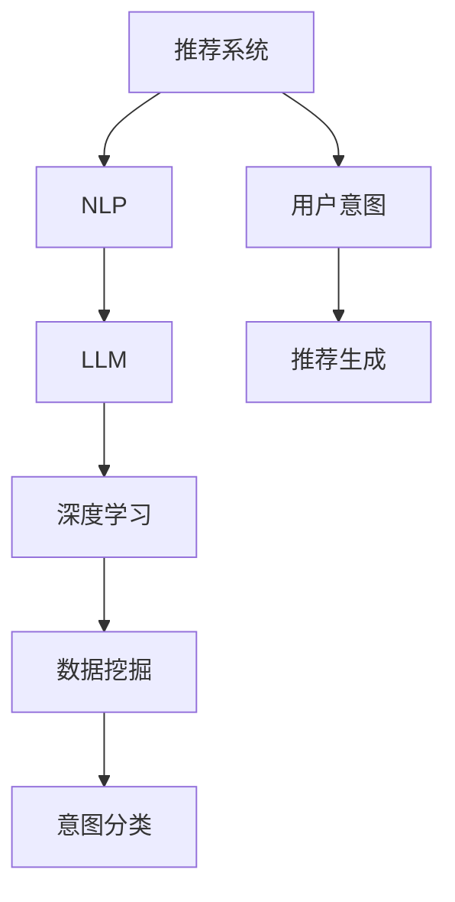

                 

# 基于LLM的推荐系统用户意图理解

> 关键词：推荐系统,用户意图理解,自然语言处理(NLP),LLM,语言模型,深度学习,数据挖掘

## 1. 背景介绍

### 1.1 问题由来

随着互联网和电子商务的迅猛发展，推荐系统已成为用户获取信息、发现商品的重要手段。推荐系统的核心目标是帮助用户快速发现并满足自己的需求，提升用户体验。然而，传统的推荐系统主要基于用户历史行为数据进行推荐，忽略了用户当前的真实意图和上下文环境。这种单一的数据驱动方式，难以精准捕捉用户多变的即时需求，降低了推荐的个性化水平。

近年来，自然语言处理(NLP)技术在推荐系统中的应用逐渐兴起，通过引入语言模型（Language Model, LM），推荐系统能够更好地理解用户的自然语言描述，从而在更丰富的语义层面上进行推荐。特别是随着大型语言模型（Large Language Model, LLM）的兴起，推荐系统可以更直接地从用户描述中获取和挖掘信息，进行更精准的推荐。

### 1.2 问题核心关键点

基于LLM的推荐系统用户意图理解，核心在于通过自然语言处理和深度学习技术，从用户提供的文本描述中，自动抽取和分析用户当前的需求和偏好，预测用户可能感兴趣的商品或内容，从而实现更个性化、多样化的推荐。

其核心步骤包括：

1. 收集用户描述数据：如用户评论、评分、关键词等。
2. 语言建模：使用预训练的LLM，将用户描述转换为向量表示，捕捉其中的语义信息。
3. 意图分类：通过分类模型对用户描述进行意图分析，识别出用户的兴趣点。
4. 推荐生成：结合用户意图和商品特征，生成推荐列表。

### 1.3 问题研究意义

基于LLM的推荐系统用户意图理解，对于提升推荐系统效果、增强用户体验具有重要意义：

1. 用户行为非结构化：用户需求往往以非结构化的文本形式呈现，传统的基于行为的推荐方式难以全面捕捉。LLM可以自动从文本中提取有价值的信息，弥补数据缺失。
2. 实时化、个性化：用户需求是动态变化的，LLM可以实时处理用户的即时描述，进行个性化推荐，提高推荐的时效性和精准度。
3. 多模态融合：结合文本、图像、音频等多模态信息，LLM能够更全面地理解用户需求，提升推荐的多样性和完备性。
4. 提高用户满意度：通过精确理解用户意图，推荐系统能够提供更符合用户预期的结果，增加用户的满意度和忠诚度。

## 2. 核心概念与联系

### 2.1 核心概念概述

为更好地理解基于LLM的推荐系统用户意图理解方法，本节将介绍几个密切相关的核心概念：

- 推荐系统(Recommender System)：根据用户的历史行为、兴趣偏好等信息，为用户推荐商品或内容的技术。
- 用户意图(User Intent)：用户在使用推荐系统时，希望通过推荐系统获得某种特定的结果或满足某种需求。
- 自然语言处理(Natural Language Processing, NLP)：使计算机能够理解和处理人类语言的技术。
- 大型语言模型(Large Language Model, LLM)：使用大规模数据预训练得到的，能够处理复杂自然语言任务的深度学习模型。
- 语言模型(Language Model)：一种用于处理和生成自然语言序列的模型，能够根据前文预测下一个单词或短语。
- 深度学习(Deep Learning)：基于神经网络进行数据表示和模型训练的方法，适用于处理大规模复杂数据集。
- 数据挖掘(Data Mining)：从数据中自动抽取和挖掘知识、模式的技术。

这些核心概念之间的逻辑关系可以通过以下Mermaid流程图来展示：



这个流程图展示了大语言模型在推荐系统中的核心作用：

1. 推荐系统从用户行为数据中提取用户兴趣，生成初步推荐。
2. 用户通过输入描述文本，表达具体需求。
3. NLP技术对用户输入进行理解和处理。
4. 使用预训练的LLM，将用户描述转换为向量表示。
5. 深度学习模型对用户描述进行特征提取和意图分类。
6. 意图分类结果结合商品特征，生成最终推荐列表。

这些概念共同构成了基于LLM的推荐系统用户意图理解的技术框架，使其能够更好地捕捉用户需求，提升推荐效果。

## 3. 核心算法原理 & 具体操作步骤
### 3.1 算法原理概述

基于LLM的推荐系统用户意图理解，本质上是一个自然语言处理和深度学习任务。其核心思想是：通过预训练的LLM，自动从用户描述中抽取和分析用户当前的需求和偏好，预测用户可能感兴趣的商品或内容，从而实现更个性化、多样化的推荐。

形式化地，假设用户输入的描述文本为 $x$，推荐系统需要预测的目标意图为 $y$，LLM的预训练参数为 $\theta$。则用户意图预测任务可以表述为：

$$
\hat{y} = \mathop{\arg\max}_{y} P(y|x; \theta)
$$

其中 $P(y|x; \theta)$ 为在预训练模型 $\theta$ 上，根据输入文本 $x$ 预测类别 $y$ 的概率。

基于LLM的推荐系统一般包括以下几个关键步骤：

1. 收集用户描述数据：如用户评论、评分、关键词等。
2. 语言建模：使用预训练的LLM，将用户描述转换为向量表示。
3. 意图分类：通过分类模型对用户描述进行意图分析，识别出用户的兴趣点。
4. 推荐生成：结合用户意图和商品特征，生成推荐列表。

### 3.2 算法步骤详解

以下是基于LLM的推荐系统用户意图理解的具体操作步骤：

**Step 1: 数据预处理**
- 收集用户输入的描述文本数据，进行分词、去除停用词等预处理。
- 将文本数据转换为模型所需的格式，如将长句切分为固定长度的子句。

**Step 2: 语言建模**
- 使用预训练的LLM（如GPT、BERT等），将用户描述转换为向量表示。
- 将文本向量输入LLM，通过前向传播计算出隐层表示。

**Step 3: 意图分类**
- 定义意图分类模型（如SVM、CNN、RNN、Transformer等），对LLM的隐层表示进行分类。
- 训练意图分类模型，使其能够准确预测用户描述中的意图。

**Step 4: 推荐生成**
- 根据用户意图，结合商品特征，生成推荐列表。
- 使用排序算法对推荐列表进行排序，推荐最符合用户需求的商品。

### 3.3 算法优缺点

基于LLM的推荐系统用户意图理解方法具有以下优点：
1. 理解自然语言：通过LLM能够自然处理用户描述，捕捉用户的即时需求。
2. 实时化：LLM能够在用户实时输入时进行意图识别，提升推荐的时效性。
3. 多模态融合：结合文本、图像、音频等多模态信息，提高推荐的综合性和完备性。
4. 个性化：基于用户意图进行推荐，提升推荐系统的个性化水平。

同时，该方法也存在一定的局限性：
1. 模型复杂度高：LLM和意图分类模型的训练需要大量的计算资源和数据。
2. 精度受限于文本质量：用户描述的语义复杂性会影响意图识别的精度。
3. 对标注数据依赖：意图分类模型需要标注数据进行训练，标注成本较高。
4. 模型解释性不足：意图分类的结果缺乏可解释性，难以理解模型的内部逻辑。

尽管存在这些局限性，但基于LLM的推荐系统用户意图理解方法仍然是目前最先进的推荐策略之一，能够显著提升推荐系统的用户满意度。

### 3.4 算法应用领域

基于LLM的推荐系统用户意图理解，已经广泛应用于以下几个领域：

- 电商推荐：如淘宝、京东等电商平台，根据用户输入的搜索关键词或评论描述，实时推荐商品。
- 内容推荐：如Netflix、YouTube等平台，根据用户输入的搜索描述或评分，推荐视频、文章等媒体内容。
- 旅游推荐：如携程、TripAdvisor等平台，根据用户输入的目的地描述，推荐旅行目的地和旅游套餐。
- 金融推荐：如支付宝、微信等金融平台，根据用户输入的理财需求，推荐理财产品。
- 医疗推荐：如HealthTap、Zocdoc等医疗平台，根据用户输入的症状描述，推荐医疗服务或药品。

## 4. 数学模型和公式 & 详细讲解
### 4.1 数学模型构建

基于LLM的推荐系统用户意图理解，涉及到自然语言处理和深度学习多个领域。其数学模型主要包括以下几个关键组成部分：

1. 预训练语言模型：使用大规模语料库预训练得到的语言模型，能够理解自然语言序列。
2. 意图分类模型：定义一个二分类或多分类模型，用于对用户描述进行意图分类。
3. 推荐模型：定义一个推荐模型，根据用户意图和商品特征生成推荐列表。

假设用户输入的描述文本为 $x$，推荐系统需要预测的目标意图为 $y$，预训练的LLM的参数为 $\theta$，意图分类模型为 $f_{intent}$，推荐模型为 $f_{recommend}$。则用户意图预测任务可以表述为：

$$
\hat{y} = f_{intent}(f_{recommend}(x; \theta))
$$

其中 $f_{intent}$ 将用户描述转换为意图表示，$f_{recommend}$ 将意图和商品特征转换为推荐表示。

### 4.2 公式推导过程

以下我们以一个简单的二分类意图识别模型为例，推导其公式及训练过程。

**公式推导**：
假设用户输入的描述文本为 $x$，预训练的LLM将 $x$ 转换为向量表示 $z$。则意图分类模型 $f_{intent}$ 可以表示为：

$$
f_{intent}(z) = \sigma(Wz + b)
$$

其中 $W$ 和 $b$ 为分类模型的权重和偏置项，$\sigma$ 为激活函数（如Sigmoid）。

假设意图有 $C$ 个类别，则意图分类的损失函数为：

$$
L = -\frac{1}{N} \sum_{i=1}^N \sum_{c=1}^C [y_{ic} \log \sigma(z_{ic}W + b_{ic}) + (1-y_{ic})\log(1-\sigma(z_{ic}W + b_{ic}))
$$

其中 $y_{ic}$ 为样本 $i$ 在类别 $c$ 上的真实标签。

通过梯度下降等优化算法，意图分类模型的参数不断更新，最小化损失函数 $L$。

**案例分析**：
以电商推荐系统为例，假设用户输入的搜索关键词为 "智能手表推荐"。使用预训练的BERT模型将其转换为向量表示 $z$，意图分类模型根据 $z$ 预测用户意图是否为 "购买"，推荐模型根据用户意图和商品特征生成推荐列表。

### 4.3 案例分析与讲解

**案例1: 电商推荐**

电商推荐系统根据用户输入的搜索关键词，实时生成推荐列表。假设用户输入的搜索关键词为 "智能手表推荐"，使用预训练的BERT模型将其转换为向量表示 $z$。意图分类模型 $f_{intent}$ 可以通过二分类模型（如SVM、CNN等）对 $z$ 进行分类，判断用户是否需要购买智能手表。

具体步骤如下：
1. 使用预训练的BERT模型将搜索关键词转换为向量表示 $z$。
2. 定义意图分类模型 $f_{intent}$，将 $z$ 输入模型，得到意图表示 $i$。
3. 将 $i$ 输入推荐模型 $f_{recommend}$，结合商品特征，生成推荐列表。

**案例2: 内容推荐**

内容推荐系统根据用户输入的搜索描述，推荐相关的视频、文章等媒体内容。假设用户输入的搜索描述为 "最新的科技新闻"，使用预训练的GPT模型将其转换为向量表示 $z$。意图分类模型 $f_{intent}$ 可以通过多分类模型（如RNN、Transformer等）对 $z$ 进行分类，判断用户的兴趣点。

具体步骤如下：
1. 使用预训练的GPT模型将搜索描述转换为向量表示 $z$。
2. 定义意图分类模型 $f_{intent}$，将 $z$ 输入模型，得到意图表示 $i$。
3. 将 $i$ 输入推荐模型 $f_{recommend}$，结合内容特征，生成推荐列表。

## 5. 项目实践：代码实例和详细解释说明
### 5.1 开发环境搭建

在进行推荐系统实践前，我们需要准备好开发环境。以下是使用Python进行PyTorch开发的环境配置流程：

1. 安装Anaconda：从官网下载并安装Anaconda，用于创建独立的Python环境。

2. 创建并激活虚拟环境：
```bash
conda create -n pytorch-env python=3.8 
conda activate pytorch-env
```

3. 安装PyTorch：根据CUDA版本，从官网获取对应的安装命令。例如：
```bash
conda install pytorch torchvision torchaudio cudatoolkit=11.1 -c pytorch -c conda-forge
```

4. 安装Transformers库：
```bash
pip install transformers
```

5. 安装各类工具包：
```bash
pip install numpy pandas scikit-learn matplotlib tqdm jupyter notebook ipython
```

完成上述步骤后，即可在`pytorch-env`环境中开始推荐系统实践。

### 5.2 源代码详细实现

下面我们以电商推荐系统为例，给出使用Transformers库对BERT模型进行意图分类的PyTorch代码实现。

首先，定义意图分类任务的数据处理函数：

```python
from transformers import BertTokenizer
from torch.utils.data import Dataset
import torch

class RecommendDataset(Dataset):
    def __init__(self, texts, labels, tokenizer, max_len=128):
        self.texts = texts
        self.labels = labels
        self.tokenizer = tokenizer
        self.max_len = max_len
        
    def __len__(self):
        return len(self.texts)
    
    def __getitem__(self, item):
        text = self.texts[item]
        label = self.labels[item]
        
        encoding = self.tokenizer(text, return_tensors='pt', max_length=self.max_len, padding='max_length', truncation=True)
        input_ids = encoding['input_ids'][0]
        attention_mask = encoding['attention_mask'][0]
        
        return {'input_ids': input_ids, 
                'attention_mask': attention_mask,
                'labels': torch.tensor(label, dtype=torch.long)}
```

然后，定义模型和优化器：

```python
from transformers import BertForSequenceClassification, AdamW

model = BertForSequenceClassification.from_pretrained('bert-base-cased', num_labels=2)

optimizer = AdamW(model.parameters(), lr=2e-5)
```

接着，定义训练和评估函数：

```python
from torch.utils.data import DataLoader
from tqdm import tqdm
from sklearn.metrics import accuracy_score, precision_recall_fscore_support

device = torch.device('cuda') if torch.cuda.is_available() else torch.device('cpu')
model.to(device)

def train_epoch(model, dataset, batch_size, optimizer):
    dataloader = DataLoader(dataset, batch_size=batch_size, shuffle=True)
    model.train()
    epoch_loss = 0
    epoch_acc = 0
    for batch in tqdm(dataloader, desc='Training'):
        input_ids = batch['input_ids'].to(device)
        attention_mask = batch['attention_mask'].to(device)
        labels = batch['labels'].to(device)
        model.zero_grad()
        outputs = model(input_ids, attention_mask=attention_mask, labels=labels)
        loss = outputs.loss
        epoch_loss += loss.item()
        accuracy = outputs.logits.argmax(dim=1).eq(labels).float().mean()
        epoch_acc += accuracy.item()
        loss.backward()
        optimizer.step()
    return epoch_loss / len(dataloader), epoch_acc / len(dataloader)

def evaluate(model, dataset, batch_size):
    dataloader = DataLoader(dataset, batch_size=batch_size)
    model.eval()
    preds, labels = [], []
    with torch.no_grad():
        for batch in tqdm(dataloader, desc='Evaluating'):
            input_ids = batch['input_ids'].to(device)
            attention_mask = batch['attention_mask'].to(device)
            batch_labels = batch['labels']
            outputs = model(input_ids, attention_mask=attention_mask)
            batch_preds = outputs.logits.argmax(dim=1).to('cpu').tolist()
            batch_labels = batch_labels.to('cpu').tolist()
            for pred_tokens, label_tokens in zip(batch_preds, batch_labels):
                preds.append(pred_tokens)
                labels.append(label_tokens)
                
    print('Accuracy:', accuracy_score(labels, preds))
    print('Precision, Recall, F-score:', precision_recall_fscore_support(labels, preds, average='micro'))

```

最后，启动训练流程并在测试集上评估：

```python
epochs = 5
batch_size = 16

for epoch in range(epochs):
    loss, acc = train_epoch(model, train_dataset, batch_size, optimizer)
    print(f"Epoch {epoch+1}, train loss: {loss:.3f}, train acc: {acc:.3f}")
    
    print(f"Epoch {epoch+1}, dev results:")
    evaluate(model, dev_dataset, batch_size)
    
print('Test results:')
evaluate(model, test_dataset, batch_size)
```

以上就是使用PyTorch对BERT进行意图分类的完整代码实现。可以看到，得益于Transformers库的强大封装，我们可以用相对简洁的代码完成BERT模型的加载和意图分类。

### 5.3 代码解读与分析

让我们再详细解读一下关键代码的实现细节：

**RecommendDataset类**：
- `__init__`方法：初始化文本、标签、分词器等关键组件。
- `__len__`方法：返回数据集的样本数量。
- `__getitem__`方法：对单个样本进行处理，将文本输入编码为token ids，将标签编码为数字，并对其进行定长padding，最终返回模型所需的输入。

**模型和优化器**：
- 使用预训练的BERT模型作为意图分类器，并通过AdamW优化器进行优化。

**训练和评估函数**：
- 使用PyTorch的DataLoader对数据集进行批次化加载，供模型训练和推理使用。
- 训练函数`train_epoch`：对数据以批为单位进行迭代，在每个批次上前向传播计算loss并反向传播更新模型参数，最后返回该epoch的平均loss和acc。
- 评估函数`evaluate`：与训练类似，不同点在于不更新模型参数，并在每个batch结束后将预测和标签结果存储下来，最后使用sklearn的accuracy_score和precision_recall_fscore_support计算分类指标。

**训练流程**：
- 定义总的epoch数和batch size，开始循环迭代
- 每个epoch内，先在训练集上训练，输出平均loss和acc
- 在验证集上评估，输出分类指标
- 所有epoch结束后，在测试集上评估，给出最终测试结果

可以看到，PyTorch配合Transformers库使得BERT模型的意图分类实现变得简洁高效。开发者可以将更多精力放在数据处理、模型改进等高层逻辑上，而不必过多关注底层的实现细节。

当然，工业级的系统实现还需考虑更多因素，如模型的保存和部署、超参数的自动搜索、更灵活的任务适配层等。但核心的意图分类范式基本与此类似。

## 6. 实际应用场景
### 6.1 电商推荐

电商推荐系统可以根据用户输入的搜索关键词，实时生成推荐列表。例如，当用户输入 "智能手表推荐" 时，电商推荐系统可以基于预训练的BERT模型，对用户输入进行向量表示，通过意图分类模型判断用户是否需要购买智能手表。

具体而言，电商推荐系统可以使用以下步骤：

1. 收集用户搜索关键词，如 "智能手表推荐"。
2. 使用预训练的BERT模型将搜索关键词转换为向量表示 $z$。
3. 定义意图分类模型，将 $z$ 输入模型，得到意图表示 $i$。
4. 将 $i$ 输入推荐模型，结合商品特征，生成推荐列表。

**实际案例**：
某电商平台收集用户搜索关键词，并使用预训练的BERT模型进行意图分类。当用户搜索 "智能手表推荐" 时，电商平台通过BERT模型将其转换为向量表示 $z$，再通过意图分类模型判断用户是否需要购买智能手表。如果用户意图为购买，则推荐相关智能手表产品。

### 6.2 内容推荐

内容推荐系统可以根据用户输入的搜索描述，推荐相关的视频、文章等媒体内容。例如，当用户输入 "最新的科技新闻" 时，内容推荐系统可以基于预训练的GPT模型，对用户输入进行向量表示，通过意图分类模型判断用户的兴趣点。

具体而言，内容推荐系统可以使用以下步骤：

1. 收集用户搜索描述，如 "最新的科技新闻"。
2. 使用预训练的GPT模型将搜索描述转换为向量表示 $z$。
3. 定义意图分类模型，将 $z$ 输入模型，得到意图表示 $i$。
4. 将 $i$ 输入推荐模型，结合内容特征，生成推荐列表。

**实际案例**：
某内容推荐平台收集用户搜索描述，并使用预训练的GPT模型进行意图分类。当用户搜索 "最新的科技新闻" 时，内容推荐平台通过GPT模型将其转换为向量表示 $z$，再通过意图分类模型判断用户对科技新闻的兴趣。如果用户对科技新闻感兴趣，则推荐相关的科技新闻视频或文章。

### 6.3 旅游推荐

旅游推荐系统可以根据用户输入的目的地描述，推荐旅行目的地和旅游套餐。例如，当用户输入 "去日本旅游" 时，旅游推荐系统可以基于预训练的BERT模型，对用户输入进行向量表示，通过意图分类模型判断用户的目的地偏好。

具体而言，旅游推荐系统可以使用以下步骤：

1. 收集用户目的地描述，如 "去日本旅游"。
2. 使用预训练的BERT模型将目的地描述转换为向量表示 $z$。
3. 定义意图分类模型，将 $z$ 输入模型，得到意图表示 $i$。
4. 将 $i$ 输入推荐模型，结合目的地和旅游套餐特征，生成推荐列表。

**实际案例**：
某旅游推荐平台收集用户目的地描述，并使用预训练的BERT模型进行意图分类。当用户搜索 "去日本旅游" 时，旅游推荐平台通过BERT模型将其转换为向量表示 $z$，再通过意图分类模型判断用户对日本旅游的偏好。如果用户对日本旅游感兴趣，则推荐相关的日本旅游目的地和旅游套餐。

### 6.4 金融推荐

金融推荐系统可以根据用户输入的理财需求，推荐理财产品。例如，当用户输入 "如何进行投资" 时，金融推荐系统可以基于预训练的BERT模型，对用户输入进行向量表示，通过意图分类模型判断用户的理财需求。

具体而言，金融推荐系统可以使用以下步骤：

1. 收集用户理财需求描述，如 "如何进行投资"。
2. 使用预训练的BERT模型将理财需求描述转换为向量表示 $z$。
3. 定义意图分类模型，将 $z$ 输入模型，得到意图表示 $i$。
4. 将 $i$ 输入推荐模型，结合理财产品特征，生成推荐列表。

**实际案例**：
某金融推荐平台收集用户理财需求描述，并使用预训练的BERT模型进行意图分类。当用户搜索 "如何进行投资" 时，金融推荐平台通过BERT模型将其转换为向量表示 $z$，再通过意图分类模型判断用户的理财需求。如果用户对投资理财感兴趣，则推荐相关的理财产品。

## 7. 工具和资源推荐
### 7.1 学习资源推荐

为了帮助开发者系统掌握基于LLM的推荐系统用户意图理解的理论基础和实践技巧，这里推荐一些优质的学习资源：

1. 《自然语言处理与深度学习》（Deep Learning for Natural Language Processing）：由斯坦福大学机器学习教授Christopher Manning所著，深入浅出地介绍了NLP和深度学习的基础知识，涵盖了大量经典模型和算法。
2. 《深度学习与NLP》（Deep Learning and Natural Language Processing）：由台湾大学林智仁教授和何志豪教授合著，系统介绍了NLP领域的主要技术，包括语言模型、意图分类、情感分析等。
3. 《自然语言处理入门》（Natural Language Processing in Action）：由Google NLP团队的成员撰写，提供了大量实战代码和案例，适合初学者入门。
4. 《PyTorch深度学习》（Deep Learning with PyTorch）：由Stanford大学李沐教授合著，详细介绍了PyTorch框架的使用方法和技巧，涵盖了NLP、计算机视觉、自然语言生成等多个领域。
5. 《Transformers权威指南》（The Transformers Cookbook）：由Hugging Face的开发者撰写，介绍了多种预训练语言模型的使用方法，涵盖了NLP任务的具体实现。

通过对这些资源的学习实践，相信你一定能够快速掌握基于LLM的推荐系统用户意图理解的技术精髓，并用于解决实际的NLP问题。
###  7.2 开发工具推荐

高效的开发离不开优秀的工具支持。以下是几款用于基于LLM的推荐系统用户意图理解开发的常用工具：

1. PyTorch：基于Python的开源深度学习框架，灵活动态的计算图，适合快速迭代研究。大部分预训练语言模型都有PyTorch版本的实现。
2. TensorFlow：由Google主导开发的开源深度学习框架，生产部署方便，适合大规模工程应用。同样有丰富的预训练语言模型资源。
3. Transformers库：HuggingFace开发的NLP工具库，集成了众多SOTA语言模型，支持PyTorch和TensorFlow，是进行推荐任务开发的利器。
4. Weights & Biases：模型训练的实验跟踪工具，可以记录和可视化模型训练过程中的各项指标，方便对比和调优。与主流深度学习框架无缝集成。
5. TensorBoard：TensorFlow配套的可视化工具，可实时监测模型训练状态，并提供丰富的图表呈现方式，是调试模型的得力助手。
6. Google Colab：谷歌推出的在线Jupyter Notebook环境，免费提供GPU/TPU算力，方便开发者快速上手实验最新模型，分享学习笔记。

合理利用这些工具，可以显著提升基于LLM的推荐系统用户意图理解任务的开发效率，加快创新迭代的步伐。

### 7.3 相关论文推荐

基于LLM的推荐系统用户意图理解的发展源于学界的持续研究。以下是几篇奠基性的相关论文，推荐阅读：

1. Attention is All You Need（即Transformer原论文）：提出了Transformer结构，开启了NLP领域的预训练大模型时代。
2. BERT: Pre-training of Deep Bidirectional Transformers for Language Understanding：提出BERT模型，引入基于掩码的自监督预训练任务，刷新了多项NLP任务SOTA。
3. Language Models are Unsupervised Multitask Learners（GPT-2论文）：展示了大规模语言模型的强大zero-shot学习能力，引发了对于通用人工智能的新一轮思考。
4. Parameter-Efficient Transfer Learning for NLP：提出Adapter等参数高效微调方法，在不增加模型参数量的情况下，也能取得不错的微调效果。
5. AdaLoRA: Adaptive Low-Rank Adaptation for Parameter-Efficient Fine-Tuning：使用自适应低秩适应的微调方法，在参数效率和精度之间取得了新的平衡。
6. Adaptation Layer for Sequential Learning：提出Adaptation Layer等参数高效微调方法，用于改进推荐系统和其他需要微调的任务。

这些论文代表了大语言模型微调技术的发展脉络。通过学习这些前沿成果，可以帮助研究者把握学科前进方向，激发更多的创新灵感。

## 8. 总结：未来发展趋势与挑战
### 8.1 总结

本文对基于LLM的推荐系统用户意图理解方法进行了全面系统的介绍。首先阐述了推荐系统、用户意图、自然语言处理、大型语言模型等核心概念及其之间的关系。其次，从原理到实践，详细讲解了基于LLM的推荐系统用户意图理解过程，包括数据预处理、语言建模、意图分类、推荐生成等关键步骤。最后，通过多个实际案例，展示了基于LLM的推荐系统在电商、内容、旅游、金融等多个领域的潜在应用。

通过本文的系统梳理，可以看到，基于LLM的推荐系统用户意图理解方法已经在多个领域取得了初步成功，展示了其在提升推荐系统个性化和多样化方面的巨大潜力。未来，随着大语言模型和深度学习技术的进一步发展，基于LLM的推荐系统将变得更加智能化、多样化，为推荐系统的应用范围带来新的突破。

### 8.2 未来发展趋势

展望未来，基于LLM的推荐系统用户意图理解将呈现以下几个发展趋势：

1. 模型规模持续增大。随着算力成本的下降和数据规模的扩张，预训练语言模型的参数量还将持续增长。超大规模语言模型蕴含的丰富语言知识，有望支撑更加复杂多变的下游任务微调。
2. 意图分类的多模态融合。结合文本、图像、音频等多模态信息，LLM能够更全面地理解用户需求，提升意图分类的准确性。
3. 实时化和个性化。LLM能够在用户实时输入时进行意图识别，提升推荐的时效性和个性化水平。
4. 参数高效微调。开发更加参数高效的微调方法，在固定大部分预训练参数的同时，只更新极少量的任务相关参数。
5. 领域特定微调。针对特定领域的任务，在预训练模型上进行微调，提升意图分类的精度和泛化能力。
6. 模型可解释性。通过引入可解释性技术，赋予LLM模型更强的解释能力，增强其决策的透明性和可信度。

以上趋势凸显了基于LLM的推荐系统用户意图理解技术的广阔前景。这些方向的探索发展，必将进一步提升推荐系统的性能和应用范围，为推荐系统的应用场景带来新的突破。

### 8.3 面临的挑战

尽管基于LLM的推荐系统用户意图理解已经取得了显著进展，但在迈向更加智能化、普适化应用的过程中，它仍面临着诸多挑战：

1. 数据依赖性强。用户输入的文本数据质量对意图分类的精度有直接影响，如何处理语义复杂度较高的输入数据，是一个亟待解决的问题。
2. 计算资源消耗大。预训练和微调LLM模型需要大量计算资源和数据，如何在资源有限的情况下提高模型的精度和效率，仍需进一步研究。
3. 模型泛化性不足。现有的LLM模型在特定领域或任务上，泛化能力较弱，难以应对复杂多变的实际应用场景。
4. 意图分类的准确性。意图分类模型对标注数据有较强依赖，标注成本较高。同时，模型的鲁棒性和稳定性也需进一步提升。
5. 模型可解释性不足。意图分类的结果缺乏可解释性，难以理解模型的内部工作机制。

尽管存在这些挑战，但基于LLM的推荐系统用户意图理解方法仍是最先进的技术之一，能够显著提升推荐系统的个性化水平。

### 8.4 研究展望

面对基于LLM的推荐系统用户意图理解所面临的种种挑战，未来的研究需要在以下几个方面寻求新的突破：

1. 探索无监督和半监督微调方法。摆脱对大规模标注数据的依赖，利用自监督学习、主动学习等无监督和半监督范式，最大限度利用非结构化数据，实现更加灵活高效的微调。
2. 研究参数高效和计算高效的微调范式。开发更加参数高效的微调方法，在固定大部分预训练参数的同时，只更新极少量的任务相关参数。同时优化微调模型的计算图，减少前向传播和反向传播的资源消耗，实现更加轻量级、实时性的部署。
3. 引入更多先验知识。将符号化的先验知识，如知识图谱、逻辑规则等，与神经网络模型进行巧妙融合，引导微调过程学习更准确、合理的语言模型。同时加强不同模态数据的整合，实现视觉、语音等多模态信息与文本信息的协同建模。
4. 纳入伦理道德约束。在模型训练目标中引入伦理导向的评估指标，过滤和惩罚有偏见、有害的输出倾向。同时加强人工干预和审核，建立模型行为的监管机制，确保输出符合人类价值观和伦理道德。

这些研究方向的探索，必将引领基于LLM的推荐系统用户意图理解技术迈向更高的台阶，为构建安全、可靠、可解释、可控的智能系统铺平道路。面向未来，基于LLM的推荐系统用户意图理解技术还需要与其他人工智能技术进行更深入的融合，如知识表示、因果推理、强化学习等，多路径协同发力，共同推动自然语言理解和智能交互系统的进步。只有勇于创新、敢于突破，才能不断拓展语言模型的边界，让智能技术更好地造福人类社会。

## 9. 附录：常见问题与解答

**Q1：基于LLM的推荐系统是否适用于所有NLP任务？**

A: 基于LLM的推荐系统在大多数NLP任务上都能取得不错的效果，特别是对于数据量较小的任务。但对于一些特定领域的任务，如医学、法律等，仅仅依靠通用语料预训练的模型可能难以很好地适应。此时需要在特定领域语料上进一步预训练，再进行微调，才能获得理想效果。

**Q2：如何选择合适的学习率？**

A: 学习率的选择对基于LLM的推荐系统用户意图理解的效果有很大影响。一般建议从较小的学习率开始调参，逐步减小学习率，直至收敛。使用warmup策略，在开始阶段使用较小的学习率，再逐渐过渡到预设值，可以加速模型的收敛速度。

**Q3：数据预处理中需要考虑哪些因素？**

A: 数据预处理是推荐系统用户意图理解的重要环节。需要考虑以下几个因素：
1. 分词：将用户输入的文本切分为词语，方便模型处理。
2. 去除停用词：去除对意图识别无用的常见词语，减少噪音。
3. 转换为固定长度的子句：将长句切分为固定长度的子句，方便模型处理。
4. 定长padding：将每个子句的长度对齐，方便模型输入。

**Q4：意图分类模型有哪些常见类型？**

A: 意图分类模型主要包括以下几种：
1. 二分类模型：如SVM、CNN等，用于二分类任务。
2. 多分类模型：如RNN、Transformer等，用于多分类任务。
3. 序列模型：如RNN、LSTM等，用于序列数据。
4. 基于注意力机制的模型：如Transformer等，能够更好地捕捉文本中的长距离依赖。

**Q5：如何提升意图分类的鲁棒性和稳定性？**

A: 提升意图分类的鲁棒性和稳定性，可以采取以下策略：
1. 数据增强：通过回译、近义替换等方式扩充训练集，提高模型的泛化能力。
2. 正则化：使用L2正则、Dropout、Early Stopping等，防止模型过度适应小规模训练集。
3. 对抗训练：加入对抗样本，提高模型鲁棒性。
4. 多模型集成：训练多个意图分类模型，取平均输出，抑制过拟合。

这些策略往往需要根据具体任务和数据特点进行灵活组合。只有在数据、模型、训练、推理等各环节进行全面优化，才能最大限度地发挥大语言模型在推荐系统用户意图理解中的应用价值。

---

作者：禅与计算机程序设计艺术 / Zen and the Art of Computer Programming

