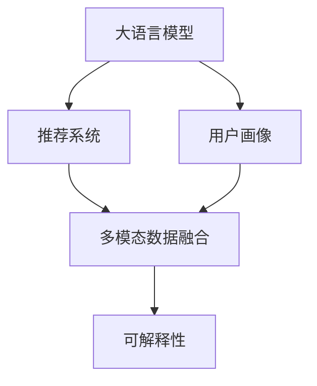

                 

# 基于LLM的推荐系统用户画像精细化

## 1. 背景介绍

### 1.1 问题由来
推荐系统是现代互联网应用的核心之一，通过个性化推荐，提升用户体验，增加用户粘性，驱动业务增长。传统的推荐系统基于用户的显式反馈进行训练，例如评分、点击等。然而，这些反馈数据往往稀疏且难以获得，限制了系统的性能。

近年来，基于深度学习的推荐系统技术取得了显著进展。其中，基于大语言模型(LLM)的推荐系统是一种新兴的方法，通过利用LLM的强大语言理解能力，细粒度刻画用户画像，实现个性化推荐。

### 1.2 问题核心关键点
1. **用户画像精细化**：传统推荐系统只关注用户的显式反馈，难以捕捉到用户的深层兴趣和潜在需求。LLM通过分析用户的文本数据（如评论、评论、聊天记录等），可以更全面地了解用户的行为和偏好，从而进行更准确的个性化推荐。
2. **多模态数据融合**：推荐系统不仅要考虑用户的历史行为数据，还需结合文本、图像、音频等多模态数据，提升推荐的丰富度和准确性。
3. **可解释性与可控性**：LLM生成的推荐结果往往难以解释，如何通过LLM的输出来指导推荐决策，保证推荐结果的可控性，是一个重要的研究方向。

### 1.3 问题研究意义
基于LLM的推荐系统能够实现对用户兴趣的深度理解和精确刻画，提升推荐系统的个性化和多样性，帮助用户发现更多感兴趣的内容，提升用户满意度。同时，LLM的强大学习能力，使得推荐系统能够适应不断变化的业务需求和用户兴趣。因此，深入研究LLM在推荐系统中的应用，具有重要的理论和实践意义。

## 2. 核心概念与联系

### 2.1 核心概念概述

为更好地理解基于LLM的推荐系统，本节将介绍几个密切相关的核心概念：

- **大语言模型(LLM)**：以自回归(如GPT)或自编码(如BERT)模型为代表的大规模预训练语言模型。通过在大规模无标签文本语料上进行预训练，学习通用的语言表示，具备强大的语言理解和生成能力。
- **推荐系统(Recommendation System)**：通过分析用户行为数据，为用户提供个性化推荐内容的系统。推荐的粒度可以是产品、内容、服务等。
- **用户画像(User Profiling)**：通过对用户的历史行为、偏好、兴趣等信息进行分析，构建用户的多维度特征表示，从而实现个性化推荐。
- **多模态数据融合(Multimodal Data Fusion)**：结合文本、图像、音频等多种数据源，提升推荐系统的准确性和全面性。
- **可解释性(Explainability)**：推荐系统输出的可解释性，有助于用户理解推荐结果的依据，提升系统的信任度和满意度。

这些核心概念之间的逻辑关系可以通过以下Mermaid流程图来展示：



这个流程图展示了大语言模型在推荐系统中的应用链条：通过用户画像刻画用户特征，结合多模态数据融合，利用LLM进行推荐，并通过可解释性提升系统的信任度和可控性。

## 3. 核心算法原理 & 具体操作步骤
### 3.1 算法原理概述

基于LLM的推荐系统，本质上是一个通过文本数据驱动的个性化推荐范式。其核心思想是：通过分析用户的文本数据，构建用户画像，并结合多模态数据，利用LLM进行推荐。

具体来说，推荐过程分为两个步骤：

1. **用户画像构建**：对用户的文本数据（如评论、聊天记录等）进行分析，提取用户的兴趣偏好和行为模式，生成用户的多维度特征表示。
2. **推荐内容生成**：将用户画像输入LLM，通过预训练权重和微调权重，生成个性化推荐内容。

### 3.2 算法步骤详解

基于LLM的推荐系统主要包括以下几个关键步骤：

**Step 1: 数据准备**
- 收集用户的文本数据（如评论、聊天记录等），并进行预处理（去噪、分词、归一化等）。
- 收集多模态数据（如图像、音频等），并进行预处理。

**Step 2: 用户画像构建**
- 对用户的文本数据进行分析，提取关键特征（如情感倾向、主题偏好、兴趣标签等）。
- 结合多模态数据，构建用户的多维度特征表示。

**Step 3: 预训练和微调**
- 选择适合的预训练模型（如BERT、GPT等），并将其作为初始化参数。
- 在微调数据集上，使用监督学习优化模型参数，使得LLM能够生成高质量的推荐内容。

**Step 4: 推荐内容生成**
- 将用户画像输入LLM，生成个性化推荐内容。
- 结合多模态数据，进一步优化推荐结果。

**Step 5: 可解释性分析**
- 分析LLM的输出生成过程，提取关键特征。
- 将推荐结果与用户画像进行对比，解释推荐依据。

### 3.3 算法优缺点

基于LLM的推荐系统具有以下优点：
1. **深度特征提取**：LLM能够从文本数据中提取深层次的用户特征，相比传统的基于显式反馈的推荐系统，更具灵活性和多样性。
2. **多模态数据融合**：通过结合多模态数据，提升推荐系统的全面性和准确性。
3. **可解释性**：LLM的输出生成过程可解释，有助于提升用户对推荐结果的信任度和满意度。

同时，该方法也存在一定的局限性：
1. **数据依赖性**：推荐系统的效果很大程度上取决于数据的质量和数量，获取高质量文本数据的成本较高。
2. **可解释性不足**：LLM的输出生成过程复杂，难以完全解释推荐依据，可能导致用户对推荐结果的信任度下降。
3. **计算资源需求高**：LLM模型参数量大，计算资源需求高，可能面临性能瓶颈。

尽管存在这些局限性，但基于LLM的推荐系统在推荐系统的深度特征提取和多模态数据融合方面具有显著优势，为推荐系统的发展提供了新的方向。

### 3.4 算法应用领域

基于LLM的推荐系统在以下几个领域具有广泛的应用前景：

- **电商推荐**：通过分析用户的购物记录、评论等文本数据，生成个性化商品推荐。
- **内容推荐**：分析用户的阅读、观看记录，生成个性化文章、视频、音乐等内容的推荐。
- **广告推荐**：结合用户的浏览记录和搜索关键词，生成个性化的广告推荐。
- **社交推荐**：分析用户的聊天记录、朋友圈内容，生成个性化社交关系推荐。
- **医疗推荐**：分析患者的病历记录、医学文献，生成个性化的医疗推荐。

这些领域的应用展示了LLM在推荐系统中的广泛适用性，为推荐系统的发展提供了新的动力。

## 4. 数学模型和公式 & 详细讲解  
### 4.1 数学模型构建

本节将使用数学语言对基于LLM的推荐系统进行更加严格的刻画。

记用户画像为 $P$，推荐内容为 $C$，文本数据为 $T$，多模态数据为 $M$。假设LLM为 $M_{\theta}$，其中 $\theta$ 为模型参数。

推荐系统的优化目标是最小化用户画像与推荐内容之间的误差，即：

$$
\min_{\theta} \mathcal{L}(M_{\theta}, P, C)
$$

其中 $\mathcal{L}$ 为损失函数，用于衡量推荐结果与用户真实需求的差异。常见的损失函数包括交叉熵损失、均方误差损失等。

### 4.2 公式推导过程

以下我们以二分类推荐任务为例，推导交叉熵损失函数及其梯度的计算公式。

假设用户画像 $P$ 和推荐内容 $C$ 分别表示为二元向量，推荐系统预测用户是否会对 $C$ 感兴趣，输出为 $\hat{y}=M_{\theta}(P)$。真实标签 $y \in \{0,1\}$。则二分类交叉熵损失函数定义为：

$$
\ell(M_{\theta}(P),y) = -[y\log \hat{y} + (1-y)\log (1-\hat{y})]
$$

将其代入经验风险公式，得：

$$
\mathcal{L}(\theta) = -\frac{1}{N}\sum_{i=1}^N [y_i\log M_{\theta}(P_i)+(1-y_i)\log(1-M_{\theta}(P_i))]
$$

根据链式法则，损失函数对参数 $\theta$ 的梯度为：

$$
\frac{\partial \mathcal{L}(\theta)}{\partial \theta} = -\frac{1}{N}\sum_{i=1}^N (\frac{y_i}{M_{\theta}(P_i)}-\frac{1-y_i}{1-M_{\theta}(P_i)}) \frac{\partial M_{\theta}(P_i)}{\partial \theta}
$$

其中 $\frac{\partial M_{\theta}(P_i)}{\partial \theta}$ 可进一步递归展开，利用自动微分技术完成计算。

在得到损失函数的梯度后，即可带入参数更新公式，完成模型的迭代优化。重复上述过程直至收敛，最终得到适应用户画像的最优模型参数 $\theta^*$。

## 5. 项目实践：代码实例和详细解释说明
### 5.1 开发环境搭建

在进行推荐系统开发前，我们需要准备好开发环境。以下是使用Python进行PyTorch开发的环境配置流程：

1. 安装Anaconda：从官网下载并安装Anaconda，用于创建独立的Python环境。

2. 创建并激活虚拟环境：
```bash
conda create -n recommendation-env python=3.8 
conda activate recommendation-env
```

3. 安装PyTorch：根据CUDA版本，从官网获取对应的安装命令。例如：
```bash
conda install pytorch torchvision torchaudio cudatoolkit=11.1 -c pytorch -c conda-forge
```

4. 安装Transformers库：
```bash
pip install transformers
```

5. 安装各类工具包：
```bash
pip install numpy pandas scikit-learn matplotlib tqdm jupyter notebook ipython
```

完成上述步骤后，即可在`recommendation-env`环境中开始推荐系统开发。

### 5.2 源代码详细实现

这里我们以电商推荐为例，给出使用Transformers库对BERT模型进行推荐系统开发的PyTorch代码实现。

首先，定义推荐任务的数据处理函数：

```python
from transformers import BertTokenizer
from torch.utils.data import Dataset
import torch

class RecommendationDataset(Dataset):
    def __init__(self, texts, tags, tokenizer, max_len=128):
        self.texts = texts
        self.tags = tags
        self.tokenizer = tokenizer
        self.max_len = max_len
        
    def __len__(self):
        return len(self.texts)
    
    def __getitem__(self, item):
        text = self.texts[item]
        tags = self.tags[item]
        
        encoding = self.tokenizer(text, return_tensors='pt', max_length=self.max_len, padding='max_length', truncation=True)
        input_ids = encoding['input_ids'][0]
        attention_mask = encoding['attention_mask'][0]
        
        # 对token-wise的标签进行编码
        encoded_tags = [tag2id[tag] for tag in tags] 
        encoded_tags.extend([tag2id['O']] * (self.max_len - len(encoded_tags)))
        labels = torch.tensor(encoded_tags, dtype=torch.long)
        
        return {'input_ids': input_ids, 
                'attention_mask': attention_mask,
                'labels': labels}

# 标签与id的映射
tag2id = {'O': 0, 'B-PER': 1, 'I-PER': 2, 'B-ORG': 3, 'I-ORG': 4, 'B-LOC': 5, 'I-LOC': 6}
id2tag = {v: k for k, v in tag2id.items()}

# 创建dataset
tokenizer = BertTokenizer.from_pretrained('bert-base-cased')

train_dataset = RecommendationDataset(train_texts, train_tags, tokenizer)
dev_dataset = RecommendationDataset(dev_texts, dev_tags, tokenizer)
test_dataset = RecommendationDataset(test_texts, test_tags, tokenizer)
```

然后，定义模型和优化器：

```python
from transformers import BertForTokenClassification, AdamW

model = BertForTokenClassification.from_pretrained('bert-base-cased', num_labels=len(tag2id))

optimizer = AdamW(model.parameters(), lr=2e-5)
```

接着，定义训练和评估函数：

```python
from torch.utils.data import DataLoader
from tqdm import tqdm
from sklearn.metrics import classification_report

device = torch.device('cuda') if torch.cuda.is_available() else torch.device('cpu')
model.to(device)

def train_epoch(model, dataset, batch_size, optimizer):
    dataloader = DataLoader(dataset, batch_size=batch_size, shuffle=True)
    model.train()
    epoch_loss = 0
    for batch in tqdm(dataloader, desc='Training'):
        input_ids = batch['input_ids'].to(device)
        attention_mask = batch['attention_mask'].to(device)
        labels = batch['labels'].to(device)
        model.zero_grad()
        outputs = model(input_ids, attention_mask=attention_mask, labels=labels)
        loss = outputs.loss
        epoch_loss += loss.item()
        loss.backward()
        optimizer.step()
    return epoch_loss / len(dataloader)

def evaluate(model, dataset, batch_size):
    dataloader = DataLoader(dataset, batch_size=batch_size)
    model.eval()
    preds, labels = [], []
    with torch.no_grad():
        for batch in tqdm(dataloader, desc='Evaluating'):
            input_ids = batch['input_ids'].to(device)
            attention_mask = batch['attention_mask'].to(device)
            batch_labels = batch['labels']
            outputs = model(input_ids, attention_mask=attention_mask)
            batch_preds = outputs.logits.argmax(dim=2).to('cpu').tolist()
            batch_labels = batch_labels.to('cpu').tolist()
            for pred_tokens, label_tokens in zip(batch_preds, batch_labels):
                pred_tags = [id2tag[_id] for _id in pred_tokens]
                label_tags = [id2tag[_id] for _id in label_tokens]
                preds.append(pred_tags[:len(label_tokens)])
                labels.append(label_tags)
                
    print(classification_report(labels, preds))
```

最后，启动训练流程并在测试集上评估：

```python
epochs = 5
batch_size = 16

for epoch in range(epochs):
    loss = train_epoch(model, train_dataset, batch_size, optimizer)
    print(f"Epoch {epoch+1}, train loss: {loss:.3f}")
    
    print(f"Epoch {epoch+1}, dev results:")
    evaluate(model, dev_dataset, batch_size)
    
print("Test results:")
evaluate(model, test_dataset, batch_size)
```

以上就是使用PyTorch对BERT进行推荐系统开发的完整代码实现。可以看到，得益于Transformers库的强大封装，我们可以用相对简洁的代码完成BERT模型的加载和推荐系统开发。

### 5.3 代码解读与分析

让我们再详细解读一下关键代码的实现细节：

**RecommendationDataset类**：
- `__init__`方法：初始化文本、标签、分词器等关键组件。
- `__len__`方法：返回数据集的样本数量。
- `__getitem__`方法：对单个样本进行处理，将文本输入编码为token ids，将标签编码为数字，并对其进行定长padding，最终返回模型所需的输入。

**tag2id和id2tag字典**：
- 定义了标签与数字id之间的映射关系，用于将token-wise的预测结果解码回真实的标签。

**训练和评估函数**：
- 使用PyTorch的DataLoader对数据集进行批次化加载，供模型训练和推理使用。
- 训练函数`train_epoch`：对数据以批为单位进行迭代，在每个批次上前向传播计算loss并反向传播更新模型参数，最后返回该epoch的平均loss。
- 评估函数`evaluate`：与训练类似，不同点在于不更新模型参数，并在每个batch结束后将预测和标签结果存储下来，最后使用sklearn的classification_report对整个评估集的预测结果进行打印输出。

**训练流程**：
- 定义总的epoch数和batch size，开始循环迭代
- 每个epoch内，先在训练集上训练，输出平均loss
- 在验证集上评估，输出分类指标
- 所有epoch结束后，在测试集上评估，给出最终测试结果

可以看到，PyTorch配合Transformers库使得BERT推荐系统的代码实现变得简洁高效。开发者可以将更多精力放在数据处理、模型改进等高层逻辑上，而不必过多关注底层的实现细节。

当然，工业级的系统实现还需考虑更多因素，如模型的保存和部署、超参数的自动搜索、更灵活的任务适配层等。但核心的推荐范式基本与此类似。

## 6. 实际应用场景
### 6.1 电商推荐

基于LLM的电商推荐系统，可以通过分析用户的购物记录、评论等文本数据，生成个性化商品推荐。例如，对于用户的购物记录，可以从商品名称、描述、用户评论等文本中提取关键特征，并输入LLM进行推荐。

### 6.2 内容推荐

内容推荐系统可以分析用户的阅读、观看记录，生成个性化文章、视频、音乐等内容的推荐。例如，对于用户的阅读记录，可以从文章标题、摘要、用户评论等文本中提取关键特征，并输入LLM进行推荐。

### 6.3 广告推荐

广告推荐系统结合用户的浏览记录和搜索关键词，生成个性化的广告推荐。例如，对于用户的浏览记录，可以从网页标题、描述、广告内容等文本中提取关键特征，并输入LLM进行推荐。

### 6.4 社交推荐

社交推荐系统分析用户的聊天记录、朋友圈内容，生成个性化社交关系推荐。例如，对于用户的聊天记录，可以从对话内容、表情、语音等文本中提取关键特征，并输入LLM进行推荐。

### 6.5 医疗推荐

医疗推荐系统分析患者的病历记录、医学文献，生成个性化的医疗推荐。例如，对于患者的病历记录，可以从病情描述、治疗方案、患者反馈等文本中提取关键特征，并输入LLM进行推荐。

这些应用展示了LLM在推荐系统中的广泛适用性，为推荐系统的发展提供了新的动力。

## 7. 工具和资源推荐
### 7.1 学习资源推荐

为了帮助开发者系统掌握LLM在推荐系统中的应用，这里推荐一些优质的学习资源：

1. 《Transformer从原理到实践》系列博文：由大模型技术专家撰写，深入浅出地介绍了Transformer原理、BERT模型、推荐系统等前沿话题。

2. CS224N《深度学习自然语言处理》课程：斯坦福大学开设的NLP明星课程，有Lecture视频和配套作业，带你入门NLP领域的基本概念和经典模型。

3. 《Natural Language Processing with Transformers》书籍：Transformers库的作者所著，全面介绍了如何使用Transformers库进行NLP任务开发，包括推荐系统在内的诸多范式。

4. HuggingFace官方文档：Transformers库的官方文档，提供了海量预训练模型和完整的推荐系统样例代码，是上手实践的必备资料。

5. CLUE开源项目：中文语言理解测评基准，涵盖大量不同类型的中文NLP数据集，并提供了基于LLM的推荐系统baseline模型，助力中文NLP技术发展。

通过对这些资源的学习实践，相信你一定能够快速掌握LLM在推荐系统中的应用，并用于解决实际的NLP问题。
###  7.2 开发工具推荐

高效的开发离不开优秀的工具支持。以下是几款用于LLM推荐系统开发的常用工具：

1. PyTorch：基于Python的开源深度学习框架，灵活动态的计算图，适合快速迭代研究。大部分预训练语言模型都有PyTorch版本的实现。

2. TensorFlow：由Google主导开发的开源深度学习框架，生产部署方便，适合大规模工程应用。同样有丰富的预训练语言模型资源。

3. Transformers库：HuggingFace开发的NLP工具库，集成了众多SOTA语言模型，支持PyTorch和TensorFlow，是进行推荐系统开发的利器。

4. Weights & Biases：模型训练的实验跟踪工具，可以记录和可视化模型训练过程中的各项指标，方便对比和调优。与主流深度学习框架无缝集成。

5. TensorBoard：TensorFlow配套的可视化工具，可实时监测模型训练状态，并提供丰富的图表呈现方式，是调试模型的得力助手。

6. Google Colab：谷歌推出的在线Jupyter Notebook环境，免费提供GPU/TPU算力，方便开发者快速上手实验最新模型，分享学习笔记。

合理利用这些工具，可以显著提升LLM推荐系统的开发效率，加快创新迭代的步伐。

### 7.3 相关论文推荐

LLM和推荐系统的发展源于学界的持续研究。以下是几篇奠基性的相关论文，推荐阅读：

1. Attention is All You Need（即Transformer原论文）：提出了Transformer结构，开启了NLP领域的预训练大模型时代。

2. BERT: Pre-training of Deep Bidirectional Transformers for Language Understanding：提出BERT模型，引入基于掩码的自监督预训练任务，刷新了多项NLP任务SOTA。

3. Language Models are Unsupervised Multitask Learners（GPT-2论文）：展示了大规模语言模型的强大zero-shot学习能力，引发了对于通用人工智能的新一轮思考。

4. Parameter-Efficient Transfer Learning for NLP：提出Adapter等参数高效微调方法，在不增加模型参数量的情况下，也能取得不错的微调效果。

5. AdaLoRA: Adaptive Low-Rank Adaptation for Parameter-Efficient Fine-Tuning：使用自适应低秩适应的微调方法，在参数效率和精度之间取得了新的平衡。

这些论文代表了大语言模型和推荐系统的发展脉络。通过学习这些前沿成果，可以帮助研究者把握学科前进方向，激发更多的创新灵感。

## 8. 总结：未来发展趋势与挑战

### 8.1 总结

本文对基于LLM的推荐系统进行了全面系统的介绍。首先阐述了LLM和推荐系统的研究背景和意义，明确了LLM在推荐系统中的应用价值。其次，从原理到实践，详细讲解了LLM在推荐系统中的应用链条，包括数据准备、用户画像构建、预训练和微调、推荐内容生成、可解释性分析等关键步骤。最后，本文还探讨了LLM在推荐系统中的广泛应用场景，展示了其强大的应用潜力。

通过本文的系统梳理，可以看到，基于LLM的推荐系统能够实现对用户兴趣的深度理解和精确刻画，提升推荐系统的个性化和多样性，帮助用户发现更多感兴趣的内容，提升用户满意度。同时，LLM的强大学习能力，使得推荐系统能够适应不断变化的业务需求和用户兴趣。因此，深入研究LLM在推荐系统中的应用，具有重要的理论和实践意义。

### 8.2 未来发展趋势

展望未来，LLM在推荐系统中的应用将呈现以下几个发展趋势：

1. **深度特征提取**：LLM能够从文本数据中提取深层次的用户特征，提升推荐系统的个性化和多样性。
2. **多模态数据融合**：结合文本、图像、音频等多种数据源，提升推荐系统的全面性和准确性。
3. **可解释性增强**：LLM的输出生成过程可解释，有助于提升用户对推荐结果的信任度和满意度。
4. **实时推荐系统**：基于LLM的推荐系统能够快速生成推荐结果，支持实时推荐。
5. **个性化推荐优化**：利用LLM的多任务学习能力，进行更精确的个性化推荐。
6. **推荐系统的可控性提升**：通过LLM的可解释性，提升推荐系统的可控性，避免推荐结果偏差。

以上趋势凸显了LLM在推荐系统中的广泛应用前景，为推荐系统的发展提供了新的方向。

### 8.3 面临的挑战

尽管LLM在推荐系统中具有显著优势，但在迈向更加智能化、普适化应用的过程中，它仍面临诸多挑战：

1. **数据依赖性**：推荐系统的效果很大程度上取决于数据的质量和数量，获取高质量文本数据的成本较高。
2. **可解释性不足**：LLM的输出生成过程复杂，难以完全解释推荐依据，可能导致用户对推荐结果的信任度下降。
3. **计算资源需求高**：LLM模型参数量大，计算资源需求高，可能面临性能瓶颈。
4. **模型鲁棒性不足**：推荐系统面对域外数据时，泛化性能往往大打折扣。
5. **安全性有待保障**：LLM可能学习到有害信息，通过推荐系统传递，产生误导性、歧视性的输出。

尽管存在这些挑战，但基于LLM的推荐系统在推荐系统的深度特征提取和多模态数据融合方面具有显著优势，为推荐系统的发展提供了新的方向。

### 8.4 研究展望

面对LLM在推荐系统中的挑战，未来的研究需要在以下几个方面寻求新的突破：

1. **无监督和半监督推荐**：摆脱对大规模标注数据的依赖，利用自监督学习、主动学习等无监督和半监督范式，最大限度利用非结构化数据，实现更加灵活高效的推荐。
2. **参数高效推荐**：开发更加参数高效的推荐方法，在固定大部分预训练参数的同时，只更新极少量的任务相关参数。同时优化推荐模型的计算图，减少前向传播和反向传播的资源消耗，实现更加轻量级、实时性的部署。
3. **因果学习和对比学习**：引入因果推断和对比学习思想，增强推荐模型建立稳定因果关系的能力，学习更加普适、鲁棒的语言表征，从而提升模型泛化性和抗干扰能力。
4. **先验知识融合**：将符号化的先验知识，如知识图谱、逻辑规则等，与神经网络模型进行巧妙融合，引导推荐过程学习更准确、合理的语言模型。同时加强不同模态数据的整合，实现视觉、语音等多模态信息与文本信息的协同建模。
5. **因果分析和博弈论工具**：将因果分析方法引入推荐模型，识别出模型决策的关键特征，增强输出解释的因果性和逻辑性。借助博弈论工具刻画人机交互过程，主动探索并规避模型的脆弱点，提高系统稳定性。
6. **伦理道德约束**：在模型训练目标中引入伦理导向的评估指标，过滤和惩罚有偏见、有害的输出倾向。同时加强人工干预和审核，建立模型行为的监管机制，确保输出符合人类价值观和伦理道德。

这些研究方向的探索，必将引领LLM推荐系统技术迈向更高的台阶，为推荐系统的发展提供新的动力。

## 9. 附录：常见问题与解答

**Q1：LLM在推荐系统中的应用有哪些优势？**

A: 基于LLM的推荐系统能够实现对用户兴趣的深度理解和精确刻画，提升推荐系统的个性化和多样性，帮助用户发现更多感兴趣的内容，提升用户满意度。同时，LLM的强大学习能力，使得推荐系统能够适应不断变化的业务需求和用户兴趣。

**Q2：如何进行LLM的推荐系统优化？**

A: 优化LLM推荐系统主要从以下几个方面入手：
1. **数据质量提升**：优化数据收集和清洗流程，提高数据的质量和多样性。
2. **模型参数优化**：调整模型结构、优化超参数、增加模型规模等方法提升模型性能。
3. **特征工程优化**：优化特征提取和特征选择流程，提升特征的表征能力和泛化能力。
4. **模型集成优化**：采用模型集成方法，提升推荐结果的稳定性和多样性。
5. **可解释性优化**：利用LLM的可解释性，优化推荐过程的透明性和可控性。

**Q3：LLM推荐系统如何处理用户隐私问题？**

A: 在LLM推荐系统中，用户的隐私保护至关重要。可以采用以下措施来保护用户隐私：
1. **数据匿名化**：对用户数据进行匿名化处理，去除个人敏感信息。
2. **差分隐私**：采用差分隐私技术，限制对用户数据的学习能力，防止隐私泄露。
3. **数据加密**：对用户数据进行加密存储和传输，确保数据的安全性。

通过这些措施，可以有效保护用户的隐私，同时提供高质量的推荐服务。

**Q4：LLM推荐系统在实际应用中需要注意哪些问题？**

A: 在实际应用中，LLM推荐系统需要注意以下问题：
1. **计算资源限制**：由于LLM模型参数量大，计算资源需求高，需要合理分配计算资源。
2. **模型鲁棒性问题**：LLM推荐系统面对域外数据时，泛化性能往往不足，需要引入对抗训练、迁移学习等方法提升模型鲁棒性。
3. **可解释性问题**：LLM推荐系统的输出生成过程复杂，难以完全解释推荐依据，可能导致用户对推荐结果的信任度下降，需要提升推荐过程的可解释性。
4. **数据偏见问题**：LLM可能学习到有偏见的信息，通过推荐系统传递，产生误导性、歧视性的输出，需要过滤和消除模型中的偏见。

通过合理应对这些问题，可以有效提升LLM推荐系统的性能和用户满意度。

**Q5：LLM推荐系统如何处理实时推荐需求？**

A: 为了支持实时推荐，LLM推荐系统可以采用以下策略：
1. **分布式计算**：利用分布式计算框架，实现模型的并行计算和负载均衡，提升实时响应能力。
2. **模型压缩**：对模型进行压缩和剪枝，减小模型规模，降低计算资源需求。
3. **缓存策略**：引入缓存机制，存储常用的推荐结果，减少重复计算。
4. **增量学习**：采用增量学习策略，在推荐过程中动态更新模型参数，实现快速响应。

通过这些策略，可以有效提升LLM推荐系统的实时响应能力，满足用户的实时需求。

---

作者：禅与计算机程序设计艺术 / Zen and the Art of Computer Programming

