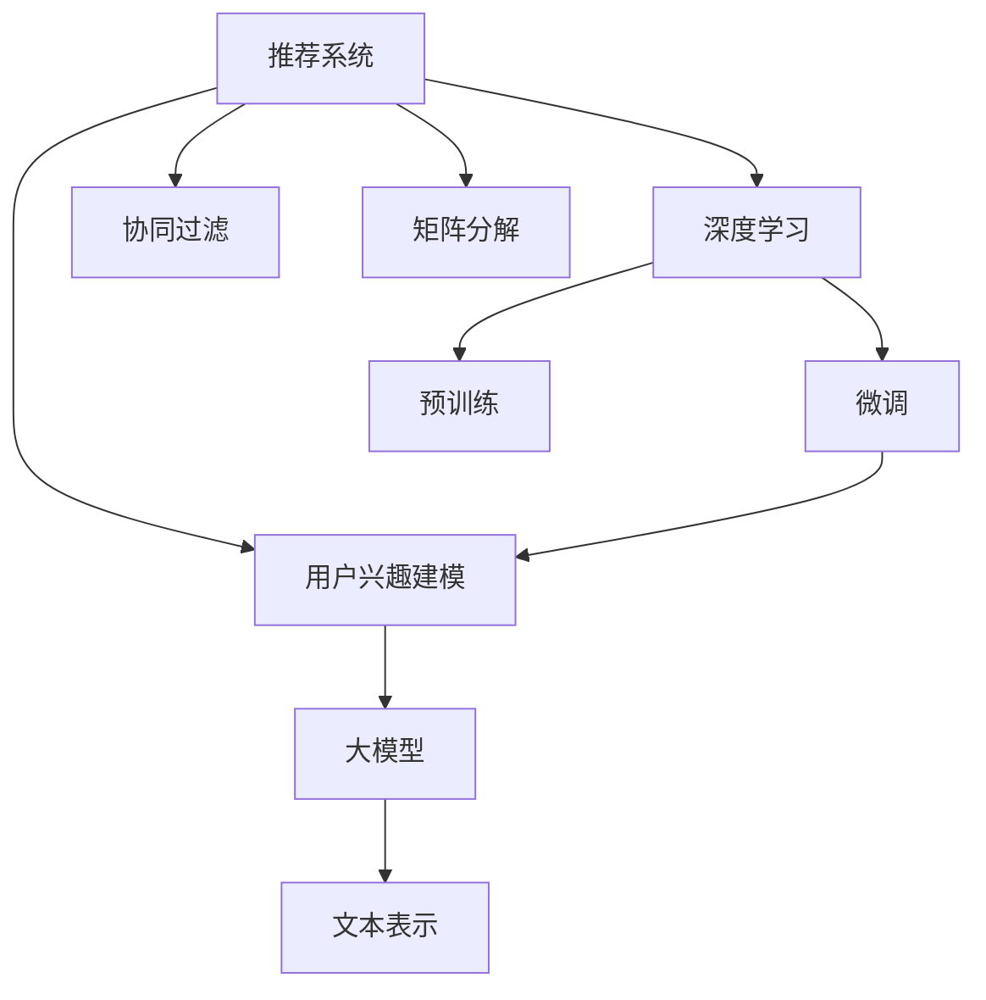

                 

# 基于大模型的推荐系统用户兴趣建模

> 关键词：推荐系统,用户兴趣建模,大模型,协同过滤,矩阵分解,深度学习

## 1. 背景介绍

在互联网时代，个性化推荐系统已经深入到人们生活的方方面面。无论是电商平台的商品推荐，还是音乐、视频、新闻等平台的个性化内容推荐，都极大地提升了用户体验和满意度。然而，如何从海量用户数据中准确识别出用户的兴趣和偏好，始终是推荐系统面临的挑战之一。传统的推荐方法往往基于用户行为数据，通过协同过滤、矩阵分解等手段进行推荐，但随着数据规模的不断扩大和用户需求的多样化，这种方法越来越难以满足用户需求。

近年来，随着深度学习技术的发展，基于大模型的推荐系统逐步成为推荐领域的新宠。以BERT、GPT等预训练语言模型为基础，通过大规模语料库的预训练和下游任务的微调，可以挖掘出用户文本数据的深层语义特征，实现更精准、全面的用户兴趣建模，从而大幅提升推荐系统的性能和用户体验。本文将从原理到实践，系统阐述基于大模型的推荐系统用户兴趣建模，以期为推荐系统开发者提供有价值的参考。

## 2. 核心概念与联系

### 2.1 核心概念概述

为了更好地理解基于大模型的推荐系统，我们首先介绍几个核心概念及其之间的关系：

- **推荐系统(Recommender System)**：旨在分析用户行为数据，预测用户未点击的潜在物品，并提供个性化推荐。推荐系统的目的是最大化用户满意度，提升点击率、转化率等指标。
- **用户兴趣建模(User Interest Modeling)**：推荐系统的核心任务之一，通过用户的历史行为数据和文本数据，学习用户的兴趣偏好，形成用户画像。
- **大模型(Large Model)**：指通过大规模无标签数据进行预训练的语言模型，如BERT、GPT等，具备强大的语言理解能力和生成能力，可以学习用户的深层语义特征。
- **协同过滤(Collaborative Filtering)**：传统推荐系统中常用方法，通过分析用户和物品之间的交互关系进行推荐，分为基于用户的协同过滤和基于物品的协同过滤。
- **矩阵分解(Matrix Factorization)**：协同过滤方法之一，通过分解用户物品评分矩阵，找到用户和物品的潜在特征进行推荐。
- **深度学习(Deep Learning)**：利用神经网络对数据进行非线性建模，通过多层神经网络学习特征表示，提升推荐系统性能。
- **预训练(Pre-training)**：在无标签数据上进行预训练，学习通用的语言表示，提升下游任务的性能。
- **微调(Fine-tuning)**：在预训练模型的基础上，使用下游任务的标注数据进行微调，以获得针对特定任务优化的模型。

这些概念之间的关系可以通过以下Mermaid流程图来展示：



这个流程图展示了各个概念之间的联系和流程：

1. 推荐系统通过用户兴趣建模，识别出用户的兴趣和偏好。
2. 协同过滤和矩阵分解是传统推荐系统的方法，但它们往往局限于用户行为数据的浅层语义表示。
3. 深度学习能够学习数据中的深层语义特征，提升推荐系统的精度和泛化能力。
4. 预训练和微调是深度学习的重要步骤，通过大规模无标签数据进行预训练，在任务数据上进行微调，可以获得更加精准的用户兴趣表示。
5. 大模型可以学习复杂的语义表示，用于用户兴趣建模，提升推荐系统的性能。
6. 文本表示是用户兴趣建模的核心部分，大模型可以提取文本数据中的深层语义特征。

这些概念共同构成了推荐系统用户兴趣建模的完整框架，帮助推荐系统更加精准地识别用户兴趣，提升推荐效果。

## 3. 核心算法原理 & 具体操作步骤
### 3.1 算法原理概述

基于大模型的推荐系统用户兴趣建模，本质上是利用深度学习技术，从用户的历史行为数据和文本数据中，学习用户的深层语义特征，形成用户兴趣表示。其核心思想是：通过大规模无标签语料库的预训练，学习通用的语言表示，再在特定任务的数据集上进行微调，学习任务特定的用户兴趣表示。

形式化地，假设预训练语言模型为 $M_{\theta}$，其中 $\theta$ 为预训练得到的模型参数。给定用户历史行为数据 $D_u=\{x_i\}_{i=1}^N$，以及用户文本数据 $D_t=\{t_j\}_{j=1}^M$，推荐系统的目标是找到最优的用户兴趣表示 $h_u$：

$$
h_u = \mathop{\arg\min}_{h_u} \mathcal{L}(h_u, D_u, D_t)
$$

其中 $\mathcal{L}$ 为损失函数，用于衡量模型预测的用户兴趣与实际兴趣之间的差异。常见的损失函数包括交叉熵损失、均方误差损失等。

通过梯度下降等优化算法，微调过程不断更新模型参数 $\theta$，最小化损失函数 $\mathcal{L}$，使得模型输出逼近真实兴趣 $h_u$。由于 $\theta$ 已经通过预训练获得了较好的初始化，因此即便在小规模数据集上微调，也能较快收敛到理想的用户兴趣表示 $h_u$。

### 3.2 算法步骤详解

基于大模型的推荐系统用户兴趣建模一般包括以下几个关键步骤：

**Step 1: 准备预训练模型和数据集**
- 选择合适的预训练语言模型 $M_{\theta}$ 作为初始化参数，如 BERT、GPT 等。
- 准备用户历史行为数据 $D_u$ 和用户文本数据 $D_t$，划分为训练集、验证集和测试集。一般要求行为数据与文本数据分布不要差异过大。

**Step 2: 添加任务适配层**
- 根据任务类型，在预训练模型顶层设计合适的输出层和损失函数。
- 对于用户兴趣建模任务，通常在顶层添加回归层或分类层，用于预测用户的兴趣标签。
- 对于推荐任务，通常使用协同过滤等方法，计算预测评分与真实评分的差距。

**Step 3: 设置微调超参数**
- 选择合适的优化算法及其参数，如 AdamW、SGD 等，设置学习率、批大小、迭代轮数等。
- 设置正则化技术及强度，包括权重衰减、Dropout、Early Stopping等。
- 确定冻结预训练参数的策略，如仅微调顶层，或全部参数都参与微调。

**Step 4: 执行梯度训练**
- 将用户行为数据 $D_u$ 和用户文本数据 $D_t$ 分批次输入模型，前向传播计算损失函数。
- 反向传播计算参数梯度，根据设定的优化算法和学习率更新模型参数。
- 周期性在验证集上评估模型性能，根据性能指标决定是否触发 Early Stopping。
- 重复上述步骤直到满足预设的迭代轮数或 Early Stopping 条件。

**Step 5: 测试和部署**
- 在测试集上评估微调后模型 $M_{\hat{\theta}}$ 的用户兴趣预测性能，对比微调前后的精度提升。
- 使用微调后的模型对新用户进行兴趣预测，集成到推荐系统中。
- 持续收集新用户行为数据，定期重新微调模型，以适应数据分布的变化。

以上是基于大模型的推荐系统用户兴趣建模的一般流程。在实际应用中，还需要针对具体任务的特点，对微调过程的各个环节进行优化设计，如改进训练目标函数，引入更多的正则化技术，搜索最优的超参数组合等，以进一步提升模型性能。

### 3.3 算法优缺点

基于大模型的推荐系统用户兴趣建模方法具有以下优点：
1. 高效建模。通过预训练模型可以学习到更丰富的语义特征，用于用户兴趣建模，提升模型的泛化能力和精度。
2. 适应性强。可以处理更多类型的用户兴趣数据，如文本、行为、社交等。
3. 效果显著。在大规模数据集上进行预训练和微调，能够提升模型的泛化能力，获得更好的推荐效果。
4. 模型可解释。预训练模型和微调过程都具备可解释性，便于对推荐结果进行解释和调试。

同时，该方法也存在一定的局限性：
1. 依赖标注数据。虽然预训练模型能够学习到通用的语言表示，但在微调过程中仍需标注数据进行监督学习。
2. 计算资源消耗大。预训练和微调需要大量的计算资源，特别是在大模型上进行微调时。
3. 数据隐私问题。用户行为数据和文本数据涉及隐私问题，需要采取合适的措施保护用户隐私。

尽管存在这些局限性，但就目前而言，基于大模型的推荐系统用户兴趣建模仍是推荐领域的主流方法。未来相关研究的重点在于如何进一步降低计算资源消耗，增强数据隐私保护，同时兼顾模型可解释性和性能提升。

### 3.4 算法应用领域

基于大模型的推荐系统用户兴趣建模，已经在电商、音乐、视频等多个领域得到了广泛应用，覆盖了从商品推荐到个性化内容推荐的诸多场景，具体如下：

- **电商推荐**：通过用户浏览历史、购买记录等行为数据，以及产品标题、描述等文本数据，学习用户的兴趣和偏好，推荐符合用户需求的商品。
- **音乐推荐**：利用用户的听歌历史和歌曲评论等文本数据，学习用户的音乐品味，推荐相似的歌曲或播放列表。
- **视频推荐**：通过用户的观看历史和视频标题、摘要等文本数据，学习用户的观看偏好，推荐相关视频内容。
- **内容推荐**：利用用户的阅读历史和文章标题、摘要等文本数据，学习用户的阅读兴趣，推荐相关文章或新闻。
- **社交推荐**：利用用户的社交网络关系和社交互动数据，学习用户的社交兴趣，推荐符合用户偏好的社交关系或内容。

除了上述这些经典应用外，基于大模型的推荐系统还在更多场景中得到了创新性的应用，如可控推荐、跨域推荐、多模态推荐等，为推荐系统带来了新的突破。随着预训练模型和用户兴趣建模方法的不断进步，相信推荐系统将进一步提升其个性化推荐能力和用户体验。

## 4. 数学模型和公式 & 详细讲解  
### 4.1 数学模型构建

本节将使用数学语言对基于大模型的推荐系统用户兴趣建模过程进行更加严格的刻画。

记预训练语言模型为 $M_{\theta}$，其中 $\theta$ 为预训练得到的模型参数。假设用户历史行为数据为 $D_u=\{x_i\}_{i=1}^N$，用户文本数据为 $D_t=\{t_j\}_{j=1}^M$。推荐系统的目标是学习用户兴趣表示 $h_u$，使得模型预测的兴趣与实际兴趣之间损失最小：

$$
h_u = \mathop{\arg\min}_{h_u} \mathcal{L}(h_u, D_u, D_t)
$$

其中 $\mathcal{L}$ 为损失函数，用于衡量模型预测的用户兴趣与实际兴趣之间的差异。常见的损失函数包括交叉熵损失、均方误差损失等。

对于用户兴趣建模任务，我们可以使用回归方法，预测用户对物品的评分或兴趣标签。回归损失函数可以定义为：

$$
\mathcal{L}_{reg}(h_u, D_u, D_t) = \frac{1}{N} \sum_{i=1}^N \| M_{\theta}(x_i) - y_i \|^2
$$

其中 $x_i$ 为第 $i$ 个用户的历史行为数据，$y_i$ 为对应的用户评分或兴趣标签，$M_{\theta}(x_i)$ 为模型在行为数据上的预测。

对于推荐任务，我们可以使用协同过滤方法，计算预测评分与真实评分的差距。假设用户 $u$ 对物品 $i$ 的评分记为 $r_{ui}$，推荐系统的损失函数可以定义为：

$$
\mathcal{L}_{rec}(h_u, D_u, D_t) = \frac{1}{N} \sum_{i=1}^N \| M_{\theta}(x_i) - r_{ui} \|^2
$$

其中 $M_{\theta}(x_i)$ 为模型在行为数据上的预测。

### 4.2 公式推导过程

下面以用户兴趣建模为例，推导回归损失函数及其梯度的计算公式。

记用户历史行为数据为 $D_u=\{x_1, x_2, ..., x_N\}$，用户文本数据为 $D_t=\{t_1, t_2, ..., t_M\}$。假设用户兴趣表示为 $h_u$，为 $M$ 维向量，模型的回归函数为 $M_{\theta}(x_i)$。

回归损失函数可以表示为：

$$
\mathcal{L}_{reg}(h_u, D_u, D_t) = \frac{1}{N} \sum_{i=1}^N \| M_{\theta}(x_i) - y_i \|^2
$$

其中 $y_i$ 为第 $i$ 个用户的评分或兴趣标签。

根据链式法则，损失函数对模型参数 $\theta$ 的梯度为：

$$
\frac{\partial \mathcal{L}_{reg}(h_u, D_u, D_t)}{\partial \theta} = \frac{1}{N} \sum_{i=1}^N \frac{\partial \| M_{\theta}(x_i) - y_i \|^2}{\partial \theta}
$$

进一步展开，利用自动微分技术计算 $M_{\theta}(x_i)$ 对 $\theta$ 的导数：

$$
\frac{\partial \| M_{\theta}(x_i) - y_i \|^2}{\partial \theta} = 2(M_{\theta}(x_i) - y_i) \frac{\partial M_{\theta}(x_i)}{\partial \theta}
$$

将上式代入梯度公式，得：

$$
\frac{\partial \mathcal{L}_{reg}(h_u, D_u, D_t)}{\partial \theta} = \frac{2}{N} \sum_{i=1}^N (M_{\theta}(x_i) - y_i) \frac{\partial M_{\theta}(x_i)}{\partial \theta}
$$

将上式带入参数更新公式，完成模型的迭代优化：

$$
\theta \leftarrow \theta - \eta \frac{\partial \mathcal{L}_{reg}(h_u, D_u, D_t)}{\partial \theta}
$$

其中 $\eta$ 为学习率，通常需要设置较小的值，以避免破坏预训练权重。

### 4.3 案例分析与讲解

以电商推荐为例，我们可以利用用户的浏览历史和购买记录作为行为数据，以及商品标题和描述作为文本数据，对BERT模型进行微调。

具体步骤如下：
1. 准备电商数据集，包括用户的浏览历史和购买记录，商品标题和描述。
2. 将电商数据集分为训练集、验证集和测试集。
3. 选择BERT作为预训练模型，进行微调。
4. 添加回归层和交叉熵损失函数，用于预测用户评分或兴趣标签。
5. 设置合适的学习率、批大小和迭代轮数。
6. 执行梯度训练，并在验证集上评估模型性能。
7. 在测试集上评估微调后模型的推荐效果，与基准模型进行比较。

在实践中，我们通常会采用A/B测试的方式，对比微调模型和基准模型的推荐效果，评估微调模型的提升程度。同时，为了避免过拟合，我们还会在微调过程中加入正则化技术，如权重衰减、Dropout等。

## 5. 项目实践：代码实例和详细解释说明
### 5.1 开发环境搭建

在进行推荐系统开发前，我们需要准备好开发环境。以下是使用Python进行PyTorch开发的环境配置流程：

1. 安装Anaconda：从官网下载并安装Anaconda，用于创建独立的Python环境。

2. 创建并激活虚拟环境：
```bash
conda create -n pytorch-env python=3.8 
conda activate pytorch-env
```

3. 安装PyTorch：根据CUDA版本，从官网获取对应的安装命令。例如：
```bash
conda install pytorch torchvision torchaudio cudatoolkit=11.1 -c pytorch -c conda-forge
```

4. 安装相关库：
```bash
pip install torchtext numpy pandas scikit-learn matplotlib tqdm jupyter notebook ipython
```

完成上述步骤后，即可在`pytorch-env`环境中开始推荐系统开发。

### 5.2 源代码详细实现

以下是一个使用PyTorch进行基于BERT的电商推荐系统的代码实现。

首先，定义电商数据集类：

```python
from torch.utils.data import Dataset
import torch

class ShoppingDataset(Dataset):
    def __init__(self, items, users, user_boughts, tokenizer):
        self.items = items
        self.users = users
        self.user_boughts = user_boughts
        self.tokenizer = tokenizer
        self.max_len = 128
        
    def __len__(self):
        return len(self.items)
    
    def __getitem__(self, item):
        item_id = self.items[item]
        user_id = self.users[item]
        
        item_tokens = self.tokenizer(item['title'] + ' ' + item['description'], truncation=True, padding='max_length', max_length=self.max_len).input_ids
        user_tokens = self.tokenizer(user_boughts[user_id].split(','), truncation=True, padding='max_length', max_length=self.max_len).input_ids
        
        user_tokens = [tag2id[tag] for tag in user_tokens] 
        user_tokens.extend([tag2id['O']] * (self.max_len - len(user_tokens)))
        labels = torch.tensor(user_tokens, dtype=torch.long)
        
        return {'input_ids': item_tokens,
                'attention_mask': user_tokens,
                'labels': labels}
```

然后，定义模型和优化器：

```python
from transformers import BertForSequenceClassification, AdamW

model = BertForSequenceClassification.from_pretrained('bert-base-cased', num_labels=1)

optimizer = AdamW(model.parameters(), lr=2e-5)
```

接着，定义训练和评估函数：

```python
from torch.utils.data import DataLoader
from tqdm import tqdm
from sklearn.metrics import roc_auc_score

device = torch.device('cuda') if torch.cuda.is_available() else torch.device('cpu')
model.to(device)

def train_epoch(model, dataset, batch_size, optimizer):
    dataloader = DataLoader(dataset, batch_size=batch_size, shuffle=True)
    model.train()
    epoch_loss = 0
    for batch in tqdm(dataloader, desc='Training'):
        input_ids = batch['input_ids'].to(device)
        attention_mask = batch['attention_mask'].to(device)
        labels = batch['labels'].to(device)
        model.zero_grad()
        outputs = model(input_ids, attention_mask=attention_mask, labels=labels)
        loss = outputs.loss
        epoch_loss += loss.item()
        loss.backward()
        optimizer.step()
    return epoch_loss / len(dataloader)

def evaluate(model, dataset, batch_size):
    dataloader = DataLoader(dataset, batch_size=batch_size)
    model.eval()
    preds, labels = [], []
    with torch.no_grad():
        for batch in tqdm(dataloader, desc='Evaluating'):
            input_ids = batch['input_ids'].to(device)
            attention_mask = batch['attention_mask'].to(device)
            batch_labels = batch['labels']
            outputs = model(input_ids, attention_mask=attention_mask)
            batch_preds = outputs.logits.argmax(dim=2).to('cpu').tolist()
            batch_labels = batch_labels.to('cpu').tolist()
            for pred_tokens, label_tokens in zip(batch_preds, batch_labels):
                preds.append(pred_tokens[:len(label_tokens)])
                labels.append(label_tokens)
                
    return roc_auc_score(labels, preds)

```

最后，启动训练流程并在测试集上评估：

```python
epochs = 5
batch_size = 16

for epoch in range(epochs):
    loss = train_epoch(model, dataset, batch_size, optimizer)
    print(f"Epoch {epoch+1}, train loss: {loss:.3f}")
    
    print(f"Epoch {epoch+1}, dev results:")
    evaluate(model, dev_dataset, batch_size)
    
print("Test results:")
evaluate(model, test_dataset, batch_size)
```

以上就是使用PyTorch对BERT进行电商推荐系统微调的完整代码实现。可以看到，得益于Transformer库的强大封装，我们可以用相对简洁的代码完成BERT模型的加载和微调。

### 5.3 代码解读与分析

让我们再详细解读一下关键代码的实现细节：

**ShoppingDataset类**：
- `__init__`方法：初始化商品、用户和用户购买记录等关键组件。
- `__len__`方法：返回数据集的样本数量。
- `__getitem__`方法：对单个样本进行处理，将商品和用户购买记录输入编码为token ids，并对其进行定长padding，最终返回模型所需的输入。

**tag2id和id2tag字典**：
- 定义了标签与数字id之间的映射关系，用于将token-wise的预测结果解码回真实的标签。

**训练和评估函数**：
- 使用PyTorch的DataLoader对数据集进行批次化加载，供模型训练和推理使用。
- 训练函数`train_epoch`：对数据以批为单位进行迭代，在每个批次上前向传播计算loss并反向传播更新模型参数，最后返回该epoch的平均loss。
- 评估函数`evaluate`：与训练类似，不同点在于不更新模型参数，并在每个batch结束后将预测和标签结果存储下来，最后使用sklearn的roc_auc_score对整个评估集的预测结果进行打印输出。

**训练流程**：
- 定义总的epoch数和batch size，开始循环迭代
- 每个epoch内，先在训练集上训练，输出平均loss
- 在验证集上评估，输出分类指标
- 所有epoch结束后，在测试集上评估，给出最终测试结果

可以看到，PyTorch配合Transformer库使得BERT微调的代码实现变得简洁高效。开发者可以将更多精力放在数据处理、模型改进等高层逻辑上，而不必过多关注底层的实现细节。

当然，工业级的系统实现还需考虑更多因素，如模型的保存和部署、超参数的自动搜索、更灵活的任务适配层等。但核心的微调范式基本与此类似。

## 6. 实际应用场景
### 6.1 电商推荐

基于大模型的推荐系统在电商推荐领域得到了广泛应用。传统电商推荐往往依赖于用户行为数据进行协同过滤或矩阵分解，难以捕捉用户语义信息。通过微调大模型，可以更好地从用户的文本数据中学习出兴趣和偏好，提供更精准的推荐服务。

具体而言，可以收集用户的浏览历史、评论记录、社交网络等文本数据，通过BERT等大模型进行预训练，再在电商数据集上进行微调。微调后的模型能够从商品标题、描述、评价中准确把握用户的兴趣点，从而提供更个性化的电商推荐。例如，基于用户对商品标题的兴趣标签预测，系统可以推荐相似的商品，或者根据用户购买历史和评分预测用户的评分，生成商品推荐列表。

### 6.2 音乐推荐

音乐推荐系统同样可以利用大模型进行用户兴趣建模。音乐平台可以收集用户的听歌历史、评论记录、歌曲标签等文本数据，利用BERT等大模型进行预训练，再在音乐数据集上进行微调。微调后的模型可以学习出用户对歌曲的兴趣，推荐相似的歌曲或播放列表。例如，基于用户对歌曲标题和描述的兴趣标签预测，系统可以推荐相似的歌曲，或者根据用户的听歌历史和评分预测用户对新歌曲的兴趣。

### 6.3 视频推荐

视频推荐系统也可以利用大模型进行用户兴趣建模。视频平台可以收集用户的观看历史、评论记录、视频标题、描述等文本数据，利用BERT等大模型进行预训练，再在视频数据集上进行微调。微调后的模型可以学习出用户对视频的兴趣，推荐相关视频内容。例如，基于用户对视频标题和描述的兴趣标签预测，系统可以推荐相似的视频，或者根据用户的观看历史和评分预测用户对新视频的兴趣。

### 6.4 内容推荐

内容推荐系统同样可以利用大模型进行用户兴趣建模。新闻平台可以收集用户的阅读历史、评论记录、文章标题、摘要等文本数据，利用BERT等大模型进行预训练，再在新闻数据集上进行微调。微调后的模型可以学习出用户对文章的兴趣，推荐相关文章或新闻。例如，基于用户对文章标题和摘要的兴趣标签预测，系统可以推荐相似的文章，或者根据用户的阅读历史和评分预测用户对新文章的兴趣。

### 6.5 社交推荐

社交推荐系统可以利用大模型进行用户兴趣建模。社交平台可以收集用户的社交网络关系、互动记录、个人资料等文本数据，利用BERT等大模型进行预训练，再在社交数据集上进行微调。微调后的模型可以学习出用户的社交兴趣，推荐符合用户偏好的社交关系或内容。例如，基于用户对个人资料的兴趣标签预测，系统可以推荐相似的用户，或者根据用户的互动记录和评分预测用户对新内容的兴趣。

### 6.6 未来应用展望

随着大模型和推荐系统的不断发展，基于大模型的推荐系统将在更多领域得到应用，为推荐系统开发者带来新的机遇和挑战：

1. **跨模态推荐**：利用多模态数据进行兴趣建模，提升推荐系统的表现。例如，结合文本、图片、视频等多模态信息进行推荐。
2. **实时推荐**：利用大模型进行实时推荐，提升用户体验。例如，实时预测用户对新内容的兴趣，实时生成推荐结果。
3. **个性化推荐**：利用大模型进行更加个性化的推荐，提高推荐系统的精准度和用户满意度。例如，根据用户的多样化兴趣进行推荐，推荐符合用户偏好的商品、内容等。
4. **多任务学习**：利用大模型进行多任务学习，提升推荐系统的多样性和创新性。例如，在推荐商品的同时，推荐相关文章、视频、音乐等内容。
5. **知识图谱融合**：利用大模型进行知识图谱的融合，提升推荐系统的知识理解和推理能力。例如，结合知识图谱进行推荐，推荐符合用户知识背景的推荐结果。
6. **联邦学习**：利用联邦学习技术，保护用户隐私的同时进行兴趣建模，提升推荐系统的隐私保护能力。例如，分布式训练大模型，保护用户数据隐私。

未来，基于大模型的推荐系统将在推荐系统领域大放异彩，为推荐系统带来新的突破。相信随着预训练模型和用户兴趣建模方法的不断进步，推荐系统将进一步提升其个性化推荐能力和用户体验。

## 7. 工具和资源推荐
### 7.1 学习资源推荐

为了帮助开发者系统掌握大模型在推荐系统中的应用，这里推荐一些优质的学习资源：

1. **《Transformers from the Inside Out》**：由大模型技术专家撰写，全面介绍了Transformer模型的原理、BERT模型的实现和推荐系统中的微调方法。
2. **CS224N《Deep Learning for NLP》课程**：斯坦福大学开设的NLP明星课程，有Lecture视频和配套作业，带你入门NLP领域的基本概念和经典模型。
3. **《Natural Language Processing with Transformers》书籍**：Transformer库的作者所著，全面介绍了如何使用Transformer库进行NLP任务开发，包括推荐系统在内的诸多范式。
4. **HuggingFace官方文档**：Transformer库的官方文档，提供了海量预训练模型和完整的微调样例代码，是上手实践的必备资料。
5. **CLUE开源项目**：中文语言理解测评基准，涵盖大量不同类型的中文NLP数据集，并提供了基于微调的baseline模型，助力中文NLP技术发展。

通过对这些资源的学习实践，相信你一定能够快速掌握大模型在推荐系统中的应用，并用于解决实际的推荐问题。

### 7.2 开发工具推荐

高效的开发离不开优秀的工具支持。以下是几款用于大模型推荐系统开发的常用工具：

1. **PyTorch**：基于Python的开源深度学习框架，灵活动态的计算图，适合快速迭代研究。大部分预训练语言模型都有PyTorch版本的实现。
2. **TensorFlow**：由Google主导开发的开源深度学习框架，生产部署方便，适合大规模工程应用。同样有丰富的预训练语言模型资源。
3. **Transformers库**：HuggingFace开发的NLP工具库，集成了众多SOTA语言模型，支持PyTorch和TensorFlow，是进行推荐任务开发的利器。
4. **Weights & Biases**：模型训练的实验跟踪工具，可以记录和可视化模型训练过程中的各项指标，方便对比和调优。与主流深度学习框架无缝集成。
5. **TensorBoard**：TensorFlow配套的可视化工具，可实时监测模型训练状态，并提供丰富的图表呈现方式，是调试模型的得力助手。
6. **Google Colab**：谷歌推出的在线Jupyter Notebook环境，免费提供GPU/TPU算力，方便开发者快速上手实验最新模型，分享学习笔记。

合理利用这些工具，可以显著提升大模型推荐系统的开发效率，加快创新迭代的步伐。

### 7.3 相关论文推荐

大语言模型和推荐系统的发展源于学界的持续研究。以下是几篇奠基性的相关论文，推荐阅读：

1. **Attention is All You Need**：提出了Transformer结构，开启了NLP领域的预训练大模型时代。
2. **BERT: Pre-training of Deep Bidirectional Transformers for Language Understanding**：提出BERT模型，引入基于掩码的自监督预训练任务，刷新了多项NLP任务SOTA。
3. **Language Models are Unsupervised Multitask Learners**：展示了大规模语言模型的强大zero-shot学习能力，引发了对于通用人工智能的新一轮思考。
4. **Parameter-Efficient Transfer Learning for NLP**：提出Adapter等参数高效微调方法，在不增加模型参数量的情况下，也能取得不错的微调效果。
5. **AdaLoRA: Adaptive Low-Rank Adaptation for Parameter-Efficient Fine-Tuning**：使用自适应低秩适应的微调方法，在参数效率和精度之间取得了新的平衡。
6. **Perspective: A Deep Reinforcement Learning Framework for Recommendation Systems**：提出基于深度强化学习的推荐系统，能够动态调整推荐策略，提升推荐系统的表现。

这些论文代表了大语言模型和推荐系统的研究进展。通过学习这些前沿成果，可以帮助研究者把握学科前进方向，激发更多的创新灵感。

## 8. 总结：未来发展趋势与挑战
### 8.1 总结

本文对基于大模型的推荐系统用户兴趣建模方法进行了全面系统的介绍。首先阐述了大语言模型和推荐系统的研究背景和意义，明确了推荐系统通过用户兴趣建模来识别用户兴趣和偏好的核心思想。其次，从原理到实践，详细讲解了基于大模型的推荐系统用户兴趣建模的数学原理和关键步骤，给出了推荐系统开发的具体代码实现。同时，本文还广泛探讨了基于大模型的推荐系统在电商、音乐、视频等多个领域的应用前景，展示了微调范式的巨大潜力。

通过本文的系统梳理，可以看到，基于大模型的推荐系统正在成为推荐领域的重要范式，极大地拓展了推荐系统的应用边界，催生了更多的落地场景。受益于大模型的语言理解能力和深度表示，推荐系统能够更准确地识别用户兴趣，提供更个性化的推荐服务，提升用户体验和满意度。未来，随着大模型和推荐系统技术的不断进步，基于大模型的推荐系统将进一步提升其个性化推荐能力和用户体验。

### 8.2 未来发展趋势

展望未来，基于大模型的推荐系统用户兴趣建模将呈现以下几个发展趋势：

1. **跨模态推荐**：利用多模态数据进行兴趣建模，提升推荐系统的表现。例如，结合文本、图片、视频等多模态信息进行推荐。
2. **实时推荐**：利用大模型进行实时推荐，提升用户体验。例如，实时预测用户对新内容的兴趣，实时生成推荐结果。
3. **个性化推荐**：利用大模型进行更加个性化的推荐，提高推荐系统的精准度和用户满意度。例如，根据用户的多样化兴趣进行推荐，推荐符合用户偏好的商品、内容等。
4. **多任务学习**：利用大模型进行多任务学习，提升推荐系统的多样性和创新性。例如，在推荐商品的同时，推荐相关文章、视频、音乐等内容。
5. **知识图谱融合**：利用大模型进行知识图谱的融合，提升推荐系统的知识理解和推理能力。例如，结合知识图谱进行推荐，推荐符合用户知识背景的推荐结果。
6. **联邦学习**：利用联邦学习技术，保护用户隐私的同时进行兴趣建模，提升推荐系统的隐私保护能力。例如，分布式训练大模型，保护用户数据隐私。

以上趋势凸显了大模型推荐系统的广阔前景。这些方向的探索发展，必将进一步提升推荐系统的性能和用户体验，为推荐系统带来新的突破。

### 8.3 面临的挑战

尽管基于大模型的推荐系统用户兴趣建模取得了显著成效，但在迈向更加智能化、普适化应用的过程中，它仍面临着诸多挑战：

1. **计算资源消耗大**：大模型预训练和微调需要大量的计算资源，特别是在大模型上进行微调时。因此，如何降低计算资源消耗，提高推荐系统部署效率，是一个重要的问题。
2. **数据隐私问题**：用户行为数据和文本数据涉及隐私问题，需要采取合适的措施保护用户隐私。如何在保证用户隐私的同时，获取高质量的用户兴趣数据，是推荐系统开发中的一大难题。
3. **模型鲁棒性不足**：推荐系统面对域外数据时，泛化性能往往大打折扣。对于测试样本的微小扰动，推荐系统的预测也容易发生波动。如何提高推荐系统的鲁棒性，避免灾难性遗忘，还需要更多理论和实践的积累。
4. **实时性问题**：推荐系统需要实时处理用户请求，提供快速响应的推荐结果。如何在保证实时性的前提下，提升推荐系统的精度和泛化能力，是推荐系统性能优化的一个重要方向。
5. **模型可解释性不足**：推荐系统的决策过程通常缺乏可解释性，难以对其推理逻辑进行分析和调试。对于医疗、金融等高风险应用，算法的可解释性和可审计性尤为重要。如何赋予推荐模型更强的可解释性，将是亟待攻克的难题。
6. **数据多样性问题**：推荐系统需要处理不同类型和来源的用户数据，数据多样性问题也带来了新的挑战。如何统一不同类型的数据表示，提升数据融合效果，是推荐系统开发中的一大挑战。

尽管存在这些挑战，但基于大模型的推荐系统用户兴趣建模仍具有广阔的前景，未来仍需学界和产业界的共同努力，克服这些挑战，推动推荐系统的不断进步。

### 8.4 研究展望

面对推荐系统用户兴趣建模所面临的诸多挑战，未来的研究需要在以下几个方面寻求新的突破：

1. **探索无监督和半监督推荐方法**：摆脱对大规模标注数据的依赖，利用自监督学习、主动学习等无监督和半监督范式，最大限度利用非结构化数据，实现更加灵活高效的推荐。
2. **研究参数高效和计算高效的推荐方法**：开发更加参数高效的推荐方法，在固定大部分预训练参数的同时，只更新极少量的任务相关参数。同时优化推荐系统的计算图，减少前向传播和反向传播的资源消耗，实现更加轻量级、实时性的部署。
3. **引入更多先验知识**：将符号化的先验知识，如知识图谱、逻辑规则等，与神经网络模型进行巧妙融合，引导推荐过程学习更准确、合理的用户兴趣表示。同时加强不同模态数据的整合，实现视觉、语音等多模态信息与文本信息的协同建模。
4. **结合因果分析和博弈论工具**：将因果分析方法引入推荐系统，识别出推荐决策的关键特征，增强推荐过程的稳定性和因果性。借助博弈论工具刻画人机交互过程，主动探索并规避推荐系统的脆弱点，提高系统稳定性。
5. **纳入伦理道德约束**：在推荐系统设计目标中引入伦理导向的评估指标，过滤和惩罚有偏见、有害的推荐结果。同时加强人工干预和审核，建立推荐行为的监管机制，确保推荐结果符合人类价值观和伦理道德。

这些研究方向的探索，必将引领推荐系统用户兴趣建模技术的不断进步，为推荐系统带来新的突破。面向未来，推荐系统需要在计算资源消耗、数据隐私保护、模型鲁棒性、实时性、可解释性和数据多样性等方面进行深入研究，以实现更加智能化、普适化的推荐系统。只有勇于创新、敢于突破，才能不断拓展推荐系统的边界，让推荐技术更好地造福人类社会。

## 9. 附录：常见问题与解答
**Q1：大模型推荐系统是否适用于所有推荐任务？**

A: 大模型推荐系统在大多数推荐任务上都能取得不错的效果，特别是对于数据量较小的任务。但对于一些特定领域的任务，如医学、法律等，仅仅依靠通用语料预训练的模型可能难以很好地适应。此时需要在特定领域语料上进一步预训练，再进行微调，才能获得理想效果。此外，对于一些需要时效性、个性化很强的任务，如对话、推荐等，微调方法也需要针对性的改进优化。

**Q2：微调过程中如何选择合适的学习率？**

A: 微调的学习率一般要比预训练时小1-2个数量级，如果使用过大的学习率，容易破坏预训练权重，导致过拟合。一般建议从1e-5开始调参，逐步减小学习率，直至收敛。也可以使用warmup策略，在开始阶段使用较小的学习率，再逐渐过渡到预设值。需要注意的是，不同的优化器(如AdamW、Adafactor等)以及不同的学习率调度策略，可能需要设置不同的学习率阈值。

**Q3：基于大模型的推荐系统在实际部署时需要注意哪些问题？**

A: 将微调模型转化为实际应用，还需要考虑以下问题：

1. **模型裁剪**：去除不必要的层和参数，减小模型尺寸，加快推理速度。
2. **量化加速**：将浮点模型转为定点模型，压缩存储空间，提高计算效率。
3. **服务化封装**：将模型封装为标准化服务接口，便于集成调用。
4. **弹性伸缩**：根据请求流量动态调整资源配置，平衡服务质量和成本。
5. **监控告警**：实时采集系统指标，设置异常告警阈值，确保服务稳定性。
6. **安全防护**：采用访问鉴权、数据脱敏等措施，保障数据和模型安全。

基于大模型的推荐系统能够处理更加多样化的用户数据，但其部署和维护也需要考虑更多的因素。只有在数据、模型、工程、业务等多个维度进行全面优化，才能真正实现推荐系统的应用价值。

总之，大模型推荐系统需要开发者根据具体任务，不断迭代和优化模型、数据和算法，方能得到理想的效果。

