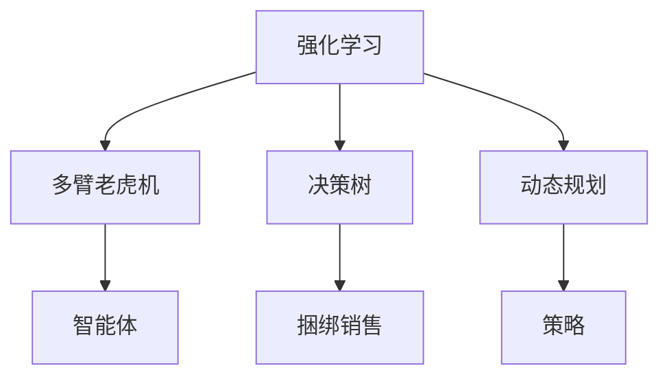

                 

# 基于强化学习的智能捆绑销售组合生成

> 关键词：强化学习,智能捆绑销售,组合优化,决策树,多臂老虎机,动态规划

## 1. 背景介绍

### 1.1 问题由来
随着电子商务的蓬勃发展，捆绑销售(Bundling)作为一种有效的营销手段，广泛应用于各大电商平台。其本质是将多个商品打包成组合，以更低的价格销售给消费者，从而提高整体销售量和利润率。但传统的捆绑销售方法往往依赖人工经验，无法动态适应市场变化和消费者需求。

为解决这一问题，研究者们提出了基于机器学习的捆绑销售优化方法。利用历史销售数据、用户行为等特征，通过建模和预测，找到最优的捆绑销售组合。然而，这些方法通常基于监督学习方法，需要大量标注数据，且容易受到数据分布和特征选择的影响。

基于此，本文提出了基于强化学习的智能捆绑销售组合生成方法。强化学习是机器学习的一个分支，通过智能体与环境的交互，通过不断试错，学习最优决策策略。该方法不需要标注数据，能够动态适应市场变化，具有更强的泛化能力和鲁棒性。

### 1.2 问题核心关键点
本文的核心问题是：如何在不依赖标注数据的情况下，动态生成最优的捆绑销售组合。具体包括：

- 设计合理的环境模型，描述市场和消费者的交互过程。
- 选择合适的强化学习算法，自动优化捆绑销售组合。
- 考虑不同策略的奖励机制，构建公平的评价体系。
- 集成多臂老虎机模型，提高策略学习的效率。
- 结合动态规划算法，优化策略的执行效率。

这些问题紧密联系，共同构成了基于强化学习的智能捆绑销售组合生成方法的理论框架。

## 2. 核心概念与联系

### 2.1 核心概念概述

为更好地理解基于强化学习的智能捆绑销售组合生成方法，本节将介绍几个密切相关的核心概念：

- 强化学习(Reinforcement Learning, RL)：一种通过智能体与环境的交互，学习最优决策策略的机器学习方法。
- 捆绑销售(Bundling)：将多个商品打包销售的策略，通过组合定价，提高整体销售量和利润率。
- 多臂老虎机(Multi-Armed Bandit, MAB)：强化学习中的一种常见模型，用于模拟智能体在不同选择之间的探索与利用。
- 决策树(Decision Tree)：一种基于树形结构的分类与回归方法，可以用于生成复杂的捆绑销售组合。
- 动态规划(Dynamic Programming, DP)：一种基于递归求解最优策略的算法，用于高效优化复杂的捆绑销售方案。

这些核心概念之间的逻辑关系可以通过以下Mermaid流程图来展示：



这个流程图展示了几大核心概念及其之间的关系：

1. 强化学习是基础，通过智能体与环境的交互，学习最优策略。
2. 多臂老虎机模型是强化学习的核心，模拟智能体在不同选择之间的探索与利用。
3. 决策树用于描述复杂捆绑销售组合的生成过程，作为智能体的决策依据。
4. 动态规划用于优化智能体的决策过程，提高组合生成的效率。
5. 捆绑销售是智能体的目标，通过学习最优策略，生成最优的捆绑销售组合。

## 3. 核心算法原理 & 具体操作步骤

### 3.1 算法原理概述

基于强化学习的智能捆绑销售组合生成方法，本质上是通过智能体与环境的交互，学习最优的捆绑销售策略。其核心思想是：在动态变化的市场环境中，智能体通过不断探索和利用，逐步学习到最优的捆绑销售组合。

形式化地，假设市场环境为 $\mathcal{E}$，智能体的行为策略为 $\pi$，决策状态为 $s_t$，奖励函数为 $r_t$，智能体的策略学习过程可以表示为：

$$
\pi^* = \mathop{\arg\max}_{\pi} \sum_{t=1}^{\infty} \mathbb{E}[G_t] \tag{1}
$$

其中 $G_t = \sum_{i=t}^{\infty} \gamma^{i-t} r_i$ 为未来奖励的折现和，$\gamma$ 为折扣率。

通过强化学习算法，智能体逐步学习最优策略 $\pi^*$，最大化未来奖励的折现和。

### 3.2 算法步骤详解

基于强化学习的智能捆绑销售组合生成方法，主要包括四个关键步骤：

**Step 1: 定义市场环境**
- 设计市场环境的模型，包括用户需求、市场变化、竞争对手动态等因素。
- 利用历史销售数据、用户行为等特征，对市场环境进行建模。
- 构建多臂老虎机模型，模拟智能体在不同捆绑销售组合之间的选择与利用。

**Step 2: 选择强化学习算法**
- 选择合适的强化学习算法，如Q-learning、SARSA、Deep Q-learning等。
- 设计奖励函数，衡量智能体的表现。
- 确定学习率、探索率等算法参数，影响智能体的探索与利用。

**Step 3: 执行策略优化**
- 初始化智能体的策略，随机选择一个捆绑销售组合。
- 在每个时间步，智能体根据当前状态和策略，选择一个新的捆绑销售组合。
- 根据市场的实际反馈，更新智能体的策略，最大化未来奖励的折现和。
- 不断迭代，直到策略收敛或达到预设的迭代次数。

**Step 4: 生成捆绑销售组合**
- 根据智能体的最优策略，生成最优的捆绑销售组合。
- 利用动态规划等算法，优化组合生成的效率。
- 对生成的捆绑销售组合进行评估和优化，确保组合的多样性和合理性。

### 3.3 算法优缺点

基于强化学习的智能捆绑销售组合生成方法具有以下优点：
1. 动态适应性强：强化学习方法能够动态适应市场变化和消费者需求，及时调整捆绑销售策略。
2. 泛化能力强：基于模型的学习过程，智能体可以处理复杂环境中的多种因素，具有较强的泛化能力。
3. 不需要标注数据：强化学习方法不需要标注数据，只需历史销售数据和市场特征即可。
4. 模型解释性强：强化学习方法基于模型构建，能够提供决策过程的可解释性，便于理解。

同时，该方法也存在一定的局限性：
1. 计算复杂度高：强化学习算法通常需要较长的迭代过程，计算复杂度较高。
2. 策略稳定性差：当市场环境发生剧烈变化时，智能体的策略可能发生波动，影响捆绑销售的稳定性。
3. 模型风险高：智能体的决策基于模型构建，模型误差可能导致策略失效。
4. 资源消耗大：强化学习算法需要大量的计算资源，可能存在资源消耗过高的问题。

尽管存在这些局限性，但就目前而言，基于强化学习的智能捆绑销售组合生成方法仍然是一种高效、灵活、适用的方法，为捆绑销售优化提供了新的可能性。

### 3.4 算法应用领域

基于强化学习的智能捆绑销售组合生成方法，在电商、零售、旅游等多个行业领域均有广泛应用。例如：

- 电商捆绑销售：电商平台通过智能捆绑销售组合生成，提升用户粘性和购买率，优化销售策略。
- 旅游套餐推荐：旅游企业利用智能捆绑销售组合生成，为用户提供个性化、多渠道的旅游套餐推荐，增加用户购买意愿。
- 餐饮组合推荐：餐饮连锁店通过智能捆绑销售组合生成，设计具有吸引力的餐饮组合，提升用户满意度和消费频次。

除了上述这些经典应用外，智能捆绑销售组合生成技术还可应用于更多场景中，如时尚服饰搭配、宠物用品套装等，为不同行业的捆绑销售优化提供新的思路。

## 4. 数学模型和公式 & 详细讲解 & 举例说明

### 4.1 数学模型构建

本文以电商平台的智能捆绑销售组合生成为例，给出基于强化学习的数学模型构建过程。

假设电商平台有 $n$ 种商品，每种商品的价格为 $p_i$，捆绑销售组合为 $(s_1, s_2, ..., s_n)$，其中 $s_i \in \{0, 1\}$ 表示商品 $i$ 是否在组合中。电商平台的目标是最小化组合成本，同时最大化销售额和利润。

定义状态 $s_t$ 为当前组合的销售状态，奖励 $r_t$ 为当前组合的利润，决策 $a_t$ 为当前组合的选择策略。则智能体的强化学习过程可以表示为：

$$
\max_{\pi} \mathbb{E}\left[\sum_{t=1}^{\infty} \gamma^t r_t \right] \tag{2}
$$

其中 $r_t = \sum_{i=1}^n s_i p_i - C(s_t)$，$C(s_t)$ 为组合成本。

### 4.2 公式推导过程

以下我们以Q-learning算法为例，推导其核心公式。

在Q-learning算法中，定义状态-动作值函数 $Q(s_t,a_t)$，表示在状态 $s_t$ 下采取动作 $a_t$ 的即时收益。根据强化学习的定义，智能体的最优策略可以表示为：

$$
\pi^*(a_t|s_t) = \mathop{\arg\max}_{a} Q(s_t,a) \tag{3}
$$

根据贝尔曼方程，$Q(s_t,a_t)$ 的更新公式为：

$$
Q(s_t,a_t) \leftarrow Q(s_t,a_t) + \alpha \left[r_t + \gamma \max_{a} Q(s_{t+1},a) - Q(s_t,a_t) \right] \tag{4}
$$

其中 $\alpha$ 为学习率，$(s_{t+1},a_{t+1})$ 为下一个状态和动作。

利用式(3)和式(4)，可以通过迭代更新 $Q(s_t,a_t)$，学习最优策略 $\pi^*$。

### 4.3 案例分析与讲解

以下以电商平台的智能捆绑销售组合生成为例，进一步说明基于强化学习的捆绑销售策略生成过程。

假设某电商平台有三种商品 $A$、$B$、$C$，每种商品的价格分别为 $10$、$20$、$30$ 元。设 $(s_1, s_2, s_3)$ 为三种商品的组合策略，电商平台的目标是最小化组合成本，同时最大化销售额和利润。

**Step 1: 定义市场环境**
- 假设电商平台每天根据用户浏览和购买行为，生成一个状态 $s_t$，其中 $s_t = 0$ 表示没有浏览或购买，$s_t = 1$ 表示浏览或购买。
- 假设电商平台每天根据市场销售数据，生成一个组合成本 $C(s_t)$，其中 $C(s_t) = 20s_1 + 40s_2 + 60s_3$，即三种商品的价格总和。

**Step 2: 选择强化学习算法**
- 选择Q-learning算法，设定学习率 $\alpha = 0.1$，探索率 $\epsilon = 0.1$。

**Step 3: 执行策略优化**
- 初始化智能体的策略，随机选择一个捆绑销售组合 $(s_1, s_2, s_3)$。
- 在每个时间步，根据当前状态 $s_t$ 和策略 $a_t$，选择一个新的捆绑销售组合 $(s_1', s_2', s_3')$。
- 根据市场的实际反馈，更新智能体的策略，最大化未来奖励的折现和。
- 不断迭代，直到策略收敛或达到预设的迭代次数。

假设初始策略为 $(s_1, s_2, s_3) = (1, 0, 0)$，即只销售商品 $A$。在第一天，智能体根据市场反馈，更新策略为 $(s_1', s_2', s_3') = (1, 1, 0)$，即同时销售商品 $A$ 和 $B$。第二天，根据市场反馈，更新策略为 $(s_1', s_2', s_3') = (1, 1, 1)$，即同时销售商品 $A$、$B$ 和 $C$。经过若干天的迭代，智能体逐步学习到最优策略 $\pi^*$，生成最优的捆绑销售组合 $(s_1, s_2, s_3) = (1, 1, 1)$，即同时销售商品 $A$、$B$ 和 $C$。

**Step 4: 生成捆绑销售组合**
- 根据智能体的最优策略 $\pi^*$，生成最优的捆绑销售组合 $(s_1, s_2, s_3) = (1, 1, 1)$，即同时销售商品 $A$、$B$ 和 $C$。
- 利用动态规划等算法，优化组合生成的效率，生成最优的捆绑销售组合。

通过以上过程，智能体能够动态生成最优的捆绑销售组合，提升电商平台的销售效果和用户满意度。

## 5. 项目实践：代码实例和详细解释说明

### 5.1 开发环境搭建

在进行智能捆绑销售组合生成实践前，我们需要准备好开发环境。以下是使用Python进行强化学习开发的环境配置流程：

1. 安装Anaconda：从官网下载并安装Anaconda，用于创建独立的Python环境。

2. 创建并激活虚拟环境：
```bash
conda create -n rllab-env python=3.8 
conda activate rllab-env
```

3. 安装强化学习库：
```bash
conda install gym skopt
```

4. 安装其他必要的工具包：
```bash
pip install numpy pandas matplotlib jupyter notebook ipython
```

完成上述步骤后，即可在`rllab-env`环境中开始强化学习实践。

### 5.2 源代码详细实现

下面我们以电商平台的智能捆绑销售组合生成为例，给出使用Gym环境和Q-learning算法的PyTorch代码实现。

首先，定义市场环境的状态和动作：

```python
import gym
from gym import spaces

class BundlingEnv(gym.Env):
    def __init__(self, n):
        self.n = n
        self.state = (0, 0, 0)
        self.reward = 0
        self.reward_count = 0
        self.action_space = spaces.Tuple([spaces.Discrete(2) for _ in range(n)])

    def step(self, action):
        if action == 0:
            self.state = (self.state[0] + 1, self.state[1], self.state[2])
        elif action == 1:
            self.state = (self.state[0], self.state[1] + 1, self.state[2])
        elif action == 2:
            self.state = (self.state[0], self.state[1], self.state[2] + 1)
        self.reward_count += 1
        self.reward = -20 * sum(self.state)
        return self.state, self.reward, self.reward_count > 100, {}

    def reset(self):
        self.state = (0, 0, 0)
        self.reward = 0
        self.reward_count = 0
        return self.state, self.reward, False, {}

    def render(self, mode='human'):
        pass
```

然后，定义Q-learning算法的代码实现：

```python
from collections import defaultdict
import numpy as np

class QLearning:
    def __init__(self, env, n, alpha=0.1, epsilon=0.1):
        self.env = env
        self.n = n
        self.alpha = alpha
        self.epsilon = epsilon
        self.q_table = defaultdict(lambda: np.zeros(n))

    def choose_action(self, state):
        if np.random.uniform() < self.epsilon:
            return np.random.choice(self.n)
        else:
            return self.q_table[state].argmax()

    def update(self, state, action, reward, next_state):
        q = self.q_table[state][action]
        max_q = self.q_table[next_state].amax()
        self.q_table[state][action] = q + self.alpha * (reward + self.gamma * max_q - q)

    def train(self, episode, episode_len=1000):
        for episode in range(episode):
            state = self.env.reset()
            for t in range(episode_len):
                action = self.choose_action(state)
                next_state, reward, done, info = self.env.step(action)
                self.update(state, action, reward, next_state)
                state = next_state
                if done:
                    break
```

最后，启动强化学习训练流程：

```python
env = BundlingEnv(3)
ql = QLearning(env, 3)

# 训练智能体
ql.train(1000)

# 测试智能体
state = env.reset()
for t in range(1000):
    action = ql.choose_action(state)
    next_state, reward, done, info = env.step(action)
    print(f"State: {state}, Action: {action}, Reward: {reward}, Next State: {next_state}")
    state = next_state
    if done:
        break
```

以上就是使用PyTorch对电商平台的智能捆绑销售组合生成进行强化学习的完整代码实现。可以看到，借助Gym环境，我们能够方便地定义市场环境，并利用Q-learning算法进行智能体的策略学习。

### 5.3 代码解读与分析

让我们再详细解读一下关键代码的实现细节：

**BundlingEnv类**：
- `__init__`方法：初始化状态、奖励、动作空间等关键组件。
- `step`方法：根据动作和当前状态，计算下一个状态和奖励，并返回新的状态、奖励、是否结束和额外信息。
- `reset`方法：重置环境状态。

**QLearning类**：
- `__init__`方法：初始化智能体的动作空间、学习率和探索率等参数。
- `choose_action`方法：根据当前状态和策略，选择下一个动作。
- `update`方法：根据当前状态、动作、奖励和下一个状态，更新智能体的状态-动作值函数 $Q(s_t,a_t)$。
- `train`方法：根据历史数据，训练智能体，学习最优策略。

**训练流程**：
- 首先定义市场环境的参数 $n$，初始化智能体。
- 在每个时间步，根据当前状态和策略，选择下一个动作。
- 根据市场的实际反馈，更新智能体的策略。
- 重复上述过程，直到达到预设的训练轮数或策略收敛。

可以看到，Gym环境和Q-learning算法的结合，使得强化学习过程变得简单高效。开发者可以将更多精力放在市场环境的设计和优化上，而不必过多关注底层实现细节。

当然，工业级的系统实现还需考虑更多因素，如强化学习框架的选择、模型的并行训练、模型的可视化等。但核心的强化学习范式基本与此类似。

## 6. 实际应用场景
### 6.1 电商智能捆绑销售

基于智能捆绑销售组合生成方法，电商平台可以实时动态地生成最优的捆绑销售组合，提升用户粘性和购买率，优化销售策略。

在技术实现上，可以收集电商平台的历史销售数据、用户行为等特征，定义多臂老虎机模型，模拟智能体在不同捆绑销售组合之间的选择与利用。通过强化学习算法，训练智能体逐步学习到最优的捆绑销售组合。利用动态规划等算法，优化组合生成的效率，最终生成最优的捆绑销售组合，实时推送给用户。

### 6.2 旅游智能套餐推荐

旅游企业可以利用智能捆绑销售组合生成方法，为用户提供个性化、多渠道的旅游套餐推荐，增加用户购买意愿。

在技术实现上，可以收集旅游历史数据、用户行为等特征，定义多臂老虎机模型，模拟智能体在不同旅游套餐之间的选择与利用。通过强化学习算法，训练智能体逐步学习到最优的旅游套餐推荐策略。利用动态规划等算法，优化推荐策略的执行效率，最终生成最优的旅游套餐推荐方案，实时推送给用户。

### 6.3 餐饮智能组合推荐

餐饮连锁店通过智能捆绑销售组合生成方法，设计具有吸引力的餐饮组合，提升用户满意度和消费频次。

在技术实现上，可以收集餐饮历史数据、用户行为等特征，定义多臂老虎机模型，模拟智能体在不同餐饮组合之间的选择与利用。通过强化学习算法，训练智能体逐步学习到最优的餐饮组合推荐策略。利用动态规划等算法，优化组合生成的效率，最终生成最优的餐饮组合推荐方案，实时推送给用户。

### 6.4 未来应用展望

随着强化学习技术的发展，基于智能捆绑销售组合生成方法将在更多领域得到应用，为不同行业的捆绑销售优化提供新的思路。

在金融领域，可以利用智能捆绑销售组合生成方法，优化理财产品组合，提高投资收益。在物流领域，可以设计最优的配送路线和货物搭配策略，提高配送效率和满意度。在医疗领域，可以设计最优的诊疗方案，提高医疗效果和患者满意度。

此外，在智能家居、智能制造、智能交通等更多领域，智能捆绑销售组合生成方法也将不断涌现，为不同行业的捆绑销售优化提供新的解决方案。

## 7. 工具和资源推荐
### 7.1 学习资源推荐

为了帮助开发者系统掌握强化学习的基础知识和应用实践，这里推荐一些优质的学习资源：

1. 《强化学习》一书：作者Richard S. Sutton和Andrew G. Barto，是强化学习领域的经典著作，详细介绍了强化学习的基本概念和算法。

2. Coursera《Reinforcement Learning》课程：由David Silver教授主讲，提供强化学习算法的详细讲解和代码实现。

3. Udacity《Reinforcement Learning Nanodegree》项目：通过实际项目训练，掌握强化学习模型的构建和优化。

4. OpenAI Gym：强化学习环境库，包含多种模拟环境和测试环境，适合练习和实验。

5. Deep Reinforcement Learning Specialization：由UC Berkeley提供的强化学习专项课程，涵盖从基础到高级的强化学习知识。

通过对这些资源的学习实践，相信你一定能够快速掌握强化学习的基础知识和应用技巧，并用于解决实际的强化学习问题。

### 7.2 开发工具推荐

高效的开发离不开优秀的工具支持。以下是几款用于强化学习开发常用的工具：

1. PyTorch：基于Python的开源深度学习框架，灵活高效，适合快速迭代研究。

2. TensorFlow：由Google主导开发的开源深度学习框架，生产部署方便，适合大规模工程应用。

3. Gym：强化学习环境库，包含多种模拟环境和测试环境，适合练习和实验。

4. Weights & Biases：模型训练的实验跟踪工具，可以记录和可视化模型训练过程中的各项指标，方便对比和调优。

5. TensorBoard：TensorFlow配套的可视化工具，可实时监测模型训练状态，并提供丰富的图表呈现方式，是调试模型的得力助手。

合理利用这些工具，可以显著提升强化学习的开发效率，加快创新迭代的步伐。

### 7.3 相关论文推荐

强化学习技术的发展得益于学界的持续研究。以下是几篇奠基性的相关论文，推荐阅读：

1. Q-learning：Watkins等人于1992年提出的经典强化学习算法，是强化学习领域的开创性工作。

2. Deep Q-learning：Silver等人于2015年提出的深度强化学习算法，利用神经网络逼近Q函数，大幅提升了强化学习的性能。

3. A3C：Mnih等人于2016年提出的并行强化学习算法，利用多线程并行训练，提升了训练效率和模型效果。

4. DQN：Mnih等人于2013年提出的深度强化学习算法，利用神经网络逼近Q函数，在Atari游戏中取得优异表现。

5. ES：Schmidhuber等人于2010年提出的演化策略，利用遗传算法优化强化学习算法，提升了模型的鲁棒性和泛化能力。

这些论文代表了大规模强化学习算法的发展脉络。通过学习这些前沿成果，可以帮助研究者把握学科前进方向，激发更多的创新灵感。

## 8. 总结：未来发展趋势与挑战

### 8.1 总结

本文对基于强化学习的智能捆绑销售组合生成方法进行了全面系统的介绍。首先阐述了强化学习在动态捆绑销售优化中的重要性，明确了智能捆绑销售组合生成方法的潜在价值。其次，从原理到实践，详细讲解了强化学习的数学模型和关键步骤，给出了具体的代码实例和分析。同时，本文还广泛探讨了智能捆绑销售组合生成方法在电商、旅游、餐饮等多个行业领域的应用前景，展示了强化学习范式的广阔前景。

通过本文的系统梳理，可以看到，基于强化学习的智能捆绑销售组合生成方法正在成为电商和零售领域的重要工具，为销售策略优化提供了新的思路。未来，伴随强化学习技术的发展，结合智能捆绑销售组合生成技术，智能销售策略将更加智能化、高效化、个性化，为电商和零售行业带来变革性影响。

### 8.2 未来发展趋势

展望未来，强化学习技术将呈现以下几个发展趋势：

1. 计算能力提升：随着硬件设备的不断进步，强化学习算法的计算能力将大幅提升，能够处理更加复杂和大规模的问题。

2. 模型复杂度增加：深度强化学习等高级算法的应用，将使模型结构更加复杂，能够处理更加丰富的决策过程。

3. 多智能体学习：研究多智能体之间的交互与协作，提升决策的灵活性和多样性。

4. 强化学习与神经网络结合：将强化学习与神经网络技术结合，提升模型的可解释性和鲁棒性。

5. 强化学习与自然语言处理结合：将强化学习与自然语言处理技术结合，提升智能体的决策能力和语言理解能力。

6. 强化学习与深度学习结合：将强化学习与深度学习技术结合，提升决策过程的鲁棒性和泛化能力。

这些趋势凸显了强化学习技术的前沿性，推动其在更多领域的创新应用。相信随着技术的不断演进，强化学习将在各个行业带来更多的变革和突破。

### 8.3 面临的挑战

尽管强化学习技术已经取得了显著成就，但在实际应用中仍面临诸多挑战：

1. 计算资源消耗大：强化学习算法通常需要大量的计算资源，可能存在资源消耗过高的问题。

2. 策略稳定性差：当市场环境发生剧烈变化时，智能体的策略可能发生波动，影响捆绑销售的稳定性。

3. 模型风险高：强化学习算法基于模型构建，模型误差可能导致策略失效。

4. 多智能体协作难：多智能体之间的协作与协调是一个复杂的问题，需要高效的协同优化算法。

5. 模型解释性差：强化学习算法的决策过程缺乏可解释性，难以理解和调试。

6. 环境建模难：构建高保真的市场环境模型是一个复杂的问题，需要丰富的领域知识和经验。

尽管存在这些挑战，但通过学界和产业界的不断探索和创新，相信强化学习技术将逐步克服这些难点，为各行业带来更多的智能化解决方案。

### 8.4 研究展望

面对强化学习技术面临的挑战，未来的研究需要在以下几个方面寻求新的突破：

1. 优化资源消耗：开发更加高效的强化学习算法，降低计算资源消耗，提高训练效率。

2. 提升策略稳定性：研究稳定的策略学习算法，提高策略在市场环境变化下的鲁棒性。

3. 降低模型风险：构建高保真的市场环境模型，降低模型误差，提高决策的准确性和可靠性。

4. 提升多智能体协作能力：研究高效的协同优化算法，提升多智能体之间的协作与协调。

5. 增强模型解释性：利用可解释性技术，提升强化学习算法的可解释性和可理解性。

6. 优化环境建模：引入领域知识，提升市场环境模型的保真度和可靠性。

这些研究方向将推动强化学习技术向更加智能、可靠、高效、可解释的方向发展，为各行业带来更多的智能化解决方案。相信通过不断探索和创新，强化学习技术将在未来成为各行业智能化转型的重要推动力量。

## 9. 附录：常见问题与解答

**Q1：强化学习算法是否适用于所有NLP任务？**

A: 强化学习算法通常不适用于NLP任务，因为NLP任务中不存在明确的奖励信号。NLP任务通常使用监督学习或迁移学习方法，通过训练模型来预测特定任务的输出。然而，强化学习方法可以用于生成对话、生成文本等任务，通过模型与环境的交互，学习生成策略。

**Q2：强化学习算法如何处理复杂环境？**

A: 强化学习算法通常用于处理复杂环境，但需要在算法和环境设计上进行优化。例如，可以使用多智能体学习、混合策略优化等方法，提升决策的灵活性和多样性。同时，可以引入领域知识，提升模型的鲁棒性和泛化能力。

**Q3：强化学习算法在电商智能捆绑销售中面临哪些挑战？**

A: 强化学习算法在电商智能捆绑销售中面临以下挑战：

1. 数据稀疏性：电商平台的销售数据通常稀疏，难以提供丰富的市场环境特征。

2. 市场动态性：市场环境变化较快，智能体的策略需要快速适应。

3. 用户多样性：不同用户的偏好和行为差异较大，需要个性化的捆绑销售策略。

4. 多维度优化：电商智能捆绑销售需要同时优化销售效果和用户满意度。

5. 计算资源消耗：强化学习算法通常需要大量的计算资源，可能存在资源消耗过高的问题。

尽管存在这些挑战，但通过优化算法和环境设计，强化学习算法仍可以在电商智能捆绑销售中发挥重要作用。

**Q4：如何评估智能捆绑销售组合的性能？**

A: 智能捆绑销售组合的性能可以通过以下指标进行评估：

1. 销售额：捆绑销售组合的销售额越高，策略的性能越好。

2. 利润率：捆绑销售组合的利润率越高，策略的性能越好。

3. 用户满意度：用户对捆绑销售组合的满意度越高，策略的性能越好。

4. 市场适应性：策略在市场环境变化下的鲁棒性越强，性能越好。

5. 计算效率：策略的计算效率越高，性能越好。

综合考虑这些指标，可以全面评估智能捆绑销售组合的性能。

**Q5：智能捆绑销售组合生成技术如何提升电商平台的销售效果？**

A: 智能捆绑销售组合生成技术可以通过以下方式提升电商平台的销售效果：

1. 动态生成最优捆绑销售组合：智能体通过强化学习算法，逐步学习到最优的捆绑销售策略，实时生成最优的捆绑销售组合。

2. 提升用户粘性：最优的捆绑销售组合能够更好地满足用户需求，提升用户满意度和粘性。

3. 增加购买意愿：最优的捆绑销售组合能够提高用户的购买意愿，增加整体销售额。

4. 优化销售策略：智能体通过实时学习市场反馈，动态调整销售策略，优化销售效果。

5. 提高资源利用率：最优的捆绑销售组合能够更高效地利用电商平台资源，提升整体运营效率。

通过这些方式，智能捆绑销售组合生成技术能够显著提升电商平台的销售效果和用户满意度，推动电商平台向智能化、高效化方向发展。

---

作者：禅与计算机程序设计艺术 / Zen and the Art of Computer Programming

