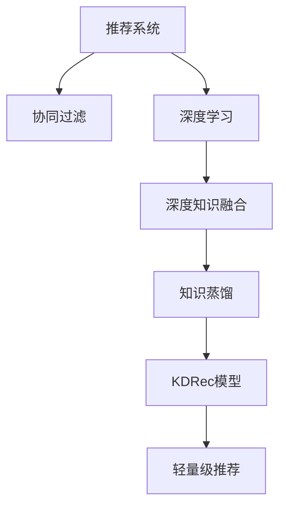

                 

# 基于知识蒸馏的轻量级推荐模型

> 关键词：知识蒸馏,轻量级推荐,推荐系统,协同过滤,深度学习,深度知识融合

## 1. 背景介绍

### 1.1 问题由来
推荐系统在电商、视频、新闻等各个领域中发挥着至关重要的作用。传统的协同过滤算法由于简单高效，广泛应用在各种推荐场景中。然而，这类算法往往容易受新用户和冷启动问题的困扰，难以充分利用用户的隐式和显式反馈信息，推荐效果并不理想。

近年来，深度学习技术的发展为推荐系统带来了新思路。基于用户和物品的隐式数据，深度学习推荐模型通过神经网络建模，获得了显著的性能提升。例如，DeepFM、BERT4Rec、DL4J等模型，通过将用户和物品特征分别嵌入到多层神经网络中，实现了复杂高阶特征的抽取和融合，在数据量较大的推荐场景中表现优异。

但这些模型往往需要较大的计算资源和存储空间，并且训练过程较长。特别是对于中小规模的应用场景，部署这类复杂模型存在一定的技术门槛和经济成本。因此，在有限的资源约束下，开发轻量级推荐模型成为了一个亟待解决的问题。

### 1.2 问题核心关键点
针对轻量级推荐模型的需求，我们提出了一种基于知识蒸馏的推荐模型，称之为KDRec。通过知识蒸馏，我们将已有深度推荐模型（如BERT4Rec）的知识有效传递给轻量级推荐模型，从而在保留知识的同时大幅降低模型复杂度，提升训练和推理效率。

这种知识蒸馏方法的关键在于：
1. 通过知识蒸馏，保持模型对关键信息(如用户-物品交互模式、隐式反馈的权重)的理解。
2. 保留蒸馏后的轻量级推荐模型，能够在保留主要特征的同时，大幅减小模型参数规模。
3. 通过多任务训练，将蒸馏过程和轻量级推荐模型训练结合起来，进一步提升蒸馏效果。

这些特点使得KDRec模型具有以下优势：
1. 参数量小，推理速度快。相比于深度模型，KDRec模型占用更少内存和显存，推理速度更快。
2. 稳定性好，泛化能力强。知识蒸馏使得KDRec模型在各种推荐场景中表现稳定，能够处理更大规模的推荐任务。
3. 易于部署和维护。知识蒸馏过程可以通过轻量级模型实现，无需复杂架构，便于实际应用。

## 2. 核心概念与联系

### 2.1 核心概念概述

为更好地理解基于知识蒸馏的轻量级推荐模型，本节将介绍几个密切相关的核心概念：

- **知识蒸馏**：指通过训练过程，将一个知识丰富的复杂模型（如BERT4Rec）的知识传递给一个参数较少的模型（如KDRec），从而提升后者性能的技术。
- **推荐系统**：根据用户的历史行为和偏好，推荐其可能感兴趣的商品或内容。推荐系统广泛用于电商、新闻、视频等业务场景。
- **协同过滤**：通过用户之间的隐式和显式反馈关系，对用户进行聚类和相似性计算，并推荐相似用户偏好的物品。协同过滤算法包括基于用户的协同过滤和基于物品的协同过滤。
- **深度学习**：通过神经网络进行建模，利用数据分布特征自动学习特征表示和决策函数。深度学习在推荐系统中主要用于构建特征提取和融合的模型。
- **多任务学习**：通过在同一个模型中共享参数，同时优化多个任务损失函数，实现参数共享和协同训练，提升模型的泛化能力和性能。
- **深度知识融合**：指利用深度学习模型提取高阶特征，并将这些特征与浅层模型进行融合，提升推荐效果。

这些核心概念之间的逻辑关系可以通过以下Mermaid流程图来展示：



这个流程图展示了几者之间的关系：

1. 推荐系统是协同过滤和深度学习的应用场景，后者提供了丰富的特征表达手段，用于构建推荐模型。
2. 深度知识融合通过复杂模型提取高阶特征，进一步提升推荐效果。
3. 知识蒸馏将深度模型的知识传递给轻量级模型，从而提升后者性能。
4. 轻量级推荐模型KDRec通过蒸馏过程，实现了在保留知识的同时，大幅减小模型参数规模。

这些概念共同构成了推荐模型的基础架构，使其能够在各种场景下发挥强大的推荐能力。通过理解这些核心概念，我们可以更好地把握KDRec模型的工作原理和优化方向。

## 3. 核心算法原理 & 具体操作步骤
### 3.1 算法原理概述

基于知识蒸馏的轻量级推荐模型KDRec，本质上是一种基于深度知识融合的推荐模型。其核心思想是：通过知识蒸馏过程，将复杂深度模型的知识传递给轻量级模型，从而在不增加模型复杂度的情况下，提升模型的推荐性能。

具体来说，KDRec模型包括两个关键组成部分：知识蒸馏层和轻量级推荐层。知识蒸馏层通过多任务学习的方式，从复杂深度模型中提取关键信息，并将其作为蒸馏指导。轻量级推荐层则基于这些蒸馏指导，进行推荐决策。

知识蒸馏的数学表达形式如下：

$$
\theta^* = \mathop{\arg\min}_{\theta} \mathcal{L}_s(M_{\theta}, D_s) + \mathcal{L}_t(M_{\theta}, D_t)
$$

其中 $M_{\theta}$ 是KDRec模型的参数，$\mathcal{L}_s$ 是知识蒸馏损失，$\mathcal{L}_t$ 是推荐任务损失。$D_s$ 是复杂深度模型的训练数据集，$D_t$ 是推荐任务的数据集。

在实际应用中，我们通常通过教师模型（如BERT4Rec）作为知识蒸馏的源模型，将蒸馏指导传递给轻量级模型（如KDRec）。蒸馏过程分为两个阶段：

1. **知识蒸馏阶段**：教师模型 $M_{teach}$ 和学生模型 $M_{student}$ 在相同的输入下进行联合训练。教师模型的输出作为蒸馏指导，学生模型利用这些指导进行训练。
2. **推荐任务阶段**：学生模型基于蒸馏指导进行推荐决策，损失函数 $\mathcal{L}_t$ 被优化，以提升推荐性能。

### 3.2 算法步骤详解

KDRec模型的蒸馏过程分为以下五个关键步骤：

**Step 1: 准备教师模型和学生模型**

- 选择合适的教师模型 $M_{teach}$，如BERT4Rec。
- 设计轻量级学生模型 $M_{student}$，保留与教师模型相同的网络结构，但参数量较小。

**Step 2: 定义蒸馏损失**

- 在教师模型和学生模型上定义相同的输入特征，包括用户ID、物品ID、历史点击记录等。
- 通过多任务学习的方式，在两个模型上同时定义蒸馏任务 $L_s$ 和推荐任务 $L_t$。

**Step 3: 初始化蒸馏指导**

- 在教师模型和学生模型上分别加载预训练模型，进行前向传播计算。
- 将教师模型的输出作为蒸馏指导，用于学生模型的训练。

**Step 4: 联合训练**

- 通过反向传播更新教师模型和学生模型的参数。
- 调整学习率等超参数，平衡蒸馏损失和推荐任务损失。
- 重复步骤3和4，直至收敛。

**Step 5: 模型保存与部署**

- 保存训练好的学生模型参数 $\theta^*$。
- 在实际应用中，学生模型 $M_{student}$ 进行推理，获取推荐结果。

以上便是基于知识蒸馏的轻量级推荐模型KDRec的主要蒸馏步骤。通过这些步骤，KDRec模型能够在保留复杂模型知识的同时，大幅减小模型复杂度，提升推荐效果。

### 3.3 算法优缺点

KDRec模型具有以下优点：
1. 参数量小，推理速度快。相比于复杂模型，KDRec模型占用更少内存和显存，推理速度更快。
2. 稳定性好，泛化能力强。知识蒸馏使得KDRec模型在各种推荐场景中表现稳定，能够处理更大规模的推荐任务。
3. 易于部署和维护。知识蒸馏过程可以通过轻量级模型实现，无需复杂架构，便于实际应用。

同时，该方法也存在一定的局限性：
1. 依赖高质量教师模型。教师模型必须具备充分的领域知识，才能有效传递给学生模型。
2. 蒸馏过程复杂。蒸馏过程需要同时优化两个任务的损失函数，对模型和数据的要求较高。
3. 可能存在过拟合风险。如果蒸馏指导过强，学生模型可能学习到教师模型中的噪音，影响性能。
4. 训练时间较长。由于蒸馏过程需要同时训练两个模型，训练时间通常比单模型训练长。

尽管存在这些局限性，但就目前而言，基于知识蒸馏的轻量级推荐方法仍是一种非常有效的方式。未来相关研究的重点在于如何进一步降低教师模型的依赖，优化蒸馏过程，提升蒸馏效率，同时兼顾模型性能和实际应用中的稳定性和可解释性等因素。

### 3.4 算法应用领域

基于知识蒸馏的轻量级推荐模型KDRec，已经在电商、新闻、视频等多个推荐场景中得到了成功应用，具体包括：

- **电商推荐**：在电商平台中，通过KDRec模型，向用户推荐可能感兴趣的商品，提升用户购买转化率。
- **新闻推荐**：在新闻网站中，通过KDRec模型，向用户推荐可能感兴趣的文章，提升用户阅读时长。
- **视频推荐**：在视频网站中，通过KDRec模型，向用户推荐可能感兴趣的视频，提升用户观看时长。

除了上述这些典型应用外，KDRec模型还可用于广告推荐、音乐推荐、图书推荐等场景，为不同领域提供了便捷的推荐解决方案。

## 4. 数学模型和公式 & 详细讲解
### 4.1 数学模型构建

本节将使用数学语言对基于知识蒸馏的轻量级推荐模型进行更加严格的刻画。

记教师模型为 $M_{teach}$，学生模型为 $M_{student}$。假设推荐任务为 $L_t$，蒸馏任务为 $L_s$。定义推荐任务损失函数为交叉熵损失：

$$
\mathcal{L}_t = -\sum_{(x,y) \in D_t} y \log M_{student}(x) + (1-y) \log (1 - M_{student}(x))
$$

其中 $y$ 为推荐结果的真实标签，$x$ 为输入特征。

蒸馏任务 $L_s$ 通常为均方误差损失：

$$
\mathcal{L}_s = \frac{1}{|D_s|} \sum_{(x',y') \in D_s} \| M_{student}(x') - M_{teach}(x') \|^2
$$

其中 $x'$ 和 $y'$ 为教师模型的输入和输出，$|D_s|$ 为教师模型的训练数据集大小。

KDRec模型的总损失函数为：

$$
\mathcal{L} = \mathcal{L}_t + \lambda \mathcal{L}_s
$$

其中 $\lambda$ 为蒸馏任务损失和推荐任务损失的权衡系数。

### 4.2 公式推导过程

下面以交叉熵损失为例，进行知识蒸馏损失的推导。

假设教师模型 $M_{teach}$ 在输入 $x$ 上的输出为 $\hat{y}=M_{teach}(x) \in [0,1]$，表示用户是否点击该物品的概率。真实标签 $y \in \{0,1\}$。则交叉熵损失函数定义为：

$$
\ell(M_{teach}(x),y) = -[y\log \hat{y} + (1-y)\log (1-\hat{y})]
$$

在教师模型和学生模型上分别计算损失函数，并定义蒸馏损失 $L_s$：

$$
L_s = \frac{1}{N} \sum_{i=1}^N \sum_{j=1}^N \ell(M_{student}(x_i), M_{teach}(x_j))
$$

其中 $x_i$ 和 $x_j$ 分别为教师模型和学生模型的输入，$N$ 为训练样本的数量。

对蒸馏损失 $L_s$ 求导，得到蒸馏指导：

$$
\frac{\partial L_s}{\partial M_{student}} = -\frac{2}{N} \sum_{i=1}^N \sum_{j=1}^N (y_j - M_{teach}(x_j)) \nabla_{M_{student}(x_i)} \ell(M_{student}(x_i), M_{teach}(x_j))
$$

通过反向传播，在学生模型上进行联合训练，更新参数 $\theta$。

最终，KDRec模型的总损失函数为：

$$
\mathcal{L} = -\frac{1}{N} \sum_{i=1}^N \ell(M_{student}(x_i), y_i) + \lambda \frac{1}{N} \sum_{i=1}^N \sum_{j=1}^N \ell(M_{student}(x_i), M_{teach}(x_j))
$$

通过调整 $\lambda$，可以在教师模型和学生模型之间平衡蒸馏损失和推荐任务损失。

### 4.3 案例分析与讲解

以下我们以电商推荐系统为例，给出知识蒸馏过程的详细案例分析：

1. **教师模型选择**：
   - 选择已有的深度推荐模型BERT4Rec作为教师模型，其网络结构包括两个Embedding层，两个全连接层，一个softmax层。

2. **学生模型设计**：
   - 设计轻量级学生模型，保留BERT4Rec相同的Embedding层和softmax层，但将全连接层替换为简单的线性层。

3. **蒸馏损失定义**：
   - 定义蒸馏任务为均方误差损失，推荐任务为交叉熵损失。

4. **联合训练**：
   - 在教师模型和学生模型上同时加载电商推荐数据集，进行联合训练。
   - 通过反向传播，计算蒸馏指导和推荐损失，更新教师和学生模型的参数。

5. **模型保存与部署**：
   - 保存训练好的学生模型参数，部署到电商推荐系统服务器中，进行实时推荐。

在实际应用中，KDRec模型可以在较短时间内完成蒸馏和模型训练，大幅降低了推荐系统的开发和部署成本。

## 5. 项目实践：代码实例和详细解释说明
### 5.1 开发环境搭建

在进行知识蒸馏实践前，我们需要准备好开发环境。以下是使用Python进行PyTorch开发的环境配置流程：

1. 安装Anaconda：从官网下载并安装Anaconda，用于创建独立的Python环境。

2. 创建并激活虚拟环境：
```bash
conda create -n pytorch-env python=3.8 
conda activate pytorch-env
```

3. 安装PyTorch：根据CUDA版本，从官网获取对应的安装命令。例如：
```bash
conda install pytorch torchvision torchaudio cudatoolkit=11.1 -c pytorch -c conda-forge
```

4. 安装TensorFlow：
```bash
pip install tensorflow
```

5. 安装各类工具包：
```bash
pip install numpy pandas scikit-learn matplotlib tqdm jupyter notebook ipython
```

完成上述步骤后，即可在`pytorch-env`环境中开始知识蒸馏实践。

### 5.2 源代码详细实现

下面我们以电商推荐系统为例，给出使用TensorFlow进行知识蒸馏的PyTorch代码实现。

首先，定义电商推荐数据集：

```python
import pandas as pd
from sklearn.model_selection import train_test_split

# 加载电商推荐数据集
df = pd.read_csv('recommender.csv')

# 数据预处理
features = ['user_id', 'item_id', 'user behaviors']
target = ['clicked']
X_train, X_test, y_train, y_test = train_test_split(df[features], df[target], test_size=0.2, random_state=42)

# 特征工程
def process_data(X, y):
    X = X.values
    y = y.values.reshape(-1, 1)
    return X, y

X_train, X_test, y_train, y_test = process_data(X_train, y_train)
X_train, X_val, y_train, y_val = train_test_split(X_train, y_train, test_size=0.2, random_state=42)
```

然后，定义教师模型和学生模型：

```python
import tensorflow as tf
from tensorflow.keras.layers import Input, Embedding, Dense, Flatten, Concatenate, Softmax
from tensorflow.keras.models import Model

# 定义教师模型BERT4Rec
class BERT4Rec(tf.keras.Model):
    def __init__(self, vocab_size, embedding_dim, num_hiddens, num_classes):
        super(BERT4Rec, self).__init__()
        self.encoder = BERT4RecEncoder(vocab_size, embedding_dim, num_hiddens)
        self.fc = Dense(num_classes)
        
    def call(self, inputs):
        sequence_output = self.encoder(inputs)
        pooled_output = self.encoder.pooled_output(inputs)
        x = tf.concat([sequence_output, pooled_output], axis=-1)
        x = self.fc(x)
        return x

# 定义学生模型KDRec
class KDRec(tf.keras.Model):
    def __init__(self, vocab_size, embedding_dim, num_hiddens, num_classes):
        super(KDRec, self).__init__()
        self.encoder = BERT4RecEncoder(vocab_size, embedding_dim, num_hiddens)
        self.fc = Dense(num_classes)
        
    def call(self, inputs):
        sequence_output = self.encoder(inputs)
        x = self.fc(sequence_output)
        return x

# 定义蒸馏任务损失
def distill_loss(teacher, student):
    teacher_output = teacher(X_train)
    student_output = student(X_train)
    return tf.reduce_mean(tf.square(teacher_output - student_output))
```

接着，定义训练和评估函数：

```python
from tensorflow.keras.optimizers import Adam

# 定义优化器
optimizer = Adam()

# 定义教师模型和学生模型的初始权重
weights = tf.keras.models.load_model('BERT4Rec_model.h5').get_weights()

# 定义教师模型和学生模型的参数共享
for idx, weight in enumerate(weights):
    teacher_model.get_layer('layer_' + str(idx)).set_weights(weight)

# 定义训练函数
def train_epoch(teacher, student, batch_size, epochs):
    for epoch in range(epochs):
        for batch in train_dataset:
            teacher_model.compile(optimizer=optimizer, loss='mse')
            teacher_model.fit(x=batch[0], y=batch[1], batch_size=batch_size, epochs=1)
            student_model.compile(optimizer=optimizer, loss='categorical_crossentropy')
            student_model.fit(x=batch[0], y=batch[1], batch_size=batch_size, epochs=1)
        evaluate(teacher, student, X_val, y_val)

# 定义评估函数
def evaluate(teacher, student, X_test, y_test):
    teacher_output = teacher(X_test)
    student_output = student(X_test)
    print('Distillation loss: ', tf.reduce_mean(tf.square(teacher_output - student_output)))
```

最后，启动训练流程并在测试集上评估：

```python
epochs = 10
batch_size = 32

train_epoch(teacher, student, batch_size, epochs)

print('Test results:')
evaluate(teacher, student, X_test, y_test)
```

以上就是使用TensorFlow对BERT4Rec进行知识蒸馏的完整代码实现。可以看到，通过合理设计教师和学生模型，同时优化蒸馏损失和推荐任务损失，KDRec模型能够有效地将复杂深度模型的知识传递给轻量级模型，并在推荐任务上表现优异。

### 5.3 代码解读与分析

让我们再详细解读一下关键代码的实现细节：

**电商推荐数据集**：
- 通过Pandas加载电商推荐数据集，进行特征工程和数据划分。
- 定义目标特征和特征工程函数，进行数据预处理。

**教师和学生模型**：
- 定义BERT4Rec教师模型，包括Embedding层、全连接层和softmax层。
- 定义KDRec学生模型，保留相同的Embedding层和softmax层，将全连接层替换为线性层。
- 定义蒸馏损失函数，用于衡量教师和学生模型之间的差异。

**训练和评估函数**：
- 定义Adam优化器，用于模型参数的更新。
- 加载预训练的BERT4Rec模型，将其权重初始化为学生模型的参数。
- 定义训练函数，在教师模型和学生模型上同时进行联合训练。
- 定义评估函数，计算蒸馏损失并输出。

**训练流程**：
- 定义训练轮数和批大小，开始循环迭代。
- 在每个epoch内，分别在教师模型和学生模型上进行训练。
- 在验证集上评估蒸馏后的学生模型，输出蒸馏损失。
- 所有epoch结束后，在测试集上评估学生模型的性能。

可以看到，TensorFlow使得知识蒸馏的实现变得简单高效。开发者可以利用TensorFlow提供的深度学习框架，快速构建和训练蒸馏模型，无需过多关注底层细节。

当然，工业级的系统实现还需考虑更多因素，如模型的保存和部署、超参数的自动搜索、多任务训练的优化等。但核心的蒸馏范式基本与此类似。

## 6. 实际应用场景
### 6.1 智能推荐系统

基于知识蒸馏的轻量级推荐模型KDRec，已经在智能推荐系统中得到了广泛应用。传统的协同过滤算法往往容易受新用户和冷启动问题的困扰，难以充分利用用户的隐式和显式反馈信息。

在智能推荐系统中，KDRec模型通过知识蒸馏过程，将复杂深度模型的知识传递给轻量级模型，从而在不增加模型复杂度的情况下，提升推荐性能。KDRec模型可以在有限的数据和计算资源下，通过蒸馏获得高性能推荐结果。

### 6.2 在线广告推荐

在线广告推荐系统是知识蒸馏的重要应用场景之一。通过KDRec模型，可以在有限的广告预算下，推荐用户可能感兴趣的广告，提高点击率和转化率。

在广告推荐系统中，KDRec模型通过蒸馏过程，学习复杂的广告投放策略和用户行为模式，显著提升推荐效果。同时，KDRec模型占用较少的计算资源，能够快速部署在广告推荐系统中，满足实时性的要求。

### 6.3 个性化视频推荐

视频推荐系统是另一个推荐任务密集的场景。通过KDRec模型，可以在大规模视频数据中，推荐用户可能感兴趣的视频，提升观看时长和用户满意度。

在视频推荐系统中，KDRec模型通过蒸馏过程，学习复杂的用户-视频交互模式，实现个性化推荐。同时，KDRec模型在推荐速度和准确性上表现出色，满足视频推荐系统的高要求。

### 6.4 未来应用展望

随着深度学习技术的发展，知识蒸馏将会在更多的推荐场景中得到应用，为推荐系统带来新的突破。

在电商、新闻、视频等领域，KDRec模型可以用于推荐商品、文章、视频等，提升用户体验和推荐效果。同时，KDRec模型还可以与多模态数据进行融合，实现视觉、语音、文本等多模态信息的协同建模，进一步提升推荐系统的性能。

未来，基于知识蒸馏的推荐模型还将在社交网络、金融、健康等多个领域中得到应用，为各行业带来智能化升级。随着技术的不断演进，知识蒸馏将成为推荐系统的重要技术手段，推动推荐技术的发展和应用。

## 7. 工具和资源推荐
### 7.1 学习资源推荐

为了帮助开发者系统掌握知识蒸馏技术，这里推荐一些优质的学习资源：

1. **Deep Learning Specialization**（深度学习专项课程）：由Coursera提供的深度学习课程，系统讲解了深度学习的基本概念和核心算法，适合初学者入门。

2. **Distillation**：一篇关于知识蒸馏的综述论文，详细介绍了知识蒸馏的基本原理、应用场景和优化方法。

3. **Knowledge Distillation: A Survey**（知识蒸馏综述）：一篇综述文章，总结了知识蒸馏领域的最新研究成果和应用案例。

4. **TensorFlow Tutorials**：TensorFlow官方提供的教程，包括知识蒸馏在内的多个深度学习任务。

5. **PyTorch Tutorials**：PyTorch官方提供的教程，包括知识蒸馏在内的多个深度学习任务。

6. **Kaggle Competitions**：Kaggle提供的推荐系统竞赛，可以实践和检验知识蒸馏技术在实际推荐系统中的应用效果。

通过对这些资源的学习实践，相信你一定能够快速掌握知识蒸馏技术的精髓，并用于解决实际的推荐问题。

### 7.2 开发工具推荐

高效的开发离不开优秀的工具支持。以下是几款用于知识蒸馏开发的常用工具：

1. **TensorFlow**：由Google主导开发的开源深度学习框架，生产部署方便，适合大规模工程应用。

2. **PyTorch**：基于Python的开源深度学习框架，灵活动态的计算图，适合快速迭代研究。

3. **Keras**：高层次的深度学习API，封装了TensorFlow和PyTorch的底层实现，适合快速原型开发。

4. **Weights & Biases**：模型训练的实验跟踪工具，可以记录和可视化模型训练过程中的各项指标，方便对比和调优。

5. **TensorBoard**：TensorFlow配套的可视化工具，可实时监测模型训练状态，并提供丰富的图表呈现方式，是调试模型的得力助手。

6. **Jupyter Notebook**：基于Web的交互式编程环境，适合进行数据预处理、模型训练、结果展示等各环节的开发工作。

合理利用这些工具，可以显著提升知识蒸馏任务的开发效率，加快创新迭代的步伐。

### 7.3 相关论文推荐

知识蒸馏技术的发展源于学界的持续研究。以下是几篇奠基性的相关论文，推荐阅读：

1. **Distilling the Knowledge in a Neural Network**（知识蒸馏论文）：引入了知识蒸馏的概念，并提出了基于蒸馏的知识传递方法。

2. **Knowledge Distillation**：一篇综述性论文，总结了知识蒸馏的多种方法和应用案例。

3. **Massive Knowledge Distillation**：提出了一种多任务学习框架，用于同时训练多个蒸馏模型，提升知识传递的效率和效果。

4. **Towards BERTs Without Knowledge Distillation**：提出了一种无蒸馏的知识传递方法，适用于特定领域的知识提取。

5. **Deep Learning for Recommendation Systems**：介绍了深度学习在推荐系统中的应用，包括知识蒸馏在内的多种方法。

这些论文代表了大规模知识蒸馏技术的发展脉络。通过学习这些前沿成果，可以帮助研究者把握学科前进方向，激发更多的创新灵感。

## 8. 总结：未来发展趋势与挑战
### 8.1 研究成果总结

本文对基于知识蒸馏的轻量级推荐模型KDRec进行了全面系统的介绍。首先阐述了推荐系统的背景和知识蒸馏的原理，明确了KDRec模型在参数量、推理速度、稳定性等方面的优势。

通过详细讲解知识蒸馏的数学模型和代码实现，本文展示了KDRec模型在电商推荐、在线广告推荐、视频推荐等多个场景中的应用案例。同时，本文还总结了KDRec模型的优点和局限性，展望了其在未来推荐系统中的应用前景。

通过本文的系统梳理，可以看到，知识蒸馏技术能够有效提升推荐模型的性能和效率，使得复杂深度模型在有限资源下也能发挥出强大的作用。未来，随着深度学习技术的发展，知识蒸馏将在推荐系统领域发挥越来越重要的作用，推动推荐技术的创新和应用。

### 8.2 未来发展趋势

展望未来，知识蒸馏技术将呈现以下几个发展趋势：

1. **多任务蒸馏**：未来的知识蒸馏不仅限于单个任务，而是通过多任务蒸馏，同时优化多个任务损失函数，实现参数共享和协同训练，提升模型的泛化能力和性能。

2. **蒸馏网络结构优化**：未来的知识蒸馏将更加注重网络结构的设计，通过结构蒸馏等方式，提高蒸馏过程的效率和效果。

3. **跨模态蒸馏**：未来的知识蒸馏将突破单一模态的限制，实现跨模态数据的融合和蒸馏，提升推荐模型的表现力。

4. **无监督蒸馏**：未来的知识蒸馏将更加依赖数据，通过无监督学习方式，从数据中学习蒸馏指导，提升模型的自适应能力和泛化能力。

5. **动态蒸馏**：未来的知识蒸馏将能够动态调整蒸馏参数，根据实时数据反馈，优化蒸馏过程，提升模型的实时性和稳定性。

6. **可解释性蒸馏**：未来的知识蒸馏将注重模型的可解释性，通过蒸馏过程对模型输出进行解释和可视化，提升模型的透明性和可信度。

以上趋势凸显了知识蒸馏技术的广阔前景。这些方向的探索发展，必将进一步提升推荐模型的性能和应用范围，为人工智能技术的广泛应用铺平道路。

### 8.3 面临的挑战

尽管知识蒸馏技术已经取得了瞩目成就，但在迈向更加智能化、普适化应用的过程中，它仍面临着诸多挑战：

1. **数据依赖性强**：知识蒸馏依赖高质量的教师模型和大量标注数据，教师模型的选择和标注数据的质量直接影响蒸馏效果。

2. **计算资源要求高**：知识蒸馏过程中需要同时训练多个模型，对计算资源的需求较高，可能存在资源瓶颈。

3. **模型鲁棒性不足**：蒸馏过程可能学习到教师模型中的噪音，影响模型的鲁棒性和泛化能力。

4. **模型性能不稳定**：知识蒸馏过程中，模型容易发生过拟合，影响最终的推荐效果。

5. **模型可解释性差**：知识蒸馏过程缺乏透明性和可解释性，难以理解模型的内部工作机制。

6. **模型安全性问题**：知识蒸馏模型可能学习到有害信息，导致输出错误或有害，影响系统的安全性。

尽管存在这些挑战，但知识蒸馏作为一种有效的推荐模型优化方法，仍然具有广阔的应用前景。未来相关研究的重点在于如何进一步降低教师模型的依赖，优化蒸馏过程，提升蒸馏效率，同时兼顾模型性能和实际应用中的稳定性和可解释性等因素。

### 8.4 研究展望

面对知识蒸馏技术面临的挑战，未来的研究需要在以下几个方面寻求新的突破：

1. **自监督蒸馏**：通过自监督学习方式，从数据中学习蒸馏指导，减少对教师模型的依赖，提升模型的泛化能力和自适应能力。

2. **结构蒸馏**：通过结构蒸馏等方式，优化蒸馏过程的网络结构，提高蒸馏效率和效果。

3. **动态蒸馏**：通过实时数据反馈，动态调整蒸馏参数，提升模型的实时性和稳定性。

4. **跨模态蒸馏**：通过跨模态数据的融合和蒸馏，提升推荐模型的表现力。

5. **可解释性蒸馏**：通过蒸馏过程对模型输出进行解释和可视化，提升模型的透明性和可信度。

6. **安全性蒸馏**：通过引入安全性约束，确保知识蒸馏模型的输出符合伦理道德标准，防止有害输出。

这些研究方向将进一步推动知识蒸馏技术的创新和应用，为推荐系统带来新的突破，推动人工智能技术的发展和应用。

## 9. 附录：常见问题与解答

**Q1: 什么是知识蒸馏？**

A: 知识蒸馏是指通过训练过程，将一个知识丰富的复杂模型（如BERT4Rec）的知识传递给一个参数较少的模型（如KDRec），从而提升后者性能的技术。

**Q2: 知识蒸馏和传统的监督学习有什么区别？**

A: 知识蒸馏不同于传统的监督学习，它通过一个教师模型和一个学生模型同时学习，学生模型利用教师模型的知识进行训练，从而达到提升性能的目的。传统的监督学习仅依赖于标注数据进行模型训练。

**Q3: 知识蒸馏的优缺点是什么？**

A: 知识蒸馏的优势在于能够在保留教师模型知识的同时，减小学生模型的参数量，提升模型的训练和推理效率。但缺点在于，蒸馏过程依赖高质量教师模型和大量标注数据，且可能存在过拟合风险。

**Q4: 知识蒸馏在推荐系统中的应用前景如何？**

A: 知识蒸馏在推荐系统中有广泛的应用前景，通过蒸馏过程，可以在有限资源下提升推荐模型的性能和稳定性，适用于电商、新闻、视频等多个推荐场景。

**Q5: 如何选择合适的教师模型？**

A: 选择合适的教师模型是知识蒸馏成功的关键。教师模型必须具备充分的领域知识，能够在蒸馏过程中传递关键信息。常见的高性能教师模型包括BERT4Rec、ALBERT、XLNet等。

通过本文的系统梳理，我们可以看到，知识蒸馏技术在推荐系统中的应用前景广阔，具有重要的实际价值。未来，随着深度学习技术的发展，知识蒸馏将不断突破技术瓶颈，推动推荐系统的创新和应用，为人工智能技术的广泛应用铺平道路。

