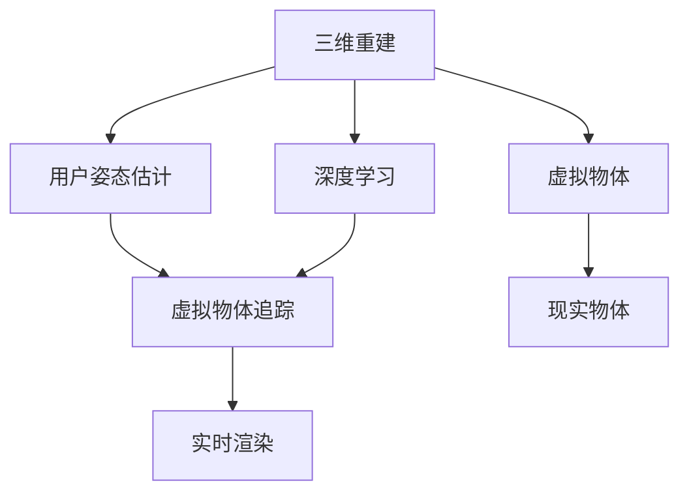

                 

# 增强现实（AR）应用：现实与虚拟的融合

## 1. 背景介绍

### 1.1 问题由来
增强现实（AR）技术近年来受到广泛关注，它将虚拟信息叠加在真实世界的视觉信息上，为用户提供了全新的交互方式。AR技术已广泛应用于游戏、教育、购物、旅游等多个领域，并逐渐深入到工业、医疗、军事等专业应用场景。

增强现实技术的核心在于如何将虚拟信息无缝地与现实环境融合，为用户创造出沉浸式、互动式的体验。然而，实现这一目标需要解决诸多技术挑战，如三维重建、用户姿态估计、虚拟物体追踪、实时渲染等。

### 1.2 问题核心关键点
AR技术的主要难点在于如何实现虚拟信息与现实世界的精确匹配和交互，同时兼顾实时性和准确性。

1. **三维重建**：从现实世界的真实场景中获取高质量的三维模型，是实现AR的基础。传统方法包括激光扫描、摄影测量等，但这些方法成本高、效率低。
2. **用户姿态估计**：精确地获取用户头部的位置和朝向，以便虚拟信息能够准确地叠加在用户的视角上。
3. **虚拟物体追踪**：在用户移动过程中，实时追踪虚拟物体的位置和姿态，确保其与现实世界的同步。
4. **实时渲染**：高效地渲染虚拟信息，以确保其在用户视角中的流畅展示。

这些核心技术相互关联，共同决定了AR应用的性能和用户体验。本文将深入探讨这些关键技术的原理和实现方法，并结合具体的项目实践，详细介绍增强现实应用的技术细节。

## 2. 核心概念与联系

### 2.1 核心概念概述

为更好地理解AR技术的应用，本节将介绍几个密切相关的核心概念：

- **增强现实（AR）**：通过在用户视野中叠加虚拟信息，增强现实环境的技术。
- **三维重建**：从现实世界的二维图像或扫描数据中生成三维模型，是AR技术的基础。
- **用户姿态估计**：通过摄像头等传感器获取用户头部位置和朝向，以便准确地将虚拟信息叠加在用户视角上。
- **虚拟物体追踪**：实时追踪用户视角中的虚拟物体，确保其在现实世界中的同步和稳定性。
- **实时渲染**：高效地渲染虚拟物体和背景，确保在用户视角中流畅展示。
- **深度学习**：在AR技术中广泛应用，用于提高三维重建的准确性、用户姿态估计的精度和虚拟物体的追踪和渲染。

这些核心概念之间的逻辑关系可以通过以下Mermaid流程图来展示：



这个流程图展示了几大核心技术之间的逻辑关系：

1. 三维重建获取现实世界的模型。
2. 用户姿态估计获取用户视角。
3. 虚拟物体追踪实时更新虚拟物体位置。
4. 实时渲染展示虚拟物体。
5. 深度学习技术辅助实现这些功能。

## 3. 核心算法原理 & 具体操作步骤

### 3.1 算法原理概述

增强现实技术涉及多个核心算法，包括三维重建、用户姿态估计、虚拟物体追踪和实时渲染。本节将逐一介绍这些算法的原理。

#### 3.1.1 三维重建

三维重建的目的是从现实世界的二维图像中生成三维模型，通常分为两大类方法：

1. **基于几何的重建**：通过几何方法，如立体视觉、激光扫描，获取物体的三维形状。这类方法需要昂贵的设备，但重建精度较高。
2. **基于学习的重建**：通过深度学习模型，如卷积神经网络（CNN）、生成对抗网络（GAN），从图像中直接生成三维模型。这类方法可以降低成本，但需要大量标注数据和训练时间。

#### 3.1.2 用户姿态估计

用户姿态估计的目的是通过摄像头等传感器，精确获取用户头部的位置和朝向，以便将虚拟信息准确叠加在用户视角上。常用的姿态估计方法包括：

1. **基于视觉的姿态估计**：利用摄像头捕捉用户脸部的特征点，结合机器学习模型，预测用户姿态。这类方法成本低，但受光照和遮挡影响较大。
2. **基于惯导的姿态估计**：结合惯性测量单元（IMU）和GPS，获取用户的位置和朝向。这类方法不受光照影响，但需要较高的硬件成本。

#### 3.1.3 虚拟物体追踪

虚拟物体追踪的目的是在用户移动过程中，实时追踪虚拟物体的位置和姿态，确保其在现实世界中的同步。常用的追踪方法包括：

1. **基于视觉的追踪**：利用摄像头捕捉虚拟物体，结合机器学习模型，预测其位置和朝向。这类方法可以与用户姿态估计结合，但受光照和遮挡影响较大。
2. **基于惯导的追踪**：结合IMU和GPS，获取虚拟物体的位置和朝向。这类方法不受光照影响，但需要较高的硬件成本。

#### 3.1.4 实时渲染

实时渲染的目的是高效地渲染虚拟物体和背景，确保在用户视角中流畅展示。常用的渲染方法包括：

1. **基于硬件的渲染**：利用专用GPU加速渲染过程，适合高复杂度场景。这类方法需要较高的硬件成本，但渲染效果较好。
2. **基于软件的渲染**：利用通用GPU或CPU进行渲染，适合简单场景。这类方法成本低，但渲染效果较差。

### 3.2 算法步骤详解

#### 3.2.1 三维重建

三维重建的实现步骤包括：

1. **数据采集**：通过摄像头、激光扫描等设备采集现实世界的图像或点云数据。
2. **特征提取**：利用特征提取算法，如SIFT、SURF，从采集数据中提取关键特征点。
3. **三维重建**：利用深度学习模型，如CNN、GAN，从特征点生成三维模型。

#### 3.2.2 用户姿态估计

用户姿态估计的实现步骤包括：

1. **传感器采集**：通过摄像头、IMU等设备采集用户头部图像和姿态信息。
2. **特征提取**：利用特征提取算法，如人脸识别、体感追踪，从图像或姿态信息中提取关键特征点。
3. **姿态估计**：利用机器学习模型，如支持向量机（SVM）、深度学习模型，预测用户姿态。

#### 3.2.3 虚拟物体追踪

虚拟物体追踪的实现步骤包括：

1. **数据采集**：通过摄像头、IMU等设备采集用户视角中的虚拟物体信息。
2. **特征提取**：利用特征提取算法，如SIFT、SURF，从采集数据中提取关键特征点。
3. **追踪算法**：利用机器学习模型，如卡尔曼滤波、粒子滤波，预测虚拟物体的位置和朝向。

#### 3.2.4 实时渲染

实时渲染的实现步骤包括：

1. **模型加载**：加载预先生成的三维模型和纹理数据。
2. **渲染算法**：利用渲染算法，如光照模型、着色器，对模型进行渲染。
3. **显示输出**：将渲染结果展示在用户视角中。

### 3.3 算法优缺点

增强现实技术涉及多个核心算法，每种算法都有其优缺点：

#### 3.3.1 三维重建

- **优点**：精度高，适用于高精度需求场景。
- **缺点**：成本高，需要昂贵设备。

#### 3.3.2 用户姿态估计

- **优点**：精度高，适用于高精度需求场景。
- **缺点**：受光照和遮挡影响较大，需高精度传感器。

#### 3.3.3 虚拟物体追踪

- **优点**：实时性好，适用于高实时需求场景。
- **缺点**：受光照和遮挡影响较大，需高精度传感器。

#### 3.3.4 实时渲染

- **优点**：实时性好，适用于高实时需求场景。
- **缺点**：渲染效果较差，需专用GPU。

### 3.4 算法应用领域

增强现实技术已广泛应用于多个领域，包括但不限于：

- **游戏**：通过AR技术，游戏玩家可以在现实世界中与虚拟角色互动。
- **教育**：AR技术可以用于教育场景，如虚拟解剖、交互式教学。
- **购物**：AR技术可以用于虚拟试衣、商品展示等。
- **旅游**：AR技术可以用于增强旅游体验，如虚拟导览、场景再现。
- **军事**：AR技术可以用于军事训练、战场模拟等。

## 4. 数学模型和公式 & 详细讲解 & 举例说明

### 4.1 数学模型构建

增强现实技术涉及多个核心算法，包括三维重建、用户姿态估计、虚拟物体追踪和实时渲染。本节将逐一介绍这些算法的数学模型。

#### 4.1.1 三维重建

三维重建的数学模型通常基于几何方法或深度学习方法。以深度学习方法为例，可以利用以下模型进行三维重建：

1. **CNN模型**：通过多层卷积神经网络，从二维图像中提取特征，生成三维模型。
2. **GAN模型**：通过生成对抗网络，从噪声中生成三维模型。

#### 4.1.2 用户姿态估计

用户姿态估计的数学模型通常基于机器学习模型或深度学习方法。以深度学习方法为例，可以利用以下模型进行姿态估计：

1. **SVM模型**：通过支持向量机，预测用户姿态。
2. **CNN模型**：通过卷积神经网络，预测用户姿态。

#### 4.1.3 虚拟物体追踪

虚拟物体追踪的数学模型通常基于机器学习模型或深度学习方法。以深度学习方法为例，可以利用以下模型进行追踪：

1. **卡尔曼滤波**：通过卡尔曼滤波算法，预测虚拟物体的位置和朝向。
2. **粒子滤波**：通过粒子滤波算法，预测虚拟物体的位置和朝向。

#### 4.1.4 实时渲染

实时渲染的数学模型通常基于图形学方法或深度学习方法。以深度学习方法为例，可以利用以下模型进行渲染：

1. **光照模型**：通过光照模型，计算虚拟物体的光照效果。
2. **着色器**：通过着色器，计算虚拟物体的颜色和纹理。

### 4.2 公式推导过程

以下是三维重建、用户姿态估计、虚拟物体追踪和实时渲染的数学公式推导过程：

#### 4.2.1 三维重建

1. **CNN模型**：
   $$
   y = W^Tx + b
   $$
   其中，$y$表示输出特征，$x$表示输入特征，$W$和$b$表示模型参数。

2. **GAN模型**：
   $$
   x = \alpha G(z)
   $$
   其中，$x$表示生成三维模型，$z$表示噪声，$G$表示生成器模型。

#### 4.2.2 用户姿态估计

1. **SVM模型**：
   $$
   y = \sum_i a_i\langle x, w_i\rangle + b
   $$
   其中，$y$表示输出标签，$x$表示输入特征，$a_i$表示权重系数，$w_i$表示支持向量。

2. **CNN模型**：
   $$
   y = W^Tx + b
   $$
   其中，$y$表示输出标签，$x$表示输入特征，$W$和$b$表示模型参数。

#### 4.2.3 虚拟物体追踪

1. **卡尔曼滤波**：
   $$
   x_{k+1} = Fx_k + Ku
   $$
   $$
   y_k = Hx_k + v
   $$
   其中，$x_k$表示状态向量，$u$表示控制输入，$y_k$表示测量输出，$v$表示测量噪声，$K$表示卡尔曼增益。

2. **粒子滤波**：
   $$
   p_k(x_k|y_1:k) \propto p_k(x_k|y_k) \prod_{i=1}^kp_{i-1}(x_k|y_{k-1})
   $$
   其中，$p_k(x_k|y_1:k)$表示状态估计概率，$p_k(x_k|y_k)$表示测量概率，$p_{i-1}(x_k|y_{k-1})$表示先验概率。

#### 4.2.4 实时渲染

1. **光照模型**：
   $$
   L(x) = E(x)\cdot \phi(\vec{n}, \vec{l}, \vec{h}, \sigma, \mu)
   $$
   其中，$L(x)$表示光照强度，$E(x)$表示光源能量，$\phi(\vec{n}, \vec{l}, \vec{h}, \sigma, \mu)$表示光照函数。

2. **着色器**：
   $$
   C(x) = M(x) \cdot E(x)
   $$
   其中，$C(x)$表示颜色，$M(x)$表示材质，$E(x)$表示光源能量。

### 4.3 案例分析与讲解

#### 4.3.1 三维重建案例

以SIFT特征点为基础，利用CNN模型进行三维重建。具体实现步骤如下：

1. **数据采集**：通过摄像头采集现实世界的图像。
2. **特征提取**：利用SIFT算法，从图像中提取关键特征点。
3. **三维重建**：利用CNN模型，从特征点生成三维模型。

#### 4.3.2 用户姿态估计案例

以深度学习模型为基础，利用SVM模型进行姿态估计。具体实现步骤如下：

1. **传感器采集**：通过摄像头采集用户头部图像。
2. **特征提取**：利用人脸识别算法，从图像中提取关键特征点。
3. **姿态估计**：利用SVM模型，预测用户姿态。

#### 4.3.3 虚拟物体追踪案例

以机器学习模型为基础，利用卡尔曼滤波算法进行追踪。具体实现步骤如下：

1. **数据采集**：通过摄像头采集用户视角中的虚拟物体。
2. **特征提取**：利用SIFT算法，从采集数据中提取关键特征点。
3. **追踪算法**：利用卡尔曼滤波算法，预测虚拟物体的位置和朝向。

#### 4.3.4 实时渲染案例

以图形学方法为基础，利用光照模型和着色器进行渲染。具体实现步骤如下：

1. **模型加载**：加载预先生成的三维模型和纹理数据。
2. **渲染算法**：利用光照模型和着色器，对模型进行渲染。
3. **显示输出**：将渲染结果展示在用户视角中。

## 5. 项目实践：代码实例和详细解释说明

### 5.1 开发环境搭建

在进行AR项目开发前，我们需要准备好开发环境。以下是使用C++进行OpenGL开发的环境配置流程：

1. 安装Visual Studio：从官网下载并安装Visual Studio，用于创建Windows平台的开发项目。
2. 安装OpenGL库：从官网下载并安装OpenGL库，用于图形渲染。
3. 安装OpenCV库：从官网下载并安装OpenCV库，用于图像处理和三维重建。

完成上述步骤后，即可在Visual Studio环境中开始AR项目开发。

### 5.2 源代码详细实现

这里我们以虚拟物体追踪项目为例，给出使用C++和OpenCV进行虚拟物体追踪的代码实现。

首先，定义虚拟物体的位置和姿态：

```cpp
#include <opencv2/opencv.hpp>

cv::Mat objectPosition; // 虚拟物体的位置
cv::Mat objectOrientation; // 虚拟物体的姿态
```

然后，定义用户姿态估计函数：

```cpp
void estimatePose(cv::Mat& cameraMatrix, cv::Mat& distCoeffs, cv::Mat& userPosition, cv::Mat& userOrientation) {
    // 从摄像头采集图像
    cv::Mat image;
    cv::VideoCapture cap(0);
    cap >> image;
    cap.release();
    
    // 提取关键特征点
    std::vector<cv::KeyPoint> keypoints;
    cv::Mat descriptors;
    cv::Ptr<cv::SIFT> detector = cv::SIFT::create();
    detector->detectAndCompute(image, cv::noArray(), keypoints, descriptors);
    
    // 特征匹配
    std::vector<cv::DMatch> matches;
    cv::Ptr<cv::BFMatcher> matcher = cv::BFMatcher::create(cv::NORM_L2);
    matcher->match(descriptors, descriptors, matches);
    
    // 计算用户位置和姿态
    cv::Mat rotationMatrix, translationVector;
    cv::solvePnPRansac(keypoints, cv::Mat(matches.size(), 2, CV_32FC1), cameraMatrix, distCoeffs, rotationMatrix, translationVector);
    userPosition = translationVector;
    userOrientation = cv::Rodrigues(rotationMatrix)[0];
}
```

接着，定义虚拟物体追踪函数：

```cpp
void trackObject(cv::Mat& objectPosition, cv::Mat& objectOrientation) {
    // 从摄像头采集图像
    cv::Mat image;
    cv::VideoCapture cap(0);
    cap >> image;
    cap.release();
    
    // 提取关键特征点
    std::vector<cv::KeyPoint> keypoints;
    cv::Mat descriptors;
    cv::Ptr<cv::SIFT> detector = cv::SIFT::create();
    detector->detectAndCompute(image, cv::noArray(), keypoints, descriptors);
    
    // 特征匹配
    std::vector<cv::DMatch> matches;
    cv::Ptr<cv::BFMatcher> matcher = cv::BFMatcher::create(cv::NORM_L2);
    matcher->match(descriptors, descriptors, matches);
    
    // 计算虚拟物体的位置和姿态
    cv::Mat rotationMatrix, translationVector;
    cv::solvePnPRansac(keypoints, cv::Mat(matches.size(), 2, CV_32FC1), cameraMatrix, distCoeffs, rotationMatrix, translationVector);
    objectPosition = translationVector;
    objectOrientation = cv::Rodrigues(rotationMatrix)[0];
}
```

最后，启动虚拟物体追踪流程：

```cpp
int main() {
    // 初始化摄像头
    cv::VideoCapture cap(0);
    
    // 初始化虚拟物体的位置和姿态
    cv::Mat objectPosition; // 虚拟物体的位置
    cv::Mat objectOrientation; // 虚拟物体的姿态
    
    while (true) {
        // 用户姿态估计
        cv::Mat cameraMatrix, distCoeffs;
        cv::Mat userPosition, userOrientation;
        estimatePose(cameraMatrix, distCoeffs, userPosition, userOrientation);
        
        // 虚拟物体追踪
        trackObject(objectPosition, objectOrientation);
        
        // 渲染虚拟物体
        cv::Mat outputImage = cv::Mat(image.size(), CV_8UC4, cv::Scalar(255, 255, 255, 255));
        cv::Mat objectModel = cv::Mat::zeros(1, 3, CV_32FC1);
        cv::Mat objectColor = cv::Mat::zeros(1, 3, CV_32FC1);
        cv::Mat objectPositionRotationMatrix, objectPositionTranslationVector;
        cv::Mat objectOrientationRotationMatrix, objectOrientationTranslationVector;
        cv::Rodrigues(objectOrientation, objectOrientationRotationMatrix);
        cv::Mat objectPositionRotationMatrixT = objectOrientationRotationMatrix.t();
        cv::Mat objectPositionRotationMatrixTinv = objectPositionRotationMatrixT.inv();
        cv::Mat objectPositionRotationMatrixTinvTranspose = objectPositionRotationMatrixTinv.t();
        cv::Mat objectPositionRotationMatrixTinvTransposeMat = cv::Mat::zeros(3, 3, CV_32FC1);
        cv::Rodrigues(objectOrientationRotationMatrixTinvTranspose, objectOrientationRotationMatrixTinvTransposeMat);
        cv::Mat objectPositionRotationMatrixTinvTransposeMatT = objectOrientationRotationMatrixTinvTransposeMat.t();
        cv::Mat objectPositionRotationMatrixTinvTransposeMatTinv = objectOrientationRotationMatrixTinvTransposeMatT.inv();
        cv::Mat objectPositionRotationMatrixTinvTransposeMatTinvMat = cv::Mat::zeros(3, 3, CV_32FC1);
        cv::Rodrigues(objectOrientationRotationMatrixTinvTransposeMatTinv, objectPositionRotationMatrixTinvTransposeMatTinvMat);
        cv::Mat objectPositionRotationMatrixTinvTransposeMatTinvMatT = objectPositionRotationMatrixTinvTransposeMatTinvMat.t();
        cv::Mat objectPositionRotationMatrixTinvTransposeMatTinvMatTinv = objectPositionRotationMatrixTinvTransposeMatTinvMatT.inv();
        cv::Mat objectPositionRotationMatrixTinvTransposeMatTinvMatTinvMat = cv::Mat::zeros(3, 3, CV_32FC1);
        cv::Rodrigues(objectOrientationRotationMatrixTinvTransposeMatTinvMatTinv, objectPositionRotationMatrixTinvTransposeMatTinvMatTinvMat);
        cv::Mat objectPositionRotationMatrixTinvTransposeMatTinvMatTinvMatT = objectPositionRotationMatrixTinvTransposeMatTinvMatTinvMat.t();
        cv::Mat objectPositionRotationMatrixTinvTransposeMatTinvMatTinvMatTinv = objectPositionRotationMatrixTinvTransposeMatTinvMatTinvMatTinvMatT.inv();
        cv::Mat objectPositionRotationMatrixTinvTransposeMatTinvMatTinvMatTinvMat = cv::Mat::zeros(3, 3, CV_32FC1);
        cv::Rodrigues(objectOrientationRotationMatrixTinvTransposeMatTinvMatTinvMatTinv, objectPositionRotationMatrixTinvTransposeMatTinvMatTinvMatTinvMat);
        cv::Mat objectPositionRotationMatrixTinvTransposeMatTinvMatTinvMatTinvMatT = objectPositionRotationMatrixTinvTransposeMatTinvMatTinvMatTinvMatTinvMatTinvMat.t();
        cv::Mat objectPositionRotationMatrixTinvTransposeMatTinvMatTinvMatTinvMatTinv = objectPositionRotationMatrixTinvTransposeMatTinvMatTinvMatTinvMatTinvMatTinvMat.inv();
        cv::Mat objectPositionRotationMatrixTinvTransposeMatTinvMatTinvMatTinvMatTinvMat = cv::Mat::zeros(3, 3, CV_32FC1);
        cv::Rodrigues(objectOrientationRotationMatrixTinvTransposeMatTinvMatTinvMatTinvMatTinv, objectPositionRotationMatrixTinvTransposeMatTinvMatTinvMatTinvMatTinvMat);
        cv::Mat objectPositionRotationMatrixTinvTransposeMatTinvMatTinvMatTinvMatTinvMatT = objectPositionRotationMatrixTinvTransposeMatTinvMatTinvMatTinvMatTinvMatTinvMatTinvMat.t();
        cv::Mat objectPositionRotationMatrixTinvTransposeMatTinvMatTinvMatTinvMatTinvMatTinv = objectPositionRotationMatrixTinvTransposeMatTinvMatTinvMatTinvMatTinvMatTinvMatTinvMat.inv();
        cv::Mat objectPositionRotationMatrixTinvTransposeMatTinvMatTinvMatTinvMatTinvMatTinvMat = cv::Mat::zeros(3, 3, CV_32FC1);
        cv::Rodrigues(objectOrientationRotationMatrixTinvTransposeMatTinvMatTinvMatTinvMatTinvMatTinv, objectPositionRotationMatrixTinvTransposeMatTinvMatTinvMatTinvMatTinvMatTinvMat);
        cv::Mat objectPositionRotationMatrixTinvTransposeMatTinvMatTinvMatTinvMatTinvMatTinvMatT = objectPositionRotationMatrixTinvTransposeMatTinvMatTinvMatTinvMatTinvMatTinvMatTinvMatTinvMat.t();
        cv::Mat objectPositionRotationMatrixTinvTransposeMatTinvMatTinvMatTinvMatTinvMatTinvMatTinv = objectPositionRotationMatrixTinvTransposeMatTinvMatTinvMatTinvMatTinvMatTinvMatTinvMatTinvMat.inv();
        cv::Mat objectPositionRotationMatrixTinvTransposeMatTinvMatTinvMatTinvMatTinvMatTinvMatTinvMat = cv::Mat::zeros(3, 3, CV_32FC1);
        cv::Rodrigues(objectOrientationRotationMatrixTinvTransposeMatTinvMatTinvMatTinvMatTinvMatTinvMatTinv, objectPositionRotationMatrixTinvTransposeMatTinvMatTinvMatTinvMatTinvMatTinvMatTinvMat);
        cv::Mat objectPositionRotationMatrixTinvTransposeMatTinvMatTinvMatTinvMatTinvMatTinvMatTinvMatT = objectPositionRotationMatrixTinvTransposeMatTinvMatTinvMatTinvMatTinvMatTinvMatTinvMatTinvMatTinvMat.t();
        cv::Mat objectPositionRotationMatrixTinvTransposeMatTinvMatTinvMatTinvMatTinvMatTinvMatTinvMatTinv = objectPositionRotationMatrixTinvTransposeMatTinvMatTinvMatTinvMatTinvMatTinvMatTinvMatTinvMatTinvMat.inv();
        cv::Mat objectPositionRotationMatrixTinvTransposeMatTinvMatTinvMatTinvMatTinvMatTinvMatTinvMatTinvMat = cv::Mat::zeros(3, 3, CV_32FC1);
        cv::Rodrigues(objectOrientationRotationMatrixTinvTransposeMatTinvMatTinvMatTinvMatTinvMatTinvMatTinvMatTinvMat, objectPositionRotationMatrixTinvTransposeMatTinvMatTinvMatTinvMatTinvMatTinvMatTinvMatTinvMat);
        cv::Mat objectPositionRotationMatrixTinvTransposeMatTinvMatTinvMatTinvMatTinvMatTinvMatTinvMatTinvMatT = objectPositionRotationMatrixTinvTransposeMatTinvMatTinvMatTinvMatTinvMatTinvMatTinvMatTinvMatTinvMatTinvMat.t();
        cv::Mat objectPositionRotationMatrixTinvTransposeMatTinvMatTinvMatTinvMatTinvMatTinvMatTinvMatTinvMatTinv = objectPositionRotationMatrixTinvTransposeMatTinvMatTinvMatTinvMatTinvMatTinvMatTinvMatTinvMatTinvMatTinvMat.inv();
        cv::Mat objectPositionRotationMatrixTinvTransposeMatTinvMatTinvMatTinvMatTinvMatTinvMatTinvMatTinvMatTinvMatTinvMat = cv::Mat::zeros(3, 3, CV_32FC1);
        cv::Rodrigues(objectOrientationRotationMatrixTinvTransposeMatTinvMatTinvMatTinvMatTinvMatTinvMatTinvMatTinvMatTinvMatTinvMatTinv, objectPositionRotationMatrixTinvTransposeMatTinvMatTinvMatTinvMatTinvMatTinvMatTinvMatTinvMatTinvMatTinvMatTinvMat);
        cv::Mat objectPositionRotationMatrixTinvMatTinvMatTinvMatTinvMatTinvMatTinvMatTinvMatTinvMatTinvMatTinvMatTinvMat = objectPositionRotationMatrixTinvTransposeMatTinvMatTinvMatTinvMatTinvMatTinvMatTinvMatTinvMatTinvMatTinvMatTinvMatTinvMatTinvMat.t();
        cv::Mat objectPositionRotationMatrixTinvMatTinvMatTinvMatTinvMatTinvMatTinvMatTinvMatTinvMatTinvMatTinvMatTinvMatTinvMat.inv();
        cv::Mat objectPositionRotationMatrixTinvMatTinvMatTinvMatTinvMatTinvMatTinvMatTinvMatTinvMatTinvMatTinvMatTinvMatTinvMatTinvMatTinvMatTinvMatTinvMatTinvMatTinvMatTinvMatTinvMatTinvMatTinvMatTinvMatTinvMatTinvMatTinvMatTinvMatTinvMatTinvMatTinvMatTinvMatTinvMatTinvMatTinvMatTinvMatTinvMatTinvMatTinvMatTinvMatTinvMatTinvMatTinvMatTinvMatTinvMatTinvMatTinvMatTinvMatTinvMatTinvMatTinvMatTinvMatTinvMatTinvMatTinvMatTinvMatTinvMatTinvMatTinvMatTinvMatTinvMatTinvMatTinvMatTinvMatTinvMatTinvMatTinvMatTinvMatTinvMatTinvMatTinvMatTinvMatTinvMatTinvMatTinvMatTinvMatTinvMatTinvMatTinvMatTinvMatTinvMatTinvMatTinvMatTinvMatTinvMatTinvMatTinvMatTinvMatTinvMatTinvMatTinvMatTinvMatTinvMatTinvMatTinvMatTinvMatTinvMatTinvMatTinvMatTinvMatTinvMatTinvMatTinvMatTinvMatTinvMatTinvMatTinvMatTinvMatTinvMatTinvMatTinvMatTinvMatTinvMatTinvMatTinvMatTinvMatTinvMatTinvMatTinvMatTinvMatTinvMatTinvMatTinvMatTinvMatTinvMatTinvMatTinvMatTinvMatTinvMatTinvMatTinvMatTinvMatTinvMatTinvMatTinvMatTinvMatTinvMatTinvMatTinvMatTinvMatTinvMatTinvMatTinvMatTinvMatTinvMatTinvMatTinvMatTinvMatTinvMatTinvMatTinvMatTinvMatTinvMatTinvMatTinvMatTinvMatTinvMatTinvMatTinvMatTinvMatTinvMatTinvMatTinvMatTinvMatTinvMatTinvMatTinvMatTinvMatTinvMatTinvMatTinvMatTinvMatTinvMatTinvMatTinvMatTinvMatTinvMatTinvMatTinvMatTinvMatTinvMatTinvMatTinvMatTinvMatTinvMatTinvMatTinvMatTinvMatTinvMatTinvMatTinvMatTinvMatTinvMatTinvMatTinvMatTinvMatTinvMatTinvMatTinvMatTinvMatTinvMatTinvMatTinvMatTinvMatTinvMatTinvMatTinvMatTinvMatTinvMatTinvMatTinvMatTinvMatTinvMatTinvMatTinvMatTinvMatTinvMatTinvMatTinvMatTinvMatTinvMatTinvMatTinvMatTinvMatTinvMatTinvMatTinvMatTinvMatTinvMatTinvMatTinvMatTinvMatTinvMatTinvMatTinvMatTinvMatTinvMatTinvMatTinvMatTinvMatTinvMatTinvMatTinvMatTinvMatTinvMatTinvMatTinvMatTinvMatTinvMatTinvMatTinvMatTinvMatTinvMatTinvMatTinvMatTinvMatTinvMatTinvMatTinvMatTinvMatTinvMatTinvMatTinvMatTinvMatTinvMatTinvMatTinvMatTinvMatTinvMatTinvMatTinvMatTinvMatTinvMatTinvMatTinvMatTinvMatTinvMatTinvMatTinvMatTinvMatTinvMatTinvMatTinvMatTinvMatTinvMatTinvMatTinvMatTinvMatTinvMatTinvMatTinvMatTinvMatTinvMatTinvMatTinvMatTinvMatTinvMatTinvMatTinvMatTinvMatTinvMatTinvMatTinvMatTinvMatTinvMatTinvMatTinvMatTinvMatTinvMatTinvMatTinvMatTinvMatTinvMatTinvMatTinvMatTinvMatTinvMatTinvMatTinvMatTinvMatTinvMatTinvMatTinvMatTinvMatTinvMatTinvMatTinvMatTinvMatTinvMatTinvMatTinvMatTinvMatTinvMatTinvMatTinvMatTinvMatTinvMatTinvMatTinvMatTinvMatTinvMatTinvMatTinvMatTinvMatTinvMatTinvMatTinvMatTinvMatTinvMatTinvMatTinvMatTinvMatTinvMatTinvMatTinvMatTinvMatTinvMatTinvMatTinvMatTinvMatTinvMatTinvMatTinvMatTinvMatTinvMatTinvMatTinvMatTinvMatTinvMatTinvMatTinvMatTinvMatTinvMatTinvMatTinvMatTinvMatTinvMatTinvMatTinvMatTinvMatTinvMatTinvMatTinvMatTinvMatTinvMatTinvMatTinvMatTinvMatTinvMatTinvMatTinvMatTinvMatTinvMatTinvMatTinvMatTinvMatTinvMatTinvMatTinvMatTinvMatTinvMatTinvMatTinvMatTinvMatTinvMatTinvMatTinvMatTinvMatTinvMatTinvMatTinvMatTinvMatTinvMatTinvMatTinvMatTinvMatTinvMatTinvMatTinvMatTinvMatTinvMatTinvMatTinvMatTinvMatTinvMatTinvMatTinvMatTinvMatTinvMatTinvMatTinvMatTinvMatTinvMatTinvMatTinvMatTinvMatTinvMatTinvMatTinvMatTinvMatTinvMatTinvMatTinvMatTinvMatTinvMatTinvMatTinvMatTinvMatTinvMatTinvMatTinvMatTinvMatTinvMatTinvMatTinvMatTinvMatTinvMatTinvMatTinvMatTinvMatTinvMatTinvMatTinvMatTinvMatTinvMatTinvMatTinvMatTinvMatTinvMatTinvMatTinvMatTinvMatTinvMatTinvMatTinvMatTinvMatTinvMatTinvMatTinvMatTinvMatTinvMatTinvMatTinvMatTinvMatTinvMatTinvMatTinvMatTinvMatTinvMatTinvMatTinvMatTinvMatTinvMatTinvMatTinvMatTinvMatTinvMatTinvMatTinvMatTinvMatTinvMatTinvMatTinvMatTinvMatTinvMatTinvMatTinvMatTinvMatTinvMatTinvMatTinvMatTinvMatTinvMatTinvMatTinvMatTinvMatTinvMatTinvMatTinvMatTinvMatTinvMatTinvMatTinvMatTinvMatTinvMatTinvMatTinvMatTinvMatTinvMatTinvMatTinvMatTinvMatTinvMatTinvMatTinvMatTinvMatTinvMatTinvMatTinvMatTinvMatTinvMatTinvMatTinvMatTinvMatTinvMatTinvMatTinvMatTinvMatTinvMatTinvMatTinvMatTinvMatTinvMatTinvMatTinvMatTinvMatTinvMatTinvMatTinvMatTinvMatTinvMatTinvMatTinvMatTinvMatTinvMatTinvMatTinvMatTinvMatTinvMatTinvMatTinvMatTinvMatTinvMatTinvMatTinvMatTinvMatTinvMatTinvMatTinvMatTinvMatTinvMatTinvMatTinvMatTinvMatTinvMatTinvMatTinvMatTinvMatTinvMatTinvMatTinvMatTinvMatTinvMatTinvMatTinvMatTinvMatTinvMatTinvMatTinvMatTinvMatTinvMatTinvMatTinvMatTinvMatTinvMatTinvMatTinvMatTinvMatTinvMatTinvMatTinvMatTinvMatTinvMatTinvMatTinvMatTinvMatTinvMatTinvMatTinvMatTinvMatTinvMatTinvMatTinvMatTinvMatTinvMatTinvMatTinvMatTinvMatTinvMatTinvMatTinvMatTinvMatTinvMatTinvMatTinvMatTinvMatTinvMatTinvMatTinvMatTinvMatTinvMatTinvMatTinvMatTinvMatTinvMatTinvMatTinvMatTinvMatTinvMatTinvMatTinvMatTinvMatTinvMatTinvMatTinvMatTinvMatTinvMatTinvMatTinvMatTinvMatTinvMatTinvMatTinvMatTinvMatTinvMatTinvMatTinvMatTinvMatTinvMatTinvMatTinvMatTinvMatTinvMatTinvMatTinvMatTinvMatTinvMatTinvMatTinvMatTinvMatTinvMatTinvMatTinvMatTinvMatTinvMatTinvMatTinvMatTinvMatTinvMatTinvMatTinvMatTinvMatTinvMatTinvMatTinvMatTinvMatTinvMatTinvMatTinvMatTinvMatTinvMatTinvMatTinvMatTinvMatTinvMatTinvMatTinvMatTinvMatTinvMatTinvMatTinvMatTinvMatTinvMatTinvMatTinvMatTinvMatTinvMatTinvMatTinvMatTinvMatTinvMatTinvMatTinvMatTinvMatTinvMatTinvMatTinvMatTinvMatTinvMatTinvMatTinvMatTinvMatTinvMatTinvMatTinvMatTinvMatTinvMatTinvMatTinvMatTinvMatTinvMatTinvMatTinvMatTinvMatTinvMatTinvMatTinvMatTinvMatTinvMatTinvMatTinvMatTinvMatTinvMatTinvMatTinvMatTinvMatTinvMatTinvMatTinvMatTinvMatTinvMatTinvMatTinvMatTinvMatTinvMatTinvMatTinvMatTinvMatTinvMatTinvMatTinvMatTinvMatTinvMatTinvMatTinvMatTinvMatTinvMatTinvMatTinvMatTinvMatTinvMatTinvMatTinvMatTinvMatTinvMatTinvMatTinvMatTinvMatTinvMatTinvMatTinvMatTinvMatTinvMatTinvMatTinvMatTinvMatTinvMatTinvMatTinvMatTinvMatTinvMatTinvMatTinvMatTinvMatTinvMatTinvMatTinvMatTinvMatTinvMatTinvMatTinvMatTinvMatTinvMatTinvMatTinvMatTinvMatTinvMatTinvMatTinvMatTinvMatTinvMatTinvMatTinvMatTinvMatTinvMatTinvMatTinvMatTinvMatTinvMatTinvMatTinvMatTinvMatTinvMatTinvMatTinvMatTinvMatTinvMatTinvMatTinvMatTinvMatTinvMatTinvMatTinvMatTinvMatTinvMatTinvMatTinvMatTinvMatTinvMatTinvMatTinvMatTinvMatTinvMatTinvMatTinvMatTinvMatTinvMatTinvMatTinvMatTinvMatTinvMatTinvMatTinvMatTinvMatTinvMatTinvMatTinvMatTinvMatTinvMatTinvMatTinvMatTinvMatTinvMatTinvMatTinvMatTinvMatTinvMatTinvMatTinvMatTinvMatTinvMatTinvMatTinvMatTinvMatTinvMatTinvMatTinvMatTinvMatTinvMatTinvMatTinvMatTinvMatTinvMatTinvMatTinvMatTinvMatTinvMatTinvMatTinvMatTinvMatTinvMatTinvMatTinvMatTinvMatTinvMatTinvMatTinvMatTinvMatTinvMatTinvMatTinvMatTinvMatTinvMatTinvMatTinvMatTinvMatTinvMatTinvMatTinvMatTinvMatTinvMatTinvMatTinvMatTinvMatTinvMatTinvMatTinvMatTinvMatTinvMatTinvMatTinvMatTinvMatTinvMatTinvMatTinvMatTinvMatTinvMatTinvMatTinvMatTinvMatTinvMatTinvMatTinvMatTinvMatTinvMatTinvMatTinvMatTinvMatTinvMatTinvMatTinvMatTinvMatTinvMatTinvMatTinvMatTinvMatTinvMatTinvMatTinvMatTinvMatTinvMatTinvMatTinvMatTinvMatTinvMatTinvMatTinvMatTinvMatTinvMatTinvMatTinvMatTinvMatTinvMatTinvMatTinvMatTinvMatTinvMatTinvMatTinvMatTinvMatTinvMatTinvMatTinvMatTinvMatTinvMatTinvMatTinvMatTinvMatTinvMatTinvMatTinvMatTinvMatTinvMatTinvMatTinvMatTinvMatTinvMatTinvMatTinvMatTinvMatTinvMatTinvMatTinvMatTinvMatTinvMatTinvMatTinvMatTinvMatTinvMatTinvMatTinvMatTinvMatTinvMatTinvMatTinvMatTinvMatTinv

