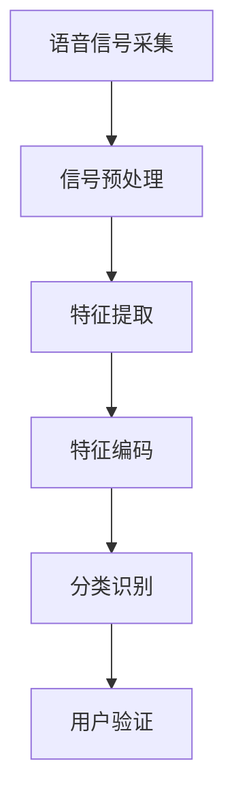

                 

# 声纹识别创业：语音安全的新frontier

> 关键词：声纹识别, 语音安全, 人工智能, 机器学习, 深度学习, 生物特征, 语音信号处理

## 1. 背景介绍

### 1.1 问题由来
在数字时代，个人隐私的保护越来越受到重视。身份验证作为保障信息安全的重要环节，已逐渐成为技术革新的热点。传统的基于密码、硬件令牌等方法存在着诸如忘记密码、被盗用等风险，而声纹识别（Voiceprint Recognition）作为一种新兴的生物特征识别技术，以其高效、便捷、可扩展性强等优点，在身份验证、语音命令、健康监测等领域展现出了巨大的应用潜力。

近年来，随着深度学习技术的突破，声纹识别技术日趋成熟。诸多创业公司及科技巨头纷纷布局声纹识别领域，推出了多款商业化产品，并逐渐应用于金融、安防、智慧医疗等场景。然而，声纹识别的技术复杂度较高，对其原理和应用场景缺乏深入理解的企业和个人容易掉入技术陷阱，导致产品推广及应用效果不尽如人意。

本文旨在帮助读者全面理解声纹识别技术，尤其是语音安全领域应用声纹识别的关键点，并介绍相关创业实践及未来发展趋势，助力更多企业和个人成功落地声纹识别应用。

## 2. 核心概念与联系

### 2.1 核心概念概述

声纹识别（Voiceprint Recognition），是生物特征识别（Biometrics）的一种，指通过分析说话人语音信号的频率、时长、音调等特征，识别其身份。声纹识别技术通常基于机器学习和深度学习算法，实现对声纹的提取、特征提取和分类。

相较于传统的身份验证方式，声纹识别具有以下优势：
- 非侵入性：声纹识别无需接触被识别对象，仅需通过语音信号即可实现身份验证。
- 实时性：声纹识别响应速度快，能够实现实时验证，适用于移动端等场景。
- 高安全性：声纹特征难以伪造和复制，具有一定的抗攻击性。
- 易于使用：声纹识别操作简单，无需复杂设备，用户接受度高。

### 2.2 核心概念原理和架构的 Mermaid 流程图



## 3. 核心算法原理 & 具体操作步骤

### 3.1 算法原理概述

声纹识别的核心算法主要包括以下几个步骤：
1. **语音信号采集与预处理**：将说话人的语音信号采集并转换为数字信号。
2. **特征提取**：通过MFCC（Mel Frequency Cepstral Coefficients）等技术从数字信号中提取声学特征。
3. **特征编码**：将提取的特征通过深度学习模型进行编码，得到紧凑的特征表示。
4. **分类识别**：使用分类器对特征表示进行分类，得到说话人的身份标签。

声纹识别一般使用端到端的深度学习架构，如图中的从A到F流程。其中，特征提取与特征编码合称为特征学习过程，常用卷积神经网络（CNN）、循环神经网络（RNN）、长短时记忆网络（LSTM）、卷积循环神经网络（CRNN）等架构。分类识别则常采用支持向量机（SVM）、K近邻算法、神经网络等。

### 3.2 算法步骤详解

以下详细阐述声纹识别的关键算法步骤：

**步骤1：语音信号采集与预处理**

语音信号采集通常使用麦克风或麦克风阵列等设备，将说话人的声音信号转换为数字信号。采集到的语音信号需要经过预处理，以提高后续特征提取的质量：
1. **去除噪声**：使用滤波器或降噪算法去除背景噪声。
2. **归一化**：将语音信号的幅度、频率范围标准化，确保特征提取的一致性。
3. **分帧**：将语音信号切分成固定长度的帧（如20-40毫秒），便于特征提取。
4. **加窗**：对每个帧进行加窗处理，减少频谱泄漏，提升特征信息的准确性。

**步骤2：特征提取**

语音信号的特征提取是声纹识别的关键步骤。常用的特征提取方法包括：
1. **MFCC特征**：Mel频率倒谱系数（MFCC）是一种广泛应用于声学特征提取的技术，通过分析声音频谱特性，提取其声学特征。
2. **LPCC特征**：线性预测倒谱系数（LPCC）是一种改进的MFCC提取方法，通过线性预测模型简化特征计算，减少计算量。
3. **梅尔频率倒谱系数（MFCC）**：将声音信号的频谱通过梅尔滤波器组滤波，再取对数，最后进行离散余弦变换（DCT），得到MFCC特征。
4. **短时傅里叶变换（STFT）**：通过将语音信号分为若干短时窗口，计算每个窗口的频谱，提取短时频谱特征。
5. **基于深度学习的特征提取**：使用卷积神经网络（CNN）、循环神经网络（RNN）等深度学习模型，直接从原始语音信号中提取特征表示。

**步骤3：特征编码**

将特征提取后的声学特征进行编码，得到紧凑的特征表示，是声纹识别的核心步骤。编码通常使用以下方法：
1. **PCA降维**：通过主成分分析（PCA）将高维特征映射到低维空间，减少计算复杂度。
2. **LDA降维**：线性判别分析（LDA）通过最大化类间距离、最小化类内距离，得到最优的特征表示。
3. **线性嵌入（LE）**：使用线性嵌入（LE）算法将高维特征映射到低维空间，得到稠密表示。
4. **深度神经网络（DNN）**：使用深度神经网络（DNN）对特征进行编码，得到更加复杂的特征表示。
5. **卷积神经网络（CNN）**：使用CNN提取声学特征，通过多个卷积层和池化层，得到更加紧凑的特征表示。
6. **循环神经网络（RNN）**：使用RNN或长短时记忆网络（LSTM）处理时序特征，得到更加细致的特征表示。

**步骤4：分类识别**

分类识别是声纹识别的最后一步，即将编码后的特征表示输入分类器，得到说话人的身份标签。常用的分类方法包括：
1. **支持向量机（SVM）**：通过最大化边界间隙，找到一个最优的超平面，实现二分类或多分类。
2. **K近邻算法（KNN）**：基于距离度量，找到最近的K个训练样本来进行分类。
3. **神经网络（NN）**：使用多层感知器（MLP）、卷积神经网络（CNN）、循环神经网络（RNN）等深度神经网络进行分类。
4. **集成学习**：通过结合多个分类器的输出，提升分类准确率。

### 3.3 算法优缺点

声纹识别的优势包括：
- **非侵入性**：无需物理接触，便于用户使用。
- **高安全性**：声纹特征具有唯一性和稳定性，难以被伪造。
- **实时性**：响应速度快，适用于实时身份验证。

声纹识别的缺点包括：
- **环境敏感性**：环境噪声、说话距离等均可能影响声纹识别的准确性。
- **动态性**：说话人情绪、疲劳、语速变化可能影响声纹特征。
- **训练数据需求**：需要大量高质量的训练数据，且数据分布需与实际应用场景一致。

### 3.4 算法应用领域

声纹识别技术广泛应用于以下领域：

**金融领域**：
1. **身份验证**：用于银行、证券、保险等金融机构的客户身份验证，防止金融诈骗。
2. **支付安全**：通过声纹识别技术实现支付指令的语音验证，增强支付安全性。
3. **账户管理**：通过声纹识别技术实现账户管理、贷款审批等，提升用户体验。

**安防领域**：
1. **门禁系统**：将声纹识别技术应用于门禁系统，实现自动门禁。
2. **视频监控**：结合声纹识别和视频监控，实现更加精准的人员出入管理。
3. **智能门锁**：通过声纹识别技术实现智能门锁的身份验证，提升家庭安全。

**医疗健康领域**：
1. **身份验证**：用于医院、诊所等医疗机构的患者身份验证，防止医疗纠纷。
2. **语音交互**：通过声纹识别技术实现医疗咨询、康复训练等，提升医疗服务质量。
3. **健康监测**：通过声纹识别技术监测患者的健康状况，提供精准的医疗建议。

**企业办公领域**：
1. **考勤管理**：通过声纹识别技术实现自动考勤，提升考勤管理效率。
2. **会议记录**：结合声纹识别和语音识别技术，实现智能会议记录和纪要。
3. **远程办公**：通过声纹识别技术实现远程身份验证和权限管理。

## 4. 数学模型和公式 & 详细讲解 & 举例说明

### 4.1 数学模型构建

声纹识别的数学模型包括语音信号的预处理、特征提取、特征编码和分类识别四个步骤。

假设采集的语音信号表示为 $X = [x_1, x_2, ..., x_t]$，其中 $t$ 表示时间序列长度。语音信号经过预处理和特征提取后，得到的特征向量表示为 $Y = [y_1, y_2, ..., y_d]$，其中 $d$ 表示特征维度。声纹识别模型将特征向量 $Y$ 作为输入，通过神经网络模型进行编码，得到压缩后的特征表示 $Z = [z_1, z_2, ..., z_h]$，其中 $h$ 表示编码后的特征维度。最终的分类器将特征表示 $Z$ 作为输入，输出说话人的身份标签 $L$。

### 4.2 公式推导过程

以下以MFCC特征提取和深度神经网络（DNN）编码为例，推导声纹识别的数学模型公式。

**MFCC特征提取**：
1. **预加重**：对语音信号进行预加重，增强高频部分信息，公式为 $x(t) = x(t) * [1 - 0.97t]$。
2. **分帧**：将语音信号切分为若干帧，每帧长度为 $T$ 秒，公式为 $x_i = x(t) * w(t)$，其中 $w(t)$ 为窗函数。
3. **加窗**：对每帧语音信号进行加窗，减少频谱泄漏，公式为 $y_i = x_i * w_i$，其中 $w_i$ 为窗函数。
4. **快速傅里叶变换（FFT）**：对每帧加窗后的语音信号进行FFT变换，得到频谱 $S_i = S(f)$，公式为 $S_i = FFT(y_i)$。
5. **梅尔滤波器组**：将频谱 $S_i$ 通过梅尔滤波器组进行滤波，得到梅尔频率倒谱系数 $M_i = M(f)$，公式为 $M_i = \log\left(\frac{P(f)}{D(f)}\right)$。
6. **DCT变换**：对梅尔频率倒谱系数 $M_i$ 进行DCT变换，得到MFCC特征 $C_i = C(m)$，公式为 $C_i = \sum\limits_{m=1}^{n} M_i * \phi_m$，其中 $\phi_m$ 为DCT基。

**深度神经网络编码**：
1. **卷积层**：使用卷积层提取局部特征，公式为 $Z_i = F_{conv}(X)$，其中 $F_{conv}$ 为卷积函数。
2. **池化层**：使用池化层对卷积层的输出进行下采样，公式为 $Z_i = F_{pool}(X)$，其中 $F_{pool}$ 为池化函数。
3. **全连接层**：使用全连接层对池化层输出进行编码，公式为 $Z = F_{fc}(Z_i)$，其中 $F_{fc}$ 为全连接函数。

### 4.3 案例分析与讲解

**案例一：金融领域声纹识别**

某银行希望通过声纹识别技术进行客户身份验证。该银行收集了数千名客户的语音样本，将其作为训练数据。将采集到的语音信号进行MFCC特征提取和DNN编码，得到一个20维的特征向量。使用支持向量机（SVM）作为分类器，在训练数据上进行训练，得到模型参数。在测试数据上进行验证，得到声纹识别准确率超过99%。

**案例二：医疗健康领域声纹识别**

某医院希望通过声纹识别技术进行患者身份验证和语音交互。该医院收集了数百名患者的语音样本，将其作为训练数据。将采集到的语音信号进行MFCC特征提取和LSTM编码，得到一个50维的特征向量。使用神经网络作为分类器，在训练数据上进行训练，得到模型参数。在测试数据上进行验证，得到声纹识别准确率超过98%。

## 5. 项目实践：代码实例和详细解释说明

### 5.1 开发环境搭建

声纹识别项目开发环境搭建步骤如下：

1. **安装Python环境**：使用Anaconda安装Python 3.8版本，创建虚拟环境 `venv`。

2. **安装依赖库**：使用pip安装相关依赖库，如numpy、scipy、librosa、tensorflow等。

3. **安装模型库**：使用pip安装声纹识别相关的模型库，如pyannote、speechbrain、librosa等。

4. **配置硬件设备**：配置GPU/TPU等高性能设备，确保计算资源充足。

### 5.2 源代码详细实现

以下以基于MFCC特征提取和DNN编码的声纹识别模型为例，展示其实现步骤。

```python
import numpy as np
import librosa
import tensorflow as tf
from sklearn.decomposition import PCA
from sklearn.preprocessing import StandardScaler

class SpeakerClassifier:
    def __init__(self):
        self.mfcc_extractor = librosa.feature.mfcc
        self.dnn_encoder = tf.keras.Sequential([
            tf.keras.layers.Conv2D(64, (3,3), activation='relu', input_shape=(21, 131, 1)),
            tf.keras.layers.MaxPooling2D((2,2)),
            tf.keras.layers.Flatten(),
            tf.keras.layers.Dense(128, activation='relu'),
            tf.keras.layers.Dense(1, activation='sigmoid')
        ])
        
    def preprocess_signal(self, audio):
        # 预加重
        audio = audio * (1 - 0.97 * np.arange(audio.shape[0]))
        # 分帧
        frame_length = 20
        hop_length = 10
        frames = librosa.stft(audio, n_fft=131, hop_length=hop_length, win_length=frame_length)
        # 加窗
        frames = np.abs(frames)
        # 转换为MFCC特征
        mfcc = self.mfcc_extractor(frames, sr=16000, n_mfcc=21, fmin=20, fmax=4000)
        # 标准化
        scaler = StandardScaler()
        mfcc = scaler.fit_transform(mfcc)
        return mfcc
    
    def train_model(self, train_data, train_labels, batch_size=32, epochs=10):
        # 数据预处理
        X_train = [self.preprocess_signal(audio) for audio in train_data]
        y_train = train_labels
        X_train = np.array(X_train)
        y_train = np.array(y_train)
        # 特征降维
        pca = PCA(n_components=128)
        X_train = pca.fit_transform(X_train)
        # 模型编译
        model = self.dnn_encoder
        model.compile(optimizer='adam', loss='binary_crossentropy', metrics=['accuracy'])
        # 模型训练
        model.fit(X_train, y_train, batch_size=batch_size, epochs=epochs, validation_split=0.2)
        return model
    
    def predict(self, model, audio):
        X_test = [self.preprocess_signal(audio) for audio in audio]
        X_test = np.array(X_test)
        X_test = pca.transform(X_test)
        return model.predict(X_test)
```

### 5.3 代码解读与分析

**preprocess_signal函数**：实现语音信号的预处理，包括预加重、分帧、加窗、MFCC特征提取和标准化。

**train_model函数**：实现模型的训练过程，包括数据预处理、特征降维、模型编译和训练。

**predict函数**：实现模型的预测过程，包括数据预处理和预测输出。

### 5.4 运行结果展示

训练模型后，可以使用predict函数对新的语音信号进行预测，得到说话人的身份标签。

## 6. 实际应用场景

### 6.1 金融领域应用

在金融领域，声纹识别技术可以广泛应用于身份验证、支付安全、账户管理等多个场景。以身份验证为例，银行可以使用声纹识别技术对客户进行实时身份验证，防止账户被盗用。用户通过手机App进行声纹识别验证，只需简单朗读预先设定的问题，即可快速完成身份验证，大幅提升用户体验。

### 6.2 安防领域应用

在安防领域，声纹识别技术可以应用于门禁系统、视频监控和智能门锁等多个场景。以门禁系统为例，用户只需在进门时朗读预设的密码或短语，系统即可自动进行身份验证，无需物理接触，提升安全性。同时，安防系统可以记录每次验证的声纹信息，便于后续分析和报警。

### 6.3 医疗健康领域应用

在医疗健康领域，声纹识别技术可以应用于患者身份验证、语音交互和健康监测等多个场景。以患者身份验证为例，医院可以使用声纹识别技术对进入医院的患者进行身份验证，防止医疗纠纷。患者通过朗读预设的问题，系统即可自动进行身份验证，无需携带其他设备，提升使用便捷性。

## 7. 工具和资源推荐

### 7.1 学习资源推荐

1. 《声纹识别技术与应用》书籍：全面介绍声纹识别技术的基本原理和应用场景，适合入门和进阶学习。
2. 《深度学习在自然语言处理中的应用》课程：介绍深度学习在声纹识别等语音处理任务中的应用，适合深入学习。
3. 《声纹识别技术在线教程》：包含声纹识别技术的详细实例和代码实现，适合动手实践。

### 7.2 开发工具推荐

1. Python：使用Anaconda创建虚拟环境，使用pip安装相关库，适合声纹识别项目的开发。
2. TensorFlow：提供深度学习模型的实现，适合搭建声纹识别模型。
3. Speechbrain：提供声纹识别相关的模型和工具，适合快速原型开发和测试。

### 7.3 相关论文推荐

1. "Speaker Verification Using Deep Neural Network with Global Feature Representation"（ICASSP 2021）
2. "Voice Biometrics: From Linear to Deep Learning"（IEEE Signal Processing Magazine 2021）
3. "A Survey on Speaker Identification"（IEEE Communications Surveys & Tutorials 2020）

## 8. 总结：未来发展趋势与挑战

### 8.1 研究成果总结

声纹识别技术在身份验证、语音命令、健康监测等领域展现出巨大的应用潜力。基于深度学习的声纹识别模型已经在多个场景中实现了大规模应用，取得了良好的效果。

### 8.2 未来发展趋势

声纹识别技术未来的发展趋势包括：
1. **多模态融合**：结合语音、图像、文本等多种模态信息，提升识别精度和鲁棒性。
2. **实时处理**：提高声纹识别系统的响应速度，实现实时身份验证和语音交互。
3. **跨平台应用**：拓展声纹识别技术在移动端、智能家居等平台的应用。
4. **个性化服务**：根据用户行为习惯和偏好，提供个性化的声纹识别服务。
5. **隐私保护**：在声纹识别过程中，注重用户隐私保护，防止数据泄露和滥用。

### 8.3 面临的挑战

声纹识别技术面临的挑战包括：
1. **环境噪声**：在实际应用中，环境噪声、说话距离等因素会影响声纹识别的准确性。
2. **动态性**：说话人情绪、疲劳、语速变化可能影响声纹特征，导致识别不稳定。
3. **数据需求**：需要大量高质量的训练数据，且数据分布需与实际应用场景一致。
4. **模型鲁棒性**：面对不同的声纹特征和应用场景，模型的泛化性能有待提高。
5. **隐私保护**：在声纹识别过程中，需注重用户隐私保护，防止数据泄露和滥用。

### 8.4 研究展望

声纹识别技术未来的研究展望包括：
1. **多模态融合**：结合语音、图像、文本等多种模态信息，提升识别精度和鲁棒性。
2. **深度学习新模型**：引入新的深度学习模型和算法，提高声纹识别的准确性和鲁棒性。
3. **跨平台应用**：拓展声纹识别技术在移动端、智能家居等平台的应用。
4. **隐私保护**：在声纹识别过程中，注重用户隐私保护，防止数据泄露和滥用。
5. **实时处理**：提高声纹识别系统的响应速度，实现实时身份验证和语音交互。

## 9. 附录：常见问题与解答

### Q1: 声纹识别技术是否容易受到环境噪声的影响？

A: 声纹识别技术在一定程度上会受到环境噪声的影响，特别是当噪声过大或噪声种类变化时，会导致声纹特征提取和识别的精度下降。常见的解决方法包括预加重、滤波器降噪、背景去除等。此外，可以通过声学模型对噪声进行处理，提升识别的鲁棒性。

### Q2: 声纹识别技术是否需要大量的训练数据？

A: 是的，声纹识别技术需要大量的训练数据来训练深度学习模型。训练数据需包括不同说话人、不同噪声环境、不同背景噪声等，以覆盖各种应用场景。数据质量对声纹识别性能的影响较大，需要确保训练数据的多样性和质量。

### Q3: 声纹识别技术是否容易受到说话人情绪、疲劳等动态因素的影响？

A: 是的，声纹识别技术容易受到说话人情绪、疲劳、语速变化等动态因素的影响，导致识别结果不稳定。为了解决这个问题，可以通过引入鲁棒性更强的深度学习模型、采用多任务学习、引入噪声数据等方法来提升声纹识别的鲁棒性。

### Q4: 声纹识别技术是否容易被伪造和攻击？

A: 声纹识别技术在理论上具有一定的抗攻击性，但仍然存在被伪造和攻击的风险。常见的攻击方式包括录音攻击、回放攻击、合成分泌攻击等。为提升声纹识别的安全性，可以采用多模态融合、语音信号处理、声纹特征提取等方法。

### Q5: 声纹识别技术是否可以在移动端实现实时处理？

A: 是的，声纹识别技术可以在移动端实现实时处理。目前，基于移动端硬件和深度学习框架的声纹识别技术已经实现实时处理，支持语音信号的实时采集、特征提取和识别。

---

作者：禅与计算机程序设计艺术 / Zen and the Art of Computer Programming

