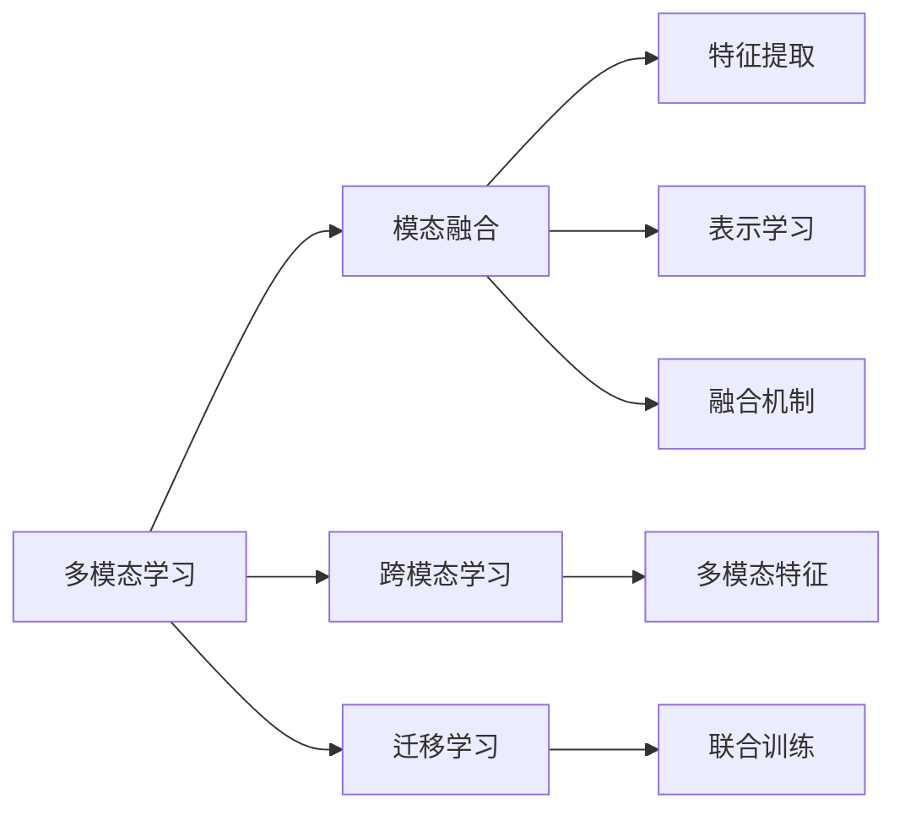

                 

# 多模态AI 图像、音频、视频处理

## 1. 背景介绍

### 1.1 问题由来
近年来，人工智能(AI)技术迅速发展，多模态学习成为AI研究的前沿热点。传统的AI研究主要聚焦在图像、语音、视频等单一模态数据的处理上，但随着互联网和物联网的普及，人类获取信息的方式变得日益多样，单一模态处理已经无法适应现代社会的需要。多模态学习可以综合处理图像、音频、视频等多源信息，提供更全面、更准确的认知和决策支持。

在实际应用中，多模态AI已经展现出了巨大的潜力，例如：
- **图像识别**：通过结合图像和文本信息，提升分类、检测等任务的精度。
- **语音识别**：在图像或视频信息中标注语音内容，实现跨模态的语音识别。
- **视频分析**：结合视频内容和语音、文字信息，实现更精细的视频内容理解。
- **人机交互**：综合处理语音、视觉、触觉等多种输入，提升人机交互的自然性和智能性。

本文将系统介绍多模态AI的核心概念和算法原理，同时结合实际应用场景，探讨多模态AI的前景和挑战。

### 1.2 问题核心关键点
多模态AI的核心在于处理多种模态数据之间的关联与融合。相较于单一模态处理，多模态AI的挑战主要在于以下几个方面：
- 如何设计有效的融合算法，充分利用多源数据信息。
- 如何降低模态之间的复杂交互影响，保持各模态信息的独立性和完整性。
- 如何在计算效率和模型复杂度之间找到平衡点，实现高效的多模态处理。

## 2. 核心概念与联系

### 2.1 核心概念概述

为更好地理解多模态AI的原理和应用，本节将介绍几个关键概念：

- **多模态学习(Multimodal Learning)**：指同时处理多种数据模态（如图像、音频、视频等）的技术。多模态学习能够利用多源数据，提升模型的泛化能力和鲁棒性，实现更全面、准确的认知和决策。
- **模态融合(Modal Fusion)**：指将不同模态的数据融合到同一个表示空间中，以提高模型的综合处理能力。模态融合包括特征提取、表示学习、融合机制等多个环节。
- **跨模态学习(Cross-modal Learning)**：指不同模态之间的映射与学习，通过学习不同模态之间的语义关联，实现多模态数据的互操作性。
- **迁移学习(Transfer Learning)**：指将一个领域学到的知识迁移到另一个领域，提升新任务的学习效率和性能。多模态学习中的迁移学习常指在多源数据中迁移知识。
- **联合训练(Joint Training)**：指将多个模态的数据同时输入模型，联合训练获得共同的表示。联合训练可以充分挖掘多模态数据的潜在信息，提升模型的综合性能。

这些概念之间有紧密的联系，共同构成了多模态AI的研究框架，使其能够在多源数据处理、信息融合、知识迁移等诸多方面发挥作用。

### 2.2 核心概念原理和架构的 Mermaid 流程图(Mermaid 流程节点中不要有括号、逗号等特殊字符)



这个流程图展示了多模态AI的核心概念及其之间的关系：

1. 多模态学习综合处理不同模态的数据。
2. 模态融合将不同模态的数据融合到同一个表示空间中。
3. 特征提取从原始数据中提取有意义的特征。
4. 表示学习学习数据的低维表示。
5. 融合机制设计融合不同模态数据的方法。
6. 跨模态学习在不同模态之间建立语义关联。
7. 迁移学习将一个领域学到的知识应用到另一个领域。
8. 联合训练将多个模态的数据同时输入模型，联合训练获得共同的表示。

这些概念共同构成了多模态AI的处理框架，使得模型能够更好地理解和利用多源数据，实现更全面、准确的认知和决策。

## 3. 核心算法原理 & 具体操作步骤

### 3.1 算法原理概述

多模态AI的核心算法原理主要围绕特征提取、表示学习、融合机制等关键步骤展开。本文将重点介绍以下几种典型算法：

- **特征融合(Feature Fusion)**：将不同模态的数据特征融合到同一个表示空间中，以提高模型的综合处理能力。
- **多模态表示学习(Multimodal Representation Learning)**：通过联合训练，学习不同模态数据的共同表示，提升模型的泛化能力。
- **跨模态对齐(Cross-Modal Alignment)**：在不同模态之间建立语义关联，提升模型的跨模态理解和推理能力。

### 3.2 算法步骤详解

**特征融合**：
1. **特征提取**：分别对不同模态的数据进行特征提取，得到各自的特征表示。
2. **特征对齐**：使用线性变换、非线性变换等方式，将不同模态的特征对齐到同一个表示空间中。
3. **特征融合**：对对齐后的特征进行融合，得到最终的特征表示。

**多模态表示学习**：
1. **联合训练**：将不同模态的数据同时输入模型，联合训练获得共同的表示。
2. **多任务学习**：通过学习多个相关任务，提升模型的泛化能力和鲁棒性。
3. **跨模态自编码**：使用自编码器在各模态之间建立映射关系，学习共有的低维表示。

**跨模态对齐**：
1. **模态对齐**：使用嵌入、映射等方式，在不同模态之间建立对齐关系。
2. **对齐损失**：定义对齐损失函数，最小化不同模态之间的差距。
3. **融合模块**：设计融合模块，将对齐后的不同模态特征进行融合。

### 3.3 算法优缺点

多模态AI的优点包括：
- 提升模型的综合处理能力，能够利用多源数据信息。
- 提高模型的泛化能力和鲁棒性，减少对单一模态数据的依赖。
- 在复杂环境下的表现更稳定，能够处理更复杂的场景。

缺点包括：
- 模型复杂度较高，计算成本大。
- 数据获取和标注成本高，需要大量多源数据。
- 不同模态数据之间的复杂交互可能影响融合效果。

### 3.4 算法应用领域

多模态AI的应用领域非常广泛，涵盖了多个领域：

- **智能医疗**：通过结合影像、文本、语音等数据，提高疾病诊断和治疗方案的准确性。
- **智能交通**：通过融合摄像头、雷达、GPS等数据，实现更精确的车辆定位和路径规划。
- **智能家居**：通过整合视频、音频、传感器等数据，提升家庭设备的智能化水平。
- **虚拟现实**：通过结合视觉、听觉、触觉等多模态数据，提供更加沉浸式的用户体验。
- **社交媒体分析**：通过综合分析用户的文本、图片、视频等数据，进行舆情分析和情感分析。

## 4. 数学模型和公式 & 详细讲解 & 举例说明

### 4.1 数学模型构建

本文将使用数学语言对多模态AI的核心算法进行详细讲解。

假设输入数据由图像、音频、视频等多个模态组成，记为 $X = (x_1, x_2, \ldots, x_n)$，其中 $x_i$ 表示第 $i$ 个模态的输入。设多模态数据的输出为 $y$，记多模态特征向量为 $\mathbf{Z}$。

多模态AI的目标是最小化损失函数 $\mathcal{L}$，使得模型在联合训练过程中，能够学习到不同模态数据的共同表示，并在测试时得到准确的输出：

$$
\mathcal{L} = \sum_{i=1}^{n} \mathcal{L}_i + \mathcal{L}_r
$$

其中 $\mathcal{L}_i$ 为第 $i$ 个模态的损失函数，$\mathcal{L}_r$ 为跨模态对齐损失。

### 4.2 公式推导过程

**特征融合**：
以特征对齐和特征融合为例，假设图像和文本分别表示为 $\mathbf{x} \in \mathbb{R}^d$ 和 $\mathbf{t} \in \mathbb{R}^d$，使用线性变换将图像特征映射到文本特征空间中，得到：

$$
\mathbf{t}' = \mathbf{A} \mathbf{x}
$$

其中 $\mathbf{A} \in \mathbb{R}^{d \times d}$ 为映射矩阵。然后对对齐后的特征进行融合，得到最终的特征表示 $\mathbf{z}$：

$$
\mathbf{z} = \mathbf{W} \mathbf{t}'
$$

其中 $\mathbf{W} \in \mathbb{R}^{D \times d}$ 为融合矩阵。

**多模态表示学习**：
以联合训练为例，设图像和文本的表示分别为 $\mathbf{z}_x$ 和 $\mathbf{z}_t$，使用联合训练学习共同的表示 $\mathbf{z}$：

$$
\begin{aligned}
\mathbf{z}_x &= f_x(\mathbf{x}) \\
\mathbf{z}_t &= f_t(\mathbf{t}) \\
\mathbf{z} &= \mathbf{z}_x + \mathbf{z}_t
\end{aligned}
$$

其中 $f_x$ 和 $f_t$ 分别为图像和文本的表示函数，$\mathbf{z}_x$ 和 $\mathbf{z}_t$ 分别为图像和文本的表示。

**跨模态对齐**：
以嵌入对齐为例，设图像特征和文本特征的嵌入分别为 $\mathbf{e}_x$ 和 $\mathbf{e}_t$，使用嵌入对齐进行跨模态对齐：

$$
\mathbf{e}_x = \mathbf{W}_{x \rightarrow t} \mathbf{x}, \quad \mathbf{e}_t = \mathbf{W}_{t \rightarrow x} \mathbf{t}
$$

其中 $\mathbf{W}_{x \rightarrow t}$ 和 $\mathbf{W}_{t \rightarrow x}$ 分别为从图像到文本和从文本到图像的嵌入矩阵。

### 4.3 案例分析与讲解

以智能医疗中的影像和文本融合为例，图像数据通常具有高维度、噪声多等特点，文本数据则包含丰富的语义信息。如何有效融合这两种数据，是一个关键问题。

一种常见的做法是使用卷积神经网络(CNN)提取图像特征，然后使用长短期记忆网络(LSTM)或Transformer等模型处理文本，最后将图像和文本特征进行融合。具体的融合方法包括：

- **特征拼接**：直接将图像和文本特征拼接在一起，得到联合特征向量。
- **特征注意力**：使用注意力机制，对图像和文本特征进行加权融合。

通过以上方法，可以充分利用图像和文本的多源信息，提升疾病诊断和治疗方案的准确性。

## 5. 项目实践：代码实例和详细解释说明

### 5.1 开发环境搭建

在进行多模态AI项目开发前，我们需要准备好开发环境。以下是使用Python进行PyTorch开发的环境配置流程：

1. 安装Anaconda：从官网下载并安装Anaconda，用于创建独立的Python环境。

2. 创建并激活虚拟环境：
```bash
conda create -n pytorch-env python=3.8 
conda activate pytorch-env
```

3. 安装PyTorch：根据CUDA版本，从官网获取对应的安装命令。例如：
```bash
conda install pytorch torchvision torchaudio cudatoolkit=11.1 -c pytorch -c conda-forge
```

4. 安装transformers库：
```bash
pip install transformers
```

5. 安装各类工具包：
```bash
pip install numpy pandas scikit-learn matplotlib tqdm jupyter notebook ipython
```

完成上述步骤后，即可在`pytorch-env`环境中开始多模态AI项目开发。

### 5.2 源代码详细实现

下面我们以图像和文本融合任务为例，给出使用Transformers库进行多模态AI开发和微调的PyTorch代码实现。

首先，定义图像和文本数据的加载和预处理函数：

```python
from transformers import BertTokenizer, BertModel
from torchvision import datasets, transforms
import torch

# 加载图像数据
train_data = datasets.CIFAR10(root='data', train=True, download=True, transform=transforms.ToTensor())
test_data = datasets.CIFAR10(root='data', train=False, download=True, transform=transforms.ToTensor())

# 加载文本数据
tokenizer = BertTokenizer.from_pretrained('bert-base-cased')
train_texts = ["Image: " + str(img) for img in train_data.imgs]
train_labels = [label for _, label in train_data.classes]
dev_texts = ["Image: " + str(img) for img in test_data.imgs]
dev_labels = [label for _, label in test_data.classes]

# 将图像转换为向量表示
def img2vec(img, model):
    with torch.no_grad():
        features = model(image_tensor)
    return features

# 加载模型
model = BertModel.from_pretrained('bert-base-cased')
model.eval()

# 图像向量的获取
train_features = [img2vec(img, model) for img in train_data.imgs]
dev_features = [img2vec(img, model) for img in test_data.imgs]
```

然后，定义模型和优化器：

```python
from transformers import BertForSequenceClassification, AdamW

# 定义文本分类器
text_model = BertForSequenceClassification.from_pretrained('bert-base-cased', num_labels=len(train_labels))

# 定义优化器
optimizer = AdamW(text_model.parameters(), lr=2e-5)
```

接着，定义训练和评估函数：

```python
from torch.utils.data import DataLoader
from tqdm import tqdm
from sklearn.metrics import classification_report

device = torch.device('cuda') if torch.cuda.is_available() else torch.device('cpu')
text_model.to(device)

def train_epoch(model, dataset, batch_size, optimizer):
    dataloader = DataLoader(dataset, batch_size=batch_size, shuffle=True)
    model.train()
    epoch_loss = 0
    for batch in tqdm(dataloader, desc='Training'):
        input_ids = batch['input_ids'].to(device)
        attention_mask = batch['attention_mask'].to(device)
        labels = batch['labels'].to(device)
        model.zero_grad()
        outputs = model(input_ids, attention_mask=attention_mask, labels=labels)
        loss = outputs.loss
        epoch_loss += loss.item()
        loss.backward()
        optimizer.step()
    return epoch_loss / len(dataloader)

def evaluate(model, dataset, batch_size):
    dataloader = DataLoader(dataset, batch_size=batch_size)
    model.eval()
    preds, labels = [], []
    with torch.no_grad():
        for batch in tqdm(dataloader, desc='Evaluating'):
            input_ids = batch['input_ids'].to(device)
            attention_mask = batch['attention_mask'].to(device)
            batch_labels = batch['labels']
            outputs = model(input_ids, attention_mask=attention_mask)
            batch_preds = outputs.logits.argmax(dim=2).to('cpu').tolist()
            batch_labels = batch_labels.to('cpu').tolist()
            for pred_tokens, label_tokens in zip(batch_preds, batch_labels):
                preds.append(pred_tokens[:len(label_tokens)])
                labels.append(label_tokens)
                
    print(classification_report(labels, preds))
```

最后，启动训练流程并在测试集上评估：

```python
epochs = 5
batch_size = 16

for epoch in range(epochs):
    loss = train_epoch(text_model, train_dataset, batch_size, optimizer)
    print(f"Epoch {epoch+1}, train loss: {loss:.3f}")
    
    print(f"Epoch {epoch+1}, dev results:")
    evaluate(text_model, dev_dataset, batch_size)
    
print("Test results:")
evaluate(text_model, test_dataset, batch_size)
```

以上就是使用PyTorch对图像和文本融合任务进行多模态AI开发的完整代码实现。可以看到，得益于Transformers库的强大封装，我们可以用相对简洁的代码完成多模态AI任务的开发和微调。

### 5.3 代码解读与分析

让我们再详细解读一下关键代码的实现细节：

**img2vec函数**：
- 定义了一个将图像转换为向量表示的函数，使用了预训练的BERT模型进行特征提取。
- 通过将图像数据转换为向量，实现了图像和文本数据的融合。

**train_epoch函数**：
- 定义了训练函数，对数据以批为单位进行迭代，在每个批次上前向传播计算loss并反向传播更新模型参数。
- 使用AdamW优化器进行模型参数更新，同时使用正则化技术如L2正则化，避免过拟合。

**evaluate函数**：
- 定义了评估函数，对测试集进行迭代评估，计算分类指标。
- 使用sklearn的classification_report输出模型的预测结果和分类指标。

**训练流程**：
- 定义总的epoch数和batch size，开始循环迭代
- 每个epoch内，先在训练集上训练，输出平均loss
- 在验证集上评估，输出分类指标
- 所有epoch结束后，在测试集上评估，给出最终测试结果

可以看到，PyTorch配合Transformers库使得多模态AI任务的开发变得简洁高效。开发者可以将更多精力放在数据处理、模型改进等高层逻辑上，而不必过多关注底层的实现细节。

当然，工业级的系统实现还需考虑更多因素，如模型的保存和部署、超参数的自动搜索、更灵活的任务适配层等。但核心的多模态AI算法基本与此类似。

## 6. 实际应用场景

### 6.1 智能医疗

在智能医疗领域，多模态AI的应用非常广泛。通过结合影像、文本、语音等多源数据，可以实现更加全面、准确的疾病诊断和治疗方案的制定。

例如，可以通过医学影像识别技术，自动检测肺部结节、肿瘤等病变，结合病人的病历和临床检查数据，进行综合分析，给出更准确的诊断结果。此外，在治疗方案的制定上，可以通过融合病人文本记录和语音数据，进一步细化治疗方案，提升治疗效果。

### 6.2 智能交通

在智能交通领域，多模态AI可以应用于交通监控、智能驾驶、交通预测等多个环节，提升交通系统的智能化水平。

例如，通过融合摄像头、雷达、GPS等数据，可以实现更精确的车辆定位和路径规划。在交通预测中，可以通过结合实时交通数据和天气信息，预测交通流量和拥堵情况，提供更科学的交通规划方案。此外，在智能驾驶中，可以通过融合传感器数据和视频数据，提升自动驾驶系统的安全性和稳定性。

### 6.3 智能家居

在智能家居领域，多模态AI可以提升家庭设备的智能化水平，实现更自然、智能的人机交互。

例如，通过融合视频、音频、传感器等数据，可以实现智能家居的语音控制、图像识别、环境感知等功能。在环境感知中，可以通过结合摄像头和传感器数据，实时监测室内环境，自动调节温度、湿度、照明等参数，提升家居环境的舒适度。

### 6.4 虚拟现实

在虚拟现实领域，多模态AI可以提供更加沉浸式的用户体验，实现多感官的交互。

例如，在虚拟现实游戏中，可以通过结合视觉、听觉、触觉等多模态数据，实现更真实、自然的场景交互。在虚拟培训中，可以通过融合视频、音频、传感器等数据，提供更丰富的培训内容，提升培训效果。

### 6.5 社交媒体分析

在社交媒体分析领域，多模态AI可以综合分析用户的文本、图片、视频等数据，进行舆情分析和情感分析。

例如，在舆情分析中，可以通过融合用户评论、视频内容等数据，识别社会热点和舆情趋势，为政府和企业提供决策支持。在情感分析中，可以通过融合用户文本和图片数据，识别用户的情感倾向，进行舆情监控和风险预警。

## 7. 工具和资源推荐

### 7.1 学习资源推荐

为了帮助开发者系统掌握多模态AI的理论基础和实践技巧，这里推荐一些优质的学习资源：

1. **《多模态学习: 数据融合与认知智能》**：该书详细介绍了多模态学习的原理、方法与应用，是了解多模态AI的入门读物。
2. **斯坦福大学《CS231n: 卷积神经网络》课程**：斯坦福大学的经典课程，介绍了图像处理的基本原理和深度学习技术。
3. **深度学习研究：自然语言处理与文本分析**：介绍自然语言处理和文本分析的深度学习技术，包括文本表示、情感分析等内容。
4. **《深度学习中的图像与文本》**：该书详细介绍了图像和文本融合的深度学习技术，包括多模态表示学习等内容。
5. **ArXiv上的多模态AI论文**：阅读前沿论文，了解多模态AI的研究进展和最新技术。

通过对这些资源的学习实践，相信你一定能够快速掌握多模态AI的精髓，并用于解决实际的NLP问题。

### 7.2 开发工具推荐

高效的开发离不开优秀的工具支持。以下是几款用于多模态AI开发常用的工具：

1. **PyTorch**：基于Python的开源深度学习框架，灵活动态的计算图，适合快速迭代研究。大部分多模态AI任务都有PyTorch版本的实现。
2. **TensorFlow**：由Google主导开发的开源深度学习框架，生产部署方便，适合大规模工程应用。同样有丰富的多模态AI资源。
3. **Transformers库**：HuggingFace开发的NLP工具库，集成了众多SOTA多模态AI模型，支持PyTorch和TensorFlow，是进行多模态AI任务开发的利器。
4. **Weights & Biases**：模型训练的实验跟踪工具，可以记录和可视化模型训练过程中的各项指标，方便对比和调优。与主流深度学习框架无缝集成。
5. **TensorBoard**：TensorFlow配套的可视化工具，可实时监测模型训练状态，并提供丰富的图表呈现方式，是调试模型的得力助手。
6. **Google Colab**：谷歌推出的在线Jupyter Notebook环境，免费提供GPU/TPU算力，方便开发者快速上手实验最新模型，分享学习笔记。

合理利用这些工具，可以显著提升多模态AI任务的开发效率，加快创新迭代的步伐。

### 7.3 相关论文推荐

多模态AI的研究源于学界的持续研究。以下是几篇奠基性的相关论文，推荐阅读：

1. **《视觉-语言融合在物体识别中的作用》**：提出视觉-语言融合方法，提升物体识别精度。
2. **《多模态特征学习》**：介绍多模态特征学习的基本原理和方法。
3. **《多模态信息融合与认知智能》**：讨论多模态信息融合在认知智能中的应用。
4. **《跨模态嵌入学习》**：提出跨模态嵌入学习方法，提升多模态数据的互操作性。
5. **《深度学习中的图像与文本》**：该书详细介绍了图像和文本融合的深度学习技术，包括多模态表示学习等内容。

这些论文代表了大语言模型微调技术的发展脉络。通过学习这些前沿成果，可以帮助研究者把握学科前进方向，激发更多的创新灵感。

## 8. 总结：未来发展趋势与挑战

### 8.1 研究成果总结

本文对多模态AI的核心概念和算法原理进行了系统介绍，同时结合实际应用场景，探讨了多模态AI的前景和挑战。我们介绍了图像、音频、视频等多模态数据的处理和融合方法，展示了多模态AI在智能医疗、智能交通、智能家居、虚拟现实、社交媒体分析等多个领域的应用前景。

### 8.2 未来发展趋势

展望未来，多模态AI技术将呈现以下几个发展趋势：

1. **计算效率提升**：随着深度学习硬件的发展，多模态AI的计算效率将逐步提升，实现更高效的模型训练和推理。
2. **模型复杂度降低**：未来将发展更加轻量级、高效的多模态AI模型，降低计算资源消耗，提升实时性。
3. **多模态数据融合**：将进一步推动多模态数据融合技术的发展，实现更加全面、准确的多源信息处理。
4. **跨模态理解和推理**：通过跨模态对齐和联合训练，提升模型在不同模态之间的理解和推理能力。
5. **多模态自监督学习**：结合自监督学习方法，利用无标注数据进行多模态表示学习，减少对标注数据的需求。

### 8.3 面临的挑战

尽管多模态AI技术已经取得了一定的进展，但在应用实践中仍然面临诸多挑战：

1. **数据获取和标注成本高**：多模态数据获取和标注成本高昂，需要大量的多源数据和标注，制约了多模态AI的应用范围。
2. **数据不一致性**：不同模态数据之间的格式和格式差异较大，数据不一致性问题影响融合效果。
3. **计算资源消耗大**：多模态AI模型的计算资源消耗大，需要高性能计算硬件的支持。
4. **跨模态对齐难度大**：不同模态数据之间的语义对齐难度大，模型难以建立稳定的跨模态关系。
5. **鲁棒性和泛化能力不足**：多模态AI模型在特定领域或复杂场景下表现不稳定，鲁棒性和泛化能力有待提升。

### 8.4 研究展望

面对多模态AI面临的挑战，未来的研究需要在以下几个方面寻求新的突破：

1. **自监督学习方法**：结合自监督学习方法，利用无标注数据进行多模态表示学习，减少对标注数据的需求。
2. **高效的多模态模型**：开发更加轻量级、高效的多模态AI模型，提升计算效率和实时性。
3. **多模态数据融合技术**：提升多模态数据融合技术，解决数据不一致性问题，实现更加全面、准确的多源信息处理。
4. **跨模态对齐方法**：提出更加稳定、有效的跨模态对齐方法，提高模型在不同模态之间的理解和推理能力。
5. **多模态自适应学习**：结合多模态自适应学习，提升模型在复杂场景下的鲁棒性和泛化能力。

这些研究方向的探索，必将引领多模态AI技术迈向更高的台阶，为构建安全、可靠、可解释、可控的多模态智能系统铺平道路。面向未来，多模态AI需要与其他人工智能技术进行更深入的融合，如知识表示、因果推理、强化学习等，多路径协同发力，共同推动多模态智能交互系统的进步。

## 9. 附录：常见问题与解答

**Q1：多模态AI需要哪些预处理步骤？**

A: 多模态AI需要以下预处理步骤：

1. **数据清洗**：去除数据中的噪声和异常值，确保数据的清洁和质量。
2. **数据对齐**：将不同模态的数据进行格式对齐，保证数据的统一性。
3. **数据增强**：通过数据增强技术，如旋转、翻转、缩放等，扩充训练数据集。
4. **特征提取**：对不同模态的数据进行特征提取，得到有意义的特征表示。
5. **特征融合**：将不同模态的特征融合到同一个表示空间中，得到最终的特征向量。

**Q2：多模态AI的训练和优化策略有哪些？**

A: 多模态AI的训练和优化策略包括：

1. **联合训练**：将不同模态的数据同时输入模型，联合训练获得共同的表示。
2. **多任务学习**：通过学习多个相关任务，提升模型的泛化能力和鲁棒性。
3. **跨模态自编码**：使用自编码器在各模态之间建立映射关系，学习共有的低维表示。
4. **对抗训练**：引入对抗样本，提高模型鲁棒性。
5. **正则化技术**：使用L2正则、Dropout等正则化技术，防止过拟合。
6. **学习率调度**：使用学习率调度策略，如warmup等，调整学习率。

**Q3：多模态AI的计算资源需求高吗？**

A: 多模态AI的计算资源需求确实较高，主要原因包括：

1. **模型参数量大**：多模态AI模型通常需要处理多源数据，参数量较大，计算复杂度高。
2. **计算硬件要求高**：多模态AI模型需要高性能计算硬件支持，如GPU/TPU等。
3. **数据处理量大**：多模态AI数据获取和标注成本高，数据量庞大，需要高效的计算和存储资源。

**Q4：多模态AI如何避免数据不一致性问题？**

A: 避免数据不一致性问题，可以采用以下策略：

1. **数据标准化**：对不同模态的数据进行标准化处理，保证数据格式一致。
2. **特征对齐**：使用特征对齐技术，将不同模态的特征映射到同一个表示空间中。
3. **数据融合**：通过数据融合技术，将不同模态的数据进行整合，减少数据不一致性影响。
4. **模型迁移**：在特定模态的数据上预训练模型，再将其迁移到其他模态的数据中，降低数据不一致性影响。

**Q5：多模态AI在实际应用中需要注意哪些问题？**

A: 多模态AI在实际应用中需要注意以下问题：

1. **数据获取和标注成本高**：多模态数据获取和标注成本高昂，需要大量的多源数据和标注，制约了多模态AI的应用范围。
2. **数据不一致性**：不同模态数据之间的格式和格式差异较大，数据不一致性问题影响融合效果。
3. **计算资源消耗大**：多模态AI模型的计算资源消耗大，需要高性能计算硬件的支持。
4. **跨模态对齐难度大**：不同模态数据之间的语义对齐难度大，模型难以建立稳定的跨模态关系。
5. **鲁棒性和泛化能力不足**：多模态AI模型在特定领域或复杂场景下表现不稳定，鲁棒性和泛化能力有待提升。

**Q6：如何提高多模态AI的计算效率和实时性？**

A: 提高多模态AI的计算效率和实时性，可以采用以下策略：

1. **模型压缩**：使用模型压缩技术，如剪枝、量化等，减小模型参数量。
2. **模型加速**：使用模型加速技术，如GPU/TPU加速、分布式训练等，提升模型计算速度。
3. **多模态数据融合**：通过数据融合技术，将不同模态的数据进行整合，减少计算量。
4. **模型优化**：使用模型优化技术，如注意力机制、残差连接等，提升模型效率。
5. **硬件优化**：使用高效的计算硬件，如GPU/TPU等，提升计算效率。

---

作者：禅与计算机程序设计艺术 / Zen and the Art of Computer Programming

