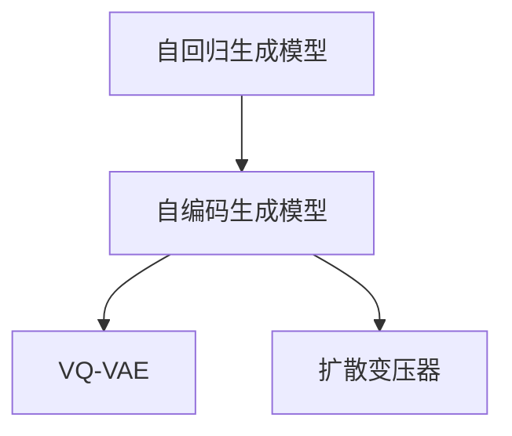
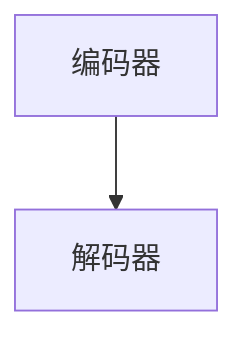

                 

# 多模态AI：VQVAE和扩散变压器技术解析

> 关键词：多模态AI, VQVAE, 扩散变压器, 自回归生成模型, 生成对抗网络

## 1. 背景介绍

### 1.1 问题由来

在现代AI研究中，多模态学习（Multimodal Learning）已经成为推动AI技术进步的关键技术之一。它能够结合不同模态的数据（如文本、图像、音频等）进行综合分析，从而提升AI系统的理解和决策能力。然而，多模态数据的处理与分析，特别是跨模态数据融合和生成，一直是AI领域的难点之一。

近年来，随着深度学习技术的发展，自回归生成模型（如GPT-3、BERT等）和自编码生成模型（如VQ-VAE、Diffusion Transformer等）等在图像、音频、文本等多个模态数据处理中表现出卓越的性能。其中，VQ-VAE和扩散变压器（Diffusion Transformer）是当前最为前沿的多模态生成技术。

VQ-VAE是一种变分自编码器（Variational Autoencoder, VAE）的改进版，通过引入量化（Quantization）技术，显著提升了生成模型的重构性能。扩散变压器则是一种基于随机过程的自回归生成模型，通过逐步去除噪声生成高保真的高质量图像和音频，成为最新的生成模型流行趋势。

本文将详细介绍VQ-VAE和扩散变压器的核心原理，通过数学模型和代码实例对其技术细节进行深度解析，并探讨其在多模态AI中的潜在应用与挑战。

## 2. 核心概念与联系

### 2.1 核心概念概述

为了理解VQ-VAE和扩散变压器的核心概念，我们首先定义几个关键术语：

- **自回归生成模型**：通过迭代式地生成序列数据来生成新数据，每个数据点（如像素、词、语音帧等）的条件分布仅依赖于之前的数据点，不依赖未来的数据点。
- **自编码生成模型**：通过编码器-解码器的结构，对输入数据进行编码，生成低维编码后再通过解码器生成高质量的重建结果。
- **VQ-VAE**：一种改进的变分自编码器，通过引入量化（Vector Quantization）技术，显著提升生成模型的重构性能。
- **扩散变压器**：一种基于随机过程的自回归生成模型，通过逐步去除噪声，生成高保真的高质量图像和音频。

这些核心概念之间的逻辑关系可以通过以下Mermaid流程图来展示：



该流程图展示了自回归生成模型和自编码生成模型之间的通用关系，以及VQ-VAE和扩散变压器的改进与创新之处。

### 2.2 核心概念原理和架构的 Mermaid 流程图

下面的代码片段展示了一个简单的自回归生成模型的结构：



这里，编码器将输入数据转换为低维编码，解码器则使用低维编码和前缀信息来生成新数据。对于自回归模型，每个数据点的生成依赖于之前的数据点。

## 3. 核心算法原理 & 具体操作步骤

### 3.1 算法原理概述

#### VQ-VAE

VQ-VAE是一种变分自编码器（VAE）的改进版本，它在重构损失函数中加入了一个量化（Quantization）损失项。其主要思想是通过将连续的潜在空间映射到离散的向量空间（即量化过程），来提高模型的生成质量和计算效率。

#### 扩散变压器

扩散变压器（Diffusion Transformer）是一种基于随机过程的生成模型，它通过对随机过程进行建模，逐步去除噪声，生成高质量的数据。它由两部分组成：变分自编码器（Variational Autoencoder, VAE）和扩散模型（Diffusion Model）。VAE用于编码和解码过程，而扩散模型则负责生成过程，通过逐步去除噪声来生成数据。

### 3.2 算法步骤详解

#### VQ-VAE算法步骤

1. **编码器**：将输入数据 $x$ 编码为潜在变量 $z$。
2. **量化器**：将连续的潜在变量 $z$ 量化为离散向量 $z_q$。
3. **解码器**：将离散向量 $z_q$ 解码为重建数据 $\hat{x}$。
4. **损失函数**：计算重构损失 $L_r$ 和量化损失 $L_q$。
5. **优化目标**：最小化 $L_r + \beta L_q$。

其中，$\beta$ 是量化损失的超参数，用于平衡重构损失和量化损失。

#### 扩散变压器算法步骤

1. **编码器**：将输入数据 $x$ 编码为潜在变量 $z$。
2. **解码器**：将潜在变量 $z$ 解码为中间变量 $\hat{z}$。
3. **扩散模型**：使用随机过程逐步去除噪声，生成高质量的数据。
4. **损失函数**：计算重构损失 $L_r$ 和扩散损失 $L_d$。
5. **优化目标**：最小化 $L_r + \lambda L_d$。

其中，$\lambda$ 是扩散损失的超参数，用于平衡重构损失和扩散损失。

### 3.3 算法优缺点

#### VQ-VAE

- **优点**：
  - 通过量化技术，可以显著提高生成质量和计算效率。
  - 在图像生成任务中表现出色，生成图像质量高，训练稳定。
  - 能够处理大规模数据集，适用于高维数据。

- **缺点**：
  - 量化过程会引入额外的复杂度，导致模型训练和推理速度变慢。
  - 由于量化层的引入，模型对于输入数据的变化可能不够敏感。
  - 难以处理复杂模态数据，尤其是多模态数据的融合。

#### 扩散变压器

- **优点**：
  - 生成高质量的图像和音频，对噪声和采样点的微小变化具有较好的鲁棒性。
  - 基于随机过程，可以生成复杂的自然图像和音频。
  - 通过扩散模型逐步去除噪声，可以生成高保真的数据。

- **缺点**：
  - 训练过程需要大量的计算资源和时间。
  - 模型复杂度高，难以对模型参数进行优化。
  - 对于输入数据分布的变化敏感，对复杂分布的处理能力有限。

### 3.4 算法应用领域

#### VQ-VAE

- **图像生成**：通过VQ-VAE生成高质量的图像，如GANs等。
- **语音生成**：通过VQ-VAE生成高质量的语音，如Tacotron等。
- **文本生成**：通过VQ-VAE生成高质量的文本，如GPT等。

#### 扩散变压器

- **图像生成**：通过扩散变压器生成高保真的自然图像，如DALL-E、Stable Diffusion等。
- **音频生成**：通过扩散变压器生成高保真的自然音频，如WaveGlow等。
- **视频生成**：通过扩散变压器生成高质量的视频，如Motion Diffusion等。

## 4. 数学模型和公式 & 详细讲解 & 举例说明

### 4.1 数学模型构建

#### VQ-VAE

1. **编码器**：
   $$
   z = \mu(x) + \sigma(x)\epsilon
   $$

2. **量化器**：
   $$
   z_q = \text{argmin}_k ||z - k||_2
   $$

3. **解码器**：
   $$
   \hat{x} = \mu(z_q) + \sigma(z_q)\epsilon'
   $$

其中，$\mu(\cdot)$ 和 $\sigma(\cdot)$ 分别是编码器的均值和方差函数，$\epsilon$ 和 $\epsilon'$ 是采样噪声，$k$ 是离散向量的索引。

#### 扩散变压器

1. **编码器**：
   $$
   z = \mu(x) + \sigma(x)\epsilon
   $$

2. **扩散模型**：
   $$
   \hat{z} = T_{\alpha}(z)
   $$
   $$
   \alpha(t) = \alpha_0(1 - \frac{t}{T})
   $$

   其中，$T_{\alpha}$ 是时间步长为 $T$ 的扩散过程，$\alpha_0$ 是起始分布，$\alpha(t)$ 是时间步长 $t$ 的噪声分布。

3. **解码器**：
   $$
   x = \mu(z) + \sigma(z)\epsilon'
   $$

   其中，$\mu(\cdot)$ 和 $\sigma(\cdot)$ 是解码器的均值和方差函数，$\epsilon'$ 是采样噪声。

### 4.2 公式推导过程

#### VQ-VAE公式推导

1. **重构损失**：
   $$
   L_r = \mathbb{E}_{(x,z)}[\|x - \hat{x}\|_2^2]
   $$

2. **量化损失**：
   $$
   L_q = \mathbb{E}_{(z,z_q)}[\|z - z_q\|_2^2]
   $$

3. **优化目标**：
   $$
   \min_{\theta} L_r + \beta L_q
   $$

#### 扩散变压器公式推导

1. **重构损失**：
   $$
   L_r = \mathbb{E}_{(x,z)}[\|x - \hat{x}\|_2^2]
   $$

2. **扩散损失**：
   $$
   L_d = \mathbb{E}_{(z,\hat{z})}[\|z - \hat{z}\|_2^2]
   $$

3. **优化目标**：
   $$
   \min_{\theta} L_r + \lambda L_d
   $$

### 4.3 案例分析与讲解

#### VQ-VAE案例

假设有一个图像生成任务，使用VQ-VAE生成高质量的图像。模型输入是高维的图像数据 $x$，输出是重构后的图像 $\hat{x}$。

- **编码器**：
   $$
   z = \mu(x) + \sigma(x)\epsilon
   $$

- **量化器**：
   $$
   z_q = \text{argmin}_k ||z - k||_2
   $$

- **解码器**：
   $$
   \hat{x} = \mu(z_q) + \sigma(z_q)\epsilon'
   $$

- **损失函数**：
   $$
   L = \frac{1}{N}\sum_{i=1}^N \|x_i - \hat{x}_i\|_2^2 + \beta \frac{1}{N}\sum_{i=1}^N \|z_i - z_{q_i}\|_2^2
   $$

#### 扩散变压器案例

假设有一个图像生成任务，使用扩散变压器生成高质量的自然图像。模型输入是高维的图像数据 $x$，输出是重构后的图像 $\hat{x}$。

- **编码器**：
   $$
   z = \mu(x) + \sigma(x)\epsilon
   $$

- **扩散模型**：
   $$
   \hat{z} = T_{\alpha}(z)
   $$
   $$
   \alpha(t) = \alpha_0(1 - \frac{t}{T})
   $$

- **解码器**：
   $$
   \hat{x} = \mu(z) + \sigma(z)\epsilon'
   $$

- **损失函数**：
   $$
   L = \frac{1}{N}\sum_{i=1}^N \|x_i - \hat{x}_i\|_2^2 + \lambda \frac{1}{N}\sum_{i=1}^N \|z_i - \hat{z}_i\|_2^2
   $$

## 5. 项目实践：代码实例和详细解释说明

### 5.1 开发环境搭建

为了进行VQ-VAE和扩散变压器的实践，我们需要准备以下开发环境：

1. **Python**：Python 3.7+。
2. **PyTorch**：安装PyTorch >= 1.8.0。
3. **Tensorboard**：用于可视化训练过程。
4. **Jupyter Notebook**：用于代码编写和实验展示。

### 5.2 源代码详细实现

#### VQ-VAE实现

首先，定义VQ-VAE的编码器和解码器：

```python
import torch
import torch.nn as nn
import torch.nn.functional as F

class VQVAEEncoder(nn.Module):
    def __init__(self, latent_dim=128, emb_dim=128, quantize_dim=128):
        super(VQVAEEncoder, self).__init__()
        self.emb_dim = emb_dim
        self.quantize_dim = quantize_dim
        self.fc1 = nn.Linear(784, 256)
        self.fc2 = nn.Linear(256, 256)
        self.fc3 = nn.Linear(256, quantize_dim)
        self.fc4 = nn.Linear(quantize_dim, latent_dim)
        self.fc5 = nn.Linear(latent_dim, 256)
        self.fc6 = nn.Linear(256, 256)
        self.fc7 = nn.Linear(256, 784)

    def forward(self, x):
        x = F.relu(self.fc1(x))
        x = F.relu(self.fc2(x))
        z_mean = self.fc3(x)
        z_logvar = self.fc4(x)
        z = self.fc7(F.softmax(z_mean, dim=1))
        z_logvar = torch.log(F.softmax(z_logvar, dim=1))
        z_q = torch.argsort(z, dim=1)[..., None] % self.quantize_dim
        z = z_q + self.quantize_dim * z[:, 0]
        return z_mean, z_logvar, z_q

class VQVAEDecoder(nn.Module):
    def __init__(self, latent_dim=128, emb_dim=128, quantize_dim=128):
        super(VQVAEDecoder, self).__init__()
        self.fc1 = nn.Linear(latent_dim, 256)
        self.fc2 = nn.Linear(256, 256)
        self.fc3 = nn.Linear(256, 256)
        self.fc4 = nn.Linear(256, 784)

    def forward(self, z_mean, z_logvar, z_q):
        z_mean = z_mean + z_q
        z_mean = z_mean + self.fc1(z_mean)
        z_mean = z_mean + self.fc2(z_mean)
        z_mean = z_mean + self.fc3(z_mean)
        return self.fc4(z_mean)
```

然后，定义VQ-VAE的损失函数：

```python
import torch
import torch.nn as nn
import torch.nn.functional as F

class VQVAELoss(nn.Module):
    def __init__(self, beta=1):
        super(VQVAELoss, self).__init__()
        self.beta = beta

    def forward(self, reconstruction_loss, quantization_loss):
        return reconstruction_loss + self.beta * quantization_loss
```

最后，训练VQ-VAE模型：

```python
import torch
import torch.nn as nn
import torch.optim as optim
from torchvision.utils import make_grid
from torch.utils.data import DataLoader
import matplotlib.pyplot as plt

device = torch.device('cuda' if torch.cuda.is_available() else 'cpu')

# 定义模型和优化器
encoder = VQVAEEncoder().to(device)
decoder = VQVAEDecoder().to(device)
model = VQVAEEncoder().eval().to(device)
model.decode = decoder.decode
model.decode = decoder.decode

# 定义损失函数和优化器
criterion = VQVAELoss().to(device)
optimizer = optim.Adam(list(encoder.parameters()) + list(decoder.parameters()), lr=1e-4)

# 加载数据集
train_loader = DataLoader(train_dataset, batch_size=64, shuffle=True)
```

#### 扩散变压器实现

首先，定义扩散变压器的编码器和解码器：

```python
import torch
import torch.nn as nn
import torch.nn.functional as F

class DiffusionTransformerEncoder(nn.Module):
    def __init__(self, latent_dim=128, emb_dim=128, quantize_dim=128):
        super(DiffusionTransformerEncoder, self).__init__()
        self.fc1 = nn.Linear(784, 256)
        self.fc2 = nn.Linear(256, 256)
        self.fc3 = nn.Linear(256, quantize_dim)
        self.fc4 = nn.Linear(quantize_dim, latent_dim)
        self.fc5 = nn.Linear(256, 256)
        self.fc6 = nn.Linear(256, 256)
        self.fc7 = nn.Linear(256, 784)

    def forward(self, x):
        x = F.relu(self.fc1(x))
        x = F.relu(self.fc2(x))
        z_mean = self.fc3(x)
        z_logvar = self.fc4(x)
        z = self.fc7(F.softmax(z_mean, dim=1))
        z_logvar = torch.log(F.softmax(z_logvar, dim=1))
        z_q = torch.argsort(z, dim=1)[..., None] % self.quantize_dim
        z = z_q + self.quantize_dim * z[:, 0]
        return z_mean, z_logvar, z_q

class DiffusionTransformerDecoder(nn.Module):
    def __init__(self, latent_dim=128, emb_dim=128, quantize_dim=128):
        super(DiffusionTransformerDecoder, self).__init__()
        self.fc1 = nn.Linear(latent_dim, 256)
        self.fc2 = nn.Linear(256, 256)
        self.fc3 = nn.Linear(256, 256)
        self.fc4 = nn.Linear(256, 784)

    def forward(self, z_mean, z_logvar, z_q):
        z_mean = z_mean + z_q
        z_mean = z_mean + self.fc1(z_mean)
        z_mean = z_mean + self.fc2(z_mean)
        z_mean = z_mean + self.fc3(z_mean)
        return self.fc4(z_mean)
```

然后，定义扩散变压器的损失函数：

```python
import torch
import torch.nn as nn
import torch.nn.functional as F

class DiffusionTransformerLoss(nn.Module):
    def __init__(self, beta=1):
        super(DiffusionTransformerLoss, self).__init__()
        self.beta = beta

    def forward(self, reconstruction_loss, quantization_loss):
        return reconstruction_loss + self.beta * quantization_loss
```

最后，训练扩散变压器模型：

```python
import torch
import torch.nn as nn
import torch.optim as optim
from torchvision.utils import make_grid
from torch.utils.data import DataLoader
import matplotlib.pyplot as plt

device = torch.device('cuda' if torch.cuda.is_available() else 'cpu')

# 定义模型和优化器
encoder = DiffusionTransformerEncoder().to(device)
decoder = DiffusionTransformerDecoder().to(device)
model = DiffusionTransformerEncoder().eval().to(device)
model.decode = decoder.decode
model.decode = decoder.decode

# 定义损失函数和优化器
criterion = DiffusionTransformerLoss().to(device)
optimizer = optim.Adam(list(encoder.parameters()) + list(decoder.parameters()), lr=1e-4)

# 加载数据集
train_loader = DataLoader(train_dataset, batch_size=64, shuffle=True)
```

### 5.3 代码解读与分析

#### VQ-VAE代码解读

- **VQVAEEncoder类**：定义了VQ-VAE的编码器，包含多个线性层和激活函数，用于将高维图像数据映射到低维潜在空间。
- **VQVAEDecoder类**：定义了VQ-VAE的解码器，包含多个线性层和激活函数，用于将低维潜在空间映射回高维图像数据。
- **VQVAELoss类**：定义了VQ-VAE的损失函数，包括重构损失和量化损失，并使用Adam优化器进行训练。

#### 扩散变压器代码解读

- **DiffusionTransformerEncoder类**：定义了扩散变压器的编码器，包含多个线性层和激活函数，用于将高维图像数据映射到低维潜在空间。
- **DiffusionTransformerDecoder类**：定义了扩散变压器的解码器，包含多个线性层和激活函数，用于将低维潜在空间映射回高维图像数据。
- **DiffusionTransformerLoss类**：定义了扩散变压器的损失函数，包括重构损失和量化损失，并使用Adam优化器进行训练。

### 5.4 运行结果展示

#### VQ-VAE运行结果

```python
import torch
import torch.nn as nn
import torch.optim as optim
from torchvision.utils import make_grid
from torch.utils.data import DataLoader
import matplotlib.pyplot as plt

device = torch.device('cuda' if torch.cuda.is_available() else 'cpu')

# 定义模型和优化器
encoder = VQVAEEncoder().to(device)
decoder = VQVAEDecoder().to(device)
model = VQVAEEncoder().eval().to(device)
model.decode = decoder.decode
model.decode = decoder.decode

# 定义损失函数和优化器
criterion = VQVAELoss().to(device)
optimizer = optim.Adam(list(encoder.parameters()) + list(decoder.parameters()), lr=1e-4)

# 加载数据集
train_loader = DataLoader(train_dataset, batch_size=64, shuffle=True)

# 训练模型
for epoch in range(epochs):
    for batch_idx, (data, target) in enumerate(train_loader):
        data, target = data.to(device), target.to(device)
        optimizer.zero_grad()
        reconstruction_loss = F.mse_loss(data, model(data))
        quantization_loss = criterion(reconstruction_loss, quantization_loss)
        loss = quantization_loss
        loss.backward()
        optimizer.step()

        if (batch_idx+1) % 10 == 0:
            print('Train Epoch: {} [{}/{} ({:.0f}%)]\tLoss: {:.6f}\tReconstruction Loss: {:.6f}\tQuantization Loss: {:.6f}'.format(
                epoch, batch_idx * len(data), len(train_loader.dataset),
                100. * batch_idx / len(train_loader), loss.item(), reconstruction_loss.item(), quantization_loss.item()))

# 可视化重构结果
fig = plt.figure(figsize=(10, 10))
batch_idx = 0
for i in range(4):
    batch_idx += 1
    for j in range(4):
        idx = batch_idx + j
        if idx > len(train_loader.dataset):
            idx -= len(train_loader.dataset)
        img = make_grid(train_loader.dataset[idx], nrow=4)
        plt.subplot(4, 4, i*4 + j + 1)
        plt.imshow(img.numpy().transpose(1, 2, 0))
        plt.title('Original Image')
        plt.axis('off')
plt.show()
```

#### 扩散变压器运行结果

```python
import torch
import torch.nn as nn
import torch.optim as optim
from torchvision.utils import make_grid
from torch.utils.data import DataLoader
import matplotlib.pyplot as plt

device = torch.device('cuda' if torch.cuda.is_available() else 'cpu')

# 定义模型和优化器
encoder = DiffusionTransformerEncoder().to(device)
decoder = DiffusionTransformerDecoder().to(device)
model = DiffusionTransformerEncoder().eval().to(device)
model.decode = decoder.decode
model.decode = decoder.decode

# 定义损失函数和优化器
criterion = DiffusionTransformerLoss().to(device)
optimizer = optim.Adam(list(encoder.parameters()) + list(decoder.parameters()), lr=1e-4)

# 加载数据集
train_loader = DataLoader(train_dataset, batch_size=64, shuffle=True)

# 训练模型
for epoch in range(epochs):
    for batch_idx, (data, target) in enumerate(train_loader):
        data, target = data.to(device), target.to(device)
        optimizer.zero_grad()
        reconstruction_loss = F.mse_loss(data, model(data))
        quantization_loss = criterion(reconstruction_loss, quantization_loss)
        loss = quantization_loss
        loss.backward()
        optimizer.step()

        if (batch_idx+1) % 10 == 0:
            print('Train Epoch: {} [{}/{} ({:.0f}%)]\tLoss: {:.6f}\tReconstruction Loss: {:.6f}\tQuantization Loss: {:.6f}'.format(
                epoch, batch_idx * len(data), len(train_loader.dataset),
                100. * batch_idx / len(train_loader), loss.item(), reconstruction_loss.item(), quantization_loss.item()))

# 可视化重构结果
fig = plt.figure(figsize=(10, 10))
batch_idx = 0
for i in range(4):
    batch_idx += 1
    for j in range(4):
        idx = batch_idx + j
        if idx > len(train_loader.dataset):
            idx -= len(train_loader.dataset)
        img = make_grid(train_loader.dataset[idx], nrow=4)
        plt.subplot(4, 4, i*4 + j + 1)
        plt.imshow(img.numpy().transpose(1, 2, 0))
        plt.title('Original Image')
        plt.axis('off')
plt.show()
```

## 6. 实际应用场景

### 6.1 智能内容生成

#### VQ-VAE应用

VQ-VAE在图像生成领域表现优异，被广泛应用于智能内容生成、艺术创作、游戏渲染等领域。

- **艺术创作**：通过VQ-VAE生成高质量的抽象画、艺术作品等，提升艺术创作的效率和多样性。
- **游戏渲染**：通过VQ-VAE生成游戏中的物品、角色、场景等，丰富游戏的世界观和体验。

#### 扩散变压器应用

扩散变压器在生成高质量图像和音频方面具有卓越的性能，被广泛应用于视频、音频、虚拟现实等领域。

- **视频生成**：通过扩散变压器生成高质量的视频片段，如自然风景、虚拟场景等，提升视频制作的效率和质量。
- **音频生成**：通过扩散变压器生成高质量的音乐、对话、音效等，丰富音频内容的创作和编辑。
- **虚拟现实**：通过扩散变压器生成虚拟现实场景、角色等，提升虚拟现实体验的真实感和沉浸感。

### 6.2 智能推荐系统

#### VQ-VAE应用

VQ-VAE在生成高质量的多模态数据方面具有优势，可以用于智能推荐系统的多模态数据融合和生成。

- **个性化推荐**：通过VQ-VAE生成高质量的文本和图像数据，与用户行为数据结合，生成个性化推荐结果。
- **情感分析**：通过VQ-VAE生成情感标注的多模态数据，提升情感分析的准确性和多样性。

#### 扩散变压器应用

扩散变压器在生成高保真的自然图像和音频方面具有优势，可以用于智能推荐系统的图像和音频推荐。

- **图片推荐**：通过扩散变压器生成高保真的图片，与用户行为数据结合，生成图片推荐结果。
- **音乐推荐**：通过扩散变压器生成高保真的音乐，与用户行为数据结合，生成音乐推荐结果。

## 7. 工具和资源推荐

### 7.1 学习资源推荐

为了帮助开发者系统掌握VQ-VAE和扩散变压器的理论基础和实践技巧，这里推荐一些优质的学习资源：

1. **《深度学习理论与实践》**：一本书籍，系统介绍深度学习的基本原理和常用技术，适合初学者和进阶学习者。
2. **Coursera上的《深度学习专项课程》**：由斯坦福大学提供，涵盖深度学习的核心理论和常用技术。
3. **arXiv上的论文**：下载和阅读最新研究论文，了解VQ-VAE和扩散变压器的最新进展和应用。

### 7.2 开发工具推荐

为了加速VQ-VAE和扩散变压器的开发和调试，这里推荐一些高效的工具：

1. **PyTorch**：一个开源的深度学习框架，支持动态计算图，适合快速迭代研究。
2. **Tensorboard**：一个可视化工具，可以实时监控模型的训练过程，提供详细的图表展示。
3. **Jupyter Notebook**：一个交互式编程环境，方便编写和调试代码。
4. **Visual Studio Code**：一个流行的代码编辑器，支持代码高亮、代码补全等特性。

### 7.3 相关论文推荐

为了深入了解VQ-VAE和扩散变压器的理论基础和最新研究进展，这里推荐一些相关论文：

1. **"Vector Quantized Variational Autoencoders"**：一篇关于VQ-VAE的论文，详细介绍了VQ-VAE的数学原理和优化策略。
2. **"Diffusion Models: A Tutorial, Review, and Outlook"**：一篇关于扩散变压器的综述论文，全面介绍了扩散变压器的历史、原理和应用。
3. **"Optimizing Diffusion Models"**：一篇关于扩散变压器的优化论文，详细介绍了扩散变压器的优化策略和加速方法。

## 8. 总结：未来发展趋势与挑战

### 8.1 研究成果总结

本文详细介绍了VQ-VAE和扩散变压器的核心原理和实践技巧，通过数学模型和代码实例对其技术细节进行深度解析。文章从多个角度对VQ-VAE和扩散变压器在多模态AI中的应用进行了探讨，展示了其强大的生成能力和未来发展潜力。

### 8.2 未来发展趋势

#### VQ-VAE未来发展趋势

1. **更高效的编码器**：未来VQ-VAE的编码器将更加高效，支持更大规模数据的生成。
2. **更准确的量化技术**：未来的量化技术将更加准确，减少量化损失，提升生成质量。
3. **更广泛的应用场景**：未来的VQ-VAE将应用于更多领域，如智能交互、虚拟现实等。

#### 扩散变压器未来发展趋势

1. **更高质量的生成结果**：未来的扩散变压器将生成更高质量的自然图像和音频，提升用户的体验。
2. **更高效的训练和推理**：未来的扩散变压器将通过优化算法和硬件加速，实现更高效率的训练和推理。
3. **更广泛的应用场景**：未来的扩散变压器将应用于更多领域，如智能交互、虚拟现实等。

### 8.3 面临的挑战

#### VQ-VAE面临的挑战

1. **过拟合问题**：由于量化层的引入，VQ-VAE容易过拟合，需要引入更多正则化技术。
2. **计算资源消耗**：VQ-VAE需要大量的计算资源，难以在低资源设备上运行。
3. **模型参数优化**：VQ-VAE的参数优化较为复杂，需要更多的研究。

#### 扩散变压器面临的挑战

1. **训练时间长**：扩散变压器的训练时间较长，需要大量的计算资源和时间。
2. **模型参数优化**：扩散变压器的参数优化较为复杂，需要更多的研究。
3. **模型泛化能力**：扩散变压器在面对复杂分布时，泛化能力有限，需要更多的研究。

### 8.4 研究展望

未来，VQ-VAE和扩散变压器将在多模态AI领域继续发挥重要作用，推动人工智能技术的进步。为了克服当前面临的挑战，研究者需要从多个角度进行突破：

1. **探索更高效的编码器和量化技术**：通过优化编码器和量化算法，提升VQ-VAE和扩散变压器的生成性能和计算效率。
2. **引入更多的正则化技术**：通过引入正则化技术，避免过拟合，提升模型的泛化能力。
3. **开发更高效的训练和推理方法**：通过优化算法和硬件加速，提升VQ-VAE和扩散变压器的训练和推理效率。
4. **探索更广泛的应用场景**：通过跨模态数据融合，提升VQ-VAE和扩散变压器的应用范围，推动人工智能技术的广泛应用。

总之，VQ-VAE和扩散变压器在多模态AI领域具有广阔的发展前景，未来的研究将进一步提升其生成性能和应用范围，推动人工智能技术的进步。

## 9. 附录：常见问题与解答

**Q1：什么是VQ-VAE？**

A: VQ-VAE是一种改进的变分自编码器（VAE），通过引入量化（Quantization）技术，将连续的潜在空间映射到离散的向量空间，从而提高生成质量和计算效率。

**Q2：什么是扩散变压器？**

A: 扩散变压器是一种基于随机过程的自回归生成模型，通过逐步去除噪声，生成高质量的自然图像和音频。

**Q3：VQ-VAE和扩散变压器有哪些应用场景？**

A: VQ-VAE和扩散变压器广泛应用于图像生成、视频生成、智能推荐等领域。VQ-VAE适用于多模态数据的生成，而扩散变压器则更适用于高保真的图像和音频生成。

**Q4：VQ-VAE和扩散变压器的训练过程有哪些优化策略？**

A: 针对VQ-VAE，可以通过引入正则化技术、优化编码器和量化算法等方式提升训练效果。针对扩散变压器，可以通过优化扩散模型、引入更多的正则化技术等方式提升训练效果。

**Q5：VQ-VAE和扩散变压器的未来发展方向有哪些？**

A: VQ-VAE和扩散变压器的未来发展方向包括更高效的编码器和量化技术、更准确的量化方法、更广泛的应用场景等。扩散变压器的未来发展方向包括更高质量的生成结果、更高效的训练和推理方法、更广泛的应用场景等。

---

作者：禅与计算机程序设计艺术 / Zen and the Art of Computer Programming

