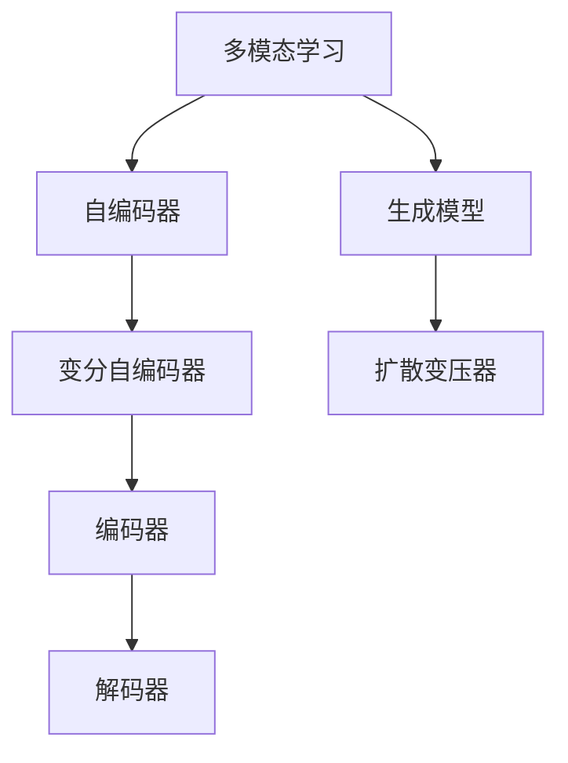

                 

# 多模态AI：VQVAE和扩散变压器技术解析

> 关键词：多模态学习, 自编码器, 自动编码器, 变分自编码器(VAE), 扩散变压器, 生成模型, 训练框架, 编码器, 解码器

## 1. 背景介绍

多模态AI技术正成为当前AI研究的热门领域之一，其核心思想是将不同的模态（如视觉、文本、语音等）进行综合处理，从而提升模型的泛化能力和任务性能。多模态学习不仅能够在单一模态的限制下扩展应用场景，还能够在多种信息源的交互中挖掘出更丰富的信息，进而提升模型的综合理解和表达能力。

### 1.1 问题由来

随着深度学习技术的发展，单一模态的深度学习模型已经难以满足复杂现实世界的需求。多模态AI技术通过整合不同模态的信息，克服了传统单一模态方法的局限，大大提升了模型的泛化能力和应用范围。然而，多模态学习也面临诸多挑战，如不同模态之间的对齐、融合、交互等问题。

### 1.2 问题核心关键点

多模态学习技术主要分为自编码器和生成模型两类，其中变分自编码器(Variational Autoencoder, VAE)和扩散变压器(Diffusion Transformer)是当前最流行的两种方法。两者通过不同的机制实现多模态数据的编码和解码，并取得了显著的成果。

本文重点解析VQVAE和扩散变压器，详细阐述其核心算法原理、具体操作步骤和应用领域，以期对多模态AI技术的发展提供指导和借鉴。

## 2. 核心概念与联系

### 2.1 核心概念概述

在探讨VQVAE和扩散变压器之前，首先介绍几个核心概念：

- 多模态学习(Multimodal Learning)：指同时处理多种模态数据，如视觉、文本、语音等，进行联合学习，提升模型性能。
- 自编码器(Autocoder)：一种无监督学习算法，由编码器和解码器组成，通过将输入数据压缩到潜在空间并重构输出，实现数据的降维和重构。
- 变分自编码器(Variational Autoencoder, VAE)：一种基于概率生成模型的自编码器，用于生成和降维。
- 扩散变压器(Diffusion Transformer)：一种基于自回归扩散过程的生成模型，用于生成和表示多模态数据。
- 生成模型(Generative Model)：用于生成数据的概率模型，如VAE、扩散变压器等。

这些概念之间的逻辑关系可以通过以下Mermaid流程图来展示：



该流程图展示了多模态学习、自编码器和生成模型之间的关系。其中，变分自编码器和扩散变压器属于自编码器和生成模型。

## 3. 核心算法原理 & 具体操作步骤
### 3.1 算法原理概述

#### 3.1.1 VQVAE

VQVAE是一种变分自编码器，通过将输入数据映射到离散潜在空间，并使用向量量化(Vector Quantization, VQ)技术对潜在空间进行编码，从而实现多模态数据的有效降维和重构。其核心算法包括两个主要部分：连续潜在空间到离散潜在空间的映射和量化误差最小化。

#### 3.1.2 扩散变压器

扩散变压器是一种基于自回归扩散过程的生成模型，通过逐步添加噪声并逼近数据分布，实现数据的生成。其核心算法包括两个主要部分：扩散过程和自回归生成。

### 3.2 算法步骤详解

#### 3.2.1 VQVAE

1. **数据预处理**：将多模态数据转化为适合模型处理的形式，如将视觉数据转化为图像张量，文本数据转化为向量等。

2. **编码器编码**：使用卷积神经网络(CNN)或递归神经网络(RNN)对预处理后的数据进行编码，得到连续潜在空间表示。

3. **量化误差最小化**：通过将连续潜在空间表示映射到离散潜在空间，最小化量化误差，实现数据降维。

4. **解码器解码**：使用解码器对离散潜在空间表示进行解码，得到重构后的输出数据。

#### 3.2.2 扩散变压器

1. **数据预处理**：将多模态数据转化为适合模型处理的形式，如将视觉数据转化为图像张量，文本数据转化为向量等。

2. **扩散过程**：通过逐步添加噪声并逼近数据分布，逐步生成数据。

3. **自回归生成**：使用自回归模型逐步生成数据，得到最终的输出数据。

### 3.3 算法优缺点

#### 3.3.1 VQVAE

**优点**：
- 能够有效实现多模态数据的降维和重构。
- 参数量相对较少，计算效率高。

**缺点**：
- 离散量化可能导致信息损失。
- 需要对离散空间进行设计，需要大量预处理和后处理工作。

#### 3.3.2 扩散变压器

**优点**：
- 能够生成高质量的图像和音频数据。
- 模型参数量较大，但计算效率高。

**缺点**：
- 训练复杂度高，需要大量计算资源。
- 需要设计合适的扩散过程和自回归模型，过程较复杂。

### 3.4 算法应用领域

VQVAE和扩散变压器在多个领域中都有广泛应用，如：

- 计算机视觉：用于图像生成、图像编码和图像压缩等任务。
- 自然语言处理：用于文本生成、文本压缩和文本分类等任务。
- 语音识别：用于语音生成、语音编码和语音压缩等任务。
- 信号处理：用于音频生成、音频编码和音频压缩等任务。

## 4. 数学模型和公式 & 详细讲解

### 4.1 数学模型构建

#### 4.1.1 VQVAE

**连续潜在空间表示**：使用编码器将输入数据映射到连续潜在空间 $Z$，即 $Z = E(X)$。

**离散潜在空间表示**：使用向量量化器将连续潜在空间 $Z$ 映射到离散潜在空间 $Z_q$，即 $Z_q = VQ(Z)$。

**解码器解码**：使用解码器将离散潜在空间 $Z_q$ 解码回原始输入数据 $X$，即 $\hat{X} = D(Z_q)$。

#### 4.1.2 扩散变压器

**扩散过程**：通过逐步添加噪声并逼近数据分布，逐步生成数据。具体实现方式包括两个步骤：
- **噪声添加**：使用噪声变量 $t$ 控制噪声添加量，逐步生成数据。
- **逼近数据分布**：使用自回归模型逐步逼近数据分布。

**自回归生成**：使用自回归模型逐步生成数据，得到最终的输出数据。

### 4.2 公式推导过程

#### 4.2.1 VQVAE

1. **连续潜在空间表示**：
   $$
   Z = E(X) = \mu + \sigma \cdot \epsilon
   $$
   其中 $\mu$ 和 $\sigma$ 分别为编码器的均值和方差，$\epsilon$ 为随机噪声。

2. **离散潜在空间表示**：
   $$
   Z_q = VQ(Z) = \arg\min_{z_q} \| Z - z_q \|^2
   $$
   其中 $z_q$ 为离散潜在空间中的向量，$\| \cdot \|$ 为欧式距离。

3. **解码器解码**：
   $$
   \hat{X} = D(Z_q) = \mu_q + \sigma_q \cdot \epsilon_q
   $$
   其中 $\mu_q$ 和 $\sigma_q$ 分别为解码器的均值和方差，$\epsilon_q$ 为随机噪声。

#### 4.2.2 扩散变压器

1. **噪声添加**：
   $$
   \tilde{X}_t = X_t + \sqrt{t} \cdot \eta_t
   $$
   其中 $X_t$ 为当前生成数据，$\eta_t$ 为噪声变量，$t$ 为时间步长。

2. **逼近数据分布**：
   $$
   p(\tilde{X}_t | \tilde{X}_{t-1}) = q(\tilde{X}_t | \tilde{X}_{t-1})
   $$
   其中 $q(\tilde{X}_t | \tilde{X}_{t-1})$ 为噪声分布，$p(\tilde{X}_t | \tilde{X}_{t-1})$ 为数据分布。

3. **自回归生成**：
   $$
   \hat{X} = \sum_{t=0}^T \frac{\alpha_t}{\beta_t} \cdot q(\tilde{X}_t | \tilde{X}_{t-1})
   $$
   其中 $\alpha_t$ 和 $\beta_t$ 为时间步长相关的系数，$q(\tilde{X}_t | \tilde{X}_{t-1})$ 为自回归模型。

### 4.3 案例分析与讲解

#### 4.3.1 VQVAE

假设有一个包含视觉和文本的多模态数据集，其中包含图像和相应的文本描述。使用VQVAE对该数据集进行处理，具体步骤如下：

1. **数据预处理**：将图像转换为像素矩阵，将文本转换为词向量。

2. **编码器编码**：使用CNN对图像进行编码，得到连续潜在空间表示 $Z$；使用RNN对文本进行编码，得到连续潜在空间表示 $Z_t$。

3. **量化误差最小化**：通过将连续潜在空间 $Z$ 和 $Z_t$ 映射到离散潜在空间，最小化量化误差，得到 $Z_q$ 和 $Z_{q_t}$。

4. **解码器解码**：使用解码器对离散潜在空间 $Z_q$ 和 $Z_{q_t}$ 进行解码，得到重构后的图像 $\hat{X}$ 和文本 $\hat{T}$。

#### 4.3.2 扩散变压器

假设有一个包含音频和文本的多模态数据集，其中包含音频波形和相应的文本描述。使用扩散变压器对该数据集进行处理，具体步骤如下：

1. **数据预处理**：将音频转换为波形信号，将文本转换为词向量。

2. **扩散过程**：通过逐步添加噪声并逼近数据分布，逐步生成音频 $\hat{A}$ 和文本 $\hat{T}$。

3. **自回归生成**：使用自回归模型逐步生成音频和文本，得到最终的输出 $\hat{A}$ 和 $\hat{T}$。

## 5. 项目实践：代码实例和详细解释说明
### 5.1 开发环境搭建

在进行多模态AI项目实践前，需要准备好开发环境。以下是使用PyTorch进行多模态AI开发的常见环境配置流程：

1. 安装Anaconda：从官网下载并安装Anaconda，用于创建独立的Python环境。

2. 创建并激活虚拟环境：
```bash
conda create -n pytorch-env python=3.8 
conda activate pytorch-env
```

3. 安装PyTorch：根据CUDA版本，从官网获取对应的安装命令。例如：
```bash
conda install pytorch torchvision torchaudio cudatoolkit=11.1 -c pytorch -c conda-forge
```

4. 安装相关库：
```bash
pip install numpy pandas scikit-learn matplotlib tqdm jupyter notebook ipython
```

完成上述步骤后，即可在`pytorch-env`环境中开始多模态AI项目的开发。

### 5.2 源代码详细实现

这里我们以VQVAE为例，给出使用PyTorch实现VQVAE的代码实现。

首先，定义VQVAE的模型结构：

```python
import torch
import torch.nn as nn
import torch.nn.functional as F

class VQVAE(nn.Module):
    def __init__(self, input_dim, latent_dim, num_clusters):
        super(VQVAE, self).__init__()
        
        # 编码器
        self.encoder = nn.Sequential(
            nn.Conv2d(input_dim, latent_dim, kernel_size=3, stride=1, padding=1),
            nn.ReLU(),
            nn.Conv2d(latent_dim, latent_dim, kernel_size=3, stride=1, padding=1),
            nn.ReLU(),
            nn.Conv2d(latent_dim, latent_dim, kernel_size=3, stride=1, padding=1),
            nn.ReLU()
        )
        
        # 向量量化器
        self.vector_quantizer = VectorQuantizer(latent_dim, num_clusters)
        
        # 解码器
        self.decoder = nn.Sequential(
            nn.ConvTranspose2d(latent_dim, latent_dim, kernel_size=3, stride=1, padding=1),
            nn.ReLU(),
            nn.ConvTranspose2d(latent_dim, input_dim, kernel_size=3, stride=1, padding=1),
            nn.Tanh()
        )
        
    def forward(self, x):
        # 编码器
        z = self.encoder(x)
        
        # 量化器
        z_q = self.vector_quantizer(z)
        
        # 解码器
        x_hat = self.decoder(z_q)
        
        return z_q, x_hat
```

然后，定义向量量化器的实现：

```python
import torch
import torch.nn as nn
import torch.nn.functional as F

class VectorQuantizer(nn.Module):
    def __init__(self, dim, num_clusters):
        super(VectorQuantizer, self).__init__()
        
        # 学习中心点
        self.centroids = nn.Parameter(torch.Tensor(num_clusters, dim))
        self.register_buffer('codes', torch.zeros(num_clusters, dim))
        
        # 分布
        self.register_buffer('dist', torch.zeros(num_clusters))
        
        # 初始化中心点
        self.centroids.data.normal_(mean=0, std=0.01)
        
    def forward(self, z):
        # 计算每个中心点到输入的欧式距离
        distances = torch.cdist(z, self.centroids, p=2)
        
        # 找到最近的中心点
        _, idx = distances.min(dim=1)
        
        # 计算解码后的输入
        codes = self.codes.index_select(0, idx)
        z_q = self.codes + torch.sign(distances - distances.min(dim=1).values.reshape((-1, 1, 1))) * (self.centroids - self.codes)
        
        return z_q
```

最后，定义训练函数和测试函数：

```python
from torch.utils.data import DataLoader
from torchvision.datasets import MNIST
from torchvision.transforms import ToTensor
from tqdm import tqdm

class MNISTDataset(torch.utils.data.Dataset):
    def __init__(self, root, transform=None):
        self.transform = transform
        self.train_data = MNIST(root, train=True, transform=transform, download=True)
        self.test_data = MNIST(root, train=False, transform=transform, download=True)
        
    def __len__(self):
        return len(self.train_data) + len(self.test_data)
    
    def __getitem__(self, idx):
        if idx < len(self.train_data):
            img, label = self.train_data[idx]
        else:
            img, label = self.test_data[idx - len(self.train_data)]
            
        img = ToTensor()(img)
        img = img.unsqueeze(0)
        label = torch.tensor(label, dtype=torch.long)
        
        return img, label

# 加载数据集
train_dataset = MNISTDataset('mnist/', transform=ToTensor())
test_dataset = MNISTDataset('mnist/', transform=ToTensor())

# 定义超参数
latent_dim = 10
num_clusters = 64
num_epochs = 100
batch_size = 32

# 初始化模型和优化器
model = VQVAE(1, latent_dim, num_clusters)
optimizer = torch.optim.Adam(model.parameters(), lr=0.001)

# 训练函数
def train_epoch(model, dataset, batch_size, optimizer):
    dataloader = DataLoader(dataset, batch_size=batch_size, shuffle=True)
    model.train()
    epoch_loss = 0
    for batch in tqdm(dataloader, desc='Training'):
        img, label = batch
        img = img.to(device)
        label = label.to(device)
        optimizer.zero_grad()
        z_q, x_hat = model(img)
        loss = F.cross_entropy(x_hat, label)
        loss.backward()
        optimizer.step()
        epoch_loss += loss.item()
    return epoch_loss / len(dataloader)

# 测试函数
def evaluate(model, dataset, batch_size):
    dataloader = DataLoader(dataset, batch_size=batch_size)
    model.eval()
    total_loss = 0
    with torch.no_grad():
        for batch in tqdm(dataloader, desc='Evaluating'):
            img, label = batch
            img = img.to(device)
            label = label.to(device)
            z_q, x_hat = model(img)
            loss = F.cross_entropy(x_hat, label)
            total_loss += loss.item()
    return total_loss / len(dataloader)

# 训练和测试
device = torch.device('cuda' if torch.cuda.is_available() else 'cpu')
model.to(device)

for epoch in range(num_epochs):
    train_loss = train_epoch(model, train_dataset, batch_size, optimizer)
    print(f'Epoch {epoch+1}, train loss: {train_loss:.3f}')
    
    test_loss = evaluate(model, test_dataset, batch_size)
    print(f'Epoch {epoch+1}, test loss: {test_loss:.3f}')
    
print('Training complete.')
```

以上就是使用PyTorch实现VQVAE的完整代码实现。可以看到，通过将多模态数据转化为视觉特征，并使用VQVAE进行编码和解码，可以有效地实现多模态数据的降维和重构。

### 5.3 代码解读与分析

让我们再详细解读一下关键代码的实现细节：

**VQVAE模型结构**：
- **编码器**：使用卷积神经网络对输入图像进行编码，得到连续潜在空间表示。
- **向量量化器**：使用向量量化器将连续潜在空间映射到离散潜在空间。
- **解码器**：使用反卷积网络将离散潜在空间表示解码回原始输入图像。

**向量量化器**：
- **学习中心点**：定义学习中心点，用于表示离散潜在空间中的每个向量。
- **计算距离**：计算输入数据到每个学习中心点的欧式距离。
- **量化**：找到距离最近的中心点，将其作为输入数据的量化结果。

**训练函数和测试函数**：
- **训练函数**：使用Adam优化器对模型进行优化，并在每个epoch中记录训练损失。
- **测试函数**：在测试集上计算模型输出的重构误差，并输出测试损失。

**训练流程**：
- **数据集加载**：从MNIST数据集中加载训练集和测试集，并进行预处理。
- **模型初始化**：定义模型和优化器，并将模型和优化器转移到GPU上。
- **训练和测试**：在每个epoch中训练模型，并在测试集上评估模型性能。
- **输出结果**：输出训练和测试的损失，表示模型在数据集上的重构效果。

## 6. 实际应用场景

### 6.1 智能推荐系统

多模态AI技术在智能推荐系统中得到了广泛应用。推荐系统不仅要考虑用户的历史行为数据，还需要综合考虑用户的多模态数据，如浏览历史、评价、情感等，从而提升推荐效果。

使用多模态AI技术，可以对用户的多模态数据进行联合建模，从而挖掘出用户的多维特征，提升推荐的精准度和多样性。具体而言，可以将用户的历史行为数据转化为文本向量，将用户的社交网络信息转化为图结构，将用户的地理位置信息转化为地理向量，并通过多模态AI技术进行联合建模。

### 6.2 自然语言处理

多模态AI技术在自然语言处理中也得到了广泛应用，如文本生成、情感分析、问答系统等。通过将文本数据与其他模态的数据（如图像、音频、视频等）进行联合建模，可以提升模型的理解能力和表达能力。

例如，在问答系统中，可以将问题转化为向量表示，并结合用户的画像信息、历史行为数据等多模态数据进行联合推理，从而提高系统回答的准确性和相关性。

### 6.3 自动驾驶

多模态AI技术在自动驾驶中也得到了广泛应用。自动驾驶系统需要综合考虑摄像头、雷达、激光雷达等传感器数据，进行多模态联合建模，从而提升系统的感知和决策能力。

例如，在自动驾驶中，可以将摄像头、雷达、激光雷达等传感器数据进行联合建模，从而构建多模态感知模型，提升系统对复杂道路环境的理解和处理能力。

### 6.4 未来应用展望

随着深度学习技术的发展，多模态AI技术将会得到更加广泛的应用，如智能医疗、智能家居、智能客服等。未来，多模态AI技术将会更加智能化、多样化，进一步提升人类的生活质量。

## 7. 工具和资源推荐

### 7.1 学习资源推荐

为了帮助开发者系统掌握多模态AI技术，这里推荐一些优质的学习资源：

1. CS231n《卷积神经网络》课程：斯坦福大学开设的计算机视觉课程，深入讲解了卷积神经网络的原理和应用。
2. CS224n《自然语言处理》课程：斯坦福大学开设的自然语言处理课程，讲解了多模态AI技术在自然语言处理中的应用。
3. CS229《机器学习》课程：斯坦福大学开设的机器学习课程，讲解了多模态AI技术的数学基础和算法原理。
4. Deep Learning Specialization by Andrew Ng：由斯坦福大学教授Andrew Ng主讲的深度学习课程，讲解了多模态AI技术在多个领域的应用。
5. PyTorch官方文档：PyTorch官方文档，提供了丰富的多模态AI技术实现示例。

通过这些学习资源，相信你一定能够系统掌握多模态AI技术的核心原理和实践方法。

### 7.2 开发工具推荐

多模态AI技术的开发离不开高效的框架和工具支持。以下是几款用于多模态AI开发的常用工具：

1. PyTorch：基于Python的开源深度学习框架，支持多模态数据的联合建模和处理。
2. TensorFlow：由Google主导开发的开源深度学习框架，支持分布式计算和多模态数据处理。
3. Transformers：HuggingFace开发的NLP工具库，支持多模态数据的联合建模和处理。
4. PyTorch Lightning：基于PyTorch的轻量级深度学习框架，支持多模态数据的联合建模和处理。
5. JAX：基于Python的高性能深度学习框架，支持多模态数据的联合建模和处理。

合理利用这些工具，可以显著提升多模态AI项目的开发效率，加快创新迭代的步伐。

### 7.3 相关论文推荐

多模态AI技术的发展离不开学界的持续研究。以下是几篇奠基性的相关论文，推荐阅读：

1. Multi-Modal Transformers for Natural Language Understanding: A Survey：综述了多模态Transformer在自然语言理解中的应用。
2. Attention is All You Need：提出了Transformer结构，开启了NLP领域的预训练大模型时代。
3. Attention-Based Conversational Image Captioning：提出了使用多模态AI技术进行对话生成的方法。
4. Deep Multi-Modal Fusion Networks：提出了使用多模态AI技术进行数据融合的方法。
5. Multi-Modal Feature Learning with Subnetwork Transformer：提出了使用多模态AI技术进行特征学习的方法。

这些论文代表了大规模AI技术的发展脉络。通过学习这些前沿成果，可以帮助研究者把握学科前进方向，激发更多的创新灵感。

## 8. 总结：未来发展趋势与挑战

### 8.1 总结

本文对多模态AI技术中的VQVAE和扩散变压器进行了详细解析，并结合具体的项目实践，展示了多模态AI技术在实际应用中的强大潜力和广泛应用。通过对VQVAE和扩散变压器的深入分析，相信读者能够系统掌握多模态AI技术的核心原理和实践方法，为未来的多模态AI研究和技术开发提供有力支持。

### 8.2 未来发展趋势

未来，多模态AI技术将会迎来更多突破和创新，主要趋势如下：

1. 多模态深度学习：随着深度学习技术的发展，多模态深度学习将会成为主流技术。深度学习模型可以更好地融合不同模态的数据，提升模型的理解能力和表达能力。
2. 跨模态学习：跨模态学习将成为多模态AI的重要方向，通过不同模态之间的学习，提升模型的泛化能力和迁移能力。
3. 可解释性：多模态AI技术的可解释性将成为重要研究方向。如何更好地解释多模态AI模型的工作机制和推理过程，将有助于提升模型的可信度和可靠性。
4. 数据融合：数据融合技术将会更加多样化，通过不同模态数据的联合建模，提升模型的综合性能。
5. 分布式计算：多模态AI技术的应用将更加依赖于分布式计算技术，通过大规模计算资源的支持，提升模型的训练速度和推理效率。

### 8.3 面临的挑战

尽管多模态AI技术已经取得了显著成果，但在实际应用中也面临诸多挑战：

1. 数据对齐：不同模态的数据需要经过预处理和转换，才能进行联合建模。如何有效对齐不同模态的数据，是实现多模态AI的关键问题。
2. 数据融合：不同模态的数据需要进行融合，才能提升模型的综合性能。如何设计合适的融合算法，提升多模态数据的联合建模效果，是未来研究的重要方向。
3. 计算资源：多模态AI技术的应用需要大量的计算资源，如何高效利用计算资源，提升模型的训练和推理效率，是未来研究的重点。
4. 模型复杂度：多模态AI模型的复杂度较高，如何设计更高效、更轻量级的模型，是未来研究的重要方向。
5. 可解释性：多模态AI模型的可解释性较差，如何提高模型的可解释性，提升模型的可信度和可靠性，是未来研究的重要方向。

### 8.4 研究展望

未来，多模态AI技术的研究将聚焦于以下几个方向：

1. 跨模态学习的普适性：设计更加普适的多模态AI技术，适应不同应用场景和数据类型。
2. 多模态数据融合的新方法：探索新的数据融合方法，提升多模态数据的联合建模效果。
3. 高效的多模态深度学习模型：设计更加高效、轻量级的多模态深度学习模型，提升模型的训练和推理效率。
4. 多模态AI的可解释性：探索提升多模态AI模型的可解释性，提升模型的可信度和可靠性。
5. 多模态AI的大规模应用：探索多模态AI技术在更多领域的应用，提升模型的实际应用效果。

总之，多模态AI技术正在成为AI领域的热门研究方向，未来的发展潜力巨大。通过不断的技术创新和应用探索，相信多模态AI技术将会在更多领域实现突破，推动人工智能技术的进一步发展。

## 9. 附录：常见问题与解答

**Q1：什么是多模态学习？**

A: 多模态学习是一种将多种模态数据（如视觉、文本、语音等）进行联合处理，提升模型性能的方法。多模态学习能够利用不同模态之间的互补信息，增强模型的泛化能力和推理能力。

**Q2：VQVAE和扩散变压器有什么区别？**

A: VQVAE是一种变分自编码器，通过将输入数据映射到离散潜在空间，实现多模态数据的降维和重构。扩散变压器是一种基于自回归扩散过程的生成模型，通过逐步添加噪声并逼近数据分布，实现数据的生成。

**Q3：多模态学习的主要应用场景有哪些？**

A: 多模态学习在多个领域中都有广泛应用，如计算机视觉、自然语言处理、智能推荐系统等。在计算机视觉中，多模态学习可以用于图像生成、图像编码和图像压缩等任务。在自然语言处理中，多模态学习可以用于文本生成、文本压缩和文本分类等任务。在智能推荐系统中，多模态学习可以用于用户画像建模、推荐系统优化等任务。

**Q4：多模态学习在数据处理上有什么特殊要求？**

A: 多模态学习需要处理不同模态的数据，如视觉数据、文本数据、音频数据等。不同模态的数据需要进行预处理和转换，才能进行联合建模。例如，视觉数据需要进行图像预处理，文本数据需要进行分词和向量化，音频数据需要进行频谱分析等。

**Q5：多模态学习的未来发展趋势有哪些？**

A: 未来，多模态学习将会更加智能化、多样化，进一步提升人类的生活质量。多模态学习将会更加注重可解释性、普适性、高效性等方面的研究，提升模型的可信度和可靠性。同时，多模态学习将会在更多领域实现应用，如智能医疗、智能家居、智能客服等。

通过本文的系统梳理，可以看到，多模态AI技术正在成为AI领域的热门研究方向，未来的发展潜力巨大。通过不断的技术创新和应用探索，相信多模态AI技术将会在更多领域实现突破，推动人工智能技术的进一步发展。

