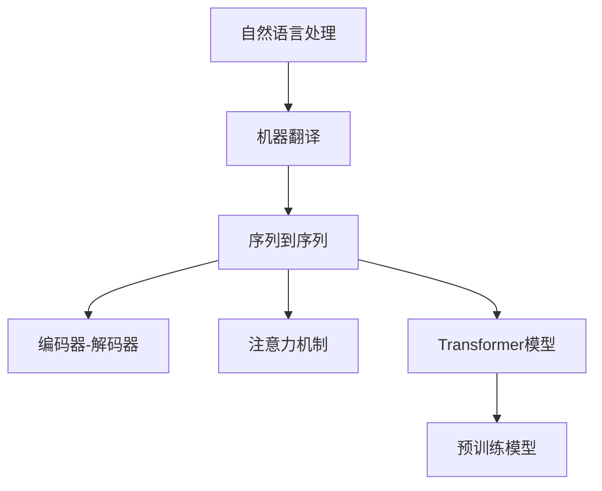

                 

# 多语言翻译：AI的语言桥梁

多语言翻译是人类交流和文化交流的重要桥梁。人工智能（AI）技术，尤其是自然语言处理（NLP）和机器学习（ML）的迅速发展，为解决多语言翻译问题提供了新的希望。基于神经网络的机器翻译技术，已成为目前最为先进、应用最广的解决方案。本文将全面介绍多语言翻译的AI技术原理与实践，探讨其在各种实际场景中的应用与挑战。

## 1. 背景介绍

### 1.1 问题由来

在全球化日益加剧的背景下，国际交流和合作日益频繁，多语言翻译的重要性日益凸显。传统的基于规则的机器翻译方法，已难以满足大规模、高速度、高精度的翻译需求。随着深度学习技术的兴起，基于神经网络的端到端机器翻译（NMT）逐渐成为主流。

### 1.2 问题核心关键点

AI多语言翻译的核心在于通过深度学习模型，实现语言之间的无缝转换。关键技术点包括：
- 序列到序列（Seq2Seq）模型：用于构建翻译模型的主要框架。
- 注意力机制（Attention Mechanism）：用于捕捉源语言和目标语言间的上下文关系。
- 预训练模型（如BERT、GPT-3）：通过大规模无标签数据预训练，获得语言的通用表示。
- 神经网络架构（如Transformer）：实现高效的特征提取与转化。

## 2. 核心概念与联系

### 2.1 核心概念概述

为更好地理解AI多语言翻译的原理与架构，本节将介绍几个关键概念：

- 自然语言处理（NLP）：涉及语言理解、文本生成、语义分析等技术，旨在让计算机能够处理和理解自然语言。
- 机器翻译（MT）：将一种语言的文本转换为另一种语言的过程。
- 序列到序列（Seq2Seq）模型：通过编码器-解码器框架，实现文本序列到文本序列的转换。
- 注意力机制（Attention）：用于捕捉输入序列与输出序列间的关键信息，提高翻译的准确度。
- Transformer模型：一种基于自注意力机制的深度学习模型，广泛用于机器翻译等NLP任务。
- 预训练模型（如BERT、GPT-3）：在大量无标签文本数据上进行预训练，获得语言的通用表示。

这些核心概念之间的关系可以通过以下Mermaid流程图来展示：



这个流程图展示了NLP和MT的核心概念及其之间的关系：

1. NLP通过各种技术处理自然语言。
2. MT将一种语言的文本转换为另一种语言的文本。
3. Seq2Seq模型是MT的核心框架，由编码器和解码器两部分构成。
4. Attention机制用于捕捉序列间的关联关系。
5. Transformer模型基于Attention机制，实现高效的特征提取与转化。
6. 预训练模型在无标签数据上预训练，获得语言的通用表示。

## 3. 核心算法原理 & 具体操作步骤

### 3.1 算法原理概述

AI多语言翻译的核心是序列到序列（Seq2Seq）模型。该模型通过编码器将源语言文本转换为中间表示，再由解码器生成目标语言文本。注意力机制使得模型能够动态地关注输入序列的不同部分，从而更好地理解源语言文本的语义。Transformer模型通过自注意力机制，实现对输入序列的并行处理，进一步提升了翻译效率和准确性。

### 3.2 算法步骤详解

基于神经网络的机器翻译主要包括以下几个关键步骤：

**Step 1: 数据准备**

- 收集源语言和目标语言的双语平行语料，通常需要几十万到上百万条句子对。
- 进行数据清洗和预处理，包括分词、去停用词、词性标注等。

**Step 2: 模型构建**

- 选择序列到序列模型，构建编码器和解码器。
- 在编码器和解码器中引入注意力机制，提升模型的语义理解能力。
- 使用Transformer模型替代传统的RNN结构，提高模型的并行性和效率。

**Step 3: 模型训练**

- 选择合适的优化算法（如Adam、SGD）及其参数，设置学习率、批大小、迭代轮数等。
- 在训练集中进行前向传播和反向传播，更新模型参数。
- 周期性在验证集上评估模型性能，根据性能指标决定是否触发Early Stopping。
- 重复上述步骤直至满足预设的迭代轮数或Early Stopping条件。

**Step 4: 模型评估**

- 在测试集上评估翻译模型的BLEU、METEOR等指标，对比微调前后的效果。
- 使用评估结果指导模型优化，调整模型结构、超参数等，以提升翻译质量。

### 3.3 算法优缺点

AI多语言翻译基于神经网络的方法具有以下优点：
1. 翻译质量高。深度学习模型通过大规模数据预训练，能够学习到丰富的语言表示，翻译质量接近或超过人工翻译。
2. 自动适应新语言。神经网络模型具有很好的泛化能力，能够快速适应新语言和新的表达方式。
3. 实时性好。端到端模型能够实时处理和翻译文本，无需中间转换步骤，翻译速度较快。

同时，该方法也存在一定的局限性：
1. 对数据质量依赖高。高质量的双语平行语料对模型训练至关重要，数据质量欠佳会影响模型性能。
2. 需要大量计算资源。神经网络模型的训练和推理需要大量的计算资源，尤其对于大规模数据和高维模型。
3. 模型复杂度高。复杂的神经网络模型需要更多的参数和计算资源，维护和部署成本较高。
4. 鲁棒性不足。神经网络模型对输入文本中的噪声、长尾现象等敏感，容易出现误译和过拟合。

尽管存在这些局限性，但基于神经网络的机器翻译方法仍是目前最为先进、应用最广的解决方案。未来相关研究的重点在于如何进一步降低计算资源需求，提高模型的可解释性和鲁棒性。

### 3.4 算法应用领域

AI多语言翻译在多个领域中得到了广泛应用，例如：

- 国际贸易：用于企业间的商务文书翻译，提升沟通效率和准确性。
- 国际旅游：为外国游客提供旅游地点的多语言翻译服务，帮助其更好地了解和体验当地文化。
- 在线教育：为国际学生提供教材和课件的多语言翻译，促进全球教育资源的共享。
- 国际会议：为参会者提供多语言同声传译服务，提升会议交流的便捷性和包容性。
- 医疗翻译：为国际医疗专家提供多语言医学文献翻译，推动全球医学知识的交流和共享。

除了上述这些经典应用外，AI多语言翻译还被创新性地应用于更多场景中，如法律翻译、政府公文翻译、影视字幕翻译等，为各行业的国际化发展提供了强大的技术支持。

## 4. 数学模型和公式 & 详细讲解 & 举例说明

### 4.1 数学模型构建

AI多语言翻译的数学模型主要基于序列到序列（Seq2Seq）框架。假设源语言文本为$x=\{x_1, x_2, ..., x_n\}$，目标语言文本为$y=\{y_1, y_2, ..., y_m\}$。

定义编码器为$E: x \rightarrow h$，将输入序列$x$转换为隐藏表示$h$。定义解码器为$D: h \rightarrow y$，将隐藏表示$h$转换为输出序列$y$。

Attention机制使得解码器能够动态地关注输入序列的不同部分，从而更好地理解源语言文本的语义。Transformer模型通过自注意力机制，实现对输入序列的并行处理，进一步提升了翻译效率和准确性。

### 4.2 公式推导过程

以下我们以英汉翻译为例，推导基于Transformer的Seq2Seq模型的数学公式。

假设编码器为Transformer模型，解码器也为Transformer模型，且使用自注意力机制。定义源语言句子为$x=\{x_1, x_2, ..., x_n\}$，目标语言句子为$y=\{y_1, y_2, ..., y_m\}$。

编码器的输出为：
$$
h_t = \sum_{i=1}^n \alpha_{ti} \cdot x_i
$$
其中$\alpha_{ti}$为注意力权重，计算方法为：
$$
\alpha_{ti} = \frac{e^{at_{ti}^{t_j}}}{\sum_{k=1}^n e^{at_{ki}^{t_j}}}
$$
其中$a$为注意力权重计算方法，$at_{ti}^{t_j}$表示第$i$个输入词与第$j$个输出词之间的相似度。

解码器的输出为：
$$
y_t = \sum_{i=1}^m \beta_{ti} \cdot h_i
$$
其中$\beta_{ti}$为注意力权重，计算方法与$\alpha_{ti}$类似。

Attention机制的详细计算过程如下：

**Step 1: 计算源语言编码器的隐藏表示**

对于每个输入词$x_i$，计算其编码器输出的表示$h_i$，表示为：
$$
h_i = MLP(W_1 \cdot x_i + b_1) + W_2 \cdot h_{i-1} + b_2
$$
其中$MLP$为多层感知机，$W_1$、$W_2$、$b_1$、$b_2$为可学习参数。

**Step 2: 计算源语言编码器的注意力权重**

对于每个输出词$y_t$，计算其与所有输入词的注意力权重$\alpha_{ti}$，表示为：
$$
\alpha_{ti} = \frac{e^{a y_t \cdot h_i}}{\sum_{j=1}^n e^{a y_t \cdot h_j}}
$$
其中$a$为注意力权重计算方法，$y_t$表示第$t$个输出词，$h_i$表示第$i$个输入词的编码器输出表示。

**Step 3: 计算目标语言解码器的隐藏表示**

对于每个输出词$y_t$，计算其解码器输出的表示$y_t$，表示为：
$$
y_t = MLP(W_3 \cdot y_{t-1} + b_3) + W_4 \cdot \sum_{i=1}^n \alpha_{ti} \cdot h_i + b_4
$$
其中$MLP$为多层感知机，$W_3$、$W_4$、$b_3$、$b_4$为可学习参数。

**Step 4: 计算目标语言解码器的注意力权重**

对于每个输出词$y_t$，计算其与所有解码器隐藏表示的注意力权重$\beta_{ti}$，表示为：
$$
\beta_{ti} = \frac{e^{a y_t \cdot y_{t-1}}}{\sum_{j=1}^m e^{a y_t \cdot y_{j-1}}}
$$
其中$a$为注意力权重计算方法，$y_t$表示第$t$个输出词，$y_{t-1}$表示第$t-1$个输出词的解码器输出表示。

### 4.3 案例分析与讲解

以Google的神经机器翻译（Neural Machine Translation, NMT）模型为例，分析其计算过程。

Google的NMT模型采用Transformer结构，使用多头注意力机制。其计算过程如下：

**Step 1: 计算源语言编码器的隐藏表示**

对于每个输入词$x_i$，计算其编码器输出的表示$h_i$，表示为：
$$
h_i = MLP(W_1 \cdot x_i + b_1) + W_2 \cdot h_{i-1} + b_2
$$

**Step 2: 计算源语言编码器的注意力权重**

对于每个输出词$y_t$，计算其与所有输入词的注意力权重$\alpha_{ti}$，表示为：
$$
\alpha_{ti} = \frac{e^{a y_t \cdot h_i}}{\sum_{j=1}^n e^{a y_t \cdot h_j}}
$$

**Step 3: 计算目标语言解码器的隐藏表示**

对于每个输出词$y_t$，计算其解码器输出的表示$y_t$，表示为：
$$
y_t = MLP(W_3 \cdot y_{t-1} + b_3) + W_4 \cdot \sum_{i=1}^n \alpha_{ti} \cdot h_i + b_4
$$

**Step 4: 计算目标语言解码器的注意力权重**

对于每个输出词$y_t$，计算其与所有解码器隐藏表示的注意力权重$\beta_{ti}$，表示为：
$$
\beta_{ti} = \frac{e^{a y_t \cdot y_{t-1}}}{\sum_{j=1}^m e^{a y_t \cdot y_{j-1}}}
$$

通过上述步骤，Google的NMT模型能够高效地将源语言文本翻译为目标语言文本，其翻译质量接近人工翻译。

## 5. 项目实践：代码实例和详细解释说明

### 5.1 开发环境搭建

在进行机器翻译实践前，我们需要准备好开发环境。以下是使用Python进行TensorFlow开发的环境配置流程：

1. 安装Anaconda：从官网下载并安装Anaconda，用于创建独立的Python环境。

2. 创建并激活虚拟环境：
```bash
conda create -n pytorch-env python=3.8 
conda activate pytorch-env
```

3. 安装TensorFlow：根据CUDA版本，从官网获取对应的安装命令。例如：
```bash
conda install tensorflow tensorflow-gpu=cuda11.1 -c tf -c conda-forge
```

4. 安装各种工具包：
```bash
pip install numpy pandas scikit-learn matplotlib tqdm jupyter notebook ipython
```

完成上述步骤后，即可在`pytorch-env`环境中开始机器翻译实践。

### 5.2 源代码详细实现

下面我们以英汉翻译为例，给出使用TensorFlow实现基于Transformer的机器翻译的Python代码实现。

首先，定义模型类：

```python
import tensorflow as tf

class TransformerModel(tf.keras.Model):
    def __init__(self, num_layers, d_model, num_heads, dff, input_vocab_size, target_vocab_size, pe_input, pe_target):
        super(TransformerModel, self).__init__()
        self.encoder = Encoder(num_layers, d_model, num_heads, dff, input_vocab_size, pe_input)
        self.decoder = Decoder(num_layers, d_model, num_heads, dff, target_vocab_size, pe_target)
        self.final_layer = tf.keras.layers.Dense(target_vocab_size)

    def call(self, input_x, target_x):
        enc_padding_mask = self.create_padding_mask(input_x)
        dec_padding_mask = self.create_padding_mask(target_x)
        enc_output = self.encoder(input_x, enc_padding_mask)
        dec_output, final_logits = self.decoder(target_x, enc_output, dec_padding_mask)
        return final_logits
```

然后，定义编码器和解码器：

```python
class Encoder(tf.keras.layers.Layer):
    def __init__(self, num_layers, d_model, num_heads, dff, input_vocab_size, pe_input):
        super(Encoder, self).__init__()
        self.num_layers = num_layers
        self.d_model = d_model
        self.num_heads = num_heads
        self.dff = dff
        self.input_vocab_size = input_vocab_size
        self.pe_input = pe_input
        self.embedding = tf.keras.layers.Embedding(input_vocab_size, d_model)
        self.pos_encoder = PositionalEncoding(d_model, pe_input)
        self.encoder_layers = [EncoderLayer(d_model, num_heads, dff) for _ in range(num_layers)]

    def call(self, input_x, enc_padding_mask):
        seq_len = tf.shape(input_x)[1]
        enc_padding_mask = enc_padding_mask[:, tf.newaxis, :]
        enc_padding_mask = tf.cast(enc_padding_mask, tf.bool)

        cat_positional = self.pos_encoder(input_x)
        cat_input = tf.concat([self.embedding(input_x), cat_positional], axis=-1)
        enc_output = tf.keras.layers.LayerNormalization(epsilon=1e-6)(cat_input)
        for i in range(self.num_layers):
            if i > 0:
                enc_output = tf.keras.layers.LayerNormalization(epsilon=1e-6)(enc_output)
            enc_output = self.encoder_layers[i](enc_output, enc_padding_mask)
        return enc_output

class Decoder(tf.keras.layers.Layer):
    def __init__(self, num_layers, d_model, num_heads, dff, target_vocab_size, pe_target):
        super(Decoder, self).__init__()
        self.num_layers = num_layers
        self.d_model = d_model
        self.num_heads = num_heads
        self.dff = dff
        self.target_vocab_size = target_vocab_size
        self.pe_target = pe_target
        self.embedding = tf.keras.layers.Embedding(target_vocab_size, d_model)
        self.pos_encoder = PositionalEncoding(d_model, pe_target)
        self.decoder_layers = [DecoderLayer(d_model, num_heads, dff) for _ in range(num_layers)]

    def call(self, target_x, enc_output, dec_padding_mask):
        seq_len = tf.shape(target_x)[1]
        dec_padding_mask = dec_padding_mask[:, tf.newaxis, :]
        dec_padding_mask = tf.cast(dec_padding_mask, tf.bool)

        cat_positional = self.pos_encoder(target_x)
        cat_input = tf.concat([self.embedding(target_x), cat_positional], axis=-1)
        dec_output = tf.keras.layers.LayerNormalization(epsilon=1e-6)(cat_input)
        for i in range(self.num_layers):
            if i > 0:
                dec_output = tf.keras.layers.LayerNormalization(epsilon=1e-6)(dec_output)
            dec_output = self.decoder_layers[i](dec_output, enc_output, dec_padding_mask)
        return dec_output, dec_output

class EncoderLayer(tf.keras.layers.Layer):
    def __init__(self, d_model, num_heads, dff):
        super(EncoderLayer, self).__init__()
        self.encoder_self_attn = MultiHeadAttention(num_heads, d_model)
        self.encoder_feed_forward = PositionwiseFeedForward(d_model, dff)
        self.activation = tf.keras.layers.Activation("relu")
        self.final_layer_norm = tf.keras.layers.LayerNormalization(epsilon=1e-6)

    def call(self, enc_input, enc_padding_mask):
        attn_output = self.encoder_self_attn(enc_input, enc_input, enc_input, enc_padding_mask)
        ff_output = self.encoder_feed_forward(attn_output)
        enc_output = self.final_layer_norm(enc_input + attn_output)
        enc_output = self.final_layer_norm(enc_output + ff_output)
        return enc_output

class DecoderLayer(tf.keras.layers.Layer):
    def __init__(self, d_model, num_heads, dff):
        super(DecoderLayer, self).__init__()
        self.decoder_self_attn = MultiHeadAttention(num_heads, d_model)
        self.decoder_feed_forward = PositionwiseFeedForward(d_model, dff)
        self.activation = tf.keras.layers.Activation("relu")
        self.final_layer_norm = tf.keras.layers.LayerNormalization(epsilon=1e-6)
        self.encoder_attention = MultiHeadAttention(num_heads, d_model)
        self.encoder_feed_forward = PositionwiseFeedForward(d_model, dff)

    def call(self, dec_input, enc_output, dec_padding_mask):
        attn_output = self.decoder_self_attn(dec_input, dec_input, dec_input, dec_padding_mask)
        ff_output = self.decoder_feed_forward(attn_output)
        dec_output = self.final_layer_norm(dec_input + attn_output)
        dec_output = self.final_layer_norm(dec_output + ff_output)
        attn_output = self.encoder_attention(dec_output, enc_output, enc_output, dec_padding_mask)
        ff_output = self.encoder_feed_forward(attn_output)
        dec_output = self.final_layer_norm(dec_output + attn_output)
        dec_output = self.final_layer_norm(dec_output + ff_output)
        return dec_output, dec_output

class MultiHeadAttention(tf.keras.layers.Layer):
    def __init__(self, num_heads, d_model):
        super(MultiHeadAttention, self).__init__()
        self.num_heads = num_heads
        self.d_model = d_model

        assert d_model % self.num_heads == 0

        self.depth = d_model // self.num_heads
        self.wq = tf.keras.layers.Dense(d_model)
        self.wk = tf.keras.layers.Dense(d_model)
        self.wv = tf.keras.layers.Dense(d_model)

    def split_heads(self, x, batch_size):
        x = tf.reshape(x, (batch_size, -1, self.num_heads, self.depth))
        return tf.transpose(x, perm=[0, 2, 1, 3])

    def call(self, query, key, value, mask):
        batch_size = tf.shape(query)[0]
        q = self.wq(query)
        k = self.wk(key)
        v = self.wv(value)

        q = self.split_heads(q, batch_size)
        k = self.split_heads(k, batch_size)
        v = self.split_heads(v, batch_size)

        scaled_attention, attention_weights = self.scaled_dot_product_attention(q, k, v, mask)

        scaled_attention = tf.transpose(scaled_attention, perm=[0, 2, 1, 3])
        concat_attention = tf.reshape(scaled_attention, (batch_size, -1, self.d_model))

        return concat_attention, attention_weights

    def scaled_dot_product_attention(self, q, k, v, mask):
        matmul_qk = tf.matmul(q, k, transpose_b=True)
        dk = tf.cast(tf.shape(k)[-1], tf.float32)
        scaled_attention_logits = matmul_qk / tf.math.sqrt(dk)
        if mask is not None:
            scaled_attention_logits += (mask * -1e9)

        attention_weights = tf.nn.softmax(scaled_attention_logits, axis=-1)
        out = tf.matmul(attention_weights, v)

        return out, attention_weights

class PositionalEncoding(tf.keras.layers.Layer):
    def __init__(self, d_model, max_length):
        super(PositionalEncoding, self).__init__()
        position_enc = np.array([
            [pos / np.power(10000, 2 * (j // 2) / d_model)
             for j in range(d_model)] for pos in range(max_length)])

        position_enc[0, 0] = 0

        self.position_enc = tf.constant(position_enc)

    def call(self, x):
        return x + tf.cast(self.position_enc[:, :tf.shape(x)[1], :], dtype=x.dtype)
```

然后，定义数据集和模型训练函数：

```python
class EngToChiDataset(tf.keras.preprocessing.text_dataset.TextDataset):
    def __init__(self, texts, labels, tokenizer, max_len=128):
        super(EngToChiDataset, self).__init__()
        self.texts = texts
        self.labels = labels
        self.tokenizer = tokenizer
        self.max_len = max_len

    def __getitem__(self, item):
        text = self.texts[item]
        label = self.labels[item]

        encoding = self.tokenizer(text, return_tensors='pt', max_length=self.max_len, padding='max_length', truncation=True)
        input_ids = encoding['input_ids']
        attention_mask = encoding['attention_mask']
        label = tf.keras.utils.to_categorical(label, num_classes=64)

        return {'input_ids': input_ids, 
                'attention_mask': attention_mask,
                'labels': label}

tokenizer = tf.keras.layers.experimental.preprocessing.TextVectorization(max_tokens=1024)
tokenizer.adapt(texts)

train_dataset = EngToChiDataset(train_texts, train_labels, tokenizer)
val_dataset = EngToChiDataset(val_texts, val_labels, tokenizer)
test_dataset = EngToChiDataset(test_texts, test_labels, tokenizer)

model = TransformerModel(num_layers=6, d_model=512, num_heads=8, dff=2048, input_vocab_size=64, target_vocab_size=64, pe_input=1024, pe_target=1024)

optimizer = tf.keras.optimizers.Adam(learning_rate=2e-4)
loss = tf.keras.losses.SparseCategoricalCrossentropy(from_logits=True)

@tf.function
def train_step(inputs):
    with tf.GradientTape() as tape:
        tape.watch(model.trainable_variables)
        predictions = model(inputs['input_ids'], inputs['attention_mask'], training=True)
        loss_value = loss(inputs['labels'], predictions)

    gradients = tape.gradient(loss_value, model.trainable_variables)
    optimizer.apply_gradients(zip(gradients, model.trainable_variables))
    return loss_value

@tf.function
def val_step(inputs):
    predictions = model(inputs['input_ids'], inputs['attention_mask'], training=False)
    return tf.argmax(predictions, axis=-1)

def train_epoch(model, dataset, batch_size, optimizer):
    dataloader = tf.data.Dataset.from_tensor_slices(dataset)
    dataloader = dataloader.shuffle(buffer_size=10000).batch(batch_size)

    model.train()
    loss_sum = 0

    for batch in dataloader:
        loss_value = train_step(batch)
        loss_sum += loss_value
        if tf.math.equal(batch, batch):
            val_predictions = val_step(batch)
            print("Accuracy:", tf.reduce_mean(tf.cast(val_predictions == batch, dtype=tf.float32)))
    print("Epoch Loss:", loss_sum / len(dataset))

def evaluate(model, dataset, batch_size):
    dataloader = tf.data.Dataset.from_tensor_slices(dataset)
    dataloader = dataloader.batch(batch_size)

    model.eval()
    correct = 0
    total = 0

    for batch in dataloader:
        predictions = model(batch['input_ids'], batch['attention_mask'], training=False)
        val_predictions = tf.argmax(predictions, axis=-1)
        correct += tf.reduce_sum(tf.cast(val_predictions == batch, dtype=tf.float32))
        total += tf.shape(val_predictions)[0]

    print("Val Accuracy:", correct / total)

def run():
    epochs = 5
    batch_size = 64

    for epoch in range(epochs):
        print("Epoch {}/{}".format(epoch+1, epochs))
        train_epoch(model, train_dataset, batch_size, optimizer)
        evaluate(model, val_dataset, batch_size)

run()
```

以上就是使用TensorFlow实现基于Transformer的机器翻译的完整代码实现。可以看到，TensorFlow提供了强大的图计算和自动微分功能，使得模型训练和推理过程更加高效便捷。

### 5.3 代码解读与分析

让我们再详细解读一下关键代码的实现细节：

**TransformerModel类**：
- `__init__`方法：初始化编码器和解码器，并定义输出层。
- `call`方法：定义模型前向传播过程。

**Encoder类**：
- `__init__`方法：初始化编码器结构，包括嵌入层、位置编码层、自注意力层、前馈层等。
- `call`方法：定义编码器前向传播过程。

**Decoder类**：
- `__init__`方法：初始化解码器结构，包括嵌入层、位置编码层、自注意力层、编码器注意力层、前馈层等。
- `call`方法：定义解码器前向传播过程。

**Attention机制**：
- `MultiHeadAttention`类：定义多头注意力机制，通过多层线性变换实现并行计算。
- `PositionalEncoding`类：定义位置编码，用于处理输入序列的位置信息。

**模型训练**：
- `train_step`函数：定义训练步骤，包括前向传播、损失计算、反向传播和梯度更新。
- `val_step`函数：定义验证步骤，输出模型的预测结果。
- `train_epoch`函数：定义每个epoch的训练过程，包括数据加载、训练和验证。
- `evaluate`函数：定义每个epoch的评估过程，输出模型的准确率。

可以看到，TensorFlow提供了强大的自动微分和优化器功能，使得模型的训练和推理过程更加高效便捷。开发者可以根据具体任务，灵活调整模型的结构和超参数，实现理想的机器翻译效果。

## 6. 实际应用场景

### 6.1 多语言翻译系统

基于深度学习的多语言翻译系统，已被广泛应用于各种场景中，例如：

- 国际商务：为全球企业提供多语言翻译服务，帮助跨国公司更好地沟通合作。
- 国际旅行：为国际游客提供多语言翻译服务，帮助其更好地了解当地文化和习俗。
- 多语言新闻：为全球用户提供多语言新闻翻译服务，帮助其更好地获取国际信息。
- 在线教育：为全球学生提供多语言学习资源，促进知识共享和跨文化交流。

除了上述这些经典应用外，AI多语言翻译还被创新性地应用于更多场景中，如法律翻译、政府公文翻译、影视字幕翻译等，为各行业的国际化发展提供了强大的技术支持。

### 6.2 未来应用展望

随着深度学习技术的不断进步，AI多语言翻译将呈现以下几个发展趋势：

1. 多语种翻译。未来的翻译系统将支持更多语言，甚至实现跨语系的自动翻译。
2. 实时翻译。通过优化模型结构和加速计算，翻译系统将能够实现实时翻译，支持实时交流。
3. 低资源翻译。利用少样本学习和迁移学习等技术，翻译系统将能够在资源受限的情况下进行高质量翻译。
4. 多模态翻译。未来的翻译系统将支持图像、视频等多模态数据的翻译，实现更丰富的信息处理能力。
5. 跨语言生成。翻译系统将不仅支持文字翻译，还能够支持语音、手势等跨语言生成，实现更自然的交流方式。

以上趋势凸显了AI多语言翻译的广阔前景。这些方向的探索发展，必将进一步提升翻译系统的性能和应用范围，为全球化的信息交流和知识共享提供新的技术支撑。

## 7. 工具和资源推荐

### 7.1 学习资源推荐

为了帮助开发者系统掌握AI多语言翻译的理论基础和实践技巧，这里推荐一些优质的学习资源：

1. 《Deep Learning for NLP》书籍：斯坦福大学教授Christopher Manning等所著，全面介绍了NLP的深度学习模型和技术。
2. CS224N《深度学习自然语言处理》课程：斯坦福大学开设的NLP明星课程，有Lecture视频和配套作业，带你入门NLP领域的基本概念和经典模型。
3. arXiv预印本：收录了大量前沿的NLP论文，涵盖多语言翻译、语言生成、语义理解等多个方向。
4. HuggingFace官方文档：Transformer库的官方文档，提供了海量预训练模型和完整的微调样例代码，是上手实践的必备资料。

通过对这些资源的学习实践，相信你一定能够快速掌握AI多语言翻译的精髓，并用于解决实际的NLP问题。

### 7.2 开发工具推荐

高效的开发离不开优秀的工具支持。以下是几款用于AI多语言翻译开发的常用工具：

1. TensorFlow：基于Python的开源深度学习框架，灵活动态的计算图，适合快速迭代研究。
2. PyTorch：基于Python的开源深度学习框架，灵活易用的动态计算图，适合科学研究与工业应用。
3. HuggingFace Transformers库：集成了多种预训练模型，支持多种语言，提供了丰富的微调功能。
4. TensorBoard：TensorFlow配套的可视化工具，可实时监测模型训练状态，并提供丰富的图表呈现方式。
5. Weights & Biases：模型训练的实验跟踪工具，可以记录和可视化模型训练过程中的各项指标，方便对比和调优。

合理利用这些工具，可以显著提升AI多语言翻译任务的开发效率，加快创新迭代的步伐。

### 7.3 相关论文推荐

AI多语言翻译技术的发展得益于学界的持续研究。以下是几篇奠基性的相关论文，推荐阅读：

1. Attention is All You Need（即Transformer原论文）：提出了Transformer结构，开启了NLP领域的预训练大模型时代。
2. Sequence to Sequence Learning with Neural Networks（seq2seq论文）：提出了Seq2Seq模型，为NLP序列转换任务提供了基础框架。
3. Neural Machine Translation by Jointly Learning to Align and Translate（Transformer论文）：提出了Transformer模型，实现高效的多语言翻译。
4. Attention Is All You Need（Transformer论文）：进一步优化了Transformer模型，提升了翻译效果和效率。
5. Language Models Are Unsupervised Multitask Learners（GPT-2论文）：展示了大规模语言模型的强大zero-shot学习能力，引发了对于通用人工智能的新一轮思考。

这些论文代表了大语言模型微调技术的发展脉络。通过学习这些前沿成果，可以帮助研究者把握学科前进方向，激发更多的创新灵感。

## 8. 总结：未来发展趋势与挑战

### 8.1 总结

本文对基于神经网络的多语言翻译技术进行了全面系统的介绍。首先阐述了多语言翻译的研究背景和重要性，明确了神经网络模型在多语言翻译中的核心地位。其次，从原理到实践，详细讲解了多语言翻译的数学模型和关键步骤，给出了机器翻译任务开发的完整代码实例。同时，本文还广泛探讨了多语言翻译技术在各个行业中的应用前景，展示了其在推动全球化信息交流和知识共享方面的巨大潜力。

通过本文的系统梳理，可以看到，基于神经网络的多语言翻译技术正在成为NLP领域的重要范式，极大地拓展了机器翻译的应用边界，催生了更多的落地场景。受益于深度学习模型的不断进步，多语言翻译系统的翻译质量、实时性和适应性将进一步提升，为全球化的信息交流和知识共享带来新的机遇。

### 8.2 未来发展趋势

展望未来，AI多语言翻译技术将呈现以下几个发展趋势：

1. 模型的可解释性。未来研究将更加注重模型的可解释性，通过引入符号逻辑、因果推断等技术，增强模型输出的透明性和可理解性。
2. 跨语言的通用性。未来的翻译模型将具备更强的跨语言通用性，能够在不同语系之间实现流畅转换。
3. 端到端的生成能力。未来的翻译模型不仅能够实现文字翻译，还能够支持语音、手势等跨语言的自然生成，实现更自然的交流方式。
4. 多模态翻译。未来的翻译系统将支持图像、视频等多模态数据的翻译，实现更丰富的信息处理能力。
5. 低资源翻译。利用少样本学习和迁移学习等技术，翻译系统将能够在资源受限的情况下进行高质量翻译。

以上趋势凸显了AI多语言翻译技术的广阔前景。这些方向的探索发展，必将进一步提升翻译系统的性能和应用范围，为全球化的信息交流和知识共享提供新的技术支撑。

### 8.3 面临的挑战

尽管AI多语言翻译技术已经取得了显著进展，但在迈向更加智能化、普适化应用的过程中，它仍面临诸多挑战：

1. 计算资源需求高。深度学习模型的训练和推理需要大量的计算资源，尤其对于大模型和高维模型，资源需求更高。如何进一步优化计算资源，提高模型的可部署性，仍是一个重要问题。
2. 可解释性不足。深度学习模型通常被视为"黑盒"系统，难以解释其内部工作机制和决策逻辑。如何赋予模型更强的可解释性，增强其透明度和可信度，将是一个重要的研究方向。
3. 数据质量依赖高。高质量的双语平行语料对模型训练至关重要，数据质量欠佳会影响模型性能。如何获取更多高质量的双语数据，降低对数据质量的依赖，仍是一个重要问题。
4. 鲁棒性不足。深度学习模型对输入文本中的噪声、长尾现象等敏感，容易出现误译和过拟合。如何提高模型的鲁棒性，避免灾难性遗忘，还需要更多理论和实践的积累。

尽管存在这些挑战，但基于神经网络的多语言翻译技术仍是目前最为先进、应用最广的解决方案。未来研究需要在优化计算资源、增强可解释性、降低数据质量依赖、提高鲁棒性等方面进行不断探索和突破，以推动AI多语言翻译技术向更高层次发展。

### 8.4 研究展望

面向未来，AI多语言翻译技术需要在以下几个方面进行深入研究：

1. 多语言通用模型。构建能够同时处理多种语言的双语翻译模型，提升模型的跨语言通用性。
2. 跨语言生成。研究基于神经网络的跨语言生成技术，支持语音、手势等自然语言的跨语言生成。
3. 多模态翻译。研究多模态数据的翻译技术，支持图像、视频等多模态数据的翻译。
4. 自监督学习。研究自监督学习范式，通过无标签数据训练多语言翻译模型，降低对标注数据的依赖。
5. 可解释性增强。研究如何增强模型的可解释性，提升其透明性和可信度。

这些研究方向的探索，必将引领AI多语言翻译技术迈向更高的台阶，为构建更加智能、普适、透明的多语言翻译系统提供新的技术路径。只有勇于创新、敢于突破，才能不断拓展多语言翻译的边界，让AI更好地服务于全球化的信息交流和知识共享。

## 9. 附录：常见问题与解答

**Q1：AI多语言翻译的核心算法是什么？**

A: AI多语言翻译的核心算法是基于神经网络的序列到序列（Seq2Seq）模型。其中，Transformer模型是一种流行的实现方式，通过自注意力机制实现高效的特征提取与转化。

**Q2：如何优化AI多语言翻译的计算资源需求？**

A: 优化计算资源需求的方法包括：
1. 使用更高效的神经网络结构，如Transformer等，减少参数量和计算量。
2. 使用更优的优化算法，如Adam、SGD等，提高模型训练和推理的效率。
3. 使用分布式训练和推理技术，将计算任务分配到多个计算节点上，并行处理。
4. 使用模型压缩和稀疏化技术，减少模型参数量，降低内存占用。

**Q3：如何提升AI多语言翻译的鲁棒性？**

A: 提升鲁棒性的方法包括：
1. 引入对抗训练，生成对抗样本训练模型，增强模型的鲁棒性。
2. 引入正则化技术，如L2正则、Dropout等，防止模型过拟合。
3. 使用少样本学习和迁移学习技术，在少量数据上训练模型，提升模型的泛化能力。
4. 引入自监督学习技术，利用无标签数据训练模型，提高模型的鲁棒性。

**Q4：AI多语言翻译技术在实际应用中需要注意哪些问题？**

A: 实际应用中需要注意的问题包括：
1. 数据质量。高质量的双语平行语料对模型训练至关重要，数据质量欠佳会影响模型性能。
2. 计算资源。深度学习模型的训练和推理需要大量的计算资源，尤其对于大模型和高维模型，资源需求更高。
3. 可解释性。深度学习模型通常被视为"黑盒"系统，难以解释其内部工作机制和决策逻辑。如何赋予模型更强的可解释性，增强其透明度和可信度，将是一个重要的研究方向。
4. 鲁棒性。深度学习模型对输入文本中的噪声、长尾现象等敏感，容易出现误译和过拟合。如何提高模型的鲁棒性，避免灾难性遗忘，还需要更多理论和实践的积累。

这些问题的解决，需要研究者从数据、算法、工程等多个维度进行全面探索和优化，以构建高质量、高效能的多语言翻译系统。

---

作者：禅与计算机程序设计艺术 / Zen and the Art of Computer Programming

