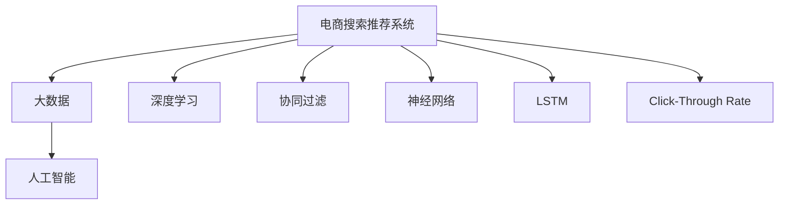

                 

# 大数据与AI 驱动的电商平台：搜索推荐系统是核心竞争优势

> 关键词：电商、搜索推荐系统、大数据、AI、深度学习、协同过滤、神经网络、Click-Through Rate(CTR)、深度学习强化学习、长短期记忆网络(LSTM)

## 1. 背景介绍

### 1.1 问题由来
随着电商行业竞争的加剧，如何提升用户购物体验，提高转化率，增加用户粘性，成为电商平台追求的核心目标。大数据与人工智能技术为电商平台提供了实现这一目标的强大工具。

在电商平台的众多功能中，搜索推荐系统是提升用户体验的关键环节。通过精准的搜索和个性化推荐，用户可以快速找到需要的商品，提升购物体验和满意度。同时，推荐系统的精准度也是电商平台竞争力的重要体现，在广告投放、库存管理等方面起到了关键作用。

### 1.2 问题核心关键点
电商平台的搜索推荐系统主要包括以下几个核心关键点：

1. 用户行为数据收集：电商平台需要收集大量的用户行为数据，包括浏览记录、点击行为、购买记录等。
2. 特征提取：将用户行为数据转化为模型可以理解的特征向量。
3. 模型选择与训练：选择合适的推荐算法模型，使用训练数据对其进行训练。
4. 实时推荐：基于实时数据和用户特征，生成推荐结果。
5. 推荐效果评估：通过点击率、转化率等指标评估推荐效果。
6. 系统扩展与优化：针对大规模数据和高并发请求，对系统进行扩展和优化。

这些关键点共同构成了电商搜索推荐系统的完整流程，决定了其性能和效果。

### 1.3 问题研究意义
电商搜索推荐系统作为电商平台的核心竞争力，其优化效果直接影响了用户体验和平台盈利能力。通过深入研究搜索推荐系统，可以提升用户转化率和购物体验，增强平台的用户粘性，从而提高电商平台的市场竞争力。

## 2. 核心概念与联系

### 2.1 核心概念概述

为了更好地理解电商搜索推荐系统的核心技术，本节将介绍几个密切相关的核心概念：

- 电商搜索推荐系统(E-commerce Search & Recommendation System)：电商平台中的搜索推荐功能，通过用户行为数据和商品信息，为用户提供精准的搜索结果和个性化推荐。
- 大数据(Big Data)：指规模庞大的、形式多样的、分布式存储的数据集合，电商平台中用户的点击、浏览、购买等数据都属于大数据的范畴。
- 人工智能(Artificial Intelligence, AI)：通过机器学习、深度学习等技术，使计算机能够模拟人类智能行为，实现对用户行为的预测和推荐。
- 深度学习(Deep Learning)：一种基于神经网络的人工智能技术，通过多层次的特征提取和模型训练，实现对复杂问题的精准预测和决策。
- 协同过滤(Collaborative Filtering)：一种常用的推荐算法，通过用户行为相似性进行推荐。
- Click-Through Rate(CTR)：点击率，即用户点击某项推荐的概率，是评估推荐系统效果的重要指标。
- 神经网络(Neural Network)：模拟人脑神经元工作机制的计算模型，广泛应用于电商搜索推荐系统的特征提取和模型训练。
- 长短期记忆网络(Long Short-Term Memory, LSTM)：一种特殊的神经网络结构，适用于处理时间序列数据，常用于电商搜索推荐系统的用户行为预测。

这些核心概念之间的逻辑关系可以通过以下Mermaid流程图来展示：



这个流程图展示了大数据与AI技术在电商搜索推荐系统中的应用框架，其中深度学习、协同过滤、神经网络等技术手段与电商搜索推荐系统息息相关。通过理解这些核心概念，我们可以更好地把握搜索推荐系统的原理和优化方向。

## 3. 核心算法原理 & 具体操作步骤
### 3.1 算法原理概述

电商搜索推荐系统的核心算法原理是基于机器学习和深度学习的推荐系统。其核心思想是：通过用户行为数据和商品信息，构建用户与商品之间的关系模型，使用模型预测用户对商品的兴趣，从而生成个性化推荐。

形式化地，假设电商平台有 $N$ 个用户 $U$ 和 $M$ 个商品 $I$，每个用户 $u$ 对商品 $i$ 的兴趣表示为 $r_{ui}$，$u \in U, i \in I$。电商平台的推荐系统目标是最大化点击率，即：

$$
\max_{r_{ui}} \frac{1}{N} \sum_{u \in U} \sum_{i \in I} r_{ui}y_{ui}
$$

其中 $y_{ui}$ 为二值变量，$y_{ui}=1$ 表示用户 $u$ 点击商品 $i$，否则 $y_{ui}=0$。

通过最大化点击率，搜索推荐系统能够将最可能吸引用户注意的商品推荐给用户，从而提升用户的点击和购买行为。

### 3.2 算法步骤详解

电商搜索推荐系统的构建一般包括以下几个关键步骤：

**Step 1: 数据收集与预处理**
- 收集电商平台的用户行为数据，如浏览记录、点击行为、购买记录等。
- 对数据进行清洗和预处理，去除噪音和异常值，补全缺失数据。

**Step 2: 特征提取**
- 将用户行为数据转化为模型可以理解的特征向量，如用户ID、商品ID、浏览时间、点击次数等。
- 使用特征选择和降维技术，减少特征维度，提高模型的训练效率。

**Step 3: 模型选择与训练**
- 选择合适的推荐算法模型，如协同过滤、深度学习模型等。
- 使用训练数据对模型进行训练，调整模型参数，提升模型性能。

**Step 4: 实时推荐**
- 根据实时数据和用户特征，生成推荐结果。
- 使用推荐算法模型对用户行为进行预测，输出推荐商品列表。

**Step 5: 推荐效果评估**
- 使用点击率、转化率等指标评估推荐效果。
- 分析用户反馈和行为数据，不断优化推荐模型。

**Step 6: 系统扩展与优化**
- 针对大规模数据和高并发请求，对系统进行扩展和优化，提升系统性能。
- 使用缓存、分布式计算等技术，减少延迟，提高响应速度。

以上是电商搜索推荐系统的构建流程，每个步骤都需要细致设计，确保系统的稳定性和高效性。

### 3.3 算法优缺点

电商搜索推荐系统的推荐算法具有以下优点：
1. 个性化推荐：能够根据用户的历史行为和兴趣，提供个性化推荐，提升用户体验。
2. 精准预测：深度学习等技术手段能够准确预测用户行为，提升推荐精准度。
3. 实时推荐：能够基于实时数据生成推荐，及时响应用户需求。
4. 可扩展性：通过分布式计算和缓存等技术，能够处理大规模数据和高并发请求。

同时，该算法也存在以下局限性：
1. 数据依赖性强：需要大量标注数据和用户行为数据，难以获取。
2. 模型复杂度高：深度学习等算法模型较为复杂，训练和推理效率较低。
3. 冷启动问题：新用户和商品缺乏足够数据，难以生成推荐。
4. 多样性不足：推荐结果可能过于集中，无法覆盖所有商品。
5. 用户隐私问题：需要收集大量用户行为数据，涉及用户隐私保护问题。

尽管存在这些局限性，但就目前而言，基于深度学习的电商搜索推荐系统仍然是实现个性化推荐的主要手段。未来相关研究的重点在于如何进一步降低对标注数据的依赖，提高推荐算法的多样性和公平性，同时兼顾可解释性和隐私保护等因素。

### 3.4 算法应用领域

电商搜索推荐系统在电商行业中得到了广泛的应用，覆盖了从商品展示、购物篮推荐、个性化广告到库存管理等多个环节。以下是几个典型的应用场景：

- 商品展示：根据用户浏览记录，推荐相关商品，增加曝光率。
- 购物篮推荐：根据用户购物篮中的商品，推荐搭配商品，提升购买意愿。
- 个性化广告：根据用户历史行为，投放个性化广告，提升广告效果。
- 库存管理：根据推荐系统的预测结果，动态调整商品库存，减少库存积压。
- 搜索排序：根据用户搜索关键词，生成个性化搜索结果，提升搜索效果。

除了上述这些经典应用外，电商搜索推荐系统还被创新性地应用到更多场景中，如跨商品推荐、标签推荐、社交推荐等，为电商平台的运营提供了全面的技术支持。

## 4. 数学模型和公式 & 详细讲解  
### 4.1 数学模型构建

本节将使用数学语言对电商搜索推荐系统的核心算法进行更加严格的刻画。

假设电商平台的推荐系统使用协同过滤算法，训练集为 $D=\{(x_i,y_i)\}_{i=1}^N$，其中 $x_i$ 为用户的浏览记录或购买记录，$y_i$ 为该记录对应的点击记录。训练目标为最大化预测的点击率，即：

$$
\max_{\theta} \frac{1}{N} \sum_{i=1}^N \ell(x_i, y_i; \theta)
$$

其中 $\ell(x_i, y_i; \theta)$ 为预测误差函数，$y_i=1$ 表示用户点击该记录，否则 $y_i=0$。

常见的误差函数包括：
- 二分类交叉熵损失：$L(x_i, y_i; \theta) = -[y_i\log\sigma(x_i^T\theta) + (1-y_i)\log(1-\sigma(x_i^T\theta))]$
- 均方误差损失：$L(x_i, y_i; \theta) = \frac{1}{2}(x_i^T\theta - y_i)^2$

在得到损失函数后，模型使用梯度下降等优化算法进行训练，最小化损失函数：

$$
\theta \leftarrow \theta - \eta \nabla_{\theta}\mathcal{L}(\theta)
$$

其中 $\eta$ 为学习率，$\nabla_{\theta}\mathcal{L}(\theta)$ 为损失函数对模型参数的梯度。

### 4.2 公式推导过程

以下我们以协同过滤算法为例，推导损失函数的梯度计算公式。

假设训练集中第 $i$ 个样本的用户行为表示为 $x_i \in \mathbb{R}^n$，其中 $n$ 为特征维度。训练目标为最大化预测的点击率，即：

$$
\max_{\theta} \frac{1}{N} \sum_{i=1}^N \ell(x_i, y_i; \theta)
$$

令 $\theta = [w; b]$，其中 $w \in \mathbb{R}^n$ 为模型参数，$b \in \mathbb{R}$ 为偏置项。预测函数为：

$$
\sigma(x_i^T\theta) = \frac{1}{1+e^{-x_i^T\theta}}
$$

其中 $\sigma(x_i^T\theta)$ 为sigmoid函数，将预测结果映射到 [0,1] 区间内。

对于二分类交叉熵损失，我们有：

$$
L(x_i, y_i; \theta) = -[y_i\log\sigma(x_i^T\theta) + (1-y_i)\log(1-\sigma(x_i^T\theta))]
$$

将 $\sigma(x_i^T\theta)$ 展开，得到：

$$
L(x_i, y_i; \theta) = -[y_i(\log(\sigma(x_i^T\theta)) - (1-y_i)\log(1-\sigma(x_i^T\theta)))
$$

对 $w$ 求偏导数，得到梯度：

$$
\frac{\partial L(x_i, y_i; \theta)}{\partial w} = y_i\frac{e^{-x_i^T\theta}}{1+e^{-x_i^T\theta}} - (1-y_i)\frac{e^{x_i^T\theta}}{1+e^{x_i^T\theta}}
$$

将其带入梯度下降公式，更新模型参数：

$$
w \leftarrow w - \eta \frac{\partial L(x_i, y_i; \theta)}{\partial w}
$$

通过上述过程，协同过滤算法能够根据训练数据调整模型参数，预测用户的点击行为，生成推荐结果。

## 5. 项目实践：代码实例和详细解释说明
### 5.1 开发环境搭建

在进行电商搜索推荐系统开发前，我们需要准备好开发环境。以下是使用Python进行TensorFlow开发的环境配置流程：

1. 安装Anaconda：从官网下载并安装Anaconda，用于创建独立的Python环境。

2. 创建并激活虚拟环境：
```bash
conda create -n tf-env python=3.8 
conda activate tf-env
```

3. 安装TensorFlow：根据CUDA版本，从官网获取对应的安装命令。例如：
```bash
conda install tensorflow -c tensorflow -c conda-forge
```

4. 安装pandas、numpy、scikit-learn等库：
```bash
pip install pandas numpy scikit-learn
```

5. 安装TensorBoard：用于可视化模型训练过程和结果。
```bash
pip install tensorboard
```

6. 安装其他工具包：
```bash
pip install tqdm h5py joblib jupyter notebook ipython
```

完成上述步骤后，即可在`tf-env`环境中开始搜索推荐系统开发。

### 5.2 源代码详细实现

下面我们以协同过滤算法为例，给出使用TensorFlow实现电商搜索推荐系统的PyTorch代码实现。

首先，定义训练数据集：

```python
import pandas as pd
import numpy as np
from sklearn.model_selection import train_test_split

# 读取数据集
df = pd.read_csv('user_browsing_data.csv')
train_data, test_data = train_test_split(df, test_size=0.2, random_state=42)

# 特征工程
train_features = train_data[['user_id', 'item_id', 'browsing_time', 'click_times']]
train_labels = train_data['click_times']

test_features = test_data[['user_id', 'item_id', 'browsing_time', 'click_times']]
test_labels = test_data['click_times']
```

然后，定义模型和优化器：

```python
import tensorflow as tf
from tensorflow.keras import layers

# 定义协同过滤模型
def collaborative_filtering_model(features, labels):
    user_features = layers.Dense(32, activation='relu')(features)
    item_features = layers.Dense(32, activation='relu')(features)
    user_item = layers.Dense(32, activation='relu')(layers.concatenate([user_features, item_features]))
    output = layers.Dense(1, activation='sigmoid')(user_item)
    model = tf.keras.Model(inputs=features, outputs=output)
    model.compile(optimizer='adam', loss='binary_crossentropy', metrics=['accuracy'])
    return model

# 构建模型
model = collaborative_filtering_model(tf.keras.Input(shape=(4,)), tf.keras.Input(shape=(1,)))
```

接着，定义训练和评估函数：

```python
from sklearn.metrics import roc_auc_score, roc_curve, auc

# 训练函数
def train_model(model, train_features, train_labels, epochs=10, batch_size=32):
    model.fit(x=train_features, y=train_labels, epochs=epochs, batch_size=batch_size, validation_split=0.2)

# 评估函数
def evaluate_model(model, test_features, test_labels):
    y_pred = model.predict(test_features)
    y_pred = (y_pred > 0.5).astype(int)
    auc_score = roc_auc_score(test_labels, y_pred)
    fpr, tpr, thresholds = roc_curve(test_labels, y_pred)
    roc_curve = (fpr, tpr, thresholds, auc_score)
    return roc_curve
```

最后，启动训练流程并在测试集上评估：

```python
# 训练模型
train_model(model, train_features, train_labels)

# 评估模型
roc_curve = evaluate_model(model, test_features, test_labels)

# 输出评估结果
print('AUC Score:', auc(*roc_curve))
```

以上就是使用TensorFlow对协同过滤算法进行搜索推荐系统开发的完整代码实现。可以看到，TensorFlow提供了丰富的API接口，可以轻松实现复杂的深度学习模型，是电商搜索推荐系统开发的强大工具。

### 5.3 代码解读与分析

让我们再详细解读一下关键代码的实现细节：

**协同过滤模型定义**：
- `collaborative_filtering_model`函数：定义协同过滤模型，包括输入特征的预处理和输出层的定义。
- `layers.Dense`层：定义了全连接层，激活函数为ReLU，用于特征提取和降维。
- `layers.concatenate`函数：将用户和商品特征进行拼接，用于生成用户-商品协同矩阵。
- `layers.Dense`层：定义输出层，激活函数为sigmoid，用于预测点击概率。

**训练和评估函数**：
- `train_model`函数：使用`model.fit`方法训练模型，指定训练轮数和批大小。
- `evaluate_model`函数：使用`model.predict`方法生成预测结果，并使用sklearn的`roc_auc_score`计算AUC得分。

**训练流程**：
- 定义总的训练轮数和批大小，开始循环迭代
- 每个epoch内，使用训练集数据训练模型，并在验证集上进行评估
- 所有epoch结束后，在测试集上评估模型性能

可以看到，TensorFlow提供了高效的API接口，使得电商搜索推荐系统的开发变得简洁高效。开发者可以将更多精力放在数据处理、模型改进等高层逻辑上，而不必过多关注底层的实现细节。

当然，工业级的系统实现还需考虑更多因素，如模型的保存和部署、超参数的自动搜索、更灵活的任务适配层等。但核心的推荐范式基本与此类似。

## 6. 实际应用场景
### 6.1 智能客服系统

电商平台的智能客服系统可以采用推荐算法进行用户行为预测和自动回复。通过收集用户的历史对话记录，使用协同过滤算法或深度学习模型，预测用户接下来可能的问题，生成自动回复。智能客服系统可以在用户首次访问时，通过推荐算法对常见问题进行筛选，提高问题解答的准确性和效率。

在技术实现上，可以采用TensorFlow等深度学习框架，构建推荐模型，并集成到智能客服系统中。使用微调技术，模型可以在实际运行过程中不断学习和优化，提升自动回复的效果。智能客服系统能够24小时不间断服务，显著提升用户体验和平台效率。

### 6.2 个性化推荐系统

电商平台的个性化推荐系统是提升用户体验的重要手段。通过收集用户的历史行为数据，使用协同过滤算法或深度学习模型，生成个性化推荐列表，提升用户点击率和购买率。推荐系统可以根据用户兴趣和行为动态调整推荐策略，提升用户体验和平台营收。

在技术实现上，可以采用TensorFlow等深度学习框架，构建推荐模型，并集成到电商平台的商品推荐模块中。使用微调技术，模型可以在实际运行过程中不断学习和优化，提升推荐效果。个性化推荐系统能够根据用户兴趣动态调整推荐策略，提升用户满意度和平台营收。

### 6.3 实时广告投放

电商平台的实时广告投放系统可以通过推荐算法进行精准投放。通过收集用户的历史行为数据，使用协同过滤算法或深度学习模型，预测用户的点击概率，生成广告投放策略。推荐系统可以根据用户行为动态调整广告投放策略，提升广告效果和平台收益。

在技术实现上，可以采用TensorFlow等深度学习框架，构建推荐模型，并集成到广告投放系统中。使用微调技术，模型可以在实际运行过程中不断学习和优化，提升广告投放效果。实时广告投放系统能够根据用户行为动态调整投放策略，提升广告效果和平台收益。

### 6.4 未来应用展望

随着电商行业的发展，基于深度学习的搜索推荐系统将在更多场景下得到应用，为电商平台的运营提供全面的技术支持。

在智慧物流领域，基于推荐算法的配送路线优化，能够提升配送效率和用户满意度。

在供应链管理中，基于推荐算法的库存管理，能够优化商品库存，减少库存积压和缺货风险。

在客户关系管理中，基于推荐算法的客户细分和行为预测，能够提升客户体验和客户忠诚度。

此外，在跨平台应用、社交电商、金融电商等更多领域，基于推荐算法的个性化服务，将为电商平台带来新的发展机遇。

相信随着推荐算法的不断发展，基于深度学习的电商搜索推荐系统将在电商行业的各个环节发挥更大的作用，提升电商平台的运营效率和用户满意度，推动电商行业的数字化转型。

## 7. 工具和资源推荐
### 7.1 学习资源推荐

为了帮助开发者系统掌握电商搜索推荐系统的理论基础和实践技巧，这里推荐一些优质的学习资源：

1. 《深度学习》课程：斯坦福大学开设的深度学习课程，详细讲解深度学习的基础理论和应用。
2. 《机器学习实战》书籍：讲解机器学习算法的经典书籍，适合初学者和从业者。
3. 《TensorFlow实战》书籍：讲解TensorFlow的深度学习实战，适合有编程基础的读者。
4. 《Python深度学习》书籍：讲解深度学习实战的书籍，适合希望在实际项目中应用深度学习的开发者。
5. Kaggle竞赛平台：提供各种机器学习和深度学习竞赛，适合提升算法应用能力。
6. Coursera课程：提供各种深度学习相关的在线课程，涵盖从基础到高级的多个层次。

通过对这些资源的学习实践，相信你一定能够快速掌握电商搜索推荐系统的核心技术，并用于解决实际的NLP问题。
###  7.2 开发工具推荐

高效的开发离不开优秀的工具支持。以下是几款用于电商搜索推荐系统开发的常用工具：

1. TensorFlow：由Google主导开发的深度学习框架，生产部署方便，适合大规模工程应用。
2. PyTorch：灵活的深度学习框架，适合快速迭代研究。
3. TensorBoard：TensorFlow配套的可视化工具，可实时监测模型训练状态，并提供丰富的图表呈现方式。
4. Weights & Biases：模型训练的实验跟踪工具，可以记录和可视化模型训练过程中的各项指标，方便对比和调优。
5. Jupyter Notebook：交互式编程环境，适合开发和调试深度学习模型。
6. H2O.ai：提供自动化机器学习平台，能够快速构建和优化深度学习模型。

合理利用这些工具，可以显著提升电商搜索推荐系统的开发效率，加快创新迭代的步伐。

### 7.3 相关论文推荐

电商搜索推荐系统作为电商平台的核心竞争力，其优化效果直接影响了用户体验和平台盈利能力。以下是几篇奠基性的相关论文，推荐阅读：

1. "Collaborative Filtering for Implicit Feedback Datasets"：提出基于隐式反馈数据的协同过滤算法，成为电商推荐系统的经典方法。
2. "Deep Learning Recommendation Systems: A Survey and Tutorial"：综述了深度学习在电商推荐系统中的应用，包括协同过滤、深度神经网络等。
3. "Neural Factorization Machines"：提出神经因子机模型，使用深度神经网络进行电商推荐。
4. "Click-Through Rate Prediction and Ad Placement Optimization in Large-Scale Web Display Advertising"：提出基于CTR预测的广告投放优化方法，提升了广告效果。
5. "Reinforcement Learning for Recommender Systems"：引入强化学习算法，优化电商推荐系统的推荐策略。

这些论文代表了大数据与AI技术在电商推荐系统中的应用，展示了其在实际业务中的效果和潜力。

## 8. 总结：未来发展趋势与挑战

### 8.1 总结

本文对电商搜索推荐系统的核心算法原理和构建流程进行了全面系统的介绍。首先阐述了电商搜索推荐系统的重要性，详细讲解了协同过滤算法和深度学习模型的构建流程，给出了完整的代码实现。同时，本文还广泛探讨了电商搜索推荐系统在智能客服、个性化推荐、实时广告投放等多个领域的应用前景，展示了电商搜索推荐系统的广泛应用。

通过本文的系统梳理，可以看到，电商搜索推荐系统是大数据与AI技术在电商领域的典型应用，通过个性化推荐，可以显著提升用户体验和平台收益。未来，随着算法的不断优化和技术的不断进步，电商搜索推荐系统将在电商行业中发挥更大的作用，推动电商行业的发展和进步。

### 8.2 未来发展趋势

展望未来，电商搜索推荐系统的发展趋势包括：

1. 深度学习模型的应用将更加广泛。深度学习模型在电商搜索推荐系统中的应用将进一步深化，提升推荐系统的精准度和用户满意度。
2. 协同过滤算法将结合更多业务知识。结合领域知识和业务规则，优化协同过滤算法，提升推荐效果。
3. 推荐系统将更加注重个性化和多样性。通过多样化推荐策略，提升用户体验和平台收益。
4. 推荐系统将引入更多优化算法。引入优化算法如强化学习、多臂老虎机等，优化推荐策略和资源分配。
5. 推荐系统将更加注重公平性和透明性。通过公平性优化和透明性提升，增强用户信任和平台竞争力。
6. 推荐系统将更加注重隐私保护。在数据收集和使用过程中，注重用户隐私保护，增强用户信任。

这些趋势表明，电商搜索推荐系统将在未来继续得到快速发展，为电商平台的运营提供更加强大的技术支持。

### 8.3 面临的挑战

尽管电商搜索推荐系统已经取得了显著的效果，但在迈向更加智能化、普适化应用的过程中，它仍面临着诸多挑战：

1. 数据隐私问题。电商搜索推荐系统需要收集大量用户行为数据，涉及用户隐私保护问题。如何在保护用户隐私的前提下，获取有效的用户行为数据，是一大难题。
2. 算法透明性问题。推荐系统的决策过程往往较为复杂，缺乏可解释性，难以让用户理解和信任。如何增强推荐系统的可解释性，提升用户信任度，将是重要研究方向。
3. 冷启动问题。新用户和商品缺乏足够数据，难以生成推荐。如何在冷启动场景下，快速生成推荐，提升用户体验，是一大挑战。
4. 资源消耗问题。深度学习模型在高并发请求下，资源消耗较大，如何优化模型结构和算法，提升系统性能，是一大挑战。
5. 推荐效果问题。电商搜索推荐系统需要根据用户行为动态调整推荐策略，如何提升推荐效果，减少误导性推荐，是一大挑战。
6. 技术可扩展性问题。电商搜索推荐系统需要处理大规模数据和高并发请求，如何优化技术架构，提升系统的可扩展性和稳定性，是一大挑战。

这些挑战表明，电商搜索推荐系统在应用过程中仍需不断优化和改进，才能更好地适应电商平台的运营需求。

### 8.4 研究展望

面对电商搜索推荐系统所面临的种种挑战，未来的研究需要在以下几个方面寻求新的突破：

1. 探索新的推荐算法。引入更多推荐算法，如关联规则、图神经网络等，提升推荐效果。
2. 开发更高效的模型。开发高效、可扩展的深度学习模型，如轻量级深度网络、模型压缩等，提升系统性能。
3. 引入更多优化策略。引入优化策略如多目标优化、动态调整等，优化推荐策略和资源分配。
4. 增强算法透明性。增强推荐系统的可解释性，提升用户信任度。
5. 强化隐私保护。注重用户隐私保护，提升用户信任度。
6. 探索新的数据收集方式。探索新的数据收集方式如用户行为日志、社交网络等，提升推荐效果。

这些研究方向的探索，必将引领电商搜索推荐系统迈向更高的台阶，为电商平台的发展和进步提供更大的技术支持。面向未来，电商搜索推荐系统还需要与其他AI技术进行更深入的融合，如知识表示、因果推理、强化学习等，多路径协同发力，共同推动电商平台的数字化转型。

## 9. 附录：常见问题与解答

**Q1：电商搜索推荐系统有哪些常见的算法？**

A: 电商搜索推荐系统常见的算法包括：
1. 协同过滤算法：基于用户历史行为数据进行推荐。
2. 深度学习算法：如神经网络、LSTM、注意力机制等，通过深度学习模型进行推荐。
3. 矩阵分解算法：如SVD分解，通过矩阵分解进行推荐。
4. 关联规则算法：如Apriori算法，通过关联规则进行推荐。
5. 图神经网络算法：如GNN模型，通过图神经网络进行推荐。

这些算法各有优缺点，选择合适的算法能够提升推荐系统的性能。

**Q2：电商搜索推荐系统如何处理冷启动问题？**

A: 电商搜索推荐系统在冷启动场景下，推荐效果较差。以下是几种常见的处理方法：
1. 推荐热门商品：使用热门商品进行推荐，快速提升用户体验。
2. 随机推荐：随机推荐商品，等待用户反馈数据后，再根据反馈数据进行推荐。
3. 用户画像构建：通过用户画像，预测用户兴趣，进行推荐。
4. 商品特征提取：提取商品特征，根据相似商品进行推荐。
5. 标签推荐：根据商品标签，进行推荐。

通过以上方法，可以在冷启动场景下快速生成推荐，提升用户体验。

**Q3：电商搜索推荐系统如何平衡推荐效果和多样性？**

A: 电商搜索推荐系统需要平衡推荐效果和多样性，以下是几种常见的处理方法：
1. 多样性采样：在推荐结果中采样多样性较高的商品，提升推荐多样性。
2. 多目标优化：引入多样性约束，优化推荐效果和多样性。
3. 混合推荐策略：结合基于内容的推荐和协同过滤的推荐，提升推荐多样性。
4. 多臂老虎机算法：优化推荐策略，提升推荐多样性。

通过以上方法，可以在保证推荐效果的前提下，提升推荐多样性，提升用户体验。

**Q4：电商搜索推荐系统如何处理异常行为？**

A: 电商搜索推荐系统需要处理用户行为中的异常行为，以下是几种常见的处理方法：
1. 过滤异常数据：使用数据清洗技术，过滤异常行为数据。
2. 异常检测：使用异常检测算法，识别和处理异常行为。
3. 动态调整：根据异常行为数据，动态调整推荐策略。
4. 用户画像更新：根据异常行为数据，更新用户画像，进行推荐。

通过以上方法，可以提升电商搜索推荐系统的稳定性和可靠性。

**Q5：电商搜索推荐系统如何处理多模态数据？**

A: 电商搜索推荐系统需要处理多模态数据，以下是几种常见的处理方法：
1. 特征融合：将不同模态的数据进行特征融合，提升推荐效果。
2. 多模态模型：使用多模态模型进行推荐，如融合视觉、文本、语音等多模态信息。
3. 多任务学习：使用多任务学习算法，同时处理多个模态的数据。
4. 注意力机制：引入注意力机制，提升多模态数据的融合效果。

通过以上方法，可以提升电商搜索推荐系统对多模态数据的处理能力。

---

作者：禅与计算机程序设计艺术 / Zen and the Art of Computer Programming

