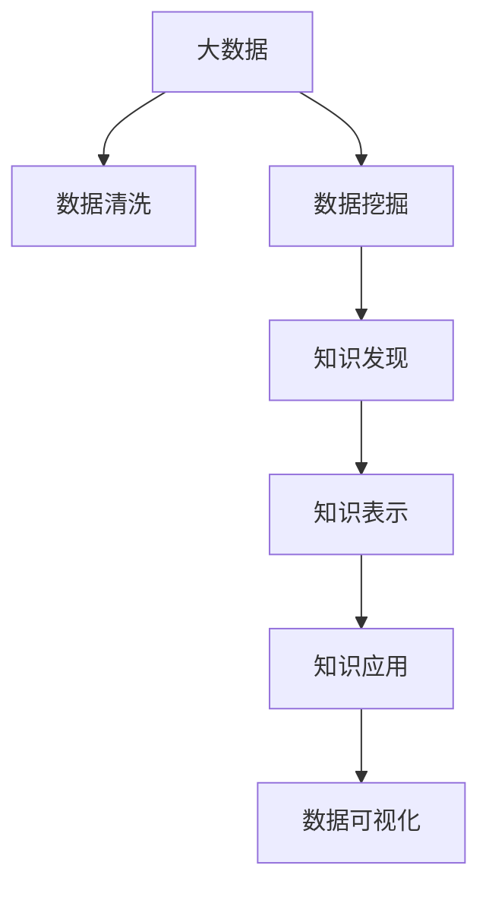

                 

# 大数据在知识发现中的应用与实践

> 关键词：大数据, 知识发现, 数据挖掘, 机器学习, 深度学习, 人工智能, 统计学, 数据可视化

## 1. 背景介绍

### 1.1 问题由来

在大数据时代，信息量呈爆炸式增长，各行各业都面临着数据处理的巨大挑战。企业、政府、科研机构等组织，每天都会产生大量的结构化和非结构化数据。如何从海量数据中提取有价值的信息，挖掘知识，驱动决策，成为当前的关键问题。

知识发现（Knowledge Discovery in Databases, KDD）是大数据领域中的一个重要方向，它旨在从原始数据中抽取知识，包括模式、规律、关联、趋势等，形成对真实世界的新认识，以支持决策和行动。

知识发现应用广泛，比如在金融领域，通过数据分析可以预测市场趋势、优化投资组合；在医疗领域，可以基于患者数据预测疾病风险、优化治疗方案；在社交网络中，通过用户行为分析，可以发现兴趣群体、提升用户体验。

### 1.2 问题核心关键点

知识发现涉及数据预处理、特征工程、模型训练、知识评估等多个环节。其中，核心问题包括：

1. **数据质量和清洗**：原始数据可能存在噪声、缺失、不一致等问题，需要预处理保证数据质量。
2. **特征工程**：选择合适的特征，提取数据特征，构建特征集合，以供模型训练。
3. **模型选择和训练**：选择合适的算法，并使用大数据技术进行模型训练，优化模型参数。
4. **知识表示和评估**：将挖掘到的知识进行有效的表示，并对其重要性进行评估，以供后续应用。

## 2. 核心概念与联系

### 2.1 核心概念概述

- **大数据**：数据量非常庞大、种类繁多、时效性强的数据集。大数据处理通常涉及分布式计算、数据存储、流式处理等技术。
- **知识发现**：通过数据挖掘、机器学习等方法，从原始数据中提取有价值的信息和知识。知识发现是数据挖掘的一部分，其目的是发现数据的规律和模式。
- **数据挖掘**：在大量数据中寻找隐藏的模式、规律、关联、异常等，并形成可理解的知识。数据挖掘常用于金融、零售、医疗等各个领域。
- **机器学习**：构建模型，使用历史数据进行训练，预测新数据。机器学习是知识发现的重要手段，可以发现数据中的模式和趋势。
- **深度学习**：一种特殊的机器学习方法，通过多层次的神经网络，自动学习数据特征和规律，适用于复杂的非线性问题。
- **人工智能**：通过模拟人类智能行为，实现信息的自动化处理和应用。人工智能包括知识发现、自然语言处理、计算机视觉等多个方向。
- **统计学**：使用数学模型和统计方法，描述、分析和解释数据，是知识发现的重要理论基础。
- **数据可视化**：通过图表、图形等形式，直观地展示数据特征和发现的知识，便于理解和应用。

这些概念之间通过以下Mermaid流程图展示了它们之间的联系：



这个流程图展示了大数据到知识发现的主要流程，其中数据清洗是基础，数据挖掘是手段，知识发现是目标，知识表示和应用是结果，数据可视化是展示方式。

## 3. 核心算法原理 & 具体操作步骤

### 3.1 算法原理概述

知识发现涉及的数据量通常非常庞大，因此需要采用分布式计算、流式处理等技术。以下是几种主要的知识发现算法及其原理：

1. **关联规则学习**：通过分析大量交易数据，挖掘项集之间的关联规则，如Apriori算法、FP-growth算法等。
2. **分类和回归**：使用历史数据训练分类器或回归器，预测新数据，如决策树、随机森林、支持向量机、神经网络等。
3. **聚类分析**：将数据点分组，形成聚类，发现数据的内在结构，如K-means、层次聚类等。
4. **时间序列分析**：分析时间序列数据，发现趋势、周期和异常，如ARIMA、季节性分解时间序列等。
5. **异常检测**：检测数据中的异常点和异常趋势，如孤立森林、DBSCAN、K-最近邻等。
6. **图像识别**：使用深度学习技术，从图像中提取特征，识别物体，如卷积神经网络等。
7. **自然语言处理**：分析文本数据，挖掘语言中的知识和模式，如情感分析、实体识别、主题建模等。

### 3.2 算法步骤详解

知识发现的典型流程包括以下几个关键步骤：

**Step 1: 数据收集和预处理**

- 从数据源收集数据，并进行清洗、去重、缺失值填补等预处理操作，保证数据质量。
- 使用分布式计算框架（如Hadoop、Spark）进行大数据处理，处理速度快，可扩展性强。

**Step 2: 特征工程**

- 选择或构建合适的特征，如提取文本的TF-IDF、图像的特征向量等。
- 使用特征选择算法（如卡方检验、信息增益等），筛选出对目标变量影响最大的特征。

**Step 3: 模型选择和训练**

- 选择适合的算法（如决策树、随机森林、神经网络等）。
- 使用历史数据进行模型训练，优化模型参数。
- 使用交叉验证等技术，评估模型性能，选择最优模型。

**Step 4: 知识表示和评估**

- 将模型挖掘到的知识进行表示，如生成关联规则、分类器预测结果、聚类结构等。
- 使用评估指标（如准确率、召回率、F1分数等）评估知识的重要性和准确性。

**Step 5: 知识应用**

- 将挖掘到的知识应用于实际场景，如优化供应链、个性化推荐、风险预测等。
- 实时监测数据变化，动态更新模型，保证知识的时效性和可靠性。

**Step 6: 数据可视化**

- 使用图表、图形等形式，展示知识发现的结果。
- 通过可视化工具（如Tableau、PowerBI等），交互式展示数据特征和发现的知识。

### 3.3 算法优缺点

知识发现算法具有以下优点：

1. **自动化程度高**：算法自动从数据中挖掘知识，减少人工干预。
2. **发现隐藏模式**：能够发现数据中隐藏的关联、异常、趋势等，发现新的知识。
3. **可扩展性强**：大数据技术支持大规模数据处理，可处理海量数据。

但同时，这些算法也存在一些局限性：

1. **数据质量依赖高**：算法的准确性和效果依赖于数据质量，数据清洗和预处理需要耗费大量时间和精力。
2. **模型解释性差**：一些复杂模型（如深度学习）解释性差，难以理解其内部工作机制。
3. **高计算成本**：复杂算法（如深度学习）计算成本高，训练时间长。
4. **过度拟合风险**：在数据量不足或特征选择不合理的情况下，可能产生过拟合。

### 3.4 算法应用领域

知识发现算法在多个领域得到了广泛应用，包括但不限于：

1. **金融**：通过交易数据挖掘关联规则，优化投资策略；分析客户行为，精准营销。
2. **医疗**：从患者数据中挖掘疾病特征，预测疾病风险；优化治疗方案。
3. **零售**：通过交易数据挖掘关联规则，发现购物篮规律；个性化推荐。
4. **社交网络**：分析用户行为，发现兴趣群体；提升用户体验。
5. **交通**：分析交通流量数据，优化交通管理；预测出行需求。
6. **环境监测**：从传感器数据中挖掘模式，预测污染趋势；优化监测策略。
7. **能源**：分析能源使用数据，优化能源分配；预测能源需求。

## 4. 数学模型和公式 & 详细讲解 & 举例说明

### 4.1 数学模型构建

以分类算法为例，常用的数学模型包括：

1. 逻辑回归（Logistic Regression）：
$$ y = \frac{1}{1 + e^{-z}} $$
其中，$z = \sum_{i=1}^{n} x_i \theta_i$。

2. 决策树（Decision Tree）：
通过树形结构进行分类，根节点为所有数据，逐步划分，直到满足某个条件。

3. 随机森林（Random Forest）：
通过多棵决策树进行分类，取多数票的决策结果，减少过拟合。

4. 支持向量机（Support Vector Machine, SVM）：
$$ w = \arg\min_{w} \frac{1}{2}\|w\|^2 + C\sum_{i=1}^{n}\max(0, 1 - y_i \cdot w^T \cdot x_i + b) $$

5. 神经网络（Neural Network）：
$$ y = \sigma(\sum_{i=1}^{n} w_i x_i + b) $$
其中，$\sigma$为激活函数，通常使用sigmoid或ReLU。

### 4.2 公式推导过程

以逻辑回归为例，其推导过程如下：

1. 构建模型：
$$ y = \frac{1}{1 + e^{-z}} $$
其中，$z = \sum_{i=1}^{n} x_i \theta_i$，$\theta$为模型参数。

2. 损失函数：
$$ L(\theta) = -\frac{1}{N}\sum_{i=1}^{N}(y_i \log y_i + (1-y_i) \log (1-y_i)) $$

3. 梯度下降：
$$ \theta \leftarrow \theta - \eta \nabla_{\theta}L(\theta) $$

4. 更新参数：
$$ \nabla_{\theta}L(\theta) = \frac{1}{N}\sum_{i=1}^{N}(y_i - \hat{y}_i) x_i $$

其中，$\eta$为学习率。

### 4.3 案例分析与讲解

以金融领域为例，通过交易数据挖掘关联规则，发现股票之间的关联关系。

**数据集**：一家公司的交易数据，包括股票价格、成交量、交易时间等。

**数据预处理**：清洗数据，处理缺失值，标准化数据。

**特征工程**：提取股票价格变化、成交量、交易时间等特征。

**模型训练**：使用Apriori算法挖掘关联规则，生成交易模式。

**结果分析**：分析挖掘结果，发现某些股票价格变化与另一股票价格变化相关联，可能存在套利机会。

## 5. 项目实践：代码实例和详细解释说明

### 5.1 开发环境搭建

以下是使用Python和Scikit-learn进行大数据知识发现的开发环境搭建流程：

1. 安装Python环境，安装Scikit-learn、Pandas、Numpy等库。
2. 准备大数据集，如股票交易数据、客户购买数据等。
3. 使用分布式计算框架（如Hadoop、Spark）进行数据预处理和特征工程。
4. 使用Scikit-learn进行模型训练和评估。
5. 使用数据可视化工具（如Matplotlib、Seaborn）进行结果展示。

### 5.2 源代码详细实现

以下是使用Scikit-learn进行随机森林分类模型的Python代码实现。

```python
from sklearn.ensemble import RandomForestClassifier
from sklearn.model_selection import train_test_split
from sklearn.metrics import accuracy_score
from sklearn.datasets import load_iris

# 加载数据集
iris = load_iris()
X = iris.data
y = iris.target

# 划分数据集
X_train, X_test, y_train, y_test = train_test_split(X, y, test_size=0.3, random_state=42)

# 构建随机森林模型
rfc = RandomForestClassifier(n_estimators=100, random_state=42)

# 训练模型
rfc.fit(X_train, y_train)

# 预测并评估模型
y_pred = rfc.predict(X_test)
accuracy = accuracy_score(y_test, y_pred)
print("Accuracy:", accuracy)
```

### 5.3 代码解读与分析

**代码解释**：

1. 加载数据集，使用Scikit-learn的Iris数据集，包含三个类别的鸢尾花数据。
2. 使用train_test_split函数划分数据集为训练集和测试集。
3. 构建随机森林模型，设置树的数量为100。
4. 使用训练集进行模型训练。
5. 使用测试集进行预测，并计算模型准确率。

**代码分析**：

1. 数据集Iris是经典的数据集，包含三种不同品种的鸢尾花，每种品种有50个样本，每个样本有四个特征。
2. train_test_split函数用于划分数据集，test_size参数指定测试集占总数据集的百分比，random_state参数用于保证结果的可复现性。
3. RandomForestClassifier是随机森林分类器，n_estimators参数指定树的数量。
4. 模型训练和预测过程中，使用了sklearn的fit和predict函数。
5. accuracy_score函数用于计算模型的准确率。

## 6. 实际应用场景

### 6.1 金融风险管理

在金融领域，知识发现可以用于风险管理，通过分析历史交易数据，挖掘关联规则，预测市场趋势，优化投资组合，降低风险。

**具体应用**：
1. 使用关联规则挖掘交易数据，发现股票之间的关联关系。
2. 通过分析交易数据，预测市场波动，优化投资策略。
3. 使用时间序列分析，预测市场趋势，制定交易策略。

**效果**：
1. 发现潜在的套利机会，提高投资收益。
2. 预测市场波动，减少投资风险。

### 6.2 医疗诊断

在医疗领域，知识发现可以用于疾病诊断，通过分析患者数据，挖掘疾病特征，预测疾病风险，优化治疗方案。

**具体应用**：
1. 使用分类算法分析患者数据，预测疾病风险。
2. 使用聚类算法分析患者数据，发现疾病分类。
3. 使用关联规则分析患者数据，发现疾病关联关系。

**效果**：
1. 提前发现疾病风险，提高诊断准确率。
2. 优化治疗方案，提高治疗效果。

### 6.3 零售个性化推荐

在零售领域，知识发现可以用于个性化推荐，通过分析用户购买数据，挖掘关联规则，生成推荐模型，提升用户满意度。

**具体应用**：
1. 使用关联规则分析用户购买数据，发现购物篮规律。
2. 使用分类算法分析用户购买数据，预测用户购买意愿。
3. 使用聚类算法分析用户购买数据，发现用户兴趣群体。

**效果**：
1. 生成个性化推荐，提高用户满意度。
2. 优化供应链管理，减少库存成本。

### 6.4 未来应用展望

未来，大数据知识发现技术将更加成熟，应用场景将更加广泛，具体展望如下：

1. **智能制造**：通过分析生产数据，挖掘设备故障和生产效率变化规律，优化生产过程。
2. **智慧城市**：通过分析交通、环境数据，优化城市管理，提升城市运行效率。
3. **农业智能化**：通过分析农业数据，优化农业生产，提高农业生产效率和农民收入。
4. **物联网**：通过分析物联网数据，优化设备运行，提升设备使用效率。
5. **自然灾害预警**：通过分析气象、地质数据，预测自然灾害，提前预警，减少灾害损失。

## 7. 工具和资源推荐

### 7.1 学习资源推荐

为了帮助开发者系统掌握大数据知识发现的理论基础和实践技巧，这里推荐一些优质的学习资源：

1. 《大数据时代》系列书籍：吴恩达等人著作，涵盖大数据技术和大数据应用。
2. 《Python数据科学手册》：Jake VanderPlas等人著作，涵盖数据科学和数据可视化。
3. Coursera《数据科学导论》课程：由Johns Hopkins大学开设，涵盖数据科学基础。
4. Coursera《机器学习》课程：由Andrew Ng开设，涵盖机器学习基本原理和算法。
5. Kaggle：数据科学竞赛平台，提供丰富的数据集和实践机会。

通过对这些资源的学习实践，相信你一定能够快速掌握大数据知识发现的精髓，并用于解决实际的业务问题。

### 7.2 开发工具推荐

高效的开发离不开优秀的工具支持。以下是几款用于大数据知识发现开发的常用工具：

1. Hadoop：大数据处理框架，支持分布式计算，处理海量数据。
2. Spark：大数据处理框架，支持分布式计算和流式处理。
3. Scikit-learn：Python机器学习库，支持多种算法和数据可视化。
4. Jupyter Notebook：交互式数据科学工作环境，支持Python编程和数据可视化。
5. Matplotlib：Python数据可视化库，支持绘制图表和图形。
6. Tableau：数据可视化工具，支持交互式数据展示和分析。

合理利用这些工具，可以显著提升大数据知识发现的开发效率，加快创新迭代的步伐。

### 7.3 相关论文推荐

大数据知识发现技术的发展源于学界的持续研究。以下是几篇奠基性的相关论文，推荐阅读：

1. 《关联规则学习：算法及其应用》：Rakesh Agrawal等人著作，介绍了关联规则学习的基本算法和应用。
2. 《随机森林算法》：李航等人著作，介绍了随机森林算法的原理和实现。
3. 《支持向量机：理论、算法与应用》：侯增辉等人著作，介绍了支持向量机算法的理论基础和应用。
4. 《深度学习》：Ian Goodfellow等人著作，介绍了深度学习的基本原理和算法。
5. 《大数据统计分析》：冯学辉等人著作，介绍了大数据统计分析的基本方法和技术。

这些论文代表了大数据知识发现技术的发展脉络。通过学习这些前沿成果，可以帮助研究者把握学科前进方向，激发更多的创新灵感。

## 8. 总结：未来发展趋势与挑战

### 8.1 总结

本文对大数据知识发现的应用进行了全面系统的介绍。首先阐述了知识发现在大数据时代的重要性和应用场景，明确了数据清洗、特征工程、模型训练、知识表示等关键步骤。通过丰富的案例和实例，展示了知识发现在不同领域的应用效果。

通过本文的系统梳理，可以看到，大数据知识发现技术已经成为各行各业的重要工具，通过挖掘数据中的知识，驱动决策，提升效率，优化过程。未来，随着大数据技术的不断进步，知识发现的应用将更加广泛，为各行各业带来新的变革。

### 8.2 未来发展趋势

展望未来，大数据知识发现技术将呈现以下几个发展趋势：

1. **数据融合和集成**：通过数据融合和集成，整合不同数据源的信息，提升数据分析的全面性和准确性。
2. **自动化和智能化**：通过自动化和智能化技术，提高知识发现的速度和效率，降低人工干预。
3. **实时分析和预测**：通过实时分析和预测，及时发现数据变化，优化决策过程。
4. **跨领域应用**：将知识发现技术应用于多个领域，如医疗、金融、零售、制造等。
5. **融合人工智能**：将知识发现技术与人工智能技术结合，提升数据的深度挖掘能力。
6. **多模态数据挖掘**：通过多模态数据挖掘，整合不同数据类型的信息，提升数据挖掘的准确性和全面性。

### 8.3 面临的挑战

尽管大数据知识发现技术已经取得了显著进展，但在迈向更加智能化、普适化应用的过程中，它仍面临诸多挑战：

1. **数据质量和多样性**：原始数据质量差、类型多样，需要进行复杂的清洗和预处理。
2. **模型复杂性和解释性**：复杂模型难以解释，难以理解其内部工作机制。
3. **计算资源和存储**：大数据处理需要高性能计算资源和存储，成本较高。
4. **数据隐私和安全**：大数据处理涉及大量敏感数据，需要保障数据隐私和安全。
5. **技术应用和推广**：大数据知识发现技术需要跨学科、跨领域的合作，推广难度较大。

### 8.4 研究展望

面对大数据知识发现所面临的挑战，未来的研究需要在以下几个方面寻求新的突破：

1. **自动化数据预处理**：通过自动化数据清洗和预处理技术，提升数据质量。
2. **模型可解释性**：研究模型可解释性技术，提高模型透明度。
3. **多模态数据挖掘**：研究多模态数据挖掘技术，提升数据挖掘的准确性和全面性。
4. **知识图谱构建**：通过知识图谱技术，整合多源数据，提升知识发现的效果。
5. **联邦学习**：通过联邦学习技术，实现分布式数据挖掘，保护数据隐私。

这些研究方向的探索，必将引领大数据知识发现技术迈向更高的台阶，为构建智能化的决策支持系统提供新的技术支持。面向未来，大数据知识发现技术还需要与其他人工智能技术进行更深入的融合，共同推动大数据应用的深度和广度。只有勇于创新、敢于突破，才能不断拓展知识发现的边界，让大数据技术更好地服务于人类社会。

## 9. 附录：常见问题与解答

**Q1：大数据知识发现的优势和劣势有哪些？**

A: 大数据知识发现的优势包括：
1. 数据量大，可以挖掘出更多的模式和规律。
2. 算法自动化程度高，减少人工干预。
3. 数据融合能力强，可以整合不同数据源的信息。

劣势包括：
1. 数据质量和清洗难度高。
2. 模型复杂性高，难以解释。
3. 计算资源和存储成本高。

**Q2：如何进行数据清洗和预处理？**

A: 数据清洗和预处理包括以下步骤：
1. 数据导入：使用Python、R等语言进行数据导入。
2. 数据清洗：处理缺失值、异常值、重复值等。
3. 数据标准化：将数据转换为标准格式，便于后续处理。
4. 特征选择：选择有意义的特征，去除无关特征。
5. 数据可视化：使用Matplotlib、Seaborn等工具，绘制数据分布图。

**Q3：如何选择适合的机器学习算法？**

A: 选择适合的机器学习算法需要考虑以下几个因素：
1. 数据类型：分类、回归、聚类等。
2. 数据规模：大规模数据需要使用分布式计算。
3. 数据特征：是否存在高维特征。
4. 模型复杂度：简单模型易于解释，复杂模型准确性高。
5. 计算资源：计算资源丰富时可以选择复杂模型，否则选择简单模型。

**Q4：如何进行特征工程？**

A: 特征工程包括以下步骤：
1. 数据探索：了解数据特征，确定特征类型。
2. 特征选择：选择有意义的特征，去除无关特征。
3. 特征构建：通过组合、转换等手段，构建新的特征。
4. 特征标准化：将特征转换为标准格式，便于后续处理。
5. 特征选择算法：使用卡方检验、信息增益等算法，筛选出对目标变量影响最大的特征。

**Q5：如何评估模型的性能？**

A: 模型性能评估包括以下几个指标：
1. 准确率：预测正确样本数与总样本数之比。
2. 召回率：正确预测的正样本数与实际正样本数之比。
3. F1分数：准确率和召回率的调和平均数。
4. ROC曲线：绘制真正率-假正率曲线，评估模型性能。
5. AUC值：ROC曲线下的面积，评估模型性能。

以上信息，希望能对您有所帮助。感谢您的阅读。

---

作者：禅与计算机程序设计艺术 / Zen and the Art of Computer Programming

