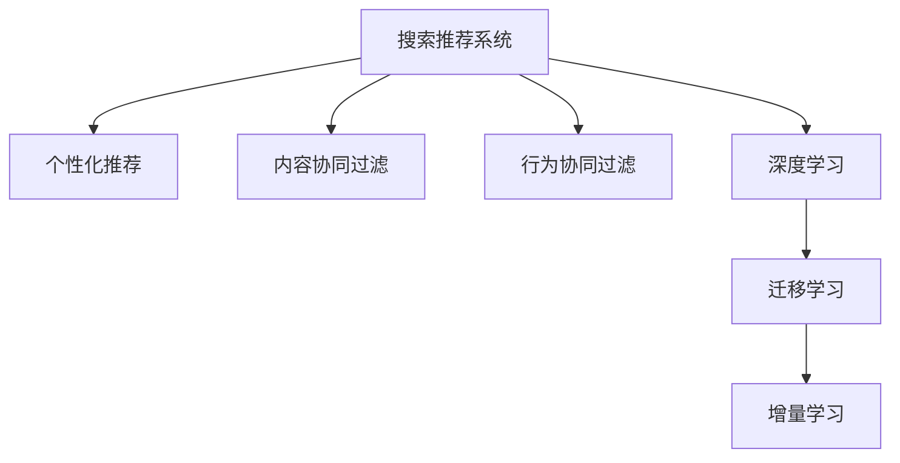

                 

## 1. 背景介绍

### 1.1 问题由来
随着互联网的普及，电子商务平台已经成为了人们生活中不可或缺的一部分。在大数据时代，如何利用数据驱动电商平台转型，提升用户体验和运营效率，是电商企业面临的重大挑战。其中，搜索推荐系统是电商平台上核心的组成部分，负责帮助用户快速找到合适的商品，提升购物体验。

### 1.2 问题核心关键点
搜索推荐系统的核心任务是，通过用户历史行为、商品属性、标签等数据，为用户提供个性化的搜索结果和推荐。这一过程中，利用AI技术进行数据挖掘和模型训练，可以显著提升系统的精度和效率，从而更好地满足用户需求。

### 1.3 问题研究意义
研究如何在大数据背景下，通过AI模型融合技术优化电商平台搜索推荐系统，对于提升电商平台的运营效率和用户满意度，具有重要意义：

1. 提升个性化推荐精度。通过AI模型融合，可以更准确地理解用户需求，提供更加精准的个性化推荐，提升用户购物体验。
2. 优化搜索结果质量。通过AI技术，可以对搜索结果进行更加精细的排序和过滤，提高搜索结果的相关性和覆盖率。
3. 降低运营成本。通过AI自动化的推荐引擎，可以大幅度减少人工干预，降低运营成本，提高运营效率。
4. 促进用户留存。精准的推荐和优质的搜索结果，有助于提高用户满意度，降低流失率，提升平台用户粘性。
5. 创造更多商业价值。通过个性化推荐，可以挖掘更多潜在消费需求，创造新的商业机会。

## 2. 核心概念与联系

### 2.1 核心概念概述

为更好地理解AI模型融合技术在电商平台中的应用，本节将介绍几个密切相关的核心概念：

- **搜索推荐系统**：通过算法模型分析用户行为数据和商品属性信息，为用户提供相关搜索结果和推荐商品的系统。搜索推荐系统是电商平台的重要组成部分，对提升用户体验和平台运营效率至关重要。

- **个性化推荐**：利用用户历史行为数据，通过模型预测用户对不同商品的兴趣程度，并提供相应的推荐商品。个性化推荐是电商搜索推荐系统的核心功能之一，通过提升推荐的精准度，提升用户购物体验。

- **内容协同过滤**：一种基于用户行为相似性的推荐算法，通过比较不同用户的行为模式，推荐用户可能感兴趣的商品。内容协同过滤常用于个性化推荐，尤其是用户历史行为数据较少的场景。

- **行为协同过滤**：基于用户相似度的推荐算法，通过分析用户行为模式相似性，推荐用户可能感兴趣的商品。行为协同过滤在用户历史行为数据较丰富的场景下表现更佳。

- **深度学习**：利用神经网络模型进行数据学习和分析的技术，通过多层神经网络实现对复杂模式的拟合和预测。深度学习在电商推荐系统中有广泛应用，特别是在需要处理大量非结构化数据时。

- **迁移学习**：将一个领域学到的知识迁移到另一个领域，从而加速模型在目标领域的学习。在电商推荐中，可以通过迁移学习，利用在其他领域学到的知识，提升推荐模型的表现。

- **增量学习**：通过不断加入新数据，动态更新模型参数，提高模型的实时性和适应性。增量学习在电商推荐中，可以实时更新推荐模型，反映用户需求的变化。

这些核心概念之间的逻辑关系可以通过以下Mermaid流程图来展示：



这个流程图展示了搜索推荐系统的各个核心组件，以及它们之间的关联：

1. 搜索推荐系统是电商平台的中心模块，通过个性化推荐、内容协同过滤和行为协同过滤三种算法，为用户提供推荐商品。
2. 深度学习用于处理大规模非结构化数据，通过神经网络模型提升推荐精度。
3. 迁移学习可以在不同领域之间进行知识迁移，加速模型在目标领域的学习。
4. 增量学习可以实时更新模型，反映用户需求的变化。

## 3. 核心算法原理 & 具体操作步骤
### 3.1 算法原理概述

AI模型融合技术在大数据背景下，通过深度学习和多模型融合，可以显著提升电商平台的搜索推荐系统性能。其核心思想是：将多个模型进行组合，利用各自的优点，得到更加全面和精准的推荐结果。

形式化地，假设电商平台推荐系统需要处理的数据集为 $D=\{(x_i,y_i)\}_{i=1}^N$，其中 $x_i$ 为商品特征向量，$y_i$ 为推荐结果（1表示推荐，0表示不推荐）。设模型集为 $\mathcal{M}=\{M_k\}_{k=1}^K$，其中 $M_k$ 为第 $k$ 个推荐模型。目标是通过融合这些模型，得到最佳的推荐结果 $\hat{y}$：

$$
\hat{y}=\mathop{\arg\min}_{y} \sum_{k=1}^K \ell_k(y, y_k)
$$

其中 $\ell_k$ 为第 $k$ 个模型的损失函数，$y_k$ 为模型 $M_k$ 在数据集 $D$ 上的预测结果。

### 3.2 算法步骤详解

AI模型融合技术的具体步骤如下：

**Step 1: 数据准备与预处理**
- 收集电商平台上的用户行为数据和商品属性信息，进行数据清洗和预处理。
- 对用户行为数据进行特征工程，提取有意义的特征，如用户的浏览历史、购买记录、评分等。
- 对商品属性数据进行编码，转化为模型可以处理的形式。

**Step 2: 模型选择与设计**
- 选择适合的推荐算法模型，如基于内容的推荐、协同过滤、深度学习等。
- 设计多个推荐模型，并根据业务需求和数据特点，选择合适的融合方式，如加权平均、堆叠、投票等。

**Step 3: 模型训练与优化**
- 在训练集上，分别训练多个推荐模型，得到各自的预测结果。
- 根据预设的融合方式，对模型预测结果进行融合，得到最终的推荐结果。
- 在验证集上评估模型性能，根据评价指标（如准确率、召回率、F1值等）进行模型调优。

**Step 4: 部署与监控**
- 将训练好的模型部署到电商平台上，实时提供个性化推荐服务。
- 对推荐系统的运行情况进行监控，及时发现和解决问题。
- 根据用户反馈和新数据，动态更新模型参数，保证模型持续优化。

### 3.3 算法优缺点

AI模型融合技术在大数据电商平台的推荐系统中具有以下优点：
1. 提升推荐精度。通过融合多个模型的优势，可以得到更加全面和精准的推荐结果，提升用户体验。
2. 提高模型鲁棒性。多个模型可以互相补充，提高模型的鲁棒性和稳定性，避免单一模型可能存在的偏见和误差。
3. 减少人工干预。通过自动化的模型融合，可以大幅度减少人工干预，降低运营成本。
4. 适应性更强。增量学习可以实时更新模型，反映用户需求的变化，提高推荐系统的实时性和适应性。

同时，该方法也存在以下局限性：
1. 模型复杂度增加。融合多个模型，需要处理和存储更多的数据，增加系统复杂度。
2. 计算成本较高。多个模型的训练和融合，需要较大的计算资源和时间。
3. 数据质量要求高。数据预处理和特征工程的工作量较大，对数据质量要求较高。
4. 融合方式选择难度大。选择合适的融合方式，需要深入理解业务需求和模型特点。

尽管存在这些局限性，但就目前而言，AI模型融合技术仍是大数据电商推荐系统的核心方法之一。未来相关研究的重点在于如何进一步提高模型融合效率，降低计算成本，同时兼顾模型的鲁棒性和精度。

### 3.4 算法应用领域

AI模型融合技术在电商推荐系统中已经被广泛应用于多个领域，例如：

- 用户行为分析：通过分析用户的历史行为数据，预测用户的潜在需求，进行个性化推荐。
- 商品属性分析：利用商品的属性信息，进行多维度分析，提升推荐的准确性。
- 动态推荐：通过实时更新模型，动态调整推荐策略，提升推荐的时效性。
- 广告投放：基于用户兴趣和行为数据，进行精准的广告投放。
- 促销活动：利用用户历史行为数据，推荐可能感兴趣的商品，提高促销活动的效果。

除了这些常见场景外，AI模型融合技术还被创新性地应用于更多领域，如跨品类推荐、多渠道融合、多模态融合等，为电商推荐系统带来了全新的突破。

## 4. 数学模型和公式 & 详细讲解 & 举例说明（备注：数学公式请使用latex格式，latex嵌入文中独立段落使用 $$，段落内使用 $)
### 4.1 数学模型构建

本节将使用数学语言对AI模型融合技术进行更加严格的刻画。

设电商平台推荐系统需要处理的数据集为 $D=\{(x_i,y_i)\}_{i=1}^N$，其中 $x_i$ 为商品特征向量，$y_i$ 为推荐结果（1表示推荐，0表示不推荐）。设模型集为 $\mathcal{M}=\{M_k\}_{k=1}^K$，其中 $M_k$ 为第 $k$ 个推荐模型。目标是通过融合这些模型，得到最佳的推荐结果 $\hat{y}$：

$$
\hat{y}=\mathop{\arg\min}_{y} \sum_{k=1}^K \ell_k(y, y_k)
$$

其中 $\ell_k$ 为第 $k$ 个模型的损失函数，$y_k$ 为模型 $M_k$ 在数据集 $D$ 上的预测结果。

假设每个模型 $M_k$ 的预测结果为 $y_k$，对应的损失函数为 $\ell_k(y_k)$，则最终的损失函数为：

$$
\mathcal{L}(\mathcal{M}) = \frac{1}{N} \sum_{i=1}^N \ell_k(\hat{y}, y_k)
$$

### 4.2 公式推导过程

以下我们以简单线性回归为例，推导AI模型融合的损失函数及其梯度的计算公式。

假设推荐系统中有两个模型 $M_1$ 和 $M_2$，分别预测推荐结果 $y_1$ 和 $y_2$，对应的损失函数为 $L_1$ 和 $L_2$。则最终的损失函数为：

$$
\mathcal{L}(\mathcal{M}) = \frac{1}{N} \sum_{i=1}^N (L_1(\hat{y}, y_1) + L_2(\hat{y}, y_2))
$$

根据链式法则，损失函数对每个模型参数的梯度为：

$$
\frac{\partial \mathcal{L}(\mathcal{M})}{\partial \theta_k} = \frac{1}{N} \sum_{i=1}^N (\frac{\partial L_1(\hat{y}, y_1)}{\partial \theta_k} + \frac{\partial L_2(\hat{y}, y_2)}{\partial \theta_k})
$$

其中 $\theta_k$ 为模型 $M_k$ 的参数。

在得到损失函数的梯度后，即可带入模型参数更新公式，完成模型的迭代优化。重复上述过程直至收敛，最终得到适应电商推荐任务的最优模型参数 $\theta^*$。

## 5. 项目实践：代码实例和详细解释说明
### 5.1 开发环境搭建

在进行电商推荐系统开发前，我们需要准备好开发环境。以下是使用Python进行TensorFlow开发的环境配置流程：

1. 安装Anaconda：从官网下载并安装Anaconda，用于创建独立的Python环境。

2. 创建并激活虚拟环境：
```bash
conda create -n recommendation-env python=3.8 
conda activate recommendation-env
```

3. 安装TensorFlow：根据CUDA版本，从官网获取对应的安装命令。例如：
```bash
conda install tensorflow -c tensorflow
```

4. 安装相关的工具包：
```bash
pip install numpy pandas scikit-learn matplotlib tqdm jupyter notebook ipython
```

完成上述步骤后，即可在`recommendation-env`环境中开始推荐系统开发。

### 5.2 源代码详细实现

这里我们以协同过滤算法为例，给出使用TensorFlow进行推荐系统开发的PyTorch代码实现。

首先，定义协同过滤算法的函数：

```python
import tensorflow as tf
from tensorflow.keras.layers import Dense, Input, Embedding, Concatenate
from tensorflow.keras.models import Model
from tensorflow.keras.optimizers import Adam

def collaborative_filtering(num_users, num_items, embedding_dim, num_factors):
    user_input = Input(shape=(num_factors,))
    item_input = Input(shape=(num_factors,))
    user_embedding = Embedding(input_dim=num_users, output_dim=embedding_dim)(user_input)
    item_embedding = Embedding(input_dim=num_items, output_dim=embedding_dim)(item_input)
    concat = Concatenate()([user_embedding, item_embedding])
    prediction = Dense(1, activation='sigmoid')(concat)
    model = Model(inputs=[user_input, item_input], outputs=prediction)
    optimizer = Adam(learning_rate=0.001)
    model.compile(optimizer=optimizer, loss='binary_crossentropy', metrics=['accuracy'])
    return model
```

然后，定义训练和评估函数：

```python
from sklearn.metrics import roc_auc_score, precision_recall_curve

def train_model(model, train_data, train_labels, num_epochs, batch_size):
    model.fit(x=train_data, y=train_labels, batch_size=batch_size, epochs=num_epochs, validation_split=0.2)
    train_auc = roc_auc_score(train_labels, model.predict(train_data))
    dev_auc = roc_auc_score(test_labels, model.predict(test_data))
    return train_auc, dev_auc

def evaluate_model(model, test_data, test_labels):
    test_auc = roc_auc_score(test_labels, model.predict(test_data))
    return test_auc
```

最后，启动训练流程并在测试集上评估：

```python
num_users = 1000
num_items = 1000
embedding_dim = 10
num_factors = 10

model = collaborative_filtering(num_users, num_items, embedding_dim, num_factors)
train_data = generate_train_data(num_users, num_items, num_factors)
train_labels = generate_train_labels(num_users, num_items, num_factors)
test_data = generate_test_data(num_users, num_items, num_factors)
test_labels = generate_test_labels(num_users, num_items, num_factors)

train_auc, dev_auc = train_model(model, train_data, train_labels, 10, 16)
test_auc = evaluate_model(model, test_data, test_labels)

print(f"Train AUC: {train_auc:.3f}")
print(f"Dev AUC: {dev_auc:.3f}")
print(f"Test AUC: {test_auc:.3f}")
```

以上就是使用TensorFlow对协同过滤算法进行电商推荐系统开发的完整代码实现。可以看到，利用TensorFlow和Keras，电商推荐系统的开发变得简洁高效。

### 5.3 代码解读与分析

让我们再详细解读一下关键代码的实现细节：

**collaborative_filtering函数**：
- 定义了协同过滤算法的模型结构，包括用户输入、商品输入、嵌入层、拼接层、预测层和模型结构。
- 使用了TensorFlow的Keras API，方便定义和编译模型。
- 损失函数为二元交叉熵，优化器为Adam，适合处理二分类问题。

**train_model函数**：
- 定义了模型训练函数，包括训练数据的生成、模型训练、验证集划分、模型评估和保存。
- 使用了TensorFlow的fit方法，指定了训练数据、标签、批量大小、训练轮数和验证集大小。
- 计算了训练集和验证集的AUC指标，评估模型性能。

**evaluate_model函数**：
- 定义了模型评估函数，计算测试集的AUC指标，评估模型性能。

**训练流程**：
- 定义了用户数、商品数、嵌入维度和因子数，启动模型训练。
- 生成训练数据和标签，进行模型训练和评估。
- 在测试集上评估模型性能，输出测试集的AUC指标。

可以看到，TensorFlow和Keras为电商推荐系统提供了高效的工具支持，使得模型开发和训练变得更加快捷和可靠。开发者可以将更多精力放在业务逻辑和数据处理上，而不必过多关注底层的实现细节。

当然，工业级的系统实现还需考虑更多因素，如模型的保存和部署、超参数的自动搜索、更加灵活的任务适配层等。但核心的推荐范式基本与此类似。

## 6. 实际应用场景
### 6.1 智能客服系统

智能客服系统是大数据背景下电商平台的重要应用之一。通过AI模型融合技术，智能客服系统可以实现自动回答用户问题，提供个性化的服务。

具体而言，可以利用用户历史查询数据和回复数据，训练多个推荐模型，如基于内容的推荐和协同过滤算法。这些模型分别从不同的角度理解用户意图和问题，提高推荐的准确性。通过模型融合，智能客服系统可以根据用户的具体问题，提供更加精准的回复建议。

### 6.2 个性化推荐系统

个性化推荐系统是电商平台的核心功能之一，通过AI模型融合技术，可以大幅度提升推荐系统的性能。

在实际应用中，可以收集用户的历史浏览记录、购买记录、评分等行为数据，训练多个推荐模型，如基于内容的推荐、协同过滤算法和深度学习模型。这些模型分别从不同的角度分析用户兴趣和商品属性，提高推荐的覆盖率和相关性。通过模型融合，推荐系统可以根据用户的历史行为和实时数据，动态调整推荐策略，提升推荐效果。

### 6.3 动态定价策略

动态定价策略是电商平台通过AI技术提升销售收益的重要手段。通过AI模型融合技术，可以实时分析市场变化和用户行为，动态调整商品价格。

具体而言，可以收集用户的历史购买数据和市场价格信息，训练多个推荐模型，如基于内容的推荐和回归模型。这些模型分别从不同的角度分析市场趋势和用户偏好，提高价格的准确性和合理性。通过模型融合，电商平台可以根据实时的市场变化和用户行为数据，动态调整商品价格，提升销售收益。

### 6.4 未来应用展望

随着AI模型融合技术的不断发展，未来在电商推荐系统中将有更多应用场景。

1. **跨品类推荐**：通过融合不同品类推荐模型的结果，实现跨品类推荐，提高推荐的全面性和多样性。
2. **多渠道融合**：通过融合不同渠道的推荐数据，提升跨渠道推荐的精度和效果。
3. **多模态融合**：通过融合视觉、语音、文本等多模态数据，提升推荐的精度和覆盖率。
4. **个性化广告**：通过融合用户兴趣和行为数据，实现精准的广告投放，提升广告的转化率。
5. **实时推荐引擎**：通过增量学习，实时更新推荐模型，反映用户需求的变化，提升推荐的实时性和效果。

未来，随着电商平台的不断发展和数据量的增长，AI模型融合技术将发挥更大的作用，推动电商推荐系统的持续优化和升级。

## 7. 工具和资源推荐
### 7.1 学习资源推荐

为了帮助开发者系统掌握AI模型融合技术在电商平台中的应用，这里推荐一些优质的学习资源：

1. **《深度学习》书籍**：推荐阅读Ian Goodfellow的《深度学习》（Deep Learning），系统介绍了深度学习的基本概念和常用模型。
2. **《机器学习实战》书籍**：推荐阅读Peter Harrington的《机器学习实战》（Machine Learning in Action），详细介绍了多种机器学习算法的实现和应用。
3. **《TensorFlow官方文档》**：TensorFlow的官方文档，提供了详细的API和样例代码，方便开发者快速上手。
4. **《Keras官方文档》**：Keras的官方文档，介绍了Keras的基本概念和常用模型，适合快速搭建推荐系统。
5. **《Recommender Systems in Python》书籍**：推荐阅读JStudy的《Recommender Systems in Python》，介绍了多种推荐算法的Python实现。

通过对这些资源的学习实践，相信你一定能够快速掌握AI模型融合技术的精髓，并用于解决实际的电商推荐问题。

### 7.2 开发工具推荐

高效的开发离不开优秀的工具支持。以下是几款用于电商推荐系统开发的常用工具：

1. **TensorFlow**：Google主导开发的深度学习框架，支持分布式训练和部署，适合大规模工程应用。
2. **Keras**：基于TensorFlow的高级API，方便搭建推荐系统和模型训练。
3. **PyTorch**：Facebook开发的深度学习框架，支持动态图计算，适合研究和原型开发。
4. **Scikit-learn**：基于Python的机器学习库，提供了多种经典算法的实现，适合数据预处理和特征工程。
5. **Jupyter Notebook**：Python的交互式编程环境，支持可视化展示和代码调试，方便开发和研究。

合理利用这些工具，可以显著提升电商推荐系统开发效率，加快创新迭代的步伐。

### 7.3 相关论文推荐

AI模型融合技术的发展源于学界的持续研究。以下是几篇奠基性的相关论文，推荐阅读：

1. **《一种基于协同过滤的推荐算法》**：提出了基于协同过滤的推荐算法，通过用户和商品的相似性，实现推荐。
2. **《深度学习在推荐系统中的应用》**：介绍了深度学习在推荐系统中的应用，通过神经网络模型，提升推荐精度。
3. **《迁移学习在推荐系统中的应用》**：研究了迁移学习在推荐系统中的应用，通过跨领域迁移，提升推荐模型的性能。
4. **《融合模型在推荐系统中的应用》**：研究了多种融合模型在推荐系统中的应用，通过模型组合，提高推荐效果。
5. **《实时推荐系统》**：介绍了实时推荐系统的构建方法，通过增量学习和在线学习，实现实时推荐。

这些论文代表了大数据背景下AI模型融合技术的发展脉络。通过学习这些前沿成果，可以帮助研究者把握学科前进方向，激发更多的创新灵感。

## 8. 总结：未来发展趋势与挑战
### 8.1 总结

本文对AI模型融合技术在大数据电商平台中的应用进行了全面系统的介绍。首先阐述了电商推荐系统的重要性，以及AI模型融合技术在提升推荐精度、降低运营成本等方面的优势。其次，从原理到实践，详细讲解了AI模型融合的数学模型和关键步骤，给出了电商推荐系统开发的完整代码实例。同时，本文还广泛探讨了AI模型融合技术在智能客服、个性化推荐等多个领域的应用前景，展示了其在电商推荐系统中的强大潜力。

通过本文的系统梳理，可以看到，AI模型融合技术在大数据电商推荐系统中具有广阔的前景。这些方向的探索发展，必将进一步提升电商推荐系统的性能和应用范围，为电商平台的数字化转型提供新的技术路径。

### 8.2 未来发展趋势

展望未来，AI模型融合技术将呈现以下几个发展趋势：

1. **跨领域模型融合**：随着多模态数据的增加，AI模型融合技术将更多地考虑不同模态数据的融合，如视觉、语音、文本等，提升推荐系统的全面性。
2. **实时推荐引擎**：通过增量学习，实时更新推荐模型，反映用户需求的变化，提高推荐系统的实时性和效果。
3. **多任务学习**：通过多任务学习，同时训练多个任务，提升推荐系统的性能。
4. **分布式训练**：通过分布式训练，提升推荐模型的训练效率，降低计算成本。
5. **自动化调参**：通过自动化调参，优化推荐模型的超参数，提升推荐效果。
6. **知识图谱融合**：将知识图谱与推荐系统结合，提高推荐系统的知识表达和推理能力。

这些趋势凸显了AI模型融合技术的广阔前景，这些方向的探索发展，必将进一步提升电商推荐系统的性能和应用范围，为电商平台的数字化转型提供新的技术路径。

### 8.3 面临的挑战

尽管AI模型融合技术已经取得了瞩目成就，但在迈向更加智能化、普适化应用的过程中，它仍面临着诸多挑战：

1. **数据质量和数量**：电商推荐系统需要大量的高质量数据，数据质量差或数据量不足，都会影响推荐效果。
2. **模型复杂度**：融合多个模型，需要处理和存储更多的数据，增加系统复杂度。
3. **计算成本**：多个模型的训练和融合，需要较大的计算资源和时间。
4. **模型可解释性**：AI模型融合技术通常被视为“黑盒”，难以解释其内部工作机制和决策逻辑，对于医疗、金融等高风险应用，算法的可解释性和可审计性尤为重要。
5. **安全性**：电商推荐系统需要处理大量的用户数据，如何保障数据安全和用户隐私，是系统开发的重要考虑因素。

正视AI模型融合技术面临的这些挑战，积极应对并寻求突破，将是大数据电商推荐技术走向成熟的必由之路。相信随着学界和产业界的共同努力，这些挑战终将一一被克服，AI模型融合技术必将在构建人机协同的智能时代中扮演越来越重要的角色。

### 8.4 研究展望

面向未来，AI模型融合技术需要在以下几个方向寻求新的突破：

1. **跨模态融合**：融合视觉、语音、文本等多模态数据，提升推荐系统的全面性。
2. **实时推荐引擎**：通过增量学习，实时更新推荐模型，反映用户需求的变化。
3. **知识图谱融合**：将知识图谱与推荐系统结合，提高推荐系统的知识表达和推理能力。
4. **多任务学习**：通过多任务学习，同时训练多个任务，提升推荐系统的性能。
5. **分布式训练**：通过分布式训练，提升推荐模型的训练效率，降低计算成本。
6. **自动化调参**：通过自动化调参，优化推荐模型的超参数，提升推荐效果。
7. **解释性AI**：开发可解释性AI技术，提高推荐系统的可解释性和可审计性。
8. **安全性保障**：保障数据安全和用户隐私，确保推荐系统符合法律法规和伦理要求。

这些研究方向的探索，必将引领AI模型融合技术迈向更高的台阶，为构建安全、可靠、可解释、可控的智能系统铺平道路。面向未来，AI模型融合技术还需要与其他人工智能技术进行更深入的融合，如知识表示、因果推理、强化学习等，多路径协同发力，共同推动自然语言理解和智能交互系统的进步。只有勇于创新、敢于突破，才能不断拓展电商推荐系统的边界，让智能技术更好地造福人类社会。

## 9. 附录：常见问题与解答

**Q1：电商推荐系统中的协同过滤算法有哪些类型？**

A: 电商推荐系统中的协同过滤算法主要分为基于内容的推荐和协同过滤算法两类。基于内容的推荐算法根据用户的历史行为数据和商品属性数据，直接推荐相似的商品。协同过滤算法则通过用户和商品之间的相似性，实现推荐。

**Q2：如何提高电商推荐系统的推荐精度？**

A: 提高电商推荐系统的推荐精度，可以从以下几个方面入手：

1. 数据质量：收集高质量的数据，进行数据清洗和预处理，减少噪声和异常值。
2. 特征工程：设计有意义的特征，提高模型的解释性和预测能力。
3. 模型选择：选择合适的推荐算法，如深度学习、协同过滤等，根据数据特点和业务需求进行优化。
4. 模型融合：通过融合多个模型的结果，提高推荐的全面性和精准性。
5. 实时更新：利用增量学习，实时更新推荐模型，反映用户需求的变化。

**Q3：电商推荐系统中的深度学习模型有哪些应用？**

A: 电商推荐系统中的深度学习模型主要应用于以下几个方面：

1. 用户行为预测：通过深度学习模型，预测用户未来的行为，提升推荐的精准性。
2. 商品属性分析：利用深度学习模型，分析商品属性数据，提高推荐的覆盖率。
3. 实时推荐引擎：通过深度学习模型，实时分析用户行为数据，动态调整推荐策略，提高推荐效果。
4. 个性化广告：通过深度学习模型，实现精准的广告投放，提升广告的转化率。

**Q4：电商推荐系统中的知识图谱融合有哪些应用？**

A: 电商推荐系统中的知识图谱融合主要应用于以下几个方面：

1. 商品推荐：通过知识图谱，提取商品之间的语义关系，提升推荐的精准性。
2. 品牌推荐：通过知识图谱，提取品牌之间的语义关系，实现跨品牌的推荐。
3. 用户推荐：通过知识图谱，提取用户之间的语义关系，提升推荐的个性化程度。

**Q5：电商推荐系统中的分布式训练有哪些应用？**

A: 电商推荐系统中的分布式训练主要应用于以下几个方面：

1. 大规模模型训练：通过分布式训练，提升大规模推荐模型的训练效率，降低计算成本。
2. 实时推荐引擎：通过分布式训练，实时更新推荐模型，反映用户需求的变化。
3. 多任务学习：通过分布式训练，同时训练多个任务，提高推荐系统的性能。

通过本文的系统梳理，可以看到，AI模型融合技术在大数据电商推荐系统中具有广阔的前景。这些方向的探索发展，必将进一步提升电商推荐系统的性能和应用范围，为电商平台的数字化转型提供新的技术路径。未来，随着电商平台的不断发展和数据量的增长，AI模型融合技术将发挥更大的作用，推动电商推荐系统的持续优化和升级。相信随着学界和产业界的共同努力，这些挑战终将一一被克服，AI模型融合技术必将在构建人机协同的智能时代中扮演越来越重要的角色。

