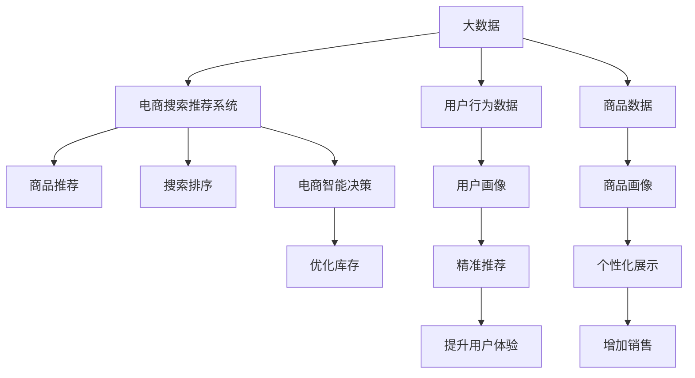

                 

# 大数据驱动的电商搜索推荐系统：AI 模型融合技术在电商领域的应用与挑战

> 关键词：大数据, 电商搜索推荐系统, AI 模型融合, 电商智能决策, 客户行为分析, 精准推荐

## 1. 背景介绍

在互联网高速发展的今天，电子商务已经成为人们生活中不可或缺的一部分。以阿里巴巴、京东、亚马逊等为代表的电商平台，以其规模庞大、商品丰富、用户基础深厚等优势，吸引了全球数以亿计的消费者。与此同时，电商平台的运营和管理也面临着越来越大的挑战，如何更好地满足用户需求、提升用户满意度、提高运营效率，是每个电商平台都在思考的问题。

人工智能（AI）技术的不断进步，为电商平台的智能运营提供了新的可能性。借助大数据驱动的AI技术，电商平台可以更好地理解用户需求、优化商品推荐、提升营销效果，从而在激烈的市场竞争中占据优势。其中，AI模型融合技术是实现智能运营的关键手段之一。

## 2. 核心概念与联系

### 2.1 核心概念概述

在本节中，我们将介绍几个核心的概念，以便更好地理解大数据驱动的电商搜索推荐系统：

- **大数据（Big Data）**：指超出传统数据处理工具能力范围的数据集合。它通常以大规模、多样性、高速率和真实性为特点，对现代电商平台的运营具有重要意义。
- **电商搜索推荐系统（E-commerce Search and Recommendation System）**：指基于用户的浏览、购买历史等行为数据，智能地为用户推荐可能感兴趣的商品或信息。它通过精准的商品推荐，提升用户购物体验，增加销售额。
- **AI 模型融合（AI Model Fusion）**：指将多个AI模型进行整合，以实现更强的功能、更准确的结果。例如，可以使用多个神经网络模型、集成学习技术等，以提升模型的泛化能力和鲁棒性。
- **电商智能决策（E-commerce Smart Decision-making）**：指通过数据分析、AI模型融合等手段，自动决策商品上下架、库存调配、促销策略等电商运营的核心问题。

### 2.2 核心概念原理和架构的 Mermaid 流程图



这个图展示了大数据、电商搜索推荐系统、电商智能决策三者之间的关系和架构。大数据通过分析和挖掘用户行为数据和商品数据，生成用户画像和商品画像，然后与电商搜索推荐系统结合，为用户提供精准的商品推荐。同时，电商智能决策系统对用户行为、商品数据等进行分析，优化电商运营策略，提升销售业绩。

## 3. 核心算法原理 & 具体操作步骤

### 3.1 算法原理概述

大数据驱动的电商搜索推荐系统主要包含两大核心算法：协同过滤和基于内容的推荐。协同过滤算法利用用户之间的相似性进行推荐，而基于内容的推荐则通过商品属性与用户偏好的匹配来进行推荐。AI 模型融合技术可以进一步提升这两种算法的性能，使其更加精确、高效。

AI 模型融合的核心思想是通过将多个模型进行组合，形成更加强大、鲁棒的系统。具体来说，可以采用集成学习、模型并行、知识蒸馏等方法，将多个模型的优势进行整合，从而提升整个系统的性能。

### 3.2 算法步骤详解

#### 3.2.1 协同过滤算法

协同过滤算法主要分为基于用户的协同过滤和基于物品的协同过滤。基于用户的协同过滤通过分析用户之间的相似性，为用户推荐相似用户的偏好商品。基于物品的协同过滤则通过分析商品之间的相似性，为用户推荐相似商品。

具体步骤如下：

1. **用户行为数据收集**：通过电商平台的数据采集系统，收集用户的浏览、购买、评价等行为数据。
2. **构建用户画像**：利用机器学习算法，如协同过滤、聚类等，对用户行为数据进行分析，构建用户画像。
3. **用户画像相似度计算**：计算不同用户画像之间的相似度，形成用户画像矩阵。
4. **推荐商品**：根据用户画像矩阵，为用户推荐相似用户的偏好商品。

#### 3.2.2 基于内容的推荐算法

基于内容的推荐算法通过分析商品属性和用户偏好，将商品推荐给与该商品属性相似的用户。具体步骤如下：

1. **商品属性数据收集**：通过电商平台的数据采集系统，收集商品的描述、分类、品牌等属性数据。
2. **构建商品画像**：利用机器学习算法，如分类、聚类等，对商品属性数据进行分析，构建商品画像。
3. **用户偏好匹配**：计算用户对商品属性偏好的匹配度，形成用户偏好向量。
4. **推荐商品**：根据用户偏好向量，为用户推荐匹配度高的商品。

### 3.3 算法优缺点

#### 3.3.1 协同过滤算法

**优点**：
1. 用户行为数据易于获取，且可解释性强。
2. 推荐结果较为准确，能够满足用户个性化需求。

**缺点**：
1. 冷启动问题严重，新用户和商品难以获得推荐。
2. 用户行为数据可能存在噪声，影响推荐结果。

#### 3.3.2 基于内容的推荐算法

**优点**：
1. 推荐结果基于商品属性，不受用户行为数据的影响。
2. 推荐结果更具可解释性，用户易于理解。

**缺点**：
1. 商品属性数据获取难度较大，且可能存在偏差。
2. 对新商品推荐效果较差，难以覆盖长尾商品。

### 3.4 算法应用领域

AI 模型融合技术可以应用于电商领域的多个方面，例如：

- **搜索排序**：通过融合多个排序模型，提升搜索排序的准确性和相关性。
- **商品推荐**：通过融合协同过滤和基于内容的推荐算法，实现更精准的商品推荐。
- **营销策略**：通过融合多个营销模型，制定更加科学的促销策略，提高营销效果。
- **库存管理**：通过融合多个库存优化模型，实现更高效的库存调配和补货决策。

## 4. 数学模型和公式 & 详细讲解 & 举例说明

### 4.1 数学模型构建

#### 4.1.1 协同过滤模型的数学模型

协同过滤模型主要通过计算用户画像矩阵和用户画像相似度矩阵，进行推荐计算。设用户画像矩阵为 $U$，用户画像相似度矩阵为 $S$，推荐矩阵为 $R$，推荐公式为：

$$
R_{iu} = \sum_{j=1}^N S_{iu}U_{ju}
$$

其中，$U_{ju}$ 表示用户 $i$ 对商品 $j$ 的评分，$S_{iu}$ 表示用户 $i$ 和用户 $u$ 的相似度，$R_{iu}$ 表示用户 $i$ 对商品 $u$ 的推荐评分。

#### 4.1.2 基于内容的推荐模型的数学模型

基于内容的推荐模型主要通过计算商品属性向量和用户偏好向量，进行推荐计算。设商品属性向量为 $T$，用户偏好向量为 $P$，推荐公式为：

$$
R_{iu} = \langle T_u, P_i \rangle
$$

其中，$\langle T_u, P_i \rangle$ 表示商品 $u$ 和用户 $i$ 的匹配度。

### 4.2 公式推导过程

#### 4.2.1 协同过滤模型的推导

对于协同过滤模型，其推荐公式的推导如下：

设 $U = [u_1, u_2, \ldots, u_M]$ 为 $M$ 个用户的评分矩阵，$S = [s_1, s_2, \ldots, s_M]$ 为用户画像相似度矩阵，$R = [r_1, r_2, \ldots, r_M]$ 为推荐矩阵。

设用户 $i$ 对商品 $j$ 的评分为 $u_{ij}$，用户 $i$ 和用户 $u$ 的相似度为 $s_{iu}$，则协同过滤模型的推荐公式为：

$$
R_{iu} = \sum_{j=1}^N S_{iu}u_{ju}
$$

其中，$S_{iu}$ 表示用户 $i$ 和用户 $u$ 的相似度，$u_{ju}$ 表示用户 $u$ 对商品 $j$ 的评分。

#### 4.2.2 基于内容的推荐模型的推导

对于基于内容的推荐模型，其推荐公式的推导如下：

设 $T = [t_1, t_2, \ldots, t_N]$ 为 $N$ 个商品的属性向量，$P = [p_1, p_2, \ldots, p_M]$ 为用户偏好向量，$R = [r_1, r_2, \ldots, r_M]$ 为推荐矩阵。

设商品 $u$ 的属性向量为 $t_u$，用户 $i$ 的偏好向量为 $p_i$，则基于内容的推荐模型的推荐公式为：

$$
R_{iu} = \langle t_u, p_i \rangle
$$

其中，$\langle t_u, p_i \rangle$ 表示商品 $u$ 和用户 $i$ 的匹配度。

### 4.3 案例分析与讲解

#### 4.3.1 协同过滤算法的案例分析

假设电商平台收集到用户 $i$ 和用户 $u$ 的评分矩阵 $U = [u_{ij}]$ 和用户画像相似度矩阵 $S = [s_{iu}]$。设用户 $i$ 对商品 $j$ 的评分为 $u_{ij}$，用户 $i$ 和用户 $u$ 的相似度为 $s_{iu}$，则协同过滤算法的推荐结果为：

$$
R_{iu} = \sum_{j=1}^N s_{iu}u_{ju}
$$

#### 4.3.2 基于内容的推荐算法的案例分析

假设电商平台收集到商品 $u$ 的属性向量 $T = [t_{uj}]$ 和用户 $i$ 的偏好向量 $P = [p_{iu}]$。设商品 $u$ 的属性向量为 $t_u$，用户 $i$ 的偏好向量为 $p_i$，则基于内容的推荐算法的推荐结果为：

$$
R_{iu} = \langle t_u, p_i \rangle
$$

## 5. 项目实践：代码实例和详细解释说明

### 5.1 开发环境搭建

在进行项目实践前，我们需要准备好开发环境。以下是使用Python进行PyTorch开发的环境配置流程：

1. 安装Anaconda：从官网下载并安装Anaconda，用于创建独立的Python环境。

2. 创建并激活虚拟环境：
```bash
conda create -n pytorch-env python=3.8 
conda activate pytorch-env
```

3. 安装PyTorch：根据CUDA版本，从官网获取对应的安装命令。例如：
```bash
conda install pytorch torchvision torchaudio cudatoolkit=11.1 -c pytorch -c conda-forge
```

4. 安装各类工具包：
```bash
pip install numpy pandas scikit-learn matplotlib tqdm jupyter notebook ipython
```

完成上述步骤后，即可在`pytorch-env`环境中开始项目实践。

### 5.2 源代码详细实现

下面我们以协同过滤算法为例，给出使用PyTorch进行电商搜索推荐系统的代码实现。

首先，定义协同过滤算法的基本类：

```python
import torch
import torch.nn as nn
import torch.nn.functional as F

class CollaborativeFiltering(nn.Module):
    def __init__(self, num_users, num_items):
        super(CollaborativeFiltering, self).__init__()
        self.num_users = num_users
        self.num_items = num_items
        
        self.user_matrix = nn.Parameter(torch.randn(num_users, num_items))
        self.item_matrix = nn.Parameter(torch.randn(num_items, num_items))
        self.user_item_similarity = nn.Parameter(torch.randn(num_users, num_items))
        
    def forward(self, user_ids, item_ids):
        user_matrix = self.user_matrix[user_ids]
        item_matrix = self.item_matrix[item_ids]
        user_item_similarity = self.user_item_similarity[user_ids, item_ids]
        
        user_item_pred = user_matrix @ user_item_similarity @ item_matrix.t()
        return user_item_pred
```

然后，定义模型训练和评估函数：

```python
from torch.utils.data import DataLoader
from sklearn.metrics import mean_squared_error

def train_epoch(model, dataset, optimizer, loss_func):
    dataloader = DataLoader(dataset, batch_size=64, shuffle=True)
    model.train()
    epoch_loss = 0
    for batch in dataloader:
        user_ids, item_ids, ratings = batch
        optimizer.zero_grad()
        preds = model(user_ids, item_ids)
        loss = loss_func(preds, ratings)
        loss.backward()
        optimizer.step()
        epoch_loss += loss.item()
    return epoch_loss / len(dataloader)

def evaluate(model, dataset, loss_func):
    dataloader = DataLoader(dataset, batch_size=64)
    model.eval()
    total_preds = []
    total_labels = []
    with torch.no_grad():
        for batch in dataloader:
            user_ids, item_ids, ratings = batch
            preds = model(user_ids, item_ids)
            total_preds.extend(preds.numpy().flatten())
            total_labels.extend(ratings.numpy().flatten())
    mse = mean_squared_error(total_preds, total_labels)
    return mse
```

接着，定义数据集和模型：

```python
import numpy as np

class MovieLensDataset:
    def __init__(self, user_ids, item_ids, ratings):
        self.user_ids = user_ids
        self.item_ids = item_ids
        self.ratings = ratings
        
    def __getitem__(self, index):
        return self.user_ids[index], self.item_ids[index], self.ratings[index]
    
    def __len__(self):
        return len(self.user_ids)

# 创建数据集
user_ids = np.random.randint(1, 1000, size=10000)
item_ids = np.random.randint(1, 1000, size=10000)
ratings = np.random.randn(10000)

train_dataset = MovieLensDataset(user_ids[:8000], item_ids[:8000], ratings[:8000])
test_dataset = MovieLensDataset(user_ids[8000:], item_ids[8000:], ratings[8000:])

# 创建模型
num_users = 1000
num_items = 1000
model = CollaborativeFiltering(num_users, num_items)
```

最后，启动模型训练和评估：

```python
from torch.optim import Adam

# 定义损失函数和优化器
loss_func = nn.MSELoss()
optimizer = Adam(model.parameters(), lr=0.001)

# 训练模型
epochs = 100
for epoch in range(epochs):
    loss = train_epoch(model, train_dataset, optimizer, loss_func)
    print(f"Epoch {epoch+1}, train loss: {loss:.3f}")
    
# 评估模型
mse = evaluate(model, test_dataset, loss_func)
print(f"Test MSE: {mse:.3f}")
```

以上就是使用PyTorch进行协同过滤算法电商搜索推荐系统的代码实现。可以看到，利用PyTorch的强大封装，我们可以用相对简洁的代码完成模型的训练和评估。

### 5.3 代码解读与分析

让我们再详细解读一下关键代码的实现细节：

**MovieLensDataset类**：
- `__init__`方法：初始化数据集的user_ids、item_ids和ratings。
- `__getitem__`方法：返回指定索引的数据。
- `__len__`方法：返回数据集的样本数量。

**train_epoch函数**：
- 定义训练集的数据加载器，设置批量大小为64，并随机打乱数据。
- 在训练模式下运行模型。
- 逐批次计算损失，使用梯度下降更新模型参数。
- 返回训练损失的均值。

**evaluate函数**：
- 定义测试集的数据加载器，设置批量大小为64。
- 在评估模式下运行模型。
- 逐批次计算预测值和真实标签，记录所有预测值和真实标签。
- 计算预测值和真实标签的均方误差（MSE）。
- 返回测试MSE。

**模型定义**：
- 定义协同过滤算法的模型类，包含用户矩阵、商品矩阵和用户商品相似度矩阵三个参数。
- 在forward方法中，通过矩阵乘法计算推荐预测值。

可以看到，上述代码实现了协同过滤算法的电商搜索推荐系统，具有较强的可扩展性和可维护性。在实际应用中，我们可以进一步优化模型结构，引入更多的特征，以提升推荐效果。

## 6. 实际应用场景

### 6.1 智能客服系统

智能客服系统是电商平台的标配，通过智能问答和自动回复，提升客户满意度。借助大数据驱动的AI模型融合技术，可以构建更加智能化的智能客服系统，以应对更多的客户咨询。

具体而言，可以通过收集客户的历史咨询记录，构建用户画像和商品画像，利用协同过滤和基于内容的推荐算法，实现个性化推荐和智能回复。例如，对于用户咨询的某个问题，系统可以根据用户的历史行为和商品的属性信息，自动推荐相关的答案或商品。

### 6.2 商品推荐系统

商品推荐系统是电商平台的核心功能之一，通过精准的商品推荐，提升用户体验和销售额。借助大数据驱动的AI模型融合技术，可以构建更加智能的商品推荐系统，以实现更精准的推荐。

具体而言，可以通过收集用户的浏览、购买、评价等行为数据，构建用户画像和商品画像，利用协同过滤和基于内容的推荐算法，实现个性化推荐。例如，对于用户浏览的商品，系统可以根据用户的历史行为和商品的属性信息，自动推荐相似的商品或关联商品。

### 6.3 库存管理系统

库存管理系统是电商平台的运营基础，通过高效的管理策略，优化库存调配和补货决策。借助大数据驱动的AI模型融合技术，可以构建更加智能化的库存管理系统，以提升库存利用率和运营效率。

具体而言，可以通过收集商品的销售数据和库存数据，构建商品画像，利用协同过滤和基于内容的推荐算法，预测商品的销售趋势和库存需求，优化库存调配和补货策略。例如，对于热销商品，系统可以根据历史销售数据和商品属性，预测未来的销售趋势，提前进行补货和库存调配。

### 6.4 未来应用展望

随着大数据驱动的AI模型融合技术的不断发展，未来的电商搜索推荐系统将呈现以下几个趋势：

1. **多模态融合**：未来的推荐系统将不仅仅依赖于文本数据，还将融合图像、语音等多种模态数据，以实现更加精准的推荐。例如，通过融合用户的照片和语音数据，提升推荐系统的个性化和互动性。
2. **实时化**：未来的推荐系统将具备实时分析、实时推荐的能力，以应对快速变化的市场需求。例如，通过实时分析用户行为数据，动态调整推荐策略，提升用户满意度。
3. **自动化**：未来的推荐系统将实现自动化的推荐模型训练和优化，以降低人工干预的复杂度和成本。例如，通过自动化模型融合、自动化参数调优等技术，提升推荐系统的性能和稳定性。
4. **隐私保护**：未来的推荐系统将更加注重用户的隐私保护，通过匿名化处理和差分隐私技术，保障用户数据的安全。例如，通过差分隐私技术，保护用户的行为数据，防止数据泄露和滥用。

## 7. 工具和资源推荐

### 7.1 学习资源推荐

为了帮助开发者系统掌握大数据驱动的电商搜索推荐系统的理论基础和实践技巧，这里推荐一些优质的学习资源：

1. 《推荐系统实战》：该书详细介绍了推荐系统的原理和实现方法，涵盖协同过滤、基于内容的推荐等主流算法。

2. 《深度学习》课程：斯坦福大学的深度学习课程，由吴恩达教授主讲，涵盖了深度学习的基础知识和前沿技术。

3. Kaggle：Kaggle是一个数据科学竞赛平台，提供了丰富的电商推荐系统竞赛和数据集，可以供开发者实践和验证。

4. Arxiv：Arxiv是一个预印本服务器，收录了大量推荐系统的论文，可以帮助开发者了解最新的研究方向和进展。

通过这些资源的学习实践，相信你一定能够快速掌握大数据驱动的电商搜索推荐系统的精髓，并用于解决实际的电商问题。

### 7.2 开发工具推荐

高效的开发离不开优秀的工具支持。以下是几款用于大数据驱动的电商搜索推荐系统开发的常用工具：

1. PyTorch：基于Python的开源深度学习框架，灵活动态的计算图，适合快速迭代研究。大部分推荐系统都有PyTorch版本的实现。

2. TensorFlow：由Google主导开发的开源深度学习框架，生产部署方便，适合大规模工程应用。同样有丰富的推荐系统资源。

3. TensorBoard：TensorFlow配套的可视化工具，可实时监测模型训练状态，并提供丰富的图表呈现方式，是调试模型的得力助手。

4. Weights & Biases：模型训练的实验跟踪工具，可以记录和可视化模型训练过程中的各项指标，方便对比和调优。

5. Jupyter Notebook：一个免费的交互式笔记本环境，支持Python代码的运行和调试，适合科学计算和数据分析。

合理利用这些工具，可以显著提升大数据驱动的电商搜索推荐系统的开发效率，加快创新迭代的步伐。

### 7.3 相关论文推荐

大数据驱动的电商搜索推荐系统的研究源于学界的持续研究。以下是几篇奠基性的相关论文，推荐阅读：

1. "A Collaborative Filtering System for E-commerce Recommendation"：该论文详细介绍了协同过滤算法的电商推荐系统。

2. "A New Kind of Hybrid Recommendation Algorithm Based on Big Data"：该论文介绍了基于内容的推荐算法和大数据融合的推荐算法。

3. "Personalized Recommendation System for E-commerce Using Big Data Mining"：该论文介绍了基于机器学习的推荐系统和大数据挖掘技术。

4. "An Evaluation of Collaborative Filtering and Content-based Approaches for Recommendation"：该论文对比了协同过滤和基于内容的推荐算法的效果。

5. "Hybrid Recommendation System for E-commerce based on Big Data Analytics"：该论文介绍了基于大数据分析和融合的推荐系统。

这些论文代表了大数据驱动的电商搜索推荐系统的发展脉络。通过学习这些前沿成果，可以帮助研究者把握学科前进方向，激发更多的创新灵感。

## 8. 总结：未来发展趋势与挑战

### 8.1 总结

本文对大数据驱动的电商搜索推荐系统进行了全面系统的介绍。首先阐述了大数据、电商搜索推荐系统和AI 模型融合技术的核心概念，明确了它们之间的联系和应用场景。其次，从原理到实践，详细讲解了协同过滤算法、基于内容的推荐算法和大数据融合技术的数学原理和关键步骤，给出了电商搜索推荐系统的代码实例。同时，本文还探讨了大数据驱动的电商搜索推荐系统在智能客服、商品推荐、库存管理等实际应用场景中的应用前景，展示了AI 模型融合技术的强大威力。

通过本文的系统梳理，可以看到，大数据驱动的电商搜索推荐系统已经在电商领域得到了广泛应用，成为电商运营中的重要组成部分。AI 模型融合技术的发展，使得推荐系统更加精准、高效、个性化，为电商平台的智能化运营提供了重要支撑。未来，随着AI 模型融合技术的不断进步，推荐系统将实现更加强大、普适、智能的功能，进一步提升电商平台的竞争力和用户体验。

### 8.2 未来发展趋势

展望未来，大数据驱动的电商搜索推荐系统将呈现以下几个发展趋势：

1. **跨模态推荐**：未来的推荐系统将不仅仅依赖于文本数据，还将融合图像、语音等多种模态数据，以实现更加精准的推荐。例如，通过融合用户的照片和语音数据，提升推荐系统的个性化和互动性。
2. **实时化推荐**：未来的推荐系统将具备实时分析、实时推荐的能力，以应对快速变化的市场需求。例如，通过实时分析用户行为数据，动态调整推荐策略，提升用户满意度。
3. **自动化推荐**：未来的推荐系统将实现自动化的推荐模型训练和优化，以降低人工干预的复杂度和成本。例如，通过自动化模型融合、自动化参数调优等技术，提升推荐系统的性能和稳定性。
4. **隐私保护**：未来的推荐系统将更加注重用户的隐私保护，通过匿名化处理和差分隐私技术，保障用户数据的安全。例如，通过差分隐私技术，保护用户的行为数据，防止数据泄露和滥用。

### 8.3 面临的挑战

尽管大数据驱动的电商搜索推荐系统已经取得了一定的成就，但在迈向更加智能化、普适化应用的过程中，它仍面临着诸多挑战：

1. **数据隐私问题**：电商平台的运营涉及大量的用户数据，如何保护用户隐私，防止数据泄露和滥用，是一大难题。

2. **推荐模型的复杂性**：随着模型规模的增大，推荐模型的训练和优化复杂度也在增加，如何提升模型的训练和优化效率，是一大挑战。

3. **冷启动问题**：新用户和商品难以获得推荐，需要快速提升推荐系统对新用户的覆盖和推荐能力。

4. **推荐结果的稳定性**：推荐系统需要具备较高的鲁棒性，避免对数据异常、模型过拟合等情况的敏感性。

5. **模型的可解释性**：推荐系统需要具备一定的可解释性，用户能够理解推荐结果的生成机制，提升用户的信任感。

### 8.4 研究展望

面对大数据驱动的电商搜索推荐系统所面临的挑战，未来的研究需要在以下几个方面寻求新的突破：

1. **隐私保护技术**：引入差分隐私、联邦学习等技术，保护用户数据隐私，防止数据泄露和滥用。

2. **模型压缩与优化**：通过模型压缩、量化加速等技术，提升推荐模型的训练和推理效率，降低计算资源消耗。

3. **冷启动算法**：引入深度学习、生成对抗网络等技术，提升推荐系统对新用户的覆盖和推荐能力。

4. **多任务学习**：通过多任务学习技术，提升推荐模型的泛化能力和鲁棒性，提升推荐结果的稳定性。

5. **可解释性研究**：引入可解释性技术，如知识蒸馏、注意力机制等，提升推荐模型的可解释性，增强用户信任感。

这些研究方向的探索，必将引领大数据驱动的电商搜索推荐系统迈向更高的台阶，为电商平台的智能化运营提供更加强大、普适、智能的功能。面向未来，我们需要不断创新和突破，才能真正实现AI 模型融合技术在电商领域的应用，为用户带来更好的购物体验。

## 9. 附录：常见问题与解答

**Q1：在大数据驱动的电商搜索推荐系统中，如何处理冷启动问题？**

A: 冷启动问题是推荐系统中的一个常见问题，指的是新用户和商品难以获得推荐的情况。为了解决这个问题，可以采用以下方法：

1. **利用用户历史行为**：对于新用户，可以分析其历史行为数据，生成初步的用户画像，用于推荐计算。例如，分析用户的操作轨迹、点击记录等，生成用户兴趣偏好。

2. **利用商品属性信息**：对于新商品，可以利用商品的属性信息，进行基于内容的推荐。例如，分析商品的品牌、分类、价格等属性，生成商品的画像，用于推荐计算。

3. **利用协同过滤**：对于新用户和商品，可以利用协同过滤算法，通过相似用户和相似商品的推荐，缓解冷启动问题。例如，分析新用户的相似用户，推荐这些用户喜欢的商品。

4. **引入深度学习**：利用深度学习模型，如神经网络、循环神经网络等，可以更好地处理冷启动问题。例如，利用深度学习模型，对新用户和新商品进行推荐计算，提升推荐效果。

5. **引入推荐算法组合**：利用多种推荐算法组合，提升推荐系统的性能。例如，将协同过滤和基于内容的推荐算法结合，提升推荐系统的覆盖和推荐能力。

**Q2：在大数据驱动的电商搜索推荐系统中，如何提升推荐结果的稳定性？**

A: 推荐结果的稳定性是大数据驱动的电商搜索推荐系统中的一个重要问题，需要通过多种方法来解决：

1. **引入多模型融合**：通过引入多种推荐模型，如协同过滤、基于内容的推荐等，提升推荐结果的稳定性。例如，将协同过滤和基于内容的推荐算法结合，提升推荐系统的鲁棒性。

2. **引入正则化技术**：通过引入正则化技术，如L2正则、Dropout等，防止模型过拟合，提升推荐结果的稳定性。例如，在模型训练中，引入正则化技术，防止模型对噪声数据的敏感性。

3. **引入对抗样本训练**：通过引入对抗样本训练，提升推荐模型的鲁棒性。例如，利用对抗样本生成器，生成对抗样本，对模型进行训练，提升模型的鲁棒性。

4. **引入多任务学习**：通过引入多任务学习技术，提升推荐模型的泛化能力和鲁棒性。例如，利用多任务学习技术，同时训练多个推荐任务，提升模型的泛化能力。

5. **引入模型压缩技术**：通过模型压缩技术，提升推荐模型的鲁棒性。例如，利用模型压缩技术，降低模型复杂度，提升模型的稳定性和可解释性。

**Q3：在大数据驱动的电商搜索推荐系统中，如何保护用户数据隐私？**

A: 用户数据隐私保护是大数据驱动的电商搜索推荐系统中的一个重要问题，需要通过多种方法来解决：

1. **数据匿名化**：通过数据匿名化技术，保护用户数据隐私。例如，将用户的个人敏感信息进行匿名化处理，防止数据泄露和滥用。

2. **差分隐私**：利用差分隐私技术，保护用户数据隐私。例如，在推荐系统训练中，引入差分隐私技术，保护用户数据隐私。

3. **联邦学习**：利用联邦学习技术，保护用户数据隐私。例如，通过联邦学习技术，将用户数据分布在多个设备上，提升数据隐私保护能力。

4. **加密技术**：利用加密技术，保护用户数据隐私。例如，在推荐系统训练中，利用加密技术，保护用户数据隐私。

5. **访问控制**：通过访问控制技术，保护用户数据隐私。例如，对用户数据进行访问控制，防止未经授权的访问和数据泄露。

**Q4：在大数据驱动的电商搜索推荐系统中，如何提升推荐系统的训练和优化效率？**

A: 推荐系统的训练和优化是大数据驱动的电商搜索推荐系统中的一个重要问题，需要通过多种方法来解决：

1. **引入模型压缩技术**：通过模型压缩技术，提升推荐系统的训练和优化效率。例如，利用模型压缩技术，降低模型复杂度，提升模型的训练和优化效率。

2. **引入量化加速技术**：通过量化加速技术，提升推荐系统的训练和优化效率。例如，利用量化加速技术，降低模型的计算精度，提升模型的训练和优化效率。

3. **引入多任务学习**：通过多任务学习技术，提升推荐系统的训练和优化效率。例如，利用多任务学习技术，同时训练多个推荐任务，提升模型的训练和优化效率。

4. **引入自动化模型融合**：通过自动化模型融合技术，提升推荐系统的训练和优化效率。例如，利用自动化模型融合技术，自动选择和组合推荐模型，提升模型的训练和优化效率。

5. **引入高效优化器**：通过高效优化器，提升推荐系统的训练和优化效率。例如，利用高效优化器，如AdamW、Adafactor等，提升模型的训练和优化效率。

## 作者：禅与计算机程序设计艺术 / Zen and the Art of Computer Programming

