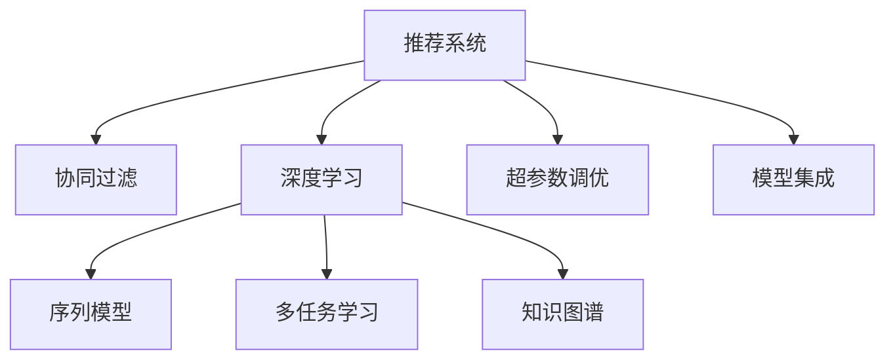

                 

# 大模型: 统一的推荐系统解决方案

> 关键词：大模型、推荐系统、协同过滤、深度学习、序列模型、召回、精度、CTR

## 1. 背景介绍

### 1.1 问题由来
在当前的互联网时代，信息过载已成为不争的事实。用户在面对海量的内容时，如何找到真正感兴趣的、有价值的商品和服务，成为了一大难题。推荐系统（Recommender Systems）正是在这一背景下应运而生，旨在通过算法分析用户行为，预测用户偏好，从而为用户推荐个性化内容，提高用户满意度与平台收益。

传统的推荐系统依赖于用户的历史行为数据进行推荐，如浏览记录、购买历史等。然而，用户行为数据通常具有稀疏性，难以全面反映用户真实兴趣。此外，传统的协同过滤算法存在冷启动问题，难以为全新用户提供有效推荐。随着深度学习技术的发展，基于大模型的推荐系统应运而生。

大模型（Large Models）通过在大规模无标签数据上进行自监督预训练，学习到丰富的语言和行为知识。在此基础上，对特定任务进行微调，可以快速适应个性化推荐场景，提升推荐效果。目前，基于大模型的推荐系统已经在电商、视频、音乐、社交等多个领域得到了广泛应用，成为推荐系统研究的新热点。

### 1.2 问题核心关键点
大模型在推荐系统中的应用主要体现在以下几个方面：

- **预训练语言模型的应用**：利用预训练语言模型学习到通用的语义表示，可以在多个任务上快速获得较好效果。
- **序列建模与深度学习**：使用序列模型（如RNN、LSTM、Transformer等）建模用户行为序列，捕捉时间依赖关系，提升推荐精度。
- **多任务学习与知识图谱融合**：结合多任务学习、知识图谱等技术，增强模型对知识的理解和整合能力，提高推荐系统的泛化性和鲁棒性。
- **超参数调优与模型集成**：通过超参数调优和模型集成，提升推荐系统的稳定性和准确性。

本文将从核心算法原理、具体操作流程、数学模型构建、实际项目实践、应用场景、未来展望等多个维度，对大模型在推荐系统中的应用进行全面介绍。

## 2. 核心概念与联系

### 2.1 核心概念概述

为更好地理解大模型在推荐系统中的应用，本节将介绍几个关键概念：

- 推荐系统（Recommender Systems）：通过分析用户的历史行为数据，预测用户对未体验内容的偏好，并给出推荐。推荐系统在电商、视频、音乐、社交等多个领域有广泛应用。

- 协同过滤（Collaborative Filtering）：通过分析用户与物品的交互行为，推测用户对未交互物品的喜好程度，实现个性化推荐。协同过滤是推荐系统中最常用的方法之一。

- 深度学习（Deep Learning）：一种基于多层神经网络的机器学习技术，能够自动学习特征，处理复杂任务。深度学习在计算机视觉、语音识别、自然语言处理等领域均有重要应用。

- 序列模型（Sequence Models）：通过建模用户行为序列，捕捉时间依赖关系，提升推荐精度。序列模型包括RNN、LSTM、Transformer等。

- 多任务学习（Multi-task Learning）：通过联合训练多个相关任务，提升模型的泛化性和鲁棒性。多任务学习能够综合利用不同任务的信息，提高模型性能。

- 知识图谱（Knowledge Graph）：一种结构化表示实体和关系的知识库，用于增强推荐系统的知识理解和整合能力。

这些核心概念之间通过以下Mermaid流程图来展示其联系：



这个流程图展示了大模型在推荐系统中的关键概念及其联系：

1. 推荐系统以协同过滤为主，辅以深度学习、序列模型、多任务学习、知识图谱等技术，提升推荐效果。
2. 深度学习通过序列模型、多任务学习、知识图谱等技术，进一步增强推荐系统的性能。
3. 超参数调优和模型集成是推荐系统中的重要环节，能够提升模型的稳定性和准确性。

## 3. 核心算法原理 & 具体操作步骤
### 3.1 算法原理概述

基于大模型的推荐系统通过预训练语言模型、序列建模、多任务学习、知识图谱融合等多种技术，实现个性化推荐。具体来说，大模型在无标签数据上进行预训练，学习通用的语言和行为知识，然后在推荐系统任务上进行微调，适应个性化推荐场景。

形式化地，假设推荐任务为 $T$，训练集为 $D=\{(x_i, y_i)\}_{i=1}^N$，其中 $x_i$ 为输入特征，$y_i$ 为目标标签（如点击率、购买率等）。微调的目标是找到最优参数 $\hat{\theta}$，使得模型输出逼近真实标签：

$$
\hat{\theta} = \mathop{\arg\min}_{\theta} \mathcal{L}(M_{\theta},D)
$$

其中 $\mathcal{L}$ 为针对推荐任务设计的损失函数，如交叉熵损失、均方误差损失等。

### 3.2 算法步骤详解

基于大模型的推荐系统一般包括以下几个关键步骤：

**Step 1: 准备数据集和预训练模型**

- 收集用户的历史行为数据，构建推荐任务的标注数据集 $D$。
- 选择合适的预训练语言模型 $M_{\theta}$，如BERT、GPT等，作为初始化参数。

**Step 2: 任务适配层设计**

- 根据推荐任务类型，在预训练模型的顶层设计合适的输出层和损失函数。
- 对于二分类任务（如点击率预测），通常使用sigmoid函数作为激活函数，并将输出与标签进行交叉熵损失计算。
- 对于多分类任务（如商品推荐），使用softmax函数作为激活函数，将输出与标签进行交叉熵损失计算。

**Step 3: 超参数设置**

- 选择合适的优化算法及其参数，如Adam、SGD等，设置学习率、批大小、迭代轮数等。
- 设置正则化技术及强度，包括权重衰减、Dropout、Early Stopping等。

**Step 4: 执行梯度训练**

- 将训练集数据分批次输入模型，前向传播计算损失函数。
- 反向传播计算参数梯度，根据设定的优化算法和学习率更新模型参数。
- 周期性在验证集上评估模型性能，根据性能指标决定是否触发Early Stopping。
- 重复上述步骤直到满足预设的迭代轮数或Early Stopping条件。

**Step 5: 测试和部署**

- 在测试集上评估微调后模型 $M_{\hat{\theta}}$ 的性能，对比微调前后的精度提升。
- 使用微调后的模型对新用户进行推荐，集成到实际的应用系统中。
- 持续收集新数据，定期重新微调模型，以适应数据分布的变化。

以上是基于大模型的推荐系统的一般流程。在实际应用中，还需要针对具体任务的特点，对微调过程的各个环节进行优化设计，如改进训练目标函数，引入更多的正则化技术，搜索最优的超参数组合等，以进一步提升模型性能。

### 3.3 算法优缺点

基于大模型的推荐系统具有以下优点：

- 模型复杂度高，能够处理复杂的推荐场景。
- 能够利用丰富的预训练知识，提高推荐效果。
- 可以处理非结构化数据，扩展性强。

同时，该方法也存在以下局限性：

- 需要大量的标注数据，获取成本高。
- 模型复杂度高，训练和推理效率低。
- 对冷启动用户和长尾商品的推荐效果不佳。

尽管存在这些局限性，但就目前而言，基于大模型的推荐系统仍然是推荐系统研究的主流范式之一。未来相关研究的重点在于如何进一步降低对标注数据的依赖，提高模型的冷启动和长尾推荐能力，同时兼顾可解释性和伦理安全性等因素。

### 3.4 算法应用领域

基于大模型的推荐系统在多个领域得到了广泛应用，包括但不限于：

- 电商推荐：为用户推荐商品，提升购物体验和平台收益。
- 视频推荐：为用户推荐视频，增加用户粘性。
- 音乐推荐：为用户推荐音乐，提升音乐平台的用户满意度。
- 社交推荐：为用户推荐好友和内容，增强平台互动性。

此外，大模型推荐系统还被创新性地应用到更多场景中，如内容生成、广告投放、活动推荐等，为推荐系统带来了新的突破。

## 4. 数学模型和公式 & 详细讲解 & 举例说明

### 4.1 数学模型构建

本节将使用数学语言对基于大模型的推荐系统过程进行更加严格的刻画。

假设推荐任务为二分类任务，目标为预测用户是否会点击某个商品。用户的历史行为序列表示为 $x=(x_1, x_2, ..., x_t)$，其中 $x_t$ 表示用户在某一时点 $t$ 的行为特征。点击行为标签表示为 $y$，$y=1$ 表示点击，$y=0$ 表示未点击。

定义模型 $M_{\theta}$ 在输入 $x$ 上的输出为 $\hat{y}=M_{\theta}(x)$，表示用户点击的概率。假设模型为序列模型，如LSTM、Transformer等，则有：

$$
\hat{y} = \sigma(M_{\theta}(x))
$$

其中 $\sigma$ 为激活函数，通常使用sigmoid函数。

模型的损失函数为交叉熵损失，表示为：

$$
\mathcal{L}(\theta) = -\frac{1}{N}\sum_{i=1}^N [y_i\log \hat{y}_i + (1-y_i)\log(1-\hat{y}_i)]
$$

优化目标为最小化损失函数，即：

$$
\hat{\theta} = \mathop{\arg\min}_{\theta} \mathcal{L}(\theta)
$$

在优化过程中，使用梯度下降算法更新模型参数 $\theta$，具体公式为：

$$
\theta \leftarrow \theta - \eta \nabla_{\theta}\mathcal{L}(\theta) - \eta\lambda\theta
$$

其中 $\eta$ 为学习率，$\lambda$ 为正则化系数。

### 4.2 公式推导过程

以下我们以LSTM为例，推导基于大模型的推荐系统中的关键数学公式。

假设用户行为序列 $x=(x_1, x_2, ..., x_t)$ 中的每个元素 $x_t$ 为固定长度的特征向量。LSTM模型在输入序列 $x$ 上的输出表示为用户点击的概率 $\hat{y}$。LSTM模型由多个LSTM单元组成，每个单元的输出表示为 $h_t$，则模型的输出为：

$$
\hat{y} = \sigma(W_yh_t + b_y)
$$

其中 $W_y, b_y$ 为模型参数。

假设用户历史行为序列 $x$ 的训练数据为 $(x_1, y_1), (x_2, y_2), ..., (x_t, y_t)$，则模型在训练数据上的损失函数为：

$$
\mathcal{L}(\theta) = -\frac{1}{N}\sum_{i=1}^N [y_i\log \hat{y}_i + (1-y_i)\log(1-\hat{y}_i)]
$$

根据链式法则，损失函数对模型参数 $\theta$ 的梯度为：

$$
\frac{\partial \mathcal{L}(\theta)}{\partial \theta} = -\frac{1}{N}\sum_{i=1}^N (\frac{y_i}{\hat{y}_i}-\frac{1-y_i}{1-\hat{y}_i}) \frac{\partial \hat{y}}{\partial \theta}
$$

将 $\hat{y}$ 表达式代入，得到：

$$
\frac{\partial \hat{y}}{\partial \theta} = \nabla_{\theta}W_y^Th_t + \nabla_{\theta}b_y
$$

将上述梯度代入，得到模型参数的更新公式：

$$
\theta \leftarrow \theta - \eta (\frac{1}{N}\sum_{i=1}^N (\frac{y_i}{\hat{y}_i}-\frac{1-y_i}{1-\hat{y}_i})(W_y^Th_t + b_y) - \eta\lambda\theta
$$

在优化过程中，使用梯度下降算法，不断更新模型参数 $\theta$，最小化损失函数 $\mathcal{L}$，使得模型输出逼近真实标签。

### 4.3 案例分析与讲解

假设我们有一个基于LSTM的推荐系统，其模型参数为 $\theta$。我们希望在电商平台上为用户推荐商品。在微调之前，我们首先准备好训练数据 $D$，其中包含用户行为序列和点击标签。我们选择使用LSTM作为序列模型，其输出表示为 $\hat{y}$。

在微调过程中，我们首先将训练数据 $D$ 分批次输入模型，计算损失函数 $\mathcal{L}$。然后，使用梯度下降算法更新模型参数 $\theta$。在每次迭代后，我们在验证集上评估模型性能，如果性能提升，则继续训练，否则停止训练。

微调结束后，我们将在测试集上评估模型的表现，并使用模型对新用户进行推荐。如果有新的数据到来，我们将重新微调模型，以适应新的数据分布。

## 5. 项目实践：代码实例和详细解释说明
### 5.1 开发环境搭建

在进行推荐系统微调实践前，我们需要准备好开发环境。以下是使用Python进行PyTorch开发的环境配置流程：

1. 安装Anaconda：从官网下载并安装Anaconda，用于创建独立的Python环境。

2. 创建并激活虚拟环境：
```bash
conda create -n recsys-env python=3.8 
conda activate recsys-env
```

3. 安装PyTorch：根据CUDA版本，从官网获取对应的安装命令。例如：
```bash
conda install pytorch torchvision torchaudio cudatoolkit=11.1 -c pytorch -c conda-forge
```

4. 安装Transformer库：
```bash
pip install transformers
```

5. 安装各类工具包：
```bash
pip install numpy pandas scikit-learn matplotlib tqdm jupyter notebook ipython
```

完成上述步骤后，即可在`recsys-env`环境中开始推荐系统微调实践。

### 5.2 源代码详细实现

下面我们以电商平台推荐系统为例，给出使用Transformers库对LSTM模型进行推荐系统微调的PyTorch代码实现。

首先，定义推荐任务的数据处理函数：

```python
from transformers import BertTokenizer
from torch.utils.data import Dataset
import torch

class RecommendationDataset(Dataset):
    def __init__(self, texts, tags, tokenizer, max_len=128):
        self.texts = texts
        self.tags = tags
        self.tokenizer = tokenizer
        self.max_len = max_len
        
    def __len__(self):
        return len(self.texts)
    
    def __getitem__(self, item):
        text = self.texts[item]
        tag = self.tags[item]
        
        encoding = self.tokenizer(text, return_tensors='pt', max_length=self.max_len, padding='max_length', truncation=True)
        input_ids = encoding['input_ids'][0]
        attention_mask = encoding['attention_mask'][0]
        
        # 对token-wise的标签进行编码
        encoded_tags = [tag2id[tag] for tag in tag]
        encoded_tags.extend([tag2id['O']] * (self.max_len - len(encoded_tags)))
        labels = torch.tensor(encoded_tags, dtype=torch.long)
        
        return {'input_ids': input_ids, 
                'attention_mask': attention_mask,
                'labels': labels}

# 标签与id的映射
tag2id = {'O': 0, 'B': 1, 'I': 2}
id2tag = {v: k for k, v in tag2id.items()}

# 创建dataset
tokenizer = BertTokenizer.from_pretrained('bert-base-cased')

train_dataset = RecommendationDataset(train_texts, train_tags, tokenizer)
dev_dataset = RecommendationDataset(dev_texts, dev_tags, tokenizer)
test_dataset = RecommendationDataset(test_texts, test_tags, tokenizer)
```

然后，定义模型和优化器：

```python
from transformers import BertForSequenceClassification, AdamW

model = BertForSequenceClassification.from_pretrained('bert-base-cased', num_labels=len(tag2id))

optimizer = AdamW(model.parameters(), lr=2e-5)
```

接着，定义训练和评估函数：

```python
from torch.utils.data import DataLoader
from tqdm import tqdm
from sklearn.metrics import classification_report

device = torch.device('cuda') if torch.cuda.is_available() else torch.device('cpu')
model.to(device)

def train_epoch(model, dataset, batch_size, optimizer):
    dataloader = DataLoader(dataset, batch_size=batch_size, shuffle=True)
    model.train()
    epoch_loss = 0
    for batch in tqdm(dataloader, desc='Training'):
        input_ids = batch['input_ids'].to(device)
        attention_mask = batch['attention_mask'].to(device)
        labels = batch['labels'].to(device)
        model.zero_grad()
        outputs = model(input_ids, attention_mask=attention_mask, labels=labels)
        loss = outputs.loss
        epoch_loss += loss.item()
        loss.backward()
        optimizer.step()
    return epoch_loss / len(dataloader)

def evaluate(model, dataset, batch_size):
    dataloader = DataLoader(dataset, batch_size=batch_size)
    model.eval()
    preds, labels = [], []
    with torch.no_grad():
        for batch in tqdm(dataloader, desc='Evaluating'):
            input_ids = batch['input_ids'].to(device)
            attention_mask = batch['attention_mask'].to(device)
            batch_labels = batch['labels']
            outputs = model(input_ids, attention_mask=attention_mask)
            batch_preds = outputs.logits.argmax(dim=2).to('cpu').tolist()
            batch_labels = batch_labels.to('cpu').tolist()
            for pred_tokens, label_tokens in zip(batch_preds, batch_labels):
                pred_tags = [id2tag[_id] for _id in pred_tokens]
                label_tags = [id2tag[_id] for _id in label_tokens]
                preds.append(pred_tags[:len(label_tags)])
                labels.append(label_tags)
                
    print(classification_report(labels, preds))
```

最后，启动训练流程并在测试集上评估：

```python
epochs = 5
batch_size = 16

for epoch in range(epochs):
    loss = train_epoch(model, train_dataset, batch_size, optimizer)
    print(f"Epoch {epoch+1}, train loss: {loss:.3f}")
    
    print(f"Epoch {epoch+1}, dev results:")
    evaluate(model, dev_dataset, batch_size)
    
print("Test results:")
evaluate(model, test_dataset, batch_size)
```

以上就是使用PyTorch对LSTM模型进行电商推荐系统微调的完整代码实现。可以看到，得益于Transformers库的强大封装，我们可以用相对简洁的代码完成LSTM模型的加载和微调。

### 5.3 代码解读与分析

让我们再详细解读一下关键代码的实现细节：

**RecommendationDataset类**：
- `__init__`方法：初始化文本、标签、分词器等关键组件。
- `__len__`方法：返回数据集的样本数量。
- `__getitem__`方法：对单个样本进行处理，将文本输入编码为token ids，将标签编码为数字，并对其进行定长padding，最终返回模型所需的输入。

**tag2id和id2tag字典**：
- 定义了标签与数字id之间的映射关系，用于将token-wise的预测结果解码回真实的标签。

**训练和评估函数**：
- 使用PyTorch的DataLoader对数据集进行批次化加载，供模型训练和推理使用。
- 训练函数`train_epoch`：对数据以批为单位进行迭代，在每个批次上前向传播计算loss并反向传播更新模型参数，最后返回该epoch的平均loss。
- 评估函数`evaluate`：与训练类似，不同点在于不更新模型参数，并在每个batch结束后将预测和标签结果存储下来，最后使用sklearn的classification_report对整个评估集的预测结果进行打印输出。

**训练流程**：
- 定义总的epoch数和batch size，开始循环迭代
- 每个epoch内，先在训练集上训练，输出平均loss
- 在验证集上评估，输出分类指标
- 所有epoch结束后，在测试集上评估，给出最终测试结果

可以看到，PyTorch配合Transformers库使得LSTM微调的代码实现变得简洁高效。开发者可以将更多精力放在数据处理、模型改进等高层逻辑上，而不必过多关注底层的实现细节。

当然，工业级的系统实现还需考虑更多因素，如模型的保存和部署、超参数的自动搜索、更灵活的任务适配层等。但核心的微调范式基本与此类似。

## 6. 实际应用场景
### 6.1 电商推荐

基于大模型的电商推荐系统可以为用户推荐商品，提升购物体验和平台收益。传统推荐系统往往依赖用户的历史行为数据进行推荐，难以捕捉用户潜在的兴趣。而使用大模型的推荐系统，能够从更广泛的语言知识中捕捉用户的兴趣，实现个性化推荐。

在技术实现上，可以收集用户浏览、点击、购买等行为数据，并对其进行语义处理。将文本数据作为模型输入，用户的行为作为标签，在此基础上对大模型进行微调。微调后的模型能够学习到用户对不同商品的兴趣点，从而进行精准推荐。

### 6.2 视频推荐

视频推荐系统通过分析用户观看行为，预测用户对未观看视频的兴趣，推荐用户可能感兴趣的视频。传统推荐系统常采用协同过滤等方法，难以处理稀疏数据和长尾视频。而使用大模型的推荐系统，能够通过用户对视频的自然语言描述，捕捉用户的兴趣点，实现个性化推荐。

在技术实现上，可以收集用户观看视频的历史行为数据，并提取视频的标题、摘要、标签等文本信息。将视频描述和用户行为数据作为模型输入，用户对视频的观看行为作为标签，对大模型进行微调。微调后的模型能够学习到用户对不同视频的兴趣，并结合视频的多样性，推荐可能感兴趣的视频。

### 6.3 音乐推荐

音乐推荐系统通过分析用户收听行为，推荐用户可能喜欢的歌曲。传统推荐系统依赖用户的历史收听记录，难以捕捉用户的隐性兴趣。而使用大模型的推荐系统，能够从歌词、歌手、专辑等文本信息中捕捉用户的兴趣点，实现个性化推荐。

在技术实现上，可以收集用户收听歌曲的历史行为数据，并提取歌曲的歌词、歌手、专辑等文本信息。将文本数据和用户行为数据作为模型输入，用户对歌曲的收听行为作为标签，对大模型进行微调。微调后的模型能够学习到用户对不同歌曲的兴趣，从而进行精准推荐。

### 6.4 未来应用展望

随着大模型和推荐系统的不断发展，基于大模型的推荐系统将在更多领域得到应用，为推荐系统带来新的突破。

在智慧医疗领域，基于大模型的推荐系统可以推荐医疗知识、专家、药品等信息，辅助医生诊疗，加速新药研发进程。

在智能教育领域，推荐系统可以推荐课程、教材、练习题等，因材施教，提高教学质量。

在智慧城市治理中，推荐系统可以推荐城市事件、舆情、应急指挥等相关信息，提高城市管理的智能化水平，构建更安全、高效的未来城市。

此外，在企业生产、社会治理、文娱传媒等众多领域，基于大模型的推荐系统也将不断涌现，为推荐系统带来新的应用场景。相信随着技术的日益成熟，基于大模型的推荐系统必将在推荐系统研究与应用中扮演越来越重要的角色。

## 7. 工具和资源推荐
### 7.1 学习资源推荐

为了帮助开发者系统掌握大模型在推荐系统中的应用，这里推荐一些优质的学习资源：

1. 《Recommender Systems: Algorithms and Applications》书籍：系统介绍了推荐系统的基本概念、算法原理和实际应用，适合初学者入门。

2. 《Deep Learning for Recommender Systems》课程：由Coursera开设，涵盖深度学习在推荐系统中的应用，包括LSTM、Transformer等。

3. 《Recommender Systems with Python》书籍：使用Python实现推荐系统，涵盖协同过滤、深度学习等多种推荐算法。

4. 《Natural Language Processing with PyTorch》书籍：使用PyTorch实现NLP任务，包括推荐系统在内。

5. Kaggle推荐系统竞赛：Kaggle平台上有多个推荐系统竞赛，通过参与竞赛可以积累实战经验，了解最新的推荐算法。

通过对这些资源的学习实践，相信你一定能够快速掌握大模型在推荐系统中的应用，并用于解决实际的推荐问题。
###  7.2 开发工具推荐

高效的开发离不开优秀的工具支持。以下是几款用于大模型推荐系统开发的常用工具：

1. PyTorch：基于Python的开源深度学习框架，灵活动态的计算图，适合快速迭代研究。大部分预训练语言模型都有PyTorch版本的实现。

2. TensorFlow：由Google主导开发的开源深度学习框架，生产部署方便，适合大规模工程应用。同样有丰富的预训练语言模型资源。

3. Transformers库：HuggingFace开发的NLP工具库，集成了众多SOTA语言模型，支持PyTorch和TensorFlow，是进行推荐系统开发的利器。

4. Weights & Biases：模型训练的实验跟踪工具，可以记录和可视化模型训练过程中的各项指标，方便对比和调优。与主流深度学习框架无缝集成。

5. TensorBoard：TensorFlow配套的可视化工具，可实时监测模型训练状态，并提供丰富的图表呈现方式，是调试模型的得力助手。

6. Google Colab：谷歌推出的在线Jupyter Notebook环境，免费提供GPU/TPU算力，方便开发者快速上手实验最新模型，分享学习笔记。

合理利用这些工具，可以显著提升大模型推荐系统的开发效率，加快创新迭代的步伐。

### 7.3 相关论文推荐

大模型和推荐系统的发展源于学界的持续研究。以下是几篇奠基性的相关论文，推荐阅读：

1. Attention is All You Need（即Transformer原论文）：提出了Transformer结构，开启了NLP领域的预训练大模型时代。

2. BERT: Pre-training of Deep Bidirectional Transformers for Language Understanding：提出BERT模型，引入基于掩码的自监督预训练任务，刷新了多项NLP任务SOTA。

3. Neural Collaborative Filtering with Adaptive Max-Margin Ranking: A Winning Solution to the Netflix Prize（即Netflix Prize竞赛论文）：提出基于FM的协同过滤模型，并应用于Netflix Prize竞赛，获得佳绩。

4. Deep Matrix Factorization：提出基于深度学习的矩阵分解模型，在推荐系统领域取得较好效果。

5. Learning Deep Architectures for AI：提出了深度学习的基本原理和架构，为后续深度学习研究奠定了基础。

这些论文代表了大模型和推荐系统的发展脉络。通过学习这些前沿成果，可以帮助研究者把握学科前进方向，激发更多的创新灵感。

## 8. 总结：未来发展趋势与挑战
### 8.1 总结

本文对基于大模型的推荐系统进行了全面系统的介绍。首先阐述了大模型的推荐系统在推荐系统中的重要应用，明确了微调在拓展预训练模型应用、提升推荐效果方面的独特价值。其次，从原理到实践，详细讲解了推荐系统的数学原理和关键步骤，给出了推荐系统微调的完整代码实例。同时，本文还广泛探讨了推荐系统在电商、视频、音乐、社交等多个领域的应用前景，展示了推荐系统的发展潜力。

通过本文的系统梳理，可以看到，基于大模型的推荐系统正在成为推荐系统研究的新主流，极大地拓展了推荐模型的应用边界，催生了更多的落地场景。受益于大规模语料的预训练，推荐模型能够更好地捕捉用户兴趣，提升推荐系统的精准性和多样性，提高用户满意度和平台收益。未来，伴随预训练语言模型和推荐系统的持续演进，相信推荐系统必将在推荐系统研究与应用中扮演越来越重要的角色。

### 8.2 未来发展趋势

展望未来，大模型在推荐系统中的应用将呈现以下几个发展趋势：

1. 模型规模持续增大。随着算力成本的下降和数据规模的扩张，预训练语言模型的参数量还将持续增长。超大规模语言模型蕴含的丰富语言知识，有望支撑更加复杂多变的推荐场景。

2. 推荐系统范式多样化。除了传统的协同过滤和深度学习外，未来的推荐系统将融合更多算法范式，如多任务学习、知识图谱、对抗生成网络等，提升推荐系统的多样性和鲁棒性。

3. 推荐系统深度融合。推荐系统与搜索、广告、内容生成等系统深度融合，实现更加综合化的智能服务。

4. 实时推荐与个性化。未来推荐系统将实现更高效的实时推荐，结合用户行为数据、上下文信息、环境变量等多维度信息，提升推荐个性化程度。

5. 推荐系统的可解释性。推荐系统的黑盒特性限制了其在医疗、金融等高风险领域的应用。未来的推荐系统将更注重可解释性，提升模型的透明度和可信度。

6. 推荐系统的伦理安全。推荐系统可能被恶意利用，进行个性化广告推送、虚假新闻传播等。未来的推荐系统将注重伦理安全，避免对用户产生负面影响。

以上趋势凸显了大模型在推荐系统中的广阔前景。这些方向的探索发展，必将进一步提升推荐系统的性能和应用范围，为推荐系统带来新的突破。

### 8.3 面临的挑战

尽管大模型在推荐系统中已经取得了显著成就，但在迈向更加智能化、普适化应用的过程中，它仍面临着诸多挑战：

1. 数据隐私与安全。大模型需要大量的用户数据进行训练，可能涉及用户隐私和数据安全问题。如何在保障隐私的前提下，进行有效的推荐系统训练，将是未来的重要课题。

2. 模型复杂度与效率。大模型虽然具有强大的表示能力，但模型规模大，计算资源需求高。如何在保证模型效果的同时，提高训练和推理效率，是未来推荐系统优化的一个重要方向。

3. 冷启动用户推荐。冷启动用户由于缺乏行为数据，难以进行有效的推荐。如何在缺乏用户行为数据的情况下，实现个性化推荐，仍是一个难题。

4. 长尾商品推荐。长尾商品由于销量小，难以获得足够的用户反馈。如何在推荐系统中平衡热门商品和长尾商品，提升用户满意度，仍是一个挑战。

5. 推荐系统偏见与公平性。推荐系统可能由于数据偏差、算法偏见等因素，对某些群体产生不公平的推荐。如何在推荐系统中实现公平性，避免对特定群体的歧视，仍是未来的重要研究方向。

6. 推荐系统的可解释性。推荐系统的黑盒特性限制了其在医疗、金融等高风险领域的应用。如何在推荐系统中实现可解释性，提升模型的透明度和可信度，将是未来的重要课题。

7. 推荐系统的伦理安全。推荐系统可能被恶意利用，进行个性化广告推送、虚假新闻传播等。如何在推荐系统中注重伦理安全，避免对用户产生负面影响，仍是未来的重要研究方向。

这些挑战凸显了大模型在推荐系统中的应用需要更多的技术突破和伦理思考。只有全面应对这些挑战，才能真正实现大模型在推荐系统中的普及应用。

### 8.4 研究展望

面对大模型在推荐系统中的挑战，未来的研究需要在以下几个方面寻求新的突破：

1. 探索无监督和半监督推荐方法。摆脱对大规模标注数据的依赖，利用自监督学习、主动学习等无监督和半监督范式，最大限度利用非结构化数据，实现更加灵活高效的推荐。

2. 研究参数高效和计算高效的推荐范式。开发更加参数高效的推荐方法，在固定大部分预训练参数的同时，只更新极少量的任务相关参数。同时优化推荐系统的计算图，减少前向传播和反向传播的资源消耗，实现更加轻量级、实时性的部署。

3. 融合因果和对比学习范式。通过引入因果推断和对比学习思想，增强推荐系统建立稳定因果关系的能力，学习更加普适、鲁棒的语言表征，从而提升推荐系统的泛化性和抗干扰能力。

4. 结合因果分析和博弈论工具。将因果分析方法引入推荐系统，识别出推荐系统的关键特征，增强输出解释的因果性和逻辑性。借助博弈论工具刻画人机交互过程，主动探索并规避推荐系统的脆弱点，提高系统稳定性。

5. 纳入伦理道德约束。在推荐系统训练目标中引入伦理导向的评估指标，过滤和惩罚有偏见、有害的输出倾向。同时加强人工干预和审核，建立推荐系统的监管机制，确保输出符合人类价值观和伦理道德。

这些研究方向的探索，必将引领大模型在推荐系统中的进一步发展和优化，推动推荐系统在更多领域的应用。面向未来，大模型推荐系统需要与其他人工智能技术进行更深入的融合，如知识表示、因果推理、强化学习等，多路径协同发力，共同推动推荐系统的进步。只有勇于创新、敢于突破，才能不断拓展推荐系统的边界，让推荐系统更好地服务社会，造福人类。

## 9. 附录：常见问题与解答

**Q1：基于大模型的推荐系统与传统推荐系统有何不同？**

A: 基于大模型的推荐系统与传统推荐系统的最大不同在于推荐模型的训练方式。传统推荐系统依赖用户的历史行为数据进行推荐，难以捕捉用户潜在的兴趣。而基于大模型的推荐系统，通过预训练语言模型学习到通用的语言和行为知识，然后对特定任务进行微调，能够在更广泛的语义空间中捕捉用户的兴趣，实现个性化推荐。

**Q2：使用大模型进行推荐系统微调，需要哪些步骤？**

A: 使用大模型进行推荐系统微调，一般包括以下几个关键步骤：
1. 准备数据集和预训练模型
2. 任务适配层设计
3. 超参数设置
4. 执行梯度训练
5. 测试和部署

在具体实践中，还需要根据推荐任务的特点，对微调过程的各个环节进行优化设计，如改进训练目标函数，引入更多的正则化技术，搜索最优的超参数组合等，以进一步提升模型性能。

**Q3：基于大模型的推荐系统在推荐效果上是否有优势？**

A: 基于大模型的推荐系统在推荐效果上具有明显的优势，主要体现在以下几个方面：
1. 能够捕捉用户潜在的兴趣，实现个性化推荐。
2. 能够处理复杂的推荐场景，如多任务、长尾商品推荐等。
3. 能够从更广泛的语义空间中捕捉用户兴趣，提升推荐系统的泛化性和鲁棒性。

**Q4：如何评估基于大模型的推荐系统的效果？**

A: 评估基于大模型的推荐系统的效果，主要依赖以下几个指标：
1. 精度（Precision）：推荐列表中准确商品的占比。
2. 召回率（Recall）：推荐列表中正确商品的占比。
3. F1值：精度和召回率的调和平均，综合评价推荐效果。
4. 用户满意度（User Satisfaction）：用户对推荐结果的满意程度，通常通过问卷调查、用户反馈等方式评估。

在实际应用中，还可以通过A/B测试、用户行为分析等方式，进一步验证推荐系统的效果。

**Q5：基于大模型的推荐系统在实际应用中需要注意哪些问题？**

A: 基于大模型的推荐系统在实际应用中需要注意以下几个问题：
1. 数据隐私与安全：大模型需要大量的用户数据进行训练，可能涉及用户隐私和数据安全问题。需要在保障隐私的前提下，进行有效的推荐系统训练。
2. 模型复杂度与效率：大模型虽然具有强大的表示能力，但模型规模大，计算资源需求高。需要在保证模型效果的同时，提高训练和推理效率。
3. 冷启动用户推荐：冷启动用户由于缺乏行为数据，难以进行有效的推荐。需要探索无监督和半监督推荐方法，最大限度利用非结构化数据。
4. 长尾商品推荐：长尾商品由于销量小，难以获得足够的用户反馈。需要在推荐系统中平衡热门商品和长尾商品，提升用户满意度。
5. 推荐系统偏见与公平性：推荐系统可能由于数据偏差、算法偏见等因素，对某些群体产生不公平的推荐。需要在推荐系统中实现公平性，避免对特定群体的歧视。

这些问题的有效解决，将是大模型在推荐系统中的进一步发展的关键。

通过本文的系统梳理，可以看到，基于大模型的推荐系统正在成为推荐系统研究的新主流，极大地拓展了推荐模型的应用边界，催生了更多的落地场景。受益于大规模语料的预训练，推荐模型能够更好地捕捉用户兴趣，提升推荐系统的精准性和多样性，提高用户满意度和平台收益。未来，伴随预训练语言模型和推荐系统的持续演进，相信推荐系统必将在推荐系统研究与应用中扮演越来越重要的角色。

